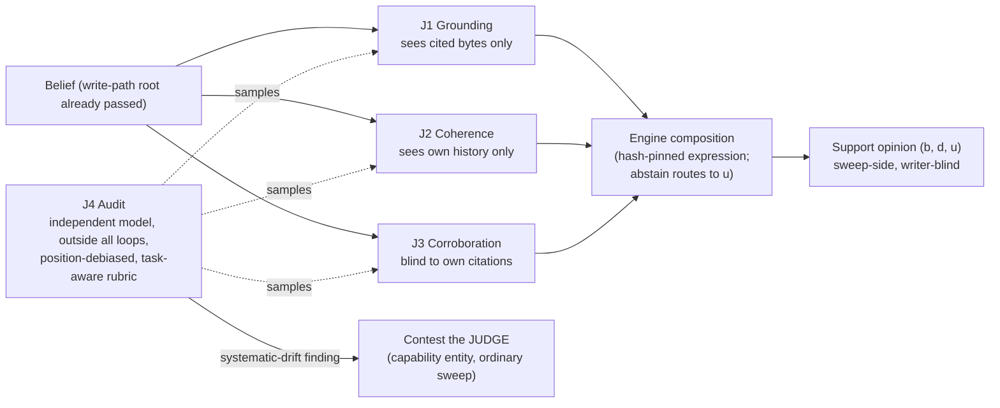

# The Four-Judge System — Design Record

**Status: PROPOSED — DESIGN ONLY.** Nothing implemented, measured, or
accepted. July 16, 2026. Document-driven design: this record leads; any
implementation follows it as a separately authorized bounded feature.

**Reconciliation flag (read first — updated July 16, 2026, late
session).** This record was architected from the program's evidence
base *without* sight of the collaborator's system. **The collaborator's
design has now been supplied and committed verbatim as
[`FOUR_JUDGE_BASIC_MODEL.md`](FOUR_JUDGE_BASIC_MODEL.md)** (register
S10, claims R-28…R-30). Its central reframe: the "four" are
**hyperplane parameter registries**, not four judges; a judge is a
sparse selection from them; the working system is an **ecology**. This
record's four roles read, under that frame, as a *minimal ecology
instance for belief-support* — the layers compose rather than compete.
Ingestion and reconciliation are Session 66's first task (§10.1);
until owner ratification, neither design is authoritative over the
other.

**Third amendment (July 17, 2026, Session 66): §10.1 item 1 is
EXECUTED.** The reconciliation record —
[`RECONCILIATION.md`](RECONCILIATION.md) — carries the layer mapping,
the four completed role definitions in S10's YAML schema with
per-field sources, the adopted composition design (R-29 hard
compatibility gate; R-30 no-global-section), the per-role verdicts
with falsifiers, and the enforcement/pin table. The panel drills of §7
items 1–3 are implemented in the same PR
(`npm run test:judge-panel`). **Fourth amendment (July 18, 2026,
Session 67): RATIFIED.** RECONCILIATION §7 carries the owner's dated
entry. The verdicts there are binding, the co-equality is ended, and
**RECONCILIATION.md governs this record wherever the two differ** — its
layer mapping, completed role definitions, composition design (R-29,
R-30), and §5 enforcement table are authoritative. This record stands as
the architecture it graduated from; read it with RECONCILIATION beside
it. `JUDGE_COMPOSITION_GAME.md` §11 was ratified in the same act.

**Fifth amendment (dated note — July 19, 2026, Session 71; a
correction pointer, not a re-decision).** This record's §3 is the
origin of the standing-roster idiom that later documents inherited —
"a fifth judge with a blindness profile **already on the panel**", the
role table with per-role drawback classes fixed inline, and §5's
anchor discipline stated **per role** with fixtures byte-pinned ahead
of any candidate. Its own §1 already says the four are "a *minimal
ecology instance for belief-support*"; the operative sections do not
honor that framing, and the framing is what governs. Under
`JUDGE_COMPOSITION_GAME.md` §6 rule 4 and the owner's July 19, 2026
ruling, **there is no default cast**: the four are role *slots*, each
buying a blindness the others lack, and every judge filling one is
composed for its context from the S10 registries. §5's per-role anchor
discipline is consequently under re-decision — anchors calibrate a
taxonomy, and belief-facing taxonomies do not exist until a
composition does. See
[`COMPOSITION_FROM_PRIMITIVES.md`](../../architecture/COMPOSITION_FROM_PRIMITIVES.md)
for the principle and the case that produced it.

Program context: [`PROGRAM_CONTEXT.md`](PROGRAM_CONTEXT.md). Parent
design record: [`docs/architecture/EPISTEMIC_SUPPORT.md`](../../architecture/EPISTEMIC_SUPPORT.md)
(the original review-series proposal it graduated from was removed at
owner direction at PR #119 merge review; branch history retains it).
Evidence register: [`RESEARCH_MAP.md`](RESEARCH_MAP.md). Prompt-facing
contracts: [`JUDGE_CONTRACT_TEMPLATE.md`](JUDGE_CONTRACT_TEMPLATE.md).
Adoption bounds (binding on this design): RESEARCH_MAP §"Adoption
bounds register".

---

## 1. Problem statement

The support plane (parent record §2–§3) needs judged inputs: events
that move a belief's (b, d, u) opinion. The naive design — one LLM
judge per belief — fails on the program's own evidence three ways:

1. **Shared blind spots.** A bare LLM judge shares architecture,
   training distribution, and failure modes with the writer it grades;
   S1 observed judge-solver agreement drift "before any optimization
   pressure exists," and S8 gives the mechanistic frame: judge and
   writer both reason through a capacity-limited workspace of the same
   kind (R-20).
2. **Verbalized ≠ driving.** A judge can state the right criterion and
   act otherwise — S8's dissociation (R-21) and Trellis's laundering
   agents (R-11), which read the truth and cited the decoy. A judge's
   *stated* rubric compliance is not evidence of rubric-driven verdicts.
3. **Bag-of-concepts readouts.** S8 §9.1: a single readout shows which
   concepts are present but not how they bind. A single judge's verdict
   is one unstructured projection of the evidence; differently
   structured projections catch what any one misses.

The answer with precedent in both evidence lines (S1's
detector-composition; the parent record §4.5's independence rules) is a
**small panel of differently-blind judges whose verdicts are composed
by engine code** — never averaged informally, never chained through any
model's attention (R-23: externalize intermediate state; a verdict is
engine state the moment it exists).

## 2. Doctrine (inherited, binding)

- **Drawback-first**: every verdict is `drawback | clean | abstain`
  with a named drawback class from a closed per-role taxonomy; `clean`
  means *no known drawback found*, never certified correctness (R-01).
- **Abstention feeds uncertainty**, never belief or disbelief (parent
  §3).
- **Writer-blind**: no judge output, score, or panel composition is
  visible to the writing agent; no task spec carries a count-shaped
  incentive (AB-5).
- **Gate/audit separation**: the judge that gates and the judge that
  audits are different roles, different loops, and by default different
  model families (parent §4.5; AB-9).
- **Judges are capabilities**: every judge is a registered manifest
  (rubric hash, anchor-set hashes, taxonomy version) the invalidation
  sweep can contest (parent §4.4).
- **Anchor labels may be model-produced** (AB-4 as amended July 16,
  2026 by owner ruling); fixtures are byte-pinned once labeled, refresh
  stays a human ceremony, and the labeler is never given a count-shaped
  incentive (AB-5 binds the labeler too).

## 3. The four roles

Four roles because four **distinct blindness profiles** cover the
failure classes in evidence; a fifth judge with a blindness profile
already on the panel adds cost, not coverage (§9 falsifier). Each role
states what it sees, what it is structurally blind to, and which
evidence motivates it.

| Role | Sees | Deliberately blind to | Verdict domain | Cost tier | Evidence basis |
|---|---|---|---|---|---|
| **J1 — Grounding** | the claim + the exact cited source bytes, nothing else | the graph, other beliefs, consensus, authority | does the cited evidence support this claim? (`unsupported_citation`, `overclaimed_evidence`, …) | judge op (one narrow LLM question) | The only gate that held 0% under laundering pressure (R-11); already exists as `entailment_detection.ts` |
| **J2 — Coherence** | the claim + its own history (prior versions, contest/recovery record) + its claim-kind position when that plane exists | all external evidence | is the belief internally coherent and plane-consistent? (`self-contradictory`, `kind-incoherent`, `history-inconsistent`) | static + judge op | Coherence calibration as tooling (R-18); cross-plane invariants (parent §2.1) |
| **J3 — Corroboration** | independent live evidence: other beliefs with disjoint sources, authority-registry documents | the belief's *own* citations (prevents circular corroboration) | is the claim independently corroborated or contradicted? (`uncorroborated`, `authority-contradicted`) | static + execution ops | Detectability spectrum (R-05); authority registry (parent §5); poison drill (R-12) |
| **J4 — Audit** | sampled (judge, verdict, evidence) triples from J1–J3; pairwise comparisons under a task-aware rubric, judged twice with positions swapped | the live gating path — J4 runs outside every loop and **never gates a belief** | are the other judges judging well? (`rubric-gamed`, `convention-blind`, `systematic-drift`) | independent stronger model | S1's 2×2: the audit caught what the loops could not, and the audit itself needed the task contract (R-06) |

**Disagreement is data, not noise.** J1-clean + J3-drawback is a typed
conflict signal (claim supported by its citations but contradicted by
independent authority) that feeds `d` *and* flags the belief for the
existing conflict path. The composition never silently majority-votes
across roles that measure different things.

## 4. Composition into the support plane

J1–J3 verdicts are events consumed by the support computation (parent
§3) through a metric expression in the S1 grammar — the fixed root
(write-path gates, already enforced) conjoined with a hand-authored
composition; first edition, no evolution machinery (AB-8):

```
support_metric_v1 = root ∧ ( any(J1.drawbacks) ∨ any(J2.drawbacks) ∨ any(J3.drawbacks) )
```

with per-role weight keys resolved by the computation module, and every
abstain routed to `u`. The expression string + role taxonomy versions
are hash-pinned (`metricSha`, parent §4.2).

**Dated amendment (July 17, 2026, Session 66):** the composition
adopts the two S10 structural imports per §10.1 item 1(c), specified
in [`RECONCILIATION.md`](RECONCILIATION.md) §3 and pinned by
`npm run test:judge-panel`: the hard compatibility/applicability gates
(R-29 — typed counted exclusions, never a similarity score, fail-closed
when nothing survives) and the no-global-section outcome (R-30 —
qualified-parameter overlap conflicts emit a typed conflict record and
withhold the conflicted verdicts from evidence accumulation, u-dominant,
never a blend). The §3 "disagreement is data" rule and R-30 resolve to
different boundaries (cross-role vs same-jurisdiction) —
RECONCILIATION §3.3 carries the explicit resolution and its falsifier.

**J4 composes differently by design.** Its verdicts never touch a
belief's opinion. A J4 `systematic-drift` finding against a judge
contests **the judge** — the capability entity — through the ordinary
sweep (parent §4.4), excluding it from composition pending human
re-review. This is the "who grades the grader" loop closed natively:
anchors keep a judge honest prospectively; J4 catches what anchors
miss retrospectively; registration makes the consequence governable.



## 5. Anchors and lifecycle

> **Amended July 19, 2026 (owner ruling, Session 71).** Anchors are
> **per composition, not per role**, and they **compose at
> instantiation** from the domain's own content space — the categories
> that compose them are the only prior. There is no committed
> byte-pinned fixture authored ahead of a candidate, because the
> taxonomy an anchor calibrates does not exist until a composition
> does. The ten-item five-and-five shape survives; where it binds
> moves. Validation moves with it: the validity gate (no
> all-pass/all-fail/all-abstain) runs at composition time and the
> composing agent retries on failure, which is where R-02's protection
> actually lives — it is taxonomy-agnostic and survives the move
> intact. "Byte-pinned" now binds on the write-once promotion record
> that stores the composed anchors. AB-8 was amended in the same act.
> See [`JUDGE_COMPOSITION_CEREMONY.md`](JUDGE_COMPOSITION_CEREMONY.md)
> §3 and §9.

*(Superseded text, retained for the record:)* Per role: one committed,
byte-pinned **ten-item anchor fixture**
(five clear drawbacks, five clean positives — the S1 dev-set shape;
R-04 supports sufficiency at this size), labels human or mechanical
(AB-4). Selection guards are mandatory and fail closed: a judge
configuration with no usable anchor opinion is unselectable; all-pass/
all-fail/all-abstain configurations are refused (R-02 — the naive
ablation's vacuous collapse is the failure this prevents). Anchor
refresh is a human ceremony with an audit stamp; **anchor drift, not
pool drift, is the watched failure** (R-03).

## 6. Behavior → enforcement → pin

| Behavior | Tooling that enforces it | Pin that detects drift |
|---|---|---|
| Verdicts are ternary with closed taxonomies | verdict schema validation at the worker boundary (`parseLlmResponse` mold) | schema unit pins; unknown class refused |
| J4 never gates | no code path from J4 output to any belief opinion or write gate | static check: audit module imports no gating surface; drill section |
| Role blindness is structural | per-role context assembly gives each judge only its declared inputs | assembly unit pins (J3 context contains no self-citation bytes; J1 context contains no graph reads) |
| Panel outputs compose in engine code only | composition is a pure module over verdict records | oracle-drill extension: scripted verdicts → exact opinion |
| Judges contestable | judge manifests registered as graph entities citing rubric + anchor hashes | `test:module-lifecycle` pattern retargeted |
| Position bias neutralized in J4 | judge twice with positions swapped; a win counts only on agreement | protocol unit pin on the pairing harness |
| Writer never sees any of it | no judge/support fields on RLM-visible read surfaces | kernel-prompt substring absence pin + read-surface unit pins |

## 7. Drills (zero-paid first)

**Dated amendment (July 17, 2026, Session 66): items 1–3 are
IMPLEMENTED** as `npm run test:judge-panel`
(`scripts/test_judge_panel.ts`, fixtures under `fixtures/judge_panel/`
with an independent expected-values generator; the
`test:support-oracle` mold). Item 1 gained the no-global-section
section RECONCILIATION §3.2 specifies. Item 4 remains a separate
owner-gated paid proposal, unrun. The original proposal text below is
preserved as written.

1. **Panel-composition oracle drill** — extends
   [`ORACLE_DRILL_PROPOSAL.md`](ORACLE_DRILL_PROPOSAL.md): scripted
   four-role verdict streams (including role-disagreement cases) →
   exact composed opinions; a planted J4→opinion path must be
   structurally impossible (drill fails if reachable).
2. **Blindness drill** — context-assembly refusals: J1 handed a graph
   read, J3 handed its own citations, must refuse before any model
   call would occur (scripted, zero-LLM).
3. **Judge-contest drill** — a scripted J4 `systematic-drift` finding
   contests the judge entity; composition refuses the contested judge;
   recovery is human re-registration (retargets `test:module-lifecycle`).
4. **Paid follow-on (separate, owner-gated):** per-role anchor
   calibration (agreement-with-n on the ten-item fixtures) and one
   incentive-pressure A/B against the panel — the S4 laundering design
   pointed at the panel itself: can a count-shaped incentive corrupt a
   *judge*? Costs bound by existing telemetry (entailment sweep
   $0.0093/25 pairs; est-suite ~$2.40/50 runs).

## 8. Explicit exclusions

- No implementation in this record's turn; no code, schemas, prompts,
  or workers change.
- J4 never gates; no judge self-audits; J4's model family differs from
  J1–J3's by default (owner may waive with recorded reasoning).
- No evolution/search over judge configurations in the first edition
  (AB-8); no writer-visible outputs (AB-5); no teacher-model anchor
  labels pending the AB-4 ruling.
- No claim that four is optimal — four covers the currently evidenced
  blindness classes (§9 falsifier governs).

## 9. Falsifiers

- A fifth blindness profile demonstrated to catch a failure class the
  four miss (→ the panel grows, with its own drills).
- Two roles shown redundant on anchors across task families (→ merge).
- The J4 audit failing to catch a seeded systematic judge drift in the
  judge-contest drill (→ the audit design is wrong, stop).
- Panel cost exceeding the sampled-verification budget that R-12 shows
  suffices (→ re-scope roles to sampling tiers).

## 10. Open items and decision boundary

1. **Ingest the supplied basic model, then complete** *(second
   amendment, July 16, 2026 late session — the awaited definitions
   ARRIVED as `FOUR_JUDGE_BASIC_MODEL.md`)*: Session 66's first task
   is now three-part. (a) **Map the layers**: express this record's
   four roles as sparse selections from the S10 registries (a role's
   blindness profile = the registry parameters it does NOT select +
   its `abstention_boundary`), against S10's ecology — preliminary
   mapping to verify, not assume: J1 Grounding ≈ Epistemic
   Reliability ∩ Belief-to-Fact (Logical: evidence quality,
   falsification; claim modes fact/inference); J2 Coherence ≈ Formal
   Coherence; J3 Corroboration ≈ Epistemic Reliability (source
   dependence, Sensorial: observation quality); J4 Audit ≈
   Adversarial + Coverage Meta-Judge (two functions this record had
   fused). (b) **Complete the definitions** in S10's YAML schema with
   rubric content reconstructed from the S1/S9 artifacts, citing
   sources per field. (c) **Adopt the two structural imports** into
   the composition design before the drills pin it: the hard
   compatibility gate (R-29) and the no-global-section outcome (R-30
   — overlap-test failure produces a typed conflict record +
   u-dominant opinion, never a silent blend). Record everything as
   dated amendments; the owner ratifies. Non-epistemic registries
   (Emotional/Sensorial-beyond-observation/Ethical) stay gated behind
   the claim-kind plane's driving-question rule (AB-7).
2. ~~Owner ruling on AB-4 (anchor labeling)~~ **RESOLVED July 16,
   2026: model labeling permitted** (AB-4 dated amendment) — anchor
   fixture authoring is unblocked.
3. Aggregation weights and decay constants — v1 defaults ratified with
   the drill (`docs/architecture/EPISTEMIC_SUPPORT.md`, v1 arithmetic);
   further tuning re-enters through drill re-pins.
4. Authorization boundary: the support-computation oracle drill is
   authorized and implemented (owner decision #3); every OTHER
   mechanism in §6–§7 (panel drills, judge registration, sweep
   integration) remains a separately authorized bounded feature.
5. Rubric composition machinery: see
   [`COMPOSABLE_RUBRICS_DESIGN.md`](COMPOSABLE_RUBRICS_DESIGN.md)
   (owner decision #4) — the rubric side of every role contract.
6. *(Added July 18, 2026.)* The composition design was exercised live
   at the **session layer** — isolated sub-agent judges over a real
   promotion candidate, twice, with audits — in the judge-composition
   game: [`JUDGE_COMPOSITION_GAME.md`](JUDGE_COMPOSITION_GAME.md).
   The run validated the differently-blind structure (the panel caught
   its own composer's filing bias) and produced twenty distilled rules
   plus harness-shape notes (its §9) that bind the eventual sweep
   integration when that bounded feature is authorized. No engine code
   changed; this record's §10.1 status and RECONCILIATION §7
   ratification are unaffected.
