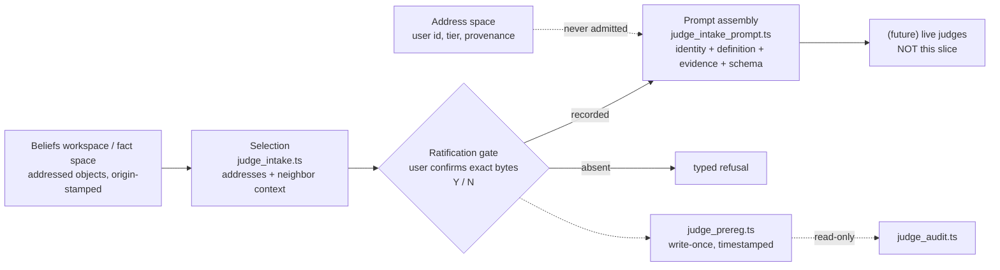

# Judge Intake — Design Record

~~**Status: DESIGN — IMPLEMENTATION AUTHORIZED, NOTHING BUILT.**~~
**IMPLEMENTED — July 18, 2026 (Session 68, dated entry).** The three
slice-1 modules (`judge_intake.ts`, `judge_intake_prompt.ts`,
`judge_prereg.ts`), their drill (`npm run test:judge-intake`, 13
sections, negative control naming all three planted breaks), and 15
unit pins landed zero-model in the implementing PR; the §6 table merged
into RECONCILIATION §5.1 the same day. §3.2a below records the render
grammar as landed. Original status line July 18, 2026 (Session 67).
Document-driven design: this record leads; the slice-1 modules follow
it. Zero-model, zero-paid by construction — no mechanism here calls a
judge.

**Substrate correction (owner ruling, July 18, 2026 — this record's
governing frame).** The first draft of this record transplanted the
judge-composition game's filing failures into Trellis wholesale. That was
wrong. **The game had no workspace.** Its claims existed only as prose in
an LLM conversation, so its composer had to *transcribe* a claim into a
filing — and that transcription was the corruption channel every filing
rule was written against. Trellis has a fact space and a beliefs
workspace in the REPL. There is no transcription step: a promotion
candidate is an addressed object, and the engine copies its bytes. Most
of the game's filing apparatus is therefore already satisfied by
[`WORKSPACE_AND_MODULES.md`](../../architecture/WORKSPACE_AND_MODULES.md)
§4.1 ("capture is mechanical, not behavioral"), §4.2 (uuid-delimited,
origin-stamped segments), and §6 (the operator-gated promotion path).
This record now specifies only what genuinely survives into the engine.
§1.2 carries the per-rule disposition.

**What this names.** [`EPISTEMIC_SUPPORT.md`](../../architecture/EPISTEMIC_SUPPORT.md)
§7's last row requires each unbuilt mechanism to be "named in its own
proposal before implementation." **Judge intake** is that name for what
stands between a promotion candidate and a judge: selection-and-
ratification, clean-context prompt assembly, and the write-once record
store. It is deliberately not "harness" (taken twice — the RLM harness,
the stage-2 self-edit harness) and not "composition" (taken by
`composePanel`, which composes *verdicts*; intake composes *prompts*).

**Authority flags (read first).**

- **The twenty rules of [`JUDGE_COMPOSITION_GAME.md`](JUDGE_COMPOSITION_GAME.md)
  §6 and the §9 shape notes are binding program law** (ratified July 18,
  2026, that record's §11). They are cited by number, never restated — a
  paraphrased copy is drift, not an implementation. §1.2 below carries
  each intake-relevant rule's disposition against the substrate; the
  owner's ratification scope note is explicit that ratifying the rules as
  law does not import the workspace-less setting they were distilled in.
- **[`RECONCILIATION.md`](RECONCILIATION.md) is ratified** (July 18,
  2026, its §7): its §4 verdicts are binding and it governs
  FOUR_JUDGE_DESIGN wherever the two differ. This record's §6
  enforcement/pin table is now eligible to merge into RECONCILIATION §5
  and should do so when the slice-1 rows are observed rather than
  designed (§10 item 4).
- The adoption-bounds register (RESEARCH_MAP §9) binds: AB-1 as twice
  amended, AB-3, AB-10.

Program context: [`PROGRAM_CONTEXT.md`](PROGRAM_CONTEXT.md). Parent
doctrine: [`EPISTEMIC_SUPPORT.md`](../../architecture/EPISTEMIC_SUPPORT.md).
Panel design: [`FOUR_JUDGE_DESIGN.md`](FOUR_JUDGE_DESIGN.md). Prompt
contracts: [`JUDGE_CONTRACT_TEMPLATE.md`](JUDGE_CONTRACT_TEMPLATE.md).
Substrate contract: [`WORKSPACE_AND_MODULES.md`](../../architecture/WORKSPACE_AND_MODULES.md).
Pillar: [`CODE_MEDIATED_TEXT.md`](../../architecture/CODE_MEDIATED_TEXT.md).

---

## 1. Problem statement

### 1.1 What the game measured, and where it applies

The judge-composition game ran the four-role design live over a real
promotion candidate and the panel caught **its own composer**. Three
measured failures came out of it. They do not all survive contact with
the substrate:

1. **Filing inflation (game §3–§4).** The composer's paraphrase
   strengthened the claimant's claims four for four; six of eight
   drawbacks were filing artifacts billed to the claimant. **This is a
   transcription failure.** It requires a step in which a model retypes
   someone's claim. Trellis has no such step — §1.2 rule 15.
2. **Steering through task text (findings F1/F6).** Expectation content
   reached judges through the task-text channel, and when that channel
   was cleaned it *relocated into annotation phrasing*. **This survives
   entirely.** It is a property of how prompts are composed, wholly
   independent of where the claim came from.
3. **Pre-registration as prose (rules 11/20).** Forecasts kept in
   conversation are unauditable and, when they share bytes with prompts,
   are work orders rather than forecasts. **This survives entirely.**
   The substrate has nothing to say about it.

### 1.2 Per-rule disposition against the substrate

The intake-relevant rules, each dispositioned. Cited by number; not
restated. **These are binding law as of July 18, 2026**, so a
disposition of "satisfied" is a claim about the architecture that a pin
must hold up — never a licence to stop honoring the rule. Where the
substrate satisfies a rule vacuously, the rule still binds any future
surface that reintroduces the step it governs.

| Rule | Disposition | Basis |
|---|---|---|
| 15 — byte-accurate filing | **Structurally satisfied** | WORKSPACE §4.1 capture is mechanical; the engine copies bytes at an address. Nothing to inflate because nothing is retyped. A pin, not a mechanism. |
| 18 — intent-readings judged against the garble | **Satisfied vacuously** | The ratification gate (§3.1) has the user fix the exact bytes. No agent interpretation occurs, so the rule has no work to do. A garble stays a garble and is judged as one. Binds immediately if any surface ever lets an agent supply a reading. |
| 16 — annotations positive, never negations | **Satisfied by construction** | Slice 1 authors no annotations, so there is nothing to phrase. The rule binds in full the moment an annotation surface exists: any composer-supplied field reaching judge context must be structural, never prose. |
| 6 — authorship never a parameter | **Structurally satisfied** | Attribution is an address property, not a content property (§3.2). Judges receive content; the allowlist never admits the address. |
| 17 — the cut is a judged surface | **Survives, narrowed** | Engine copying removes rewriting but not *selection*. A selection excluding an adjacent qualifier still tilts. Covered by showing neighbors at ratification (§3.1). |
| 1 — decompose before composing | **Survives, cleanly** | Applicability gates still cannot run on a conjunction. Decomposition is now selection of separate addressed objects, each ratified — never agent-authored sub-claims. |
| 10 — filing is a judged artifact | **Survives, narrowed** | Filing defects reduce to *selection* defects. Remand still exists; it points at the selection, never at the claimant. |
| 11, 20 — pre-registration stored and timestamped | **Survives entirely** | §3.3. Unaffected by the substrate. |

The pattern: **rules about the filer's pen are satisfied by the
substrate; rules about the composer's packaging survive into the
engine.**

## 2. Doctrine (inherited, binding)

- **Capture is mechanical, not behavioral** (WORKSPACE §4.1). The model
  never retypes a claim; the engine copies bytes at an address. This is
  [`CODE_MEDIATED_TEXT.md`](../../architecture/CODE_MEDIATED_TEXT.md)
  applied to claims — the pillar, not a new invention.
- **Promotion is operator-gated** (WORKSPACE §6). A promotion candidate
  is nominated and *the operator approves*. Judge intake reuses that
  ceremony one boundary earlier.
- **The claim is the user's; the rigor belongs to the instruments.**
  Where intent is ambiguous the mechanism forces the clarifying
  question — it never resolves it silently (HANDOFF §7.4).
- **Blindness is structural, not prompted** (RECONCILIATION §5 row 2):
  `assembleJudgeContext`'s allowlist is the mechanism; intake extends it
  rather than routing around it.
- **Definitions carry all rigor; task text carries none** (game §9).
- **Tier 3 has no provenance standing** (WORKSPACE §3). A workspace
  belief is a candidate, never evidence, until it earns permanence.

## 3. The three mechanisms



### 3.1 Selection and ratification (`judge_intake.ts`)

Filing is **selection of addressed objects plus a recorded user
confirmation**. It does not mint addresses, does not author text, and
does not annotate.

```
CandidateSelection {
  selectionId,
  addresses[],        // workspace segment uuids / Tier-1 block ids — carried, never minted
  neighborContext[],  // engine-computed adjacent bytes, for rule 17
  selectedAtMs
}
Ratification {
  selectionId,
  claimMode,          // chosen by the USER at confirmation, never inferred
  confirmedAtMs
}
```

- **Bytes are fetched engine-side at the address.** A selection carrying
  literal text instead of an address is refused — the model has no
  channel through which to supply claim bytes at all.
- **The ratification gate is structural.** Building a candidate without
  a recorded `Ratification` for its `selectionId` refuses, typed. This
  is the load-bearing addition: without it, the guarantee degrades to
  session-layer discipline, which is exactly what the game showed fails.
- **The confirmation shows the cut, not just the bytes** (rule 17). The
  user sees the selected span *with its engine-computed neighbors*, so a
  boundary that excludes an adjacent qualifier is visible at the moment
  of approval rather than discovered by a judge later.
- **Claim mode is ratified, never inferred.** Applicability gates (R-29)
  need a mode. If the agent supplied it, the mode would be agent
  testimony about the user's claim — the corruption channel returning in
  metadata. The user picks it as part of the Y/N.
- **Decomposition is selection** (rule 1). A compound claim is filed as
  several selections, each ratified individually. No agent-authored
  sub-claims exist.

**Typed refusals:** `UnratifiedSelectionError`, `AddressNotFoundError`,
`LiteralTextRefusedError`, `EmptySelectionError`.

### 3.2 Clean-context assembly (`judge_intake_prompt.ts`)

Extends Session 66's allowlist machinery into full composed prompts. It
calls `assembleJudgeContext` and cannot bypass it; `judge_panel.ts`'s
drilled path is untouched.

```
PromptSection = { kind: 'identity',      ... }
              | { kind: 'definition',    ... }
              | { kind: 'evidence',      ... }
              | { kind: 'output_schema', ... }

ComposedJudgePrompt { role, judgeId, sections[], promptHash }
```

- **F1/F6 unrepresentable.** `PromptSection` is a closed discriminated
  union with **no task-text member** — no field for a highlighted
  question, a named drawback class, or an embedded expectation. The
  drill pins the *absence*, in the kernel-prompt absence-pin pattern.
- **Attribution is partitioned by address, not scrubbed from content
  (owner ruling, July 18, 2026).** A unique user id is encoded in the
  workspace graph address, so a single beliefs workspace can hold many
  parties' beliefs with attribution carried entirely in address space.
  Judge context is assembled from **content**; the allowlist never
  admits address components. Masking is therefore not a scrubbing step
  that can be forgotten or defeated by writing style — there is no
  attribution in the bytes to leak, and the partition scales to N
  parties by construction.
- **Byte-inspectable.** `renderPrompt(composed) → string` is pure and
  deterministic; drills byte-pin composed prompts and any drift fails a
  test rather than requiring a reading.
- **Blindness preserved through the new path.** A forbidden input still
  raises `BlindnessViolationError` before any would-be model boundary.

### 3.2a The render grammar as landed (dated entry, July 18, 2026 — Session 68)

The deterministic byte layout `renderPrompt` produces and the drill's
independent generator re-derives. Both sides derive from THIS text; on
drift the byte-pin fails and this entry adjudicates. LF newlines
throughout; authored under the Prompt-Engineering and Hypershot
protocols (Guardrail 15) — the frame is fixed, every concrete value is
engine-supplied, and the format line carries spread-style slots, never
exemplar content.

```
<judge_prompt role="{role}" judge="{judgeId}">

<identity>
role: {role}
judge: {judgeId}
</identity>

<definition>
claim_modes: {csv, declared order; "(none)" when empty}
qualified_parameters: {csv, declared order}
taxonomy:
  {class} -> {parameter}          (one line per class, sorted by class)
required_assumptions: {csv, declared order}
verdict_rule: Judge only through this definition — restrict every finding to the qualified parameters above, name any drawback from the closed taxonomy, and abstain with a reason when jurisdiction or evidence is absent.
</definition>

<evidence>
{key}:
{canonical JSON of value}         (one pair per allowlisted key, keys sorted;
                                   canonical JSON = recursively key-sorted, no whitespace)
</evidence>

<output_schema>
verdict: clean | drawback | abstain
drawback: {sorted classes joined " | "} | null
abstain_reason: evidence | jurisdiction
format: one JSON object {"verdict": "...", "drawback": "..." | null, "abstainReason": "..."}
</output_schema>

</judge_prompt>
```

Sections are joined by one blank line; the file ends with a trailing
newline after `</judge_prompt>`. `promptHash` is the SHA-256 of exactly
these bytes, engine-computed at composition.

### 3.3 The write-once record store (`judge_prereg.ts`)

Two record kinds, one store — ratifications and pre-registrations share
every property that matters (write-once, timestamped, audit-readable),
so they share a module.

```
Expectation      { itemId, expectedVerdict, expectedDrawbackClass?, rationale }
PreRegistration  { registrationId, runId, registeredAtMs, expectations[], contentHash }
```

- **Write-once.** A second write for a key refuses; the first survives.
  Supersession is a new record referencing the old, never an overwrite.
- **Late registration refuses (rule 20).** The store records a run-open
  event; a registration timestamped after it is refused, typed. A
  forecast made after the run is not a forecast.
- **Forecasts never share bytes with prompts (rule 11).**
  `judge_prereg.ts` exports nothing `judge_intake_prompt.ts` imports,
  pinned by a static import check in the shape of the existing
  J4-never-gates pin.
- **The audit seat reads it (rule 20).** `judge_audit.ts` may import the
  store; the store imports nothing from composition, and no new
  audit→composition path appears.

## 4. Relationship to existing modules

Intake adds **siblings**. `judge_panel.ts`'s registry, schemas, and
`composePanel` keep their callers and their drill
(`npm run test:judge-panel`, 10 sections / 182 checks) unchanged. The one
shared surface is `assembleJudgeContext`, consumed without modification.
Imports are one-way: `judge_intake → judge_intake_prompt → judge_panel`,
and `judge_audit → judge_prereg`. No workspace or Tier-1 write path is
touched — intake reads addresses and copies bytes.

## 5. Files

| Path | Contents |
|---|---|
| `src/core/graph/judge_intake.ts` | selection, engine-side byte fetch, ratification gate |
| `src/core/graph/judge_intake_prompt.ts` | composed prompts, address/content split, `renderPrompt` |
| `src/core/graph/judge_prereg.ts` | write-once store: ratifications + pre-registrations |
| `scripts/test_judge_intake.ts` | drill, house mold |
| `fixtures/judge_intake/` | byte-pinned fixtures + independent generator |
| `npm run test:judge-intake` | drill entrypoint |

## 6. Behavior → enforcement → pin

| Behavior | Enforcement home (non-test) | Pin |
|---|---|---|
| Claim bytes are engine-copied from an address, never model-authored | `judge_intake.ts` — input is addresses; bytes fetched engine-side | drill `[engine-copy]` (a selection carrying literal text refuses) |
| Filing refuses without recorded ratification | ratification lookup precedes candidate construction | drill `[ratification-gate]` |
| The cut is visible at approval (rule 17) | engine-computed `neighborContext` on every selection | drill `[selection-context]` (qualifier-excluding cut visible in the ratification payload) |
| Claim mode is user-ratified, never agent-inferred | `claimMode` lives on `Ratification`, not on the selection | drill `[mode-provenance]` |
| Compound claims decompose as separate ratified selections | one mode per selection; no sub-claim authoring surface | drill `[decomposition]` |
| Attribution never reaches judge context | user id is an address component; allowlist admits content only | drill `[attribution-partition]` — two users' beliefs in one workspace produce judge contexts identical but for claim content |
| No task-text channel in composed prompts | `PromptSection` closed union has no task member | drill `[prompt-absence]`; unit pins |
| Composed prompts byte-inspectable | pure deterministic `renderPrompt` | drill `[prompt-bytes]` against byte-pinned fixtures |
| Assembly cannot bypass blindness | evidence built only via `assembleJudgeContext` | drill `[blindness-preserved]` |
| Ratifications and pre-registrations are write-once | store refuses a second write per key | drill `[write-once]` |
| Late registration refuses | run-open event; later timestamp refuses, typed | drill `[prereg-late]` |
| Forecasts never share bytes with prompts | no import path store → prompt module | drill `[static-imports]` |
| Audit reads the store; no new audit→composition path | one-way imports | drill `[static-imports]` (both directions) |

## 7. Drills

`npm run test:judge-intake`, in the `test:judge-panel` mold: byte-pinned
fixtures under `fixtures/judge_intake/` with an **independent
spec-derived generator** (never the implementation's own output), a
SHA-256 fixture manifest checked before any section, `TRELLIS_EXP_*`
refusal before any section, and `--negative-control` exiting nonzero
while naming every planted break. Sections are those in §6.

Three planted breaks for the negative control, one per mechanism: a
candidate built from an unratified selection; a composed prompt carrying
a smuggled expectation; a registration timestamped after run-open. Each
must be named individually — a control that fails generically has not
demonstrated detection.

The `[attribution-partition]` section is the one that would have caught
this record's original error, and is worth stating plainly: seed one
workspace with two users' beliefs under distinct address partitions,
file semantically matched claims from each, and assert the composed judge
contexts differ **only** in claim content. Any address component
appearing in a judge context fails the section by name.

## 8. Explicit exclusions

- No live judges, no model calls, no `support_sweep` integration, no
  database registration, no ratification queue, no claim-kind plane —
  each remains a separately authorized bounded feature.
- No modification to `composePanel`'s drilled path, the workspace or
  Tier-1 write paths, custody tiers, kernel prompts, extraction prompts,
  module addenda, or any composed-prompt pin.
- No `tools/engineering-loop/` change, no acceptance-ledger touch, no
  EL-07/EL-10/EL-11 claim.
- No agent-authored annotations of any kind. No `scope` enumeration —
  withdrawn (§10 item 2).
- No restatement of the twenty rules; no new glossary terms; no
  hypothesis promoted to canonical prose.
- No ratification of RECONCILIATION §7 or JUDGE_COMPOSITION_GAME §11 —
  owner acts.

## 9. Falsifiers

- **The address partition leaks.** If a judge's verdict shifts between
  two users' semantically matched claims in one workspace, attribution is
  reaching content somewhere — name the channel and close it, or withdraw
  the structural-masking claim. This is the load-bearing one and
  `[attribution-partition]` is its detector.
- **The ratification gate is decorative.** If a candidate can be built
  without a human act — an agent self-ratifying, a default-approve path,
  a test seam reachable in production — the guarantee is back to
  discipline and the gate has to be redesigned.
- **Applicability needs more than the user can supply.** If R-29 gates
  turn out to need claim properties a user cannot reasonably choose at
  confirmation time, mode/scope creeps back as agent testimony. That is
  the trigger to revisit §3.1, not to quietly let the agent infer.
- **Selection tilt survives the gate.** If a cut can still mislead a
  judge in a way the neighbor context does not surface at approval, rule
  17 is not covered and the confirmation payload is wrong.

## 10. Open items and decision boundary

1. **Naming gate satisfied.** This record names the feature per
   EPISTEMIC_SUPPORT §7; that record's last table row is amended on
   landing, not now — "not yet built" is still true. *(Landed July 18,
   2026, Session 68: EPISTEMIC_SUPPORT §7 now carries the judge-intake
   row; the residual "everything else" row names live judges, sweep
   integration, registration, and the ratification queue.)*
2. **`scope` withdrawn.** The proposed `universal | existential | modal |
   qualified` enumeration is dropped. Two reasons, the second decisive:
   it was under-determined (four values back-derived from four ledger
   rows; comparative, causal, and conditional claims fit none of them),
   and — since the user ratifies exact bytes — any agent-assigned scope
   is agent testimony about a claim the user has already fixed, which is
   rule 15's failure class returning as metadata. If a real filing ever
   demonstrates the need, it enters judged against the span bytes per
   rule 8, never trusted as filer testimony.
3. **User-id-in-address is recorded here, specified elsewhere.** The
   address-partition scheme is a substrate concern; this record depends
   on the property and pins it at the judge boundary, but does not
   define the address format. That belongs with the workspace contract.
4. **Table merge — now eligible.** RECONCILIATION §7 ratified July 18,
   2026, so the blocker is gone. The merge should still wait until the
   slice-1 rows are **observed** rather than designed: RECONCILIATION §5
   records enforcement that exists, and every row in §6 currently names a
   pin that has not been written. Merge in the implementing PR, not this
   one. *(Done July 18, 2026, Session 68: merged as RECONCILIATION §5.1,
   a dated entry under its §7 amendment rule, with every pin observed
   green first.)*
5. **No `R` rows proposed.** This record makes design commitments, not
   empirical claims. If the structural-masking property in §9 item 1 is
   to be asserted as a finding rather than a design goal, it needs its
   own row with that falsifier, by dated entry.
6. **Slice 2 and beyond** — live judges, sweep integration, judge
   registration — stay gated behind the owner's RECONCILIATION §7 ruling
   and their own proposals.
