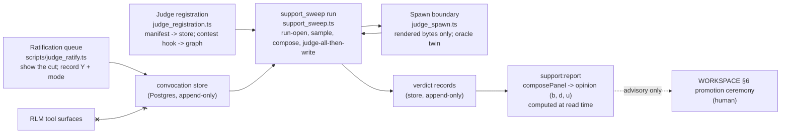

# Judge Convocation — Design Record (the slice-2 proposal)

~~**Status: PROPOSED — AWAITING OWNER AUTHORIZATION. NOTHING BUILT.**~~
~~**AUTHORIZED — OPTION B (owner, July 18, 2026 — dated entry §11.1).
NOTHING BUILT.**~~
**IMPLEMENTED AT OPTION-B SCOPE — July 19, 2026 (Session 70, dated
entry; the authorizing PR).** The option-B machinery landed zero-model
and zero-paid: the four modules (`judge_convocation_store.ts`,
`judge_registration.ts`, `support_sweep.ts`, `judge_spawn.ts`), the
`judge_records` table, the four operator surfaces
(`npm run judges:register` / `judge:ratify` / `support:sweep` /
`support:report`), and the drill `npm run test:judge-convocation`
(23 sections / 140 checks first-run green — one section's own
source-order pin was corrected in-session; `--negative-control` exits
3 naming all four planted breaks; `--inject corrupt-expected` passes
by detection; tampered-fixture and `TRELLIS_EXP_*` refusals exit 2)
plus 15 unit pins (`npm test` 1,290/113 → 1,305/114, zero existing
tests changed). The §6 rows are now OBSERVED and merged into
RECONCILIATION §5.2 by dated entry; §3.5 records the implementation
notes as landed; §11.2 carries the road to option C. **No live run has
ever executed; the paid queue stays ON HOLD.** Prior status lines
July 18, 2026 (Session 69) preserved above.
Authored July 18, 2026 (Session 69), zero-model, document-first. This
record is how authorization was sought:
[`RECONCILIATION.md`](RECONCILIATION.md) §7 unblocked the live-judge
slice **as a gate, not an authorization**, and
[`EPISTEMIC_SUPPORT.md`](../../architecture/EPISTEMIC_SUPPORT.md) §7's
residual row plus [`JUDGE_INTAKE_DESIGN.md`](JUDGE_INTAKE_DESIGN.md)
§10 item 6 gate every mechanism below behind its own proposal. The
record ends at the owner decision in §11; the session that produced it
implements nothing and ends by surfacing that decision, never by
assuming it.

**What this names.** EPISTEMIC_SUPPORT §7 requires each unbuilt
mechanism to be "named in its own proposal before implementation."
**Judge convocation** is that name for what stands between a ratified
candidate with a composed prompt and a recorded support opinion: judge
registration (who may be convened), the ratification queue (what may be
judged), the `support_sweep` job (when panels convene), and the spawn
boundary (how a judge is actually called). The name is deliberately
not "harness" (taken twice — the RLM harness, the stage-2 self-edit
harness), not "composition" (taken by `composePanel`), not "intake"
(slice 1), not bare "sweep" (the quarantine and entailment sweeps own
that word — `support_sweep` remains the **job** name inside this
feature, per the doctrine record's vocabulary), and not
"judge-actuation" (a **reserved pointer** — the collaborator's
forthcoming design for the calm-sycophancy hazard,
[`RESIDUAL_STREAM_SIDECAR.md`](../../architecture/RESIDUAL_STREAM_SIDECAR.md)
§9; this record does not touch, re-derive, or anticipate it).
EPISTEMIC_SUPPORT §7's residual row is amended on landing, not now —
"not yet built" is still true (the JUDGE_INTAKE_DESIGN §10 item 1
mold).

**Authority flags (read first).**

- **The twenty rules of [`JUDGE_COMPOSITION_GAME.md`](JUDGE_COMPOSITION_GAME.md)
  §6 and the §9 harness-shape notes are binding program law** (ratified
  July 18, 2026, that record's §11). Cited by number, never restated.
- **[`RECONCILIATION.md`](RECONCILIATION.md) is ratified** (its §7) and
  governs where the parent designs differ. Its §3.4 defines what
  composition consumes and refuses; its §5/§5.1 tables carry every pin
  that already exists; its §5 row 9 carries the **deliberately deferred
  writer-blind pin this proposal owes** (§3.2 below).
- The adoption-bounds register (RESEARCH_MAP §9) binds: AB-3 (no
  routing weights), AB-5 (writer-blind, always), AB-8 (no evolution
  machinery), AB-9 (gate/audit separation), AB-10 (no provenance
  standing for session context), AB-11 (live blocks only).
- **The paid queue is ON HOLD** (owner ruling, July 17, 2026 —
  [`PROGRAM_CONTEXT.md`](PROGRAM_CONTEXT.md) §6). This proposal
  registers estimates and criteria (§10); it cannot run anything, and
  nothing in it executes before the owner re-opens the queue by dated
  note plus a per-run approval under the ≤$5 cap.
- **No prompt bytes are authored here.** The slice-1
  `ComposedJudgePrompt` bytes ARE the model interface (§3.3); this
  record adds no prompt section, no wrapper text, no task text.
  Guardrail 15 therefore does not trigger; a future edition that finds
  itself drafting prompt bytes must stop and check JUDGE_INTAKE_DESIGN
  §3.2/§3.2a first — the absence of a task-text channel is load-bearing
  and ratification-backed.

Program context: [`PROGRAM_CONTEXT.md`](PROGRAM_CONTEXT.md). Parent
doctrine: [`EPISTEMIC_SUPPORT.md`](../../architecture/EPISTEMIC_SUPPORT.md).
Panel law: [`RECONCILIATION.md`](RECONCILIATION.md). Intake (slice 1):
[`JUDGE_INTAKE_DESIGN.md`](JUDGE_INTAKE_DESIGN.md). Sweep mold:
`src/core/graph/entailment_detection.ts` (Session 32). Registry mold:
`src/core/graph/module_registration.ts` (Session 18). Promotion
ceremony mold: [`WORKSPACE_AND_MODULES.md`](../../architecture/WORKSPACE_AND_MODULES.md) §6.

---

## 1. Problem statement

Slice 1 (Session 68) finished the intake chain: a ratified selection
becomes a `PromotionCandidate`, a candidate becomes a byte-pinned
`ComposedJudgePrompt`, and the write-once store holds ratifications,
pre-registrations, and run-open events. There the chain stops:

- **Nothing spawns a judge.** `renderPrompt` produces bytes no model
  ever receives; `parseJudgeVerdict` gates verdicts no model ever
  renders.
- **No verdict enters any sweep.** `composePanel` is drilled over
  scripted verdicts only; no production run consumes registered judges
  or ratified candidates, so no support opinion has ever been computed
  over a real belief.
- **No judge exists as a contestable entity.** `judge_panel.ts`'s
  registry is pure and in-memory; the capability-flywheel property —
  the ordinary invalidation sweep contesting a judge whose evidentiary
  basis moved (EPISTEMIC_SUPPORT §5) — has no storage to act on.
- **Rule 20's run-open events bind to no real run.** The store enforces
  the late-registration refusal, but nothing mints a `runId` for an
  actual judging run.
- **RECONCILIATION §5 row 9 is an IOU.** "Writer never sees any of it"
  is currently enforced by there being no production wiring; this
  proposal is the named carrier of the kernel-prompt absence pin
  (FOUR_JUDGE_DESIGN §6 row 7) that must exist the moment wiring does.

Four mechanisms close those gaps (§3), one durable store carries them
(§4), and every one of them is zero-model except the spawn boundary's
live constructor, which stays behind the paid queue.

## 2. Doctrine (inherited, binding)

- **Sweep-side, never a write gate** (the Session 32 mold's first
  property). A support opinion never blocks, gates, or mutates a write;
  the write path and custody tiers are untouched (EPISTEMIC_SUPPORT
  §1 rule 1).
- **Trust elevation is not automated** (EPISTEMIC_SUPPORT §6). The
  computed opinion ADVISES the WORKSPACE §6 promotion ceremony and the
  batch-ratification queue; no threshold crossing acts on its own.
- **The writer is blind** (AB-5; EPISTEMIC_SUPPORT §1 rule 3). No
  support quantity, judge output, or panel structure is model-visible;
  this record owes and designs the pin (§3.2, §6).
- **Judges are registered capabilities** (EPISTEMIC_SUPPORT §5; R-27
  model coupling), contested by the ordinary sweep, recovered only by
  human re-registration.
- **Judge-all-then-write; an error is never a verdict** (Session 32
  discipline, adopted verbatim).
- **Live blocks only** (AB-11) for every evidence gatherer.
- **The claim is the user's; the rigor belongs to the instruments**
  (rule 15). The ratification queue keeps the user's recorded
  confirmation as the only source of `claimMode` and claim bytes.
- **Evidence-universe curation is unauditable from inside** (rule 14).
  The candidate pool is uniform and mechanically sampled; the human
  curation seat sits at ratification and at external review of run
  records, never inside the sweep.
- **No evolution machinery, no routing weights** (AB-8, AB-3).
  Manifests are hand-authored; the R-29 hard gate is the only
  selection mechanism.

## 3. The four mechanisms

### 3.1 Judge registration (`judge_registration.ts` + `scripts/register_judges.ts`)

The module-registry mold (Session 18) carrying `judge_panel.ts`'s
manifest, with one deliberate split the mold does not have.

**The split representation (the decision).** A registered judge lives
in two places with two jobs:

- **The manifest is store-resident.** The full `JudgeManifest`
  (`judgeId`, `role`, `rubricSha`, `anchorSetSha`, `taxonomyVersion`,
  `targetModelIdentity` — R-27 REQUIRED, already schema-pinned) is a
  write-once record in the convocation store (§4), validated through
  the existing `parseJudgeManifest` at registration.
- **The contest hook is graph-resident.** One
  `(:Entity {kind: 'judge_manifest'})` node per judge, name
  `judge:<judgeId>` (the `module:` prefix argument verbatim: prefix +
  charset make collision with extracted content structurally
  impossible), whose `sourceNodeIds` are the judge's evidentiary
  hashes. Because the node carries `sourceNodeIds` like every other
  semantic fact, the EXISTING invalidation sweep reaches it with zero
  sweep changes: when the judge's evidentiary bytes die, the entity is
  contested with the audit trail preserved — the capability flywheel
  applied to evaluators, exactly as EPISTEMIC_SUPPORT §5 requires.

  The graph node carries **nothing else**: no role, no model identity,
  no shas, no taxonomy. Reason: AB-5 forbids model-visible panel
  structure, and the read-only Cypher sandbox reads the shared graph.
  An opaque `judge:<id>` plus research hashes is the minimum the sweep
  needs to contest; everything a writer could shape behavior against
  stays in the store, which no RLM surface reaches (§4). The residual —
  the existence and count of `judge:` entities is graph-visible — is
  accepted for contestability and carries a falsifier (§9).
- **Consistency is a refusal, not a hope.** One operator ceremony
  writes both sides; a sweep run that finds a store manifest without
  its graph hook, or a hook without its manifest, refuses the run
  naming the judge (typed) before any judging.

**Evidentiary basis, zero-paid by construction.** A manifest's
`sourceNodeIds` cite the ingested rubric and anchor-fixture bytes.
Those bytes live as byte-pinned fixtures (the anchor discipline of
EPISTEMIC_SUPPORT §5 already requires committed fixtures), and fixture
paths are extraction-excluded by the kernel-fixed
`isTestOrFixturePath` rule — so ingesting them persists Merkle-hashed
bytes with **zero extraction jobs, zero dollars**. The existence gate
(`findMissingAstHashes` mold) refuses any registration citing a hash
absent from `ast_nodes`, before any write.

**Lifecycle.** Registration and re-registration are operator ceremonies
(`scripts/register_judges.ts`, the `register_modules.ts` mold; never
model-reachable). The mold's two planner rules carry over verbatim:
registering a non-active manifest refuses (re-registration un-contests
the entity — the recovery transition must not be triggerable as a side
effect), and recovery follows human re-review with a named reviewer
(`reRegisterJudge`'s existing contract; the superseded contest record
survives). First edition: four hand-authored manifests, one
configuration per role (AB-8); J4's `targetModelIdentity` differs from
J1–J3's by default (AB-9; FOUR_JUDGE_DESIGN §8 lets the owner waive
with recorded reasoning).

**Zero-model boundary: entirely zero-model.**

### 3.2 The `support_sweep` job (`support_sweep.ts` + `npm run support:sweep`)

The Session 32 entailment mold, adopted property by property; every
divergence is stated.

- **The sampling unit is the (candidate, judge) pair.** Candidate
  identity = `selectionId` + an engine-computed `candidateHash` over
  the canonical claim bytes and mode; judge identity = `judgeId` +
  `rubricSha` + `targetModelIdentity`. Each pair is judged **at most
  once, ever** (the mold's judge-once bookkeeping, against the durable
  verdict records): a re-ratified selection (new bytes) or a
  re-registered judge (new manifest identity) is a NEW pair and
  re-enters the pool. Verdicts from a superseded pair identity survive
  as history and never re-stamp.
- **Uniform pool, seeded sampler, budget, counted deferral.** The pool
  is every ratified, unjudged pair — no per-candidate curation exists
  in the machinery (rule 14: the mechanical pool + seeded sampler is
  the engine's side of the curation seat; the human side is
  ratification and external review of run records). Sampling at a
  config rate, a hard judge budget per sweep, overflow counted as
  `deferred`, never silent. Config twins `SUPPORT_SAMPLE_RATE` /
  `SUPPORT_JUDGE_BUDGET_PER_SWEEP` (defaults inherit the entailment
  values 0.1 / 25, cap 500 — same knobs, separate keys).
- **Run binding (rule 20, finally real).** The sweep mints a `runId`
  and records the run-open event through the slice-1 store's `openRun`
  BEFORE the first judge invocation. Pre-registered expectations for
  that run must exist before open or refuse late — the slice-1
  machinery enforces it; this job is what binds it to reality. A run
  without forecasts is legal; a forecast after open is not.
- **What a run consumes.** Registered, uncontested judges (§3.1) ×
  sampled ratified candidates. Per pair, engine-side: applicability
  and the R-29 gates are `composePanel`'s existing law (RECONCILIATION
  §3.1/§3.4 — nothing re-implemented); the composed prompt comes from
  the slice-1 chain (`buildCandidate` → `toPromptInput` →
  `composeJudgePrompt`) unchanged.
- **Evidence gatherers (engine code, deterministic, recorded).** Each
  role's non-claim inputs are gathered engine-side and recorded in the
  run record:
  - J1 `citedBytes`: the live bytes at the candidate belief's cited
    hashes (`fetchBlockTexts` mold). A candidate citing nothing negates
    `cited_bytes_available` → J1 excluded by the hard gate, typed and
    counted — the gates working, not a special case.
  - J2 `history`: the belief's own version/contest record, assembled
    mechanically (most recent N records verbatim, bounded, no
    paraphrase — a curated digest was a measured composer corruption
    surface, game §4). Absent history negates `history_available`.
  - J3 `independentEvidence`: engine-side retrieval over **live blocks
    only** (AB-11), excluding the candidate's own citation chain
    (rule 2's corroboration base), bounded count. **First edition reads
    internal live blocks only** — the game §8 external-verification
    ruling (user-selectable allowlists for external retrieval) is
    real, recorded, and DEFERRED to its own edition; nothing here
    forecloses it.
- **What a run writes (judge-all-then-write).** Every verdict is
  collected before any write; an infrastructure failure anywhere
  aborts with zero partial records. The writes are: the parsed
  `JudgeVerdict` records (append-only, with `promptHash`, pair
  identity, `runId`) and the run record (pool counts, sampled,
  deferred, exclusions, jurisdiction abstains — rule 12: designed
  silence is disclosed, per candidate, from `composePanel`'s own
  counts). **Nothing else.** No graph write, no production-schema
  support fields, no write-path touch.
- **The opinion is computed, never cached model-visible.**
  `npm run support:report` replays verdict records through
  `composePanel` → `computeSupportOpinion` at read time (`asOf` decay
  makes a stored opinion a stale cache anyway). The report — opinions,
  conflicts, disagreements, exclusions — is an operator surface
  advising the promotion ceremony. It gates nothing.
- **The writer-blind pin (RECONCILIATION §5 row 9, owed here, DESIGNED
  here).** Two halves, per FOUR_JUDGE_DESIGN §6 row 7:
  (a) **kernel-prompt absence** — the composed-prompt pin fixtures
  (both arms) contain no token from a closed support-vocabulary list
  (fixed at implementation: the support field names, opinion component
  names, judge role names, drawback class names); the pin greps the
  pinned bytes, so any future kernel-prompt edit that leaks support
  vocabulary fails a drill rather than needing a reading;
  (b) **read-surface pins** — no RLM tool surface returns a support
  field or reaches the convocation store (§4): the store is a Postgres
  table no sandbox surface names, and the unit pins assert the tool
  list and their SQL carry no path to it.

**Zero-model boundary: the sweep machinery is zero-model.** Its drills
run end to end on the oracle judge (§3.3); the only model call in the
entire feature lives behind the spawn boundary's live constructor.

### 3.3 The spawn boundary (`judge_spawn.ts`)

The ONLY module in the feature permitted to construct a model call
(static-import-pinned); everything else is zero-model by construction.

- **The composed bytes ARE the interface.** The request is exactly
  `renderPrompt(composed)` as the single user message — **no system
  message, no wrapper text, no appended instruction, no task text**.
  Any wrapper byte would be a new prompt channel and a composed-prompt
  change (Guardrail 15 + a §3.2a dated amendment — deliberately
  expensive). `promptHash` is re-verified against a fresh render
  immediately before send (the `parseComposedPrompt` re-render mold);
  a mismatch refuses before any network I/O.
- **Model coupling is a refusal, not a convention** (R-27). The
  configured model for the call must equal the manifest's
  `targetModelIdentity` byte-for-byte, checked before I/O; a migration
  contests the judge (the registry path), it never silently retargets
  the spawn.
- **The model supplies only what the output schema names.** From the
  §3.2a grammar: `{verdict, drawback, abstainReason}` — validated
  through the `parseLlmResponse` mold, then `parseJudgeVerdict` (the
  existing gate). Every other verdict-record field (`judgeId`, `role`,
  `beliefId`, `atMs`, `weight`) is constructed engine-side. **Weight
  is an engine constant (v1: 1.0, config twin), never model-supplied**
  — a model-supplied weight would be a count-shaped self-report (AB-5's
  origin triple).
- **An infrastructure failure is an error, never a verdict** (network,
  parse, refusal — throws; the sweep's atomicity turns it into zero
  writes).
- **The oracle twin** (`makeOracleEntailmentJudge` mold): a
  deterministic pair→verdict map keyed by pair identity, zero cost —
  the drill's vehicle for the entire sweep path.
- **The paid gate is layered and fail-closed.** The runner constructs
  the oracle unless an explicit operator flag requests the live
  constructor; the live constructor additionally requires the paid
  queue re-opened by the owner's dated note plus the per-run approval
  with a printed estimate, under the ≤$5 cap. Absent any layer, the
  live path is unreachable, and the drill pins that.

**Zero-model boundary: the module is zero-model in every drill and
default path; the live constructor is the feature's single paid
surface, and it is triple-gated.**

### 3.4 The ratification queue (`scripts/judge_ratify.ts`)

The WORKSPACE §6 promotion ceremony mold applied one boundary earlier
(nominate → operator approves), minimal first edition:

- **An operator CLI, never model-reachable** (the `npm run promote` /
  `register_modules` lineage): `list` (pending selections), `show
  <selectionId>` (prints the `buildRatificationRequest` payload
  VERBATIM — each item's exact bytes WITH their engine-computed
  neighbors, so the cut is visible at the moment of approval; rule 17
  rides the slice-1 machinery, nothing new), and `record <selectionId>
  --confirm --claim-mode <mode>` (records the user's Y + mode through
  the slice-1 `recordRatification` into the durable store).
- **The user's recorded confirmation is the only source** of
  `claimMode` and the ratified bytes (rule 15; HANDOFF guardrail: no
  queue convenience may reintroduce an agent channel). Enforcement:
  the flags are required with no default; the store schema has no
  other entry point; the script is operator-run. The slice-1 gate
  (`buildCandidate` refuses unratified selections; `claimMode` read
  off the record with no parameter to bypass it) is inherited, not
  re-solved.
- **A decline records nothing.** The gate simply never opens — an
  unratified selection is already structurally unreachable
  (`[ratification-gate]`, observed). Decline bookkeeping, if ever
  wanted, is its own decision; the minimal edition does not silently
  grow a second record kind.
- **Where selections come from** is unchanged (WORKSPACE §6 lineage):
  the agent nominates in its answer or the operator inspects the
  workspace; the selection object is built engine-side
  (`buildSelection`). The queue transports and records; it never
  authors.

**Zero-model boundary: entirely zero-model.**

### 3.5 Implementation notes as landed (dated entry — July 19, 2026, Session 70)

The record governs; these notes fix the concrete forms the
implementation and the drill's independent generator BOTH derive from
this text (on drift, the byte-pin fails and this entry adjudicates):

- **Pair identity, exact forms.** `candidateHash` = SHA-256 of the
  canonical JSON (recursively key-sorted, no whitespace) of
  `{claimContent, claimMode}`; `candidateIdentity` =
  `` `${selectionId}#${candidateHash}` ``; `judgeIdentity` =
  `` `${judgeId}|${rubricSha}|${targetModelIdentity}` ``; `pairKey` =
  SHA-256 of `` `${candidateIdentity}::${judgeIdentity}` ``.
- **The seeded sampler is mulberry32** (`a += 0x6d2b79f5` in uint32;
  `t = imul(t ^ (t >>> 15), t | 1)`;
  `t ^= t + imul(t ^ (t >>> 7), t | 61)`;
  yield `((t ^ (t >>> 14)) >>> 0) / 2^32`). Iteration order:
  candidates ascending by `selectionId`, judges ascending by
  `judgeId`, candidate-major; one RNG draw per pool pair.
- **Jurisdiction abstentions are engine-synthesized at zero spend.**
  S10 layer 3 is engine-decidable, so spawning a judge to learn its
  own claim modes would buy nothing: an applicable-evidence,
  inapplicable-mode pair records an `abstain/jurisdiction` verdict
  flagged `synthesized` with `promptHash: null`. Pair-once bookkeeping
  covers synthesized records like any other.
- **The ratification payload carries the ratified selection AND the
  confirmed address-space entries** beside the untouched slice-1
  record, so the sweep judges exactly the bytes the user confirmed —
  no re-fetch, no drift channel. Slice-1 schemas unchanged.
- **§4's kind set gains `run_report`, keyed by `runId`** — the §3.2
  run record the §4 list omitted; recorded here as the dated
  amendment rather than a silent widening.
- **Evidence gatherers are injected.** First edition: no citation or
  history channel exists in the intake chain, so J1/J2 report
  unavailable in production and the R-29 gate excludes them, typed
  and counted; J3's live gatherer requires an embedding call and is
  therefore part of the LIVE path's spend (§11.2 item 5) — zero-model
  runs use supplied or oracle evidence. The channels' entry is
  future-edition work, recorded, not built.
- **The verdict weight rides `SUPPORT_VERDICT_WEIGHT`** (engine
  constant, default 1.0), never model-supplied.

## 4. The convocation store (the durable persistence decision)

Slice 1's `PreregStore` is pure and in-memory by design. Convocation
needs durability, and the decision is:

- **One append-only Postgres table set in the existing substrate
  database** (`trellis_db` already carries `ast_nodes`): records
  `{kind, key, payload, recordedAt}` with `UNIQUE (kind, key)` — the
  write-once law becomes a **mechanical storage refusal**, not
  discipline; the record kinds are the slice-1 three (ratification,
  pre_registration, run_open) plus `judge_manifest` (§3.1) and
  `verdict` (§3.2). Supersession stays a new record referencing the
  old.
- **The pure module stays pure.** The slice-1 store (and rule 11's
  import invariant) is untouched: the thin wiring layer (CLI, sweep
  runner) replays the table into the in-memory `PreregStore` /
  registry at process start and appends through it. Pure core, thin
  shell — the house pattern.
- **Rejected alternatives, with reasons:** the graph (verdicts and
  forecasts are audit records, not semantic facts — and the graph is
  sandbox-readable, which AB-5 forbids for judge output); a JSONL file
  (no mechanical write-once); the engineering-loop protected roots
  (EL surfaces are out of bounds for program work, standing
  guardrail).
- **No RLM surface reaches it** — the writer-blind pin's second half
  (§3.2) pins this by construction and by unit pin.
- **The audit seat reads it** (rule 20). Verdict records carry
  `(judgeId, verdict, promptHash, pair identity, runId)` — the exact
  shape a future J4 sampling edition needs for `sampledTriples` and
  masked replay, so the game §9's two wanted engine homes (masked
  replay, construal-fork detection beyond `composePanel`'s existing
  disagreement records) are REACHABLE later without re-plumbing.
  Named, deferred, not built here.

## 5. Relationship to existing modules

New siblings; nothing lands inside an existing module. The slice-1
trio, `judge_panel.ts`, `judge_audit.ts`, and every drilled path are
byte-untouched. Imports are one-way:

- `support_sweep` → `judge_intake` / `judge_intake_prompt` /
  `judge_panel` (`composePanel`) / `judge_prereg` (`openRun` + reads) /
  `judge_registration` / `judge_spawn`.
- `judge_spawn` → `judge_intake_prompt` (`renderPrompt`,
  `parseComposedPrompt`) and `judge_panel` (`parseJudgeVerdict`).
  **Never** → `judge_prereg`: the spawn must not be able to see
  expectations (rule 11 extended to the new surface, static-pinned).
- `judge_registration` → `judge_panel` (`parseJudgeManifest`) plus the
  store/graph wiring. Never → `judge_spawn`.
- Nothing imports back into the slice-1 trio; `judge_audit`'s only
  admissible read remains the store.

| Path | Contents |
|---|---|
| `src/core/graph/judge_registration.ts` | manifest validation, existence gate, split representation, consistency refusals (pure planning; wiring thin) |
| `scripts/register_judges.ts` | the operator registration/re-registration ceremony |
| `src/core/graph/support_sweep.ts` | pool, pair identity, seeded sampling, run binding, gatherers, judge-all-then-write |
| `scripts/support_sweep.ts` / `npm run support:sweep` | the runner (oracle by default; live triple-gated) |
| `src/core/graph/judge_spawn.ts` | transport, model-identity refusal, verdict parse, oracle twin |
| `scripts/judge_ratify.ts` | the ratification queue CLI |
| `npm run support:report` | opinions computed at read time; the advisory operator surface |
| `scripts/test_judge_convocation.ts` + `fixtures/judge_convocation/` | drill + byte-pinned fixtures + independent generator |
| `npm run test:judge-convocation` | drill entrypoint |

## 6. Behavior → enforcement → pin (DESIGNED — no row below is observed)

Rows are DESIGNED here, in the JUDGE_INTAKE_DESIGN §10.4 discipline:
they merge into RECONCILIATION §5 by dated entry only in the
implementing PR, after every pin is observed green. *(Done July 19,
2026, Session 70: merged as RECONCILIATION §5.2 with every row
observed — the drill section names there are the as-landed ones;
option-B scope notes mark the two rows whose live halves await
option C.)*

| Behavior | Enforcement home (non-test) | Pin |
|---|---|---|
| Manifests validated, R-27 required, hand-authored only | `parseJudgeManifest` at registration; no generator exists (AB-8) | drill `[roster-manifest]` |
| Registration existence-gated before any write | `findMissingAstHashes`-mold gate in the ceremony | drill `[roster-existence]` |
| Store manifest ↔ graph hook consistent; graph node carries only name + hashes | one ceremony writes both; sweep refuses mismatch naming the judge | drill `[roster-consistency]` |
| Contested judge unreachable by a run (graph round-trip) | run-open loads contest state into the pure registry; `composePanel` refuses (existing law) | drill `[roster-lifecycle]` |
| Recovery is human re-registration; non-active registration refuses | planner refusal (module mold); named-reviewer requirement (existing `reRegisterJudge`) | drill `[roster-recovery]` |
| Pairs judged at most once ever; identity spans candidate bytes + manifest identity | durable verdict lookup excludes judged pairs before sampling | drill `[sweep-once]` (re-registration re-enters the pair; the superseded pair does not re-stamp) |
| Uniform pool, seeded sampling, budget, counted deferral | sweep policy (config twins) | drill `[sweep-selection]` |
| Run-open recorded before first invocation; late pre-registration refuses | `openRun` ordering in the runner; slice-1 store law | drill `[sweep-run-open]` |
| Judge-all-then-write; infrastructure failure writes nothing | collect-then-write (Session 32 discipline) | drill `[sweep-atomicity]` (planted judge failure → zero records) |
| Never a write gate; no path to the write path or promotion | no such import exists | drill `[static-imports]` |
| Gatherers read live blocks only; J3 excludes the citation chain | gatherer queries (liveness-filter mold; exclusion set) | drill `[sweep-evidence]` |
| Attribution never re-enters through sweep plumbing | prompts only via `toPromptInput`; store records carry ids, never addresses or partitions | drill `[sweep-attribution]` (the `[attribution-partition]` fixture driven through the FULL sweep path) |
| Designed silence disclosed (rule 12) | run record carries `composePanel`'s exclusion/jurisdiction counts per candidate | drill `[report-discloses]` |
| Writer-blind (RECONCILIATION §5 row 9): kernel-prompt absence + read-surface isolation | composed-prompt fixtures carry no support vocabulary; no tool path to the store or any support field | drill `[writer-blind]` + unit pins on both composed-prompt fixture arms and the tool surfaces |
| Spawn transport = exactly the rendered bytes; `promptHash` re-verified pre-send | request builder in `judge_spawn.ts` | drill `[spawn-transport]` (byte-equality; tamper → refusal) |
| Model identity must equal the manifest's, or refuse before I/O | spawn refusal (R-27) | drill `[spawn-model]` |
| Model supplies only `{verdict, drawback, abstainReason}`; weight engine-constant | spawn constructs the record; strict schemas | drill `[spawn-verdict]` |
| Live spawn unreachable without the operator flag (and the re-opened queue) | runner defaults to the oracle constructor | drill `[spawn-gate]` |
| The queue shows the cut verbatim (rule 17) | `show` prints the `buildRatificationRequest` payload unmodified | drill `[queue-shows-cut]` |
| `claimMode` only from the user's recorded flags; no default; declines record nothing | required flags; store schema; no other entry point | drill `[queue-provenance]` |
| Store write-once mechanical; supersession references, never overwrites | `UNIQUE (kind, key)` at the storage layer + slice-1 law above it | drill `[store-write-once]` |

## 7. Drills

`npm run test:judge-convocation`, the house mold: byte-pinned fixtures
under `fixtures/judge_convocation/` with an **independent spec-derived
generator** (never the implementation's output), a SHA-256 manifest
checked before any section, `TRELLIS_EXP_*` refusal before any
section, `--inject corrupt-expected` passing by detection, and
`--negative-control` exiting nonzero naming every planted break
individually.

Four planted breaks, one per mechanism: a contested judge's verdict
reaching composition through the graph round-trip; a pair judged twice
across a sweep boundary; a spawn transport whose bytes differ from the
rendered prompt; a duplicate store write surviving. Each must be named
— a control that fails generically has not demonstrated detection.

The oracle judge drives the ENTIRE sweep path zero-model, end to end:
run-open → sampling → slice-1 prompt composition → oracle verdicts →
parse → store → `support:report` opinions checked against the
independent oracle's own arithmetic (the `computeSupportOpinion`
fixtures extended, never modified).

## 8. Explicit exclusions

- No claim-kind plane; no routing weights (AB-3); no evolution or
  search machinery (AB-8); no automatic promotion, registration, or
  un-contesting (EPISTEMIC_SUPPORT §6/§8).
- No live J4 sampling, masked replay, or construal-fork engine work
  beyond `composePanel`'s existing records — named in §4 as reachable,
  deferred to its own edition.
- No external-retrieval allowlists for J3 (game §8's ruling is
  recorded and deferred); first-edition corroboration reads internal
  live blocks only.
- No support fields in any production schema; no stored opinions; no
  writer-visible anything (AB-5).
- No anchor-calibration paid run (FOUR_JUDGE_DESIGN §7 item 4 stays a
  separate owner-gated proposal); no paid run of any kind — the queue
  is ON HOLD and this record cannot open it.
- No kernel, extraction, or module-addendum prompt byte; no
  composed-prompt pin movement; no new prompt sections
  (JUDGE_INTAKE_DESIGN §3.2/§3.2a govern; Guardrail 15 untriggered).
- No `tools/engineering-loop/` change, no acceptance-ledger touch, no
  EL claim.
- No restatement of the twenty rules; no new glossary terms; no
  hypothesis promoted to canonical prose.
- No modification to `composePanel`'s drilled path, the slice-1 trio,
  the workspace or Tier-1 write paths, or custody tiers.

## 9. Falsifiers

- **The store leaks to a model surface.** If any support quantity,
  verdict, or store content becomes reachable from an RLM tool, AB-5
  is broken structurally, not stylistically — `[writer-blind]` is the
  detector; the channel is named and closed before any other work.
- **Attribution reaches a judge through sweep plumbing** (rule 6). If
  a verdict shifts between two partitions' semantically matched
  candidates driven through the full sweep path, an address component
  is leaking — `[sweep-attribution]` is the detector; the slice-1
  falsifier inherited at the new layer.
- **The split representation drifts** — a manifest without a hook or a
  hook without a manifest observed outside the drill means the
  ceremony is not atomic in practice; the representation is redesigned
  before live judges, not patched around.
- **Graph-visible judge existence shifts writer behavior.** The §3.1
  residual (opaque `judge:` entities in the sandbox-readable graph) is
  accepted on the claim that name + hashes carry nothing a writer can
  shape behavior against. A measured run showing otherwise moves
  manifest hooks out of the shared graph by dated amendment.
- **Pair bookkeeping misses an identity change.** If a superseded
  judge or re-ratified candidate's stale verdicts still count, the
  pair identity is wrong — `[sweep-once]` is the detector.
- **The uniform pool is steerable anyway** (rule 14). If run records
  are insufficient for an external reviewer to re-derive the pool and
  sampling, the mechanical-pool claim is withdrawn and the run record
  grows until they are.
- **Gatherer nondeterminism.** If the same substrate state yields
  different evidence for the same pair, J3's gatherer is redesigned
  before any live run — a nondeterministic evidence universe is
  rule 14's failure inside the engine.
- **The standing composition falsifier carries** (RECONCILIATION §3.3,
  cited not restated) — a measured regime moving the cross-role /
  same-jurisdiction boundary moves it by dated amendment with a
  same-commit drill re-pin.

## 10. Spend (registered estimates — NOT authorization; the queue is ON HOLD)

- **Everything in options A/B (§11) is $0.00**: registration fixtures
  ingest extraction-free (§3.1), the sweep drills on the oracle judge,
  and the ratification queue and store are zero-model machinery.
- **A live panel run, when the owner ever re-opens the queue:** from
  measured telemetry (the entailment sweep judged 25 pairs for
  $0.0093; a composed judge prompt is larger — definition + gathered
  evidence ≈ 1–4k input tokens, ≤100 output), the estimate class is
  **$0.002–$0.01 per verdict, $0.05–$0.25 per sweep at the default
  25-verdict budget**. A first calibration convocation (four
  manifests, ~8 candidates, ≤24 belief-facing verdicts) sits in the
  same band. Hard bounds stack: the judge budget, the ≤$5/run cap, the
  per-run approval, and the queue's dated re-opening before any of it.

**Owner-requested measurement, registered July 18, 2026 (dated note,
recorded at the §11.1 authorization; queued, not scheduled — it
executes only after the queue's dated re-opening plus the per-run
ceremony):** the **metered promotion-cost test** — what it costs,
end to end, to promote a REPL workspace belief to a Tier-1 fact
through the full chain: selection → ratification ($0, operator) →
convocation verdicts (three belief-facing judges at the per-verdict
band above) → `support:report` ($0) → the WORKSPACE §6 operator
promotion ($0) → verified ingest with extraction of the promoted
segment (size-dependent; single-segment extraction at stage-1 rates
≈ $0.01–$0.03) plus embedding (negligible). Estimate class
≈ **$0.02–$0.06 per promoted belief**, judging and extraction
co-dominant. The deliverable is measured actuals PER STAGE against a
pre-stated criterion, reported against this estimate — the test rides
naturally on the first calibration convocation's shape. Also listed
in the PROGRAM_CONTEXT §6 paid-queue hold list by dated bracket.

## 11. The authorization decision (owner act — scope, spend, sequencing as named options)

This record is the deliverable gate of Session 69: nothing below
happens until the owner records a choice.

- **Option A — zero-model machinery only.** Roster + store + docket
  CLI + sweep-with-oracle + drill + the row-9 writer-blind pin. The
  spawn module lands ORACLE-ONLY (no live constructor exists in the
  tree). Spend $0. One implementation session in the Session 68 mold.
- **Option B — A plus the complete spawn boundary.** The live
  constructor exists behind the triple gate (operator flag + dated
  queue re-opening + per-run approval) but cannot run; the drill pins
  its refusals — which is exactly what should be pinned while the
  queue is closed. Spend $0 this build. **Recommended:** deferring the
  code invites a second proposal for a bounded surface this record
  already decides, and the refusal pins are worth more than the
  deferral.
- **Option C — B plus a pre-authorized first calibration convocation,
  contingent.** The run executes only after the owner's dated
  queue-re-opening note AND the ordinary per-run ceremony with the §10
  estimate re-printed; this option just avoids a third session for the
  proposal re-surface.
- **Option D — re-scope or decline.** The record stands as design
  either way; EPISTEMIC_SUPPORT §7's residual row is untouched until
  something lands.

Sequencing under A/B/C: one implementation session (Session 70), drill
first-green before records move, the §6 rows merged into
RECONCILIATION §5 by dated entry only when observed, EPISTEMIC_SUPPORT
§7's residual row split on landing.

### 11.1 Authorization (dated entry — July 18, 2026)

**RECORDED — the owner chose OPTION B** at the Session 69 close-out
review, the same day this record was authored (the live in-session
decision recorded here per the Session 67 → 68 precedent). In
consequence:

- The Session 70 build implements option A's zero-model machinery
  PLUS the complete spawn boundary behind the triple gate. Spend
  $0.00.
- **No live run is authorized.** Option C was not taken; the paid
  queue stays ON HOLD, and any live convocation re-enters only
  through the owner's dated queue re-opening plus the ordinary
  per-run ceremony with the §10 estimate re-printed.
- In the same act the owner registered the **metered promotion-cost
  test** (§10 dated note): a future measurement of the end-to-end
  cost of promoting a belief to fact in the REPL. Queued on the paid
  queue's hold list; not scheduled.

*The gate this entry closes, preserved: "This record is the
deliverable gate of Session 69: nothing below happens until the owner
records a choice."*

### 11.2 The road to option C (dated entry — July 19, 2026, Session 70; owner-requested consideration)

The owner asked, at the option-B authorization, that the road to the
eventual live-LLM test be considered. Recorded here so the first live
convocation is a checklist walk, not a redesign. What must be true,
in order:

1. **The owner's dated paid-queue re-opening** (PROGRAM_CONTEXT §6) —
   governance, not machinery; nothing below substitutes for it.
2. **The per-run ceremony:** a presented proposal with the §10
   estimate re-printed, per-run approval under the ≤$5 cap, actuals
   reported after.
3. ~~**Four real manifests.** Hand-authored rubrics and ten-item anchor
   fixtures (FOUR_JUDGE_DESIGN §5 anchor discipline; AB-8 — no
   generation), committed byte-pinned, ingested extraction-free
   (§3.1), registered through the ceremony. J4's
   `targetModelIdentity` differs from J1–J3's by default (AB-9).
   Zero-paid; can land any time before the run as ordinary operator
   work.~~
4. ~~**Real ratified candidates** through the queue (§3.4) — the
   docket. Zero-paid operator work; the promotion candidates the
   owner actually cares about are the right first docket.~~

**Items 3 and 4 are SUPERSEDED and merged — dated entry, July 19, 2026
(owner ruling, Session 71).** They sequenced roster-then-docket, which
inverts the design: **composition follows the candidate.** Item 3's
clause *"can land any time before the run as ordinary operator work"*
is the specific instruction that misled Session 71 into authoring four
rubrics with fixed taxonomies, byte-pinning them, and registering them
as a standing roster — all rolled back. Note the dates: §11.2 was
written July 19, one day **after** JUDGE_COMPOSITION_GAME §11 was
ratified July 18. A ratified rule failed to propagate into the road map
written beside it.

**3–4 (merged). The ceremony, per candidate.** For each ratified
candidate: an isolated agent characterizes the REPL's fact and belief
spaces descriptively (the candidate's domain in scope, its identity not
privileged); a composer builds each seat and its anchors from that
characterization; the instantiation gates run (validity, coverage,
overlap, falsifiability) with retry on failure; the composed judges are
recorded write-once; judging proceeds on the forward pass, where the
instantiated judges do see the candidate. Nothing is authored ahead of
a ceremony and no composition is reused. Full design:
[`JUDGE_COMPOSITION_CEREMONY.md`](JUDGE_COMPOSITION_CEREMONY.md).

Consequences for this record's §3.1 that need their own design pass,
NOT assumed here: what `rubricSha` hashes when the rubric is composed
rather than committed; what a composed judge's evidentiary basis is and
therefore what the existence gate checks; whether the graph carries one
hook per ceremony rather than per judge, plus a durable `composer`
entity as the contestable capability; what survives of the
`judges:register` CLI; and how `support_sweep`'s sample-rate and budget
semantics re-derive when there is no judge × candidate matrix to sample
from.
5. **The J3 live evidence gatherer** — embedding-backed retrieval
   over live blocks excluding the candidate's citation chain (rule 2;
   AB-11). The one small code increment option B deferred (its
   embedding call is paid-path spend); it rides the run's own
   proposal, not a separate session.
6. **The run shape: the metered promotion-cost test (§10).** The
   first calibration convocation and the promotion-cost meter are ONE
   run — per-stage actuals (ratification $0, verdicts at the §10
   band, report $0, promotion ceremony $0, ingest/extraction of the
   promoted segment) reported against the ≈$0.02–$0.06/belief
   estimate.

What option B already delivered toward C: the full path rehearsed
zero-model end to end (run-open → sampling → composition → oracle
verdicts → store → report), the spawn boundary's refusal pins
observed (R-27 identity, transport byte-equality, the triple gate),
rule 20 bound to real runs, and the row-9 writer-blind pin closed.
The live constructor exists and can only refuse until items 1–2
exist.

## 12. No `R` rows

This record makes design commitments, not empirical claims (the
JUDGE_INTAKE_DESIGN §10 item 5 discipline). The §9 items are
falsifiers on design decisions; if any is later asserted as a finding
— e.g. that graph-visible judge existence is behaviorally inert — it
enters the register as its own row with that falsifier, by dated
entry.

## 13. Explanation render — design note (July 21, 2026)

**Status: Option A IMPLEMENTED — July 21, 2026; Option B deferred.** Records, in engineering terms,
the resolution of an explainability question the collaborator raised:
should a judge's output carry a human-readable rationale, the way the
session-layer `judge-composition` skill's output schema does? So a later
bounded feature can be built from a record rather than from a
conversation.

### The finding: no rationale exists on the wire or in the record

The model's response surface is `judgeResponseSchema`
([`judge_spawn.ts:53`](../../../src/core/graph/judge_spawn.ts:53)), a
`z.strictObject` of exactly `{ verdict, drawback, abstainReason? }` —
`strictObject` refuses any extra field. The stored verdict `verdictBase`
([`judge_panel.ts:143`](../../../src/core/graph/judge_panel.ts:143))
adds only engine-side `{ judgeId, role, beliefId, atMs, weight }`. So
**there is no `rationale` and no `rationaleSpan` anywhere in the shipped
path** — the `rationaleSpan` named in the invariant verdict schema of
[`JUDGE_CONTRACT_TEMPLATE.md`](JUDGE_CONTRACT_TEMPLATE.md) §1 was
designed and never carried into the wire or record. That template line
is now the outlier; either the field is built (Option B below) or the
template's §1 schema is corrected by dated entry to match the shipped
three-field surface.

### Why the record layer stays minimal

A model-authored free-text rationale in the store would put model prose
into a record byte — the corruption channel
[`CODE_MEDIATED_TEXT.md`](../../architecture/CODE_MEDIATED_TEXT.md)
forbids for content, applied here to verdicts. It is also unverifiable,
non-deterministic (breaking the byte-pinned render/report determinism),
store bloat, and a fresh Goodhart/leak surface that would need its own
writer-blind and never-reward-length guards. The minimal wire is a
feature, not an omission.

### The resolution: explanation is a read-time render, not a stored field

Explainability is a *presentation* concern, and the panel outcome is
already computed at read time — `computeConvocationReport`
([`support_sweep.ts:374`](../../../src/core/graph/support_sweep.ts:374))
replays stored verdicts through `composePanel` and stores no opinion
(RECONCILIATION §5.2). An explanation render is the same pattern one
layer out: a pure function over already-stored, code-mediated fields.

- **Option A — render from what is already stored (recommended first
  step; zero schema change).** Per verdict in a `CandidateReport`, join
  `role` + `verdict` + `drawback` (the class) + the class's one-line
  gloss (its rubric question, carried on the *composed* judge
  definition, RECONCILIATION §2) + `abstainReason` + the promotion
  record's existing addresses. Yields a class-level "which seat, what
  verdict, what the drawback class means," deterministic, no new model
  output, nothing new stored. The gloss source is the composed judge
  definition, not a hard-coded map — under the composition ceremony the
  taxonomy is per-context (§11.2 3–4), so the gloss travels with the
  composed rubric.
- **Option B — capture a deciding-span ADDRESS (follow-on; richer, still
  code-mediated).** Implement the template's `rationaleSpan` as an
  *address*, not prose: the model returns a pointer into the evidence it
  was shown, the engine **validates the address resolves inside that
  evidence** and stores the address, and the render quotes the resolved
  bytes. The model authors a pointer, never record text, so the pillar
  holds. Costs a wire field on `judgeResponseSchema`, an
  address-validation step at the spawn boundary, and a store field — and
  it intersects the already-open §11.2 3–4 question of "what a composed
  judge's evidentiary basis is and therefore what the existence gate
  checks."
- **Option C — a model-authored free-text `rationale` field — rejected**
  for the record-layer reasons above. It stays legitimate at the
  *session layer*, where the `judge-composition` skill's verbose
  `rationale` serves an ephemeral human-read panel that is never
  persisted as a record — the skill's Step 5 note already draws that
  line.

### Recommendation

Build Option A when an explanation surface is wanted (small,
house-clean); hold Option B as the follow-on if span-level "why" proves
necessary; and correct `JUDGE_CONTRACT_TEMPLATE §1`'s `rationaleSpan`
line by dated entry either way — build it, or drop it to match the wire.

### Implemented (dated entry — July 21, 2026)

**Option A shipped**, owner-authorized ("align the product with the
skill to the extent we're able, then backprop"). Zero-model, zero-paid,
no wire / schema / store change:

- [`judge_explain.ts`](../../../src/core/graph/judge_explain.ts) — the
  pure render. `explainVerdict` joins seat + verdict + humanized drawback
  class + the qualified-parameter dimension + abstain reason;
  `explainCandidate` adds the opinion in words, the counts, and the typed
  no-global-section / cross-role-disagreement / exclusion records.
  `clean` renders "no known drawback found," never certified correctness
  (R-01). Authors no stored byte; calls no model.
- [`support_report.ts`](../../../scripts/support_report.ts) — the
  advisory `support:report` surface now prints the render.
- Pins:
  [`judge_explain.test.ts`](../../../src/core/graph/judge_explain.test.ts)
  (9 checks); `npm run test:judge-convocation` stays green (23 sections,
  0 failed) with `[report]` and `[static-imports]` unchanged, and the
  full graph suite is 179/179.

Option B (a validated `rationaleSpan` **address** on the wire) remains
the deferred follow-on for span-level "why."
`JUDGE_CONTRACT_TEMPLATE §1`'s `rationaleSpan` line is corrected by
dated entry there to match the shipped three-field wire.
