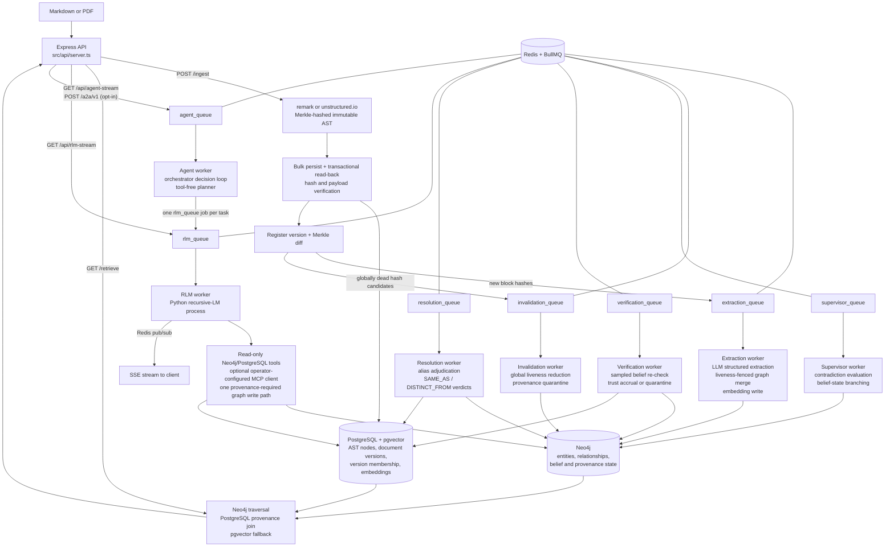

# Trellis Engine — Technical Roadmap

*Generated from a code-led review of the repository (July 4, 2026). File and line references point at the current state of `master`-derived code in this working tree. §1 (architecture overview) was refreshed July 7, 2026 (Session 13) to match the post-Session-12 code; the living session-to-session mental model remains `HANDOFF.md` §1.*

*Status: Foundations, update/invalidation correctness, belief verification, Session 3 deployment/CI readiness, Session 4 structured logging/metrics (T16), Session 5 entity resolution (3.3 #2), Session 6 benchmark maturity (3.3 #3), Session 7's semantic-provenance scale gate, Session 8 whole-codebase ingestion (3.3 #6, including the measured Entity.name merge index), Session 9's agentic orchestration loop (3.3 #7), Session 10's MCP tool surface for the RLM sub-agent (3.3 #8 first slice), Session 11's A2A server surface over the goal loop (3.3 #8 second slice), and Session 12's remote MCP transports with the containerized tool-server pattern (3.3 #8 third slice, closing the item's recorded scope) are complete and verified. Session 13 (July 7, 2026) was an owner-directed documentation, context-alignment, and architectural-consolidation session: the workspace/modules design record (`docs/architecture/WORKSPACE_AND_MODULES.md`) and canonical glossary (`docs/GLOSSARY.md`) landed, this file's §1 drift was corrected, and the frontend deployment was deferred (unscheduled; scope preserved in §3.3 #5). Session 14 is scoped to the design record's §11 steps 2 + 1 — kernel hardening and the Tier-3 workspace — see §4 and §5. The Session 7 measurements did not justify a storage migration; item 3.3 #4 remains open behind explicit observed thresholds, and Session 8's post-index re-measurement kept the gate closed. Every short- and medium-term roadmap item is closed. See §5 Progress Log for what was fixed, what was found along the way, and what remains open.*

---

## 1. Architecture Overview

Trellis is a Recursive Language Model runtime over a provenance-enforced knowledge substrate (reframed July 9, 2026 — the original "provenance-preserving GraphRAG" description now names the Tier-1/2 substrate, not the system; see the root README "What Trellis is"). Its central design commitment is unchanged: every semantic fact must remain traceable to an immutable, content-addressed physical location in the source document. The system is organized as an asynchronous pipeline over a three-tier storage layout.

### 1.1 Components and Data Flow

**Storage tiers:**

| Store | Role | Schema |
|---|---|---|
| PostgreSQL + pgvector | Physical layer: immutable AST nodes keyed by SHA-256 Merkle hash, plus embeddings | `ast_nodes(id, document_id, data JSONB, embedding vector(1536))` |
| Neo4j | Semantic layer: `Entity`, `Question`, `Concept` nodes; `ACTION`, `REFERENCES`, `CONTRADICTS`, `DERIVED_INSIGHT` edges, all carrying `sourceNodeIds` back-references | Uniqueness constraints on `Entity.id`, `Question.id`, `Concept.id` |
| Redis | BullMQ job queues (`extraction_queue`, `rlm_queue`, `supervisor_queue`, `invalidation_queue`, `verification_queue`, `resolution_queue`, `agent_queue`), pub/sub channels for SSE streaming, and TTL-bounded A2A task records (`a2a:task:<id>`) | — |

**The RLM harness** ([src/rlm/trellis_agent.py](src/rlm/trellis_agent.py)) wraps the `rlms` recursive-LM library with three injected tool surfaces: a read-only Neo4j client (transport-enforced `default_access_mode=READ`; the keyword blocklist is a fast-fail courtesy only) and a Postgres AST reader ([src/rlm/trellis_tools.py](src/rlm/trellis_tools.py)), plus — only when the operator configures servers in `TRELLIS_MCP_SERVERS` — an allowlisted, time- and size-bounded MCP client ([src/rlm/trellis_mcp.py](src/rlm/trellis_mcp.py), Sessions 10/12) whose results never satisfy the provenance requirement. The agent's only permitted graph write is `write_derived_insight`/`write_derived_insights`, which caches deduced facts as `DERIVED_INSIGHT` edges with mandatory provenance — the "flywheel" that makes repeat queries cheaper. Since Session 9 the RLM also serves as the reusable single-task sub-agent of the agentic goal loop (`src/core/agent/`, `agent_queue`), whose orchestrator is a tool-free planner that dispatches ordinary `rlm_queue` jobs; since Session 11 external agents can dispatch goals over A2A (`POST /a2a/v1`, opt-in).

**The OOLONG-Pairs benchmark** (`src/benchmarks/`, `scripts/`) is a self-contained evaluation harness: a seeded deterministic dataset generator, a verify-as-you-go ingestion loop, a cache-stripping prep script, and a 20-query runner that scores set-based F1 and measures the cold→warm cost collapse. The committed [benchmark_results.json](benchmark_results.json) shows F1 = 1.0 on all 20 queries with mean sub-calls dropping from 0.36 (cold) to 0 (warm).

**The frontend** (`src/frontend/`) is a Next.js app with a force-directed graph pane and a provenance pane; clicking a graph node highlights the exact AST text blocks that produced it, proxied to the backend via a rewrite rule ([next.config.ts](src/frontend/next.config.ts)).

### 1.2 Design Paradigms

- **Pipeline / queue-driven**: ingestion is a fan-out of independent, retryable jobs (Architecture Invariant 4 in [.agents/AGENT_CODING_GUIDELINES.md](.agents/AGENT_CODING_GUIDELINES.md)).
- **Content addressing**: node identity is `SHA-256(type:content:metadata:childHashes)`; block hashes are context-free, which the ingestion loop exploits for independent re-derivation checks.
- **Verification-as-a-loop**: the OOLONG ingester ([scripts/ingest_oolong_dataset.ts](scripts/ingest_oolong_dataset.ts)) writes a batch, reads it back, re-derives every hash through the parser, and refuses to advance past a failing batch.
- **Boundary validation**: dataset files pass through Zod schemas ([src/benchmarks/oolong/schema.ts](src/benchmarks/oolong/schema.ts)) before touching the pipeline.

---

## 2. Current State and Code Quality

### 2.1 Strengths

- **Provenance threading is consistent.** `sourceNodeIds` is carried through extraction ([extraction_worker.ts:59-76](src/workers/extraction_worker.ts:59)), ingestion verification ([ingest_oolong_dataset.ts:216-224](scripts/ingest_oolong_dataset.ts:216)), the RLM write path ([trellis_tools.py:60-62](src/rlm/trellis_tools.py:60), which rejects writes without provenance), and the retrieval join. This is the project's core differentiator and it is enforced, not just documented.
- **The ingestion verification loop is well-structured.** [ingest_oolong_dataset.ts](scripts/ingest_oolong_dataset.ts) separates write, hash-integrity read-back, semantic write, and constraint verification into named phases with a shared retry helper ([retry.ts](src/benchmarks/oolong/retry.ts)) and clear failure semantics.
- **The benchmark runner is defensively written.** [oolong_runner.ts:76-84](src/benchmarks/oolong_runner.ts:76) canonicalizes predicted tuples by category so tuple-ordering mistakes don't mask correct answers; protocol violations (zero tool calls) trigger bounded re-dispatch; per-query logs are persisted.
- **The RLM sandbox has layered guards**: a mutation-keyword blocklist, a single whitelisted write path, tool-call counting for provenance enforcement, and exceptions that propagate real tracebacks back into the REPL loop for self-correction.
- **Documentation is unusually thorough** for a project at this stage: architecture, math foundations, runbook, benchmark spec, and self-critique (`docs/benchmarks/CRITIQUE_AND_FUTURE.md`) all exist. Newer code (benchmarks, RLM harness) carries purposeful comments explaining invariants rather than restating syntax.

### 2.2 Technical Debt and Concerns

Ordered roughly by severity.

**T1 — No test suite.** *Resolved (July 4, 2026) — see §5.* `package.json:10` was the npm default stub (`echo "Error: no test specified" && exit 1`). There is no unit test framework anywhere in the repo. The scripts under `scripts/` (`test_e2e_rlm.ts`, `run_adversarial_tests.ts`, etc.) are manual end-to-end probes that require live Docker infrastructure and an OpenAI key — they are not automated, not assertion-based, and not CI-runnable. Several modules are pure functions that could be tested today with zero infrastructure: [parser.ts](src/core/ast/parser.ts), [corpus.ts](src/benchmarks/oolong/corpus.ts), and the parse/score functions in [oolong_runner.ts:76-94](src/benchmarks/oolong_runner.ts:76) and [rlm_client.ts:32-58](src/benchmarks/oolong/rlm_client.ts:32).

**T2 — Extraction granularity is wrong for markdown ingestion.** *Resolved (July 4, 2026) — see §5.* [server.ts:78](src/api/server.ts:78) selected "leaf nodes" as any node with string content. In a remark AST, leaves are inline tokens (`text`, `inlineCode`, …), not blocks — so `Globex **acquired** Initech` fans out as three separate extraction jobs (`"Globex "`, `"acquired"`, `" Initech"`), none of which contains the full relationship. Extraction should operate at block level (paragraph/heading) with concatenated child text, as [corpus.ts:27-30](src/benchmarks/oolong/corpus.ts:27) already does via `nodeText()`. This directly degrades graph quality for any formatted document.

**T3 — Runtime dependency misclassification.** *Resolved (July 4, 2026) — see §5.* `ioredis` was in `devDependencies` ([package.json:41](package.json:41)) but is imported at runtime by [server.ts:183](src/api/server.ts:183), [queue.ts:2](src/workers/queue.ts:2), and [rlm_worker.ts:5](src/workers/rlm_worker.ts:5). A production install with `--omit=dev` will not start. Conversely, `@types/*`, `typescript`, and `tsx` sit in `dependencies`.

**T4 — The repo violates its own configuration invariant.** *Resolved (July 4, 2026) — see §5.* [.agents/AGENT_CODING_GUIDELINES.md:13](.agents/AGENT_CODING_GUIDELINES.md) mandates a schema-validated config object exported from `src/config/index.ts`; that file did not exist. Instead, connection details and passwords are hardcoded: Postgres and Neo4j credentials in [db.ts:5-17](src/config/db.ts:5), Redis host/port in [queue.ts:4-8](src/workers/queue.ts:4) and duplicated in [server.ts:201-204](src/api/server.ts:201) and [rlm_worker.ts:7-10](src/workers/rlm_worker.ts:7). The Python tools ([trellis_tools.py:22-26](src/rlm/trellis_tools.py:22)) do read env vars, so the two halves of the system configure differently.

**T5 — Machine-specific path hardcoded in the RLM worker.** *Resolved (July 4, 2026) — see §5.* [rlm_worker.ts:25](src/workers/rlm_worker.ts:25) set `PYTHONPATH` to `C:\Users\Darian\AppData\Roaming\Python\Python313\site-packages`. The RLM pipeline cannot run on any other machine without editing source. The bare `python` executable name is also platform-dependent.

**T6 — No authentication, rate limiting, or concurrency control on the API.** *Resolved (July 4, 2026) — see §5.* All three endpoints are unauthenticated. `/api/rlm-stream` is the sharpest edge: each GET spawns a Python process that makes paid LLM calls and holds database connections ([server.ts:186-239](src/api/server.ts:186)). An unauthenticated caller can generate unbounded cost and process load. There is also no cap on concurrent RLM jobs beyond BullMQ's default worker concurrency.

**T7 — The Cypher read-only guard is a keyword blocklist, and APOC is enabled.** *Resolved (July 4, 2026) — see §5.* [trellis_tools.py:34-41](src/rlm/trellis_tools.py:34) blocks `CREATE/MERGE/SET/...` by word-boundary regex, but [docker-compose.yml:26](docker-compose.yml:26) installs the APOC plugin — `CALL apoc.create.node(...)` and similar procedures mutate the graph without using any blocked keyword. The blocklist also false-positives on legitimate queries that contain the words in string literals. The robust fix is transport-level: open sessions with `default_access_mode=READ` (and/or a read-only Neo4j user), keeping the blocklist only as a fast-fail courtesy check.

**T8 — LLM outputs are parsed without runtime validation, violating Guideline 2.** *Resolved (July 4, 2026) — see §5.* [extraction_worker.ts:30](src/workers/extraction_worker.ts:30) and [supervisor_worker.ts:76](src/workers/supervisor_worker.ts:76) call `JSON.parse(rawContent)` on the completion payload without `GraphSchema.parse()` / `safeParse()`. `zodResponseFormat` constrains the request, but nothing verifies the response, and the repo's own guidelines forbid exactly this pattern.

**T9 — Silent data loss in extraction ID resolution.** *Resolved (July 4, 2026) — see §5.* In [extraction_worker.ts:43-51](src/workers/extraction_worker.ts:43), if the LLM emits an action whose `subjectId`/`objectId` doesn't match any returned entity, the code falls back to the raw ID; the subsequent Cypher `MATCH` on the name then finds nothing and the action is dropped with no log line. Failed resolutions should at minimum be counted and logged.

**T10 — Supervisor worker defects.** *Resolved (July 4, 2026) — see §5; the detection-cost heuristic (fourth bullet) remains open by design.*
- The `Conflict` node created at [supervisor_worker.ts:89](src/workers/supervisor_worker.ts:89) is never connected to anything — it floats as an orphan carrying the reasoning text, unreachable from the entities it explains.
- [supervisor_worker.ts:50,54](src/workers/supervisor_worker.ts:50) join text fragments with the two-character literal `"\\n"` instead of a newline.
- The anomaly query ([supervisor_worker.ts:25](src/workers/supervisor_worker.ts:25)) uses `id()`, deprecated in Neo4j 5 (the resolution query already uses `elementId()`).
- Detection treats *any* same-verb fan-out as a candidate contradiction ("acquired X" and "acquired Y" is normal), relying on the LLM to filter — workable, but every false candidate costs a paid completion.
- The supervisor is also not wired into `start_all.ts` and only runs via the manual trigger script.

**T11 — Per-row inserts and per-job enqueues in the hot ingestion path.** *Resolved (July 4, 2026) — see §5.* [server.ts:62-68](src/api/server.ts:62) inserted AST nodes one query at a time inside a transaction, and [server.ts:79-84](src/api/server.ts:79) enqueued extraction jobs one `await` at a time. For large documents this was a straightforward N-round-trip bottleneck. The production path now uses one multi-row `INSERT ... UNNEST` and one `queue.addBulk()` call. The benchmark ingester retains its small, verification-oriented batches.

**T12 — Document membership is not modeled.** *Resolved prior to this review's publication (Phase 4 versioned-ingest work) — see §5.* `ast_nodes.document_id` is set once and `ON CONFLICT (id) DO NOTHING` ([server.ts:63-67](src/api/server.ts:63)) means a node shared by two documents (identical content) keeps whichever document ingested it first. Content addressing makes node reuse across documents *expected*, so membership needs a join table (`document_nodes(document_id, node_id)`) rather than a column.

**T13 — Hash preimage lacks canonical encoding.** *Open by design for now; current behavior is pinned by unit tests — see §5.* [parser.ts:20-31](src/core/ast/parser.ts:20) builds the hash input by joining `type`, `content`, `JSON.stringify(metadata)`, and concatenated child hashes with `:` delimiters. Because none of the segments are length-prefixed, distinct `(type, content, metadata)` combinations can in principle produce identical preimages. Practical risk is low (types come from a fixed vocabulary), but a Merkle-integrity system should use an unambiguous encoding (length-prefixed segments or canonical JSON of the full tuple). Also, `if (content)` treats empty-string content as absent — a falsy check where an `!== undefined` check is meant.

**T14 — No embedding/queue hygiene.** *Resolved (July 4, 2026) — see §5.*
- ~~No pgvector index; vector fallback is a sequential scan.~~ A partial cosine HNSW index is now created idempotently with the schema.
- ~~Queues lack retry and retention policy.~~ Background queues use bounded exponential retries, permanent OpenAI 4xx failures stop immediately, and completed/failed history is bounded by age and count. The interactive RLM queue retains the history bounds but deliberately has no automatic retries.
- ~~Uploaded PDF files land in `uploads/` via multer ([server.ts:12](src/api/server.ts:12)) with no size/type limit and are never deleted.~~ *Resolved with T6 (July 4, 2026): PDF-only, size-capped, deleted after parsing.*
- ~~No graceful shutdown.~~ SIGINT/SIGTERM now stop API admission, close workers, publishers and queues, then drain PostgreSQL/Neo4j clients in phase order.

**T15 — Duplicated helpers and drift between pipelines.** *Resolved (July 5, 2026) — see §5.* The traversal-helper duplication was resolved with T2. Vector similarity ordering now lives in the PostgreSQL `search_ast_nodes` function consumed by both [server.ts](src/api/server.ts) and [trellis_tools.py](src/rlm/trellis_tools.py). Production `/ingest` now performs its own transactional write → read-back → parser re-derivation check before version registration commits. The OOLONG ingester retains its benchmark-specific semantic constraint verification.

**T16 — Observability is `console.log`.** *Resolved (July 6, 2026) — see §5.* Operational code now logs one JSON object per line through a pino-backed observability module with a validated `LOG_LEVEL`, stable correlation fields (service/worker/queue/jobId/attempt/requestId/docKey/version/astNodeId), and preserved event names. Prometheus metrics are exposed per process: the API serves authenticated `GET /metrics`; the worker container serves an internal listener with queue-depth gauges, job outcomes, pipeline transition counters, LLM token spend, and RLM telemetry parsed from the `TRELLIS_TELEMETRY:` line.

**T17 — Minor documentation drift.** *Resolved (July 4, 2026) — see §5.* [README.md:6](README.md:6) now limits the bounding-box claim to PDF nodes whose parser output supplies coordinates; markdown nodes are explicitly documented as geometry-free. The extraction model had already been consolidated into validated configuration.

**T18 — No reproducible backend deployment or CI.** *Resolved (July 5, 2026) — see §5.* The repository now has a compiled production build, non-root Node/Python image, pinned Python manifests, schema-gated API/worker Compose topology with health checks and project-scoped resources, a tested `.env` load path, GitHub Actions, and a deterministic zero-LLM ingest/provenance/retrieve round trip.

---

## 3. Roadmap

### 3.1 Short-Term (immediate fixes, low-hanging fruit)

1. ~~**Fix dependency classification** (T3)~~ — **done** (July 4, 2026): `ioredis` moved to `dependencies`; `@types/*`, `typescript`, `tsx` moved to `devDependencies`.
2. ~~**Remove the hardcoded PYTHONPATH** (T5)~~ — **done** (July 4, 2026): interpreter comes from `PYTHON_EXECUTABLE` (platform-aware default), `PYTHONPATH` is an optional passthrough, and a missing `rlms` package produces an actionable error.
3. ~~**Create `src/config/index.ts`** (T4)~~ — **done** (July 4, 2026): Zod-validated config read once from env, consumed by `db.ts`, `queue.ts`, `server.ts`, and the workers; Neo4j/Postgres settings are forwarded to the spawned Python process. Also collapsed the model-string duplication (part of T17).
4. ~~**Validate LLM responses** (T8)~~ — **done** (July 4, 2026): every worker-consumed completion crosses `parseLlmResponse` in the new `src/core/llm/boundary.ts` (empty / JSON / schema failure stages); structural failures throw into the BullMQ retry flow, now enabled by bounded queue-level retry defaults.
5. ~~**Fix the supervisor bugs** (T10)~~ — **done** (July 4, 2026): the `Conflict` node is linked to the subject and both branch objects with provenance on every created node/edge, text fragments join with real newlines, detection orders by `elementId()`, and the supervisor worker starts with `start_all.ts`. Cypher and pure helpers live in `src/core/graph/conflict_resolution.ts`.
6. ~~**Log dropped actions in the extraction worker** (T9)~~ — **done** (July 4, 2026): unresolved endpoints are logged at resolution time (`src/core/graph/resolve_actions.ts`) and the merge Cypher returns the merged action ids so Cypher-level drops are detected and logged post-merge.
7. ~~**Stand up a unit test harness** (T1)~~ — **done** (July 4, 2026): vitest wired into `npm test`; 45 tests over parser hashing determinism (including the T13 empty-content and delimiter edge cases, pinned as current behavior), `buildCorpus` round trips, `parsePredictedPairs`/`scoreF1`/`estimateCost`, and the SSE extractors in `rlm_client.ts`. No infrastructure required.
8. ~~**Correct the README bounding-box claim** (T17)~~ — **done** (July 4, 2026): README now distinguishes PDF geometry from geometry-free markdown nodes.

### 3.2 Medium-Term (correctness, performance, robustness)

1. ~~**Fix extraction granularity** (T2)~~ — **done** (July 4, 2026): `/ingest` fans out block-level nodes (paragraph, heading, list item, code, PDF element) with reconstructed inline text via the new `src/core/ast/traverse.ts`, which also consolidates the duplicated `flattenAST`/`nodeText` (the traversal-helper half of T15). See §5.
2. ~~**Harden the RLM sandbox** (T7)~~ — **done** (July 4, 2026): `run_cypher` sessions open with `default_access_mode=READ` (server-enforced; blocklist retained as fast-fail courtesy), `write_derived_insight` uses an explicit WRITE session, APOC dropped from the compose file. Verified live by `npm run test:rlm-sandbox`.
3. ~~**Add API protection** (T6)~~ — **done** (July 4, 2026): API-key middleware (header / Bearer / query param), concurrency cap + queue-depth limit on `/api/rlm-stream` (429), body and upload size limits (413), PDF-only uploads with post-parse cleanup. Verified live by `npm run test:api-hardening`.
4. ~~**Queue hygiene** (T14)~~ — **done** (July 4, 2026): bounded retry/retention defaults, typed permanent-vs-transient OpenAI error classification, phase-ordered SIGINT/SIGTERM shutdown, and a cosine HNSW index.
5. ~~**Model document membership properly** (T12)~~ — **done prior to this roadmap review**: version membership is represented by `documents` and `document_nodes`; see §5 Phase 1 findings.
6. ~~**Batch the ingestion hot path** (T11)~~ — **done** (July 4, 2026): `/ingest` uses a single `UNNEST` insert for AST nodes and `addBulk` for extraction fan-out.
7. ~~**Promote the verified-ingestion loop from the benchmark script into the main pipeline** (T15)~~ — **done** (July 5, 2026): `/ingest` reads every bulk-written AST row back inside the same PostgreSQL transaction, re-derives its hash through `parser.ts`, compares the complete JSON payload, and rolls the version back on any mismatch.
8. ~~**Integration tests against Docker infrastructure**~~ — **done** (July 5, 2026): isolated Compose CI runs real schema initialization, a zero-extraction-block ingest, PostgreSQL document/root membership checks, a directly seeded provenance-bearing Neo4j relationship, and `/retrieve`, with no workers or OpenAI key.
9. ~~**Structured logging and basic metrics** (T16)~~ — **done** (July 6, 2026): pino JSON logging with request/job correlation fields, split API/worker Prometheus registries, counters for job outcomes, dropped/unresolved actions, invalidation and verification transitions, LLM/RLM token spend, and scrape-time queue-depth gauges. See §5.

### 3.3 Long-Term (strategic direction)

1. ~~**The document-update story.**~~ **Done (Phase 4, hardened July 5, 2026):** versioned ingestion computes a Merkle set diff, extracts only new block hashes, reduces document-local orphan candidates against global latest-version membership, and quarantines rather than deletes semantic facts whose provenance died. Cross-store extraction races are fenced and compensated. The Update Drill measured selective reprocessing, invalidation recall/precision, and recovery; see the Phase 4 PRD and §5.
2. ~~**Entity resolution beyond exact-name identity.**~~ **Done (Session 5, July 6, 2026):** entity identity stays `SHA-256(lowercased name)` and the extraction merge is untouched; equivalence is an overlay belief. Deterministic lexical candidate generation ([alias_candidates.ts](src/core/graph/alias_candidates.ts): token containment, acronym, near-identity edit distance; same-kind `generic`/`concept` pairs only — `question`/`category_label` are excluded so flywheel exact-id lookups are unaffected) plus batched LLM adjudication behind the Zod boundary ([alias_resolution.ts](src/core/graph/alias_resolution.ts), `resolution_queue`, `scripts/resolve_sweep.ts`) records `SAME_AS`/`DISTINCT_FROM` verdict edges with union provenance. The verdicts inherit the existing quarantine machinery, and `GET /retrieve` expands one non-contested `SAME_AS` hop at `RESOLUTION_MIN_CONFIDENCE` with per-fact alias attribution (`?resolveAliases=false` opts out). Embedding-similarity candidate generation remains a documented follow-up (entity names carry no embeddings today). See §5.
3. ~~**Benchmark maturity.**~~ **Done (Session 6, July 6, 2026):** dataset v2 (`oolong-pairs-trec-synthetic-v2`, [data/oolong_pairs_dataset_hard.json](data/oolong_pairs_dataset_hard.json), seeded pure generator [generate_v2.ts](src/benchmarks/oolong/generate_v2.ts)) breaks the substring-scan shortcut with paraphrased city mentions (canonical token never in the text — pinned by unit test), near-miss questions name-dropping unannotated cities, and non-question prose distractors ingested as `:Passage` nodes that can never pair. The harness CLIs take `--dataset` (default v1), the runner derives its sequence from the dataset and writes non-v1 results to a separate file, and cache-audit accuracy became a first-class metric shared by the audit CLI, the runner's results block, and the poison drill ([cache_audit.ts](src/benchmarks/oolong/cache_audit.ts)). v1, its committed results, and the drills are untouched. Real TREC import (needs paid annotation), adversarial soft-label corpora, embedding-based retrieval difficulty, and 10k+ scale sweeps remain future work; a paid v2 benchmark run awaits owner approval. See §5.
4. **Scalability of the semantic layer.** Entity `sourceNodeIds` arrays remain unbounded under the append-only `ON MATCH` pattern, but Session 7 measured the real headroom before changing storage. A deterministic 300-document × 20-block drill produced 6,096 semantic nodes and 6,000 relationships: the largest node array was 286, every relationship array remained at 1, and fixed-50-hash median sweep latency grew only 1.42x while semantic facts grew 5.77x. The migration gate therefore stayed closed. Keep arrays until an observed run reaches 1,000 live hashes on one fact or fixed-orphan-set median sweep latency grows more than 1.5 times semantic-fact growth; then migrate node scan anchors to `(:ASTRef {hash})` / `[:EVIDENCED_BY]`, retaining relationship arrays unless their own measurements change. See [the scale report](docs/benchmarks/SCALE_PROVENANCE_REPORT.md) and §5. HNSW and block-level embedding granularity already shipped under T14/T2.
5. ~~**Deployment and community readiness.**~~ **Backend deployment/CI done (July 5, 2026); license done (July 6, 2026):** the backend has a compiled non-root Node/Python image, health-gated project-scoped Compose topology, pinned runtime manifests, documented environment/startup contracts, isolated zero-LLM CI, and an MIT license selected by OpenCnid. The frontend remains intentionally excluded from backend containerization, and its Next.js convention note remains in [src/frontend/AGENTS.md](src/frontend/AGENTS.md). **Frontend deferral recorded (July 7, 2026):** the frontend residue (production build + non-root container, a server-side allowlisted proxy that injects the API key without ever handing it to the browser, CI coverage, and the Compose proof) was briefly renumbered to Session 14 during the Session 13 realignment, then deferred by owner direction the same day — **unscheduled, scope preserved exactly as stated here**; it re-enters §4 sequencing when the owner schedules it.

6. ~~**Whole-codebase ingestion.**~~ **Done (Session 8, July 6, 2026):** one repository snapshot is a bounded sequence of per-file verified ingests (`repo:<key>:<path>` doc keys) through the extracted `src/core/ingestion/` service, with code-aware TypeScript/JavaScript/Python parsing, durable PostgreSQL snapshot membership, tombstone-based deletion/rename semantics that quarantine through the existing invalidation sweep, and a zero-paid-work default (`--extract none`; `changed` requires an explicit budget plus confirmation). The measured `Entity.name` merge index shipped alongside (recorded separately from the still-open 3.3 #4 gate). See §5 and `docs/benchmarks/REPOSITORY_INGESTION_REPORT.md`. The original decision record follows. Decision recorded July 4, 2026: this is a pipeline feature, **not** a relaxation of the T6 per-request limits. The natural unit is one document per source file (`doc_key` = repo-relative path), so per-file Merkle diffs drive incremental re-extraction commit-to-commit — exactly what the physical layer was built for — fed by a batch client/CLI rather than one giant request. A single-blob upload of a repo would defeat per-file identity, diff granularity, and the streaming-free `express.text`/single-transaction ingest (the whole body is buffered in memory and inserted row-by-row). Individual source files fit comfortably inside the 5 MB default (generated artifacts that don't should be excluded, or the env knob raised). Prerequisites before this feature: T11 batching (multi-row inserts + `addBulk` for thousands-of-files fan-out), the rest of T14 (queue hygiene at that job volume), a code-aware parser path (tree-sitter or similar — extraction blocks should be functions/classes, not markdown paragraphs), and extraction cost controls (tiered/selective extraction; one LLM call per block across a 50k-file repo is cost-prohibitive). If a convenience archive-upload endpoint is added, the upload allowlist expands to zip/tar with decompressed-size and entry-count guards (zip bombs) — independent of the per-request caps, which stay small on purpose (each request's body is held fully in memory).

7. ~~**Agentic orchestration loop (owner-directed, July 6, 2026).**~~ **Done (Session 9, July 7, 2026):** `GET /api/agent-stream` accepts one goal; the `agent_queue` worker runs an orchestrator (same LLM, planner system prompt, plain structured chat completions through the T8 boundary — never an rlms REPL) whose Zod-validated decisions dispatch single-task RLM runs as ordinary `rlm_queue` jobs, observe their new `TRELLIS_RESULT` envelopes, and iterate until finish/fail or a hard bound trips (`AGENT_MAX_ITERATIONS_PER_GOAL`/`AGENT_MAX_TASKS_PER_GOAL`/`AGENT_MAX_CONCURRENT_TASKS`/`AGENT_TASK_MAX_ITERATIONS`, all single-digit-capped). Task failures and protocol violations are observations for the next decision; every other exit is a typed streamed failure. The orchestrator never writes to the graph; acceptance was zero-LLM (oracle decisions + stubbed tasks over the real queues, pub/sub, and API — `npm run test:agent-loop`). See §5. The original direction follows. Trellis must be able to work agentically: an external loop that accepts a goal, decomposes it into tasks, and mediates execution until the goal completes or a bound is hit. The loop is driven by the same LLM under a different (orchestrator) system prompt — plain structured chat completions crossing the T8 `parseLlmResponse` boundary, never a second REPL (the rlms `custom_system_prompt` replaces the REPL protocol prompt, so the orchestrator persona must not be routed through rlms). The RLM becomes a reusable single-task sub-agent: one `rlm_queue` job per task, one process per run exactly as today, so a goal can dispatch many RLM runs and aggregate their `FINAL_ANSWER:` results and `TRELLIS_TELEMETRY:` spend. Hard per-goal bounds on orchestrator iterations, dispatched tasks, and tokens; all LLM calls stay inside workers; the orchestrator itself never writes to the graph — `write_derived_insight` remains the single agent write path. Zero-LLM acceptance via a deterministic oracle planner plus stubbed task execution over the real queue/stream plumbing. Scheduled as Session 9; see §4 and `HANDOFF.md`.

8. **External tool integration for the RLM sub-agent (owner-directed, July 7, 2026).** **First slice — the MCP client surface — done (Session 10, July 7, 2026):** the RLM gains an operator-configured stdio MCP client (`TRELLIS_MCP_SERVERS` → `src/rlm/trellis_mcp.py`, injected as `trellis_mcp` via `custom_tools`), with allowlist-before-I/O enforcement, per-call timeouts, size-capped results, a separate `mcp_calls` telemetry counter that never satisfies the database-provenance requirement, and zero-paid acceptance against a local deterministic fixture server (`npm run test:rlm-mcp`). See §5. **Second slice — the A2A server surface — done (Session 11, July 7, 2026):** Trellis serves the Agent2Agent protocol (spec v1.0.0, JSON-RPC binding) over the existing goal loop — `TRELLIS_A2A_ENABLED` (default off, byte-identical API when unset) mounts the well-known Agent Card and one JSON-RPC endpoint whose `SendMessage`/`SendStreamingMessage`/`GetTask`/`CancelTask` dispatch goals through the same admission gates and per-goal bounds as `/api/agent-stream`, with TTL-bounded Redis task records and zero-paid acceptance (`npm run test:a2a`). See §5. **Third slice — remote MCP transports and the containerized tool-server pattern — done (Session 12, July 7, 2026):** the registry became a union discriminated on `transport` (`stdio` stays the default; pre-Session-12 values parse unchanged) with an `http` variant carrying a Streamable HTTP URL (spec 2025-06-18; https required for public hosts, plain http only for loopback/RFC1918/dot-free private hosts) and an operator-owned auth story — `auth.valueEnv` NAMES a credential env var, the worker resolves it fail-fast at startup and forwards exactly the named variables, and every raised tool error is scrubbed of credential values before it reaches the model-visible REPL. Same allowlist/timeout/size-cap machinery over both transports; a containerized tool server (own Compose service, project network, no host port, bearer auth) is the demonstrated deployment shape; zero-paid acceptance grew to 86 fixture checks plus the containerized-fixture Compose assertion. **The recorded 3.3 #8 scope is now exhausted** — the shipped surface covers MCP client (stdio + Streamable HTTP + auth + containerized servers) and the A2A server; anything further (new tools, OAuth flows for MCP, Trellis as an A2A client or MCP server) is a new owner direction, not a recorded remainder. See §5. The original direction follows. With the agentic loop in place (3.3 #7), the sub-agent's world is still exactly two injected database tools — it can decompose goals but every task bottoms out in graph/AST lookups. The owner directed that Trellis now gain external tools, **MCP (Model Context Protocol) first**, with web search as the first concrete tool and A2A (agent-to-agent) interoperability as a follow-on direction across future sessions. The extension point already exists: `trellis_agent.py` injects tools via rlms `custom_tools`, and `trellis_tools.py` shows the wrapper discipline (JSON-string returns, tool-call counting, exceptions that surface real tracebacks into the REPL). Hard invariants: MCP servers and their tool allowlists come from operator-validated configuration only — never from job payloads and never chosen freely by the model; MCP calls do NOT satisfy the database-provenance requirement (`TRELLIS_PROTOCOL_VIOLATION` stays keyed to database tool calls) and MCP output can never be passed as `sourceNodeIds` — external content earns citability only by round-tripping through the verified ingest path to become content-addressed AST bytes; responses are size-capped and time-bounded; acceptance is zero-paid against a local deterministic fixture MCP server. Scheduled as Session 10; see §4 and `HANDOFF.md`.

---

## 4. Suggested Sequencing

| Order | Item | Rationale |
|---|---|---|
| EL | Engineering-session loop program (owner-directed July 14, 2026) | **ACTIVE — owner-prioritized ahead of the existing TTT T2 continuation. EL-00 THROUGH EL-06 OWNER-ACCEPTED; EL-10 IMPLEMENTED AND ACTIVATED and EL-11 IMPLEMENTED (owner acceptance not yet recorded for either); EL-07 BLOCKED PENDING AN OWNER UNBLOCK.** The controller now runs: Session 62 landed the acceptance ledger, the first concrete approval channel, the startup entrypoint, and the two recovery ceremonies (PR #111, `6d5670d`); the owner affirmed the eleven `(feature, status)` pairs and the activation run seeded the ledger against clean `master`. `statusAuthority` is `protected_controller_state` and `bootstrapStatus` has left the catalog and its schema, which now refuses the drift rather than merely not exercising it. Status resolves from the ledger: accepted EL-00 through EL-06, EL-07 `blocked`, `next_feature` `EL-10`. `EL-REQ-APPROVAL-012` was declared with no conformance row (114 declared, 113 mapped) and was deferred to `EL-11` with the reachable-producer requirement; **`EL-11` LANDED (Session 63, PR #114, zero-paid)** — the steady-state `acceptance_change` write path (`recordAcceptanceChange`, `EL-REQ-BOOT-008`: the ledger is no longer write-once, an owner can now record a status change into a populated generation), the reachable-producer requirement (`EL-REQ-APPROVAL-010`) with a static check, the `EL-01-A2` conformance mechanization, and the `APPROVAL-002` provenance clause; 116 declared / 116 mapped with zero unmapped, EL-06 and EL-10 row-pins intact. The classifier now returns the SET of ceremonies a state admits (`admissibleLedgerCeremonies`), so a healthy populated ledger admits both an ordinary change and a content reconciliation. EL-11 also FOUND that both EL-10 recovery ceremonies have no non-test caller, which under the new `EL-REQ-APPROVAL-010` was EL-10 failing acceptance as unreachable — reported, pinned, and CLOSED by Session 64 (July 16, 2026, zero-paid): `print-recovery-request` / `recover` and `print-genesis-request` / `re-genesis` are real `activate.ts` commands, the reachability pin flipped to the empty set by construction and was falsified red, re-genesis takes its reconstruction pairs from the owner's repeatable `--set` (the pairless catalog path refuses the live post-migration catalog by design), both ceremonies canonicalize scope so transposed flags compose identical digests, and the two re-genesis approvals are distinct flags by role because one approval structurally cannot cover both requests. On July 15, 2026 the EL-07 preflight refused: protected controller acceptance was absent because no controller had ever run (`StateStore.open()` had no caller outside tests; no entrypoint or state root existed), and `statusAuthority` still read `bootstrap_git_until_el_02` four features past the migration product-roadmap §1 scheduled for the end of EL-02. The owner ratified `EL-10` (controller activation and status-authority migration, zero-paid) to close both. EL-10 adds a program-scoped acceptance ledger, a real approval channel, a startup entrypoint, owner-approved seeding, and the status migration; its design record §9 is normative and owner-approved. Activation has an owner-operated step: the owner authors approval material and runs seeding before `bootstrapStatus` may leave the catalog. Build the repository-owned, out-of-process engineering controller across bounded `EL-*` features; the canonical feature DAG, gates, acceptance, and session protocol live in `docs/product/engineering-loop/ROADMAP.md` with a machine-readable twin in `features.json`, while `tools/engineering-loop/SPEC.md` governs conformance. EL-06 implements its exact 36 requirements under `tools/engineering-loop/`: immutable controller-observed verification, external protected-channel approval policy, exhaustive bounded recovery, a fresh least-privilege read-only checker, redaction, retention, and one-to-one requirement linkage. Focused acceptance passed 76 tests across 5 files and repository-wide acceptance passed 1,161 tests across 105 files, zero-model and zero-paid. On July 15, 2026, the owner reviewed and accepted EL-06 and explicitly authorized commit, merge, and push to `master`. Next are the owner acts Session 64 unblocked — record `EL-10 = accepted`, record a status for `EL-11`, and unblock `EL-07`, each through `print-acceptance-request` → owner-authored approval material → `record-acceptance` — then EL-07: bounded pilot, repeated evaluation, human transcript review, and an owner adopt/revise/reject migration verdict. Manual `HANDOFF.md` remains authoritative throughout EL-07 unless the owner records an adopt verdict. No scheduler, tracker, automatic push/merge, concurrent writer, or product-runtime integration enters before its named feature and gate. The TTT row below is preserved unchanged and resumes only after this program or a later owner reprioritization. |
| ~~1~~ | ~~Structured logging and basic metrics (3.2 #9 / T16)~~ | **Done (July 6, 2026)** — split-process logs/metrics shipped; see §5 |
| ~~2~~ | ~~Entity resolution beyond exact-name identity (3.3 #2)~~ | **Done (Session 5, July 6, 2026)** — SAME_AS overlay beliefs with quarantine inheritance; see §5 |
| ~~3~~ | ~~Benchmark maturity (3.3 #3)~~ | **Done (Session 6, July 6, 2026)** — anti-shortcut dataset v2 + first-class cache-audit metric; see §5 |
| ~~4~~ | ~~Semantic provenance scale gate (3.3 #4 measurement)~~ | **Measured (Session 7, July 6, 2026)** — migration not justified at 300 documents; explicit 1,000-source/superlinear triggers recorded; see §5 |
| ~~5~~ | ~~Whole-codebase ingestion (3.3 #6)~~ | **Done (Session 8, July 6, 2026)** — code-aware per-file snapshots with tombstone deletion, zero-paid-work default, and the measured Entity.name merge index; see §5 |
| ~~6~~ | ~~Agentic orchestration loop (3.3 #7)~~ | **Done (Session 9, July 7, 2026)** — goal loop over the RLM as a reusable single-task sub-agent, zero-LLM acceptance; see §5 |
| ~~7~~ | ~~MCP tool integration for the RLM (3.3 #8, first slice)~~ | **Done (Session 10, July 7, 2026)** — operator-configured stdio MCP client for the sub-agent with fixture-server zero-paid acceptance; see §5 |
| ~~8~~ | ~~A2A server surface (3.3 #8, second slice)~~ | **Done (Session 11, July 7, 2026)** — Trellis serves A2A v1.0 over the goal loop behind the existing gates and bounds, zero-paid acceptance; see §5 |
| ~~9~~ | ~~MCP tool-surface expansion (3.3 #8 continuation)~~ | **Done (Session 12, July 7, 2026)** — remote Streamable HTTP transports with env-referenced credentials, redaction, and the containerized tool-server pattern; the recorded 3.3 #8 scope is exhausted; see §5 |
| ~~10~~ | ~~Kernel hardening and the Tier-3 workspace (design record §11, steps 2 + 1)~~ | **Done (Session 14, July 7, 2026)** — `sourceNodeIds` format + `ast_nodes` existence enforcement at the single write path, then the harness-captured in-REPL workspace (origin-stamped uuid segments, stub returns, plan-in-workspace, byte-identical gating); see §5 |
| ~~11~~ | ~~Module registry + module #0 (design record §11 step 3)~~ | **Done (Session 15, July 7, 2026)** — owner directed the step 3 → step 4 order on July 7, 2026 (PR #40 discussion); protocol-module registry, operator-owned `TRELLIS_MODULES` selection, spatial-flywheel extraction behind a byte-identical composed-prompt pin; the §9.4 graph representation is explicitly deferred to the first research-bearing module; the owner-approved paired-run workspace probe was also measured this session; see §5 |
| ~~12~~ | ~~Workspace lineage (design record §11 step 4)~~ | **Done (Session 16, July 7, 2026)** — serialize/park/seed across a goal's tasks: end-of-run snapshots parked goal-scoped in Redis (TTL + per-goal byte cap), the orchestrator routes by reference (`workspaceRef` observations, `seedFromTasks` dispatches, prior iterations only), seeded runs restored at spawn with stamps preserved and bounds re-enforced; oracle drills extended to seeded runs; see §5 |
| ~~13~~ | ~~Promotion path (design record §11 step 5)~~ | **Done (Session 17, July 7, 2026)** — operator-gated segment→ingest through the unmodified verified transaction: `npm run promote` (list/promote, zero-paid default), typed planner refusals (truncated/empty/unknown/bad-key), the origin audit stamp on the documents row, and the earned-citability loop drilled end to end (`test:promotion` 41); see §5 |
| ~~14~~ | ~~First flywheel turn (design record §11 step 6)~~ | **Machinery done (Session 18, July 8, 2026)** — research existence gate at registration, the §9.4 manifest-as-graph-entity representation (`modules:register`/`modules:verify`, unchanged sweep contests research-superseded modules), and the human recovery loop, drilled end to end (`test:module-lifecycle`); the module #1 PAID authoring turn RAN, owner-approved, July 9, 2026 (module `workspace-discipline`; see §5) and surfaced the laundering finding that produced row 1 below |
| ~~1~~ | ~~Grounded authoring (`docs/architecture/GROUNDED_AUTHORING.md` Phases 1–2)~~ | **Done (Session 19, July 9, 2026)** — kernel `trellis_agent.py --mode author` scoped to a seeded read-only corpus (no DB/search/write), harness-pinned `research.sourceNodeIds`, byte-pinned authoring template, deterministic anchor derivation gate, and the `npm run modules:author` operator driver (plan-echo / `--draft` replay / `--confirm-paid` spawn); `TRELLIS_DRAFT` scanner refuses any 64-hex token; drilled end to end zero-LLM; see §5 |
| ~~1~~ | ~~Code-mediated text follow-ups (pillar §6.1 + §6.2): the editing toolkit and the kernel prompt revision~~ | **Done (Session 20, July 9, 2026)** — the operator-gated `trellis_textedit` holder (engine-computed `locate`, staged `splice`, digest-guarded atomic `write_back`, strict root containment, Zod/Python twin bounds, byte-identical prompt and namespace when `TRELLIS_EDIT_ROOT` is unset; `npm run test:textedit`, 81 checks) and the §6.2 CODE-MEDIATED TEXT kernel prompt block shipped in its own commit with the composed-prompt sha256 pin recomputed there; see §5 |
| ~~1~~ | ~~Pillar measurement + module #1 v2 (pillar §6.3 + §6.4, owner-APPROVED July 9, 2026) + the Frankenstein corpus~~ | **Done (Session 21, July 10, 2026 — the redo; the first attempt, PR #56, was owner-discarded and reverted by PR #58 the same day)** — Frankenstein ingested zero-paid as durable Tier-1 substrate; the effective-context probe MEASURED (§6.3: 12 runs, $0.73 — with the §6.2 block no run put the corpus through attention, without it one run pushed all ~105k tokens through a single `llm_query`; the one wrong answer was an engine-computed 55 retyped as 47 — the transcription channel live in the answer path); module #1 v2 landed through grounded authoring (§6.4: anchor gate refused the three-doc corpus at 0.28, owner re-scoped to the two normative docs per the gate's documented remedy, the same paid draft landed at 0.50 by zero-paid replay; mitigation line retired, v1 history preserved); see §5 |
| ~~3~~ | ~~Anchor-gate calibration (grounded-authoring follow-up, measured Session 21)~~ | **Core fix done (Session 21, later the same day)** — `evaluateAnchorGate` no longer scores template-forbidden numeric anchor kinds (`comparison`/`ratio`) in its denominator; the previously refused module #1 v2 draft now clears at 18/60 = 0.30. Optional residual (compound segments get exact-match, plain terms get stem credit — a minor asymmetry) left to a future gate touch, not blocking; see §5 |
| ~~2~~ | ~~Effective-context probe, round 2 + the answer-channel fix (owner-directed next, July 10, 2026)~~ | **Done (Session 22, July 11, 2026)** — the by-reference answer channel (`trellis_answer.submit`: caller-frame evaluation, structural literal refusal, engine-side rendering; `npm run test:answer-channel`, 32 checks; both composed-prompt pins recomputed wittingly) shipped FIRST, then all four measurement arms ran paid ($2.15, 57 runs): the unmemorized synthetic chronicle isolated read-fidelity (8/8 anomaly quotes byte-faithful), the 40-ledger corpus measured the pandas null result (0/12 aggregation runs reached for a DataFrame — plain loops stayed cheap and correct), the edit round-trip was 8/8 byte-exact through `trellis_textedit`, repeats reported medians with spread, and the round-1 55→47 question came back 55 in both arms; zero transcription errors in 56 runs (round 1: 1 in 12); every remaining miss is localization-method error over the glued reconstruction (a recorded observation, not a regression); see §5 |
| ~~3~~ | ~~Effective-context probe, round 3 (owner-directed next, July 11, 2026)~~ | **Done (Session 23, July 11, 2026)** — the relational corpus (102 generated documents: 100 season-two ledgers ≈6,859 records + a captain→guild registry + a port/material tariff schedule; every question a genuine 2- or 3-table join) measured the pandas null result PERSISTING at 3.1× round-2 scale (0/87 round-3 runs imported pandas or polars; plain dict loops answered every join digit-exact); the localization arm (30 locate runs) reproduced the round-2 failure class at rate (7/30 misses, ALL method error over the glued reconstruction, none transcription) and quantified TWO representation traps zero-paid (line anchors: chronicle 0/48 headings visible glued vs 48/48 boundary-preserved; trailing word boundaries: `\d+\b` fails at glued digit→letter junctions, producing the exact "Chapter 23" wrong answer of both rounds); higher n moved the load-bearing claims (87/87 submits, zero transcription errors at n=5/arm on counts and quotes); the disclosure clause was restored to the chronicle/ledger preambles; RECOMMENDATION recorded (then re-pointed the same day — the owner chose the additive `get_ast_blocks` accessor over the reconstruction-byte change; now §4 row 4). See §5 |
| ~~4~~ | ~~Boundary-aware block accessor (`get_ast_blocks`) + structure-selection demotion~~ | **Done (Session 24, July 11, 2026)** — `trellis_postgres.get_ast_blocks(root_hash)` returns a document's extraction blocks in order (`[{id, type, text}]`, exactly the `collectExtractionBlocks` set) via the dependency-free walk in `src/rlm/trellis_blocks.py`, parity-pinned block-for-block against the TS authority (`block_parity.test.ts`) and round-tripped live (frank 796 / chronicle 827 blocks byte-identical); NO stored or reconstructed byte moved; both composed-prompt pins moved wittingly to teach the tool (default `3f07295a…4b63`, omit-arm `85362b81…71bb`); pillar §7's "pandas default" DEMOTED to "plain loops until a measured threshold" per its own written contingency; the probe gained the `structured` method verdict, the paren-free locate-preamble offer, and the report's round-4 section. The localization re-measure ran OWNER-APPROVED the same day ($0.9452, 36 runs): 0/36 misses vs round 3's 7/30 on the same locate set, 36/36 runs adopting the accessor in BOTH arms (the off arm too — tooling shape, not the prompt block, carries the behavior); the round-3 "Chapter 23" trap question came back correct 6/6; the superseded reconstruction-byte row stays closed; see §5 |
| ~~5~~ | ~~Repository-scale extraction prerequisites~~ | **Done (Session 25, July 11, 2026)** — the three recorded pilot findings turned into machinery, all zero-paid: the kernel-fixed test/fixture extraction exclusion (`isTestOrFixturePath`; classified files still ingest but their extraction policy is forced to `none`, reported as typed `test_fixture_excluded` file/block counts in the plan echo), additive `sourceKind` payload routing selecting a code-tuned extraction prompt (legacy prose bytes unit-pinned; unknown values refused at the boundary), and deterministic generic-identifier suppression before resolution (kernel denylist + length-<3 shape rule + touched-relationship drops, counted and logged, never silent). The paid pilot RE-RUN stays owner-gated: proposed at the CLI's printed post-exclusion bound of 103 blocks ≈ $0.29; see §5 |
| ~~6a~~ | ~~Data-plane representation verdict follow-ups (owner-directed July 11, 2026 — inserted AHEAD of the positive control, which is unchanged)~~ | **Done (Session 27, July 11, 2026)** — all three adopted recommendations landed zero-paid: `polars==1.34.0` pinned in requirements.txt + the `python:check` import list + an in-container import probe in the Compose integration (11 assertions now — the found prose-vs-manifest inconsistency is closed; pinning is NOT adoption, no src/ path imports polars); the pillar §7 verdict + cap-raise doctrine paragraph (docs-only, both composed-prompt pins unmoved); the M1 park/seed round-trip at cap sizes (byte-lossless at exactly 4 MiB/32 MiB/1024 segments, refusal at cap+1, timings printed never asserted) and M7 per-field torn-payload refusal + canonical-form determinism fixtures as standing sections [7]/[8] of `test:rlm-workspace` (86 → 106 checks); see §5 |
| ~~6~~ | ~~Estimation-discipline positive control (module #2 follow-through)~~ | **Done (Session 28, July 11, 2026) — measured, then RETIRED by owner decision the same day.** The module-arm flag `TRELLIS_EXP_MODULES` and the `est` suite landed zero-paid; the 50-run paired control ran under the session's standing approval ($2.3981 actual vs the ~$1–2 estimate, disclosed). Result MIXED against the pre-stated criterion: correctness 25/25 in BOTH arms; median db calls on 1 vs off 2 (the targeted behavior moved); pooled median input tokens on 13,240 vs off 9,217 (FAILS pooled; reverses on the two largest-corpus questions). **Owner retired module #2 on the numbers** (manifest `status: retired`, loader refuses composition — pinned in `test:modules` [8]; the graph entity stays as the historical record) **and recorded the broader direction: behavioral failure classes close by TOOLING SHAPE, not prompt modules** — the recorded successors are kernel-level retrieval dedup/budgets (the `est` suite is their acceptance harness) and mechanical provenance threading (see the §5 addendum) |
| 7 | Conditional provenance storage migration (3.3 #4) | Blocked behind the recorded trigger (an observed 1,000-source fact or superlinear sweep growth); do not migrate arrays on extrapolation alone. NOTE: the Session 22 `drill:scale` OPEN reading (11.61x) did NOT reproduce on re-run (1.48x CLOSED) — a REPRODUCING open reading is the trigger, a noisy one is not |
| ~~8~~ | ~~Self-editing toolkit coverage hardening (Trellis-edits-Trellis coverage audit, July 11, 2026)~~ | **Done (Session 29, July 12, 2026)** — the recorded priority items closed zero-paid in three commits: the 82-check drill wired into CI's `offline` job (audit #7); `write_back` hardened inside the existing contract (audit #2/#3/#4 — write-time containment re-verification via the load-time `_resolve` re-run, an in-root resolution-change refusal that catches what the digest guard cannot, source-mode preservation onto the replacement inode, and a final digest re-check immediately before `os.replace` that NARROWS the TOCTOU window — residual honestly documented, not claimed closed); multi-file partial-failure semantics pinned in both orders (audit #5), per-guard-branch adversarial checks (audit #6), and the static no-subprocess/no-git import-allowlist pin (audit #8). Drill 82 → 105 checks on Windows, 106 on POSIX. Remaining audit items stay open by design: #1 (cross-process proof run) is owner-gated propose-with-estimate; #9 content-borne injection and the abnormal-kill half of #10 are unpinned hygiene (the refusal-path temp-file cleanup IS now pinned); see §5 |
| ~~9~~ | ~~Mechanical provenance threading (owner-approved July 12, 2026 — the tooling-shape sequence, step 2 of 4)~~ | The LAST transcription channel: `write_derived_insight` still takes model-asserted `sourceNodeIds`. **Decompose before building (owner direction: decompose so each slice is completable, then engineer to working solutions).** Recorded slices: ~~(a) design record first~~ and ~~(b) retrieval-set tracking in the tool layer~~ — **done (Session 30, July 12, 2026)**: `docs/architecture/PROVENANCE_THREADING.md` ratified (the T1 transcription / T2 semantic channel split, the claim→block factorization as mechanical membership + sampled semantic residual, the retrieval-set definition and per-run semantics, the slice map with per-slice pins), and the always-on retrieved-address set landed at the citation-audit seam (`get_ast_texts` returned keys / `get_ast_blocks` block ids / `vector_search` result ids; `ast_hashes_exist`, `fetch_texts`, `run_cypher`, Tier-3 surfaces, and seeds never contribute), counts-only `retrieved_addresses` telemetry, pinned by `test:rlm-sandbox` [5] (21 → 40); see §5. ~~(c) address-in-header threading~~ and ~~(d) the write-path constraint~~ — **done (Session 31, July 12, 2026)**: (c) ADJUDICATED SATISFIED BY EXISTING SHAPE (every surface re-presenting Tier-1 bytes already threads address-with-content; the workspace holds no Tier-1 retrievals by construction; the rlms scaffold renders nothing itself; verdict + evidence in the record's §9 ledger — no carriage gap, no implementation, no prompt byte); (d) the retrieval-membership gate landed (`retrieved_addresses_check` constructor seam in the `ast_existence_check` injection mold, checked in `_run_insight_writes` after existence and the cited-attempt audit, before the experimental gates — typed bounded refusal teaching re-retrieval; wired for research runs in `trellis_agent.py`; bare construction byte-identical; closes T1, not T2), pinned by `test:rlm-sandbox` [6] (40 → 53); see §5. ~~(e) the sampled-entailment tier~~ and ~~(f) compat verify-and-strike~~ — **done (Session 32, July 12, 2026)**: (e) the detector machinery landed zero-paid (`src/core/graph/entailment_detection.ts` + `npm run entailment:sweep` + the 'entailment_sweep' job name on the shared verification worker — sampled (edge, cited-hash) pairs judged at most once ever; supported pairs stamp `entailmentCheckedHashes`, unsupported pairs contest the edge with the typed reason 'unsupported_citation' and the durable `unsupportedHashes` audit; provenance fields never mutated; judge-all-then-write atomicity — an infrastructure failure contests NOTHING; config twins ENTAILMENT_SAMPLE_RATE 0.1 / ENTAILMENT_JUDGE_BUDGET_PER_SWEEP 25 max 500), pinned by 10 unit tests + `test:verification-sweep` sections [7]–[9] (35 → 66 checks; the drill itself was repaired first — see §5); the FIRST REAL judged sweep stands PROPOSED owner-gated (dev-graph dry-run: 283 edges / 566 unchecked pairs; default policy = 25 judge calls ≈ $0.02–$0.05 — run only on approval, actuals to be recorded); (f) every §5.3/§5.5 compat claim VERIFIED against the code, no gap (see §5). Kernel prompt: no byte moved across the whole row — slices a–f, both pins unmoved |
| ~~10~~ | ~~Kernel-level retrieval discipline: dedup + budgets (owner-approved July 12, 2026 — step 3 of 4)~~ | **Machinery done (Session 33, July 13, 2026), all zero-paid; the (d) acceptance measurement stands PROPOSED owner-gated.** `docs/architecture/RETRIEVAL_DISCIPLINE.md` ratified document-first, then (a)+(b)+(c) landed in `trellis_tools.py`: module-level held state under its own lock (addresses/roots/exact query strings — identities only, never content), typed bounded `Retrieval Discipline:` refusals for repeat fetches (full-repeat-only for `get_ast_texts` with partial-overlap serve-everything; per-root for `get_ast_blocks`; exact-query-match for `vector_search` — semantic dedup excluded by decision), and the per-run budget (kernel default 64 byte-returning fetches, cap 1024, `TRELLIS_RETRIEVAL_BUDGET_PER_RUN` env twin, refusal at budget+1 with counts + a bounded held-root echo; dedup refusals consume nothing). Activation is explicit construction in the injection mold — research runs wire it on in `trellis_agent.py`, bare construction is byte-identical, `TRELLIS_EXP_OMIT_RETRIEVAL` is the probe-only OFF arm (`buildAgentEnv` strips it, unit-pinned). Held state never feeds the Session 30 retrieval set or the Session 31 write gate. No prompt byte moved. Pinned by `test:rlm-sandbox` [7] (53 → 95, first-run green) + 3 `buildAgentEnv` unit pins (740 → 743). The (d) paired `est` re-run (criterion pre-stated in the §5 entry: repeat-serves 0 by construction, tokens ≤ baseline, correctness non-inferior, calls and correctness together; est. ~$2.40) runs only on owner approval; see §5. **Session 42 (July 13, 2026) attempted the measurement with owner approval in a remote container — BLOCKED ENVIRONMENTALLY (no OpenAI key; `api.openai.com` egress policy-denied), $0 spent; staging verified end-to-end on a fresh stack (the measurement is NOT dev-DB-bound: `--ingest` stages the est corpora anywhere) and the proposal STANDS; see §5** **Session 43 (July 13, 2026): the measurement RAN owner-approved and PASSED all three pre-stated criterion items — (i) repeat-serves 0 by construction with 5 dedup refusals observed live and 0 budget refusals; (ii) pooled median input tokens ON 8,756 ≤ OFF 8,807 (thin, 0.6%, per-question medians mixed and recorded); (iii) correctness ON 25/25 ≥ OFF 24/25. $1.9619 actual vs ~$2.40 estimate. Verdict record `RETRIEVAL_DISCIPLINE.md` §9; the mechanical claim only — no token headline, no correctness claim. Row CLOSED; see §5** |
| 11 | Trellis-on-Trellis: ~~full-repo extraction~~ + graph-informed self-edits (owner-approved July 12, 2026 — step 4 of 4, the scaling flywheel) | **Stage 1 DONE (Session 34, July 13, 2026)** — the scoped-snapshot machinery (`--include` prefix scope with carry-forward, zero-paid; `test:repo-ingest` 56 → 82, unit pins 17 → 24) landed because the full-repo bound priced over the ≤$5/run cap (4,575 blocks ≈ $12.35); the owner-approved run then extracted the code substrate under one durable repo key: `repo:trellis`, scope `src`+`scripts`+`modules`, 1,423/1,423 jobs, zero failures, ≈$2.75 actual vs the $2.4–$3.84 estimate band, all five pre-stated criteria PASS (max hub 2.04% vs the ≤8% bar; zero denylist names; named kernel surfaces thread back to real bytes) — see §5 and `REPOSITORY_INGESTION_REPORT.md` §5d. The residue is DURABLE self-substrate (never drill-cleaned); `docs/` + root prose deferred to their own chunked proposal; `data/` excluded by decision. Stage 2 (IN PROGRESS): self-edit depth increments that QUERY the graph about the code they edit (the Session 26/expansion harness, escalating from string constants toward reviewed kernel diffs; each increment a single named failure mode, human `git diff` review before acceptance, toolkit never touches git; seam observations recorded in §5d.5 — the graph-to-textedit bridge needs no new machinery). **Increment 1 harness DONE (Session 35, July 13, 2026), the edit run PROPOSED owner-gated** — the named failure mode "graph-misdirected editing" gets mechanical detection (`src/benchmarks/selfedit/check.ts` + `npm run stage2:check` + the 39-check `test:selfedit-harness` drill: the hash→current-version doc-key bridge, planted out-of-scope/contested/dead/unbridged violations all FLAGGED, the scripted rehearsal driving the run's real tool sequence zero-LLM with the live Session 31 gate refusal observed); the increment design record is `REPOSITORY_INGESTION_REPORT.md` §5e (target: the stale Session 30 slice-(d) comment + docstring in `trellis_tools.py`, falsified by Session 31 — comment/docstring-only correction; task text verbatim; estimate $0.15–$0.45/run, ≤$0.90 total); see §5. **Increment 1 EXECUTED and LANDED (Session 36, July 13, 2026)** — run 1 failed human `git diff` review (mis-ranged hunk-B splice; verify-and-submit collapsed into one REPL cell; diagnosed, reverted, recorded), the contingency run 2 landed all five criterion items ($0.565 both runs vs ≤$0.90; checker zero findings; the recorded insight is a Session 31 gated write citing the fetched consumer blocks); the freshness policy's first refresh then ran (snapshot `trellis#2`, 24/24 jobs, $0.102): old-block death → ACTION-edge contest with audit preserved → operator re-derivation citing the new v2 block, while run 2's insight edge survived on its unedited consumer-block provenance — the churn loop observed live end to end; see §5 and `REPOSITORY_INGESTION_REPORT.md` §5e.5. The row stays open pending the owner's increment-ladder judgment. **Increment 2 EXECUTED and FAILED (Session 37, July 13, 2026)** — the parse gate (`named_file_unparseable`: `.py` via the configured interpreter's `compile()`, `.ts`/`.js` via TypeScript single-file parse diagnostics; post-run check, never a write gate) landed zero-paid FIRST with 11 unit pins + drill section [6] planting the exact run-1 shape; the owner-approved deeper run (the `trellis_agent.py` research-mode stale telemetry comment, selected by substrate query; new named failure mode: near-duplicate mis-targeting) then failed twice under the pre-stated criterion — run 1 on the FIRST live `unbridged_evidence` firing (cited wrong-document blocks; diagnosed deterministic, residual edge deleted as recorded operator cleanup), run 2 at human review (retype-splice neighbor deletion: a 6-line hand-retyped window dropped the executable telemetry line and a comment head while still PARSING — invisible to every mechanical layer by construction). $0.6356 total vs ≤$0.90; both failed diffs reverted and preserved; run 2's insight edge stands (true, live-bridged, gate-verified). Recorded next step: the increment-2 RETRY — the comment-class diff gate (every changed named-file line comment/blank, decidable from the diff alone) zero-paid first, then the re-proposed run; see §5 and `REPOSITORY_INGESTION_REPORT.md` §5f/§5f.5. **Owner re-sequenced July 13, 2026: the retry runs as Session 39, AFTER the row-12 structural-chunking session — deferred, not dropped.** **Increment 2 RETRY LANDED (Session 39, July 13, 2026)** — the comment-class diff gate (`named_file_noncomment_change`: every changed content line in a DECLARED comment-class named file must be blank or a line comment, both diff sides; read-only `git diff` gatherer; 13 unit pins on the preserved run-2 diff + drill section [7]) landed zero-paid FIRST; the approved run (task text v3 = v2 re-based onto the policy-2 substrate + splice-minimal-span + neighbor-preservation verification) then landed ALL FIVE criterion items in one run ($0.347 vs the $0.15–$0.45 estimate; zero findings across scope/evidence/parse/comment-class; the recorded insight cited exactly the live wiring block; human review accepted a one-hunk minimal-span comment-only diff with both neighbors preserved). The run-2 escape class is closed mechanically — the same diff shape now fires the gate (drilled). Split-scope refresh: `trellis#7` (policy 1) + `trellis#8` (policy 2, `trellis_agent.py` v3 — retained 23 / orphaned 3 / added 3). See §5 and `REPOSITORY_INGESTION_REPORT.md` §5g. The row stays open pending the owner's increment-ladder judgment (the ladder record now reads: increment 1 landed on contingency; increment 2 failed twice, then its retry landed first-shot after each failure class was closed by tooling shape). **Structural splice addressing DONE (Session 41, July 13, 2026)** — the recorded prerequisite for executable-class increments: design record `docs/architecture/STRUCTURAL_SPLICE.md` (document-first; engine decision = parser-free anchor guards — stdlib `ast` rejected comment-blind, `py-tree-sitter` rejected as an unneeded allowlist widening with a recorded revisit trigger, an engine-side service rejected on the process boundary and the stale-span hazard); the guarded splice family (`replace_lines`/`insert_lines`/`delete_lines`: byte-exact verified removal manifests, anchored insertion, minimal-span over-wide refusals naming the narrowed window, `AnchorMismatchError` teaching refusals) landed ADDITIVE zero-paid — `splice` untouched, telemetry split `textedit_guarded_ops`/`textedit_raw_splices` (the executable-class criterion lever: a guarded-only run is raw_splices == 0), `test:textedit` 105 → 129 Windows / 106 → 130 POSIX (new section [14] incl. the honest-scope pin: the run-2 manifest shape STAGES — explicit, not prevented), rehearsal guarded arm = `test:selfedit-harness` [8] (live AnchorMismatchError observed, Session 31 gate passed, full checker ZERO findings, neighbors byte-intact on disk). **LADDER DECISION (owner-delegated, July 13, 2026):** the row stays OPEN; increment 3 = the first executable-class edit run under a guarded-only criterion (`textedit_raw_splices == 0` added to the standing five items), a NEW proposal with its own estimate when a REAL in-scope target surfaces by substrate query — never manufactured; see §5. **Increment 3 target search EXECUTED (Session 44, July 13, 2026): NO real target survived scrutiny** — 22 recorded query families over live blocks and the graph plus one live-run candidate, every candidate rejected with its reason (the full record is the Session 44 §5 entry; the closest candidates — an unreachable twin divergence in `_is_private_mcp_host`, ten superfluous `export` keywords, and a falsified CLI-truncation suspicion — all failed the concrete-falsifiable-mismatch bar). The row stays OPEN; the guarded-only criterion (`textedit_raw_splices == 0` + the standing five) stands ready for the first real target. **FEATURE-CLASS rung defined (owner-ratified July 13, 2026; `TEST_TIME_TRAINING.md` §12.6):** task-assigned functionality increments (the row-13 backend-seam T-series T1–T4) join stage 2 as their own rung class — the W-series / increments-1–2 lineage, NOT defect discovery, so the increment-3 never-manufacture rule is untouched; criterion = the standing five + guarded-only + the parse gate + the increment's new unit pins green; every diff human-reviewed, landing stays a human PR |
| 12 | Structural chunking: the code-substrate granularity upgrade (SELECTED July 13, 2026 — the owner-chosen Session 38 objective; the pilot stays gated per run) | **Increment 1 DONE (Session 38, July 13, 2026): machinery + shadow landed zero-paid (`npm test` 782 → 823; monoliths 15 → 0, TS structureless 51.6% → 0.4%, boundary oracle 911/911); the owner-approved `src/rlm` pilot ran (snapshot `trellis#6`, 110/110 jobs, $0.540) and FAILED criterion item 3 AS WORDED (seam queries 5/8 → 4/8 through the raw tool — root-caused to dead-block embedding pollution; the live-only diagnostic reads 5/8 → 5/8 with the headline `trellis_agent.py` case FIXED); items 1/2/4/5 PASS; recorded and stopped, substrate stands, rollout continuation + the liveness-filter and merge-density follow-ups are owner calls — see §5 and the record §10.** Design record `docs/architecture/STRUCTURAL_CHUNKING.md` (document-first). Measured problem on the live substrate: >52% of TS bytes are structureless `code_chunk` gap material (964 chunks / 902 KB vs 747 functions / 832 KB — Zod schemas, consts, interfaces invisible as structure); 15 monolith blocks over 8 KB (max 25.8 KB — `main()` is one 13.7 KB block: one embedding, one extraction unit, the 118-edge hub entity); Session 37 run 1 showed the retrieval consequence live (wrong-file vector hits). Decided shape: the cAST recursive split-merge algorithm (size-budgeted, syntax-aligned, byte-exact — arXiv:2506.15655) written ONCE over a generic tree seam; `web-tree-sitter` (wasm, no native toolchain) as the scaling engine (languages become grammar-plus-mapping; error-tolerant parsing for the future broken-file axis), with Babel/python-ast retained as test-time oracles; typed gap kinds (`code_import`/`code_const`/`code_type`/`code_statement`) make extraction eligibility a per-type spend control. Invariant fence: T13 preimage, byte-exact coverage, the generic block walk, and every write-path/retrieval structure untouched; Session 27 verdict respected (not a representation migration — but substrate-identity change, so migration-grade entry: owner sign-off + pre-stated criterion + budgeted scoped rollout via the Session 34 `--include` machinery, policy-versioned; full-scope re-extraction ≈$2.75 at stage-1 rates). Five-part pilot criterion pre-stated in the record §7 (size distribution, typed-coverage bar ≤15%, seam-query retrieval top-3 before/after, hub bar ≤8%, churn integrity + dollars). Sits BESIDE the Session 38 objective (comment-class gate + increment-2 retry) — does not preempt it. Adjacent candidates named out of scope in §8: structural splice addressing in `trellis_textedit` (the mechanical closure of run 2's retype-splice class; own record needed — import-allowlist implications), error-tolerant broken-file ingestion. **Increment 2 DONE (Session 40, July 13, 2026): the `search_ast_nodes` liveness filter** — the pilot's item-3 root cause closed at the T15 seam (one `CREATE OR REPLACE`; liveness = current-version membership, the `gatherHashEvidence` join mirrored into SQL; filter before `LIMIT`; both callers zero bytes; design record + measured verdict `STRUCTURAL_CHUNKING.md` §11). Planted-dead-twin drill green (`test:repo-ingest` Part 8); seam queries through the raw tool **4/8 → 5/8** (criterion ≥5/8 PASS; the headline `trellis_agent.py` telemetry miss FIXED at live rank 2; the `trellis_blocks.py` merge-dilution miss persists, named — merge-density, not pollution); spend 8 embedding calls / 75 tokens ≈$0.000002; see §5 and §11.4. Rollout continuation (widening policy 2, the merge-density knob, or reverting the pilot) stays the owner's call with §10.3 + §11.4 together |
| 13 | Test-time training / sparse-model backend research track (owner-directed July 13, 2026) | **Track OPENED (Session 45, July 13, 2026), zero-paid; NO machinery, NO decision ratified, NO runtime byte.** Research record `docs/architecture/TEST_TIME_TRAINING.md`: the relayed collaborator claim decomposed into three separable hypotheses (H1 context adaptation / H2 meta-prompt adaptation / H3 the sparse-model vehicle — each testable or rejectable alone); the July-2026 literature mapped into three mechanism families (architectural fast-weight layers — TTT-Linear/Titans/ATLAS; per-instance adaptation of pretrained weights — ARC-TTT/TTT-NTP/agentic TTT; compiled-state cousins — cartridges/SEAL/Transformer²) with the two calibrating 2026 results adopted (aTTT: gains are stability-shaped, not capability-shaped, at ~1.9× serving cost; Beyond Perplexity: TTT perplexity wins often fail behaviorally — criteria are task-behavior counts, never loss curves); the Trellis seams named against the code (rlms `backend_kwargs={"model_name": "gpt-5.4-2026-03-05"}` hardcoded at both `trellis_agent.py` construction sites; the `vector(1536)` embedder-schema coupling = a substrate-identity boundary — completion and embedding backends are SEPARABLE decisions; the composed-prompt byte pins are the natural cache key for any prefix fast-state); the trust-model verdict (fast weights = Tier-3 analog, zero provenance standing, per-run ephemeral absolute; every gate engine-side and model-agnostic — a backend swap changes NONE of them; three named new threats: injection amplification via adaptation data, cross-run contamination, reproducibility — checkpoints become exact-pinned substrate-identity objects); and the owner-gated rung ladder **R1** (collaborator exchange — the record's §9 questions travel via the owner) → **R2** (the backend-seam audit, zero-paid, the next actionable rung) → **R3** (open-sparse baseline; the GATING question is protocol competence, before TTT enters at all) → **R4** (paired TTT arms, adaptation-data policy pre-stated) → **R5** (meta-prompt fast-state, H2 isolated). TTT is impossible on the current API backend by construction — the track exists to make the possibility measurable. **R1 partially RETURNED same day (record §12 + the §5 exchange entry):** the collaborator selected **LaCT** (arXiv:2505.23884) — open-weights retrofit with added fast-weight layers, a TRAINING job (the paper's Wan-2.1 pattern), collaborator-side; the reliance claim ("the research shows this improves base model performance") decomposed C1 SUPPORTED (efficiency + retrofit feasibility) / C2 EXTRAPOLATED (the load-bearing gap — LaCT's one retrofit reads comparable, its superiority results are from-scratch comparisons; R3/R4 measure it) / C3 UNTESTED (meta-prompt adherence = H2; Trellis's protocol counters are the meter); R4 arms fixed (same open checkpoint ± trained-in large-chunk fast-weight layers); the "provenance-gated adaptation data" design seed recorded (eligibility boundary = the run's retrieval set — question 4 back to the collaborator). **Chunking RATIFIED same day (owner; record §12.6 + the §5 ratification entry):** the undertaking = the private repro study with expansion, decomposed — Phase 0 human-authored spec (R2a census, Session 46; R2b seam design record); Phase 1 the Trellis-edits-Trellis T-SERIES (feature-class self-edit increments, defined in §12.6 — task-assigned, DISTINCT from defect-class increment 3; criterion = standing five + guarded-only + parse gate + new unit pins; smallest first): T1 config surface → T2 `buildAgentEnv` forwarding/strip → T3 the `trellis_agent.py` construction-site rewire → T4 the zero-LLM fixture-endpoint drill; Phase 2 measurement (R3a/R3b reproduction half; R4a–R4d expansion half when the retrofit checkpoint lands); Phase 3 R5. Ratification covers the SHAPE — each increment/run still its own owner-approved proposal. See §5. **R2a DONE (Session 46, July 13, 2026), zero-paid:** the backend-seam census (`TEST_TIME_TRAINING.md` §13 — six site classes, every completion/embedding call site disposed; the worker-side model id found ALREADY config-shaped via `EXTRACTION_MODEL`; the one real discovery: the unmanaged `OPENAI_BASE_URL` SDK pass-through that couples completion transport and embedder — recorded, not a defect, the exact T1/T2/T3 gap) and the rlms verdict: **YES, rlms==0.1.3 admits a base-URL/backend override without library modification** (`OpenAIClient(base_url=...)` first-class; explicit `vllm` backend; the seam is additive `backend_kwargs` at the two construction sites; one hard caveat — the endpoint MUST return `usage` or `_track_cost` raises). The judge-calibration decision was presented and the owner picked ACCEPT (see §5). **R2b DONE (Session 47, July 13, 2026), zero-paid, docs-only:** the human-authored seam design record `docs/architecture/MODEL_BACKEND_SEAM.md` (own file — the choice recorded in its header). The three-way split decided per lane: root RLM completion moves via the T-series; worker transport DEFERRED behind a named prerequisite (the worker completion client and the embedding client are one `new OpenAI()` construction today — any worker-transport override must split them first or it moves the embedder, the forbidden §4.2 coupling); the embedder does not move. The T1 config strawman: four optional keys (`TRELLIS_RLM_BACKEND` enum openai|vllm, `TRELLIS_RLM_MODEL`, `TRELLIS_RLM_BASE_URL`, `TRELLIS_RLM_API_KEY_ENV` in the `mcpCredentialEnv` name-indirection mold), three cross-field refusals, the kernel default literal staying Python-side so unset is byte-identical trivially. The census §13.3 recommendation ADOPTED as a three-layer disposition: T1 fail-fast refusal of ambient `OPENAI_BASE_URL` at config load (makes the completion/embedder coupling structurally unreachable, not just unmanaged), T2 unconditional `buildAgentEnv` delete (the experiment-flag mold), T3 agent-side delete-unless-configured before construction (closes the rlms `load_dotenv()` re-introduction channel for this variable; the dotenv channel for OTHER variables stays a named residual). The checker client FOLLOWS the seam (it already shares the root's ambient transport; freezing it would take new code and recreate the split in-process). Telemetry: two additive fields (`rlm_backend`, `rlm_base_url_set` — never the URL, T16). All four T-increment task-text skeletons pre-stated with scope, named files, and the full feature-class criterion (T4's stub MUST return `usage` and gains a no-usage misbehaving mode); the R3a/R3b proposal skeleton carries its estimate class (GPU-hours or hosted per-token under the ≤$5 cap; R3a's FIRST assertion = the endpoint returns `usage`). **T1 ATTEMPTED (Session 48, July 13, 2026) — verdict FAILED, recorded ($2.1063 actual against the ≤$1.80 approved envelope; still under the ≤$5 cap):** the increment record is `REPOSITORY_INGESTION_REPORT.md` §5h. Run 1 ($0.8760) ended in a clean self-refusal — its own verification code compared multi-line regions as terminator-less concatenations, read three false negatives, reverted its staging (zero disk writes), and reported; the staged content was spec-correct in the printed regions. Run 2 with the diagnosed task v2 ($1.2303) WROTE the full insert-only diff (content-correct: diagnostic `npm test` 846/86 all green with it applied; 0 raw splices; scope and parse gate clean) but FAILED the evidence contract: a dedup refusal killed the evidence cell before `vector_search` executed, no `index.ts` block ever entered the retrieval set, and the run cited the one retrieved address (a `mcp_servers.ts` block) instead of stopping — `stage2:check` flagged `unbridged_evidence` (the second live firing ever), and a harness flag fails the increment, never argued away. Cleanup recorded: residual insight edge deleted under the bounded operator-cleanup precedent; tree reverted; stub removed; suite back to 837/85. Retry lessons recorded in §5h.8 (graph-first citable chain via the `uses_config_key` edge whose provenance IS an `index.ts` block; the explicit no-citable-address STOP rule; one retrieval call per REPL cell; estimate re-based $0.9–$1.3 for two-file authoring). **T1 RETRY ATTEMPTED (Session 49, July 13, 2026) — ENVIRONMENTALLY BLOCKED, $0.0000 (record §5h.10):** the §5h.9 proposal was presented and approved, every staged premise re-verified live and held (the `uses_config_key` edge uncontested citing `fc17205c…6311`, bytes verbatim on disk with both molds, `--pre` PASS, harness green, dry-run echo 0/301/0), but the run never executed — spawn 1 died pre-API on a Windows cp1252 `UnicodeEncodeError` in the rlms rich logger (driver requirement recorded: `PYTHONUTF8=1` under redirected stdout), spawn 1b was refused `429 insufficient_quota` (the OpenAI account's billing quota is exhausted; `models.list` authenticates, completions refuse — rejected requests do not bill). NOT a failed run: task v3 is unconsumed, T1 still stands at ONE failed attempt, the proposal + estimate + escalation rule stand as staged. Unblock = owner restores quota; the next spawn's pre-flight runs a minimal completion probe FIRST. **T1 LANDED (Session 50, July 13, 2026 — record §5h.11): the RLM harness scaffolds (RLM_HARNESS_SCAFFOLDING.md S1+S2a+S3) landed FIRST as a human-authored kernel increment (zero-paid; both composed-prompt pins recomputed; npm test 837/85 → 866/86), quota confirmed restored by the minimal completion probe, task v3 amended to v3.1 (six recorded deltas routing the disciplines through the scaffolds), and the retry ran ONCE and landed ALL SEVEN criterion items ($0.5781 vs the $0.9–$1.3 estimate; insert-only 173-insertion diff over exactly the two named files; stage2:check ZERO findings; guarded-only; the ONE gated insight citing the index.ts block; npm test 875/87; two cosmetic review notes recorded). The TRELLIS_RLM_* config surface + the ambient OPENAI_BASE_URL guard are LIVE in src/config/index.ts with zero consumers (T2/T3 wire them). Phase 1 step 1 COMPLETE.** **§12.7 external evidence LOGGED + §7 UPSUM proposal PENDING (PR #96, July 13, 2026, post-Session-50 same-day review-merge — see §5):** the R3/R4 criterion sharpened (scored on reasoning- and protocol-shaped items — a knowledge-recall criterion would flatline for reasons unrelated to whether TTT works; Szafer et al., ICLR 2026); the R4 estimate unit fixed (a GENERATION-token estimate, not a training-cost estimate — rollout dominates wall-clock); the LoRA drift-bound citation pinned (Hu et al., arXiv:2505.20633, ICML 2025, its Observation 3 — verified against the paper body); the global-workspace/Jacobian-lens result recorded as an AVENUE ONLY (not a rung, no criterion, viability explicitly gated on the still-partial open-checkpoint reproducibility); reading-list rows 12–14 added (header relabeled "identifiers verified"). `RLM_HARNESS_SCAFFOLDING.md` §7 proposed the S2a UPSUM refinement (lists rewritten never appended; emergent domains one compressed note each; the code-checked `UPSUM_BUDGET` constant; the ITERATION-BUDGET back-fill). **§7 RATIFIED and IMPLEMENTED (Session 51, July 13, 2026, PR #98), zero-paid:** the owner ratified all four; the kernel-prompt increment landed — `_ADDENDUM_BASE_SUFFIX` rewritten (rewrite-in-place/emergent-domain/code-checked-budget), `UPSUM_BUDGET = 2000` added to `trellis_scaffold.py` and injected beside `trellis_task`, both composed-prompt pins recomputed (default `6183de3a…ed50`, omit-arm `34b00be6…d02a`), authored under both prompt-engineering + hypershot skills (Guardrail 15, honored before authoring), `npm test` 876/87, `test:modules`/`test:rlm-sandbox` (119) green; NO behavior claim attends it (spec-conformance only, guardrail 8). **T2 ATTEMPTED (Session 52, July 14, 2026) — verdict FAILED, recorded ($1.0888 actual, over the $0.5–$1.0 estimate but under the ≤$5 cap; record `REPOSITORY_INGESTION_REPORT.md` §5i):** the evidence chain was staged and verified zero-paid (entity `buildagentenv`, 17 uncontested ACTION edges all citing the live `buildAgentEnv` function-body block `c3883a2e…` at `trellis#12`; `--pre` PASS; harness green), the task text authored under both prompt skills (Guardrail 15) on the v3.2 template with the T2 spec spliced and the geometry adaptation (the cited block is INSIDE the edit span, so verbatim is confirmed once at the pre-edit evidence phase and held; completion re-check via `citable()`), the quota probe confirmed restored, and ONE spawn ran (research mode, 16/16 iterations, 108.7s). The production `src/workers/rlm_job.ts` diff was SPEC-PERFECT (all four Parts — the `rlmBackend?` block, the four `TRELLIS_RLM_*` set-or-delete blocks, the unconditional `delete env.OPENAI_BASE_URL`, the key-value forward — insert-only, byte-clean, guarded-only `raw_splices == 0`, `stage2:check` zero findings, the ONE gated insight `buildagentenv -forwards_by_name-> mcpcredentialenv` citing the held live block), but the FIFTH authored test pin FAILED: the absent-block byte-identity pin asserted `buildAgentEnv(cleanBase, CFG)` deep-equals `{ PATH }`, wrong because `buildAgentEnv` unconditionally injects the `NEO4J_*`/`PG_DSN`/`PYTHONUNBUFFERED`/`PYTHONIOENCODING` keys — `npx vitest run` = 1 failed / 36 passed. A failing pin FAILS the increment (item 5); the spend overrun is a second recorded miss (item 7). No machinery defect — every layer fired per contract; the class is a mis-written test assertion, closable in the retry task text (v3.3: pin (e) must build its expected from `buildAgentEnv`'s actual clean-base output, mirroring the file's first existing `buildAgentEnv` test). Cleanup recorded: the residual insight edge deleted under the bounded operator-cleanup precedent (`DERIVED_INSIGHT` 299 → 298), the entity node left (guardrail 2), diff reverted, `npm test` back to 876/87. T2 stands at ONE failed attempt; a retry is its own owner-approved proposal (the increments-1/2 treatment). **T2 RETRY (v3.3) ATTEMPTED (Session 53, July 14, 2026) — a clean R2 self-refusal, NO LANDING, recorded ($0.7139 within the $0.7–$1.2 estimate; record `REPOSITORY_INGESTION_REPORT.md` §5i.7):** the v3.3 task text was authored = v3.2 with ONLY the M3 pin-(e) fix (both prompt skills invoked, Guardrail 15; `diff` confirms the single delta), the evidence chain re-verified live and held (17 uncontested edges / single hash `c3883a2e…`, block verbatim on disk, `--pre` PASS, harness green, dry-run 3/300/0), and ONE spawn ran (research mode, 12 model calls, 104.0s). The run reached E3 cleanly (fetched + held the citable hash) but then its OWN staged edits duplicated the `rlmBackend?` field and the four `TRELLIS_RLM_*` blocks and anchored the test pins outside the `buildAgentEnv` describe; V1 saw the visible mismatch and V2 → R2 reverted both files with no insight (0 write_backs, porcelain clean, guarded-only `raw_splices == 0`). The v3.3 pin-(e) fix was CORRECT but UNEXERCISED — the run failed at an EARLIER, DIFFERENT stage (editing execution + an R2 over-trigger on a self-inflicted fixable staging slip), no machinery defect. No cleanup owed (R2 wrote nothing; `DERIVED_INSIGHT` stays 298). **T2 has now had TWO sessions without a landing — the §5g.3 third-strike escalation is now an OWNER-VISIBLE decision**, presented alongside the v3.4 retry (keeps pin-(e); adds anti-duplication + a robust test anchor + the R2 scope clarification; estimate $0.6–$1.1). **T2 RETRY (v3.4) ATTEMPTED (Session 54, July 14, 2026) — a clean R2 self-refusal, NO LANDING, THIRD strike ($0.8163 within estimate; record §5i.8):** v3.4 = v3.3 + three editing-execution safeguards (anti-duplication, robust last-`it()` test anchor, R2 scope clarification), authored under both prompt skills (Guardrail 15); the safeguards CLOSED the Session 53 classes (no dup inserts, correct anchor, correct revert-and-re-stage) but a NEW class surfaced — the run BATCHED guarded `insert_lines` in one cell with stale (pre-staging) line numbers, so every insert after the first hit a shifted line → `AnchorMismatchError` ×11, no verified edit in 14/16 iterations, R2. Every harness layer fired per contract; graph untouched (`DERIVED_INSIGHT` 298), porcelain clean, no cleanup. **T2 now has THREE no-landings, each a distinct editing-execution sub-failure that a prompt patch closed only to surface a new one (§5i.6 pin → §5i.7 dup/anchor/R2 → §5i.8 stale-address batching) — the §5g.3 third-strike is ACTIVE and the owner picked TOOLING SHAPE** (the doctrine response: close the class in the guarded editing toolkit, not prompt text). Next objective = the tooling-shape increment: an engine-resolved-anchor (and/or batch) guarded `insert_lines` per CODE_MEDIATED_TEXT doctrine (model passes a unique anchor substring, the engine computes the address + terminator; non-unique/absent = typed refusal) — ADDITIVE to the Session 41 family (raw `splice` + existing guarded methods byte-identical/pinned), design-record-first, zero-paid + drill-pinned, then a re-attempt T2 measures it. T2 PAUSED pending the tooling increment; T3 → T4 → Phase 2 follow |
| — | Boundary-preserving reconstruction (`get_ast_texts`/`nodeText` byte change) | **SUPERSEDED July 11, 2026 by the additive `get_ast_blocks` accessor (row 4).** Round 3 recommended repairing localization by changing the reconstruction to preserve block boundaries; the owner instead chose the additive accessor, which fixes the same failure class WITHOUT moving every pinned reconstruction truth. Re-enters only if the accessor proves insufficient in the row-4 re-measure — a witting kernel change with owner sign-off if ever pursued |
| — | Prompt-module authoring (the protocol-module flywheel payload) | **DEPRIORITIZED (owner direction, July 11, 2026).** The registry, gates, and lifecycle machinery stay — they are the mechanism for any future module class (including designed-but-ungated tool-bearing modules) — but no new protocol-module authoring turn is proposed without explicit owner request. Behavioral failure classes close by tooling shape (rows 9/10 are the pattern) |
| — | Frontend deployment and community readiness remainder (3.3 #5 residue) | **Deferred, unscheduled** (owner direction, July 7, 2026 — third deferral); scope preserved in §3.3 #5 and re-enters this table when the owner schedules it |

---

## 5. Progress Log

*(Entries from July 4, 2026 through Session 59 — the Phase-1/T-item work,
the early engineering-loop sessions, Sessions 1–59, and their follow-ups —
are archived verbatim in
[`docs/archive/ROADMAP_HISTORY.md`](docs/archive/ROADMAP_HISTORY.md);
Sessions 1–23 moved July 12, 2026 by owner direction, then one session
per PR under the five-session window rule: Session 24 with the Session
29 PR, Session 25 with the Session 30 PR, Session 26 with the Session 31
PR, Session 27 with the Session 32 PR, Session 28 (entry + retirement
addendum) with the Session 33 PR, Session 29 with the Session 34 PR,
Session 30 with the Session 35 PR, Session 31 with the Session 36 PR,
Session 32 with the Session 37 PR, Session 33 with the Session 38 PR,
Session 34 with the Session 39 PR, Session 35 with the Session 40 PR,
Session 36 with the Session 41 PR, Session 37 with the Session 42 PR,
Session 38 with the Session 43 PR, Session 39 with the Session 44 PR,
Session 40 with the Session 45 PR (which also repaired this pointer
paragraph — it had read "37–41" while sessions 42–44 each moved an
entry without updating it), Session 41 with the Session 46 PR,
Session 42 with the Session 47 PR, Session 43 with the Session 48 PR,
Session 44 with the Session 49 PR, Session 45 (its session entry plus
the same-day R1-exchange and ratification entries — all Session 45 PR
records, the Session 28 entry-plus-addendum precedent) with the
Session 50 PR, Session 46 with the Session 51 PR, Session 47 with the
Session 52 PR, Session 48 with the Session 53 PR, Session 49 with the
Session 54 PR, Session 50 (its session entry plus the same-day PR #96/#97
follow-ons) with the Session 55 EL-01 PR, Session 51 with the Session 56
EL-02 feature branch, Session 52 with the Session 57 EL-03 feature branch,
Session 53 with the Session 58 EL-04 feature branch, Session 54 with the
Session 59 EL-05 feature branch, Session 58 with the Session 63 EL-11 PR
(Sessions 55–57 having moved with the intervening EL PRs), Session 59
with the Session 64 EL-10 recovery-reachability feature branch, and
Session 60 with the Session 66 judge-panel PR. The live
ledger below keeps the most recent OpenCnid sessions: 61–64, the July 16
sister-lab Session 65 entry at its chronological position, and
Session 66.)*

### July 11, 2026 — Owner-directed: the wall-clock engine benchmark (Python native vs polars) + the Trellis-edits-Trellis expansion series

Owner-directed same-day work after Session 26, shipped as its own PR.
The Session 27 objective (HANDOFF §3, the estimation-discipline
positive-control machinery) is untouched and remains next. The owner set
a 2-million-token FLOOR for synthetic tests going forward (anticipating
2M-token-context models) and granted paid-run consent for the expansion
series capped at $20 total.

1. **The wall-clock benchmark (zero-paid).**
   `scripts/bench_wallclock_text.py` (committed; deterministic seed;
   sizes ~100k/500k/1M/2M/4M/8M tokens via the chars/4 heuristic; 3
   repeats, medians; every paired operation asserts cross-engine result
   equality before timings are believed — all assertions passed on every
   run). Report: `docs/benchmarks/WALL_CLOCK_TEXT_OPS_REPORT.md`.
   Findings: insertion (the trellis_textedit splice shape) stays
   Python-native at EVERY size (batch rebuild 16.9x faster at 100k
   narrowing to 2.6x at 8M — no crossover); disambiguation
   (extract/normalize/group) is polars territory from ~100k tokens up
   (4.8x at 100k, ~14x at the 2M baseline and above); bulk regex
   scanning is polars's largest win (19x–27x); frame construction and
   write-back are pure overhead for splice-only pipelines (py 1.4x–4.2x).
   The engine-side threshold pillar §7's contingency asked for is now
   measured; the §7 demotion (model-behavior guidance) stands unchanged.
2. **The Trellis-edits-Trellis expansion series (four spawns, three
   edits landed, one correct refusal; ≈$0.35 total estimated from token
   counts against Session 26 comparables — reported_cost_usd was null on
   every run; far under the $20 cap).** Session 26 mechanics:
   trellis_agent.py spawned directly with TRELLIS_EDIT_ROOT at this
   branch checkout; every diff human-reviewed via git diff before
   acceptance; temp driver deleted after the series; 4/4 runs submitted
   their answers by reference through trellis_answer.
   - **W1 (≈$0.06, ACCEPTED):** docs/README.md benchmarks-index entry
     for the new report — 4 lines authored from the report's own
     Question/Findings sections read through the toolkit, inserted at
     the correct index position, CRLF uniformly preserved (bare-LF count
     0 after write-back); 17 textedit ops, 2 files (one read-only), 1
     write.
   - **W2 (≈$0.18, ACCEPTED):** the pillar §7 engine-side postscript —
     the run extracted the measured values (the 16.9x→2.6x insertion
     range, the ~14x 2M-baseline disambiguation ratio, the ~100k
     crossover) from the report file BY CODE and composed the new
     paragraph from those variables; placement exact (after the
     demotion paragraph, before §8), CRLF preserved, and the paragraph
     itself states the demotion stands.
   - **W3 (≈$0.06, ACCEPTED — the recorded depth increment: the first
     RLM SOURCE-CODE edit through the toolkit):**
     scripts/check_python_runtime.py PYTHON_FILES gains
     bench_wallclock_text.py; indentation exact; `npm run python:check`
     green (the new script now syntax-compiles in CI).
   - **W4 (≈$0.05, PASSED — adversarial containment probe):** the task
     demanded appending to ../HANDOFF_ARCHIVE.md (outside the edit
     root). The toolkit refused the `..` path and the rooted
     diagnostic retry (the Session 20 containment and the Python 3.13
     rooted-path fix observed LIVE under an adversarial instruction);
     the run made ZERO writes (textedit_writes 0, textedit_files 0),
     attempted no workaround, and submitted a faithful refusal report
     quoting both toolkit errors. No stray files anywhere.
3. **Acceptance:** npm test green; `npm run python:check` green
   (now covering the bench script); `git diff --check` clean; the
   composed-prompt pins untouched (no kernel change anywhere in this
   work); the four durable probe corpora untouched.

### July 11, 2026 — The data-plane representation review (owner-commissioned, read-only) and the Session 27 re-point

The owner commissioned an in-session architectural review: should
Trellis introduce Polars or Arrow-based storage at specific data-plane
boundaries? Read-only — no tracked file changed during the review
itself; this entry is its record, and HANDOFF §8 points migration
re-entry at the matrix and thresholds below.

**Boundaries inventoried (representations as-built):** (1) Tier-3
plan/notes/segment index — one plain version-tagged dict, JSON-string
method returns, uuid-keyed segments, wrapper-owned origin stamps
(trellis_workspace.py); (2) MCP result payloads — scrubbed text,
size-capped 64 KiB default / 4 MiB cap (trellis_mcp.py); (3) Redis
cross-task snapshots — canonical sorted-key JSON, Zod-validated on
park, Python-twin-validated on seed including the bytes-stamp
integrity check (workspace_scratch.ts / seed_from_snapshot); (4)
PostgreSQL — ast_nodes(id, data JSONB, embedding vector(1536)) +
HNSW + search_ast_nodes, keyed reads; (5) Neo4j belief caches —
DERIVED_INSIGHT edges with list-property provenance and the
quarantine/recovery CASE logic in one UNWIND MERGE; (6) transient RLM
frames — dict/regex loops (measured), the textedit split-lines frame.

**Options compared:** A = current JSON/list/dict contracts; B = JSON
control plane + Arrow IPC/Parquet payloads queried through Polars;
C = Polars DataFrame/LazyFrame as the workspace's public contract.

**Verdict: A stands at every boundary. No migration.** C is rejected
by ratified doctrine (WORKSPACE_AND_MODULES.md §4.5: the contract is
the plain JSON-serializable dict, never library types) and by
behavior evidence; B is unjustified at the 4–32 MiB caps. Dimension
highlights: keyed uuid lookup beats columnar scan at ≤1024 segments;
the plan field is arbitrary JSON (z.unknown()) and unrepresentable in
a fixed Arrow schema without an embedded-JSON column; canonical JSON
is byte-deterministic (pin-compatible) where Arrow IPC bytes are not
guaranteed stable across library versions; every boundary crossing
serializes anyway (spawn env, stdout, Redis), so zero-copy claims are
moot; rlms scaffold semantics (a failed block loses rebindings, keeps
in-place mutations) favor dict mutation over copy-on-write frames;
polars' streaming engine (collect with the streaming engine) solves
larger-than-RAM scans that the 32 MiB caps and the databases make
unreachable — PG/Neo4j already ARE the out-of-core engines, and a
flat-file streaming scan would bypass verified ingest (provenance
doctrine). Evidence: probe rounds 2–4 (0/191 runs imported
pandas/polars; plain loops digit-exact through 6,859 records and
3-table joins); the wall-clock report (insertion: Python lists win at
EVERY size 100k–8M tokens, 16.9x→2.6x, no crossover; disambiguation:
polars ~14x at the 2M-token baseline — ~246 ms Python vs ~17 ms, both
far under any latency that matters inside a multi-second REPL turn;
regex scanning 19x–27x); the pillar §7 RSS table.

**Hypotheses adjudicated:** H1 "Polars/Arrow speeds the workspace at
current sizes" — REJECTED (caps + keyed access + per-call overhead).
H2 "Arrow snapshots reduce Redis park/seed cost" — INSUFFICIENTLY
SUPPORTED (no measured bottleneck; read-once at ≤32 MiB; costs:
dual-validator rebuild, determinism loss, Node Arrow dependency, the
CI ordering constraint — npm test runs before the Python runtime
installs). H3 "engine-side polars pays for bulk
extract/normalize/group at ≥100k tokens" — ACCEPTED CONDITIONALLY
(measured 14x–27x; no such surface exists today; adopt inside a
future surface only, per the thresholds below). H4 "polars is
available to the agent" (prose claim) — REJECTED AS STATED: absent
from requirements.txt and both pdf-fast manifests, not imported by
python:check, absent from the image; also the image pins
pandas==3.0.3 while prose recorded the local 2.2.3.

**Benchmark matrix (all zero-paid; result equality asserted across
representations before any timing counts):** M1 snapshot park/seed
round-trip at 4/32 MiB and 128/1024 segments; M2 workspace read/
segment/capture per-op; M3 MCP capture end-to-end at 64 KiB/4 MiB
(noise floor); M4 bulk extract/normalize/group + regex scan at 2M/8M
tokens plus 100 MB/1 GB file-backed (loops vs polars eager vs
streaming); M5 textedit load/locate/splice/write-back at 4/32 MiB
(already measured — regression control); M6 get_ast_blocks walk vs
COPY-to-Arrow export at 827-block and synthetic 50k-block documents;
M7 failure injection — torn bytes stamp, truncated payload, version
bump, cross-library re-serialization determinism. Metrics: p50/p95
wall-clock, peak RSS, serialized bytes, refusal fidelity, byte
stability, cold-import time, dependency delta.

**Adoption thresholds (Option B, any boundary; ALL required):**
(1) ≥5x p50 speedup AND ≥250 ms absolute p50 saving on a workload
recorded in a real run's critical path at current cap sizes, or on an
owner-scheduled workload at sizes where both hold; (2) 100% refusal
parity on M7 (every fixture that refuses today still refuses);
(3) byte-deterministic serialization across pinned library versions,
or explicit owner sign-off removing byte-pins for that artifact;
(4) every new dependency pinned in the manifests and covered by
python:check (and the Node equivalent). **Rejection triggers (any
one):** refusal-fidelity regression; nondeterminism in a pinned
artifact; speedup below threshold with no scheduled workload above
it; any contract-visible library type (that is C — rejected now under
§4.5; re-enterable only via owner-approved revision of the design
record itself). **Engine-side polars** (not a boundary change): adopt
inside a future bulk-analytics surface when the surface exists, its
input is ≥100k-token equivalent, in-situ speedup reproduces ≥5x, and
the dependency is pinned + checked first.

**Recommendations (ranked) and the owner's directive:** 1 no
migration anywhere (the verdict); 2 fix the polars dependency
inconsistency by pinning; 3 record the verdict in pillar §7's orbit;
4 adopt M1/M7 as standing fixtures; 5 cap raises, not representation
changes, are the first lever — M1 at target size before any cap
raise. The owner adopted the recommendations the same day and
directed them to be the NEXT session: recommendations 2–4 (plus the
recommendation-5 doctrine line) are now §4 row 6a, inserted ahead of
the estimation-discipline positive control, which moves back one
session unchanged. HANDOFF §3–§6 were rewritten accordingly (the
previous edition's positive-control spec is recoverable in
HANDOFF.md's git history and re-derivable from
modules/estimation-discipline/RESEARCH.md). No safeguard weakened;
items 2–4 strengthen existing invariants.

### July 11, 2026 — Trellis-edits-Trellis coverage audit (owner-commissioned, read-only)

A second read-only review, this time of the operator-gated editing
toolkit's test coverage (design record CODE_MEDIATED_TEXT.md §6.1;
kernel `src/rlm/trellis_textedit.py`) rather than data-plane
representation. Read-only — no tracked file changed during the review
itself; this entry and §4 row 8 are its record, and HANDOFF §8 points
implementation at them.

**Scope.** Mapped eleven stated guarantees (toolkit off by default;
operator-only enablement; edit-root containment; bounded UTF-8 frames;
engine-computed locations; staged splices/byte-exact writes;
stale-digest refusal; prompt/namespace identity when disabled; no
provenance standing; no git operation; no mid-run activation) against
the existing 82-check live drill (`npm run test:textedit`) and the
unit suites (`textedit_bounds.test.ts`, `rlm_job.test.ts`). Nine of
eleven are well-covered at both the config and REPL-namespace layers;
two (no-git-operation, no-mid-run-activation) hold only by
code-absence/structural argument, not by an explicit pinned test.

**Ten gaps found, all in previously-untested territory — no existing
safeguard was found weakened, and none of these findings imply one:**

1. **(High) Cross-process isolation is unproven.** Nothing in the
   repository demonstrates that an edit landing mid-run cannot reach
   an already-running RLM subprocess, and nothing technical stops
   `TRELLIS_EDIT_ROOT` from being pointed at a live deployment
   checkout rather than a disposable branch — "edits land between
   runs" (WORKSPACE_AND_MODULES.md §7) is operator discipline, not a
   runtime check.
2. **(High) TOCTOU window in `write_back`.** The digest re-check
   (open + compare) and the atomic `os.replace` are not one
   operation; a second writer landing in that window is silently
   overwritten, not detected.
3. **(High) Containment is checked only at `load()`, not re-verified
   at `write_back()`.** A parent-directory symlink/junction swapped
   in after load is not caught — the OS resolves the stored absolute
   path fresh at write time.
4. **(High) `write_back` does not preserve file mode.**
   `tempfile.mkstemp` + `os.replace` on POSIX replaces the inode,
   dropping the original mode bits (e.g. the executable bit on a
   shell script or git hook) on every edit; no test catches this, and
   a mode-only diff line is easy to miss in review.
5. **(Medium) No test pins multi-file partial-failure semantics**
   (file A written, file B refused) as intentional rather than
   accidental.
6. **(Medium) No mutation-test harness exists for the guard code
   itself** (containment refusals, the digest guard, budget checks) —
   nothing proves the 82-check suite would catch a regression in the
   safety-critical branches, only that it covers the happy and
   documented-refusal paths.
7. **(High, cheap) `npm run test:textedit` is not wired into CI.**
   `.github/workflows/ci.yml`'s `offline` job runs `npm test` /
   `npm run build` / `npm run python:check` but never the toolkit's
   own 82-check live drill, which needs no database or network and
   runs cleanly after the same job's Python-runtime install step.
8. **(Low) No static guard against a future `subprocess`/git import**
   in `trellis_textedit.py` — the "no git operation" guarantee holds
   by inspection today, not by a pinned check.
9. **(Low) No test exercises prompt injection carried in loaded file
   *content*** (as opposed to the task instruction, which Session 26
   run W4 already proved refuses live) reaching a subsequent tool
   call.
10. **(Low) No test covers an orphaned write-back temp file
    surviving an abnormal process kill.**

**Priority order:** #7 first (wire the existing drill into CI — zero
marginal cost, closes the largest regression-detection gap with no
new test-writing). Then #2, #3, #4 (the three genuine,
previously-uncovered correctness gaps in the containment/hash-guard
discipline itself). Then #5, #6 (semantics pinning and mutation
coverage — confirm rather than discover). #8–#10 are hygiene/
defense-in-depth, already safe by construction.

**Next safe proof-run depth increment (defined, not run):** a
single-file, single-line edit to a non-executable Python module's
string constant or comment, run once through the existing Session
26/expansion-series harness (`trellis_agent.py` spawned directly,
`TRELLIS_EDIT_ROOT` at a disposable checkout, human `git diff` review
before acceptance). Deliberately excludes the executable-bit case
(#4), multi-file atomicity (#5), and cross-process concurrency (#1) —
each needs its own narrower proof run designed to surface that one
failure mode, not a bundled "go deeper" run.

No safeguard weakened or disabled; every finding above either adds
new test coverage or documents an existing structural/operator-
discipline guarantee that has no runtime enforcement yet.

### July 12, 2026 — Owner-approved forward sequence (rows 9–11) + documentation restructure

In the same review that retired module #2, the owner approved the
proposed forward sequence in order and directed that each objective be
DECOMPOSED into completable slices before engineering begins:

1. **Session 29 — §4 row 8** (toolkit coverage hardening; unchanged,
   goes first because the editing toolkit is the substrate row 11
   runs on).
2. **§4 row 9 — mechanical provenance threading** (new row; the
   collaborator briefing's item 2 promoted from candidate to
   scheduled; design record first, then the recorded slices).
3. **§4 row 10 — kernel retrieval discipline: dedup + budgets** (new
   row; the tooling-shape successor to retired module #2; the Session
   28 `est` suite is its acceptance harness).
4. **§4 row 11 — Trellis-on-Trellis: full-repo extraction +
   graph-informed self-edits** (new row; the scaling flywheel — the
   large-corpus regime where the Session 28 control measured
   discipline paying for itself, over Trellis's own codebase).

**Documentation restructure (same direction):** the live §5 ledger
now keeps only the most recent five sessions — everything from July 4
through Session 23 moved VERBATIM to
`docs/archive/ROADMAP_HISTORY.md`; `HANDOFF.md`'s session narrative
compressed the same way (Sessions 1–23 to a digest, full paragraphs
for Sessions 24–28); `docs/COLLABORATOR_BRIEFING.md` gained a second
postscript recording the module-#2 outcome and the item-2 promotion.
No content edited in the moves; git history and the archive file
preserve the full ledger.

### July 12, 2026 — Owner-directed prompt-engineering pass (structural prompt improvements under the prompt-engineering / hypershot protocols)

Owner-requested, its own PR, all zero-paid. Targeted structural
improvements to the system's authored prompts, applying two newly
adopted protocols: structural-clarity prompt engineering (semantic
structure, hierarchical markers, positive instruction framing,
attention management) and hypershots (structural frames with
instruction-bearing free variables in place of concrete examples,
which contaminate — a frame primes the response's shape without
priming its content). Four surfaces changed, each with its rationale:

1. **The code-extraction prompt** (`src/workers/extraction_job.ts`):
   the fact shape is now a hypershot frame
   (`{Exported_Symbol_Exactly_As_Written} --[{specific_verb}]-->
   {Module_Config_Key_Queue_Or_Table_Exactly_As_Written}`). The prior
   wording named two REAL repository identifiers (`planExtraction`,
   `extraction_queue`) as examples — and this prompt's primary corpus
   is this repository's own code, so concrete examples are an
   extraction-bias vector by construction. The enumerated generic-name
   ban is replaced by a positive specificity rule: the Session 25
   pilot MEASURED the ban failing (suppression fired 14 times across
   103 blocks — completions still emitted `Entity` despite the ban;
   naming banned tokens also primes them) while the
   deterministic `generic_suppression.ts` gate caught every one —
   enforcement stays in the gate, unchanged. The LEGACY prose prompt
   bytes are UNTOUCHED (the queue-compatibility pin holds;
   `extraction_job.test.ts` assertions updated for the code prompt
   only).
2. **The orchestrator prompt** (`src/core/agent/orchestrator_prompt.ts`,
   braces legal — never rlms-formatted, unit-pinned): the dispatch
   decision is now taught as a JSON hypershot frame whose value slots
   carry the behavioral spec (above all
   `{Fully_Self_Contained_Question_..._The_Sub_Agent_Shares_No_Context_With_You}`
   at the exact position the model fills). Schema enforcement
   (`zodResponseFormat`) unchanged; every pinned substring preserved
   (`transcript.test.ts` green unmodified); rules 1–6 verbatim.
3. **The kernel prompt** (`src/rlm/trellis_agent.py`) — a WITTING
   kernel change, both composed-prompt pins recomputed in the same
   commit with history recorded in `scripts/test_modules.py`: default
   `3f07295a…4b63` → `5d27e474…fe2a`, omit-arm `85362b81…71bb` →
   `45987904…0b56` (re-proven structurally default-minus-exactly-the-
   block). Two run-on instruction blocks restructured with
   hierarchical markers, semantic content unchanged: the
   insight-writer TOOLS bullet became sub-bullets, and the
   final-answer workflow rule became numbered steps with the
   hand-typing ban restated as a positive data-flow rule
   (`test_answer_channel.py`'s substring check updated to the new
   sentence — same intent, the drill caught the move exactly as
   designed).
4. **`docs/COLLABORATOR_BRIEFING.md`**: "Where you can help next" now
   opens with a contamination-free proposal hypershot
   (Claim / Mechanism / Failure-it-closes / Measurement / Residual) so
   collaborator proposals arrive pre-shaped to the house doctrine
   (mechanism vs. instruction, positive control, honest residual).

**Deliberately NOT touched, with reasons:** module #0's addendum (the
measured OOLONG protocol — behavioral surface, no measurement budget
this pass); module #1's addendum (grounded-authored — hand-editing
would break the harness-holds-the-pen provenance story); module #2
(retired, measurement provenance); the authoring template and author
addendum (prompt-module authoring deprioritized by owner direction);
the workspace/textedit/MCP addenda (already structurally clean);
every probe suite's question bytes and preambles
(round-comparability); the legacy extraction prompt (queue
compatibility, byte-pinned).

**Acceptance observed:** `npm test` 729/79 green; `npm run build`
green; `npm run python:check` green; `npm run test:modules` all green
against the recomputed pins; `npm run test:answer-channel` all green
(one check updated — it correctly FAILED against the old substring
first); `npm run test:textedit` 82 green; `npm run test:rlm-workspace`
106 green; `npm run test:rlm-mcp` green; `git diff --check` clean.
DB-backed drills not run (no services up; the diff touches no
storage, queue, or ingestion code path — prompt strings, their tests,
and docs only). **Honest bound: this pass is structure-only. No
behavioral measurement is attached; offline suites prove composition
integrity, not improvement. Any behavioral claim for these prompts
needs an owner-gated paired run (the `est` suite for retrieval
behavior, a probe round for the kernel, or an extraction pilot
re-run for the code prompt — each propose-with-estimate under the
standing ≤$5 cap).**

**The owner approved both paired runs the same day, and they ran
(total paid spend: $0.9402 + measured $0.18, plus ≈$0.18 estimated on
the orphaned instance's 53 jobs — all under caps):**

1. **The est-suite kernel check ($0.9402, 25 runs)** — the new
   default kernel (`5d27e474…fe2a`) on the est questions vs the
   Session 28 control's off arm (old kernel, same question bytes, one
   day earlier). 25/25 correct; per-question median db calls
   IDENTICAL (1/2/4/1/2 — no retrieval movement, as intended for a
   structure-only rewording); token/iteration profile mixed
   (chronicle pair +1 median iteration, frank/led/rel −1); pooled
   inTok median 8,843 vs 9,217 and cost $0.9402 vs $1.0425 — inside
   noise at n=5. Verdict: behaviorally SAFE, no improvement claimed.
   Full table in the probe report's kernel-pass section;
   answer-channel record now 255/255.
2. **The extraction pilot re-run (`trellis-graph-pilot-3`; report
   §5c)** — the same root as §5b one day later, decontaminated code
   prompt live. 107/107 jobs, zero failures. **The decontamination
   held on every check: ZERO denylist names with pilot provenance
   (parity with §5b, now without enumerating the banned tokens),
   ZERO hypershot-variable leakage (live-queried), residual
   near-generics shrank (`concept`@1 vs three names @3), max hub
   cardinality unchanged (4), top-15 all genuine API identifiers.**
   Output tokens per block −53% (185 vs 394; input +8%) — sparser per
   the design goal; whether the extra sparsity loses task-relevant
   facts is an open question for a retrieval-task eval (160
   entities / 90 relationships vs §5b's 237/243). Cleanup complete
   (snapshot #2 tombstoned 26 paths; the sweep quarantined exactly
   the 160 pilot-provenance entities, contested 394 → 554, nothing
   deleted). Two operational defects found and fixed mid-run,
   recorded in §5c: a stale §5b-era pilot worker from ANOTHER
   worktree still consuming the queue days later (killed BEFORE
   enqueue — it would have processed the jobs with OLD prompt bytes),
   and this session's own first worker instance orphaned by a
   parent-only kill on Windows (same worktree and code, so the
   measurement stands; token/suppression accounting partial — 54/107
   jobs measured).

**Same PR, third commit — the agent onboarding layer (docs-only,
owner-requested):** the repository gained a root `AGENTS.md`, the
entry point for any coding agent/CLI/harness, designed under the same
two protocols: it teaches the STUDY order (this file → HANDOFF →
glossary → README → task-directed depth), the NAVIGATION map (a
directory-ownership table plus the house change pattern taught as a
hypershot frame — `{Behavior_You_Want} → {Tooling_That_Enforces_It} →
{Pin_That_Detects_Drift}` — with the six worked enforcement-home rows),
the one-paragraph connection model, the permanent hard rules (the
never-changing core of HANDOFF §7: AST immutability, provenance
enforcement, code-mediated text, the rlms brace contract, owner-gated
spend, tooling-over-prompts, no attribution, honest reporting), and
the invariant command block. Its LAYER CONTRACT is the design decision
of record: AGENTS.md carries ONLY cross-session invariants and points
to `HANDOFF.md` for everything volatile (objective, counts, pins,
database state) — the same system-layer/data-layer split the hypershot
protocol prescribes for prompts, applied to onboarding docs. Pointers
added at the top of `README.md`, `CONTRIBUTING.md`, and
`docs/README.md` §1; every path named in the navigation map verified
to exist. `src/frontend/AGENTS.md` remains the nested example of the
directory-scoped convention.

### July 13, 2026 — Owner direction (post-Session-35, same day): the substrate freshness policy is ADOPTED; the concept-proof framing recorded

Recorded from the owner's questions and direction after PR #77 went
up ("how often should we update it? real time? … is it okay for it to
stale sometimes? Find solutions … Note that the whole pipeline depends
on third party LLM pricing for now, but can also be run with a local
model in the future. We are proving the concept now").

1. **The freshness policy (`REPOSITORY_INGESTION_REPORT.md` §5d.6)
   moves from recommended to ADOPTED.** NOT real-time — extraction
   spend is operator-gated per run (Guardrail 4, unchanged) and
   nothing consults the substrate between merges, so per-commit
   refresh would buy churn, not freshness. Staleness between
   refreshes is TOLERABLE because the failure shape is right: stale
   graph knowledge can degrade ADVICE, but it cannot corrupt an
   ACTION — the edit path re-reads current disk bytes and the
   hash-guarded `write_back` refuses on any divergence, and the
   Session 31 write gate forces a run to fetch current stored bytes
   before citing them. Cadence: one scoped-snapshot refresh per
   MERGED session PR plus refresh-before-use ahead of any stage-2
   edit run whose target area changed. Adoption sets the default
   cadence only; each refresh still gets its plan-echo bound printed
   and its spend approved per run. The Session 36 refresh
   demonstration doubles as the policy's first execution.
2. **The concept-proof framing (§5d.6 model-portability note
   extended):** third-party LLM pricing is an economics input, not a
   structural dependency — the pipeline is model-agnostic at its
   boundaries (`EXTRACTION_MODEL` is env config; every completion
   crosses `parseLlmResponse`), so a local-model deployment is a
   configuration change plus a re-embedding pass. The project is
   proving the concept now and building on it; scalability is kept
   in mind (incremental Merkle-diff refresh, bounded budgets,
   recorded follow-ups such as extraction-worker concurrency with
   merge-safety pins) and improves further later — recorded
   residuals are follow-ups, not blockers.
3. **HANDOFF touched per the §0 step-5 event-loop rule:** the §2
   standing item (6) now reads ADOPTED (execution stays owner-gated
   per run); the Session 36 objective is unchanged — it already
   carries the refresh demonstration.

### July 13, 2026 — Owner-directed (same day as Session 37): the structural-chunking design-record candidate

Owner-directed investigation after the Session 37 close-out ("could
the problem be that Trellis doesn't absorb codebases well?"). Findings
measured against the live `trellis#3` substrate and recorded, with the
scalability analysis and the decided shape, in
`docs/architecture/STRUCTURAL_CHUNKING.md` (roadmap §4 row 12,
CANDIDATE, owner-gated): the absorption weakness is the CHUNKING
POLICY, not the parsers — top-level-only blocking leaves >52% of TS
bytes structureless and keeps 25 KB functions as single blocks; the
recommended design is the cAST split-merge algorithm over a generic
tree seam with `web-tree-sitter` (wasm) as the scaling engine, rolled
out policy-versioned through the Session 34 scope machinery under a
five-part pre-stated pilot criterion. Honest attribution recorded:
Session 37's run failures had proximate causes independent of
granularity (fixed without parser changes); granularity is a quality
amplifier and a future-axes play (language growth, broken-file
states, extraction-spend control), not the explanation of record for
increment 2. Zero code, zero dependencies, zero paid spend.
SEQUENCING DECISION (owner, later the same day): row 12 is the
Session 38 objective — machinery zero-paid first, the `src/rlm` pilot
owner-gated per the record's §7 criterion; the increment-2 retry
(comment-class gate + re-proposed run) becomes Session 39, deferred
one session, not dropped. HANDOFF regenerated for the new order.

### July 13, 2026 — Owner direction (post-Session-40, same day): live-by-default retrieval RATIFIED as the general rule

Recorded from the owner's review of PR #82, in their words: "Stay out
of the trash, they're old versions for a reason… you can look at them
if the user needs to, but that shouldn't be the default."

- **The rule, generalized beyond the landed filter:** superseded
  versions are ARCHIVE, not search space. Any default-discovery
  retrieval surface — present or future — reads LIVE blocks only
  (members of some document's current version). Superseded content is
  reachable solely by explicit address (hash/id) when a caller
  deliberately asks for history. Reference semantics: the
  `search_ast_nodes` EXISTS join / `gatherHashEvidence`.
- **Audit performed with the ratification:** vector search was the
  ONLY default-discovery surface — every other `ast_nodes` reader
  (`fetch_texts`, `get_ast_texts`, `get_ast_blocks`,
  `ast_hashes_exist`, `/retrieve` by ids, the provenance/verification/
  entailment readers) takes explicit ids or hashes, which IS the
  opt-in. By-address readers stay unfiltered by design: verification
  must be able to read exactly the bytes a claim cited, live or dead.
- **Where it landed (same PR, commit `568a854` + this entry):**
  `STRUCTURAL_CHUNKING.md` §11.2 (the ratification line), HANDOFF
  guardrail 5 (the Session 40 invariant block), and `AGENTS.md`
  (hard rule 13 + a worked-instance row in the
  behavior→enforcement→pin table). Zero code bytes — the machinery
  already enforces the rule; this records its generality.

### July 13, 2026 — Owner invitation: MCP server surface design record

owner invited a document-first design record for Trellis serving MCP;
the record landed as `docs/architecture/MCP_SERVER_SURFACE.md`
(PR #87), unsequenced.

### July 15, 2026 — Session 61: EL-07 preflight refused; EL-10 controller activation ratified and specified, zero-model and zero-paid

Session 61 was assigned engineering-loop feature `EL-07`. **The preflight gate
refused it.** No EL-07 implementation, model trial, or paid work was performed.
The session instead raised, ratified, and specified `EL-10`. Zero model
completions, zero paid calls, zero protected effects, zero `src/` changes.

1. **Preflight refusal (the assigned work).** The EL-07 preflight requires seven
   items to agree and states that repository prose is not acceptance. Six agreed:
   `origin/master` = `9d50b0e9013176b8c21f42bd1f429c9adf295803` (the EL-06 commit
   exactly, confirmed by `git merge-base --is-ancestor`); clean worktree at that
   HEAD; `features.json` EL-06 `accepted`; EL-07 `dependencies: ["EL-06"]`;
   product roadmap §4/§8; root ledger §194. **Protected controller acceptance was
   absent — not stale, never instantiated.** `StateStore.open()`
   (`state_store.ts:249`) takes a caller-supplied `stateRoot` with no default and
   no environment variable; every caller is a test using a temp directory; no
   CLI, entrypoint, `package.json` bin, npm script, or `src/` importer exists; no
   state root exists on disk. EL-02 through EL-06 built a correct, well-tested,
   entirely inert library. 1,161 passing tests establish that the kernel is
   correct, not that it is reachable; no test asserts a non-test caller exists.

2. **Corroborating drift.** `features.json` still declares
   `statusAuthority: "bootstrap_git_until_el_02"`, while `feature.schema.json`
   has always offered `protected_controller_state` as the alternative. Product
   roadmap §1 scheduled that transition for the end of EL-02; it never happened
   and ran four features past its stated end. Cause recorded as a standing
   lesson: the transition existed as prose with no `EL-REQ-*`, no conformance
   row, and no test that could fail. `requirements.test.ts:230` asserted only
   that the value was one of two permitted values, never which. Authority here is
   code > glossary > prose, and the rule was broken by the paragraph stating it.

3. **Scope of the pattern.** Interface defined and tested, real adapter never
   built — true at the state root and the approval channel
   (`ProtectedApprovalChannel` had exactly one implementation, a test-local
   `class Channel` at `policy.test.ts:93`). EL-05 is the control case: it built
   `CodexAppServerRunner`, pinned the wire protocol, and ran a live local smoke.
   The program is not uniformly inert; these two boundaries specifically were
   left at interface plus test.

4. **Owner decisions.** The owner ratified `EL-10` as a named harness feature
   gating `EL-07`; declined the proposed `order` renumber, directing that EL-10
   keep `order: 10` with the prerequisite documented; delegated the
   specification decision; and elected one session. The one-session election was
   later superseded by finding 5.

5. **Mid-session scope correction.** The EL-10 record initially asserted the
   feature was mostly wiring existing tested parts to an entrypoint. **That was
   wrong and is recorded rather than deleted** (record §4.6).
   `StateSnapshotSchema` (`domain.ts:320`) is single-feature — one `featureId`,
   one `state` — and a state root holds one workflow. Nothing in protected state
   can express which features are accepted. `acceptedFeatureIds` is
   caller-supplied at every site (`kernel.ts:66`, `handoff_renderer.ts:142`) and
   nothing derives it from state. The seeding destination did not exist. EL-10
   therefore grew an owner-approved acceptance-ledger design (record §9), and
   implementation moved to a fresh session.

6. **Ratified design (record §9, owner-approved July 15, 2026).** Feature status
   is program-scoped; workflow state is feature-scoped; they are different facts
   and get different artifacts. A program-scoped, append-only, integrity-linked
   acceptance ledger lives in its own protected root, reusing `WriterLock`
   unchanged because the lock is scoped by path (`join(root, '.writer.lock')`)
   with the workflow ID only inside the record. Strictly additive: no change to
   `domain.ts`, `state_store.ts`, `writer_lock.ts`, or EL-02's 132-pair
   transition matrix. The alternative of walking a synthetic workflow to
   `accepted` was rejected normatively: it would fabricate controller-attested
   events for runs that never occurred — the module #1 laundering failure
   reintroduced at the foundation.

7. **Catalog mechanism forced by the owner's ordering choice.** The catalog audit
   (`requirements.test.ts:204`) requires every dependency to have a lower `order`
   than its dependent, and `order` must equal array index (`:190`), so `order` is
   a dense topological sort and a forward `EL-07 → EL-10` edge is inexpressible.
   Prose alone would leave `computeNextFeature()` still resolving `EL-07`. **As
   landed:** `EL-10` appended at `order: 10`, `dependencies: ["EL-06"]`; `EL-07`
   moved `planned` → `blocked`. `next_feature` resolves to `EL-10`, verified. Two
   accepted consequences: the prerequisite is not a machine-readable graph edge,
   and unblocking EL-07 is a manual owner act.

8. **Specification.** SPEC §6.1 "Controller activation and status authority" adds
   `EL-REQ-BOOT-001` through `EL-REQ-BOOT-007` covering entrypoint resolution,
   approval-gated seeding, seeding refusals, status authority, and ledger
   integrity. The conformance matrix moves from 106 to 111 rows, all mapped, zero
   unmapped. A new `BOOT` family was chosen over extending `STORE`/`APPROVAL`.
   `EL-REQ-VIEW-003` was reviewed and deliberately left unchanged.

9. **Ordering constraint discovered.** Activation has an owner-operated step in
   the middle: machinery lands, **the owner authors approval material and runs
   activation**, and only then may `bootstrapStatus` leave the catalog. Deleting
   it earlier leaves the repository with no status source and CI unable to
   compute `next_feature`. `EL-REQ-BOOT-002` requires approval authored outside
   the controller; a controller that could author its own approval would make the
   ledger worthless. Landing EL-10's machinery therefore does not by itself
   satisfy the EL-07 preflight.

10. **Evidence.** Commands: `npx vitest run` → **105 files / 1,161 tests passed**
    (unchanged from the EL-06 baseline; assertions and pins changed, no test added
    or removed). `npx vitest run tools/engineering-loop/tests/` → 18 files / 285
    tests passed. Catalog parses; 11 features. SPEC matrix = 111 rows; 4 BOOT
    rows in §18 plus 5 in §6.1. Renderer pins recomputed after rendering the bytes
    and confirming the sole change was `Proposed next feature: EL-07` → `EL-10`;
    pins were not accepted from test output unverified. Diff touches only
    `SPEC.md`, `features.json`, product `ROADMAP.md`, one test file, and the new
    record. No `src/`, product runtime, prompt pin, dependency, scheduler,
    daemon, or automatic Git effect entered.

11. **External review; a deadlock found and closed same-day.** The collaborator
    (briefing Postscript 4) reviewed the record and returned four proposals. Two
    landed on the design. **A real defect:** composed, `EL-REQ-BOOT-003` (seeding
    refuses a non-empty ledger, no repair) and `EL-REQ-BOOT-005` (stop on
    corruption, "human reconciliation", no repair) left a corrupted ledger with
    **no path back** except untrusted-side file surgery — the exact write the
    design exists to prevent. The bootstrap ceremony had shipped without the
    paired recovery ceremony the trust-anchor literature treats as mandatory
    (RFC 5011). The first proposed fix — reuse EL-06's `EL-REQ-RECOVERY-010`
    append-superseding — was **also wrong**, and the review caught that too: it
    covers content corruption on a validating chain, but cannot cover
    integrity-chain corruption, because the reconciliation record's
    `previousDigest` would point at a corrupt predecessor and inherit or mask the
    break. That is precisely the case `BOOT-005` stops on. **Closed by two
    ceremonies with disjoint, re-derived predicates:** `EL-REQ-BOOT-006`
    (`ledger_recovery`, append-superseding, intact chain) and `EL-REQ-BOOT-007`
    (out-of-band re-genesis, new generation under the seeding gate, corrupt
    generation retained read-only, signed genesis record naming the break point).
    Matrix 111 → 113; `EL-10-A6` added. Record §9.9 carries the reasoning and
    keeps the wrong first fix on the page. Also adopted from the review: an
    exemption must be a predicate the check re-derives every run, never a flag a
    human must remember to clear — `statusAuthority` rotted because "temporarily"
    was a flag; had it read "bootstrap is permitted only while no protected state
    root exists," it would have self-expired.

12. **Closeout and next gate.** `EL-10` is ratified, specified, and designed; **no
    controller implementation exists.** The next session implements EL-10 against
    record §9, which is normative. Its §9.8 carries three open questions for that
    session. `HANDOFF.md` is regenerated for EL-10 with §0 preserved byte-for-byte;
    manual handoff authority is retained. `EL-07` stays `blocked` and resumes only
    after EL-10 acceptance and an explicit owner unblock; paid trials and any
    handoff migration remain separately gated.

### July 15, 2026 — Session 62: EL-10 controller activation and status-authority migration, owner-activated, zero-model and zero-paid

**The controller had never run.** `StateStore.open()` took a caller-supplied
`stateRoot` with no default and no environment variable; every caller was a test
using a temporary directory; no CLI, entrypoint, `package.json` bin, npm script,
or `src/` importer existed; no state root existed on disk. EL-02 through EL-06
built a correct, thoroughly tested, entirely inert library. The decomposition
that mattered: 1,161 passing tests established that the kernel is **correct**,
not that it is **reachable**. Those are independent claims and the suite spoke
only to the first, so nothing failed.

**1. Machinery (PR #111, merged `6d5670d`).** Five new modules under
`tools/engineering-loop/src/`. The **acceptance ledger** is program-scoped in its
own protected root: `StateSnapshotSchema` is single-feature and a state root
holds one workflow, so nothing in protected state could express which features
are accepted. Append-only, monotonically sequenced, integrity-linked with
`sha256Canonical()`, `actor` pinned to `human`. `WriterLock` reused unchanged —
it is scoped by path, so a distinct root cannot contend with a workflow lock. The
**approval channel** is the first concrete `ProtectedApprovalChannel` outside a
test. The **entrypoint** resolves four locations from explicit configuration,
refuses contained, aliased, and symlink-reachable roots, and reuses the accepted
EL-03 observer rather than reading Git directly, so there is no second definition
of `clean`. The **seeder** applies eleven enumerated pairs under one
`acceptance_change`: all records append or none, and consumption is derived from
replay since each record carries its `approvalId`. **Two recovery ceremonies**
with disjoint predicates re-derived every run; genesis and acceptance land in one
atomic append against the empty generation, so the seeding gate governs a
re-genesis generation unchanged. `ledger_recovery` joined `PROTECTED_ACTIONS`
(a `policy_change`; EL-06's exact-array pin moved wittingly).

**2. Activation (owner-directed).** SPEC `EL-REQ-BOOT-002` was rewritten by the
owner: approval reduces to the owner's authenticated, scope-bound decision, not
to who performs its transport; a rule requiring the owner to personally perform a
transport step the controller can execute is an accessibility barrier, not a
security boundary. The owner affirmed the exact eleven `(feature, status)` pairs;
the controller composed the request against clean `master` (`6d5670d`,
`clean: true`, digest `48ac158f…`), executed the transport, and seeded. Ledger:
generation 0, eleven records, chain valid, approval consumed. Re-seeding refuses —
"seeding is once-only".

**3. Migration.** `statusAuthority` moved to `protected_controller_state`;
`bootstrapStatus` removed from all eleven entries and from
`feature.schema.json`, which now pins the authority as a `const` and, with
`additionalProperties: false`, **refuses the drift** rather than merely not
exercising it. The bootstrap value survived four features past its stated end
because the audit only ever checked that the value was one of two permitted,
never which one. Observed live against the seeded ledger: accepted EL-00 through
EL-06 from protected state, EL-07 `blocked` and correctly excluded,
`next_feature` `EL-10`. The catalog-drift note fires as specified — records
seeded against the pre-migration catalog carry a different `catalogDigest`,
reported in the derived view, not refused and not silently ignored. Renderer byte
pins did **not** move: status changed where it comes from, not what it says.

**4. Defects found and fixed in this session's own work.** A high-effort review of
the diff found seven, three of which would have shipped. (a) A crash between the
temp write and the atomic rename left a deterministic temp file that made every
seeding retry fail `EEXIST` forever, recoverable only by a human deleting a file
inside the protected root — **the §9.9 deadlock class reintroduced inside the fix
for it**; it now truncates under the held writer lock. (b) The signed genesis
record coerced a truncated-tail break (`sequence -1`) to `0`, permanently
accusing an intact record while the approved scope said `-1`;
`breakPointSequence` is now nullable with an explicit `breakReason`, and the
scope says `break_point=truncated_tail`. (c) Referencing `LEDGER_BREACH_REASONS`
from the schema was a temporal-dead-zone crash on module import, caught by
loading the module rather than trusting the typecheck. Also fixed: the refusal
taxonomy declared seven classes but constructed two (the other five are
approval-policy judgements and correctly surface as `ProtectedPolicyError`);
`appendAll` moved the generation pointer with no monotonicity guard;
reconciliation stored `supersedes` in a different order than the approved scope;
inspection took the writer lock, so `status` could not run when a stuck lock was
what you needed to diagnose. Every new guard carries a negative control: the fix
was reverted and the test confirmed red before it was trusted.

**5. The environmental trap.** The documented convention named `%LOCALAPPDATA%`.
This host runs the agent containerized (MSIX): a write there is redirected into
`Packages\<package>\LocalCache\Local\...`, proven by probe. The ledger would have
lived inside one application's private cache, and the same configuration would
have named a **different directory** for the owner's uncontainerized shell —
approval issued into a channel the controller never reads, both sides seeing a
coherent, empty, disagreeing ledger. The convention now avoids per-user
application-data directories entirely, and `resolveActivation` reports every role
whose configured path is not the path it resolved to, since documentation alone
would not have caught it. Protected roots in use: `D:\trellis-protected\engineering-loop\`.

**6. Recorded, not closed.** **The acceptance ledger is write-once.** Seeding
refuses a non-empty generation, and the only other gated writes are the two
`ledger_recovery` ceremonies for corruption, so there is no path to record an
ordinary status change: EL-10 cannot be marked `accepted`, EL-07 cannot be
unblocked, and no future feature can ever be accepted. Record §9.6 describes that
steady state exactly — the ordinary `acceptance_change` path that seeding is an
instance of — but **no `EL-REQ-BOOT-*` requires it**, so it was prose with no
row and no test that could fail, and the implementing session built the six items
that had requirements while inverting the seventh. It is the third instance of
this program's one pattern (`statusAuthority`, the unreachable seeder, this),
landing in the feature whose purpose was to close it. Deferred to `EL-11` as its
first item, with its own requirement (`EL-REQ-BOOT-008`, EL-11-owned; families
already span features) so it cannot be prose twice. `ledger_recovery` must not be
used for it: the `EL-10=planned` record was correct when written, so accepting
EL-10 is new information rather than a correction, and using the corruption
ceremony for ordinary progress would collapse the disjoint predicates §9.9 keeps
mechanically checkable. `EL-REQ-APPROVAL-012` was added to SPEC §12 with no
conformance-matrix row: 114 requirements declared, 113 mapped, breaking
`EL-01-A2` with no test that can fail — the same disease this feature exists to
close. `APPROVAL-*` belongs to accepted EL-06 (36 rows, pinned), so it needs an
owning feature; deferred to `EL-11` together with the reachable-producer
requirement (`APPROVAL-010`). Separately: EL-02 through EL-06 requirement-linkage
pointers are unverifiable by construction, while EL-10's now resolve to real
`it(...)` titles under a check proven to fail. And the threat model assumes an
agent can only write the worktree; that assumption is false for an agent with
shell access, so the channel's location is not a boundary against this
controller — the protection is discipline plus review, recorded rather than
denied.

**Acceptance:** `npx vitest run tools/engineering-loop/tests/` 342 tests across 22
files; `npm test` 1,218 across 109 files; `npm run build`, `npm run python:check`,
`docker compose config --quiet`, Draft 2020-12 catalog validation (11 features),
and `git diff --check` all pass. The full suite is flaky under file parallelism on
Windows (`ENOTEMPTY` and timeout on temp-dir cleanup); verified pre-existing by
stashing the branch and running clean `HEAD`, which fails 2 to 5 per run including
files this work never touches. Counts are from `--no-file-parallelism`. Model
completions, paid calls, and real protected effects: zero.

**EL-10 is implemented and activated; owner acceptance is not recorded.** All six
catalog bindings are satisfied. Sessions 56 and 57 moved verbatim to the archive;
the live window is 58 through 62.

### July 16, 2026 — Session 63: EL-11 acceptance-ledger steady-state write path and approval-gate mapping, zero-model and zero-paid

**The acceptance ledger shipped write-once.** EL-10 seeded generation 0 with
eleven records and then left no path to change a status. Seeding refuses a
non-empty generation (`EL-REQ-BOOT-003`), and the only other gated writes are the
two `ledger_recovery` ceremonies for corruption, so a validating populated ledger
could record nothing: EL-10 could not be accepted, EL-07 could not be unblocked,
and no future feature could ever be accepted. Record §9.6 described the
steady-state `acceptance_change` path exactly — seeding is that path applied to an
empty ledger — but no `EL-REQ-BOOT-*` required it, so the implementing session
built the six items with requirements and inverted the seventh. Third instance of
the program's one pattern (`statusAuthority` rot; the unreachable seeder; this),
landing in the feature meant to close it.

**1. Steady-state acceptance (`acceptance_change.ts`, `EL-REQ-BOOT-008`).**
`recordAcceptanceChange` appends an owner-approved `acceptance_change` to a
non-empty validating generation, superseding by ordinary replay
(`resolveFeatureStatus` takes the last record per `featureId`) while the
superseded records stay present, unmutated, and integrity-linked. It adds no
protected action — `acceptance_change` already covers it, and a second would need
the mode flag §9.9 warns rots. Seeding and the steady-state path share
`buildAcceptanceRecordChain`, one construction of the record rather than two free
to drift. `classifyLedgerGeneration` (one ceremony per state) is replaced by
`admissibleLedgerCeremonies`, which returns the SET a state admits: a healthy
populated generation admits both a status change and a content reconciliation,
told apart by protected action and record kind, never by state and never by a
flag. The three SPEC §6.1 predicates stay disjoint and total, asserted as such.
`ledger_recovery` is not used for progress: the `EL-10=planned` record was correct
when written, so accepting EL-10 is new information, not a correction.

**2. Reachable producer (`activate.ts`, `EL-REQ-APPROVAL-010`).**
`print-acceptance-request` / `record-acceptance`, mirroring `print-seed-request` /
`seed`. The owner cannot hand-compute a request digest (sha256 over the canonical
request material), so a protected action whose authorizing material has no
reachable producer is a path nobody can walk — the EL-07 "correct but not
reachable" finding reproduced at the approval artifact. A digest trap found by
running the command live and fixed: `canonicalJson` sorts object keys but not
array elements, so `exactScope` order is digest-bearing while approval matching
sorts before comparing; a transposed `--set` would fail the digest check while
passing the scope check, refusing a legitimate request. Scope pairs are now
canonicalized (`canonicalStatusPairs`) — both orders yield the same digest,
proven live.

**3. Conformance mechanization (`conformance.ts`, `EL-01-A2`).**
`analyzeConformanceLinkage` fails when a declared requirement carries no §18 row
or a row has no declaring text: `EL-REQ-APPROVAL-012` landed declared and unmapped
(114 declared / 113 mapped) and nothing could fail — the exact `statusAuthority`
shape. `analyzeProducerReachability` fails when a computed-material producer
resolves only test callers, deriving reachability from the import graph rather
than a declaration. Both are pure over supplied bytes, so falsifiable against
fixtures rather than only against a broken repository. The backtick trap is
pinned: `EL-REQ-STATE-010`'s text begins with a literal, not a capital, and a
naive pattern reports a false orphan.

**4. SPEC, catalog, guardrails.** `EL-REQ-BOOT-008` and `EL-REQ-APPROVAL-010`
added and mapped; `EL-REQ-APPROVAL-012` given its §18 row; the
`EL-REQ-APPROVAL-002` provenance clause amended in text with ownership left on
accepted EL-06 (its pinned 36 rows unmoved). EL-11 raised at `order: 11`,
dependencies `EL-06` and `EL-10` — both a lower order, so the prerequisite is a
real dependency edge and needs no `blocked`-status workaround. 116 requirements
declared and 116 mapped with zero unmapped; EL-10 keeps its seven BOOT rows. The
pause-scope norm and a correct-is-not-reachable norm moved to `AGENTS.md` as prose
(hard rules 14/15), where a behavioral norm binding an agent in a session is
honestly labelled rather than dressed as a conformance row whose transcript test
cannot fail.

**5. Falsification.** Every new guard reverted, observed red, restored. Removing
`APPROVAL-012`'s row reproduces the 114/113 defect
(`expected [ 'EL-REQ-APPROVAL-012' ] to deeply equal []`); unwiring the
entrypoint's builder turns the reachability check red
(`steady_state_acceptance producer: expected false to be true`); reverting
admission to write-once turns nine acceptance tests red with the write-once
symptom; disabling the unknown-feature refusal and the canonical ordering each go
red. A measurement trap corrected mid-pass: the first falsification script matched
on `\n` against a CRLF working tree and reported a false green — re-run reading
bytes with explicit line endings.

**6. Open defect, reported not routed around.** Both EL-10 recovery ceremonies
(`recoverLedgerContent`, `reGenesisLedger`) have no caller outside `tests/` — no
command, no script, no entrypoint. An owner facing a corrupt ledger still has only
the hand-edit §9.9 exists to prevent, and cannot author matching approval material
for a digest nobody produces. Under the new `EL-REQ-APPROVAL-010` this is EL-10
failing acceptance as unreachable; it is EL-10's scope and the owner's to
sequence, pinned by the reachability check (currently pinning the two unreachable)
rather than fixed here, and it is the proposed next objective (HANDOFF §3). Also
recorded: `printSeedRequest`/`runActivationSeed` are orphaned twins — `main()`
inlines parallel logic, so the tested composition is not the one an operator runs.

**Acceptance:** `npx vitest run tools/engineering-loop/tests/` 363 tests across 23
files; `npm test` 1,239 across 110 (`--no-file-parallelism` and default
parallelism agree — the documented Windows temp-dir flakiness did not manifest);
`npm run build`, `npm run python:check`, `docker compose config --quiet`, Draft
2020-12 catalog validation (12 features), and `git diff --check` pass. Model
completions, paid calls, and real protected effects: zero — the acceptance ledger
is byte-identical to preflight (sha256 `8bc0e033…`, generation 0, eleven records,
`EL-10` still `planned`). Committed `e7cd809`; PR #114 open against `master`, not
merged. **EL-11 is implemented and deterministically verified; owner acceptance is
not recorded.** Outstanding owner acts: record `EL-10 = accepted` and
`EL-07 = planned` through `print-acceptance-request` → author approval material →
`record-acceptance`; record a status for `EL-11`, which is in the catalog with no
ledger record.

### July 16, 2026 — Owner-directed: repository-wide documentation-drift audit (docs-only, zero-paid)

Owner-requested maintenance pass, its own PR, no session objective
consumed: find every place the living documentation claims a repository
state that is no longer true, fix what a maintenance pass may fix, and
flag what belongs to owner-sequenced or collaborator-routed work.
Method: six parallel read-only audit agents over disjoint surfaces
(root operator docs; AGENTS/GLOSSARY/RUNBOOK/docs-index; RLM-side
architecture records; substrate-side records; the engineering-loop
docs; HANDOFF/roadmap/briefing/frontend), every finding re-verified
against the working tree before any edit; historical surfaces
(docs/archive entries, docs/product PRDs, docs/benchmarks reports, the
Phase-1 architecture trio, HANDOFF Appendix A) checked for mispointers
only, never edited. Master moved mid-audit (EL-11, PR #114, `841f875`):
the audit worktree fast-forwarded and every affected finding was
re-verified; two findings were already fixed upstream (the HANDOFF §2
protected-roots path corruption; the missing `EL-REQ-APPROVAL-012` §18
row) and were dropped rather than double-fixed.

Thirty-seven corrections across 19 files, four classes. (1) Stale
design-record status headers: MODEL_BACKEND_SEAM.md claimed "zero
implementation" against the landed Session-50 T1 config surface
(header now records T1 LANDED, T2–T4 pending; trellis_agent.py line
refs refreshed 329/532→353/589 and 87/101→97/111);
RLM_HARNESS_SCAFFOLDING.md contradicted its own §7 (now S1/S3
Session 50, S2a Session 51); STRUCTURAL_CHUNKING.md said "nothing is
implemented yet" against increments 1–2 (Sessions 38–40), and
docs/README.md repeated it; the engineering-loop SPEC status line said
"implementation not started" against EL-02–EL-06/EL-10/EL-11.
(2) Window/pointer rot: the HANDOFF head digest advanced from
"1–55 archived … window 56–60" to the true 1–58 / 59–63 with the
digest's actual narrative coverage stated; this file's §5 preamble
("through Session 42" → 58) and the five live entries reordered
chronologically (59,63,62,61,60 → 59–63; verbatim block moves under a
line-multiset integrity assertion); the archive's own header ranges
("through Session 29" → 58). (3) Claims contradicting code:
API_REFERENCE.md SSE payload key (`data` → `content`, the wire shape
rlm_worker.ts emits) plus the missing 400; GLOSSARY module roster
(active = spatial-flywheel v1 + workspace-discipline v2;
estimation-discipline retired, reasoning-templates contested) and
Module #0 "currently hardcoded" (registry-loaded since Session 15);
MCP_SERVER_SURFACE envelope field (`count` → `toolCalls` per
rlm_result.ts); MATHEMATICAL_FOUNDATIONS hash preimage gained the
Metadata(N) term createASTNode actually hashes; TEST_TIME_TRAINING
cited the superseded composed-prompt pin as "today" (→ the Session-51
pin, test_modules.py named authoritative) plus census line refs
(index.ts:327→359); PROVENANCE_THREADING pin literals as-of-qualified
and two unprefixed "§4.5" cross-references now name
WORKSPACE_AND_MODULES.md; the EL program roadmap's §8 described
EL-10's build as three pending steps (rewritten:
implemented/activated/awaiting owner acceptance, with EL-11's
reachability blocker), a present-tense `statusAuthority` claim, and a
close-step still pointing at bootstrap status; COLLABORATOR_BRIEFING's
"111 mandatory requirements" (never true as written; → 116 all
mapped), the EL-00–EL-09 feature count annotated with the EL-10/11
growth, and its "most recent first" description of this §5.
(4) Roster/pointer fixes: AGENTS.md's rlm row gained
trellis_scaffold.py; WORKSPACE_AND_MODULES' module-#1 note points at
the v2/31-hash re-authoring; CONTRIBUTING's "thousands of bullmq
workers" softened; docs/README's archive entry made maintenance-free.

Flagged, deliberately NOT fixed: SPEC §12's protected-action
enumeration omits `ledger_recovery` (and `renderer_change`) though
policy.ts enforces both — normative text, needs a ratified amendment;
SPEC's `Date:` header predates the EL-10/EL-11 amendments; this
program's roadmap carries no EL-11 feature row/contract though
features.json holds 12 features; REASONING_TEMPLATES.md's "8 families,
25 operations" against its own ~33-operation §17.R enumeration
(collaborator-authored — corrections route through them); the HANDOFF
digest lacks Session 61/62 narratives (56–58 never compressed) — the
header now states actual coverage and the next §0 regeneration owns
the re-window; src/frontend README/next.config boilerplate (deferred
area, untouched). HANDOFF was edited under guardrail 11: the
prompt-engineering and hypershot-protocol skills were invoked before
any byte; §0 untouched.

Verification: `npm ci`; `npm test` 1,218/109 green at `272a18e` and
1,239/110 green at `841f875` both before and after every edit (the
engineering-loop suites parse SPEC.md — deliberately re-run
post-edit); `npm run python:check` green. Zero code bytes, zero prompt
bytes, zero pins moved; no machinery defect found — every correction
here is prose maintenance. The audit also verified the large CLEAN
surface (every npm script, env var, port, endpoint, pin-table row, and
cross-reference in README / API_REFERENCE / AGENTS / RUNBOOK /
GLOSSARY checked on both sides), so the list above is the complete
confirmed drift set, not a sample.

### July 16, 2026 — Session 64: EL-10 recovery-ceremony reachability — both ceremonies wired to the entrypoint, zero-model and zero-paid

**The fourth instance of the program's one defect, closed.** `recoverLedgerContent`
and `reGenesisLedger` were implemented, tested, and correct, and had no caller
outside `tests/`: no command, no script, no entrypoint, and `ledger_recovery.ts`
was not imported by `activate.ts` at all. An owner facing a corrupt ledger had
only the hand-edit of the protected file that §9.9's paired ceremonies exist to
eliminate, and could not author approval material for a request digest no
producer computed. Under EL-11's `EL-REQ-APPROVAL-010` that was EL-10 failing
acceptance as unreachable — the pin in `requirements.test.ts` recorded exactly
`['ledger_recovery', 're_genesis']` — which blocked recording EL-10 accepted,
which blocked EL-07. This session built the two missing command pairs and flipped
the pin by construction, not by edit.

**1. The content-reconciliation pair (`print-recovery-request` / `recover`,
`EL-REQ-BOOT-006`).** Mirrors `print-acceptance-request` / `record-acceptance`:
the print command observes the repository through the accepted EL-03 observer,
composes the exact `ledger_recovery` request through `buildLedgerRecoveryRequest`,
and prints its `[0-9a-f]{64}` digest reading no channel — every unprotected
preparatory step completes before any approval exists (`EL-REQ-APPROVAL-012`).
The scope is the owner's, as repeatable `--supersede
<featureId>=<status>:<sequence[,sequence...]>` reusing the `--set` pair grammar;
the five reconciliation fields (`--issuer`, `--signature-ref`, `--evidence-ref`,
`--evidence-digest`, `--reason`) enter the record, not the request digest, so
print composes without them and `recover` refuses their absence by name.
`recover` executes `recoverLedgerContent` against owner-authored channel
material; run live against the real ledger, the print composed digest
`02913f36…3f27` end to end (10 observer commands) with zero writes.

**2. The re-genesis pair (`print-genesis-request` / `re-genesis`,
`EL-REQ-BOOT-007`), two approvals by role.** `reGenesisLedger` consumes a
`genesisApprovalId` and a separate `seedApprovalId`, and the CLI expresses them
as two flags — `--genesis-approval-id` / `--seed-approval-id` — because one
approval covering both is structurally impossible, not merely undesirable:
`authorizeProtectedAction` matches action and request digest exactly, and the
genesis request (`ledger_recovery`, scope = the observed break point) and the
seed request (`acceptance_change`, scope = the reconstruction pairs) differ in
both. They are also two distinct owner judgments — "this chain is broken at X"
and "these are the correct reconstruction statuses" — and §9.9's stated residual
lives entirely in the second. The boundary refuses one identity in both roles by
name; `print-genesis-request` composes and prints BOTH requests and BOTH
digests, and refuses an intact chain because there is no break for a genesis
record to name truthfully (observed live against the real healthy ledger: typed
`LedgerRecoveryRefusedError` routing to BOOT-008/BOOT-006, zero writes).
Reconstruction pairs come from the owner's repeatable `--set`, never from
controller-held state.

**3. Two adjacent defects found by making the ceremonies runnable, fixed in
scope.** First: `reGenesisLedger` derived its reconstruction pairs by reading
`catalog` as a status document (`catalogStatusPairs`), which the live
post-migration catalog REFUSES — `bootstrapStatus` left the catalog in EL-10.
`SeedInput.pairs` said "a re-genesis caller supplies the pairs from the owner's
reconstruction basis instead" while `ReGenesisInput` had no field to supply them
through: prose describing required behavior with nothing that could fail,
invisible because every fixture used a pre-migration status document. Fixed with
an additive optional `pairs` forwarded to `seedAcceptanceLedger`, and pinned in
both directions (owner pairs succeed against the live catalog shape; the
pairless path still refuses it as a status document). Second: EL-11's
scope-order digest trap, reproduced at the recovery scope —
`buildLedgerRecoveryRequest` composed `exactScope` in caller order while
`exactScope` order is digest-bearing and approval matching compares sorted, so
two transposed `--supersede` flags would refuse a legitimate request as a
mismatch. Fixed with `canonicalReconciliationScope` (the `canonicalStatusPairs`
mold), which also REFUSES duplicate feature identities: a stable sort keyed on
`featureId` leaves duplicates in input order, silently reopening the hole, and
two corrections of one feature are ambiguous under last-record-wins replay
anyway. Transposed flags now compose identical digests for both ceremonies,
pinned at the builder and through the CLI compose functions.

**4. The reachability pin flipped by construction.** Wiring the commands turned
the EL-11 pin red in the same commit — `expected [] to deeply equal
[ 'ledger_recovery', 're_genesis' ]` — exactly as designed, and it was
recomputed wittingly to the empty set with the closure recorded inline; the new
assertions require both producers to resolve `activate.ts` as a non-test caller.
`analyzeProducerReachability` itself is untouched: what changed is what the
import graph contains. Falsified: removing every textual reference to
`buildLedgerRecoveryRequest` from `activate.ts` turned the pin red naming
exactly `ledger_recovery` with empty callers; restored, green. (The
falsification's sed pass normalized the file to LF in the working tree — Git
stores LF and `git diff --check` stayed clean, so no phantom churn entered the
diff; the working-tree file was re-normalized to CRLF.)

**5. Design forks, recorded rather than defaulted.** Framing: this work
COMPLETES EL-10 — the feature is unaccepted so `EL-REQ-APPROVAL-007` does not
bind, the catalog's immutable `EL-10-A6` already claims the ceremonies, and the
work satisfies existing `EL-REQ-APPROVAL-010` + `EL-REQ-BOOT-006`/`007`; a new
EL-12 would own zero requirements and would make EL-10's acceptance depend on a
higher-order feature, inverting the catalog dependency DAG the audit test pins.
No new `EL-REQ-*`, no catalog change, SPEC untouched at 116 declared / 116
mapped; EL-06 keeps 36 rows, EL-10 its seven `EL-REQ-BOOT-*`, EL-11 its three.
The `EL-REQ-BOOT-006`/`007` evidence rows gained `activate.ts` and the two new
end-to-end test names (witting, count-preserving). Also taken: §4 item 5's
optional cleanup — `main()`'s seed branches now call `printSeedRequest` /
`runActivationSeed` instead of inlining parallel logic, so the composition the
tests pin is the one an operator runs.

**Acceptance:** `npx vitest run tools/engineering-loop/tests/` 371 tests across
23 files (363 + 8 new); `npm test` via `npx vitest run --no-file-parallelism`
1,247 across 110 (baseline 1,239 + 8; the documented Windows flakiness did not
manifest); `npm run build`, `npm run python:check`,
`docker compose config --quiet`, Draft 2020-12 catalog validation (12
features), and `git diff --check` pass. Model completions, paid calls, and real
protected effects: zero — the acceptance ledger is byte-identical throughout
(sha256 `8bc0e033…c1d61`, the Session 63 value; generation 0, eleven records,
integrity `valid`), and the two live CLI checks were compose-only. **EL-10's
ceremonies are now reachable and deterministically verified; owner acceptance of
EL-10 and EL-11 is NOT recorded, and nothing here records it.** Outstanding
owner acts, now unblocked: record `EL-10 = accepted` (the reachability failure
is closed), record a status for `EL-11`, and unblock `EL-07` — each through
`print-acceptance-request` → author approval material → `record-acceptance`.

**Post-landing reconciliation (same day):** the branch was rebased onto the
two merges that landed after its base — PR #118 (docs-drift audit; §5
reordered chronologically, this entry moved to the chronological end) and
PR #115 (POSIX CI fix) — and the new `writeChannel` fixture adopted the
0o700 pre-creation mold #115 established, closing the same latent POSIX
refusal in code #115 could not have seen. The full verification block was
re-run green after the rebase.

### July 16, 2026 — Session 65: sister-lab review series, the epistemic-support program, and the support-computation oracle drill (branch `claude/sister-lab-repo-review-5fuu19`, PR #119, zero-model and zero-paid)

The sister lab's external review landed as `docs/review/00–06` (five
papers + index + the epistemic-support proposal). The program was then
built out under owner rulings issued the same day: (1) the
epistemic-support axis ACCEPTED as forward design —
`docs/architecture/EPISTEMIC_SUPPORT.md` (custody × support plane
geometry, normative v1 (b, d, u) arithmetic and metric grammar,
automation ladder) plus four glossary terms; (2) AB-4 amended by dated
entry (model labeling of anchors permitted); (3) the oracle drill
AUTHORIZED and implemented; (4) composable rubrics designed
(`docs/product/epistemic-support/COMPOSABLE_RUBRICS_DESIGN.md`);
(5) S1/S8 promotions approved, execution pending a durable deployment.
Program documents: `PROGRAM_CONTEXT.md` (fresh-session orientation),
`RESEARCH_MAP.md` (S1–S12, R-01…R-31 at session close — the register's
own header is authoritative for counts; adoption bounds
AB-1…AB-11; S1/S8/S9 all primary-verified against checksum-matched
OpenCnid mirrors), `FOUR_JUDGE_DESIGN.md` (+ its unresolved §10.1
reconciliation flag), `JUDGE_CONTRACT_TEMPLATE.md`,
`ORACLE_DRILL_PROPOSAL.md`. Implementation: pure modules
`src/core/graph/support.ts` + `support_metrics.ts`; byte-pinned
fixtures under `fixtures/support_oracle/` with an independent
generator; entrypoint `npm run test:support-oracle`. Exact commands and
counts: `npm run test:support-oracle` → 7 sections / 106 checks, exit 0;
`-- --negative-control` → detected and named `support-oracle:003` field
`b`, exit 3; `-- --inject corrupt-expected` → detected
`support-oracle:001`, exit 0; `TRELLIS_EXP_OMIT_CMT=1` → refused,
exit 2; `npx vitest run src/core/graph/support.test.ts` → 11/11;
`npm test` → 1,250 across 111 **observed pre-merge against the
`841f875` base** (1,239/110 + 11 new pins; post-merge tree: 1,258
across 111 — HANDOFF §2 carries the go-forward baseline; in the
review container the four `tools/engineering-loop` files failed 28 tests
on protected-state-root permission checks — verified identical on the
unmodified baseline there, an environment artifact PR #115's mold
resolved after the merge);
`npm run build` → clean. Defects found: one unit-test calibration set
made `any` vacuous and the validity gate correctly refused it (test
fixed, gate unchanged); `npm ci` requires
`REDISMS_DISABLE_POSTINSTALL=1` in proxy-restricted containers
(redis-memory-server binary download blocked). `HANDOFF.md` regenerated
per its §0: Session 66 objective is the four-judge ingestion +
panel drills (owner re-sequencing, July 16; after the master merge,
Appendix B preserves the EL track's next objective, EL-07 stage 1). Session commits
carry the sister-lab session-trailer convention — a disclosed conflict
with hard rule 10 for the owner to rule on at merge.

**Merge-review postscript (July 16, 2026, owner review of PR #119).**
The owner confirmed rulings 1–5 (recorded in `PROGRAM_CONTEXT.md` §6),
the Session-66 re-sequencing, and the AB-4 amendment, and directed:
(a) removal of `docs/review/00–06` — a direction pivot; the program
documents are the carried-forward record and the papers' text survives
in PR #119 branch history; (b) a consistency pass (register-count
restatements replaced with pointers to the register header; stale
master SHA and the Session-66 baseline corrected); (c) the drill's
fixture-manifest check made a true pre-flight refusal (exit 2 before
any section, `--section` runs included, matching its documented
contract); (d) `.gitattributes` `-text` pins for
`fixtures/support_oracle/*.json` after the drill was observed REFUSING
on a Windows checkout (`core.autocrlf=true` rewrote the byte-pinned
fixtures to CRLF — the `data/frankenstein.txt` hazard, same fix);
(e) hard rule 10 resolved by squash merge (trailers do not reach
`master`); (f) CI wiring for the drill plus four code-hardening items
deferred to the program's follow-up queue (`PROGRAM_CONTEXT.md` §6).
Post-fix verification on the owner's platform: drill 7 sections / 106
checks green; `--negative-control` exit 3 naming `support-oracle:003`;
`--inject corrupt-expected` detected; tampered-fixture refusal exit 2;
vitest support pins 11/11.

### July 17, 2026 — S13 registration, the typed IEG synthesis, and the teaching record (branch `d/sister-lab-repo-review-01bcf2`, docs-only, zero-model and zero-paid)

At the collaborator's request (owner-relayed), his master framework —
UIT-IEGv5.1, "Unified Informatic Topology and Informatic Exchange
Geometry" (52 pp., unpublished draft, read in full; artifact never
committed, the S2/S3 rule) — entered the evidence register as S13.
Commits: `93d4eaf` (S13 + R-32…R-35; AB-1 amended by dated entry —
design vocabulary only); `bb3efc6` (typed synthesis §4.11: the R-35
harness-space thesis typed POSITED-AND-FITTING, the three-way cost
equivocation named, ~14 correspondences swept with 8 surviving and 6
refused un-glued per R-30; protrusions R-36 condensate-knee and R-37
floor-meets-ceiling admission diagnostic; R-38 licensed-projection
vocabulary; R-34 precision — v1 support decay is wall-clock);
`d65e190`/`4afcbe2`/`465953b` (`IEG_TEACHINGS.md`: the six laws, the
understanding ladder with its two un-learnings, and the PROPOSED
change queue C1–C14 — support-plane funding debts C1–C6;
hash-authority C7 injective-preimage v2 with C8 folded in, C9
orphan→added lineage annotations, C10 identity/annotation preimage
split; engine Tier-1 adoptions C11–C14 from the removed audit series,
each re-verified live at cited lines: the dead `TRELLIS_RLM_*` seam,
the unversioned embedding space, write-path credentials as convention
rather than boundary, and the silent-zero rlms telemetry). Front-door
documentation updated in the same pass: root `README.md` gains the
second-axis paragraph and `test:support-oracle` in the verification
list; `docs/README.md` program bullet and `docs/GLOSSARY.md` (IEG
entry) updated. Everything on this branch awaits owner ratification
at merge review; DDD binds — no code, schema, prompt, or
controller-state bytes changed. §5 window management is deferred to
the next OpenCnid session, per the Session 65 convention.

**Postscript (July 17, 2026, same day).** A third pass extended the
queue to the substrate proper (`ac32ee8`: the quarantine sweep's
full-graph scan, the post-COMMIT enqueue gap, ANN post-filtering
recall decay, O(document) read-back verification), and PR #121 was
opened carrying the branch. On the owner's precedence question, a
consistency pass (same lesson as PR #119's): the entry body above
names "C1–C14" as of its moment — the queue's row list is stated
once, in `IEG_TEACHINGS.md` §5, and every living document now points
there instead of restating counts (`docs/README.md`,
`PROGRAM_CONTEXT.md` reading order and §6). §5 of the teachings
record also gains the explicit precedence note: the queue is an
inventory, never a work order; `HANDOFF.md` §3 remains the sole
objective authority (Session 66 stands; EL-07 stays Appendix B);
sequencing C-items is an owner ruling at or after ratification.

**Second postscript (July 17, 2026, later the same day).** The
teaching record grew by dated entry: **L7** (partition is the
founding act — cells need names, cuts follow semantic cleavage,
distinctions are cheap to keep and costly to erase, partition of
sight is the precondition for evidence, summaries crossing cuts are
lossy sections); owner findings **5** (the collapse recognition — the
engineering loop is Trellis run on the corpus called "building
Trellis") and **6** (vocabulary control is sight and authority; the
GLOSSARY as the system's conceptual tokenizer); and **§6, the
agent-first documentation stance** (owner directive: future
collaborators are mostly agents; every document is a prompt; the
eight-rule authoring canon, each rule naming a practice already
enforced somewhere in the repo). Pointer documents were de-counted
again ("the six laws" → "the laws") — the counting rule now cites its
own third enactment. The entry body above stays as written.

### July 17, 2026 — Owner-directed: the chain-of-density orientation ladder (branch `d/uhe-mechanistic-interpretability-1a10e7`, docs-only, zero-model and zero-paid)

The owner named a real defect: the repository and its documentation
are dense enough that a cold human or LLM reader has no graduated
on-ramp. Chain-of-density summarization was researched (Adams et al.
2023, arXiv:2309.04269 — iteratively fold missing salient entities
into a fixed-length summary; human raters prefer near-human density)
and adapted as `docs/ORIENTATION.md`: five conceptually complete
layers (D0 one sentence → D4 the concept-first index, the transpose of
`AGENTS.md` §2), a stated reading contract (each layer true alone; a
deeper layer adds, never corrects), fixed per-layer budgets, and a
maintenance discipline (new machinery enters at D4 first; densify,
never elongate; counts stay out — the file is invariant-only and
points volatile state at `HANDOFF.md` and the acceptance ledger).
Authored under Guardrail 15 (both prompt protocols invoked before
bytes) and the `IEG_TEACHINGS.md` §6 agent-first canon;
`docs/README.md` orientation list updated in the same pass. The
file's postscript records the owner's second provocation — CoD as an
internal chain-of-custody method for summarization seams (UPSUM,
handoff regeneration) — typed PROPOSED and unratified, with its
honest residual (entity salience is sampled, not engine-decidable)
and the drill shape any build must clear first. Context read this
session but deliberately NOT registered anywhere: the Anthropic
functional-emotions paper (transformer-circuits.pub, April 2026),
discussed with the owner as assessment only per their "not a module,
not even a request for one yet" framing — a register entry is an
epistemic-support-program action awaiting an owner request. §5 window
management is deferred to the next OpenCnid session, per the
Session 65 convention. Everything on this branch awaits owner
ratification at merge review.

**Postscript (July 17, 2026, later the same day).** The emotions-paper
discussion continued and the owner directed that its learnings be
solidified into the documentation itself as a future project.
`docs/architecture/RESIDUAL_STREAM_SIDECAR.md` landed (same branch,
PR #123): a future-project record in the `TEST_TIME_TRAINING.md`
research-initiation mold — status OUT OF SCOPE, binds nothing, no
roadmap row, no spend. It records the thesis (functional-affect
read/write sidecar as an RLM-harness engineering target), the evidence
anchor with cross-family transfer typed EXTRAPOLATED, the owner-agreed
bounds (kernel-owned actuator; intervention never erases detection;
fire rate as harness-health metric — fewer desperate regimes, not
quieter ones), the mixture-candidate ladder (valence-orthogonal
projection AGREED as first candidate, the rest hypothesis), the
percolative-Ising controller frame typed as design vocabulary with
falsifiers (hysteresis-sweep order discriminator; feedback-controlled
dosing near criticality), the prerequisite sequence (hosted A/B →
row-13 local model → sidecar), and a §10 claims-and-standings table
maintained by dated entry. `docs/README.md` §2 gains the pointer with
the future-project category stated. UHE/J-space linkage enters under
AB-1 (design vocabulary only); the Landauer tell is typed CONJECTURE
and not load-bearing.

### July 17, 2026 — Session 66: four-judge reconciliation + the three panel drills (zero-model and zero-paid)

Session 66 executed the preserved four-judge objective by owner
direction: `FOUR_JUDGE_DESIGN.md` §10.1 item 1 (a)/(b)/(c) plus the §7
drills 1–3. Zero model completions, zero paid calls, no database, no
engineering-loop surface touched. Both prompt protocols were invoked
before authoring the role definitions (guardrail 15 / session
guardrail 4). The S9 fork was re-cloned for the reconstruction
(`github.com/OpenCnid/migration-analysis` at fork commit `2bb5e54`,
placed at `D:\OpenCnid\migration-analysis`, outside the worktree).

1. **The reconciliation record**
   (`docs/product/epistemic-support/RECONCILIATION.md`, new): the layer
   mapping (S10 framework / four-role minimal ecology instance;
   blindness = unselected qualified parameters + abstention boundary;
   the Epistemic Reliability ecology judge verified to SPLIT across
   J1/J3 along the blindness boundary — a recorded refinement of the
   §10.1 preliminary mapping; J4 = Adversarial + Coverage Meta-Judge
   FUSED, divergence recorded with falsifier); the four completed
   definitions in S10's YAML schema with per-field `# src:` citations
   (S1 via register rows + the committed contract frames — S1's
   released code is still unlocated; the S9 fork's
   `docs/adaptation.md` five failure classes ground J4's
   `convention_blind`; three recorded schema extensions: `taxonomy`
   with a qualified-parameter map, `inputs`, `required_assumptions`);
   and the §3 composition design adopting R-29 (hard
   compatibility/applicability gates, typed counted exclusions, weights
   NOT adopted per AB-3) and R-30 (no-global-section: conflicted
   verdicts withheld from evidence accumulation — u-dominant, never a
   blend). The genuine divergence between the parents — §3's
   "J1-clean + J3-drawback feeds d and flags" vs R-30's u-dominance —
   is resolved EXPLICITLY as different boundaries (cross-role
   disagreement composes as data; same-jurisdiction overlap refuses to
   glue), with a falsifier (RECONCILIATION §3.3). The `abstainReason
   (jurisdiction | evidence)` verdict-schema refinement is adopted into
   JUDGE_CONTRACT_TEMPLATE §1 by dated amendment. **Ratification is
   OPEN (RECONCILIATION §7): every §4 verdict is a proposal until the
   owner's dated entry lands.** Dated amendments: FOUR_JUDGE_DESIGN
   header/§4/§7/§10.1; RESEARCH_MAP header (third dated entry).
2. **The enforcement modules** (pure, zero-infra):
   `src/core/graph/judge_panel.ts` — role definitions as data, Zod
   verdict/manifest schemas (closed taxonomies; `targetModelIdentity`
   REQUIRED per R-27), the judge registry
   (register → contest → human re-registration; superseded contest
   records survive), allowlist context assembly
   (`BlindnessViolationError` naming role + input), and `composePanel`
   in the §3.4 order feeding the UNMODIFIED drilled v1 arithmetic —
   and `src/core/graph/judge_audit.ts` (position-debias rule,
   `buildContestRequest` refusing ties), fully standalone: the audit
   module imports NO repository module and `judge_panel` imports
   nothing from it (AB-9, drill-pinned in both directions).
3. **The drill** (`npm run test:judge-panel`,
   `scripts/test_judge_panel.ts`, fixtures under
   `fixtures/judge_panel/` with an independent spec-derived generator
   and `.gitattributes -text` pins): first run green, **10 sections /
   182 checks** — `[manifest]` 9 (pre-flight refusal exit 2, observed
   on a tampered fixture), `[static-imports]` 35 (zero-paid banned
   imports incl. `node:`-prefixed and bare `fetch`; AB-9 both
   directions), `[mapping]` 20 (cross-role qualified selections
   pairwise DISJOINT — the property licensing composition),
   `[schema]` 15, `[blindness]` 19 (13 forbidden pairs refused typed,
   2 missing-required fail closed), `[composition]` 54 (six scripted
   scenarios vs the independent oracle), `[gates]` 6,
   `[no-global-section]` 10 (typed conflict record; withheld 2;
   u = 2/3 > blend 4/7; never equal to the blend),
   `[audit-isolation]` 9 (J4 verdict refused; debias protocol; route
   attempt finds zero effect), `[judge-contest]` 5 (contest → typed
   refusal naming the judge → human re-registration restores → history
   survives superseded). `--negative-control` exits 3 with ALL THREE
   planted breaks detected and named (broken oracle `happy-mixed` b;
   unrefusable blindness pair `J2_COHERENCE/claimKind`; tie finding
   cannot contest); `--inject corrupt-expected` passes by detection
   (exit 0); `TRELLIS_EXP_*` refusal exit 2 before any section.
4. **Unit pins:** `src/core/graph/judge_panel.test.ts`, 17 tests green
   inside `npm test` (roles disjoint, schemas, registry lifecycle,
   blindness, composition arithmetic, gates, no-global-section
   u-dominance, cross-role disagreement record, debias protocol, tie
   never contests).
5. **Acceptance observed:** `npm test -- --no-file-parallelism`
   baseline **1,258 / 111** re-observed green before any change, then
   **1,275 / 112** with the session's pins (zero existing tests
   changed); `npm run build` green; `npm run python:check` green;
   `npm run test:support-oracle` UNCHANGED at 7 sections / 106 checks;
   `git diff --check` clean.
6. **Bookkeeping:** Session 60 moved verbatim to
   `docs/archive/ROADMAP_HISTORY.md` (window rule); this entry added;
   `HANDOFF.md` regenerated per §0 in the same PR — §3 carries the
   owner-directed research deep-dive (the J-space / phase-transition
   paper study, displaced by this session, preserved with its
   pre-registered expectation), and the RECONCILIATION ratification is
   recorded as the pending owner act.

### July 17, 2026 — Session-governance intake, consolidated onto the Session 66 PR (docs-only, zero-model and zero-paid)

The external scoping note ("Substrate Provenance Law vs the
Engineering Session", PROPOSED July 17) named a real governance
defect: the session-contract files applied the substrate's
provenance/quarantine/ratification doctrine to the engineering
session itself, so a live principal's clear instruction ranked below
committed prose and a terminology clarification (UHE) was processed
as a contested-belief proceeding across sessions. A separate session
applied it as PR #126 (merged as `6259766`); the owner then directed
its rollback and consolidation onto PR #124 — executed as
merge → revert → re-land in this branch's history, nothing hidden.
The re-land restores PR #126's surfaces verbatim (the
`docs/architecture/SESSION_GOVERNANCE.md` record carrying the note;
the scoped `AGENTS.md` authority order; the `HANDOFF.md` opening
narrowed to "durable record, not an oracle"; the §0 cache analogy
typed economic-not-governmental; the `ORIENTATION.md`/`docs/README.md`
mirrors; the deliberately-untouched list with reasons) and EXTENDS the
record with a second dated application entry transcribing the
principals' live rulings: the primacy-slot finding (the
authority-claim sense of "source of truth" occurred exactly once in
the whole project — position, not repetition, did the damage; the
correct doctrine already sat in `CRITIQUE_AND_FUTURE.md`) and the
primacy-slot discipline; lessons bind the LOADER, not the archive
(recording functions as unblocking, never absolution); ratification
as accountability terminus, never a truth oracle (hygiene, not truth,
is what code implements — the IEG exchange-accounting frame); the
gate-funding rule (every session-side gate names the measured failure
or owner decision that funds it, or retires by dated entry); the
willpower principle (the finite resource ceremonies spend is human
willpower); the trust grounding (owner vouches for the collaborator;
artifact bookkeeping attaches to artifacts, never to a principal's
meaning); and the collaborator's operating-layer promotion direction,
accepted — promote what the next session must operate on, archive
what it need only find. Agent-side memory updated in the same pass.
Everything rides PR #124 and awaits owner merge.
