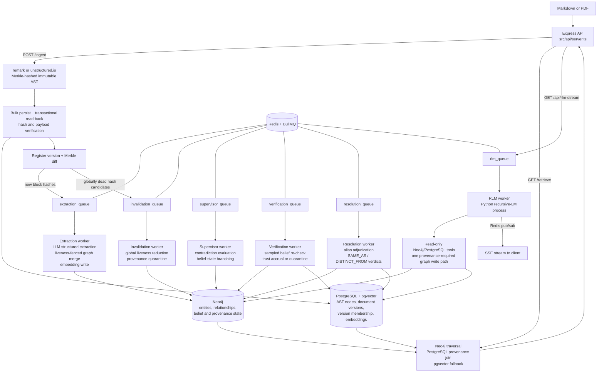

# Trellis Engine — Technical Roadmap

*Generated from a code-led review of the repository (July 4, 2026). File and line references point at the current state of `master`-derived code in this working tree.*

*Status: Foundations, update/invalidation correctness, belief verification, Session 3 deployment/CI readiness, Session 4 structured logging/metrics (T16), Session 5 entity resolution (3.3 #2), Session 6 benchmark maturity (3.3 #3), Session 7's semantic-provenance scale gate, and Session 8 whole-codebase ingestion (3.3 #6, including the measured Entity.name merge index) are complete and verified. The Session 7 measurements did not justify a storage migration; item 3.3 #4 remains open behind explicit observed thresholds, and Session 8's post-index re-measurement kept the gate closed. Every short- and medium-term roadmap item is closed. See §5 Progress Log for what was fixed, what was found along the way, and what remains open.*

---

## 1. Architecture Overview

Trellis is a provenance-preserving GraphRAG system. Its central design commitment is that every semantic fact must remain traceable to an immutable, content-addressed physical location in the source document. The system is organized as an asynchronous pipeline over a three-tier storage layout.

### 1.1 Components and Data Flow

**Storage tiers:**

| Store | Role | Schema |
|---|---|---|
| PostgreSQL + pgvector | Physical layer: immutable AST nodes keyed by SHA-256 Merkle hash, plus embeddings | `ast_nodes(id, document_id, data JSONB, embedding vector(1536))` |
| Neo4j | Semantic layer: `Entity`, `Question`, `Concept` nodes; `ACTION`, `REFERENCES`, `CONTRADICTS`, `DERIVED_INSIGHT` edges, all carrying `sourceNodeIds` back-references | Uniqueness constraints on `Entity.id`, `Question.id`, `Concept.id` |
| Redis | BullMQ job queues (`extraction_queue`, `rlm_queue`, `supervisor_queue`) and pub/sub channels for SSE streaming | — |

**The RLM harness** ([src/rlm/trellis_agent.py](src/rlm/trellis_agent.py)) wraps the `rlms` recursive-LM library with two injected tools: a keyword-guarded read-only Neo4j client and a Postgres AST reader ([src/rlm/trellis_tools.py](src/rlm/trellis_tools.py)). The agent's only permitted graph write is `write_derived_insight`, which caches deduced facts as `DERIVED_INSIGHT` edges with mandatory provenance — the "flywheel" that makes repeat queries cheaper.

**The OOLONG-Pairs benchmark** (`src/benchmarks/`, `scripts/`) is a self-contained evaluation harness: a seeded deterministic dataset generator, a verify-as-you-go ingestion loop, a cache-stripping prep script, and a 20-query runner that scores set-based F1 and measures the cold→warm cost collapse. The committed [benchmark_results.json](benchmark_results.json) shows F1 = 1.0 on all 20 queries with mean sub-calls dropping from 0.36 (cold) to 0 (warm).

**The frontend** (`src/frontend/`) is a Next.js app with a force-directed graph pane and a provenance pane; clicking a graph node highlights the exact AST text blocks that produced it, proxied to the backend via a rewrite rule ([next.config.ts](src/frontend/next.config.ts)).

### 1.2 Design Paradigms

- **Pipeline / queue-driven**: ingestion is a fan-out of independent, retryable jobs (Architecture Invariant 4 in [.agents/AGENT_CODING_GUIDELINES.md](.agents/AGENT_CODING_GUIDELINES.md)).
- **Content addressing**: node identity is `SHA-256(type:content:metadata:childHashes)`; block hashes are context-free, which the ingestion loop exploits for independent re-derivation checks.
- **Verification-as-a-loop**: the OOLONG ingester ([scripts/ingest_oolong_dataset.ts](scripts/ingest_oolong_dataset.ts)) writes a batch, reads it back, re-derives every hash through the parser, and refuses to advance past a failing batch.
- **Boundary validation**: dataset files pass through Zod schemas ([src/benchmarks/oolong/schema.ts](src/benchmarks/oolong/schema.ts)) before touching the pipeline.

---

## 2. Current State and Code Quality

### 2.1 Strengths

- **Provenance threading is consistent.** `sourceNodeIds` is carried through extraction ([extraction_worker.ts:59-76](src/workers/extraction_worker.ts:59)), ingestion verification ([ingest_oolong_dataset.ts:216-224](scripts/ingest_oolong_dataset.ts:216)), the RLM write path ([trellis_tools.py:60-62](src/rlm/trellis_tools.py:60), which rejects writes without provenance), and the retrieval join. This is the project's core differentiator and it is enforced, not just documented.
- **The ingestion verification loop is well-structured.** [ingest_oolong_dataset.ts](scripts/ingest_oolong_dataset.ts) separates write, hash-integrity read-back, semantic write, and constraint verification into named phases with a shared retry helper ([retry.ts](src/benchmarks/oolong/retry.ts)) and clear failure semantics.
- **The benchmark runner is defensively written.** [oolong_runner.ts:76-84](src/benchmarks/oolong_runner.ts:76) canonicalizes predicted tuples by category so tuple-ordering mistakes don't mask correct answers; protocol violations (zero tool calls) trigger bounded re-dispatch; per-query logs are persisted.
- **The RLM sandbox has layered guards**: a mutation-keyword blocklist, a single whitelisted write path, tool-call counting for provenance enforcement, and exceptions that propagate real tracebacks back into the REPL loop for self-correction.
- **Documentation is unusually thorough** for a project at this stage: architecture, math foundations, runbook, benchmark spec, and self-critique (`docs/benchmarks/CRITIQUE_AND_FUTURE.md`) all exist. Newer code (benchmarks, RLM harness) carries purposeful comments explaining invariants rather than restating syntax.

### 2.2 Technical Debt and Concerns

Ordered roughly by severity.

**T1 — No test suite.** *Resolved (July 4, 2026) — see §5.* `package.json:10` was the npm default stub (`echo "Error: no test specified" && exit 1`). There is no unit test framework anywhere in the repo. The scripts under `scripts/` (`test_e2e_rlm.ts`, `run_adversarial_tests.ts`, etc.) are manual end-to-end probes that require live Docker infrastructure and an OpenAI key — they are not automated, not assertion-based, and not CI-runnable. Several modules are pure functions that could be tested today with zero infrastructure: [parser.ts](src/core/ast/parser.ts), [corpus.ts](src/benchmarks/oolong/corpus.ts), and the parse/score functions in [oolong_runner.ts:76-94](src/benchmarks/oolong_runner.ts:76) and [rlm_client.ts:32-58](src/benchmarks/oolong/rlm_client.ts:32).

**T2 — Extraction granularity is wrong for markdown ingestion.** *Resolved (July 4, 2026) — see §5.* [server.ts:78](src/api/server.ts:78) selected "leaf nodes" as any node with string content. In a remark AST, leaves are inline tokens (`text`, `inlineCode`, …), not blocks — so `Globex **acquired** Initech` fans out as three separate extraction jobs (`"Globex "`, `"acquired"`, `" Initech"`), none of which contains the full relationship. Extraction should operate at block level (paragraph/heading) with concatenated child text, as [corpus.ts:27-30](src/benchmarks/oolong/corpus.ts:27) already does via `nodeText()`. This directly degrades graph quality for any formatted document.

**T3 — Runtime dependency misclassification.** *Resolved (July 4, 2026) — see §5.* `ioredis` was in `devDependencies` ([package.json:41](package.json:41)) but is imported at runtime by [server.ts:183](src/api/server.ts:183), [queue.ts:2](src/workers/queue.ts:2), and [rlm_worker.ts:5](src/workers/rlm_worker.ts:5). A production install with `--omit=dev` will not start. Conversely, `@types/*`, `typescript`, and `tsx` sit in `dependencies`.

**T4 — The repo violates its own configuration invariant.** *Resolved (July 4, 2026) — see §5.* [.agents/AGENT_CODING_GUIDELINES.md:13](.agents/AGENT_CODING_GUIDELINES.md) mandates a schema-validated config object exported from `src/config/index.ts`; that file did not exist. Instead, connection details and passwords are hardcoded: Postgres and Neo4j credentials in [db.ts:5-17](src/config/db.ts:5), Redis host/port in [queue.ts:4-8](src/workers/queue.ts:4) and duplicated in [server.ts:201-204](src/api/server.ts:201) and [rlm_worker.ts:7-10](src/workers/rlm_worker.ts:7). The Python tools ([trellis_tools.py:22-26](src/rlm/trellis_tools.py:22)) do read env vars, so the two halves of the system configure differently.

**T5 — Machine-specific path hardcoded in the RLM worker.** *Resolved (July 4, 2026) — see §5.* [rlm_worker.ts:25](src/workers/rlm_worker.ts:25) set `PYTHONPATH` to `C:\Users\Darian\AppData\Roaming\Python\Python313\site-packages`. The RLM pipeline cannot run on any other machine without editing source. The bare `python` executable name is also platform-dependent.

**T6 — No authentication, rate limiting, or concurrency control on the API.** *Resolved (July 4, 2026) — see §5.* All three endpoints are unauthenticated. `/api/rlm-stream` is the sharpest edge: each GET spawns a Python process that makes paid LLM calls and holds database connections ([server.ts:186-239](src/api/server.ts:186)). An unauthenticated caller can generate unbounded cost and process load. There is also no cap on concurrent RLM jobs beyond BullMQ's default worker concurrency.

**T7 — The Cypher read-only guard is a keyword blocklist, and APOC is enabled.** *Resolved (July 4, 2026) — see §5.* [trellis_tools.py:34-41](src/rlm/trellis_tools.py:34) blocks `CREATE/MERGE/SET/...` by word-boundary regex, but [docker-compose.yml:26](docker-compose.yml:26) installs the APOC plugin — `CALL apoc.create.node(...)` and similar procedures mutate the graph without using any blocked keyword. The blocklist also false-positives on legitimate queries that contain the words in string literals. The robust fix is transport-level: open sessions with `default_access_mode=READ` (and/or a read-only Neo4j user), keeping the blocklist only as a fast-fail courtesy check.

**T8 — LLM outputs are parsed without runtime validation, violating Guideline 2.** *Resolved (July 4, 2026) — see §5.* [extraction_worker.ts:30](src/workers/extraction_worker.ts:30) and [supervisor_worker.ts:76](src/workers/supervisor_worker.ts:76) call `JSON.parse(rawContent)` on the completion payload without `GraphSchema.parse()` / `safeParse()`. `zodResponseFormat` constrains the request, but nothing verifies the response, and the repo's own guidelines forbid exactly this pattern.

**T9 — Silent data loss in extraction ID resolution.** *Resolved (July 4, 2026) — see §5.* In [extraction_worker.ts:43-51](src/workers/extraction_worker.ts:43), if the LLM emits an action whose `subjectId`/`objectId` doesn't match any returned entity, the code falls back to the raw ID; the subsequent Cypher `MATCH` on the name then finds nothing and the action is dropped with no log line. Failed resolutions should at minimum be counted and logged.

**T10 — Supervisor worker defects.** *Resolved (July 4, 2026) — see §5; the detection-cost heuristic (fourth bullet) remains open by design.*
- The `Conflict` node created at [supervisor_worker.ts:89](src/workers/supervisor_worker.ts:89) is never connected to anything — it floats as an orphan carrying the reasoning text, unreachable from the entities it explains.
- [supervisor_worker.ts:50,54](src/workers/supervisor_worker.ts:50) join text fragments with the two-character literal `"\\n"` instead of a newline.
- The anomaly query ([supervisor_worker.ts:25](src/workers/supervisor_worker.ts:25)) uses `id()`, deprecated in Neo4j 5 (the resolution query already uses `elementId()`).
- Detection treats *any* same-verb fan-out as a candidate contradiction ("acquired X" and "acquired Y" is normal), relying on the LLM to filter — workable, but every false candidate costs a paid completion.
- The supervisor is also not wired into `start_all.ts` and only runs via the manual trigger script.

**T11 — Per-row inserts and per-job enqueues in the hot ingestion path.** *Resolved (July 4, 2026) — see §5.* [server.ts:62-68](src/api/server.ts:62) inserted AST nodes one query at a time inside a transaction, and [server.ts:79-84](src/api/server.ts:79) enqueued extraction jobs one `await` at a time. For large documents this was a straightforward N-round-trip bottleneck. The production path now uses one multi-row `INSERT ... UNNEST` and one `queue.addBulk()` call. The benchmark ingester retains its small, verification-oriented batches.

**T12 — Document membership is not modeled.** *Resolved prior to this review's publication (Phase 4 versioned-ingest work) — see §5.* `ast_nodes.document_id` is set once and `ON CONFLICT (id) DO NOTHING` ([server.ts:63-67](src/api/server.ts:63)) means a node shared by two documents (identical content) keeps whichever document ingested it first. Content addressing makes node reuse across documents *expected*, so membership needs a join table (`document_nodes(document_id, node_id)`) rather than a column.

**T13 — Hash preimage lacks canonical encoding.** *Open by design for now; current behavior is pinned by unit tests — see §5.* [parser.ts:20-31](src/core/ast/parser.ts:20) builds the hash input by joining `type`, `content`, `JSON.stringify(metadata)`, and concatenated child hashes with `:` delimiters. Because none of the segments are length-prefixed, distinct `(type, content, metadata)` combinations can in principle produce identical preimages. Practical risk is low (types come from a fixed vocabulary), but a Merkle-integrity system should use an unambiguous encoding (length-prefixed segments or canonical JSON of the full tuple). Also, `if (content)` treats empty-string content as absent — a falsy check where an `!== undefined` check is meant.

**T14 — No embedding/queue hygiene.** *Resolved (July 4, 2026) — see §5.*
- ~~No pgvector index; vector fallback is a sequential scan.~~ A partial cosine HNSW index is now created idempotently with the schema.
- ~~Queues lack retry and retention policy.~~ Background queues use bounded exponential retries, permanent OpenAI 4xx failures stop immediately, and completed/failed history is bounded by age and count. The interactive RLM queue retains the history bounds but deliberately has no automatic retries.
- ~~Uploaded PDF files land in `uploads/` via multer ([server.ts:12](src/api/server.ts:12)) with no size/type limit and are never deleted.~~ *Resolved with T6 (July 4, 2026): PDF-only, size-capped, deleted after parsing.*
- ~~No graceful shutdown.~~ SIGINT/SIGTERM now stop API admission, close workers, publishers and queues, then drain PostgreSQL/Neo4j clients in phase order.

**T15 — Duplicated helpers and drift between pipelines.** *Resolved (July 5, 2026) — see §5.* The traversal-helper duplication was resolved with T2. Vector similarity ordering now lives in the PostgreSQL `search_ast_nodes` function consumed by both [server.ts](src/api/server.ts) and [trellis_tools.py](src/rlm/trellis_tools.py). Production `/ingest` now performs its own transactional write → read-back → parser re-derivation check before version registration commits. The OOLONG ingester retains its benchmark-specific semantic constraint verification.

**T16 — Observability is `console.log`.** *Resolved (July 6, 2026) — see §5.* Operational code now logs one JSON object per line through a pino-backed observability module with a validated `LOG_LEVEL`, stable correlation fields (service/worker/queue/jobId/attempt/requestId/docKey/version/astNodeId), and preserved event names. Prometheus metrics are exposed per process: the API serves authenticated `GET /metrics`; the worker container serves an internal listener with queue-depth gauges, job outcomes, pipeline transition counters, LLM token spend, and RLM telemetry parsed from the `TRELLIS_TELEMETRY:` line.

**T17 — Minor documentation drift.** *Resolved (July 4, 2026) — see §5.* [README.md:6](README.md:6) now limits the bounding-box claim to PDF nodes whose parser output supplies coordinates; markdown nodes are explicitly documented as geometry-free. The extraction model had already been consolidated into validated configuration.

**T18 — No reproducible backend deployment or CI.** *Resolved (July 5, 2026) — see §5.* The repository now has a compiled production build, non-root Node/Python image, pinned Python manifests, schema-gated API/worker Compose topology with health checks and project-scoped resources, a tested `.env` load path, GitHub Actions, and a deterministic zero-LLM ingest/provenance/retrieve round trip.

---

## 3. Roadmap

### 3.1 Short-Term (immediate fixes, low-hanging fruit)

1. ~~**Fix dependency classification** (T3)~~ — **done** (July 4, 2026): `ioredis` moved to `dependencies`; `@types/*`, `typescript`, `tsx` moved to `devDependencies`.
2. ~~**Remove the hardcoded PYTHONPATH** (T5)~~ — **done** (July 4, 2026): interpreter comes from `PYTHON_EXECUTABLE` (platform-aware default), `PYTHONPATH` is an optional passthrough, and a missing `rlms` package produces an actionable error.
3. ~~**Create `src/config/index.ts`** (T4)~~ — **done** (July 4, 2026): Zod-validated config read once from env, consumed by `db.ts`, `queue.ts`, `server.ts`, and the workers; Neo4j/Postgres settings are forwarded to the spawned Python process. Also collapsed the model-string duplication (part of T17).
4. ~~**Validate LLM responses** (T8)~~ — **done** (July 4, 2026): every worker-consumed completion crosses `parseLlmResponse` in the new `src/core/llm/boundary.ts` (empty / JSON / schema failure stages); structural failures throw into the BullMQ retry flow, now enabled by bounded queue-level retry defaults.
5. ~~**Fix the supervisor bugs** (T10)~~ — **done** (July 4, 2026): the `Conflict` node is linked to the subject and both branch objects with provenance on every created node/edge, text fragments join with real newlines, detection orders by `elementId()`, and the supervisor worker starts with `start_all.ts`. Cypher and pure helpers live in `src/core/graph/conflict_resolution.ts`.
6. ~~**Log dropped actions in the extraction worker** (T9)~~ — **done** (July 4, 2026): unresolved endpoints are logged at resolution time (`src/core/graph/resolve_actions.ts`) and the merge Cypher returns the merged action ids so Cypher-level drops are detected and logged post-merge.
7. ~~**Stand up a unit test harness** (T1)~~ — **done** (July 4, 2026): vitest wired into `npm test`; 45 tests over parser hashing determinism (including the T13 empty-content and delimiter edge cases, pinned as current behavior), `buildCorpus` round trips, `parsePredictedPairs`/`scoreF1`/`estimateCost`, and the SSE extractors in `rlm_client.ts`. No infrastructure required.
8. ~~**Correct the README bounding-box claim** (T17)~~ — **done** (July 4, 2026): README now distinguishes PDF geometry from geometry-free markdown nodes.

### 3.2 Medium-Term (correctness, performance, robustness)

1. ~~**Fix extraction granularity** (T2)~~ — **done** (July 4, 2026): `/ingest` fans out block-level nodes (paragraph, heading, list item, code, PDF element) with reconstructed inline text via the new `src/core/ast/traverse.ts`, which also consolidates the duplicated `flattenAST`/`nodeText` (the traversal-helper half of T15). See §5.
2. ~~**Harden the RLM sandbox** (T7)~~ — **done** (July 4, 2026): `run_cypher` sessions open with `default_access_mode=READ` (server-enforced; blocklist retained as fast-fail courtesy), `write_derived_insight` uses an explicit WRITE session, APOC dropped from the compose file. Verified live by `npm run test:rlm-sandbox`.
3. ~~**Add API protection** (T6)~~ — **done** (July 4, 2026): API-key middleware (header / Bearer / query param), concurrency cap + queue-depth limit on `/api/rlm-stream` (429), body and upload size limits (413), PDF-only uploads with post-parse cleanup. Verified live by `npm run test:api-hardening`.
4. ~~**Queue hygiene** (T14)~~ — **done** (July 4, 2026): bounded retry/retention defaults, typed permanent-vs-transient OpenAI error classification, phase-ordered SIGINT/SIGTERM shutdown, and a cosine HNSW index.
5. ~~**Model document membership properly** (T12)~~ — **done prior to this roadmap review**: version membership is represented by `documents` and `document_nodes`; see §5 Phase 1 findings.
6. ~~**Batch the ingestion hot path** (T11)~~ — **done** (July 4, 2026): `/ingest` uses a single `UNNEST` insert for AST nodes and `addBulk` for extraction fan-out.
7. ~~**Promote the verified-ingestion loop from the benchmark script into the main pipeline** (T15)~~ — **done** (July 5, 2026): `/ingest` reads every bulk-written AST row back inside the same PostgreSQL transaction, re-derives its hash through `parser.ts`, compares the complete JSON payload, and rolls the version back on any mismatch.
8. ~~**Integration tests against Docker infrastructure**~~ — **done** (July 5, 2026): isolated Compose CI runs real schema initialization, a zero-extraction-block ingest, PostgreSQL document/root membership checks, a directly seeded provenance-bearing Neo4j relationship, and `/retrieve`, with no workers or OpenAI key.
9. ~~**Structured logging and basic metrics** (T16)~~ — **done** (July 6, 2026): pino JSON logging with request/job correlation fields, split API/worker Prometheus registries, counters for job outcomes, dropped/unresolved actions, invalidation and verification transitions, LLM/RLM token spend, and scrape-time queue-depth gauges. See §5.

### 3.3 Long-Term (strategic direction)

1. ~~**The document-update story.**~~ **Done (Phase 4, hardened July 5, 2026):** versioned ingestion computes a Merkle set diff, extracts only new block hashes, reduces document-local orphan candidates against global latest-version membership, and quarantines rather than deletes semantic facts whose provenance died. Cross-store extraction races are fenced and compensated. The Update Drill measured selective reprocessing, invalidation recall/precision, and recovery; see the Phase 4 PRD and §5.
2. ~~**Entity resolution beyond exact-name identity.**~~ **Done (Session 5, July 6, 2026):** entity identity stays `SHA-256(lowercased name)` and the extraction merge is untouched; equivalence is an overlay belief. Deterministic lexical candidate generation ([alias_candidates.ts](src/core/graph/alias_candidates.ts): token containment, acronym, near-identity edit distance; same-kind `generic`/`concept` pairs only — `question`/`category_label` are excluded so flywheel exact-id lookups are unaffected) plus batched LLM adjudication behind the Zod boundary ([alias_resolution.ts](src/core/graph/alias_resolution.ts), `resolution_queue`, `scripts/resolve_sweep.ts`) records `SAME_AS`/`DISTINCT_FROM` verdict edges with union provenance. The verdicts inherit the existing quarantine machinery, and `GET /retrieve` expands one non-contested `SAME_AS` hop at `RESOLUTION_MIN_CONFIDENCE` with per-fact alias attribution (`?resolveAliases=false` opts out). Embedding-similarity candidate generation remains a documented follow-up (entity names carry no embeddings today). See §5.
3. ~~**Benchmark maturity.**~~ **Done (Session 6, July 6, 2026):** dataset v2 (`oolong-pairs-trec-synthetic-v2`, [data/oolong_pairs_dataset_hard.json](data/oolong_pairs_dataset_hard.json), seeded pure generator [generate_v2.ts](src/benchmarks/oolong/generate_v2.ts)) breaks the substring-scan shortcut with paraphrased city mentions (canonical token never in the text — pinned by unit test), near-miss questions name-dropping unannotated cities, and non-question prose distractors ingested as `:Passage` nodes that can never pair. The harness CLIs take `--dataset` (default v1), the runner derives its sequence from the dataset and writes non-v1 results to a separate file, and cache-audit accuracy became a first-class metric shared by the audit CLI, the runner's results block, and the poison drill ([cache_audit.ts](src/benchmarks/oolong/cache_audit.ts)). v1, its committed results, and the drills are untouched. Real TREC import (needs paid annotation), adversarial soft-label corpora, embedding-based retrieval difficulty, and 10k+ scale sweeps remain future work; a paid v2 benchmark run awaits owner approval. See §5.
4. **Scalability of the semantic layer.** Entity `sourceNodeIds` arrays remain unbounded under the append-only `ON MATCH` pattern, but Session 7 measured the real headroom before changing storage. A deterministic 300-document × 20-block drill produced 6,096 semantic nodes and 6,000 relationships: the largest node array was 286, every relationship array remained at 1, and fixed-50-hash median sweep latency grew only 1.42x while semantic facts grew 5.77x. The migration gate therefore stayed closed. Keep arrays until an observed run reaches 1,000 live hashes on one fact or fixed-orphan-set median sweep latency grows more than 1.5 times semantic-fact growth; then migrate node scan anchors to `(:ASTRef {hash})` / `[:EVIDENCED_BY]`, retaining relationship arrays unless their own measurements change. See [the scale report](docs/benchmarks/SCALE_PROVENANCE_REPORT.md) and §5. HNSW and block-level embedding granularity already shipped under T14/T2.
5. ~~**Deployment and community readiness.**~~ **Backend deployment/CI done (July 5, 2026); license done (July 6, 2026):** the backend has a compiled non-root Node/Python image, health-gated project-scoped Compose topology, pinned runtime manifests, documented environment/startup contracts, isolated zero-LLM CI, and an MIT license selected by OpenCnid. The frontend remains intentionally excluded from backend containerization, and its Next.js convention note remains in [src/frontend/AGENTS.md](src/frontend/AGENTS.md).

6. ~~**Whole-codebase ingestion.**~~ **Done (Session 8, July 6, 2026):** one repository snapshot is a bounded sequence of per-file verified ingests (`repo:<key>:<path>` doc keys) through the extracted `src/core/ingestion/` service, with code-aware TypeScript/JavaScript/Python parsing, durable PostgreSQL snapshot membership, tombstone-based deletion/rename semantics that quarantine through the existing invalidation sweep, and a zero-paid-work default (`--extract none`; `changed` requires an explicit budget plus confirmation). The measured `Entity.name` merge index shipped alongside (recorded separately from the still-open 3.3 #4 gate). See §5 and `docs/benchmarks/REPOSITORY_INGESTION_REPORT.md`. The original decision record follows. Decision recorded July 4, 2026: this is a pipeline feature, **not** a relaxation of the T6 per-request limits. The natural unit is one document per source file (`doc_key` = repo-relative path), so per-file Merkle diffs drive incremental re-extraction commit-to-commit — exactly what the physical layer was built for — fed by a batch client/CLI rather than one giant request. A single-blob upload of a repo would defeat per-file identity, diff granularity, and the streaming-free `express.text`/single-transaction ingest (the whole body is buffered in memory and inserted row-by-row). Individual source files fit comfortably inside the 5 MB default (generated artifacts that don't should be excluded, or the env knob raised). Prerequisites before this feature: T11 batching (multi-row inserts + `addBulk` for thousands-of-files fan-out), the rest of T14 (queue hygiene at that job volume), a code-aware parser path (tree-sitter or similar — extraction blocks should be functions/classes, not markdown paragraphs), and extraction cost controls (tiered/selective extraction; one LLM call per block across a 50k-file repo is cost-prohibitive). If a convenience archive-upload endpoint is added, the upload allowlist expands to zip/tar with decompressed-size and entry-count guards (zip bombs) — independent of the per-request caps, which stay small on purpose (each request's body is held fully in memory).

---

## 4. Suggested Sequencing

| Order | Item | Rationale |
|---|---|---|
| ~~1~~ | ~~Structured logging and basic metrics (3.2 #9 / T16)~~ | **Done (July 6, 2026)** — split-process logs/metrics shipped; see §5 |
| ~~2~~ | ~~Entity resolution beyond exact-name identity (3.3 #2)~~ | **Done (Session 5, July 6, 2026)** — SAME_AS overlay beliefs with quarantine inheritance; see §5 |
| ~~3~~ | ~~Benchmark maturity (3.3 #3)~~ | **Done (Session 6, July 6, 2026)** — anti-shortcut dataset v2 + first-class cache-audit metric; see §5 |
| ~~4~~ | ~~Semantic provenance scale gate (3.3 #4 measurement)~~ | **Measured (Session 7, July 6, 2026)** — migration not justified at 300 documents; explicit 1,000-source/superlinear triggers recorded; see §5 |
| ~~5~~ | ~~Whole-codebase ingestion (3.3 #6)~~ | **Done (Session 8, July 6, 2026)** — code-aware per-file snapshots with tombstone deletion, zero-paid-work default, and the measured Entity.name merge index; see §5 |
| 1 | Frontend deployment and community readiness remainder (3.3 #5 residue) | The backend is containerized and CI-covered; the Next.js frontend still has no production build, container, API-key handling, or CI coverage |
| 2 | Conditional provenance storage migration (3.3 #4) | Blocked behind the recorded trigger (an observed 1,000-source fact or superlinear sweep growth); do not migrate arrays on extrapolation alone |

---

## 5. Progress Log

### July 4, 2026 — Phase 1: Foundations & Portability (items 3.1 #1–3, #7)

Completed as three commits, each verified before the next was started (module smoke-loads, ad-hoc `tsc --noEmit` typecheck, and the unit suite).

1. **T3 resolved** — `fix: classify runtime and dev dependencies correctly`. `ioredis` is a runtime dependency; `@types/*`, `typescript`, and `tsx` are dev-only. A `--omit=dev` production install can now start.
2. **T4 + T5 resolved** — `feat: unified Zod-validated configuration module`. `src/config/index.ts` reads and validates the environment exactly once; invalid values fail fast with a readable error. Defaults match the docker-compose development stack, so a bare local run needs no `.env`. All hardcoded Postgres/Neo4j/Redis values, the API port, the extraction-model string, and the Python interpreter selection now flow from this module. `rlm_worker.ts` forwards `NEO4J_URI`/`NEO4J_USER`/`NEO4J_PASSWORD`/`PG_DSN` to the spawned agent so the TypeScript and Python halves configure from one source. Spawn failures and a missing `rlms` package produce actionable error messages.
3. **T1 resolved** — `test: add vitest unit-test harness for the pure modules`. `npm test` runs 45 assertions across `parser.ts`, `scoring.ts`, `rlm_client.ts`, and `corpus.ts` with no database, Docker, or API key. Failure detection was verified with a deliberate negative-control test.

**Findings recorded during this work:**

- **T12 was already resolved** by the Phase 4 versioned-ingest work before this phase began: `documents` and `document_nodes` tables exist ([init_db.ts](src/config/init_db.ts)), `/ingest` records per-version membership and runs Merkle diffs, and orphaned provenance triggers invalidation sweeps. `ast_nodes.document_id` remains as a non-authoritative column, documented as such in `init_db.ts`.
- **New issue found and fixed: ioredis version split.** `bullmq` pins `ioredis@5.10.1` exactly, while the app declared `^5.11.1`; npm therefore installed two copies whose TypeScript types are nominally incompatible. The app now pins `5.10.1` to match. If bullmq's pin moves, the two declarations must move together.
- **T13 is deliberately left open.** Changing the hash preimage (empty-content falsy check, unprefixed `:` delimiters) invalidates every hash already stored in `ast_nodes`, so the fix requires a re-hash migration story. Until then, the current behavior is pinned by tests in [parser.test.ts](src/core/ast/parser.test.ts) so any accidental change to the preimage fails the suite.

**Still open** (unchanged by this phase): T6 (API authentication/rate limiting), T7 (transport-level read-only Cypher sessions; APOC), T8 (Zod validation of LLM responses), T9 (dropped-action logging), T10 (supervisor defects), T11 (ingestion batching), T14 (queue hygiene, pgvector index, upload cleanup, graceful shutdown), T16 (structured logging/metrics), and the T17 README bounding-box correction.

### July 4, 2026 — Phase 2 start: extraction granularity (item 3.2 #1)

**T2 resolved** — `/ingest` now fans out one extraction job per block-level node instead of per inline leaf. `Globex **acquired** Initech` is a single extraction unit carrying the full sentence, rather than three fragments none of which contains the relationship.

- New module [src/core/ast/traverse.ts](src/core/ast/traverse.ts): `collectExtractionBlocks` stops at the top-most block (paragraph, heading, list item, fenced code) and traverses through containers (root, list, blockquote); childless content nodes (PDF elements from unstructured.io) remain units as-is; content-less structural nodes (thematic breaks) are skipped from extraction while still being hashed and persisted.
- `flattenAST`/`nodeText` are consolidated here (previously duplicated between `server.ts` and `corpus.ts` — the traversal-helper half of T15); `corpus.ts` re-exports them so existing imports are unaffected. The vector-search SQL duplication and the verified-loop divergence noted in T15 remain open.
- Re-ingest behavior is preserved: an inline edit changes its parent block's Merkle hash, so exactly that block lands in `diff.added` and re-extracts; byte-identical re-ingests queue nothing. Both properties are covered by unit tests ([traverse.test.ts](src/core/ast/traverse.test.ts), 14 new assertions; suite total 59).
- The `/ingest` response field `leafNodesQueued` was renamed to `blocksQueued`; `API_REFERENCE.md` is updated. Provenance is unchanged: queued jobs carry the block's AST hash as `astNodeId`, which extraction threads into `sourceNodeIds` as before — block hashes are stored in `ast_nodes` like every other node.

**Follow-up noted for the semantic layer** (pre-existing, now more visible): embeddings are written per extraction unit, so they now land on block nodes rather than inline leaves — this matches the 3.3 #4 suggestion to embed at block granularity.

### July 4, 2026 — Belief-quarantine recovery gap for extraction-produced facts (found by live smoke test, fixed)

**The gap.** [invalidation.ts](src/core/graph/invalidation.ts) promises that a contested fact is excluded from `/retrieve` "until it is re-derived from live bytes" — but for extraction-produced facts, re-derivation never cleared the flag. The extraction worker MERGEs actions on `(subject, verb, object)` and its `ON MATCH` only appended `sourceNodeIds`; the only paths that ever set `contested = false` were the RLM's `write_derived_insight` ([trellis_tools.py](src/rlm/trellis_tools.py)) and benchmark helpers. Reproduced live: editing "acquired Initech in 2024" to "in 2025" and re-ingesting re-extracts the same `(globex corporation)-[ACTION {verb:'acquired'}]->(initech)` edge with fresh block provenance, yet the edge stayed `contested = true` and hidden from `/retrieve` forever — a frozen quarantine with a live source. Entity endpoint nodes had the same defect.

**The fix** converges every writer on one belief-provenance state machine, specified as pure functions in the new [provenance.ts](src/core/graph/provenance.ts) (`applyQuarantineSweep` / `applyRederivation`) and mirrored by the Cypher:

- **Extraction merge recovers** ([extraction_merge.ts](src/core/graph/extraction_merge.ts), extracted from the worker so scripts can drive the identical Cypher): `ON MATCH` clears `contested`, stamps `rederivedAt` when the fact was quarantined, keeps `sourceNodeIds` live-only (known-dead hashes stay filtered out; an incoming hash that was once orphaned is resurrected — document reverts re-create old content hashes), and leaves `contestedAt`/`orphanedSourceIds` behind as audit history. Same semantics as the RLM write path, now for `Entity` nodes and `ACTION` edges too.
- **The sweep is order-independent** ([invalidation.ts](src/core/graph/invalidation.ts)): the extraction workers and the invalidation worker race on separate queues, so `/ingest` now passes the version's queued extraction-block hashes as a **fresh set** alongside the orphan set. A fact already carrying fresh provenance was re-derived from live bytes by a racing extraction job and escapes quarantine; dead hashes still move into `orphanedSourceIds` either way. The two transitions commute — proved exhaustively in [provenance.test.ts](src/core/graph/provenance.test.ts) (14 new vitest assertions; suite total 73) and verified against the live stack in both worker orders by the new `npm run test:belief-recovery` ([test_belief_recovery.ts](scripts/test_belief_recovery.ts), 24 checks incl. quarantine → recovery → revert/resurrection).
- **A liveness gate closes the cross-version race** ([registry.ts](src/core/ast/registry.ts) `isAstNodeLive`, called by the worker before the paid LLM call): a queue-lagged extraction job whose block was superseded by a newer re-ingest is skipped instead of resurrecting facts from dead bytes. Registry-unknown nodes (unversioned ingests) are treated as live. Backed by a new `document_nodes(node_id)` index ([init_db.ts](src/config/init_db.ts)).
- The Update Drill re-ingest ([reingest.ts](src/benchmarks/oolong/reingest.ts)) now passes `diff.added` as the fresh set, so its deterministic semantic refresh gets the same recovery semantics as production extraction; its previously "on purpose" permanently-contested refreshed `REFERENCES` edges now recover. The invalidation-recall/precision audit is unaffected (cached `has_category` insights carry no fresh provenance at sweep time and are quarantined exactly as before). `SweepResult` gained `survivedNodes`/`survivedRelationships` telemetry.

**Preserved semantics:** mixed provenance is still contested conservatively per PHASE_4_PRD.md §5 — a part-dead fact survives only if one of its live sources is *fresh* (just re-derived); a fact supported only by *retained* (unchanged) blocks is still quarantined and recovers lazily on next re-derivation, exactly the PRD's story. `npm run test:invalidation-sweep` (RLM write path + sweep) passes unchanged.

**Known residuals (open):** (1) orphan sets are computed per document, so a source hash shared with another live document is still treated as dead — content-addressed cross-document sharing needs a global liveness notion (pre-existing; the `isAstNodeLive` helper is the building block); (2) a sub-millisecond check-then-write window remains if a re-ingest of the same document lands between the worker's liveness check and its merge and the sweep's Cypher executes first (documented in registry.ts); (3) the RLM write path still filters *incoming* provenance against `orphanedSourceIds`, so an agent citing a resurrected (reverted) hash does not un-orphan it the way extraction does — harmless today, worth unifying when trellis_tools.py is next touched.

### July 4, 2026 — LLM response boundary + dropped-action telemetry (items 3.1 #4, #6 — T8, T9)

**T8 resolved.** Raw completions no longer reach `JSON.parse` directly. The new [src/core/llm/boundary.ts](src/core/llm/boundary.ts) exports `parseLlmResponse(schema, raw, context)`, which distinguishes three failure stages — `empty` (nullable/blank content), `json` (malformed or truncated payload), `schema` (valid JSON that fails Zod) — and throws `LlmResponseError` carrying the stage, caller context, and a bounded raw-payload snippet for diagnosis.

- The extraction worker validates against `GraphSchema` and lets the error propagate: the job fails into BullMQ's retry flow, where a fresh (sampled) completion usually parses.
- The supervisor worker validates each conflict evaluation against `ConflictEvaluationSchema` (moved into [schemas.ts](src/core/graph/schemas.ts) so it is importable without the worker's side effects). An invalid evaluation is logged with context and skipped so one bad completion cannot block the other candidate pairs, but any failure still fails the job at the end — the affected pairs still have `belief_state = NULL`, so the retried scan picks them up. The previous `if (!rawContent) continue` silent skip is gone.
- **Retry flow enabled (minimal T14 slice):** the queues in [queue.ts](src/workers/queue.ts) now carry `defaultJobOptions` (`attempts: 3`, exponential backoff), without which "route to the retry flow" was a no-op — a thrown error was a permanent failure. The `rlm_queue` is deliberately excluded: its jobs stream to an interactive SSE client that re-dispatches at its own layer, and a background re-run would spend LLM budget with no listener. The rest of T14 (`removeOnComplete`/`removeOnAge`, retryable-vs-permanent classification, graceful shutdown) remains open. Retried extraction jobs are safe to re-run: the merge is idempotent and the liveness gate re-checks.

**T9 resolved.** Dropped actions are now detected at both layers where they could vanish:

- **Resolution time:** the ID-resolution logic moved out of the worker into the pure [src/core/graph/resolve_actions.ts](src/core/graph/resolve_actions.ts) (`resolveExtractedGraph`), which reports every action whose `subjectId`/`objectId` matched no extracted entity. The worker emits a structured `extraction.unresolved_action_endpoint` warning per occurrence. Unresolved actions are still submitted (unchanged behavior): the raw id passes through as the endpoint name and can legitimately match a pre-existing entity by name.
- **Merge time (the definitive check):** `ACTION_MERGE_CYPHER` now ends with `RETURN act.id`, and `mergeExtractedGraph` returns the merged ids. The worker diffs submitted vs. merged and emits a structured `extraction.action_dropped` warning for each action the Cypher `MATCH` filtered out. The per-job summary log reports `merged/submitted` counts.

Telemetry is single-line JSON on `console.warn` — greppable and machine-parsable now, and a trivial mechanical swap when structured logging lands (T16).

**Tests:** 21 new unit assertions, no infrastructure required ([boundary.test.ts](src/core/llm/boundary.test.ts): all three failure stages, context propagation, snippet bounding; [resolve_actions.test.ts](src/core/graph/resolve_actions.test.ts): pins the SHA-256-of-lowercased-name entity identity, purity, endpoint-level unresolved reporting). Suite total 94, all passing. `mergeExtractedGraph`'s signature change (`Promise<void>` → `Promise<MergeResult>`) is backward compatible for `scripts/test_belief_recovery.ts`, which ignores the return value.

**Why this over the PR #17 residuals:** T8/T9 were the next unstruck short-term roadmap items, violate the repo's own Guidelines 1–2 on the paid-LLM hot path of every ingestion, and are fully unit-testable offline. Of the residuals, global liveness is a design-level change (global orphan tracking) worth its own phase, the check-then-write race is sub-millisecond with no cheap cross-database fix, and the RLM resurrection alignment is documented as harmless today.

### July 4, 2026 — Supervisor worker fixes (item 3.1 #5 — T10)

The supervisor's Cypher and pure helpers moved into [src/core/graph/conflict_resolution.ts](src/core/graph/conflict_resolution.ts) (same importable-without-side-effects pattern as `extraction_merge.ts`); the worker consumes them.

- **The `Conflict` node is no longer an orphan.** The resolution Cypher now creates `(subj)-[:HAS_CONFLICT]->(c:Conflict)` and `(c)-[:CONFLICT_BRANCH {beliefState, actionElementId}]->(obj1/obj2)`, so the reasoning is reachable from all three entities it explains. Neo4j cannot point an edge at a relationship, so each branch records the `elementId` of the ACTION it explains. The node also gains `detectedAt` and the evaluation's `resolutionType` (previously discarded), and — per the architecture invariant — the `Conflict` node and every created edge carry `sourceNodeIds` (each branch inherits its ACTION's provenance; the node, `HAS_CONFLICT`, and `CONTRADICTS` carry the union of both sides; a pre-existing `CONTRADICTS` keeps its original provenance as audit).
- **Real newlines.** Prompt text fragments fetched from Postgres are joined with `"\n"` via the pure `joinAstTexts`/`astRowText` helpers (fallback order `data.value` → `data.text` → raw JSON preserved and pinned by tests) instead of the two-character literal `"\\n"`.
- **`id()` → `elementId()`** in the anomaly query's candidate ordering, matching the resolution query and Neo4j 5 deprecation.
- **Startup wiring:** `scripts/start_all.ts` imports the supervisor worker, so a full-stack start listens on `supervisor_queue` (jobs are still enqueued via the manual trigger script).

**Still open by design:** detection continues to treat any same-verb fan-out as a candidate contradiction, so every false candidate costs one paid evaluation (T10's cost bullet); the schema-validated evaluation boundary from the T8 work is unchanged.

**Tests:** 10 new unit assertions in [conflict_resolution.test.ts](src/core/graph/conflict_resolution.test.ts) — no deprecated `id()` calls, conflict-node linkage and provenance parameters present in the Cypher, evaluation→params mapping with order-preserving provenance union, and the newline-join regression. Suite total 104, all passing; both queries verified to compile against the live Neo4j 5.11 via `EXPLAIN`.

### July 4, 2026 — Sandbox and API hardening (items 3.2 #2, #3 — T7, T6)

**T7 resolved.** The RLM sandbox's read-only guarantee is now transport-level, not lexical:

- [trellis_tools.py](src/rlm/trellis_tools.py) opens every `run_cypher` session with `default_access_mode=READ`, so the Neo4j server itself rejects any write in that session — including write *procedures* whose names contain no blocked keyword. The keyword blocklist is retained as a fast-fail courtesy check (readable error, no round trip); `write_derived_insight` opens its session with explicit WRITE access and remains the single whitelisted mutation path.
- APOC is dropped from [docker-compose.yml](docker-compose.yml): nothing in the codebase calls `apoc.*`, and its procedures were the canonical blocklist bypass. The compose comment records the re-add recipe (plugin + `dbms.security.procedures.allowlist`) should a future feature need it.
- **Live verification:** `npm run test:rlm-sandbox` ([test_rlm_sandbox.ts](scripts/test_rlm_sandbox.ts) spawning [test_rlm_sandbox.py](scripts/test_rlm_sandbox.py) with production env forwarding). The decisive probe is `CALL db.createLabel(...)` — a genuine write whose name defeats `\bCREATE\b` (no word boundary inside `CREATELABEL`), so only the READ session stops it. Before this fix the probe mutated the graph; now the server rejects it, and the write path still works (probe fact written then cleaned up).

**T6 resolved.** All endpoints and the expensive stream path are protected:

- **Authentication:** [src/api/auth.ts](src/api/auth.ts) — when `API_KEY` is set, every endpoint requires it via `x-api-key`, `Authorization: Bearer`, or the `api_key` query parameter (EventSource cannot set headers); comparison is constant-time. Unset ⇒ open with a startup warning, keeping the bare local-dev run working. Auth runs before body parsing.
- **RLM stream admission** ([src/api/stream_gate.ts](src/api/stream_gate.ts) + server wiring): a per-process concurrency gate (`RLM_MAX_CONCURRENT_STREAMS`, default 4) and an `rlm_queue` waiting-depth backstop (`RLM_QUEUE_MAX_DEPTH`, default 32) both return 429 before any SSE/Redis/Python resources are allocated; the gate slot is reclaimed on response close (abort or normal end). The previously fire-and-forget `rlmQueue.add` inside the subscribe callback now reports enqueue failure to the client as an SSE `error` event instead of hanging the stream (the T16 note).
- **Size and type limits:** raw body capped at `INGEST_MAX_BODY_MB` (default 5 MB → 413), uploads PDF-only (→ 400) and capped at `INGEST_MAX_UPLOAD_MB` (default 25 MB → 413), single file; parsed uploads are deleted from `uploads/` in a `finally` (part of T14's hygiene list). A JSON error handler replaces the default HTML error page.
- Config additions are Zod-validated in [src/config/index.ts](src/config/index.ts) with compose-compatible defaults; [API_REFERENCE.md](API_REFERENCE.md) gains §0 (authentication and limits) and the stream endpoint's 401/429/503 semantics.

**Tests:** 19 new unit assertions ([auth.test.ts](src/api/auth.test.ts): constant-time validation incl. length mismatch, key extraction precedence, middleware 401/pass-through; [stream_gate.test.ts](src/api/stream_gate.test.ts): cap admission, release semantics, double-release guard) — suite total 123, all passing offline. Live: `npm run test:api-hardening` boots the real server with a key and asserts 401s on all endpoints, 202 authorized ingest (via header and Bearer), 413 oversize body, and 400 non-PDF upload — designed to queue zero extraction jobs and make zero LLM calls (the probe document is a lone thematic break). `npm run test:rlm-sandbox` covers T7 (4 checks).

**Deliberately not done here:** per-key rate limiting/quotas (single shared key only), TLS termination, and horizontal-scale coordination of the stream gate (each process enforces its own cap; the queue-depth check is the shared backstop) — all deployment-story items for 3.3 #5. The RLM write-path resurrection alignment (PR #17 residual 3) remains open: this change touched `trellis_tools.py`'s session modes only, not the `_WRITE_INSIGHT_QUERY` provenance semantics, which deserve their own belief-state test pass.

### July 4, 2026 — Async reliability and ingestion batching (items 3.1 #8, 3.2 #4 and #6 — T17, T14, T11)

**T14 resolved.** Queue behavior is now bounded and failure-aware:

- Background queues retain three attempts with exponential backoff. Typed OpenAI connection failures, HTTP 408/409/429, and 5xx responses retry; typed permanent 4xx responses become BullMQ `UnrecoverableError` and skip wasteful remaining attempts. Classification uses SDK error types and status fields, never message substrings. Structural `LlmResponseError` and unknown infrastructure failures remain retryable under the bounded policy.
- Every queue now bounds completed and failed history by both age and count. The limits are Zod-validated configuration. `rlm_queue` gets retention but still no automatic retries because an SSE client owns re-dispatch and a background retry would spend tokens without a listener.
- A phase-ordered shutdown coordinator handles SIGINT/SIGTERM: stop API admission, wait for workers, close the RLM publisher and BullMQ queues/connection, then drain PostgreSQL and Neo4j clients. Registration is shared by combined and single-process entry points.
- Database initialization creates a partial cosine HNSW index over non-null `ast_nodes.embedding` values. The TypeScript vector query now uses the same explicit `::vector` cast as the Python path.

**T11 resolved.** `/ingest` replaces one PostgreSQL call per AST node with one aligned-array `INSERT ... UNNEST`, and replaces one BullMQ call per extraction block with `queue.addBulk()`. Transaction boundaries, immutable hash identity, version membership, diff filtering, and per-block job payloads are unchanged.

**Boundary and no-loss findings fixed while completing the retry path.**

- The verification classifier was the one worker-consumed LLM completion still using raw `JSON.parse` despite the earlier T8 record. It now requests strict structured output and crosses `parseLlmResponse(VerificationResponseSchema, ...)`; malformed or partial batches fail into the bounded retry flow instead of silently dropping answers.
- Supervisor resolution transaction failures were logged and swallowed, allowing the scan job to report success after losing a conflict transition. They now fail the job and enter the same retry policy.
- `scripts/start_all.ts` now starts the verification worker, so the unified process consumes every declared production queue.

**T17 resolved.** README now states that bounding boxes are preserved for PDF nodes only when parser coordinates exist; markdown nodes do not carry geometry.

**Tests:** 29 new offline assertions cover typed retry decisions and BullMQ conversion, RLM retry exclusion plus retention defaults, one-round-trip AST persistence and bulk-job payloads, shutdown ordering/idempotence/failure continuation, strict verification payload/coverage validation, and HNSW schema presence. Suite total: 152 passing.

**Deliberately not included:** structured logging/metrics (T16), the provenance residuals from the belief-recovery entry, verified production ingestion (T15), CI/container packaging, entity resolution, benchmark expansion, and hash-preimage changes (T13).

### July 5, 2026 — Provenance residuals and verified production ingestion (item 3.2 #7 — T15)

The correctness residuals recorded after belief-quarantine recovery are closed at their owning boundaries:

- **Global source liveness:** a per-document Merkle diff now supplies orphan *candidates*. At invalidation-worker execution time, [registry.ts](src/core/ast/registry.ts) retains any candidate present in the latest version of another registered document. Skipped shared hashes emit the `invalidation.shared_sources_retained` JSON event with job/document context. The live belief-recovery script proves that one document can remove a block while another keeps the identical content hash without quarantining its semantic evidence.
- **Extraction check/write race:** the early liveness gate still avoids a paid completion for queue-lagged dead bytes. A second check immediately precedes the Neo4j merge; a post-merge check applies a compensating quarantine if a re-ingest committed during the merge. A pre-dead retry also compensates in case an earlier BullMQ attempt committed Neo4j and failed before its post-check. [extraction_liveness.ts](src/core/graph/extraction_liveness.ts) specifies the ordering without worker side effects. PostgreSQL and Neo4j do not share a transaction, so atomic reader visibility during the short merge/post-check interval is not claimed; the settled state cannot remain trusted with dead provenance.
- **RLM resurrection alignment:** `_WRITE_INSIGHT_QUERY` now implements the same `applyRederivation` transition as extraction. Incoming live hashes are authoritative, including a reverted hash previously present in `orphanedSourceIds`; that hash moves back to `sourceNodeIds` on the edge and both endpoint nodes. Other orphan history remains.
- **Verified production ingestion:** after the existing bulk `UNNEST` write, `/ingest` performs one read-back query inside the same transaction. Every expected row must exist, its stored payload must re-derive the expected ID through the unchanged parser preimage, and its full JSON payload must match parser output. Any failure rolls back AST rows, membership, and version registration before jobs can be queued.
- **Vector-query deduplication:** cosine ordering, null filtering, and result shape now live in the schema-level `search_ast_nodes(vector, count)` function. The Express and Python clients call that function instead of carrying parallel `<=>` queries.

**Tests:** 14 new offline assertions cover global-orphan query behavior, tracked/untracked liveness, all liveness-fence orders including compensation failure, read-back success/missing/corrupt/payload-drift cases, and schema-level vector search; suite total 166 passing. Live verification: `test:belief-recovery` (30 checks, including global sharing and real Neo4j race compensation), `test:invalidation-sweep` (17 checks, including Python RLM revert resurrection), `test:api-hardening` (9 checks, exercising verified `/ingest` with zero extraction jobs), and `test:rlm-sandbox` (4 checks). A direct 1536-dimension zero-vector call verified the database function without an LLM call.

**Deliberately not included:** the T13 hash-preimage migration, structured logging/metrics (T16), CI/container packaging, entity resolution, benchmark expansion, and whole-codebase ingestion.

### July 5, 2026 — Deployment and CI readiness (items 3.2 #8 and 3.3 #5 — T18)

The backend now has a reproducible production and CI path without changing the PR #22 correctness boundaries:

- **Compiled production runtime:** [tsconfig.build.json](tsconfig.build.json) emits `dist/`; `npm start`, `start:api`, `start:workers`, and `db:init` execute emitted JavaScript with production dependencies. `tsx` and TypeScript remain dev-only. API and worker entrypoints are split for process isolation while `start_all.ts` retains the unified local path.
- **Node/Python image:** [Dockerfile](Dockerfile) builds TypeScript separately, installs only production Node modules in the runtime, runs as UID 1000 with a writable upload directory, and uses an init-then-`exec` entrypoint so SIGTERM reaches Node directly. Direct application dependencies and the imports required by `partition_pdf(strategy="fast")` are pinned in reviewed manifests; hi-res Torch/transformer packages are deliberately excluded. The final image is 583 MB and includes the RLM Python files, rubric, and PDF parser at their existing paths.
- **Failing schema gate and health contract:** `init_db.ts` now exits nonzero when either store or client cleanup fails. Compose waits for PostgreSQL, Neo4j, and Redis health before starting the API/workers, and the image entrypoint completes idempotent initialization before Node accepts traffic. `/healthz` is an unauthenticated liveness-only endpoint; dependency readiness is intentionally established by bootstrap/Compose rather than turning outages into restart loops.
- **Project-scoped Compose topology:** the obsolete version key and fixed container names are gone. API and workers share one image but run as separate services with service-DNS configuration. Ports are overrideable (including Docker-assigned port `0` for CI), and named volumes remain scoped to the selected Compose project.
- **Environment contract:** dotenv loads `.env` once before the existing Zod boundary and never overrides shell/Compose values. [.env.example](.env.example) covers every supported TypeScript variable plus `OPENAI_API_KEY`; README distinguishes bare-host loading from Compose interpolation and marks API/LLM keys as non-local requirements.
- **Deterministic CI:** [.github/workflows/ci.yml](.github/workflows/ci.yml) runs the offline suite/build/Python smoke check, builds the image, and starts an isolated Compose project. The compiled integration script starts no workers and receives no OpenAI key; it ingests a lone thematic break, verifies PostgreSQL document/root membership, seeds an `ACTION` whose nodes and edge carry `sourceNodeIds`, then proves `/retrieve` joins the fact to the physical hash.

**Verification:** `npm ci`; `npm test` (170 passing across 22 files); `npm run build`; `npm run python:check`; `docker compose --profile test config --quiet`; `docker build --tag trellis-backend:session3 .`; a disposable image check verified UID 1000, no TypeScript dev dependency, no Torch package, and Python runtime imports; the isolated Compose integration completed five assertions and removed only its project-scoped containers/volumes; `npm run test:api-hardening` passed 11 checks; `npm run test:rlm-sandbox` passed 4 checks. `git diff --check` passes.

**License gate at that session boundary:** OpenCnid's choice was still pending, so no license was inferred during Session 3. OpenCnid selected MIT on July 6, 2026; see the next entry.

### July 6, 2026 — Session 4 direction, documentation reconciliation, and MIT license

- Session 4 is scoped to the final open medium-term roadmap item: structured logging and basic metrics (T16). The handoff requires correlation fields across API requests and BullMQ jobs, counters for failures/dropped transitions/LLM usage, queue-depth gauges, and an explicit cross-process metrics design because API and workers run in separate containers.
- The component diagram in §1.1 now uses Mermaid and includes the version/diff/invalidation path, verification worker, RLM tool boundary, all five queues, and the split physical/semantic stores.
- The stale long-term document-update entry and suggested sequencing table now reflect the shipped Phase 4/5 and deployment work instead of re-proposing it.
- The operations runbook now uses project-scoped `docker compose` commands, removes assumptions about fixed container names, and replaces broad Redis destruction advice with scoped diagnosis and recovery guidance.
- OpenCnid selected the MIT License. A repository `LICENSE` was added, package metadata was aligned to `MIT`, and the README's pending-license statement was removed.

**Still open at that entry:** T16 implementation, T13's migration-dependent hash preimage, entity resolution, benchmark/scale maturity, semantic provenance scaling, whole-codebase ingestion, and frontend deployment.

### July 6, 2026 — Session 4: structured logging and basic metrics (item 3.2 #9 — T16)

Operational logging and metrics now describe the split API/worker topology directly instead of through greppable ad-hoc JSON.

**Structured logging.** A side-effect-free `src/core/observability/` module wraps `pino`: `buildLogger` is a pure factory (offline-testable against an in-memory sink) and the lazy process-root logger takes its level from a new Zod-validated `LOG_LEVEL` and stamps `service` from `TRELLIS_SERVICE` (Compose sets `api`/`workers` per container). Every operational line is one JSON object with a stable dot-namespaced `event` field, child-logger correlation bindings (`worker`, `queue`, `jobId`, `attempt`, `requestId`, `docKey`, `version`, `astNodeId`), and an `err` serializer preserving type/message/stack. All `src/api`, `src/workers`, `src/config`, and `src/core/runtime` console output converted; pre-existing machine-readable event names (`extraction.unresolved_action_endpoint`, `extraction.action_dropped`, `invalidation.shared_sources_retained`, `supervisor.evaluation_invalid`, `worker.error_classified`, `runtime.shutdown_*`, `database.initialization_failed`, …) are preserved as `event` values. The injected sinks in `withWorkerRetryPolicy`, `ShutdownCoordinator`, and `runInitializationTasks` changed from `(line: string)` to structured `(fields)` emitters defaulting to the root logger. Benchmark runners and maintenance CLIs deliberately keep human-formatted output. Request bodies, source text, prompts, SSE query content, embeddings, and secrets are never logged.

**Request/job correlation.** The API binds a generated `requestId` to every request (returned as the `x-request-id` header, logged in `http.request_completed`), and `/ingest` threads `requestId`/`docKey`/`version` into every extraction and invalidation job payload as optional fields (pre-T16 queued jobs still process), so a failed or dropped job resolves to the request and version that produced it.

**Metrics.** `prom-client` registries are per process — one process-local registry cannot describe both containers, so: the API serves authenticated `GET /metrics` (same API-key middleware as every operational endpoint; `/healthz` unchanged, liveness-only), and the worker process serves its own registry on an internal listener (`WORKER_METRICS_PORT`, default 9464) that Compose deliberately does not publish to the host. Metric handles come from a `createMetrics(registry)` factory, so duplicate registration is structurally impossible in tests. Instrumented: HTTP requests by method/normalized-route/status class (fixed route table — entity names, doc keys, and query strings can never mint label values); BullMQ outcomes `started`/`completed`/`failed_retryable`/`failed_exhausted`/`failed_unrecoverable` plus duration per worker/queue; extraction unresolved endpoints, dropped actions, and superseded/compensated liveness fences; invalidation candidates, globally retained shared hashes, contested/survived nodes and relationships, and batches; verification classified/agreed/disputed/skipped results; LLM calls and input/output/embedding tokens by operation/model; and scrape-time queue-depth gauges (`waiting`/`active`/`delayed`/`failed`) for all five queues, where a per-queue Redis read failure emits a structured warning plus a failure counter without breaking the scrape.

**RLM telemetry boundary.** `rlm_worker.ts` now feeds stdout chunks through a bounded line scanner (`rlm_telemetry.ts`) that parses the existing `TRELLIS_TELEMETRY: {...}` line into token/subcall/tool-call/duration metrics and an `rlm.telemetry` log event. The scanner is a pure observer: the Redis/SSE byte stream is published unchanged, split records and multiple records per chunk are handled, a final partial line is flushed at process exit, an oversized unterminated line is dropped without unbounded buffering, and a malformed payload emits `rlm.telemetry_malformed` plus a counter — never a job failure or stream corruption. Run exits feed `trellis_rlm_runs_total{exit_status}`.

**Verification.** Offline: 37 new assertions covering log shape/level filtering/child bindings/error serialization, route normalization and status classes, job-outcome classification incl. `UnrecoverableError` and missing jobs, queue gauge collection incl. isolated read failure, LLM usage present/absent, telemetry chunk-boundary/malformed/partial-line/oversized cases, exposition without duplicate registration, metrics listener lifecycle, job-context threading, and the bootstrap advisory lock (suite total 207 across 30 files, from 170/22). `npm run build`, `npm run python:check`, and `docker compose --profile test config --quiet` pass. Live zero-LLM: `npm run test:api-hardening` grew to 18 checks (metrics 401/200/content-type, ingest visible in counters, 401s counted, and every server stdout line parses as JSON with `api.started`/`http.request_completed` events); `npm run test:rlm-sandbox` passes 4 checks; the isolated Compose integration grew to 9 assertions — API `/metrics` authentication/content-type/counters after the deterministic ingest, the worker listener reachable via service DNS on the internal network (the `workers` service joined the integration's dependencies; the probe document still queues zero extraction jobs) with live queue gauges for all five queues, and an unchanged `/healthz` contract.

**Found and fixed: concurrent schema-bootstrap race.** Adding `workers` to the integration service's dependencies made CI start the API and worker containers against a fresh PostgreSQL simultaneously for the first time — and both entrypoints run the idempotent `db:init`. `CREATE EXTENSION IF NOT EXISTS` is not concurrency-safe (`duplicate key value violates unique constraint "pg_extension_name_index"`), so one container's bootstrap failed and Compose declared its dependency dead even though the restart succeeded. The race pre-dated Session 4 for any fresh-volume `docker compose up` of the full stack; CI had simply never started both app containers. `POSTGRES_SCHEMA_SQL` now begins with `SELECT pg_advisory_xact_lock(hashtext('trellis_schema_init'))`, serializing the whole single-transaction script; a unit test pins the lock as the first statement.

**Found and fixed: the Session 3 image's worker process could not start.** With workers actually exercised in CI, the container crash-looped at import: `verification.ts` resolves `trec_rubric.json` relative to `__dirname`, which is `dist/src/core/graph` in the compiled runtime, but the image only shipped the rubric at the Python path (`src/rlm/`). Every compiled `start:workers` run since Session 3 would have crashed the same way; local development never noticed because `tsx` runs from source where the relative path resolves. The Dockerfile now copies the same versioned rubric to `dist/src/rlm/` as well, and the Compose integration keeps workers in its dependency set so a worker-process import regression fails CI from now on.

**Documentation.** `.env.example` and README gained `LOG_LEVEL`, `TRELLIS_SERVICE`, `WORKER_METRICS_PORT`/`HOST`; `API_REFERENCE.md` §0 documents `GET /metrics`, the worker listener, and the `x-request-id` correlation contract; the runbook's §7 now catalogs the real metric names with diagnostic PromQL and log-trace recipes, and §3 gained a no-`redis-cli` queue-depth probe.

**Deliberately not included:** OpenTelemetry/vendor exporters and tracing (they can now layer on the stable local log/metric contract), per-metric persistence across process restarts (counters are process-lifetime by Prometheus convention), publishing the worker metrics port to the host, T13 re-hashing, entity resolution, and benchmark expansion.

**Still open:** T13's migration-dependent hash preimage, entity resolution, benchmark/scale maturity, semantic provenance scaling, whole-codebase ingestion, and frontend deployment.

### July 6, 2026 — The handoff loop

`HANDOFF.md` is now self-regenerating: it is both the prompt that starts a session and a deliverable that session must produce. Each session executes the objective the file specifies, records completion in this §5 log, then rewrites the file for the next objective — taken from the first unstruck row of the §4 sequencing table unless a discovered defect should jump the queue — updating the baseline facts (master commit, test counts, live-check counts) and preserving the permanent §0 loop protocol and invariant guardrails verbatim. A session that ships its objective but does not regenerate the handoff has not finished. The first handoff written under this protocol targets Session 5: entity resolution beyond exact-name identity (item 3.3 #2), designed as a `SAME_AS`/`DISTINCT_FROM` overlay belief with provenance that inherits the existing quarantine machinery — never a merge of Entity nodes.

### July 6, 2026 — Session 5: entity resolution beyond exact-name identity (item 3.3 #2)

Entity identity remains immutable — `globalEntityId` (`SHA-256(lowercase(name))`) and both merge Cyphers are byte-for-byte unchanged, and no Entity node is ever merged, renamed, or deleted. Equivalence became a first-class, quarantinable belief.

**Candidate generation (deterministic, LLM-free).** New pure module [alias_candidates.ts](src/core/graph/alias_candidates.ts): normalized-token containment ("globex" ⊂ "globex corporation"), acronym/initialism match ("ibm" ↔ "international business machines"), and a near-identity edit-distance guard (Levenshtein ≤ 1, ≤ 2 for names of 12+ characters — punctuation/typo variants). Kind discipline: only same-kind pairs among `generic`/`concept`; a NULL kind (extraction-created entities predate kind stamping) behaves as `generic` per the entity_kinds migration's rule 4; `q_<digits>` names and the six TREC labels are additionally excluded *by name* regardless of stamped kind, so the OOLONG flywheel's exact-id lookups are structurally untouchable. Pairs are emitted in canonical order (lexicographically smaller entity id first, sorted, deduplicated), making the candidate set, the edge direction, and the sweep cap deterministic.

**Adjudication (LLM, batched, validated).** New `resolution_queue` (standard retrying job options — verdict edges MERGE on the pair, so re-runs are idempotent) and [resolution_worker.ts](src/workers/resolution_worker.ts) on the verification-worker skeleton, wired into `queue.ts`, `start_workers.ts`, the queue-gauge list, and shutdown. `AliasAdjudicationSchema` (per pair: `sameEntity`, `confidence` 0..1, `reasoning`) crosses `parseLlmResponse`; hallucinated pairIds are discarded rather than written. Prompt context per pair is both names/types/kinds plus source-text snippets (600 chars max per entity) fetched from each endpoint's live `sourceNodeIds` — never whole documents. `makeOracleAdjudicator` mirrors `makeOracleClassifier` for zero-LLM drills. The sweep scheduler [resolve_sweep.ts](scripts/resolve_sweep.ts) (`npm run resolve:sweep`, flags `--max-pairs`/`--prefix`/`--oracle`/`--sync`/`--dry-run`) selects uncontested, provenance-bearing entities, excludes pairs already settled by a non-contested verdict, caps at `RESOLUTION_MAX_PAIRS_PER_SWEEP` (default 200), and enqueues one job.

**Verdict edges.** Positive: `(a)-[:SAME_AS]->(b)` in canonical id order; negative: `(a)-[:DISTINCT_FROM]->(b)` so a settled pair is never re-paid for. Both carry `confidence`, `adjudicatedAt`, `method` (`llm`/`oracle`), `model`, bounded `reasoning` (500 chars), and `sourceNodeIds` = the union of both endpoints' live provenance at adjudication time. The merge's ON MATCH mirrors `ENTITY_MERGE_CYPHER`'s `applyRederivation` semantics, so quarantine inheritance is free: the existing invalidation sweep contests a verdict edge when its provenance dies (its relationship pass matches any edge with `sourceNodeIds`), the contested pair becomes re-adjudicable on a later sweep, and a fresh verdict recovers the edge with `rederivedAt` stamped and the dead hash kept in `orphanedSourceIds` as audit. Zero new quarantine machinery.

**Retrieval integration.** `GET /retrieve` expands the seed across non-contested `SAME_AS` edges with `confidence >= RESOLUTION_MIN_CONFIDENCE` (default 0.8) — one undirected hop, since canonical direction is an id artifact — then runs the existing traversal over seed + aliases, unions provenance, and attributes each fact via a `viaAlias` field per graph row plus a `resolvedAliases` response field. `?resolveAliases=false` opts out; `includeContested` stays orthogonal and never relaxes the expansion filter. The fixed route-label table is untouched.

**Configuration and observability.** `RESOLUTION_MIN_CONFIDENCE` / `RESOLUTION_MAX_PAIRS_PER_SWEEP` / `RESOLUTION_BATCH_SIZE` (default 25 pairs per completion) flow through `src/config/index.ts` only. T16 house style throughout: child logger (`worker: 'resolution'`), `instrumentWorker`, `recordLlmCall`-equivalent spend under `operation: 'resolution'`, events `resolution.sweep_started`/`sweep_completed`/`alias_recorded`/`pair_distinct`, counters `trellis_resolution_candidates_total` and `trellis_resolution_pairs_total{verdict}`. Entity names appear in logs only, never in metric labels; telemetry emission lives in the side-effect-free [resolution_telemetry.ts](src/core/graph/resolution_telemetry.ts) so it is testable with injected fakes.

**Verification (all commands run, zero LLM calls end to end).** Offline: `npm test` = 247 passing across 33 files (baseline 207/30; +40 assertions covering containment/acronym/edit-distance signals, kind restrictions and the by-name question/TREC exclusion, canonical ordering/dedup/cap determinism/purity, `AliasAdjudicationSchema` through all three `parseLlmResponse` failure stages, verdict-param canonical direction/provenance union/reasoning bounding, verdict/selection/expansion Cypher pins, oracle adjudicator including absent pairs, telemetry metrics/log emission via fakes, and the sixth queue's gauge exposition). `npm run build`, `npm run python:check`, `docker compose --profile test config --quiet` pass; the isolated Compose integration's queue-gauge assertion now covers `resolution_queue`. Live zero-LLM: new `npm run test:entity-resolution` (33 checks) seeds "globex"/"globex corporation"/decoy "globex group" with distinct facts and real Merkle provenance, runs selection + the real worker over Redis in oracle mode, and proves canonical-direction `SAME_AS` with union provenance, the `DISTINCT_FROM` decoy verdict, settled-pair exclusion on re-selection, `/retrieve` alias expansion with attribution and union provenance (and `resolveAliases=false` restoring old behavior), quarantine inheritance through a real re-ingest diff + the existing sweep (expansion stops), and contested-pair re-adjudication recovering the edge. Existing suites stayed green: `test:api-hardening` (18), `test:rlm-sandbox` (4), `test:belief-recovery`, `test:invalidation-sweep`. `git diff --check` passes.

**Deliberately not included:** embedding-based candidate generation (entity names carry no embeddings today — documented follow-up), automatic entity merging or canonical-node rewriting, coreference/NLP libraries, RLM prompt changes to exploit `SAME_AS`, verification-worker spot-checks of `SAME_AS` beliefs (natural extension of the existing sampler), benchmark corpus expansion, and T13 re-hashing.

### July 6, 2026 — Session 6: benchmark maturity (item 3.3 #3)

The saturated v1 benchmark (F1 = 1.0 on all 20 queries; every city mention a literal capitalized token satisfiable by substring scan) now has a discriminating successor, and cache trustworthiness is a recorded metric instead of an out-of-band script.

**Dataset v2 — the anti-shortcut corpus.** New pure seeded generator [src/benchmarks/oolong/generate_v2.ts](src/benchmarks/oolong/generate_v2.ts) (`buildV2Dataset()`, seed 43, byte-identical across runs) emits [data/oolong_pairs_dataset_hard.json](data/oolong_pairs_dataset_hard.json) (`oolong-pairs-trec-synthetic-v2`): 220 questions (50 LOC + 50 HUM + 35 NUM + 35 ENTY + 35 DESC + 15 ABBR over the same 14 cities) plus 20 prose passages. Three shortcut breakers, all with offline-derivable ground truth: (1) **paraphrases** — a hand-authored per-city alias table ("the French capital"); 14 LOC + 14 HUM records mention their city only indirectly, `concepts` keeps the canonical name, the new optional `surface_forms` schema field records the alias, and a unit test pins that no paraphrased text contains its canonical token; (2) **near misses** — 6 LOC + 6 HUM records where the city token names a quoted artifact (`concepts: []`) and 8 ENTY records annotated with city Y while name-dropping city X, recorded in the new optional `distractor_mentions` field, all structurally excluded from ground truth; (3) **prose distractors** — a new optional `distractor_passages` dataset field (kept out of `records` so every question-record consumer — poison seeding, mutation, scoring — works on v2 unchanged), ingested as `:Passage` nodes with real provenance but no category and no `REFERENCES`, so they can never pair. Question ids are `q_1001..q_1220` — disjoint from v1's `q_0001..q_0220` so both corpora coexist in one graph, still matching the `q_\d+` shape pinned by `parsePredictedPairs` and the entity-kind question pattern (alias resolution keeps ignoring them by name). All v2 template wording is disjoint from v1's so no content-addressed block hash is shared between corpora.

**Filename deviation from the handoff, with reason:** the handoff suggested `data/oolong_pairs_dataset_v2.json`, but that file already exists — it is the Update Drill's MUTATED byte-version 2 of the v1 corpus (`oolong-pairs-trec-synthetic-v1-drill-v2`), referenced by `poison_drill_runner.ts` and the re-ingest drill. The harder corpus therefore lives at `data/oolong_pairs_dataset_hard.json`; the dataset `name` field keeps the handoff's `oolong-pairs-trec-synthetic-v2`.

**Harness generalization.** [scripts/ingest_oolong_dataset.ts](scripts/ingest_oolong_dataset.ts), [scripts/audit_flywheel_cache.ts](scripts/audit_flywheel_cache.ts), [scripts/test_oolong_pairs_query.ts](scripts/test_oolong_pairs_query.ts), and the benchmark runner accept `--dataset <path>` defaulting to v1 (shared plumbing in [dataset_cli.ts](src/benchmarks/oolong/dataset_cli.ts)); `prepare_oolong_flywheel.ts` needed no flag — contrary to the handoff's claim it reads no dataset path and already strips annotations graph-wide. The ingest loop gained passage phases with the same write → read-back → re-derive → constraint shape (`:Passage` verification asserts provenance resolves AND that no passage carries a category, `REFERENCES` edges, or a `:Question` id collision). The pairs query and the cache fetch are now id-scoped to their dataset so coexisting corpora cannot pollute each other's answer keys. `buildCorpus` binds passages through the identical heading+paragraph round trip (empty `boundPassages` for v1). The runner derives its city list from the dataset it is pointed at, defaults non-v1 results to `benchmark_results_v2.json` (or `--results <path>`), and refuses to write the committed v1 `benchmark_results.json` for any other dataset.

**Cache-audit accuracy as a first-class metric.** New pure module [src/benchmarks/oolong/cache_audit.ts](src/benchmarks/oolong/cache_audit.ts) (`auditCacheRows` → `{ cached, correct, wrong, unknown, accuracy, mistakes }`, accuracy `null` when nothing is gradable) with an id-scoped fetch of EFFECTIVE (non-contested) `has_category` edges — the audit grades what the cache actually serves. `scripts/audit_flywheel_cache.ts` became a thin caller; the benchmark runner appends a post-warm `cache_audit` block to its results file; the poison drill records `cache_audit_post_poison` and `cache_audit_post_detection` per policy from the same implementation, so poison recall and cache accuracy can never drift apart.

**Defect found and fixed along the way (1):** the first draft of the passage constraint check used a bare-node pattern comprehension (`size([(q:Question {id: p.id}) | 1])`), which Neo4j 5 rejects — pattern comprehensions require a relationship. Replaced with a `COUNT { MATCH ... }` subquery in both the ingest verification and the live test before merge; caught by running the live suite, not by review.

**Defect found and fixed along the way (2) — pre-existing concurrent-bootstrap deadlock on the Neo4j side.** This PR's first CI run failed with the backend container unhealthy: both app containers run the idempotent `db:init` against a fresh graph simultaneously, and the two concurrent `CREATE CONSTRAINT IF NOT EXISTS` calls deadlocked on the label lock (`Neo.TransientError.Transaction.DeadlockDetected`, `ForsetiClient ... can't acquire UpdateLock ... on LABEL(0)`). Session 4's fix serialized only the PostgreSQL half (`pg_advisory_xact_lock`); the Neo4j half ran as a bare `session.run` — one attempt, no retry — and had been a latent timing race in every fresh-volume dual-container start since. The bootstrap now goes through `executeWrite` in the extracted [src/config/neo4j_bootstrap.ts](src/config/neo4j_bootstrap.ts) (the driver's managed transaction function retries transient errors by contract), pinned by 4 unit tests with an injected fake driver (suite 283/37). Verified live by a stress harness: 8 rounds of two concurrent compiled `db:init` processes against a throwaway Neo4j with the constraint dropped before each round — 16/16 exits clean — plus a fresh isolated Compose integration pass.

**Verification (all commands run, zero LLM calls end to end).** Offline: `npm test` = **283 passing across 37 files** (baseline 247/33; +36 assertions covering generator determinism/schema/category distribution/id disjointness, the anti-shortcut pin (28 paraphrased records, no canonical token, alias table covers all 14 cities), near-miss and passage exclusion from ground truth, hand-computed pair fixture plus independent re-derivation and per-city aggregate cross-check, passage corpus binding round trips (including hash stability of record blocks when passages are appended), cache-audit arithmetic (correct/wrong/unknown, case-insensitivity, empty cache and all-unknown → null accuracy, mistake-sample bounding), `--dataset` flag parsing + committed-file validation for both corpora, and the Neo4j bootstrap retry pins from defect (2)). `npm run build`, `npm run python:check`, `docker compose --profile test config --quiet` pass; the isolated Compose integration passed its 9 assertions in a scoped project (`trellis-s6-integration`) and removed only its own volumes. Live zero-LLM: new `npm run test:benchmark-hardening` (**24 checks**) ingests v2 through the real `--dataset` flag path (exit 0 = hash round trip + constraints), proves the id-scoped `REFERENCES` traversal reproduces the 139-pair v2 ground truth exactly, asserts all 20 `:Passage` nodes carry resolvable provenance with no category/REFERENCES/`:Question` collision, seeds the oracle cache (`seedVerifiedCache`) and audits accuracy 1.0, poisons 11 labels and audits accuracy 209/220 with mistakes matching the manifest exactly, verifies v2 question/label entities carry kinds `question`/`category_label` and `selectResolutionCandidates` proposes zero pairs touching them, then cleans up everything it created while preserving pre-existing shared rows. Existing suites stayed green: `test:entity-resolution` (33), `test:api-hardening` (18), `test:rlm-sandbox` (4), `test:belief-recovery`, `test:invalidation-sweep`. `git diff --check` passes.

**Cost:** zero paid LLM calls. No benchmark run against v2 was executed; per the cost policy it requires explicit owner approval with an estimate derived from v1 telemetry ($0.81–$0.87 per 20-query run; a v2 run is expected to cost more in the warm phase because mention resolution is no longer a free substring scan).

**Deliberately not included:** real TREC import (needs a paid, non-deterministic annotation pass — recorded as future work in `docs/benchmarks/CRITIQUE_AND_FUTURE.md` §3.3), adversarial soft-label corpora, embedding-based candidate generation or retrieval changes, RLM prompt/protocol changes, 10k+ scale sweeps, provenance-scaling migrations (3.3 #4, next session), and T13 re-hashing.

**Still open:** T13's migration-dependent hash preimage, semantic provenance scaling behind its measured trigger, whole-codebase ingestion, and frontend deployment.

### July 6, 2026 — Session 7: semantic-provenance scale gate (item 3.3 #4 measurement)

Session 7 implemented the roadmap's measurement-first gate and did **not**
migrate provenance storage because the observed arrays and sweep curve stayed
below the declared thresholds.

**Deterministic corpus and production-path drill.** New pure module
[generate_scale_corpus.ts](src/benchmarks/scale/generate_scale_corpus.ts)
uses seed `20260706` and weighted sampling without replacement from 96 shared
entities. The default 300 documents contain 20 paragraph/extraction blocks
each (6,000 citations); one shared entity plus one unique detail per block
grows both hub arrays and total graph size without repeating a hub inside one
document. The five most frequent entities occur in 286/258/212/200/193
documents and the five least frequent in 23/21/21/20/19, pinned by tests.
`scripts/scale_provenance_drill.ts` (`npm run drill:scale`) drives every
document through `persistAstNodes` + read-back/re-hash verification,
`recordDocumentNodes`, `registerDocumentVersion`, and
`mergeExtractedGraph`; no extraction worker or OpenAI client is invoked.

**Measurements.** New pure
[statistics.ts](src/benchmarks/scale/statistics.ts) defines nearest-rank
percentiles and the predeclared gate: migrate if an observed fact reaches
1,000 live source hashes, or fixed-orphan-set median sweep latency grows by
more than 1.5 times semantic-fact growth. At 50/150/300 documents the graph
held 2,096/6,096/12,096 semantic facts; maximum node arrays were 47/144/286,
node means 1.82/1.94/1.97, and every `ACTION` array remained exactly 1.
Fixed-50-hash sweep medians were 15.32/17.50/21.81 ms: 1.42x latency growth
against 5.77x fact growth. The gate stayed closed with 714 entries of array
headroom. `scale_drill_results.json` preserves every raw min/mean/p50/p95 and
[SCALE_PROVENANCE_REPORT.md](docs/benchmarks/SCALE_PROVENANCE_REPORT.md)
records the decision and trigger.

**Merge, retrieval, and context evidence.** Whole-document merge p50 grew
40.18 → 98.16 → 204.77 ms as the graph grew, but same-graph no-op probes at
300 documents measured 7.72 ms for the 286-source hub and 7.78 ms for a
one-source detail. Array union is therefore not the observed merge bottleneck.
`ENTITY_MERGE_CYPHER` matches `Entity.name`, while bootstrap constrains only
`Entity.id`; the report records name-lookup/index profiling as a prerequisite
for repository-scale semantic enqueue rather than misattributing graph-size
growth to arrays. Real authenticated `/retrieve` p50 was 123.34 ms for the hub
(286 graph/provenance rows) versus 10.82 ms for the 19-source tail;
`fetchEntitySnippets` p50 was 4.46 versus 0.79 ms.

**Scale correctness and cleanup.** Twelve documents were re-ingested with two
changed blocks each: one re-derived the same fact from fresh bytes and one
replaced the semantic object. Global liveness retained all 60 orphan
candidates; the real sweep processed six 10-hash batches in 174.58 ms
(batch p50/p95 26.57/39.84 ms). Its counters were 12 contested nodes, 12
contested relationships, 35 fresh-surviving nodes, and 12
fresh-surviving relationships. Forty-eight explicit fact-state checks passed:
24 quarantined single-source details/edges and 24 fresh-surviving details/edges,
including live-source removal and orphan audit preservation. Cleanup removed
6,108 token-scoped graph nodes, 312 document versions, 12,792 membership rows,
and 12,360 new AST rows, then asserted zero seeded graph/document/AST residue;
pre-existing candidates are snapshotted and never deleted.

**Defect found and fixed along the way.** The first live smoke run launched two
`executeRead` calls concurrently on one Neo4j session while collecting node
and relationship cardinalities. Neo4j rejected the second managed transaction
with "session with ongoing work." The reads are now serialized on that
session. The smoke run also established that reduced corpora may not mention
every 96-member tail; the comparison now selects the rarest actually observed
entity. The corrected 12-document smoke completed 48/48 state checks and
zero-residue cleanup before the full run.

**Verification (all commands run, zero LLM calls end to end).** `npm ci`
installed 311 locked packages with 0 vulnerabilities. `npm test` = **294
passing across 40 files** (baseline 283/37; +11 assertions covering corpus
determinism/default shape/pinned Zipf distribution, percentile and aggregation
arithmetic, both migration-gate branches/headroom, and injectable end-to-end
plus per-batch sweep timing). `npm run build`, `npm run python:check`, and
`docker compose --profile test config --quiet` pass. `npm run drill:scale`
produced the committed numbers above in 57.2 seconds with zero seeded residue.
Live zero-LLM regressions passed: `test:benchmark-hardening` (24),
`test:entity-resolution` (33), `test:api-hardening` (18),
`test:rlm-sandbox` (4), `test:belief-recovery` (30), and
`test:invalidation-sweep` (17). The isolated `trellis-s7-integration` Compose
project passed all 9 assertions, then removed only its own containers and
volumes. `git diff --check` passes.

**Cost and decision:** zero paid calls. No `ASTRef`/`EVIDENCED_BY` nodes,
backfill, dual-write path, or relationship reification shipped: doing so with
max cardinality 286 and a sublinear measured sweep curve would violate the
measurement gate. Relationship arrays are especially unindicted (max 1).

**Still open:** T13's migration-dependent hash preimage; conditional semantic
provenance migration after an observed threshold crossing; whole-codebase
ingestion (Session 8); frontend deployment. The scale measurement phase is
complete, but roadmap item 3.3 #4 remains unstruck until a justified migration
actually ships.

### July 6, 2026 — Session 8: whole-codebase ingestion (item 3.3 #6)

One repository snapshot is now a bounded sequence of per-source-file verified
ingests with incremental diff/deletion semantics and zero paid work by
default. Full details and measurements: `docs/benchmarks/REPOSITORY_INGESTION_REPORT.md`.

**Verified ingest service extracted.** The exact `POST /ingest` transaction
(`flattenAST` → `persistAstNodes` → read-back re-hash verification →
`recordDocumentNodes` → `registerDocumentVersion`) moved into
[src/core/ingestion/ingest_document.ts](src/core/ingestion/ingest_document.ts)
with the Merkle diff relocated *inside* the transaction, so an
over-budget extraction plan rolls the whole version back before any queue
write. Extraction policy is explicit ([plan_ingest.ts](src/core/ingestion/plan_ingest.ts)):
`none` (repository default — persist/diff/queue invalidation with an empty
fresh set, so dead facts quarantine conservatively) or `changed`
(pre-Session-8 behavior, optionally bounded by a hard `maxBlocks` budget
rejected before enqueue). The API is now a thin parse/validate/delegate layer
with unchanged defaults; its response gains `blocksEligible` and
`extractionPolicy`. Tombstones are ordinary verified ingests of a
deterministic empty root under policy `none`.

**Code-aware immutable AST.** [source_parser.ts](src/core/ast/source_parser.ts)
dispatches by an explicit extension/filename table: TypeScript/JavaScript via
`@babel/parser` (new production dependency; pure JS, deterministic), Python
via the stdlib `ast` module spawned through the pinned interpreter
([scripts/parse_python_source.py](scripts/parse_python_source.py), output
Zod-validated), Markdown unchanged on the T13 preimage, and a named
opaque-text fallback for configuration formats. Extraction blocks are
top-level functions, classes as containers with per-method child blocks, and
bounded chunks for imports/trivia; `collectExtractionBlocks` selects them
explicitly. Block content is the exact source slice — concatenated leaf
contents must reproduce the file byte-for-byte or the file is skipped with a
typed `coverage_error` — and parser ranges are ephemeral: nothing positional
is persisted, `rederiveAstNodeId` stays authoritative, and a live check
verified a stored `code_function` payload re-derives its Merkle id.

**Repository snapshots and deletion.** [src/core/repository/](src/core/repository/)
adds pure path safety (rejecting absolute/`..`/NUL/backslash paths; symlinks
skipped unfollowed; vendor/generated directories excluded), `git ls-files -z`
enumeration via `execFile` argument vectors, a pure manifest diff, and durable
snapshot membership in PostgreSQL (`repository_snapshots` +
`repository_snapshot_paths`, idempotent DDL under the existing advisory-lock
bootstrap). Only *published* snapshots are effective; publication is atomic
with the path rows and happens only after every file ingest and tombstone
succeeds, so a partial failure exits nonzero, leaves the previous snapshot as
the deletion baseline, and never marks unprocessed paths deleted. A removed
or no-longer-acceptable path tombstones through the service; a rename is
tombstone + new doc key (`repo:<repo-key>:<relative-path>`), with physical
root hashes deduplicating across the rename. Unchanged files (matching root
hash in the prior published snapshot) are recorded without new versions, so
an unchanged rerun is an auditable no-op.

**CLI, cost, and observability.** `npm run repo:ingest`
([scripts/ingest_repository.ts](scripts/ingest_repository.ts)) defaults to
`--extract none` and prints files/bytes/languages/skip counts and the exact
paid-job upper bound before any write (`--dry-run` stops there);
`--extract changed` demands a positive `--max-blocks` and
`--confirm-extraction`, is serialized so the running budget is exact, and the
plan is rejected before the snapshot row exists if the upper bound exceeds
the budget. File concurrency and total bytes in flight are bounded
(client-side pipeline; T6 request limits untouched). New bounded-label
metrics: `trellis_repo_snapshots_total{result}`,
`trellis_repo_files_total{outcome,language}`,
`trellis_repo_skipped_files_total{reason}`, `trellis_repo_blocks_total{stage}`,
plus `repo.*` structured log events. Repo keys, paths, and hashes never
become label values.

**Entity.name merge index (measured, then shipped).** `EXPLAIN` confirmed the
Session 7 suspicion: `ENTITY_MERGE_CYPHER`'s name `MERGE` ran as
NodeByLabelScan (only `Entity.id` was constrained). An idempotent
`entity_name_index` was added to
[neo4j_bootstrap.ts](src/config/neo4j_bootstrap.ts) under the same
`executeWrite` retry contract (unit-pinned). Re-running `drill:scale` on the
same machine: whole-document merge p50 went from 50.51/95.58/175.92 ms at
50/150/300 documents (no index, measured the same day) to a flat
13.77/13.24/14.82 ms — an 11.9x improvement at 300 documents that removes the
graph-size dependence, exonerating provenance arrays as Session 7
hypothesized. The 3.3 #4 gate stays closed: max cardinality 286 and sweep
growth 1.88x versus 5.77x fact growth (recorded separately from this index —
a name index is not an `ASTRef` migration).

**Defects found and fixed along the way:** (1) the first snapshot-sequence
insert used `$1` both as a bare SELECT output and a `repo_key` comparison, so
PostgreSQL failed with "inconsistent types deduced for parameter $1" —
caught by the live drill's first CLI run, fixed with explicit `::varchar`
casts; (2) drill assertions initially relied on PostgreSQL `ORDER BY`
(case-insensitive collation) and JSONB key order — fixed by canonical JS
sorting in the test.

**Verification (all commands run, zero LLM calls end to end).** Offline:
`npm test` = **345 passing across 44 files** (baseline 294/40; +51 covering
the new repository snapshot schema pins,
the ingest planner/executor transaction-order pins, policy and budget
semantics, tombstone planning, source-parser determinism/coverage/minimal
diffs for TS and Python (spawning the real interpreter), typed skips,
markdown preimage equivalence, chunk bounding, path/repo-key/manifest/scanner
rules, snapshot orchestration incl. partial-failure atomicity and budget
threading, bounded concurrency/byte-gate primitives, repo metric label pins,
and the two-statement Neo4j bootstrap). `npm run build`,
`npm run python:check`, `docker compose --profile test config --quiet` pass;
`git diff --check` clean. Live zero-LLM: new `npm run test:repo-ingest`
(**45 checks** — CLI fresh snapshot with pinned skip counts
binary/oversize/unsupported/vendor/symlink, verified membership, zero Redis
extraction jobs, no-op rerun, minimal one-method diff, delete/rename
tombstones with quarantine + shared-provenance survival via global liveness,
forced-failure atomicity and recovery). `npm run drill:scale` closed its gate
with zero residue. Existing suites stayed green: `test:benchmark-hardening`
(24), `test:entity-resolution` (33), `test:api-hardening` (18),
`test:rlm-sandbox` (4), `test:belief-recovery` (30),
`test:invalidation-sweep` (17). The isolated `trellis-s8-integration` Compose
project passed 9/9 and removed only its own containers and volumes (the
image now ships `parse_python_source.py` and the compiled repository CLI).

**Deliberately not included:** real paid repository extraction (requires
owner approval with a printed block count), cloning/fetching remote
repositories, zip/tar upload endpoints, more languages than
TS/JS/Python/Markdown/opaque-text, generated/vendor/binary ingestion,
`ASTRef` migration (gate closed), T13 re-hashing, RLM prompt changes, and
frontend work.

**Still open:** T13's migration-dependent hash preimage; conditional 3.3 #4
migration behind its unchanged trigger; frontend deployment and community
readiness remainder (3.3 #5 residue) — the Session 9 target.
