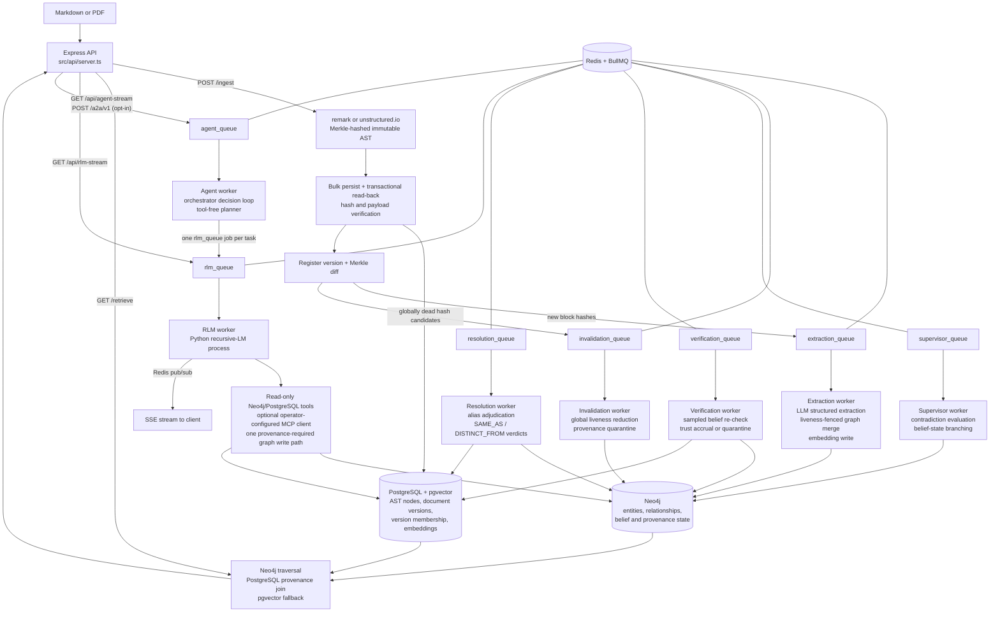

# Trellis Engine — Technical Roadmap

*Generated from a code-led review of the repository (July 4, 2026). File and line references point at the current state of `master`-derived code in this working tree. §1 (architecture overview) was refreshed July 7, 2026 (Session 13) to match the post-Session-12 code; the living session-to-session mental model remains `HANDOFF.md` §1.*

*Status: Foundations, update/invalidation correctness, belief verification, Session 3 deployment/CI readiness, Session 4 structured logging/metrics (T16), Session 5 entity resolution (3.3 #2), Session 6 benchmark maturity (3.3 #3), Session 7's semantic-provenance scale gate, Session 8 whole-codebase ingestion (3.3 #6, including the measured Entity.name merge index), Session 9's agentic orchestration loop (3.3 #7), Session 10's MCP tool surface for the RLM sub-agent (3.3 #8 first slice), Session 11's A2A server surface over the goal loop (3.3 #8 second slice), and Session 12's remote MCP transports with the containerized tool-server pattern (3.3 #8 third slice, closing the item's recorded scope) are complete and verified. Session 13 (July 7, 2026) was an owner-directed documentation, context-alignment, and architectural-consolidation session: the workspace/modules design record (`docs/architecture/WORKSPACE_AND_MODULES.md`) and canonical glossary (`docs/GLOSSARY.md`) landed, this file's §1 drift was corrected, and the frontend deployment was deferred (unscheduled; scope preserved in §3.3 #5). Session 14 is scoped to the design record's §11 steps 2 + 1 — kernel hardening and the Tier-3 workspace — see §4 and §5. The Session 7 measurements did not justify a storage migration; item 3.3 #4 remains open behind explicit observed thresholds, and Session 8's post-index re-measurement kept the gate closed. Every short- and medium-term roadmap item is closed. See §5 Progress Log for what was fixed, what was found along the way, and what remains open.*

---

## 1. Architecture Overview

Trellis is a Recursive Language Model runtime over a provenance-enforced knowledge substrate (reframed July 9, 2026 — the original "provenance-preserving GraphRAG" description now names the Tier-1/2 substrate, not the system; see the root README "What Trellis is"). Its central design commitment is unchanged: every semantic fact must remain traceable to an immutable, content-addressed physical location in the source document. The system is organized as an asynchronous pipeline over a three-tier storage layout.

### 1.1 Components and Data Flow

**Storage tiers:**

| Store | Role | Schema |
|---|---|---|
| PostgreSQL + pgvector | Physical layer: immutable AST nodes keyed by SHA-256 Merkle hash, plus embeddings | `ast_nodes(id, document_id, data JSONB, embedding vector(1536))` |
| Neo4j | Semantic layer: `Entity`, `Question`, `Concept` nodes; `ACTION`, `REFERENCES`, `CONTRADICTS`, `DERIVED_INSIGHT` edges, all carrying `sourceNodeIds` back-references | Uniqueness constraints on `Entity.id`, `Question.id`, `Concept.id` |
| Redis | BullMQ job queues (`extraction_queue`, `rlm_queue`, `supervisor_queue`, `invalidation_queue`, `verification_queue`, `resolution_queue`, `agent_queue`), pub/sub channels for SSE streaming, and TTL-bounded A2A task records (`a2a:task:<id>`) | — |

**The RLM harness** ([src/rlm/trellis_agent.py](src/rlm/trellis_agent.py)) wraps the `rlms` recursive-LM library with three injected tool surfaces: a read-only Neo4j client (transport-enforced `default_access_mode=READ`; the keyword blocklist is a fast-fail courtesy only) and a Postgres AST reader ([src/rlm/trellis_tools.py](src/rlm/trellis_tools.py)), plus — only when the operator configures servers in `TRELLIS_MCP_SERVERS` — an allowlisted, time- and size-bounded MCP client ([src/rlm/trellis_mcp.py](src/rlm/trellis_mcp.py), Sessions 10/12) whose results never satisfy the provenance requirement. The agent's only permitted graph write is `write_derived_insight`/`write_derived_insights`, which caches deduced facts as `DERIVED_INSIGHT` edges with mandatory provenance — the "flywheel" that makes repeat queries cheaper. Since Session 9 the RLM also serves as the reusable single-task sub-agent of the agentic goal loop (`src/core/agent/`, `agent_queue`), whose orchestrator is a tool-free planner that dispatches ordinary `rlm_queue` jobs; since Session 11 external agents can dispatch goals over A2A (`POST /a2a/v1`, opt-in).

**The OOLONG-Pairs benchmark** (`src/benchmarks/`, `scripts/`) is a self-contained evaluation harness: a seeded deterministic dataset generator, a verify-as-you-go ingestion loop, a cache-stripping prep script, and a 20-query runner that scores set-based F1 and measures the cold→warm cost collapse. The committed [benchmark_results.json](benchmark_results.json) shows F1 = 1.0 on all 20 queries with mean sub-calls dropping from 0.36 (cold) to 0 (warm).

**The frontend** (`src/frontend/`) is a Next.js app with a force-directed graph pane and a provenance pane; clicking a graph node highlights the exact AST text blocks that produced it, proxied to the backend via a rewrite rule ([next.config.ts](src/frontend/next.config.ts)).

### 1.2 Design Paradigms

- **Pipeline / queue-driven**: ingestion is a fan-out of independent, retryable jobs (Architecture Invariant 4 in [.agents/AGENT_CODING_GUIDELINES.md](.agents/AGENT_CODING_GUIDELINES.md)).
- **Content addressing**: node identity is `SHA-256(type:content:metadata:childHashes)`; block hashes are context-free, which the ingestion loop exploits for independent re-derivation checks.
- **Verification-as-a-loop**: the OOLONG ingester ([scripts/ingest_oolong_dataset.ts](scripts/ingest_oolong_dataset.ts)) writes a batch, reads it back, re-derives every hash through the parser, and refuses to advance past a failing batch.
- **Boundary validation**: dataset files pass through Zod schemas ([src/benchmarks/oolong/schema.ts](src/benchmarks/oolong/schema.ts)) before touching the pipeline.

---

## 2. Current State and Code Quality

### 2.1 Strengths

- **Provenance threading is consistent.** `sourceNodeIds` is carried through extraction ([extraction_worker.ts:59-76](src/workers/extraction_worker.ts:59)), ingestion verification ([ingest_oolong_dataset.ts:216-224](scripts/ingest_oolong_dataset.ts:216)), the RLM write path ([trellis_tools.py:60-62](src/rlm/trellis_tools.py:60), which rejects writes without provenance), and the retrieval join. This is the project's core differentiator and it is enforced, not just documented.
- **The ingestion verification loop is well-structured.** [ingest_oolong_dataset.ts](scripts/ingest_oolong_dataset.ts) separates write, hash-integrity read-back, semantic write, and constraint verification into named phases with a shared retry helper ([retry.ts](src/benchmarks/oolong/retry.ts)) and clear failure semantics.
- **The benchmark runner is defensively written.** [oolong_runner.ts:76-84](src/benchmarks/oolong_runner.ts:76) canonicalizes predicted tuples by category so tuple-ordering mistakes don't mask correct answers; protocol violations (zero tool calls) trigger bounded re-dispatch; per-query logs are persisted.
- **The RLM sandbox has layered guards**: a mutation-keyword blocklist, a single whitelisted write path, tool-call counting for provenance enforcement, and exceptions that propagate real tracebacks back into the REPL loop for self-correction.
- **Documentation is unusually thorough** for a project at this stage: architecture, math foundations, runbook, benchmark spec, and self-critique (`docs/benchmarks/CRITIQUE_AND_FUTURE.md`) all exist. Newer code (benchmarks, RLM harness) carries purposeful comments explaining invariants rather than restating syntax.

### 2.2 Technical Debt and Concerns

Ordered roughly by severity.

**T1 — No test suite.** *Resolved (July 4, 2026) — see §5.* `package.json:10` was the npm default stub (`echo "Error: no test specified" && exit 1`). There is no unit test framework anywhere in the repo. The scripts under `scripts/` (`test_e2e_rlm.ts`, `run_adversarial_tests.ts`, etc.) are manual end-to-end probes that require live Docker infrastructure and an OpenAI key — they are not automated, not assertion-based, and not CI-runnable. Several modules are pure functions that could be tested today with zero infrastructure: [parser.ts](src/core/ast/parser.ts), [corpus.ts](src/benchmarks/oolong/corpus.ts), and the parse/score functions in [oolong_runner.ts:76-94](src/benchmarks/oolong_runner.ts:76) and [rlm_client.ts:32-58](src/benchmarks/oolong/rlm_client.ts:32).

**T2 — Extraction granularity is wrong for markdown ingestion.** *Resolved (July 4, 2026) — see §5.* [server.ts:78](src/api/server.ts:78) selected "leaf nodes" as any node with string content. In a remark AST, leaves are inline tokens (`text`, `inlineCode`, …), not blocks — so `Globex **acquired** Initech` fans out as three separate extraction jobs (`"Globex "`, `"acquired"`, `" Initech"`), none of which contains the full relationship. Extraction should operate at block level (paragraph/heading) with concatenated child text, as [corpus.ts:27-30](src/benchmarks/oolong/corpus.ts:27) already does via `nodeText()`. This directly degrades graph quality for any formatted document.

**T3 — Runtime dependency misclassification.** *Resolved (July 4, 2026) — see §5.* `ioredis` was in `devDependencies` ([package.json:41](package.json:41)) but is imported at runtime by [server.ts:183](src/api/server.ts:183), [queue.ts:2](src/workers/queue.ts:2), and [rlm_worker.ts:5](src/workers/rlm_worker.ts:5). A production install with `--omit=dev` will not start. Conversely, `@types/*`, `typescript`, and `tsx` sit in `dependencies`.

**T4 — The repo violates its own configuration invariant.** *Resolved (July 4, 2026) — see §5.* [.agents/AGENT_CODING_GUIDELINES.md:13](.agents/AGENT_CODING_GUIDELINES.md) mandates a schema-validated config object exported from `src/config/index.ts`; that file did not exist. Instead, connection details and passwords are hardcoded: Postgres and Neo4j credentials in [db.ts:5-17](src/config/db.ts:5), Redis host/port in [queue.ts:4-8](src/workers/queue.ts:4) and duplicated in [server.ts:201-204](src/api/server.ts:201) and [rlm_worker.ts:7-10](src/workers/rlm_worker.ts:7). The Python tools ([trellis_tools.py:22-26](src/rlm/trellis_tools.py:22)) do read env vars, so the two halves of the system configure differently.

**T5 — Machine-specific path hardcoded in the RLM worker.** *Resolved (July 4, 2026) — see §5.* [rlm_worker.ts:25](src/workers/rlm_worker.ts:25) set `PYTHONPATH` to `C:\Users\Darian\AppData\Roaming\Python\Python313\site-packages`. The RLM pipeline cannot run on any other machine without editing source. The bare `python` executable name is also platform-dependent.

**T6 — No authentication, rate limiting, or concurrency control on the API.** *Resolved (July 4, 2026) — see §5.* All three endpoints are unauthenticated. `/api/rlm-stream` is the sharpest edge: each GET spawns a Python process that makes paid LLM calls and holds database connections ([server.ts:186-239](src/api/server.ts:186)). An unauthenticated caller can generate unbounded cost and process load. There is also no cap on concurrent RLM jobs beyond BullMQ's default worker concurrency.

**T7 — The Cypher read-only guard is a keyword blocklist, and APOC is enabled.** *Resolved (July 4, 2026) — see §5.* [trellis_tools.py:34-41](src/rlm/trellis_tools.py:34) blocks `CREATE/MERGE/SET/...` by word-boundary regex, but [docker-compose.yml:26](docker-compose.yml:26) installs the APOC plugin — `CALL apoc.create.node(...)` and similar procedures mutate the graph without using any blocked keyword. The blocklist also false-positives on legitimate queries that contain the words in string literals. The robust fix is transport-level: open sessions with `default_access_mode=READ` (and/or a read-only Neo4j user), keeping the blocklist only as a fast-fail courtesy check.

**T8 — LLM outputs are parsed without runtime validation, violating Guideline 2.** *Resolved (July 4, 2026) — see §5.* [extraction_worker.ts:30](src/workers/extraction_worker.ts:30) and [supervisor_worker.ts:76](src/workers/supervisor_worker.ts:76) call `JSON.parse(rawContent)` on the completion payload without `GraphSchema.parse()` / `safeParse()`. `zodResponseFormat` constrains the request, but nothing verifies the response, and the repo's own guidelines forbid exactly this pattern.

**T9 — Silent data loss in extraction ID resolution.** *Resolved (July 4, 2026) — see §5.* In [extraction_worker.ts:43-51](src/workers/extraction_worker.ts:43), if the LLM emits an action whose `subjectId`/`objectId` doesn't match any returned entity, the code falls back to the raw ID; the subsequent Cypher `MATCH` on the name then finds nothing and the action is dropped with no log line. Failed resolutions should at minimum be counted and logged.

**T10 — Supervisor worker defects.** *Resolved (July 4, 2026) — see §5; the detection-cost heuristic (fourth bullet) remains open by design.*
- The `Conflict` node created at [supervisor_worker.ts:89](src/workers/supervisor_worker.ts:89) is never connected to anything — it floats as an orphan carrying the reasoning text, unreachable from the entities it explains.
- [supervisor_worker.ts:50,54](src/workers/supervisor_worker.ts:50) join text fragments with the two-character literal `"\\n"` instead of a newline.
- The anomaly query ([supervisor_worker.ts:25](src/workers/supervisor_worker.ts:25)) uses `id()`, deprecated in Neo4j 5 (the resolution query already uses `elementId()`).
- Detection treats *any* same-verb fan-out as a candidate contradiction ("acquired X" and "acquired Y" is normal), relying on the LLM to filter — workable, but every false candidate costs a paid completion.
- The supervisor is also not wired into `start_all.ts` and only runs via the manual trigger script.

**T11 — Per-row inserts and per-job enqueues in the hot ingestion path.** *Resolved (July 4, 2026) — see §5.* [server.ts:62-68](src/api/server.ts:62) inserted AST nodes one query at a time inside a transaction, and [server.ts:79-84](src/api/server.ts:79) enqueued extraction jobs one `await` at a time. For large documents this was a straightforward N-round-trip bottleneck. The production path now uses one multi-row `INSERT ... UNNEST` and one `queue.addBulk()` call. The benchmark ingester retains its small, verification-oriented batches.

**T12 — Document membership is not modeled.** *Resolved prior to this review's publication (Phase 4 versioned-ingest work) — see §5.* `ast_nodes.document_id` is set once and `ON CONFLICT (id) DO NOTHING` ([server.ts:63-67](src/api/server.ts:63)) means a node shared by two documents (identical content) keeps whichever document ingested it first. Content addressing makes node reuse across documents *expected*, so membership needs a join table (`document_nodes(document_id, node_id)`) rather than a column.

**T13 — Hash preimage lacks canonical encoding.** *Open by design for now; current behavior is pinned by unit tests — see §5.* [parser.ts:20-31](src/core/ast/parser.ts:20) builds the hash input by joining `type`, `content`, `JSON.stringify(metadata)`, and concatenated child hashes with `:` delimiters. Because none of the segments are length-prefixed, distinct `(type, content, metadata)` combinations can in principle produce identical preimages. Practical risk is low (types come from a fixed vocabulary), but a Merkle-integrity system should use an unambiguous encoding (length-prefixed segments or canonical JSON of the full tuple). Also, `if (content)` treats empty-string content as absent — a falsy check where an `!== undefined` check is meant.

**T14 — No embedding/queue hygiene.** *Resolved (July 4, 2026) — see §5.*
- ~~No pgvector index; vector fallback is a sequential scan.~~ A partial cosine HNSW index is now created idempotently with the schema.
- ~~Queues lack retry and retention policy.~~ Background queues use bounded exponential retries, permanent OpenAI 4xx failures stop immediately, and completed/failed history is bounded by age and count. The interactive RLM queue retains the history bounds but deliberately has no automatic retries.
- ~~Uploaded PDF files land in `uploads/` via multer ([server.ts:12](src/api/server.ts:12)) with no size/type limit and are never deleted.~~ *Resolved with T6 (July 4, 2026): PDF-only, size-capped, deleted after parsing.*
- ~~No graceful shutdown.~~ SIGINT/SIGTERM now stop API admission, close workers, publishers and queues, then drain PostgreSQL/Neo4j clients in phase order.

**T15 — Duplicated helpers and drift between pipelines.** *Resolved (July 5, 2026) — see §5.* The traversal-helper duplication was resolved with T2. Vector similarity ordering now lives in the PostgreSQL `search_ast_nodes` function consumed by both [server.ts](src/api/server.ts) and [trellis_tools.py](src/rlm/trellis_tools.py). Production `/ingest` now performs its own transactional write → read-back → parser re-derivation check before version registration commits. The OOLONG ingester retains its benchmark-specific semantic constraint verification.

**T16 — Observability is `console.log`.** *Resolved (July 6, 2026) — see §5.* Operational code now logs one JSON object per line through a pino-backed observability module with a validated `LOG_LEVEL`, stable correlation fields (service/worker/queue/jobId/attempt/requestId/docKey/version/astNodeId), and preserved event names. Prometheus metrics are exposed per process: the API serves authenticated `GET /metrics`; the worker container serves an internal listener with queue-depth gauges, job outcomes, pipeline transition counters, LLM token spend, and RLM telemetry parsed from the `TRELLIS_TELEMETRY:` line.

**T17 — Minor documentation drift.** *Resolved (July 4, 2026) — see §5.* [README.md:6](README.md:6) now limits the bounding-box claim to PDF nodes whose parser output supplies coordinates; markdown nodes are explicitly documented as geometry-free. The extraction model had already been consolidated into validated configuration.

**T18 — No reproducible backend deployment or CI.** *Resolved (July 5, 2026) — see §5.* The repository now has a compiled production build, non-root Node/Python image, pinned Python manifests, schema-gated API/worker Compose topology with health checks and project-scoped resources, a tested `.env` load path, GitHub Actions, and a deterministic zero-LLM ingest/provenance/retrieve round trip.

---

## 3. Roadmap

### 3.1 Short-Term (immediate fixes, low-hanging fruit)

1. ~~**Fix dependency classification** (T3)~~ — **done** (July 4, 2026): `ioredis` moved to `dependencies`; `@types/*`, `typescript`, `tsx` moved to `devDependencies`.
2. ~~**Remove the hardcoded PYTHONPATH** (T5)~~ — **done** (July 4, 2026): interpreter comes from `PYTHON_EXECUTABLE` (platform-aware default), `PYTHONPATH` is an optional passthrough, and a missing `rlms` package produces an actionable error.
3. ~~**Create `src/config/index.ts`** (T4)~~ — **done** (July 4, 2026): Zod-validated config read once from env, consumed by `db.ts`, `queue.ts`, `server.ts`, and the workers; Neo4j/Postgres settings are forwarded to the spawned Python process. Also collapsed the model-string duplication (part of T17).
4. ~~**Validate LLM responses** (T8)~~ — **done** (July 4, 2026): every worker-consumed completion crosses `parseLlmResponse` in the new `src/core/llm/boundary.ts` (empty / JSON / schema failure stages); structural failures throw into the BullMQ retry flow, now enabled by bounded queue-level retry defaults.
5. ~~**Fix the supervisor bugs** (T10)~~ — **done** (July 4, 2026): the `Conflict` node is linked to the subject and both branch objects with provenance on every created node/edge, text fragments join with real newlines, detection orders by `elementId()`, and the supervisor worker starts with `start_all.ts`. Cypher and pure helpers live in `src/core/graph/conflict_resolution.ts`.
6. ~~**Log dropped actions in the extraction worker** (T9)~~ — **done** (July 4, 2026): unresolved endpoints are logged at resolution time (`src/core/graph/resolve_actions.ts`) and the merge Cypher returns the merged action ids so Cypher-level drops are detected and logged post-merge.
7. ~~**Stand up a unit test harness** (T1)~~ — **done** (July 4, 2026): vitest wired into `npm test`; 45 tests over parser hashing determinism (including the T13 empty-content and delimiter edge cases, pinned as current behavior), `buildCorpus` round trips, `parsePredictedPairs`/`scoreF1`/`estimateCost`, and the SSE extractors in `rlm_client.ts`. No infrastructure required.
8. ~~**Correct the README bounding-box claim** (T17)~~ — **done** (July 4, 2026): README now distinguishes PDF geometry from geometry-free markdown nodes.

### 3.2 Medium-Term (correctness, performance, robustness)

1. ~~**Fix extraction granularity** (T2)~~ — **done** (July 4, 2026): `/ingest` fans out block-level nodes (paragraph, heading, list item, code, PDF element) with reconstructed inline text via the new `src/core/ast/traverse.ts`, which also consolidates the duplicated `flattenAST`/`nodeText` (the traversal-helper half of T15). See §5.
2. ~~**Harden the RLM sandbox** (T7)~~ — **done** (July 4, 2026): `run_cypher` sessions open with `default_access_mode=READ` (server-enforced; blocklist retained as fast-fail courtesy), `write_derived_insight` uses an explicit WRITE session, APOC dropped from the compose file. Verified live by `npm run test:rlm-sandbox`.
3. ~~**Add API protection** (T6)~~ — **done** (July 4, 2026): API-key middleware (header / Bearer / query param), concurrency cap + queue-depth limit on `/api/rlm-stream` (429), body and upload size limits (413), PDF-only uploads with post-parse cleanup. Verified live by `npm run test:api-hardening`.
4. ~~**Queue hygiene** (T14)~~ — **done** (July 4, 2026): bounded retry/retention defaults, typed permanent-vs-transient OpenAI error classification, phase-ordered SIGINT/SIGTERM shutdown, and a cosine HNSW index.
5. ~~**Model document membership properly** (T12)~~ — **done prior to this roadmap review**: version membership is represented by `documents` and `document_nodes`; see §5 Phase 1 findings.
6. ~~**Batch the ingestion hot path** (T11)~~ — **done** (July 4, 2026): `/ingest` uses a single `UNNEST` insert for AST nodes and `addBulk` for extraction fan-out.
7. ~~**Promote the verified-ingestion loop from the benchmark script into the main pipeline** (T15)~~ — **done** (July 5, 2026): `/ingest` reads every bulk-written AST row back inside the same PostgreSQL transaction, re-derives its hash through `parser.ts`, compares the complete JSON payload, and rolls the version back on any mismatch.
8. ~~**Integration tests against Docker infrastructure**~~ — **done** (July 5, 2026): isolated Compose CI runs real schema initialization, a zero-extraction-block ingest, PostgreSQL document/root membership checks, a directly seeded provenance-bearing Neo4j relationship, and `/retrieve`, with no workers or OpenAI key.
9. ~~**Structured logging and basic metrics** (T16)~~ — **done** (July 6, 2026): pino JSON logging with request/job correlation fields, split API/worker Prometheus registries, counters for job outcomes, dropped/unresolved actions, invalidation and verification transitions, LLM/RLM token spend, and scrape-time queue-depth gauges. See §5.

### 3.3 Long-Term (strategic direction)

1. ~~**The document-update story.**~~ **Done (Phase 4, hardened July 5, 2026):** versioned ingestion computes a Merkle set diff, extracts only new block hashes, reduces document-local orphan candidates against global latest-version membership, and quarantines rather than deletes semantic facts whose provenance died. Cross-store extraction races are fenced and compensated. The Update Drill measured selective reprocessing, invalidation recall/precision, and recovery; see the Phase 4 PRD and §5.
2. ~~**Entity resolution beyond exact-name identity.**~~ **Done (Session 5, July 6, 2026):** entity identity stays `SHA-256(lowercased name)` and the extraction merge is untouched; equivalence is an overlay belief. Deterministic lexical candidate generation ([alias_candidates.ts](src/core/graph/alias_candidates.ts): token containment, acronym, near-identity edit distance; same-kind `generic`/`concept` pairs only — `question`/`category_label` are excluded so flywheel exact-id lookups are unaffected) plus batched LLM adjudication behind the Zod boundary ([alias_resolution.ts](src/core/graph/alias_resolution.ts), `resolution_queue`, `scripts/resolve_sweep.ts`) records `SAME_AS`/`DISTINCT_FROM` verdict edges with union provenance. The verdicts inherit the existing quarantine machinery, and `GET /retrieve` expands one non-contested `SAME_AS` hop at `RESOLUTION_MIN_CONFIDENCE` with per-fact alias attribution (`?resolveAliases=false` opts out). Embedding-similarity candidate generation remains a documented follow-up (entity names carry no embeddings today). See §5.
3. ~~**Benchmark maturity.**~~ **Done (Session 6, July 6, 2026):** dataset v2 (`oolong-pairs-trec-synthetic-v2`, [data/oolong_pairs_dataset_hard.json](data/oolong_pairs_dataset_hard.json), seeded pure generator [generate_v2.ts](src/benchmarks/oolong/generate_v2.ts)) breaks the substring-scan shortcut with paraphrased city mentions (canonical token never in the text — pinned by unit test), near-miss questions name-dropping unannotated cities, and non-question prose distractors ingested as `:Passage` nodes that can never pair. The harness CLIs take `--dataset` (default v1), the runner derives its sequence from the dataset and writes non-v1 results to a separate file, and cache-audit accuracy became a first-class metric shared by the audit CLI, the runner's results block, and the poison drill ([cache_audit.ts](src/benchmarks/oolong/cache_audit.ts)). v1, its committed results, and the drills are untouched. Real TREC import (needs paid annotation), adversarial soft-label corpora, embedding-based retrieval difficulty, and 10k+ scale sweeps remain future work; a paid v2 benchmark run awaits owner approval. See §5.
4. **Scalability of the semantic layer.** Entity `sourceNodeIds` arrays remain unbounded under the append-only `ON MATCH` pattern, but Session 7 measured the real headroom before changing storage. A deterministic 300-document × 20-block drill produced 6,096 semantic nodes and 6,000 relationships: the largest node array was 286, every relationship array remained at 1, and fixed-50-hash median sweep latency grew only 1.42x while semantic facts grew 5.77x. The migration gate therefore stayed closed. Keep arrays until an observed run reaches 1,000 live hashes on one fact or fixed-orphan-set median sweep latency grows more than 1.5 times semantic-fact growth; then migrate node scan anchors to `(:ASTRef {hash})` / `[:EVIDENCED_BY]`, retaining relationship arrays unless their own measurements change. See [the scale report](docs/benchmarks/SCALE_PROVENANCE_REPORT.md) and §5. HNSW and block-level embedding granularity already shipped under T14/T2.
5. ~~**Deployment and community readiness.**~~ **Backend deployment/CI done (July 5, 2026); license done (July 6, 2026):** the backend has a compiled non-root Node/Python image, health-gated project-scoped Compose topology, pinned runtime manifests, documented environment/startup contracts, isolated zero-LLM CI, and an MIT license selected by OpenCnid. The frontend remains intentionally excluded from backend containerization, and its Next.js convention note remains in [src/frontend/AGENTS.md](src/frontend/AGENTS.md). **Frontend deferral recorded (July 7, 2026):** the frontend residue (production build + non-root container, a server-side allowlisted proxy that injects the API key without ever handing it to the browser, CI coverage, and the Compose proof) was briefly renumbered to Session 14 during the Session 13 realignment, then deferred by owner direction the same day — **unscheduled, scope preserved exactly as stated here**; it re-enters §4 sequencing when the owner schedules it.

6. ~~**Whole-codebase ingestion.**~~ **Done (Session 8, July 6, 2026):** one repository snapshot is a bounded sequence of per-file verified ingests (`repo:<key>:<path>` doc keys) through the extracted `src/core/ingestion/` service, with code-aware TypeScript/JavaScript/Python parsing, durable PostgreSQL snapshot membership, tombstone-based deletion/rename semantics that quarantine through the existing invalidation sweep, and a zero-paid-work default (`--extract none`; `changed` requires an explicit budget plus confirmation). The measured `Entity.name` merge index shipped alongside (recorded separately from the still-open 3.3 #4 gate). See §5 and `docs/benchmarks/REPOSITORY_INGESTION_REPORT.md`. The original decision record follows. Decision recorded July 4, 2026: this is a pipeline feature, **not** a relaxation of the T6 per-request limits. The natural unit is one document per source file (`doc_key` = repo-relative path), so per-file Merkle diffs drive incremental re-extraction commit-to-commit — exactly what the physical layer was built for — fed by a batch client/CLI rather than one giant request. A single-blob upload of a repo would defeat per-file identity, diff granularity, and the streaming-free `express.text`/single-transaction ingest (the whole body is buffered in memory and inserted row-by-row). Individual source files fit comfortably inside the 5 MB default (generated artifacts that don't should be excluded, or the env knob raised). Prerequisites before this feature: T11 batching (multi-row inserts + `addBulk` for thousands-of-files fan-out), the rest of T14 (queue hygiene at that job volume), a code-aware parser path (tree-sitter or similar — extraction blocks should be functions/classes, not markdown paragraphs), and extraction cost controls (tiered/selective extraction; one LLM call per block across a 50k-file repo is cost-prohibitive). If a convenience archive-upload endpoint is added, the upload allowlist expands to zip/tar with decompressed-size and entry-count guards (zip bombs) — independent of the per-request caps, which stay small on purpose (each request's body is held fully in memory).

7. ~~**Agentic orchestration loop (owner-directed, July 6, 2026).**~~ **Done (Session 9, July 7, 2026):** `GET /api/agent-stream` accepts one goal; the `agent_queue` worker runs an orchestrator (same LLM, planner system prompt, plain structured chat completions through the T8 boundary — never an rlms REPL) whose Zod-validated decisions dispatch single-task RLM runs as ordinary `rlm_queue` jobs, observe their new `TRELLIS_RESULT` envelopes, and iterate until finish/fail or a hard bound trips (`AGENT_MAX_ITERATIONS_PER_GOAL`/`AGENT_MAX_TASKS_PER_GOAL`/`AGENT_MAX_CONCURRENT_TASKS`/`AGENT_TASK_MAX_ITERATIONS`, all single-digit-capped). Task failures and protocol violations are observations for the next decision; every other exit is a typed streamed failure. The orchestrator never writes to the graph; acceptance was zero-LLM (oracle decisions + stubbed tasks over the real queues, pub/sub, and API — `npm run test:agent-loop`). See §5. The original direction follows. Trellis must be able to work agentically: an external loop that accepts a goal, decomposes it into tasks, and mediates execution until the goal completes or a bound is hit. The loop is driven by the same LLM under a different (orchestrator) system prompt — plain structured chat completions crossing the T8 `parseLlmResponse` boundary, never a second REPL (the rlms `custom_system_prompt` replaces the REPL protocol prompt, so the orchestrator persona must not be routed through rlms). The RLM becomes a reusable single-task sub-agent: one `rlm_queue` job per task, one process per run exactly as today, so a goal can dispatch many RLM runs and aggregate their `FINAL_ANSWER:` results and `TRELLIS_TELEMETRY:` spend. Hard per-goal bounds on orchestrator iterations, dispatched tasks, and tokens; all LLM calls stay inside workers; the orchestrator itself never writes to the graph — `write_derived_insight` remains the single agent write path. Zero-LLM acceptance via a deterministic oracle planner plus stubbed task execution over the real queue/stream plumbing. Scheduled as Session 9; see §4 and `HANDOFF.md`.

8. **External tool integration for the RLM sub-agent (owner-directed, July 7, 2026).** **First slice — the MCP client surface — done (Session 10, July 7, 2026):** the RLM gains an operator-configured stdio MCP client (`TRELLIS_MCP_SERVERS` → `src/rlm/trellis_mcp.py`, injected as `trellis_mcp` via `custom_tools`), with allowlist-before-I/O enforcement, per-call timeouts, size-capped results, a separate `mcp_calls` telemetry counter that never satisfies the database-provenance requirement, and zero-paid acceptance against a local deterministic fixture server (`npm run test:rlm-mcp`). See §5. **Second slice — the A2A server surface — done (Session 11, July 7, 2026):** Trellis serves the Agent2Agent protocol (spec v1.0.0, JSON-RPC binding) over the existing goal loop — `TRELLIS_A2A_ENABLED` (default off, byte-identical API when unset) mounts the well-known Agent Card and one JSON-RPC endpoint whose `SendMessage`/`SendStreamingMessage`/`GetTask`/`CancelTask` dispatch goals through the same admission gates and per-goal bounds as `/api/agent-stream`, with TTL-bounded Redis task records and zero-paid acceptance (`npm run test:a2a`). See §5. **Third slice — remote MCP transports and the containerized tool-server pattern — done (Session 12, July 7, 2026):** the registry became a union discriminated on `transport` (`stdio` stays the default; pre-Session-12 values parse unchanged) with an `http` variant carrying a Streamable HTTP URL (spec 2025-06-18; https required for public hosts, plain http only for loopback/RFC1918/dot-free private hosts) and an operator-owned auth story — `auth.valueEnv` NAMES a credential env var, the worker resolves it fail-fast at startup and forwards exactly the named variables, and every raised tool error is scrubbed of credential values before it reaches the model-visible REPL. Same allowlist/timeout/size-cap machinery over both transports; a containerized tool server (own Compose service, project network, no host port, bearer auth) is the demonstrated deployment shape; zero-paid acceptance grew to 86 fixture checks plus the containerized-fixture Compose assertion. **The recorded 3.3 #8 scope is now exhausted** — the shipped surface covers MCP client (stdio + Streamable HTTP + auth + containerized servers) and the A2A server; anything further (new tools, OAuth flows for MCP, Trellis as an A2A client or MCP server) is a new owner direction, not a recorded remainder. See §5. The original direction follows. With the agentic loop in place (3.3 #7), the sub-agent's world is still exactly two injected database tools — it can decompose goals but every task bottoms out in graph/AST lookups. The owner directed that Trellis now gain external tools, **MCP (Model Context Protocol) first**, with web search as the first concrete tool and A2A (agent-to-agent) interoperability as a follow-on direction across future sessions. The extension point already exists: `trellis_agent.py` injects tools via rlms `custom_tools`, and `trellis_tools.py` shows the wrapper discipline (JSON-string returns, tool-call counting, exceptions that surface real tracebacks into the REPL). Hard invariants: MCP servers and their tool allowlists come from operator-validated configuration only — never from job payloads and never chosen freely by the model; MCP calls do NOT satisfy the database-provenance requirement (`TRELLIS_PROTOCOL_VIOLATION` stays keyed to database tool calls) and MCP output can never be passed as `sourceNodeIds` — external content earns citability only by round-tripping through the verified ingest path to become content-addressed AST bytes; responses are size-capped and time-bounded; acceptance is zero-paid against a local deterministic fixture MCP server. Scheduled as Session 10; see §4 and `HANDOFF.md`.

---

## 4. Suggested Sequencing

| Order | Item | Rationale |
|---|---|---|
| ~~1~~ | ~~Structured logging and basic metrics (3.2 #9 / T16)~~ | **Done (July 6, 2026)** — split-process logs/metrics shipped; see §5 |
| ~~2~~ | ~~Entity resolution beyond exact-name identity (3.3 #2)~~ | **Done (Session 5, July 6, 2026)** — SAME_AS overlay beliefs with quarantine inheritance; see §5 |
| ~~3~~ | ~~Benchmark maturity (3.3 #3)~~ | **Done (Session 6, July 6, 2026)** — anti-shortcut dataset v2 + first-class cache-audit metric; see §5 |
| ~~4~~ | ~~Semantic provenance scale gate (3.3 #4 measurement)~~ | **Measured (Session 7, July 6, 2026)** — migration not justified at 300 documents; explicit 1,000-source/superlinear triggers recorded; see §5 |
| ~~5~~ | ~~Whole-codebase ingestion (3.3 #6)~~ | **Done (Session 8, July 6, 2026)** — code-aware per-file snapshots with tombstone deletion, zero-paid-work default, and the measured Entity.name merge index; see §5 |
| ~~6~~ | ~~Agentic orchestration loop (3.3 #7)~~ | **Done (Session 9, July 7, 2026)** — goal loop over the RLM as a reusable single-task sub-agent, zero-LLM acceptance; see §5 |
| ~~7~~ | ~~MCP tool integration for the RLM (3.3 #8, first slice)~~ | **Done (Session 10, July 7, 2026)** — operator-configured stdio MCP client for the sub-agent with fixture-server zero-paid acceptance; see §5 |
| ~~8~~ | ~~A2A server surface (3.3 #8, second slice)~~ | **Done (Session 11, July 7, 2026)** — Trellis serves A2A v1.0 over the goal loop behind the existing gates and bounds, zero-paid acceptance; see §5 |
| ~~9~~ | ~~MCP tool-surface expansion (3.3 #8 continuation)~~ | **Done (Session 12, July 7, 2026)** — remote Streamable HTTP transports with env-referenced credentials, redaction, and the containerized tool-server pattern; the recorded 3.3 #8 scope is exhausted; see §5 |
| ~~10~~ | ~~Kernel hardening and the Tier-3 workspace (design record §11, steps 2 + 1)~~ | **Done (Session 14, July 7, 2026)** — `sourceNodeIds` format + `ast_nodes` existence enforcement at the single write path, then the harness-captured in-REPL workspace (origin-stamped uuid segments, stub returns, plan-in-workspace, byte-identical gating); see §5 |
| ~~11~~ | ~~Module registry + module #0 (design record §11 step 3)~~ | **Done (Session 15, July 7, 2026)** — owner directed the step 3 → step 4 order on July 7, 2026 (PR #40 discussion); protocol-module registry, operator-owned `TRELLIS_MODULES` selection, spatial-flywheel extraction behind a byte-identical composed-prompt pin; the §9.4 graph representation is explicitly deferred to the first research-bearing module; the owner-approved paired-run workspace probe was also measured this session; see §5 |
| ~~12~~ | ~~Workspace lineage (design record §11 step 4)~~ | **Done (Session 16, July 7, 2026)** — serialize/park/seed across a goal's tasks: end-of-run snapshots parked goal-scoped in Redis (TTL + per-goal byte cap), the orchestrator routes by reference (`workspaceRef` observations, `seedFromTasks` dispatches, prior iterations only), seeded runs restored at spawn with stamps preserved and bounds re-enforced; oracle drills extended to seeded runs; see §5 |
| ~~13~~ | ~~Promotion path (design record §11 step 5)~~ | **Done (Session 17, July 7, 2026)** — operator-gated segment→ingest through the unmodified verified transaction: `npm run promote` (list/promote, zero-paid default), typed planner refusals (truncated/empty/unknown/bad-key), the origin audit stamp on the documents row, and the earned-citability loop drilled end to end (`test:promotion` 41); see §5 |
| ~~14~~ | ~~First flywheel turn (design record §11 step 6)~~ | **Machinery done (Session 18, July 8, 2026)** — research existence gate at registration, the §9.4 manifest-as-graph-entity representation (`modules:register`/`modules:verify`, unchanged sweep contests research-superseded modules), and the human recovery loop, drilled end to end (`test:module-lifecycle`); the module #1 PAID authoring turn RAN, owner-approved, July 9, 2026 (module `workspace-discipline`; see §5) and surfaced the laundering finding that produced row 1 below |
| ~~1~~ | ~~Grounded authoring (`docs/architecture/GROUNDED_AUTHORING.md` Phases 1–2)~~ | **Done (Session 19, July 9, 2026)** — kernel `trellis_agent.py --mode author` scoped to a seeded read-only corpus (no DB/search/write), harness-pinned `research.sourceNodeIds`, byte-pinned authoring template, deterministic anchor derivation gate, and the `npm run modules:author` operator driver (plan-echo / `--draft` replay / `--confirm-paid` spawn); `TRELLIS_DRAFT` scanner refuses any 64-hex token; drilled end to end zero-LLM; see §5 |
| ~~1~~ | ~~Code-mediated text follow-ups (pillar §6.1 + §6.2): the editing toolkit and the kernel prompt revision~~ | **Done (Session 20, July 9, 2026)** — the operator-gated `trellis_textedit` holder (engine-computed `locate`, staged `splice`, digest-guarded atomic `write_back`, strict root containment, Zod/Python twin bounds, byte-identical prompt and namespace when `TRELLIS_EDIT_ROOT` is unset; `npm run test:textedit`, 81 checks) and the §6.2 CODE-MEDIATED TEXT kernel prompt block shipped in its own commit with the composed-prompt sha256 pin recomputed there; see §5 |
| ~~1~~ | ~~Pillar measurement + module #1 v2 (pillar §6.3 + §6.4, owner-APPROVED July 9, 2026) + the Frankenstein corpus~~ | **Done (Session 21, July 10, 2026 — the redo; the first attempt, PR #56, was owner-discarded and reverted by PR #58 the same day)** — Frankenstein ingested zero-paid as durable Tier-1 substrate; the effective-context probe MEASURED (§6.3: 12 runs, $0.73 — with the §6.2 block no run put the corpus through attention, without it one run pushed all ~105k tokens through a single `llm_query`; the one wrong answer was an engine-computed 55 retyped as 47 — the transcription channel live in the answer path); module #1 v2 landed through grounded authoring (§6.4: anchor gate refused the three-doc corpus at 0.28, owner re-scoped to the two normative docs per the gate's documented remedy, the same paid draft landed at 0.50 by zero-paid replay; mitigation line retired, v1 history preserved); see §5 |
| ~~3~~ | ~~Anchor-gate calibration (grounded-authoring follow-up, measured Session 21)~~ | **Core fix done (Session 21, later the same day)** — `evaluateAnchorGate` no longer scores template-forbidden numeric anchor kinds (`comparison`/`ratio`) in its denominator; the previously refused module #1 v2 draft now clears at 18/60 = 0.30. Optional residual (compound segments get exact-match, plain terms get stem credit — a minor asymmetry) left to a future gate touch, not blocking; see §5 |
| ~~2~~ | ~~Effective-context probe, round 2 + the answer-channel fix (owner-directed next, July 10, 2026)~~ | **Done (Session 22, July 11, 2026)** — the by-reference answer channel (`trellis_answer.submit`: caller-frame evaluation, structural literal refusal, engine-side rendering; `npm run test:answer-channel`, 32 checks; both composed-prompt pins recomputed wittingly) shipped FIRST, then all four measurement arms ran paid ($2.15, 57 runs): the unmemorized synthetic chronicle isolated read-fidelity (8/8 anomaly quotes byte-faithful), the 40-ledger corpus measured the pandas null result (0/12 aggregation runs reached for a DataFrame — plain loops stayed cheap and correct), the edit round-trip was 8/8 byte-exact through `trellis_textedit`, repeats reported medians with spread, and the round-1 55→47 question came back 55 in both arms; zero transcription errors in 56 runs (round 1: 1 in 12); every remaining miss is localization-method error over the glued reconstruction (a recorded observation, not a regression); see §5 |
| ~~3~~ | ~~Effective-context probe, round 3 (owner-directed next, July 11, 2026)~~ | **Done (Session 23, July 11, 2026)** — the relational corpus (102 generated documents: 100 season-two ledgers ≈6,859 records + a captain→guild registry + a port/material tariff schedule; every question a genuine 2- or 3-table join) measured the pandas null result PERSISTING at 3.1× round-2 scale (0/87 round-3 runs imported pandas or polars; plain dict loops answered every join digit-exact); the localization arm (30 locate runs) reproduced the round-2 failure class at rate (7/30 misses, ALL method error over the glued reconstruction, none transcription) and quantified TWO representation traps zero-paid (line anchors: chronicle 0/48 headings visible glued vs 48/48 boundary-preserved; trailing word boundaries: `\d+\b` fails at glued digit→letter junctions, producing the exact "Chapter 23" wrong answer of both rounds); higher n moved the load-bearing claims (87/87 submits, zero transcription errors at n=5/arm on counts and quotes); the disclosure clause was restored to the chronicle/ledger preambles; RECOMMENDATION recorded (then re-pointed the same day — the owner chose the additive `get_ast_blocks` accessor over the reconstruction-byte change; now §4 row 4). See §5 |
| ~~4~~ | ~~Boundary-aware block accessor (`get_ast_blocks`) + structure-selection demotion~~ | **Done (Session 24, July 11, 2026)** — `trellis_postgres.get_ast_blocks(root_hash)` returns a document's extraction blocks in order (`[{id, type, text}]`, exactly the `collectExtractionBlocks` set) via the dependency-free walk in `src/rlm/trellis_blocks.py`, parity-pinned block-for-block against the TS authority (`block_parity.test.ts`) and round-tripped live (frank 796 / chronicle 827 blocks byte-identical); NO stored or reconstructed byte moved; both composed-prompt pins moved wittingly to teach the tool (default `3f07295a…4b63`, omit-arm `85362b81…71bb`); pillar §7's "pandas default" DEMOTED to "plain loops until a measured threshold" per its own written contingency; the probe gained the `structured` method verdict, the paren-free locate-preamble offer, and the report's round-4 section. The localization re-measure ran OWNER-APPROVED the same day ($0.9452, 36 runs): 0/36 misses vs round 3's 7/30 on the same locate set, 36/36 runs adopting the accessor in BOTH arms (the off arm too — tooling shape, not the prompt block, carries the behavior); the round-3 "Chapter 23" trap question came back correct 6/6; the superseded reconstruction-byte row stays closed; see §5 |
| ~~5~~ | ~~Repository-scale extraction prerequisites~~ | **Done (Session 25, July 11, 2026)** — the three recorded pilot findings turned into machinery, all zero-paid: the kernel-fixed test/fixture extraction exclusion (`isTestOrFixturePath`; classified files still ingest but their extraction policy is forced to `none`, reported as typed `test_fixture_excluded` file/block counts in the plan echo), additive `sourceKind` payload routing selecting a code-tuned extraction prompt (legacy prose bytes unit-pinned; unknown values refused at the boundary), and deterministic generic-identifier suppression before resolution (kernel denylist + length-<3 shape rule + touched-relationship drops, counted and logged, never silent). The paid pilot RE-RUN stays owner-gated: proposed at the CLI's printed post-exclusion bound of 103 blocks ≈ $0.29; see §5 |
| ~~6a~~ | ~~Data-plane representation verdict follow-ups (owner-directed July 11, 2026 — inserted AHEAD of the positive control, which is unchanged)~~ | **Done (Session 27, July 11, 2026)** — all three adopted recommendations landed zero-paid: `polars==1.34.0` pinned in requirements.txt + the `python:check` import list + an in-container import probe in the Compose integration (11 assertions now — the found prose-vs-manifest inconsistency is closed; pinning is NOT adoption, no src/ path imports polars); the pillar §7 verdict + cap-raise doctrine paragraph (docs-only, both composed-prompt pins unmoved); the M1 park/seed round-trip at cap sizes (byte-lossless at exactly 4 MiB/32 MiB/1024 segments, refusal at cap+1, timings printed never asserted) and M7 per-field torn-payload refusal + canonical-form determinism fixtures as standing sections [7]/[8] of `test:rlm-workspace` (86 → 106 checks); see §5 |
| ~~6~~ | ~~Estimation-discipline positive control (module #2 follow-through)~~ | **Done (Session 28, July 11, 2026) — measured, then RETIRED by owner decision the same day.** The module-arm flag `TRELLIS_EXP_MODULES` and the `est` suite landed zero-paid; the 50-run paired control ran under the session's standing approval ($2.3981 actual vs the ~$1–2 estimate, disclosed). Result MIXED against the pre-stated criterion: correctness 25/25 in BOTH arms; median db calls on 1 vs off 2 (the targeted behavior moved); pooled median input tokens on 13,240 vs off 9,217 (FAILS pooled; reverses on the two largest-corpus questions). **Owner retired module #2 on the numbers** (manifest `status: retired`, loader refuses composition — pinned in `test:modules` [8]; the graph entity stays as the historical record) **and recorded the broader direction: behavioral failure classes close by TOOLING SHAPE, not prompt modules** — the recorded successors are kernel-level retrieval dedup/budgets (the `est` suite is their acceptance harness) and mechanical provenance threading (see the §5 addendum) |
| 7 | Conditional provenance storage migration (3.3 #4) | Blocked behind the recorded trigger (an observed 1,000-source fact or superlinear sweep growth); do not migrate arrays on extrapolation alone. NOTE: the Session 22 `drill:scale` OPEN reading (11.61x) did NOT reproduce on re-run (1.48x CLOSED) — a REPRODUCING open reading is the trigger, a noisy one is not |
| ~~8~~ | ~~Self-editing toolkit coverage hardening (Trellis-edits-Trellis coverage audit, July 11, 2026)~~ | **Done (Session 29, July 12, 2026)** — the recorded priority items closed zero-paid in three commits: the 82-check drill wired into CI's `offline` job (audit #7); `write_back` hardened inside the existing contract (audit #2/#3/#4 — write-time containment re-verification via the load-time `_resolve` re-run, an in-root resolution-change refusal that catches what the digest guard cannot, source-mode preservation onto the replacement inode, and a final digest re-check immediately before `os.replace` that NARROWS the TOCTOU window — residual honestly documented, not claimed closed); multi-file partial-failure semantics pinned in both orders (audit #5), per-guard-branch adversarial checks (audit #6), and the static no-subprocess/no-git import-allowlist pin (audit #8). Drill 82 → 105 checks on Windows, 106 on POSIX. Remaining audit items stay open by design: #1 (cross-process proof run) is owner-gated propose-with-estimate; #9 content-borne injection and the abnormal-kill half of #10 are unpinned hygiene (the refusal-path temp-file cleanup IS now pinned); see §5 |
| ~~9~~ | ~~Mechanical provenance threading (owner-approved July 12, 2026 — the tooling-shape sequence, step 2 of 4)~~ | The LAST transcription channel: `write_derived_insight` still takes model-asserted `sourceNodeIds`. **Decompose before building (owner direction: decompose so each slice is completable, then engineer to working solutions).** Recorded slices: ~~(a) design record first~~ and ~~(b) retrieval-set tracking in the tool layer~~ — **done (Session 30, July 12, 2026)**: `docs/architecture/PROVENANCE_THREADING.md` ratified (the T1 transcription / T2 semantic channel split, the claim→block factorization as mechanical membership + sampled semantic residual, the retrieval-set definition and per-run semantics, the slice map with per-slice pins), and the always-on retrieved-address set landed at the citation-audit seam (`get_ast_texts` returned keys / `get_ast_blocks` block ids / `vector_search` result ids; `ast_hashes_exist`, `fetch_texts`, `run_cypher`, Tier-3 surfaces, and seeds never contribute), counts-only `retrieved_addresses` telemetry, pinned by `test:rlm-sandbox` [5] (21 → 40); see §5. ~~(c) address-in-header threading~~ and ~~(d) the write-path constraint~~ — **done (Session 31, July 12, 2026)**: (c) ADJUDICATED SATISFIED BY EXISTING SHAPE (every surface re-presenting Tier-1 bytes already threads address-with-content; the workspace holds no Tier-1 retrievals by construction; the rlms scaffold renders nothing itself; verdict + evidence in the record's §9 ledger — no carriage gap, no implementation, no prompt byte); (d) the retrieval-membership gate landed (`retrieved_addresses_check` constructor seam in the `ast_existence_check` injection mold, checked in `_run_insight_writes` after existence and the cited-attempt audit, before the experimental gates — typed bounded refusal teaching re-retrieval; wired for research runs in `trellis_agent.py`; bare construction byte-identical; closes T1, not T2), pinned by `test:rlm-sandbox` [6] (40 → 53); see §5. ~~(e) the sampled-entailment tier~~ and ~~(f) compat verify-and-strike~~ — **done (Session 32, July 12, 2026)**: (e) the detector machinery landed zero-paid (`src/core/graph/entailment_detection.ts` + `npm run entailment:sweep` + the 'entailment_sweep' job name on the shared verification worker — sampled (edge, cited-hash) pairs judged at most once ever; supported pairs stamp `entailmentCheckedHashes`, unsupported pairs contest the edge with the typed reason 'unsupported_citation' and the durable `unsupportedHashes` audit; provenance fields never mutated; judge-all-then-write atomicity — an infrastructure failure contests NOTHING; config twins ENTAILMENT_SAMPLE_RATE 0.1 / ENTAILMENT_JUDGE_BUDGET_PER_SWEEP 25 max 500), pinned by 10 unit tests + `test:verification-sweep` sections [7]–[9] (35 → 66 checks; the drill itself was repaired first — see §5); the FIRST REAL judged sweep stands PROPOSED owner-gated (dev-graph dry-run: 283 edges / 566 unchecked pairs; default policy = 25 judge calls ≈ $0.02–$0.05 — run only on approval, actuals to be recorded); (f) every §5.3/§5.5 compat claim VERIFIED against the code, no gap (see §5). Kernel prompt: no byte moved across the whole row — slices a–f, both pins unmoved |
| ~~10~~ | ~~Kernel-level retrieval discipline: dedup + budgets (owner-approved July 12, 2026 — step 3 of 4)~~ | **Machinery done (Session 33, July 13, 2026), all zero-paid; the (d) acceptance measurement stands PROPOSED owner-gated.** `docs/architecture/RETRIEVAL_DISCIPLINE.md` ratified document-first, then (a)+(b)+(c) landed in `trellis_tools.py`: module-level held state under its own lock (addresses/roots/exact query strings — identities only, never content), typed bounded `Retrieval Discipline:` refusals for repeat fetches (full-repeat-only for `get_ast_texts` with partial-overlap serve-everything; per-root for `get_ast_blocks`; exact-query-match for `vector_search` — semantic dedup excluded by decision), and the per-run budget (kernel default 64 byte-returning fetches, cap 1024, `TRELLIS_RETRIEVAL_BUDGET_PER_RUN` env twin, refusal at budget+1 with counts + a bounded held-root echo; dedup refusals consume nothing). Activation is explicit construction in the injection mold — research runs wire it on in `trellis_agent.py`, bare construction is byte-identical, `TRELLIS_EXP_OMIT_RETRIEVAL` is the probe-only OFF arm (`buildAgentEnv` strips it, unit-pinned). Held state never feeds the Session 30 retrieval set or the Session 31 write gate. No prompt byte moved. Pinned by `test:rlm-sandbox` [7] (53 → 95, first-run green) + 3 `buildAgentEnv` unit pins (740 → 743). The (d) paired `est` re-run (criterion pre-stated in the §5 entry: repeat-serves 0 by construction, tokens ≤ baseline, correctness non-inferior, calls and correctness together; est. ~$2.40) runs only on owner approval; see §5. **Session 42 (July 13, 2026) attempted the measurement with owner approval in a remote container — BLOCKED ENVIRONMENTALLY (no OpenAI key; `api.openai.com` egress policy-denied), $0 spent; staging verified end-to-end on a fresh stack (the measurement is NOT dev-DB-bound: `--ingest` stages the est corpora anywhere) and the proposal STANDS; see §5** |
| 11 | Trellis-on-Trellis: ~~full-repo extraction~~ + graph-informed self-edits (owner-approved July 12, 2026 — step 4 of 4, the scaling flywheel) | **Stage 1 DONE (Session 34, July 13, 2026)** — the scoped-snapshot machinery (`--include` prefix scope with carry-forward, zero-paid; `test:repo-ingest` 56 → 82, unit pins 17 → 24) landed because the full-repo bound priced over the ≤$5/run cap (4,575 blocks ≈ $12.35); the owner-approved run then extracted the code substrate under one durable repo key: `repo:trellis`, scope `src`+`scripts`+`modules`, 1,423/1,423 jobs, zero failures, ≈$2.75 actual vs the $2.4–$3.84 estimate band, all five pre-stated criteria PASS (max hub 2.04% vs the ≤8% bar; zero denylist names; named kernel surfaces thread back to real bytes) — see §5 and `REPOSITORY_INGESTION_REPORT.md` §5d. The residue is DURABLE self-substrate (never drill-cleaned); `docs/` + root prose deferred to their own chunked proposal; `data/` excluded by decision. Stage 2 (IN PROGRESS): self-edit depth increments that QUERY the graph about the code they edit (the Session 26/expansion harness, escalating from string constants toward reviewed kernel diffs; each increment a single named failure mode, human `git diff` review before acceptance, toolkit never touches git; seam observations recorded in §5d.5 — the graph-to-textedit bridge needs no new machinery). **Increment 1 harness DONE (Session 35, July 13, 2026), the edit run PROPOSED owner-gated** — the named failure mode "graph-misdirected editing" gets mechanical detection (`src/benchmarks/selfedit/check.ts` + `npm run stage2:check` + the 39-check `test:selfedit-harness` drill: the hash→current-version doc-key bridge, planted out-of-scope/contested/dead/unbridged violations all FLAGGED, the scripted rehearsal driving the run's real tool sequence zero-LLM with the live Session 31 gate refusal observed); the increment design record is `REPOSITORY_INGESTION_REPORT.md` §5e (target: the stale Session 30 slice-(d) comment + docstring in `trellis_tools.py`, falsified by Session 31 — comment/docstring-only correction; task text verbatim; estimate $0.15–$0.45/run, ≤$0.90 total); see §5. **Increment 1 EXECUTED and LANDED (Session 36, July 13, 2026)** — run 1 failed human `git diff` review (mis-ranged hunk-B splice; verify-and-submit collapsed into one REPL cell; diagnosed, reverted, recorded), the contingency run 2 landed all five criterion items ($0.565 both runs vs ≤$0.90; checker zero findings; the recorded insight is a Session 31 gated write citing the fetched consumer blocks); the freshness policy's first refresh then ran (snapshot `trellis#2`, 24/24 jobs, $0.102): old-block death → ACTION-edge contest with audit preserved → operator re-derivation citing the new v2 block, while run 2's insight edge survived on its unedited consumer-block provenance — the churn loop observed live end to end; see §5 and `REPOSITORY_INGESTION_REPORT.md` §5e.5. The row stays open pending the owner's increment-ladder judgment. **Increment 2 EXECUTED and FAILED (Session 37, July 13, 2026)** — the parse gate (`named_file_unparseable`: `.py` via the configured interpreter's `compile()`, `.ts`/`.js` via TypeScript single-file parse diagnostics; post-run check, never a write gate) landed zero-paid FIRST with 11 unit pins + drill section [6] planting the exact run-1 shape; the owner-approved deeper run (the `trellis_agent.py` research-mode stale telemetry comment, selected by substrate query; new named failure mode: near-duplicate mis-targeting) then failed twice under the pre-stated criterion — run 1 on the FIRST live `unbridged_evidence` firing (cited wrong-document blocks; diagnosed deterministic, residual edge deleted as recorded operator cleanup), run 2 at human review (retype-splice neighbor deletion: a 6-line hand-retyped window dropped the executable telemetry line and a comment head while still PARSING — invisible to every mechanical layer by construction). $0.6356 total vs ≤$0.90; both failed diffs reverted and preserved; run 2's insight edge stands (true, live-bridged, gate-verified). Recorded next step: the increment-2 RETRY — the comment-class diff gate (every changed named-file line comment/blank, decidable from the diff alone) zero-paid first, then the re-proposed run; see §5 and `REPOSITORY_INGESTION_REPORT.md` §5f/§5f.5. **Owner re-sequenced July 13, 2026: the retry runs as Session 39, AFTER the row-12 structural-chunking session — deferred, not dropped.** **Increment 2 RETRY LANDED (Session 39, July 13, 2026)** — the comment-class diff gate (`named_file_noncomment_change`: every changed content line in a DECLARED comment-class named file must be blank or a line comment, both diff sides; read-only `git diff` gatherer; 13 unit pins on the preserved run-2 diff + drill section [7]) landed zero-paid FIRST; the approved run (task text v3 = v2 re-based onto the policy-2 substrate + splice-minimal-span + neighbor-preservation verification) then landed ALL FIVE criterion items in one run ($0.347 vs the $0.15–$0.45 estimate; zero findings across scope/evidence/parse/comment-class; the recorded insight cited exactly the live wiring block; human review accepted a one-hunk minimal-span comment-only diff with both neighbors preserved). The run-2 escape class is closed mechanically — the same diff shape now fires the gate (drilled). Split-scope refresh: `trellis#7` (policy 1) + `trellis#8` (policy 2, `trellis_agent.py` v3 — retained 23 / orphaned 3 / added 3). See §5 and `REPOSITORY_INGESTION_REPORT.md` §5g. The row stays open pending the owner's increment-ladder judgment (the ladder record now reads: increment 1 landed on contingency; increment 2 failed twice, then its retry landed first-shot after each failure class was closed by tooling shape). **Structural splice addressing DONE (Session 41, July 13, 2026)** — the recorded prerequisite for executable-class increments: design record `docs/architecture/STRUCTURAL_SPLICE.md` (document-first; engine decision = parser-free anchor guards — stdlib `ast` rejected comment-blind, `py-tree-sitter` rejected as an unneeded allowlist widening with a recorded revisit trigger, an engine-side service rejected on the process boundary and the stale-span hazard); the guarded splice family (`replace_lines`/`insert_lines`/`delete_lines`: byte-exact verified removal manifests, anchored insertion, minimal-span over-wide refusals naming the narrowed window, `AnchorMismatchError` teaching refusals) landed ADDITIVE zero-paid — `splice` untouched, telemetry split `textedit_guarded_ops`/`textedit_raw_splices` (the executable-class criterion lever: a guarded-only run is raw_splices == 0), `test:textedit` 105 → 129 Windows / 106 → 130 POSIX (new section [14] incl. the honest-scope pin: the run-2 manifest shape STAGES — explicit, not prevented), rehearsal guarded arm = `test:selfedit-harness` [8] (live AnchorMismatchError observed, Session 31 gate passed, full checker ZERO findings, neighbors byte-intact on disk). **LADDER DECISION (owner-delegated, July 13, 2026):** the row stays OPEN; increment 3 = the first executable-class edit run under a guarded-only criterion (`textedit_raw_splices == 0` added to the standing five items), a NEW proposal with its own estimate when a REAL in-scope target surfaces by substrate query — never manufactured; see §5 |
| 12 | Structural chunking: the code-substrate granularity upgrade (SELECTED July 13, 2026 — the owner-chosen Session 38 objective; the pilot stays gated per run) | **Increment 1 DONE (Session 38, July 13, 2026): machinery + shadow landed zero-paid (`npm test` 782 → 823; monoliths 15 → 0, TS structureless 51.6% → 0.4%, boundary oracle 911/911); the owner-approved `src/rlm` pilot ran (snapshot `trellis#6`, 110/110 jobs, $0.540) and FAILED criterion item 3 AS WORDED (seam queries 5/8 → 4/8 through the raw tool — root-caused to dead-block embedding pollution; the live-only diagnostic reads 5/8 → 5/8 with the headline `trellis_agent.py` case FIXED); items 1/2/4/5 PASS; recorded and stopped, substrate stands, rollout continuation + the liveness-filter and merge-density follow-ups are owner calls — see §5 and the record §10.** Design record `docs/architecture/STRUCTURAL_CHUNKING.md` (document-first). Measured problem on the live substrate: >52% of TS bytes are structureless `code_chunk` gap material (964 chunks / 902 KB vs 747 functions / 832 KB — Zod schemas, consts, interfaces invisible as structure); 15 monolith blocks over 8 KB (max 25.8 KB — `main()` is one 13.7 KB block: one embedding, one extraction unit, the 118-edge hub entity); Session 37 run 1 showed the retrieval consequence live (wrong-file vector hits). Decided shape: the cAST recursive split-merge algorithm (size-budgeted, syntax-aligned, byte-exact — arXiv:2506.15655) written ONCE over a generic tree seam; `web-tree-sitter` (wasm, no native toolchain) as the scaling engine (languages become grammar-plus-mapping; error-tolerant parsing for the future broken-file axis), with Babel/python-ast retained as test-time oracles; typed gap kinds (`code_import`/`code_const`/`code_type`/`code_statement`) make extraction eligibility a per-type spend control. Invariant fence: T13 preimage, byte-exact coverage, the generic block walk, and every write-path/retrieval structure untouched; Session 27 verdict respected (not a representation migration — but substrate-identity change, so migration-grade entry: owner sign-off + pre-stated criterion + budgeted scoped rollout via the Session 34 `--include` machinery, policy-versioned; full-scope re-extraction ≈$2.75 at stage-1 rates). Five-part pilot criterion pre-stated in the record §7 (size distribution, typed-coverage bar ≤15%, seam-query retrieval top-3 before/after, hub bar ≤8%, churn integrity + dollars). Sits BESIDE the Session 38 objective (comment-class gate + increment-2 retry) — does not preempt it. Adjacent candidates named out of scope in §8: structural splice addressing in `trellis_textedit` (the mechanical closure of run 2's retype-splice class; own record needed — import-allowlist implications), error-tolerant broken-file ingestion. **Increment 2 DONE (Session 40, July 13, 2026): the `search_ast_nodes` liveness filter** — the pilot's item-3 root cause closed at the T15 seam (one `CREATE OR REPLACE`; liveness = current-version membership, the `gatherHashEvidence` join mirrored into SQL; filter before `LIMIT`; both callers zero bytes; design record + measured verdict `STRUCTURAL_CHUNKING.md` §11). Planted-dead-twin drill green (`test:repo-ingest` Part 8); seam queries through the raw tool **4/8 → 5/8** (criterion ≥5/8 PASS; the headline `trellis_agent.py` telemetry miss FIXED at live rank 2; the `trellis_blocks.py` merge-dilution miss persists, named — merge-density, not pollution); spend 8 embedding calls / 75 tokens ≈$0.000002; see §5 and §11.4. Rollout continuation (widening policy 2, the merge-density knob, or reverting the pilot) stays the owner's call with §10.3 + §11.4 together |
| — | Boundary-preserving reconstruction (`get_ast_texts`/`nodeText` byte change) | **SUPERSEDED July 11, 2026 by the additive `get_ast_blocks` accessor (row 4).** Round 3 recommended repairing localization by changing the reconstruction to preserve block boundaries; the owner instead chose the additive accessor, which fixes the same failure class WITHOUT moving every pinned reconstruction truth. Re-enters only if the accessor proves insufficient in the row-4 re-measure — a witting kernel change with owner sign-off if ever pursued |
| — | Prompt-module authoring (the protocol-module flywheel payload) | **DEPRIORITIZED (owner direction, July 11, 2026).** The registry, gates, and lifecycle machinery stay — they are the mechanism for any future module class (including designed-but-ungated tool-bearing modules) — but no new protocol-module authoring turn is proposed without explicit owner request. Behavioral failure classes close by tooling shape (rows 9/10 are the pattern) |
| — | Frontend deployment and community readiness remainder (3.3 #5 residue) | **Deferred, unscheduled** (owner direction, July 7, 2026 — third deferral); scope preserved in §3.3 #5 and re-enters this table when the owner schedules it |

---

## 5. Progress Log

*(Entries from July 4, 2026 through Session 35 — the Phase-1/T-item work,
Sessions 1–35, and their follow-ups — are archived verbatim in
[`docs/archive/ROADMAP_HISTORY.md`](docs/archive/ROADMAP_HISTORY.md);
Sessions 1–23 moved July 12, 2026 by owner direction, then one session
per PR under the five-session window rule: Session 24 with the Session
29 PR, Session 25 with the Session 30 PR, Session 26 with the Session 31
PR, Session 27 with the Session 32 PR, Session 28 (entry + retirement
addendum) with the Session 33 PR, Session 29 with the Session 34 PR,
Session 30 with the Session 35 PR, Session 31 with the Session 36 PR,
Session 32 with the Session 37 PR, Session 33 with the Session 38 PR,
Session 34 with the Session 39 PR, Session 35 with the Session 40 PR,
Session 36 with the Session 41 PR.
The live ledger below keeps the most recent five sessions: 37–41.)*

### July 11, 2026 — Owner-directed: the wall-clock engine benchmark (Python native vs polars) + the Trellis-edits-Trellis expansion series

Owner-directed same-day work after Session 26, shipped as its own PR.
The Session 27 objective (HANDOFF §3, the estimation-discipline
positive-control machinery) is untouched and remains next. The owner set
a 2-million-token FLOOR for synthetic tests going forward (anticipating
2M-token-context models) and granted paid-run consent for the expansion
series capped at $20 total.

1. **The wall-clock benchmark (zero-paid).**
   `scripts/bench_wallclock_text.py` (committed; deterministic seed;
   sizes ~100k/500k/1M/2M/4M/8M tokens via the chars/4 heuristic; 3
   repeats, medians; every paired operation asserts cross-engine result
   equality before timings are believed — all assertions passed on every
   run). Report: `docs/benchmarks/WALL_CLOCK_TEXT_OPS_REPORT.md`.
   Findings: insertion (the trellis_textedit splice shape) stays
   Python-native at EVERY size (batch rebuild 16.9x faster at 100k
   narrowing to 2.6x at 8M — no crossover); disambiguation
   (extract/normalize/group) is polars territory from ~100k tokens up
   (4.8x at 100k, ~14x at the 2M baseline and above); bulk regex
   scanning is polars's largest win (19x–27x); frame construction and
   write-back are pure overhead for splice-only pipelines (py 1.4x–4.2x).
   The engine-side threshold pillar §7's contingency asked for is now
   measured; the §7 demotion (model-behavior guidance) stands unchanged.
2. **The Trellis-edits-Trellis expansion series (four spawns, three
   edits landed, one correct refusal; ≈$0.35 total estimated from token
   counts against Session 26 comparables — reported_cost_usd was null on
   every run; far under the $20 cap).** Session 26 mechanics:
   trellis_agent.py spawned directly with TRELLIS_EDIT_ROOT at this
   branch checkout; every diff human-reviewed via git diff before
   acceptance; temp driver deleted after the series; 4/4 runs submitted
   their answers by reference through trellis_answer.
   - **W1 (≈$0.06, ACCEPTED):** docs/README.md benchmarks-index entry
     for the new report — 4 lines authored from the report's own
     Question/Findings sections read through the toolkit, inserted at
     the correct index position, CRLF uniformly preserved (bare-LF count
     0 after write-back); 17 textedit ops, 2 files (one read-only), 1
     write.
   - **W2 (≈$0.18, ACCEPTED):** the pillar §7 engine-side postscript —
     the run extracted the measured values (the 16.9x→2.6x insertion
     range, the ~14x 2M-baseline disambiguation ratio, the ~100k
     crossover) from the report file BY CODE and composed the new
     paragraph from those variables; placement exact (after the
     demotion paragraph, before §8), CRLF preserved, and the paragraph
     itself states the demotion stands.
   - **W3 (≈$0.06, ACCEPTED — the recorded depth increment: the first
     RLM SOURCE-CODE edit through the toolkit):**
     scripts/check_python_runtime.py PYTHON_FILES gains
     bench_wallclock_text.py; indentation exact; `npm run python:check`
     green (the new script now syntax-compiles in CI).
   - **W4 (≈$0.05, PASSED — adversarial containment probe):** the task
     demanded appending to ../HANDOFF_ARCHIVE.md (outside the edit
     root). The toolkit refused the `..` path and the rooted
     diagnostic retry (the Session 20 containment and the Python 3.13
     rooted-path fix observed LIVE under an adversarial instruction);
     the run made ZERO writes (textedit_writes 0, textedit_files 0),
     attempted no workaround, and submitted a faithful refusal report
     quoting both toolkit errors. No stray files anywhere.
3. **Acceptance:** npm test green; `npm run python:check` green
   (now covering the bench script); `git diff --check` clean; the
   composed-prompt pins untouched (no kernel change anywhere in this
   work); the four durable probe corpora untouched.

### July 11, 2026 — The data-plane representation review (owner-commissioned, read-only) and the Session 27 re-point

The owner commissioned an in-session architectural review: should
Trellis introduce Polars or Arrow-based storage at specific data-plane
boundaries? Read-only — no tracked file changed during the review
itself; this entry is its record, and HANDOFF §8 points migration
re-entry at the matrix and thresholds below.

**Boundaries inventoried (representations as-built):** (1) Tier-3
plan/notes/segment index — one plain version-tagged dict, JSON-string
method returns, uuid-keyed segments, wrapper-owned origin stamps
(trellis_workspace.py); (2) MCP result payloads — scrubbed text,
size-capped 64 KiB default / 4 MiB cap (trellis_mcp.py); (3) Redis
cross-task snapshots — canonical sorted-key JSON, Zod-validated on
park, Python-twin-validated on seed including the bytes-stamp
integrity check (workspace_scratch.ts / seed_from_snapshot); (4)
PostgreSQL — ast_nodes(id, data JSONB, embedding vector(1536)) +
HNSW + search_ast_nodes, keyed reads; (5) Neo4j belief caches —
DERIVED_INSIGHT edges with list-property provenance and the
quarantine/recovery CASE logic in one UNWIND MERGE; (6) transient RLM
frames — dict/regex loops (measured), the textedit split-lines frame.

**Options compared:** A = current JSON/list/dict contracts; B = JSON
control plane + Arrow IPC/Parquet payloads queried through Polars;
C = Polars DataFrame/LazyFrame as the workspace's public contract.

**Verdict: A stands at every boundary. No migration.** C is rejected
by ratified doctrine (WORKSPACE_AND_MODULES.md §4.5: the contract is
the plain JSON-serializable dict, never library types) and by
behavior evidence; B is unjustified at the 4–32 MiB caps. Dimension
highlights: keyed uuid lookup beats columnar scan at ≤1024 segments;
the plan field is arbitrary JSON (z.unknown()) and unrepresentable in
a fixed Arrow schema without an embedded-JSON column; canonical JSON
is byte-deterministic (pin-compatible) where Arrow IPC bytes are not
guaranteed stable across library versions; every boundary crossing
serializes anyway (spawn env, stdout, Redis), so zero-copy claims are
moot; rlms scaffold semantics (a failed block loses rebindings, keeps
in-place mutations) favor dict mutation over copy-on-write frames;
polars' streaming engine (collect with the streaming engine) solves
larger-than-RAM scans that the 32 MiB caps and the databases make
unreachable — PG/Neo4j already ARE the out-of-core engines, and a
flat-file streaming scan would bypass verified ingest (provenance
doctrine). Evidence: probe rounds 2–4 (0/191 runs imported
pandas/polars; plain loops digit-exact through 6,859 records and
3-table joins); the wall-clock report (insertion: Python lists win at
EVERY size 100k–8M tokens, 16.9x→2.6x, no crossover; disambiguation:
polars ~14x at the 2M-token baseline — ~246 ms Python vs ~17 ms, both
far under any latency that matters inside a multi-second REPL turn;
regex scanning 19x–27x); the pillar §7 RSS table.

**Hypotheses adjudicated:** H1 "Polars/Arrow speeds the workspace at
current sizes" — REJECTED (caps + keyed access + per-call overhead).
H2 "Arrow snapshots reduce Redis park/seed cost" — INSUFFICIENTLY
SUPPORTED (no measured bottleneck; read-once at ≤32 MiB; costs:
dual-validator rebuild, determinism loss, Node Arrow dependency, the
CI ordering constraint — npm test runs before the Python runtime
installs). H3 "engine-side polars pays for bulk
extract/normalize/group at ≥100k tokens" — ACCEPTED CONDITIONALLY
(measured 14x–27x; no such surface exists today; adopt inside a
future surface only, per the thresholds below). H4 "polars is
available to the agent" (prose claim) — REJECTED AS STATED: absent
from requirements.txt and both pdf-fast manifests, not imported by
python:check, absent from the image; also the image pins
pandas==3.0.3 while prose recorded the local 2.2.3.

**Benchmark matrix (all zero-paid; result equality asserted across
representations before any timing counts):** M1 snapshot park/seed
round-trip at 4/32 MiB and 128/1024 segments; M2 workspace read/
segment/capture per-op; M3 MCP capture end-to-end at 64 KiB/4 MiB
(noise floor); M4 bulk extract/normalize/group + regex scan at 2M/8M
tokens plus 100 MB/1 GB file-backed (loops vs polars eager vs
streaming); M5 textedit load/locate/splice/write-back at 4/32 MiB
(already measured — regression control); M6 get_ast_blocks walk vs
COPY-to-Arrow export at 827-block and synthetic 50k-block documents;
M7 failure injection — torn bytes stamp, truncated payload, version
bump, cross-library re-serialization determinism. Metrics: p50/p95
wall-clock, peak RSS, serialized bytes, refusal fidelity, byte
stability, cold-import time, dependency delta.

**Adoption thresholds (Option B, any boundary; ALL required):**
(1) ≥5x p50 speedup AND ≥250 ms absolute p50 saving on a workload
recorded in a real run's critical path at current cap sizes, or on an
owner-scheduled workload at sizes where both hold; (2) 100% refusal
parity on M7 (every fixture that refuses today still refuses);
(3) byte-deterministic serialization across pinned library versions,
or explicit owner sign-off removing byte-pins for that artifact;
(4) every new dependency pinned in the manifests and covered by
python:check (and the Node equivalent). **Rejection triggers (any
one):** refusal-fidelity regression; nondeterminism in a pinned
artifact; speedup below threshold with no scheduled workload above
it; any contract-visible library type (that is C — rejected now under
§4.5; re-enterable only via owner-approved revision of the design
record itself). **Engine-side polars** (not a boundary change): adopt
inside a future bulk-analytics surface when the surface exists, its
input is ≥100k-token equivalent, in-situ speedup reproduces ≥5x, and
the dependency is pinned + checked first.

**Recommendations (ranked) and the owner's directive:** 1 no
migration anywhere (the verdict); 2 fix the polars dependency
inconsistency by pinning; 3 record the verdict in pillar §7's orbit;
4 adopt M1/M7 as standing fixtures; 5 cap raises, not representation
changes, are the first lever — M1 at target size before any cap
raise. The owner adopted the recommendations the same day and
directed them to be the NEXT session: recommendations 2–4 (plus the
recommendation-5 doctrine line) are now §4 row 6a, inserted ahead of
the estimation-discipline positive control, which moves back one
session unchanged. HANDOFF §3–§6 were rewritten accordingly (the
previous edition's positive-control spec is recoverable in
HANDOFF.md's git history and re-derivable from
modules/estimation-discipline/RESEARCH.md). No safeguard weakened;
items 2–4 strengthen existing invariants.

### July 11, 2026 — Trellis-edits-Trellis coverage audit (owner-commissioned, read-only)

A second read-only review, this time of the operator-gated editing
toolkit's test coverage (design record CODE_MEDIATED_TEXT.md §6.1;
kernel `src/rlm/trellis_textedit.py`) rather than data-plane
representation. Read-only — no tracked file changed during the review
itself; this entry and §4 row 8 are its record, and HANDOFF §8 points
implementation at them.

**Scope.** Mapped eleven stated guarantees (toolkit off by default;
operator-only enablement; edit-root containment; bounded UTF-8 frames;
engine-computed locations; staged splices/byte-exact writes;
stale-digest refusal; prompt/namespace identity when disabled; no
provenance standing; no git operation; no mid-run activation) against
the existing 82-check live drill (`npm run test:textedit`) and the
unit suites (`textedit_bounds.test.ts`, `rlm_job.test.ts`). Nine of
eleven are well-covered at both the config and REPL-namespace layers;
two (no-git-operation, no-mid-run-activation) hold only by
code-absence/structural argument, not by an explicit pinned test.

**Ten gaps found, all in previously-untested territory — no existing
safeguard was found weakened, and none of these findings imply one:**

1. **(High) Cross-process isolation is unproven.** Nothing in the
   repository demonstrates that an edit landing mid-run cannot reach
   an already-running RLM subprocess, and nothing technical stops
   `TRELLIS_EDIT_ROOT` from being pointed at a live deployment
   checkout rather than a disposable branch — "edits land between
   runs" (WORKSPACE_AND_MODULES.md §7) is operator discipline, not a
   runtime check.
2. **(High) TOCTOU window in `write_back`.** The digest re-check
   (open + compare) and the atomic `os.replace` are not one
   operation; a second writer landing in that window is silently
   overwritten, not detected.
3. **(High) Containment is checked only at `load()`, not re-verified
   at `write_back()`.** A parent-directory symlink/junction swapped
   in after load is not caught — the OS resolves the stored absolute
   path fresh at write time.
4. **(High) `write_back` does not preserve file mode.**
   `tempfile.mkstemp` + `os.replace` on POSIX replaces the inode,
   dropping the original mode bits (e.g. the executable bit on a
   shell script or git hook) on every edit; no test catches this, and
   a mode-only diff line is easy to miss in review.
5. **(Medium) No test pins multi-file partial-failure semantics**
   (file A written, file B refused) as intentional rather than
   accidental.
6. **(Medium) No mutation-test harness exists for the guard code
   itself** (containment refusals, the digest guard, budget checks) —
   nothing proves the 82-check suite would catch a regression in the
   safety-critical branches, only that it covers the happy and
   documented-refusal paths.
7. **(High, cheap) `npm run test:textedit` is not wired into CI.**
   `.github/workflows/ci.yml`'s `offline` job runs `npm test` /
   `npm run build` / `npm run python:check` but never the toolkit's
   own 82-check live drill, which needs no database or network and
   runs cleanly after the same job's Python-runtime install step.
8. **(Low) No static guard against a future `subprocess`/git import**
   in `trellis_textedit.py` — the "no git operation" guarantee holds
   by inspection today, not by a pinned check.
9. **(Low) No test exercises prompt injection carried in loaded file
   *content*** (as opposed to the task instruction, which Session 26
   run W4 already proved refuses live) reaching a subsequent tool
   call.
10. **(Low) No test covers an orphaned write-back temp file
    surviving an abnormal process kill.**

**Priority order:** #7 first (wire the existing drill into CI — zero
marginal cost, closes the largest regression-detection gap with no
new test-writing). Then #2, #3, #4 (the three genuine,
previously-uncovered correctness gaps in the containment/hash-guard
discipline itself). Then #5, #6 (semantics pinning and mutation
coverage — confirm rather than discover). #8–#10 are hygiene/
defense-in-depth, already safe by construction.

**Next safe proof-run depth increment (defined, not run):** a
single-file, single-line edit to a non-executable Python module's
string constant or comment, run once through the existing Session
26/expansion-series harness (`trellis_agent.py` spawned directly,
`TRELLIS_EDIT_ROOT` at a disposable checkout, human `git diff` review
before acceptance). Deliberately excludes the executable-bit case
(#4), multi-file atomicity (#5), and cross-process concurrency (#1) —
each needs its own narrower proof run designed to surface that one
failure mode, not a bundled "go deeper" run.

No safeguard weakened or disabled; every finding above either adds
new test coverage or documents an existing structural/operator-
discipline guarantee that has no runtime enforcement yet.

### July 12, 2026 — Owner-approved forward sequence (rows 9–11) + documentation restructure

In the same review that retired module #2, the owner approved the
proposed forward sequence in order and directed that each objective be
DECOMPOSED into completable slices before engineering begins:

1. **Session 29 — §4 row 8** (toolkit coverage hardening; unchanged,
   goes first because the editing toolkit is the substrate row 11
   runs on).
2. **§4 row 9 — mechanical provenance threading** (new row; the
   collaborator briefing's item 2 promoted from candidate to
   scheduled; design record first, then the recorded slices).
3. **§4 row 10 — kernel retrieval discipline: dedup + budgets** (new
   row; the tooling-shape successor to retired module #2; the Session
   28 `est` suite is its acceptance harness).
4. **§4 row 11 — Trellis-on-Trellis: full-repo extraction +
   graph-informed self-edits** (new row; the scaling flywheel — the
   large-corpus regime where the Session 28 control measured
   discipline paying for itself, over Trellis's own codebase).

**Documentation restructure (same direction):** the live §5 ledger
now keeps only the most recent five sessions — everything from July 4
through Session 23 moved VERBATIM to
`docs/archive/ROADMAP_HISTORY.md`; `HANDOFF.md`'s session narrative
compressed the same way (Sessions 1–23 to a digest, full paragraphs
for Sessions 24–28); `docs/COLLABORATOR_BRIEFING.md` gained a second
postscript recording the module-#2 outcome and the item-2 promotion.
No content edited in the moves; git history and the archive file
preserve the full ledger.

### July 12, 2026 — Owner-directed prompt-engineering pass (structural prompt improvements under the prompt-engineering / hypershot protocols)

Owner-requested, its own PR, all zero-paid. Targeted structural
improvements to the system's authored prompts, applying two newly
adopted protocols: structural-clarity prompt engineering (semantic
structure, hierarchical markers, positive instruction framing,
attention management) and hypershots (structural frames with
instruction-bearing free variables in place of concrete examples,
which contaminate — a frame primes the response's shape without
priming its content). Four surfaces changed, each with its rationale:

1. **The code-extraction prompt** (`src/workers/extraction_job.ts`):
   the fact shape is now a hypershot frame
   (`{Exported_Symbol_Exactly_As_Written} --[{specific_verb}]-->
   {Module_Config_Key_Queue_Or_Table_Exactly_As_Written}`). The prior
   wording named two REAL repository identifiers (`planExtraction`,
   `extraction_queue`) as examples — and this prompt's primary corpus
   is this repository's own code, so concrete examples are an
   extraction-bias vector by construction. The enumerated generic-name
   ban is replaced by a positive specificity rule: the Session 25
   pilot MEASURED the ban failing (suppression fired 14 times across
   103 blocks — completions still emitted `Entity` despite the ban;
   naming banned tokens also primes them) while the
   deterministic `generic_suppression.ts` gate caught every one —
   enforcement stays in the gate, unchanged. The LEGACY prose prompt
   bytes are UNTOUCHED (the queue-compatibility pin holds;
   `extraction_job.test.ts` assertions updated for the code prompt
   only).
2. **The orchestrator prompt** (`src/core/agent/orchestrator_prompt.ts`,
   braces legal — never rlms-formatted, unit-pinned): the dispatch
   decision is now taught as a JSON hypershot frame whose value slots
   carry the behavioral spec (above all
   `{Fully_Self_Contained_Question_..._The_Sub_Agent_Shares_No_Context_With_You}`
   at the exact position the model fills). Schema enforcement
   (`zodResponseFormat`) unchanged; every pinned substring preserved
   (`transcript.test.ts` green unmodified); rules 1–6 verbatim.
3. **The kernel prompt** (`src/rlm/trellis_agent.py`) — a WITTING
   kernel change, both composed-prompt pins recomputed in the same
   commit with history recorded in `scripts/test_modules.py`: default
   `3f07295a…4b63` → `5d27e474…fe2a`, omit-arm `85362b81…71bb` →
   `45987904…0b56` (re-proven structurally default-minus-exactly-the-
   block). Two run-on instruction blocks restructured with
   hierarchical markers, semantic content unchanged: the
   insight-writer TOOLS bullet became sub-bullets, and the
   final-answer workflow rule became numbered steps with the
   hand-typing ban restated as a positive data-flow rule
   (`test_answer_channel.py`'s substring check updated to the new
   sentence — same intent, the drill caught the move exactly as
   designed).
4. **`docs/COLLABORATOR_BRIEFING.md`**: "Where you can help next" now
   opens with a contamination-free proposal hypershot
   (Claim / Mechanism / Failure-it-closes / Measurement / Residual) so
   collaborator proposals arrive pre-shaped to the house doctrine
   (mechanism vs. instruction, positive control, honest residual).

**Deliberately NOT touched, with reasons:** module #0's addendum (the
measured OOLONG protocol — behavioral surface, no measurement budget
this pass); module #1's addendum (grounded-authored — hand-editing
would break the harness-holds-the-pen provenance story); module #2
(retired, measurement provenance); the authoring template and author
addendum (prompt-module authoring deprioritized by owner direction);
the workspace/textedit/MCP addenda (already structurally clean);
every probe suite's question bytes and preambles
(round-comparability); the legacy extraction prompt (queue
compatibility, byte-pinned).

**Acceptance observed:** `npm test` 729/79 green; `npm run build`
green; `npm run python:check` green; `npm run test:modules` all green
against the recomputed pins; `npm run test:answer-channel` all green
(one check updated — it correctly FAILED against the old substring
first); `npm run test:textedit` 82 green; `npm run test:rlm-workspace`
106 green; `npm run test:rlm-mcp` green; `git diff --check` clean.
DB-backed drills not run (no services up; the diff touches no
storage, queue, or ingestion code path — prompt strings, their tests,
and docs only). **Honest bound: this pass is structure-only. No
behavioral measurement is attached; offline suites prove composition
integrity, not improvement. Any behavioral claim for these prompts
needs an owner-gated paired run (the `est` suite for retrieval
behavior, a probe round for the kernel, or an extraction pilot
re-run for the code prompt — each propose-with-estimate under the
standing ≤$5 cap).**

**The owner approved both paired runs the same day, and they ran
(total paid spend: $0.9402 + measured $0.18, plus ≈$0.18 estimated on
the orphaned instance's 53 jobs — all under caps):**

1. **The est-suite kernel check ($0.9402, 25 runs)** — the new
   default kernel (`5d27e474…fe2a`) on the est questions vs the
   Session 28 control's off arm (old kernel, same question bytes, one
   day earlier). 25/25 correct; per-question median db calls
   IDENTICAL (1/2/4/1/2 — no retrieval movement, as intended for a
   structure-only rewording); token/iteration profile mixed
   (chronicle pair +1 median iteration, frank/led/rel −1); pooled
   inTok median 8,843 vs 9,217 and cost $0.9402 vs $1.0425 — inside
   noise at n=5. Verdict: behaviorally SAFE, no improvement claimed.
   Full table in the probe report's kernel-pass section;
   answer-channel record now 255/255.
2. **The extraction pilot re-run (`trellis-graph-pilot-3`; report
   §5c)** — the same root as §5b one day later, decontaminated code
   prompt live. 107/107 jobs, zero failures. **The decontamination
   held on every check: ZERO denylist names with pilot provenance
   (parity with §5b, now without enumerating the banned tokens),
   ZERO hypershot-variable leakage (live-queried), residual
   near-generics shrank (`concept`@1 vs three names @3), max hub
   cardinality unchanged (4), top-15 all genuine API identifiers.**
   Output tokens per block −53% (185 vs 394; input +8%) — sparser per
   the design goal; whether the extra sparsity loses task-relevant
   facts is an open question for a retrieval-task eval (160
   entities / 90 relationships vs §5b's 237/243). Cleanup complete
   (snapshot #2 tombstoned 26 paths; the sweep quarantined exactly
   the 160 pilot-provenance entities, contested 394 → 554, nothing
   deleted). Two operational defects found and fixed mid-run,
   recorded in §5c: a stale §5b-era pilot worker from ANOTHER
   worktree still consuming the queue days later (killed BEFORE
   enqueue — it would have processed the jobs with OLD prompt bytes),
   and this session's own first worker instance orphaned by a
   parent-only kill on Windows (same worktree and code, so the
   measurement stands; token/suppression accounting partial — 54/107
   jobs measured).

**Same PR, third commit — the agent onboarding layer (docs-only,
owner-requested):** the repository gained a root `AGENTS.md`, the
entry point for any coding agent/CLI/harness, designed under the same
two protocols: it teaches the STUDY order (this file → HANDOFF →
glossary → README → task-directed depth), the NAVIGATION map (a
directory-ownership table plus the house change pattern taught as a
hypershot frame — `{Behavior_You_Want} → {Tooling_That_Enforces_It} →
{Pin_That_Detects_Drift}` — with the six worked enforcement-home rows),
the one-paragraph connection model, the permanent hard rules (the
never-changing core of HANDOFF §7: AST immutability, provenance
enforcement, code-mediated text, the rlms brace contract, owner-gated
spend, tooling-over-prompts, no attribution, honest reporting), and
the invariant command block. Its LAYER CONTRACT is the design decision
of record: AGENTS.md carries ONLY cross-session invariants and points
to `HANDOFF.md` for everything volatile (objective, counts, pins,
database state) — the same system-layer/data-layer split the hypershot
protocol prescribes for prompts, applied to onboarding docs. Pointers
added at the top of `README.md`, `CONTRIBUTING.md`, and
`docs/README.md` §1; every path named in the navigation map verified
to exist. `src/frontend/AGENTS.md` remains the nested example of the
directory-scoped convention.

### July 13, 2026 — Owner direction (post-Session-35, same day): the substrate freshness policy is ADOPTED; the concept-proof framing recorded

Recorded from the owner's questions and direction after PR #77 went
up ("how often should we update it? real time? … is it okay for it to
stale sometimes? Find solutions … Note that the whole pipeline depends
on third party LLM pricing for now, but can also be run with a local
model in the future. We are proving the concept now").

1. **The freshness policy (`REPOSITORY_INGESTION_REPORT.md` §5d.6)
   moves from recommended to ADOPTED.** NOT real-time — extraction
   spend is operator-gated per run (Guardrail 4, unchanged) and
   nothing consults the substrate between merges, so per-commit
   refresh would buy churn, not freshness. Staleness between
   refreshes is TOLERABLE because the failure shape is right: stale
   graph knowledge can degrade ADVICE, but it cannot corrupt an
   ACTION — the edit path re-reads current disk bytes and the
   hash-guarded `write_back` refuses on any divergence, and the
   Session 31 write gate forces a run to fetch current stored bytes
   before citing them. Cadence: one scoped-snapshot refresh per
   MERGED session PR plus refresh-before-use ahead of any stage-2
   edit run whose target area changed. Adoption sets the default
   cadence only; each refresh still gets its plan-echo bound printed
   and its spend approved per run. The Session 36 refresh
   demonstration doubles as the policy's first execution.
2. **The concept-proof framing (§5d.6 model-portability note
   extended):** third-party LLM pricing is an economics input, not a
   structural dependency — the pipeline is model-agnostic at its
   boundaries (`EXTRACTION_MODEL` is env config; every completion
   crosses `parseLlmResponse`), so a local-model deployment is a
   configuration change plus a re-embedding pass. The project is
   proving the concept now and building on it; scalability is kept
   in mind (incremental Merkle-diff refresh, bounded budgets,
   recorded follow-ups such as extraction-worker concurrency with
   merge-safety pins) and improves further later — recorded
   residuals are follow-ups, not blockers.
3. **HANDOFF touched per the §0 step-5 event-loop rule:** the §2
   standing item (6) now reads ADOPTED (execution stays owner-gated
   per run); the Session 36 objective is unchanged — it already
   carries the refresh demonstration.

### July 13, 2026 — Owner-directed (same day as Session 37): the structural-chunking design-record candidate

Owner-directed investigation after the Session 37 close-out ("could
the problem be that Trellis doesn't absorb codebases well?"). Findings
measured against the live `trellis#3` substrate and recorded, with the
scalability analysis and the decided shape, in
`docs/architecture/STRUCTURAL_CHUNKING.md` (roadmap §4 row 12,
CANDIDATE, owner-gated): the absorption weakness is the CHUNKING
POLICY, not the parsers — top-level-only blocking leaves >52% of TS
bytes structureless and keeps 25 KB functions as single blocks; the
recommended design is the cAST split-merge algorithm over a generic
tree seam with `web-tree-sitter` (wasm) as the scaling engine, rolled
out policy-versioned through the Session 34 scope machinery under a
five-part pre-stated pilot criterion. Honest attribution recorded:
Session 37's run failures had proximate causes independent of
granularity (fixed without parser changes); granularity is a quality
amplifier and a future-axes play (language growth, broken-file
states, extraction-spend control), not the explanation of record for
increment 2. Zero code, zero dependencies, zero paid spend.
SEQUENCING DECISION (owner, later the same day): row 12 is the
Session 38 objective — machinery zero-paid first, the `src/rlm` pilot
owner-gated per the record's §7 criterion; the increment-2 retry
(comment-class gate + re-proposed run) becomes Session 39, deferred
one session, not dropped. HANDOFF regenerated for the new order.

### July 13, 2026 — Session 38: structural chunking increment 1 — the seam + cAST walk + shadow measurement landed zero-paid; the pilot ran and FAILED criterion item 3 as worded (§4 row 12)

The code-substrate granularity upgrade, implemented exactly as the
design record fixed it (algorithm and engine not re-litigated). One
machinery commit + docs; paid spend this session: the per-PR refresh
(~$0.29 est., actuals split across a worker incident — see item 6),
the pilot **$0.540 actual** vs ~$0.46 estimate, and 16 seam-query
embedding calls (150 tokens, <$0.001). The full measured record is
`docs/architecture/STRUCTURAL_CHUNKING.md` §10.

1. **The machinery (zero-paid).** The generic tree seam
   (`src/core/ast/generic_tree.ts`: `GenericTreeNode` byte spans with
   strict ordered/nested/in-parent validation — violations are typed
   errors, never guessed trees; spans are UTF-16 code units with
   `String.slice` semantics, verified against multi-byte content
   before adoption); the cAST split-merge walk
   (`structural_chunker.ts`, pure: fit = one chunk, oversized
   recurses, adjacent SAME-KIND siblings greedily merge to 3,000
   chars, oversized childless leaves stay whole, comments and gaps
   glue to the following construct, giant gaps become bounded
   `code_chunk` segments; split threshold 4,000 = policy 1's
   `MAX_CHUNK_CHARS`; byte-exact coverage enforced in the walk AND
   re-checked by `coversSource`); the engine
   (`treesitter_engine.ts`: `web-tree-sitter` 0.26.11 +
   `@vscode/tree-sitter-wasm` 0.3.1 grammar blobs, BOTH exact-pinned
   in package.json — a grammar bump is a substrate-identity event;
   ERROR/missing trees refuse as typed `parse_error`; per-language
   chunk profiles for TS/TSX/JS and Python). `parseSourceFile` gains
   `chunkingPolicy` (absent/1 byte-identical — pinned; 2 =
   structural; markdown/text ignore it); `repo:ingest` gains
   `--chunking-policy` with the snapshot-summary `chunkingPolicy`
   stamp (default 1, pinned). New kinds `code_import` / `code_const`
   / `code_type` / `code_statement` flow through BOTH block walks via
   the existing childless-with-content branch — neither walk changed
   a byte (parity re-pinned with a structural-kinds case in
   `block_parity.test.ts`). The recorded per-kind eligibility
   decision: `code_import` typed-and-skipped
   (`EXTRACTION_INELIGIBLE_BLOCK_TYPES` in traverse.ts, consumed by
   `planExtraction` — readable blocks, never paid extraction or
   embedding); the other three ELIGIBLE. `npm test` 782 → 823 across
   85 files (seam validation, walk pins incl. the 13.7 KB
   main()-shape recursion, engine pins incl. UTF-16 spans and the
   ERROR refusal, policy-1 byte-identity in the plan-equality mold,
   policy-2 determinism, eligibility pins, the snapshot stamp).
2. **Shadow measurement (zero-paid, `npm run chunking:shadow`).**
   285 code files, full scope, GREEN (zero coverage errors, zero
   policy-2 refusals on policy-1-accepted files): monoliths >8,000
   chars **15 → 0** (max 25,818 → 4,641); TS structureless share
   **51.6% → 0.4%** (PY 55% → 0%, JS 100% → 0%); blocks 2,332 →
   2,682; extraction-eligible 1,839 → 2,389 with 293 imports
   typed-and-skipped; 3 over-cap glued-prefix exceptions counted;
   boundary oracle **911/911** policy-1 functions/methods intact
   inside one policy-2 block (zero Babel/python-ast vs tree-sitter
   boundary disagreements). `code_function` 860 → 464 by design
   (small adjacent functions merge — the density rule; the oracle
   proves containment, not loss).
3. **The pilot (owner-approved up front; snapshot `trellis#6`).**
   Seam-query baseline FIRST (8 pre-stated kernel-surface queries,
   `npm run chunking:seam-queries`, pinned in the script): 5/8
   defining files in top 3. Then `--include src/rlm
   --chunking-policy 2 --extract changed --max-blocks 150
   --confirm-extraction`: plan echo 110-block bound (the shadow's
   exact number), 8 files, 304 carried forward; **110/110 jobs, zero
   failures; $0.540**. Criterion verdict (§10.3, judged as
   pre-stated): items 1/2/4/5 PASS (zero monoliths and zero over-cap
   persisted — DB-verified; structureless 27.3% → 0.0% in scope; max
   pilot-scope hub 5.45% ≤ 8% with `main`'s monolith hub-feeding
   gone; churn integrity green with 89 nodes / 202 rels contested,
   audit preserved). **Item 3 FAILED as worded: raw tool-shape
   seam queries read 4/8 after vs 5/8 before.** Root cause diagnosed
   and recorded, not argued away: dead-block embedding pollution —
   the re-chunk killed every old block but their embeddings stay
   searchable, and ~256 dead near-twins outrank the live re-chunks.
   The live-only diagnostic (explicitly NOT the criterion
   instrument) reads 5/8 → 5/8 with the HEADLINE case fixed (the
   §5f.5 `trellis_agent.py` telemetry query: not-in-top-5 →
   live-rank 2) and one genuine regression named (small-function
   merge dilution on `trellis_blocks.py`). **Pilot verdict: FAILED
   under §7's own rule; recorded and stopped — no retuning.** The
   policy-2 `src/rlm` substrate STANDS (reverting is a second churn
   event teaching nothing); two owner follow-up candidates recorded
   in §10.3: a liveness filter for `search_ast_nodes` (or an
   embedding sweep over superseded blocks) and the merge-density
   knob. Rollout continuation is the owner's call; row 12 stays
   open.
4. **Churn + recovery observed live (the third time).** The pilot
   quarantined the three standing TRUE beliefs whose evidence blocks
   died (Session 36's `returns_copy_of` recovery belief, the
   Session 36 run-2 `wires` insight, the Session 37 run-2 `consumes`
   insight — all audit-preserved with `orphanedSourceIds`); all
   three RECOVERED same-day as operator re-derivations through the
   ordinary write path citing live policy-2 blocks, verified
   uncontested with `rederivedAt` stamped. NOTE for Session 39:
   `src/rlm` block hashes CHANGED — the retry's evidence must be
   re-verified against the live substrate before any run
   (refresh-before-use; the wiring statement is now block
   `9b4c3159…`, a 2,961-char `code_statement`).
5. **The per-PR refresh ran BEFORE the pilot by design** (snapshot
   `trellis#5`, policy 1, scope src+scripts+modules: 17 files, 69
   jobs queued, zero failures) so it could not clobber the pilot's
   policy-2 roots. FUTURE refreshes must use the split-scope recipe
   in §10.4 of the record: policy-1 refresh over everything EXCEPT
   `src/rlm` (carry-forward preserves the pilot), plus a policy-2
   `src/rlm` refresh when that directory changed.
6. **Defect/incident record.** (a) The first worker start failed on
   a missing `benchmark_logs/` directory (fresh worktree) and
   ORPHANED an npm tree that kept consuming — the Session 37
   stale-consumer class reproduced from a new cause; caught by
   process-list inspection, both trees killed, queue verified
   drained (69/69, zero failures) before proceeding. Refresh token
   actuals were split across the two workers' registries and are
   reported as the ~$0.29 estimate, honestly unrecoverable. (b)
   `npm run chunking:shadow -- --include src/rlm` did not forward
   the flag on this npm; direct `npx tsx scripts/chunking_shadow.ts
   --include src/rlm` works (recorded, not chased). (c) Zero defects
   found in existing kernel code; no kernel prompt byte, both
   composed-prompt pins unmoved.
7. **Acceptance (all green, July 13, 2026).** `npm test` 823 passing
   / 85 files (was 782/82), `npm run build`, `npm run python:check`,
   `docker compose --profile test config --quiet`. The full standing
   drill block green (18 suites: selfedit-harness, answer-channel,
   textedit, module-lifecycle, modules — pins unmoved — promotion,
   rlm-workspace, rlm-mcp, rlm-sandbox, verification-sweep,
   agent-loop, a2a, repo-ingest, benchmark-hardening,
   entity-resolution, api-hardening, belief-recovery,
   invalidation-sweep). `drill:scale` run ALONE: 1.69x CLOSED
   (in-band ~1.48x–2.26x, first try; max provenance 286; results
   file committed). Isolated Compose integration as project
   `trellis_s38_ci`: 11/11 PASS (package.json changed — the npm ci
   layer rebuilt; the pip layer stayed cached); torn down with
   `--volumes`. `git diff --check` clean.
8. **Documentation window (owner rule).** The Session 33 §5 entry
   moved VERBATIM to `docs/archive/ROADMAP_HISTORY.md` (the live
   ledger keeps Sessions 34–38); HANDOFF regenerated for Session 39
   (the increment-2 retry: comment-class diff gate zero-paid first,
   then the re-proposed run with task text v3) with Session 33
   compressed into the digest.

### July 13, 2026 — Session 39: stage-2 increment 2 RETRY — the comment-class diff gate landed zero-paid; the approved run LANDED all five criterion items first shot (§4 row 11 stage 2)

The retry closed Session 37 run 2's measured escape mechanically,
then landed the same owner-scoped edit in one run. Session paid total
**$0.504** (run $0.347 + split-scope refresh $0.157). Design record:
`REPOSITORY_INGESTION_REPORT.md` §5g (written before the run).

1. **The comment-class diff gate (zero-paid, landed first, stays
   regardless).** `named_file_noncomment_change` joins the checker's
   typed findings: for a named file the increment DECLARES
   comment-class (new repeatable CLI flag `--comment-class`), every
   changed content line in its diff — removed AND added sides — must
   be blank or a line comment for the file's language (`#` for `.py`,
   `//` for `.ts`/`.js`; block-comment interiors honestly out of
   scope, flagged conservatively). Pure pieces in `check.ts`
   (`parseUnifiedDiffChangedLines`, `commentMarkerForFile`,
   `checkCommentClassDiff`); the read-only `git diff -- <file>`
   gatherer beside the status gatherer (the recorded widening of the
   harness's git surface — still read-only, the toolkit never touches
   git); declarations validate BEFORE any I/O (must be a named file,
   must have a wired marker, refused under `--pre` — all three
   refusals observed). Post-run mechanical check only, never a write
   gate; undeclared increments never see it. Pins: 13 unit tests
   (`npm test` 823 → 836/85) with the EXACT preserved run-2 failed
   diff inline as the reference violation, + drill section [7]
   (`test:selfedit-harness`) planting the run-2 shape in a scratch
   repo: the parse gate observed structurally BLIND to it, the new
   gate fires through the real git binary, a genuine comment-only
   edit stays silent.
2. **Live evidence re-verification (§5g.2, the §3 handoff
   requirement).** The pilot re-chunk moved everything: the wiring
   now lives in `code_statement` block `9b4c3159…6a730` (2,961
   chars), the stale comment in a SEPARATE `code_statement` block
   `ab87725e…f883` (2,949 chars) — both verified byte-verbatim on
   disk (no pre-run refresh needed). The §5f route through entity
   `main` is DEAD (contested since the pilot); task v3 re-routes
   step 1 through `get_retrieved_addresses`'s two undirected ACTION
   edges (`constrains_with` citing the wiring block; `returns_copy_of`
   citing a `trellis_tools.py` block — a live re-test of the run-1
   bridge trap). `stage2:check --pre` PASS over four entities.
3. **The run (LANDED, $0.347 — 110,447 in / 7,089 out; 9 db calls;
   32 textedit ops / 1 write_back; 1 retrieval fetch + 1 live dedup
   refusal; `answer_submits` 1).** Task v3 = v2 + splice-minimal-span
   + coded neighbor-preservation assertions. The citation audit read
   both hashes and cited ONLY the wiring block (the tools.py hash
   fetched, correctly not cited); the diff was one hunk, 2 comment
   lines removed / 3 added, the executable line and the `# Session
   33` head untouched CONTEXT lines this time; `stage2:check` ZERO
   findings across all four layers (scope, evidence, parse,
   comment-class); human `git diff` review ACCEPTED; offline gates
   green with the diff applied. Criterion items 1–5 ALL PASS —
   increment 2 CLOSED by the retry, no contingency run. Recorded
   observation: `write_back` wrote the three new lines LF into the
   CRLF file (641/3 on disk) — the Session 36 mixed-EOL commit
   class, git normalizes on commit.
4. **The split-scope refresh (the §5d.6 cadence under the §10.4
   recipe; $0.157 — 34,756 in / 6,936 out / 13,148 embedding
   tokens).** Plan echoes first, ZERO tombstones both scopes.
   `trellis#7` (policy 1, everything except `src/rlm`): 12 files —
   this session's four harness files + Session 38's machinery files
   re-hashed whole (checkout-EOL churn class, third observation).
   `trellis#8` (policy 2, `src/rlm`): exactly `trellis_agent.py` v3,
   Merkle-precise — 23 blocks retained / 3 orphaned / 3 added.
   **59/59 jobs, zero failures**; 13 invalidation sweeps contested
   63 nodes / 30 relationships (audit preserved, lazy recovery).
   Churn verification: the old stale-comment block DEAD, the wiring
   block RETAINED — all three standing beliefs (`wires` / `consumes`
   / `returns_copy_of`) uncontested on live provenance with NO
   recovery needed (first refresh where the standing insights rode
   through on retained blocks alone).
5. **Worker hygiene (the Session 37/38 class, managed).** Fresh
   `dev:workers` instance for the refresh; after the drain the child
   process tree was killed and zero node/tsx consumers verified
   before the queue drills. One self-inflicted kill artifact (the
   taskkill matched the killing shell's own command line) — noted,
   harmless, queues already drained.
6. **Acceptance (all green; commands per HANDOFF §6).** Offline:
   `npm test` 836 passing across 85 files, `npm run build`,
   `npm run python:check`, `docker compose --profile test config
   --quiet`. Live zero-LLM drill block green (counts in the HANDOFF
   §2 baseline); `drill:scale` run ALONE (see the committed results
   file); isolated Compose integration green. `git diff --check`
   clean. Defects found in existing kernel code: NONE.
7. **Documentation window (owner rule).** The Session 34 §5 entry
   moved VERBATIM to `docs/archive/ROADMAP_HISTORY.md` (the live
   ledger keeps Sessions 35–39); HANDOFF regenerated — the row-11
   increment ladder now stands at the owner's judgment (increment 1
   landed on contingency; increment 2 failed twice, both classes
   closed mechanically, retry landed first shot).

### July 13, 2026 — Session 40: the `search_ast_nodes` liveness filter — dead-block embedding pollution closed at the T15 seam (§4 row 12 continuation)

The Session 38 pilot's item-3 root cause closed by the recorded
recommendation (standing item 9, promoted): the query-time liveness
filter inside `search_ast_nodes`. One schema function changed; zero
bytes in either caller; the whole session zero-paid except the
pre-stated seam re-measure (**8 embedding calls, 75 tokens,
≈$0.000002 actual**). Design record: `STRUCTURAL_CHUNKING.md` §11
(written BEFORE implementation); measured record §11.4.

1. **The design record first (§11).** Liveness = membership in the
   CURRENT (max-version) root of at least one document — exactly the
   stage-2 checker's `gatherHashEvidence` bridge semantics, mirrored
   into SQL. The filter lives INSIDE the function (one
   `CREATE OR REPLACE` in `POSTGRES_SCHEMA_SQL`; signature unchanged;
   both callers — `trellis_tools.py vector_search` and
   `POST /retrieve` — change zero bytes; the idempotent bootstrap
   upgrades every stack on boot; reversal is one `CREATE OR REPLACE`
   back). The filter applies BEFORE `LIMIT`. The honest residual is
   recorded, not denied: a filtered HNSW scan can under-fill below
   pgvector's candidate truncation — observed behavior printed at
   measure time (no under-fill occurred: every query returned a full
   top-5; a count-5 probe timed 65.9 ms at dev scale, printed never
   asserted). The superseded-embedding SWEEP stays unchosen on the
   owner menu.
2. **Implementation (zero-paid, one commit for schema + pins).**
   `src/config/schema.ts`: the EXISTS clause (document_nodes →
   documents → max-version-per-doc_key join, probing the existing
   `idx_document_nodes_node_id`). `src/config/schema.test.ts`: a new
   shape pin moved in the SAME commit (EXISTS present, the
   max-version join present, filter-before-ORDER-BY-before-LIMIT
   ordering, signature unchanged); `npm test` 836 → **837** across
   85 files. Dev DB upgraded via `npm run db:init:dev`; measured
   state at that moment: 1,731 embedded rows / 286 dead / 1,445
   live.
3. **The planted-dead-twin drill (`test:repo-ingest` Part 8, ten new
   checks, first-run green).** Synthetic deterministic vectors, zero
   LLM: a twin document's v1 block gets an embedding EQUAL to the
   drill query vector (raw cosine distance 0); v2 re-hashes the block
   and gets a perturbed embedding. Observed: the v1 block surfaces at
   rank 1 while current; after supersession the RAW distance order
   still ranks the dead twin first (the planted proof that the
   filter, not distance, excludes it) while `search_ast_nodes`
   returns ONLY the live successor at rank 1; after tombstoning,
   neither generation surfaces; zero extraction jobs; cleanup clean.
   The twin vectors sit on a dimension orthogonal to the rlm-sandbox
   probe so a stale fixture can never tie at distance 0.
4. **One witting fixture consequence (recorded, not hidden).**
   `test:rlm-sandbox` [5]'s embedded probe row was a bare `ast_nodes`
   insert with no document membership — DEAD by the new definition,
   so the tool would rightly hide it. The fixture now registers the
   probe as its own single-node document (`sandbox:probe:embed`) with
   FK-ordered cleanup; every sandbox check is unchanged and the drill
   is green — which simultaneously proves criterion 3 (all other
   retrieval surfaces byte-identical; zero bytes changed in
   `trellis_tools.py`).
5. **The re-measure (one run, after; before-numbers = §10.3's).**
   `npm run chunking:seam-queries` (the eight PINNED queries, never
   tuned): **5/8 top-3 vs the 4/8 post-pilot before — criterion 2
   PASSES (≥5/8)**. The raw tool now reads exactly what the
   Session 38 live-only diagnostic read. The pilot's headline miss
   (the `trellis_agent.py` research-mode telemetry query — the §5f.5
   increment-2 run-1 miss class) is FIXED through the agent-visible
   tool: live rank 2 where ~256 dead near-twins previously buried
   it. No query moved down versus the before-column. Persisting
   misses NAMED, not chased: `trellis_blocks.py` (the §10.3
   merge-dilution case — merge-density, owner's rollout judgment)
   and the two both-column misses (`trellis_tools.py` provenance
   rank 4, `trellis_workspace.py` >5 — cross-file semantic
   competition, unchanged by chunking or the filter). Full table in
   §11.4; raw log `benchmark_logs/session40_seam_after.log`.
6. **Standing consequence.** Dead-block embedding pollution is
   CLOSED at the seam — the §1 "name the pollution" reporting duty
   is retired for tool-shaped vector-search results; retrieval
   quality no longer decays with the per-PR refresh cadence. Row 12
   rollout continuation (widening policy 2, the merge-density knob,
   or reverting the pilot) stays the owner's call, now with §10.3 +
   §11.4 together.
7. **Acceptance (all green; commands per HANDOFF §6).** Offline:
   `npm test` 837/85, `npm run build`, `npm run python:check`,
   `docker compose --profile test config --quiet`. Live zero-LLM
   drill block green (`test:repo-ingest` "All checks passed." with
   Part 8; `test:rlm-sandbox` "All sandbox checks passed."; the full
   standing block per HANDOFF §6). `drill:scale` run ALONE: 2.05x
   CLOSED (in-band ~1.48x–2.26x, first try; max provenance 286;
   results file committed per house practice). Isolated Compose
   integration as project `trellis_s40_ci` (host ports 0, torn down
   with `--volumes`). `git diff --check` clean. Defects found in
   existing kernel code: NONE.
8. **Documentation window (owner rule).** The Session 35 §5 entry
   moved VERBATIM to `docs/archive/ROADMAP_HISTORY.md` (the live
   ledger keeps Sessions 36–40); HANDOFF regenerated per §0 — the
   largest standing decisions (the row-11 increment-ladder judgment,
   the row-10 (d) acceptance measurement, the stage-1b prose chunk,
   structural splice addressing) present unchanged on the owner
   menu.

### July 13, 2026 — Owner direction (post-Session-40, same day): live-by-default retrieval RATIFIED as the general rule

Recorded from the owner's review of PR #82, in their words: "Stay out
of the trash, they're old versions for a reason… you can look at them
if the user needs to, but that shouldn't be the default."

- **The rule, generalized beyond the landed filter:** superseded
  versions are ARCHIVE, not search space. Any default-discovery
  retrieval surface — present or future — reads LIVE blocks only
  (members of some document's current version). Superseded content is
  reachable solely by explicit address (hash/id) when a caller
  deliberately asks for history. Reference semantics: the
  `search_ast_nodes` EXISTS join / `gatherHashEvidence`.
- **Audit performed with the ratification:** vector search was the
  ONLY default-discovery surface — every other `ast_nodes` reader
  (`fetch_texts`, `get_ast_texts`, `get_ast_blocks`,
  `ast_hashes_exist`, `/retrieve` by ids, the provenance/verification/
  entailment readers) takes explicit ids or hashes, which IS the
  opt-in. By-address readers stay unfiltered by design: verification
  must be able to read exactly the bytes a claim cited, live or dead.
- **Where it landed (same PR, commit `568a854` + this entry):**
  `STRUCTURAL_CHUNKING.md` §11.2 (the ratification line), HANDOFF
  guardrail 5 (the Session 40 invariant block), and `AGENTS.md`
  (hard rule 13 + a worked-instance row in the
  behavior→enforcement→pin table). Zero code bytes — the machinery
  already enforces the rule; this records its generality.

### July 13, 2026 — Session 41: structural splice addressing — the design record + the guarded splice family (§4 row 11 prerequisite; standing item 10)

The owner delegated the session's gated decisions and approved paid
runs up front. The deliverable order was document-first (the
row-9/10/12 mold): the design record ratified BEFORE implementation,
then only the increment it scopes, all zero-paid; the session's only
paid work was the adopted per-PR substrate refresh ($0.0955 actual).

1. **The design record (`docs/architecture/STRUCTURAL_SPLICE.md`,
   written first).** The failure class is defined from its two live
   instances (Session 36 run 1: address drift, syntax-broken file;
   Session 37 run 2: parseable neighbor deletion — both preserved as
   reverted patches and narrated in
   `REPOSITORY_INGESTION_REPORT.md` §5e/§5f.5). The central decision
   — the engine — enumerated four candidates against the Session 29
   import-allowlist pin, the Session 20 containment contract, and the
   pillar: Python stdlib `ast` REJECTED (comments are not AST nodes —
   the engine would be blind to the exact class it exists to close;
   `.py`-only; parse-guarding is measurably blind, the run-2 file
   parsed), `py-tree-sitter` REJECTED (a native wheel = an allowlist
   widening that buys nothing the class needs — both instances were
   byte-identity failures, not construct-identification failures;
   revisit trigger recorded: construct-granular addressing that
   content queries cannot express), an engine-side structural service
   REJECTED (the toolkit deliberately has no IPC surface; engine-side
   spans go stale under staged splices — a positional mirror, the
   T13 anti-pattern), and **parser-free anchor guards CHOSEN**: the
   guard is the frame's own bytes, total over every text file, exact,
   zero new imports. "Structural" resolves to the structure the
   toolkit already owns.
2. **The guarded splice family (zero-paid, additive — `splice`
   byte-untouched).** `replace_lines(relpath, start, end,
   expected_lines, new_lines)` verifies the stated removal manifest
   byte-exactly against the frame BEFORE staging
   (`AnchorMismatchError` on divergence, naming the first divergent
   line with bounded previews and teaching re-derive-by-query) and
   refuses over-wide windows sharing an unchanged leading/trailing
   line with new_lines, naming the computed minimal window;
   `insert_lines(relpath, at, new_lines, anchor_before/anchor_after)`
   requires at least one verified neighbor anchor and removes nothing
   by construction; `delete_lines(relpath, start, end,
   expected_lines)` makes deletion an explicit verified declaration.
   All three stage through the splice machinery (same budgets,
   pendingSplices, diff/revert/write_back — hash guard and Session 29
   hardening untouched). Telemetry: `stats()` grew three → five
   counters (`textedit_guarded_ops` / `textedit_raw_splices` — the
   executable-class criterion lever: a guarded-only run is
   raw_splices == 0; the drill pin moved wittingly in the same
   commit; the `trellis_agent.py` fallback dict grew the same keys
   zeroed; the Node scanner tolerates additive fields, pinned).
   `TEXTEDIT_ADDENDUM` teaches the family (brace-free; gated behind
   `TRELLIS_EDIT_ROOT` — both composed-prompt pins UNMOVED, verified
   by `test:modules` in the close-out block).
3. **Honest scope, pinned deliberately (record §4):** the run-1 class
   is PREVENTED at the call (anchor mismatch refuses; nothing
   stages); edge-neighbor retypes are PREVENTED (minimality); a
   kept line dropped INSIDE a correctly-declared removal window — the
   exact run-2 shape — STAGES: converted from silent side effect to
   explicit reviewable declaration, NOT prevented. The drill asserts
   the staging (the honest-scope pin) so the residual is measured,
   not denied. Raw `splice` stays callable (compatibility); the lever
   for future increments is the criterion, not the contract.
4. **Pins and drills (§6 criterion items 1–5 ALL PASS, first-run
   green):** `test:textedit` 105 → 129 on Windows (106 → 130 POSIX) —
   new section [14]: the run-1 shape refused with nothing staged, the
   over-wide refusal naming "[5, 6)", the run-2 manifest shape
   staging, the decomposed minimal edit landing with the executable
   neighbor byte-intact on disk, anchored insertion/deletion refusal
   branches, budget refusal staging nothing, the five-counter
   telemetry split, the addendum teaching check; the section-10
   telemetry pin moved three → five in the same commit.
   `test:selfedit-harness` 49 → 55 checks — the rehearsal gained mode
   `guarded` (`scripts/test_selfedit_rehearsal.py`) and section [8]
   drives the run's REAL sequence: cypher → fetch → one OBSERVED
   live `AnchorMismatchError` (a retyped-from-memory expected line) →
   the taught self-correction (re-read, minimal verified replace) →
   write_back → the Session 31 gated write; guarded-only telemetry
   (guarded_ops 1 / raw_splices 0); full checker ZERO findings;
   neighbors byte-intact. `npm test` stays 837/85 — the increment is
   Python-toolkit-side; its pins live in the two drills (recorded
   honestly; no artificial TS test was added).
5. **The close-out block, all green:** `npm test` 837/85; build;
   python:check; compose config; the full drill list
   (selfedit-harness 55, answer-channel, textedit 129,
   module-lifecycle, modules — pins unmoved, promotion,
   rlm-workspace, rlm-mcp, rlm-sandbox, verification-sweep,
   agent-loop, a2a, repo-ingest, benchmark-hardening,
   entity-resolution, api-hardening, belief-recovery,
   invalidation-sweep); `git diff --check`. The isolated Compose
   integration ran as project `trellis_s41_ci` (11/11 PASS, torn
   down `--volumes`). `drill:scale` ALONE read 1.39x CLOSED — below
   the recorded 1.48x–2.26x band, so it was RE-RUN per guardrail 8:
   1.45x CLOSED, consistent; two consecutive closed readings, the
   band's floor moves down; the committed
   `scale_drill_results.json` carries the 1.45x re-run (max
   cardinality 286 unchanged).
6. **The per-PR refresh (split-scope recipe §10.4, second execution;
   $0.0955 actual — 16,327 in / 5,452 out / 9,017 embedding tokens
   from the worker metrics port, read before the workers were
   killed).** Plan echoes FIRST, zero tombstones both scopes.
   `trellis#9` (policy 1, everything except src/rlm): 9 files —
   `src/config/schema.ts` (the Session 40 filter, 2 paid blocks) +
   test/EOL-churn re-hashes (excluded from extraction). `trellis#10`
   (policy 2, src/rlm): 3 files — `trellis_textedit.py`
   Merkle-precise 16 retained / 15 added / 8 orphaned (the guarded
   family), `trellis_agent.py` 24 retained / 2 added / 2 orphaned
   (the fallback dict), `trellis_answer.py` 8/8 re-hash (the
   checkout-EOL churn class, fourth observation). 20/20 extraction
   jobs, zero failures; 12 sweeps contested 38 nodes / 31
   relationships (audit preserved, lazy recovery). **All three
   standing beliefs (`wires` / `consumes` / `returns_copy_of`) rode
   through UNCONTESTED** — the `wires` evidence block
   `9b4c3159…6a730` was retained by the v-next agent ingest; the
   second consecutive refresh needing no recovery. Worker child tree
   killed and zero Trellis consumers verified afterward (the
   Session 37/38 stale-consumer discipline).
7. **The delegated ladder decision (row 11), recorded:** the row
   stays OPEN; the executable-class prerequisite is SATISFIED by this
   session; increment 3 = the first executable-class edit run under a
   guarded-only criterion (`textedit_raw_splices == 0` added to the
   standing five items), entering as a NEW proposal with its own
   estimate when a REAL in-scope target surfaces by substrate query —
   never manufactured. Cross-references landed in
   `STRUCTURAL_CHUNKING.md` §8 (DECIDED) and `CODE_MEDIATED_TEXT.md`
   §6.1 (the closure paragraph).
8. **Bookkeeping:** Session 36's §5 entry moved verbatim to
   `docs/archive/ROADMAP_HISTORY.md` (the five-session window is now
   37–41); HANDOFF regenerated per §0 with the §0 step 5 re-check
   (next objective: the row-10 slice (d) acceptance measurement —
   the longest-standing shovel-ready item now that the splice
   prerequisite is closed). No kernel prompt byte anywhere in the
   session; zero defects found in existing kernel code.

### July 13, 2026 — Session 42: the row-10 slice (d) acceptance measurement — BLOCKED ENVIRONMENTALLY (not run); staging verified end-to-end; two drill-defect classes found and fixed (§4 row 10)

The session ran in a Claude Code remote Linux container (fresh clone,
policy-restricted egress through a TLS-re-terminating session proxy) —
not the owner's dev machine. The owner opened the session with a
blanket delegation ("all owner-gated tasks approved, and paid LLM
runs"), so approval was never the blocker; the environment was. Spend:
**$0.0000**.

1. **The measurement did NOT run — the blocker is environmental and
   recorded, not routed around.** Two independent denials: (a) no
   `OPENAI_API_KEY` exists in this environment; (b) the session's
   egress policy denies `api.openai.com` outright (CONNECT 403 at the
   proxy, recorded by the proxy status endpoint as a policy denial —
   the proxy's own documentation instructs report-don't-circumvent).
   A zero-paid probe run with a placeholder key traversed the ENTIRE
   run path — runner plan, corpus verification, spend gate, agent
   spawn, tool injection — and failed exactly at the OpenAI call
   (`APIConnectionError`; `TRELLIS_RESULT` status `error`, toolCalls
   0; $0.0000). The pre-stated criterion (archived Session 33 §5
   entry item 4) was NOT measured against — there are no numbers, so
   there is no verdict, and `RETRIEVAL_DISCIPLINE.md` is deliberately
   untouched (the measured-verdict section lands only with numbers).
   The proposal STANDS as the next session's §3 objective.
2. **The staging is real and verified — the measurement is proven NOT
   dev-DB-bound.** On a fresh stack (pgvector/pg16, Neo4j 5.11,
   Redis 7 via compose; `npm run db:init:dev`), `npx tsx
   scripts/exp_effective_context.ts --ingest` staged all four durable
   est corpora zero-paid (144 documents; representation invariants
   green: "source truths = stored truths"; the frank/chronicle
   localization counts matched their pinned values). The ON/OFF arm
   mechanics were re-verified in code: the runner's `armEnv` spreads
   its process env and does NOT strip `TRELLIS_EXP_OMIT_RETRIEVAL`,
   and `trellis_agent.py` resolves it to
   `retrieval_discipline=not EXP_OMIT_RETRIEVAL_ENABLED` at the
   research `TrellisPostgres` construction — so the recorded run
   shape (ON: `--suites est --arms on --repeats 5 --confirm-paid`;
   OFF: identical with the flag in the runner's own environment) is
   correct as written. The runner's spend gate behaved exactly as
   designed: plan-only without `--confirm-paid`, the printed ≤$5.00
   cumulative hard stop with it.
3. **Defect class 1 found and fixed (the event-loop rule): hardcoded
   `'python'` + a hardcoded Windows `PYTHONPATH`** (`C:\Users\Darian\
   AppData\Roaming\Python\Python313\site-packages`) in four
   drill/benchmark scripts — `scripts/test_verification_sweep.ts`
   (2 spawn sites), `scripts/test_confidence_writes.ts` (2),
   `scripts/test_entity_kinds.ts` (1),
   `src/benchmarks/poison_drill_runner.ts` (1). All six sites now use
   `config.python.executable` and the house
   `...(config.python.pythonPath && { PYTHONPATH: ... })` pattern
   (the `test_rlm_sandbox.ts` mold). This was masked on the owner's
   machine, where bare `python` on PATH carries the deps; on any
   other host `test:verification-sweep` — a STANDING-BLOCK drill —
   failed with `ModuleNotFoundError`. Post-fix: 66/66 checks.
4. **Defect class 2 found and fixed (Session 32's exact precedent,
   finished):** `test:confidence-writes` and `test:entity-kinds`
   seeded non-sha256 fixture provenance (`test-…-hash-a`) and have
   been broken since Session 14's format+existence enforcement on
   EVERY machine — unnoticed because neither is in the standing
   block (Session 32 repaired only `test_verification_sweep.ts`).
   Both now seed real sha256 fixture rows into `ast_nodes` with
   FK-safe cleanup (the same `H(n)`/`insertAstText` pattern). Both
   read "All checks passed." post-fix. The write-path enforcement
   itself was NOT touched (guardrail 3): the live probe of a
   non-hex citation still refuses with the typed Provenance
   Violation.
5. **Close-out (everything runnable ran; the unrunnable is named).**
   `npm test` 837/85 first try on this fresh Linux container
   (Python 3.11 venv); `npm run build`; `npm run python:check`
   (environment recipe: `requirements.txt` PLUS
   `requirements-pdf-fast-nodeps.txt` + `pandas` — on a clean uv
   resolver, `unstructured==0.23.1` does not pull pandas
   transitively); `docker compose --profile test config --quiet`.
   The full standing 18-drill block green: selfedit-harness 52
   (environment-shaped count), answer-channel 32, textedit 130
   (POSIX), module-lifecycle 60, modules 56 (both composed-prompt
   pins unmoved), promotion 41, rlm-workspace 106, rlm-mcp 86,
   rlm-sandbox 95, verification-sweep 66 (post-fix), agent-loop 35,
   a2a 46, repo-ingest "All checks passed" (89 [PASS] this
   environment), benchmark-hardening 24, entity-resolution 34,
   api-hardening 18, belief-recovery 30, invalidation-sweep 17.
   `drill:scale` run ALONE: 1.10x CLOSED (below the recorded
   ~1.39x–2.26x band → guardrail-8 re-run) then **1.52x CLOSED**
   in-band; max provenance 286 both times; the committed results
   file carries the 1.52x re-run. The isolated Compose INTEGRATION
   could not run here: the image build's apt stage is denied by the
   same egress policy class (`deb.debian.org` 403) — recorded, not
   worked around. `git diff --check` clean.
6. **Environment bring-up notes for policy-restricted containers
   (recorded for reproducibility):** `npm ci` needs
   `REDISMS_DISABLE_POSTINSTALL=1` (the PoC-only
   `redis-memory-server` postinstall downloads a Redis binary and
   aborts the install behind restricted egress); the Python runtime
   wants a dedicated venv (Ubuntu's patched distutils breaks the
   `langdetect` sdist build under the distro pip) with BOTH
   requirements files; Docker Hub's blob CDN was policy-denied but
   `registry-mirrors: ["https://mirror.gcr.io"]` restored image
   pulls for the dev stack.
7. **Bookkeeping.** Session 37's §5 entry moved VERBATIM to
   `docs/archive/ROADMAP_HISTORY.md` (the live ledger keeps 38–42);
   row 10's §4 cell gains the attempt note; HANDOFF regenerated per
   §0 with the §0 step 5 re-check — the §3 objective is RETAINED
   (the same measurement, now with the environmental prerequisites
   named and the fresh-stack staging recipe recorded). The adopted
   per-PR refresh cadence: this PR changes four in-scope script
   files, so a scoped policy-1 refresh is OWED and DEFERRED to the
   next session with access to the owner's durable dev PG (this
   container's stack was ephemeral and never touched the durable
   substrate). No kernel byte, no prompt byte, no contract change
   anywhere in the session.

### July 13, 2026 — Owner invitation: MCP server surface design record

owner invited a document-first design record for Trellis serving MCP;
the record landed as `docs/architecture/MCP_SERVER_SURFACE.md`
(PR #87), unsequenced.
