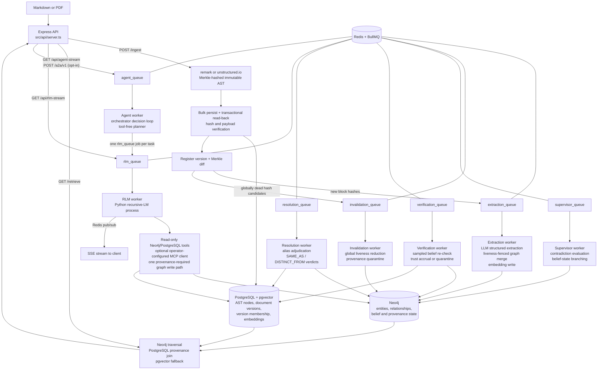

# Trellis Engine — Technical Roadmap

*Generated from a code-led review of the repository (July 4, 2026). File and line references point at the current state of `master`-derived code in this working tree. §1 (architecture overview) was refreshed July 7, 2026 (Session 13) to match the post-Session-12 code; the living session-to-session mental model remains `HANDOFF.md` §1.*

*Status: Foundations, update/invalidation correctness, belief verification, Session 3 deployment/CI readiness, Session 4 structured logging/metrics (T16), Session 5 entity resolution (3.3 #2), Session 6 benchmark maturity (3.3 #3), Session 7's semantic-provenance scale gate, Session 8 whole-codebase ingestion (3.3 #6, including the measured Entity.name merge index), Session 9's agentic orchestration loop (3.3 #7), Session 10's MCP tool surface for the RLM sub-agent (3.3 #8 first slice), Session 11's A2A server surface over the goal loop (3.3 #8 second slice), and Session 12's remote MCP transports with the containerized tool-server pattern (3.3 #8 third slice, closing the item's recorded scope) are complete and verified. Session 13 (July 7, 2026) was an owner-directed documentation, context-alignment, and architectural-consolidation session: the workspace/modules design record (`docs/architecture/WORKSPACE_AND_MODULES.md`) and canonical glossary (`docs/GLOSSARY.md`) landed, this file's §1 drift was corrected, and the frontend deployment was deferred (unscheduled; scope preserved in §3.3 #5). Session 14 is scoped to the design record's §11 steps 2 + 1 — kernel hardening and the Tier-3 workspace — see §4 and §5. The Session 7 measurements did not justify a storage migration; item 3.3 #4 remains open behind explicit observed thresholds, and Session 8's post-index re-measurement kept the gate closed. Every short- and medium-term roadmap item is closed. See §5 Progress Log for what was fixed, what was found along the way, and what remains open.*

---

## 1. Architecture Overview

Trellis is a Recursive Language Model runtime over a provenance-enforced knowledge substrate (reframed July 9, 2026 — the original "provenance-preserving GraphRAG" description now names the Tier-1/2 substrate, not the system; see the root README "What Trellis is"). Its central design commitment is unchanged: every semantic fact must remain traceable to an immutable, content-addressed physical location in the source document. The system is organized as an asynchronous pipeline over a three-tier storage layout.

### 1.1 Components and Data Flow

**Storage tiers:**

| Store | Role | Schema |
|---|---|---|
| PostgreSQL + pgvector | Physical layer: immutable AST nodes keyed by SHA-256 Merkle hash, plus embeddings | `ast_nodes(id, document_id, data JSONB, embedding vector(1536))` |
| Neo4j | Semantic layer: `Entity`, `Question`, `Concept` nodes; `ACTION`, `REFERENCES`, `CONTRADICTS`, `DERIVED_INSIGHT` edges, all carrying `sourceNodeIds` back-references | Uniqueness constraints on `Entity.id`, `Question.id`, `Concept.id` |
| Redis | BullMQ job queues (`extraction_queue`, `rlm_queue`, `supervisor_queue`, `invalidation_queue`, `verification_queue`, `resolution_queue`, `agent_queue`), pub/sub channels for SSE streaming, and TTL-bounded A2A task records (`a2a:task:<id>`) | — |

**The RLM harness** ([src/rlm/trellis_agent.py](src/rlm/trellis_agent.py)) wraps the `rlms` recursive-LM library with three injected tool surfaces: a read-only Neo4j client (transport-enforced `default_access_mode=READ`; the keyword blocklist is a fast-fail courtesy only) and a Postgres AST reader ([src/rlm/trellis_tools.py](src/rlm/trellis_tools.py)), plus — only when the operator configures servers in `TRELLIS_MCP_SERVERS` — an allowlisted, time- and size-bounded MCP client ([src/rlm/trellis_mcp.py](src/rlm/trellis_mcp.py), Sessions 10/12) whose results never satisfy the provenance requirement. The agent's only permitted graph write is `write_derived_insight`/`write_derived_insights`, which caches deduced facts as `DERIVED_INSIGHT` edges with mandatory provenance — the "flywheel" that makes repeat queries cheaper. Since Session 9 the RLM also serves as the reusable single-task sub-agent of the agentic goal loop (`src/core/agent/`, `agent_queue`), whose orchestrator is a tool-free planner that dispatches ordinary `rlm_queue` jobs; since Session 11 external agents can dispatch goals over A2A (`POST /a2a/v1`, opt-in).

**The OOLONG-Pairs benchmark** (`src/benchmarks/`, `scripts/`) is a self-contained evaluation harness: a seeded deterministic dataset generator, a verify-as-you-go ingestion loop, a cache-stripping prep script, and a 20-query runner that scores set-based F1 and measures the cold→warm cost collapse. The committed [benchmark_results.json](benchmark_results.json) shows F1 = 1.0 on all 20 queries with mean sub-calls dropping from 0.36 (cold) to 0 (warm).

**The frontend** (`src/frontend/`) is a Next.js app with a force-directed graph pane and a provenance pane; clicking a graph node highlights the exact AST text blocks that produced it, proxied to the backend via a rewrite rule ([next.config.ts](src/frontend/next.config.ts)).

### 1.2 Design Paradigms

- **Pipeline / queue-driven**: ingestion is a fan-out of independent, retryable jobs (Architecture Invariant 4 in [.agents/AGENT_CODING_GUIDELINES.md](.agents/AGENT_CODING_GUIDELINES.md)).
- **Content addressing**: node identity is `SHA-256(type:content:metadata:childHashes)`; block hashes are context-free, which the ingestion loop exploits for independent re-derivation checks.
- **Verification-as-a-loop**: the OOLONG ingester ([scripts/ingest_oolong_dataset.ts](scripts/ingest_oolong_dataset.ts)) writes a batch, reads it back, re-derives every hash through the parser, and refuses to advance past a failing batch.
- **Boundary validation**: dataset files pass through Zod schemas ([src/benchmarks/oolong/schema.ts](src/benchmarks/oolong/schema.ts)) before touching the pipeline.

---

## 2. Current State and Code Quality

### 2.1 Strengths

- **Provenance threading is consistent.** `sourceNodeIds` is carried through extraction ([extraction_worker.ts:59-76](src/workers/extraction_worker.ts:59)), ingestion verification ([ingest_oolong_dataset.ts:216-224](scripts/ingest_oolong_dataset.ts:216)), the RLM write path ([trellis_tools.py:60-62](src/rlm/trellis_tools.py:60), which rejects writes without provenance), and the retrieval join. This is the project's core differentiator and it is enforced, not just documented.
- **The ingestion verification loop is well-structured.** [ingest_oolong_dataset.ts](scripts/ingest_oolong_dataset.ts) separates write, hash-integrity read-back, semantic write, and constraint verification into named phases with a shared retry helper ([retry.ts](src/benchmarks/oolong/retry.ts)) and clear failure semantics.
- **The benchmark runner is defensively written.** [oolong_runner.ts:76-84](src/benchmarks/oolong_runner.ts:76) canonicalizes predicted tuples by category so tuple-ordering mistakes don't mask correct answers; protocol violations (zero tool calls) trigger bounded re-dispatch; per-query logs are persisted.
- **The RLM sandbox has layered guards**: a mutation-keyword blocklist, a single whitelisted write path, tool-call counting for provenance enforcement, and exceptions that propagate real tracebacks back into the REPL loop for self-correction.
- **Documentation is unusually thorough** for a project at this stage: architecture, math foundations, runbook, benchmark spec, and self-critique (`docs/benchmarks/CRITIQUE_AND_FUTURE.md`) all exist. Newer code (benchmarks, RLM harness) carries purposeful comments explaining invariants rather than restating syntax.

### 2.2 Technical Debt and Concerns

Ordered roughly by severity.

**T1 — No test suite.** *Resolved (July 4, 2026) — see §5.* `package.json:10` was the npm default stub (`echo "Error: no test specified" && exit 1`). There is no unit test framework anywhere in the repo. The scripts under `scripts/` (`test_e2e_rlm.ts`, `run_adversarial_tests.ts`, etc.) are manual end-to-end probes that require live Docker infrastructure and an OpenAI key — they are not automated, not assertion-based, and not CI-runnable. Several modules are pure functions that could be tested today with zero infrastructure: [parser.ts](src/core/ast/parser.ts), [corpus.ts](src/benchmarks/oolong/corpus.ts), and the parse/score functions in [oolong_runner.ts:76-94](src/benchmarks/oolong_runner.ts:76) and [rlm_client.ts:32-58](src/benchmarks/oolong/rlm_client.ts:32).

**T2 — Extraction granularity is wrong for markdown ingestion.** *Resolved (July 4, 2026) — see §5.* [server.ts:78](src/api/server.ts:78) selected "leaf nodes" as any node with string content. In a remark AST, leaves are inline tokens (`text`, `inlineCode`, …), not blocks — so `Globex **acquired** Initech` fans out as three separate extraction jobs (`"Globex "`, `"acquired"`, `" Initech"`), none of which contains the full relationship. Extraction should operate at block level (paragraph/heading) with concatenated child text, as [corpus.ts:27-30](src/benchmarks/oolong/corpus.ts:27) already does via `nodeText()`. This directly degrades graph quality for any formatted document.

**T3 — Runtime dependency misclassification.** *Resolved (July 4, 2026) — see §5.* `ioredis` was in `devDependencies` ([package.json:41](package.json:41)) but is imported at runtime by [server.ts:183](src/api/server.ts:183), [queue.ts:2](src/workers/queue.ts:2), and [rlm_worker.ts:5](src/workers/rlm_worker.ts:5). A production install with `--omit=dev` will not start. Conversely, `@types/*`, `typescript`, and `tsx` sit in `dependencies`.

**T4 — The repo violates its own configuration invariant.** *Resolved (July 4, 2026) — see §5.* [.agents/AGENT_CODING_GUIDELINES.md:13](.agents/AGENT_CODING_GUIDELINES.md) mandates a schema-validated config object exported from `src/config/index.ts`; that file did not exist. Instead, connection details and passwords are hardcoded: Postgres and Neo4j credentials in [db.ts:5-17](src/config/db.ts:5), Redis host/port in [queue.ts:4-8](src/workers/queue.ts:4) and duplicated in [server.ts:201-204](src/api/server.ts:201) and [rlm_worker.ts:7-10](src/workers/rlm_worker.ts:7). The Python tools ([trellis_tools.py:22-26](src/rlm/trellis_tools.py:22)) do read env vars, so the two halves of the system configure differently.

**T5 — Machine-specific path hardcoded in the RLM worker.** *Resolved (July 4, 2026) — see §5.* [rlm_worker.ts:25](src/workers/rlm_worker.ts:25) set `PYTHONPATH` to `C:\Users\Darian\AppData\Roaming\Python\Python313\site-packages`. The RLM pipeline cannot run on any other machine without editing source. The bare `python` executable name is also platform-dependent.

**T6 — No authentication, rate limiting, or concurrency control on the API.** *Resolved (July 4, 2026) — see §5.* All three endpoints are unauthenticated. `/api/rlm-stream` is the sharpest edge: each GET spawns a Python process that makes paid LLM calls and holds database connections ([server.ts:186-239](src/api/server.ts:186)). An unauthenticated caller can generate unbounded cost and process load. There is also no cap on concurrent RLM jobs beyond BullMQ's default worker concurrency.

**T7 — The Cypher read-only guard is a keyword blocklist, and APOC is enabled.** *Resolved (July 4, 2026) — see §5.* [trellis_tools.py:34-41](src/rlm/trellis_tools.py:34) blocks `CREATE/MERGE/SET/...` by word-boundary regex, but [docker-compose.yml:26](docker-compose.yml:26) installs the APOC plugin — `CALL apoc.create.node(...)` and similar procedures mutate the graph without using any blocked keyword. The blocklist also false-positives on legitimate queries that contain the words in string literals. The robust fix is transport-level: open sessions with `default_access_mode=READ` (and/or a read-only Neo4j user), keeping the blocklist only as a fast-fail courtesy check.

**T8 — LLM outputs are parsed without runtime validation, violating Guideline 2.** *Resolved (July 4, 2026) — see §5.* [extraction_worker.ts:30](src/workers/extraction_worker.ts:30) and [supervisor_worker.ts:76](src/workers/supervisor_worker.ts:76) call `JSON.parse(rawContent)` on the completion payload without `GraphSchema.parse()` / `safeParse()`. `zodResponseFormat` constrains the request, but nothing verifies the response, and the repo's own guidelines forbid exactly this pattern.

**T9 — Silent data loss in extraction ID resolution.** *Resolved (July 4, 2026) — see §5.* In [extraction_worker.ts:43-51](src/workers/extraction_worker.ts:43), if the LLM emits an action whose `subjectId`/`objectId` doesn't match any returned entity, the code falls back to the raw ID; the subsequent Cypher `MATCH` on the name then finds nothing and the action is dropped with no log line. Failed resolutions should at minimum be counted and logged.

**T10 — Supervisor worker defects.** *Resolved (July 4, 2026) — see §5; the detection-cost heuristic (fourth bullet) remains open by design.*
- The `Conflict` node created at [supervisor_worker.ts:89](src/workers/supervisor_worker.ts:89) is never connected to anything — it floats as an orphan carrying the reasoning text, unreachable from the entities it explains.
- [supervisor_worker.ts:50,54](src/workers/supervisor_worker.ts:50) join text fragments with the two-character literal `"\\n"` instead of a newline.
- The anomaly query ([supervisor_worker.ts:25](src/workers/supervisor_worker.ts:25)) uses `id()`, deprecated in Neo4j 5 (the resolution query already uses `elementId()`).
- Detection treats *any* same-verb fan-out as a candidate contradiction ("acquired X" and "acquired Y" is normal), relying on the LLM to filter — workable, but every false candidate costs a paid completion.
- The supervisor is also not wired into `start_all.ts` and only runs via the manual trigger script.

**T11 — Per-row inserts and per-job enqueues in the hot ingestion path.** *Resolved (July 4, 2026) — see §5.* [server.ts:62-68](src/api/server.ts:62) inserted AST nodes one query at a time inside a transaction, and [server.ts:79-84](src/api/server.ts:79) enqueued extraction jobs one `await` at a time. For large documents this was a straightforward N-round-trip bottleneck. The production path now uses one multi-row `INSERT ... UNNEST` and one `queue.addBulk()` call. The benchmark ingester retains its small, verification-oriented batches.

**T12 — Document membership is not modeled.** *Resolved prior to this review's publication (Phase 4 versioned-ingest work) — see §5.* `ast_nodes.document_id` is set once and `ON CONFLICT (id) DO NOTHING` ([server.ts:63-67](src/api/server.ts:63)) means a node shared by two documents (identical content) keeps whichever document ingested it first. Content addressing makes node reuse across documents *expected*, so membership needs a join table (`document_nodes(document_id, node_id)`) rather than a column.

**T13 — Hash preimage lacks canonical encoding.** *Open by design for now; current behavior is pinned by unit tests — see §5.* [parser.ts:20-31](src/core/ast/parser.ts:20) builds the hash input by joining `type`, `content`, `JSON.stringify(metadata)`, and concatenated child hashes with `:` delimiters. Because none of the segments are length-prefixed, distinct `(type, content, metadata)` combinations can in principle produce identical preimages. Practical risk is low (types come from a fixed vocabulary), but a Merkle-integrity system should use an unambiguous encoding (length-prefixed segments or canonical JSON of the full tuple). Also, `if (content)` treats empty-string content as absent — a falsy check where an `!== undefined` check is meant.

**T14 — No embedding/queue hygiene.** *Resolved (July 4, 2026) — see §5.*
- ~~No pgvector index; vector fallback is a sequential scan.~~ A partial cosine HNSW index is now created idempotently with the schema.
- ~~Queues lack retry and retention policy.~~ Background queues use bounded exponential retries, permanent OpenAI 4xx failures stop immediately, and completed/failed history is bounded by age and count. The interactive RLM queue retains the history bounds but deliberately has no automatic retries.
- ~~Uploaded PDF files land in `uploads/` via multer ([server.ts:12](src/api/server.ts:12)) with no size/type limit and are never deleted.~~ *Resolved with T6 (July 4, 2026): PDF-only, size-capped, deleted after parsing.*
- ~~No graceful shutdown.~~ SIGINT/SIGTERM now stop API admission, close workers, publishers and queues, then drain PostgreSQL/Neo4j clients in phase order.

**T15 — Duplicated helpers and drift between pipelines.** *Resolved (July 5, 2026) — see §5.* The traversal-helper duplication was resolved with T2. Vector similarity ordering now lives in the PostgreSQL `search_ast_nodes` function consumed by both [server.ts](src/api/server.ts) and [trellis_tools.py](src/rlm/trellis_tools.py). Production `/ingest` now performs its own transactional write → read-back → parser re-derivation check before version registration commits. The OOLONG ingester retains its benchmark-specific semantic constraint verification.

**T16 — Observability is `console.log`.** *Resolved (July 6, 2026) — see §5.* Operational code now logs one JSON object per line through a pino-backed observability module with a validated `LOG_LEVEL`, stable correlation fields (service/worker/queue/jobId/attempt/requestId/docKey/version/astNodeId), and preserved event names. Prometheus metrics are exposed per process: the API serves authenticated `GET /metrics`; the worker container serves an internal listener with queue-depth gauges, job outcomes, pipeline transition counters, LLM token spend, and RLM telemetry parsed from the `TRELLIS_TELEMETRY:` line.

**T17 — Minor documentation drift.** *Resolved (July 4, 2026) — see §5.* [README.md:6](README.md:6) now limits the bounding-box claim to PDF nodes whose parser output supplies coordinates; markdown nodes are explicitly documented as geometry-free. The extraction model had already been consolidated into validated configuration.

**T18 — No reproducible backend deployment or CI.** *Resolved (July 5, 2026) — see §5.* The repository now has a compiled production build, non-root Node/Python image, pinned Python manifests, schema-gated API/worker Compose topology with health checks and project-scoped resources, a tested `.env` load path, GitHub Actions, and a deterministic zero-LLM ingest/provenance/retrieve round trip.

---

## 3. Roadmap

### 3.1 Short-Term (immediate fixes, low-hanging fruit)

1. ~~**Fix dependency classification** (T3)~~ — **done** (July 4, 2026): `ioredis` moved to `dependencies`; `@types/*`, `typescript`, `tsx` moved to `devDependencies`.
2. ~~**Remove the hardcoded PYTHONPATH** (T5)~~ — **done** (July 4, 2026): interpreter comes from `PYTHON_EXECUTABLE` (platform-aware default), `PYTHONPATH` is an optional passthrough, and a missing `rlms` package produces an actionable error.
3. ~~**Create `src/config/index.ts`** (T4)~~ — **done** (July 4, 2026): Zod-validated config read once from env, consumed by `db.ts`, `queue.ts`, `server.ts`, and the workers; Neo4j/Postgres settings are forwarded to the spawned Python process. Also collapsed the model-string duplication (part of T17).
4. ~~**Validate LLM responses** (T8)~~ — **done** (July 4, 2026): every worker-consumed completion crosses `parseLlmResponse` in the new `src/core/llm/boundary.ts` (empty / JSON / schema failure stages); structural failures throw into the BullMQ retry flow, now enabled by bounded queue-level retry defaults.
5. ~~**Fix the supervisor bugs** (T10)~~ — **done** (July 4, 2026): the `Conflict` node is linked to the subject and both branch objects with provenance on every created node/edge, text fragments join with real newlines, detection orders by `elementId()`, and the supervisor worker starts with `start_all.ts`. Cypher and pure helpers live in `src/core/graph/conflict_resolution.ts`.
6. ~~**Log dropped actions in the extraction worker** (T9)~~ — **done** (July 4, 2026): unresolved endpoints are logged at resolution time (`src/core/graph/resolve_actions.ts`) and the merge Cypher returns the merged action ids so Cypher-level drops are detected and logged post-merge.
7. ~~**Stand up a unit test harness** (T1)~~ — **done** (July 4, 2026): vitest wired into `npm test`; 45 tests over parser hashing determinism (including the T13 empty-content and delimiter edge cases, pinned as current behavior), `buildCorpus` round trips, `parsePredictedPairs`/`scoreF1`/`estimateCost`, and the SSE extractors in `rlm_client.ts`. No infrastructure required.
8. ~~**Correct the README bounding-box claim** (T17)~~ — **done** (July 4, 2026): README now distinguishes PDF geometry from geometry-free markdown nodes.

### 3.2 Medium-Term (correctness, performance, robustness)

1. ~~**Fix extraction granularity** (T2)~~ — **done** (July 4, 2026): `/ingest` fans out block-level nodes (paragraph, heading, list item, code, PDF element) with reconstructed inline text via the new `src/core/ast/traverse.ts`, which also consolidates the duplicated `flattenAST`/`nodeText` (the traversal-helper half of T15). See §5.
2. ~~**Harden the RLM sandbox** (T7)~~ — **done** (July 4, 2026): `run_cypher` sessions open with `default_access_mode=READ` (server-enforced; blocklist retained as fast-fail courtesy), `write_derived_insight` uses an explicit WRITE session, APOC dropped from the compose file. Verified live by `npm run test:rlm-sandbox`.
3. ~~**Add API protection** (T6)~~ — **done** (July 4, 2026): API-key middleware (header / Bearer / query param), concurrency cap + queue-depth limit on `/api/rlm-stream` (429), body and upload size limits (413), PDF-only uploads with post-parse cleanup. Verified live by `npm run test:api-hardening`.
4. ~~**Queue hygiene** (T14)~~ — **done** (July 4, 2026): bounded retry/retention defaults, typed permanent-vs-transient OpenAI error classification, phase-ordered SIGINT/SIGTERM shutdown, and a cosine HNSW index.
5. ~~**Model document membership properly** (T12)~~ — **done prior to this roadmap review**: version membership is represented by `documents` and `document_nodes`; see §5 Phase 1 findings.
6. ~~**Batch the ingestion hot path** (T11)~~ — **done** (July 4, 2026): `/ingest` uses a single `UNNEST` insert for AST nodes and `addBulk` for extraction fan-out.
7. ~~**Promote the verified-ingestion loop from the benchmark script into the main pipeline** (T15)~~ — **done** (July 5, 2026): `/ingest` reads every bulk-written AST row back inside the same PostgreSQL transaction, re-derives its hash through `parser.ts`, compares the complete JSON payload, and rolls the version back on any mismatch.
8. ~~**Integration tests against Docker infrastructure**~~ — **done** (July 5, 2026): isolated Compose CI runs real schema initialization, a zero-extraction-block ingest, PostgreSQL document/root membership checks, a directly seeded provenance-bearing Neo4j relationship, and `/retrieve`, with no workers or OpenAI key.
9. ~~**Structured logging and basic metrics** (T16)~~ — **done** (July 6, 2026): pino JSON logging with request/job correlation fields, split API/worker Prometheus registries, counters for job outcomes, dropped/unresolved actions, invalidation and verification transitions, LLM/RLM token spend, and scrape-time queue-depth gauges. See §5.

### 3.3 Long-Term (strategic direction)

1. ~~**The document-update story.**~~ **Done (Phase 4, hardened July 5, 2026):** versioned ingestion computes a Merkle set diff, extracts only new block hashes, reduces document-local orphan candidates against global latest-version membership, and quarantines rather than deletes semantic facts whose provenance died. Cross-store extraction races are fenced and compensated. The Update Drill measured selective reprocessing, invalidation recall/precision, and recovery; see the Phase 4 PRD and §5.
2. ~~**Entity resolution beyond exact-name identity.**~~ **Done (Session 5, July 6, 2026):** entity identity stays `SHA-256(lowercased name)` and the extraction merge is untouched; equivalence is an overlay belief. Deterministic lexical candidate generation ([alias_candidates.ts](src/core/graph/alias_candidates.ts): token containment, acronym, near-identity edit distance; same-kind `generic`/`concept` pairs only — `question`/`category_label` are excluded so flywheel exact-id lookups are unaffected) plus batched LLM adjudication behind the Zod boundary ([alias_resolution.ts](src/core/graph/alias_resolution.ts), `resolution_queue`, `scripts/resolve_sweep.ts`) records `SAME_AS`/`DISTINCT_FROM` verdict edges with union provenance. The verdicts inherit the existing quarantine machinery, and `GET /retrieve` expands one non-contested `SAME_AS` hop at `RESOLUTION_MIN_CONFIDENCE` with per-fact alias attribution (`?resolveAliases=false` opts out). Embedding-similarity candidate generation remains a documented follow-up (entity names carry no embeddings today). See §5.
3. ~~**Benchmark maturity.**~~ **Done (Session 6, July 6, 2026):** dataset v2 (`oolong-pairs-trec-synthetic-v2`, [data/oolong_pairs_dataset_hard.json](data/oolong_pairs_dataset_hard.json), seeded pure generator [generate_v2.ts](src/benchmarks/oolong/generate_v2.ts)) breaks the substring-scan shortcut with paraphrased city mentions (canonical token never in the text — pinned by unit test), near-miss questions name-dropping unannotated cities, and non-question prose distractors ingested as `:Passage` nodes that can never pair. The harness CLIs take `--dataset` (default v1), the runner derives its sequence from the dataset and writes non-v1 results to a separate file, and cache-audit accuracy became a first-class metric shared by the audit CLI, the runner's results block, and the poison drill ([cache_audit.ts](src/benchmarks/oolong/cache_audit.ts)). v1, its committed results, and the drills are untouched. Real TREC import (needs paid annotation), adversarial soft-label corpora, embedding-based retrieval difficulty, and 10k+ scale sweeps remain future work; a paid v2 benchmark run awaits owner approval. See §5.
4. **Scalability of the semantic layer.** Entity `sourceNodeIds` arrays remain unbounded under the append-only `ON MATCH` pattern, but Session 7 measured the real headroom before changing storage. A deterministic 300-document × 20-block drill produced 6,096 semantic nodes and 6,000 relationships: the largest node array was 286, every relationship array remained at 1, and fixed-50-hash median sweep latency grew only 1.42x while semantic facts grew 5.77x. The migration gate therefore stayed closed. Keep arrays until an observed run reaches 1,000 live hashes on one fact or fixed-orphan-set median sweep latency grows more than 1.5 times semantic-fact growth; then migrate node scan anchors to `(:ASTRef {hash})` / `[:EVIDENCED_BY]`, retaining relationship arrays unless their own measurements change. See [the scale report](docs/benchmarks/SCALE_PROVENANCE_REPORT.md) and §5. HNSW and block-level embedding granularity already shipped under T14/T2.
5. ~~**Deployment and community readiness.**~~ **Backend deployment/CI done (July 5, 2026); license done (July 6, 2026):** the backend has a compiled non-root Node/Python image, health-gated project-scoped Compose topology, pinned runtime manifests, documented environment/startup contracts, isolated zero-LLM CI, and an MIT license selected by OpenCnid. The frontend remains intentionally excluded from backend containerization, and its Next.js convention note remains in [src/frontend/AGENTS.md](src/frontend/AGENTS.md). **Frontend deferral recorded (July 7, 2026):** the frontend residue (production build + non-root container, a server-side allowlisted proxy that injects the API key without ever handing it to the browser, CI coverage, and the Compose proof) was briefly renumbered to Session 14 during the Session 13 realignment, then deferred by owner direction the same day — **unscheduled, scope preserved exactly as stated here**; it re-enters §4 sequencing when the owner schedules it.

6. ~~**Whole-codebase ingestion.**~~ **Done (Session 8, July 6, 2026):** one repository snapshot is a bounded sequence of per-file verified ingests (`repo:<key>:<path>` doc keys) through the extracted `src/core/ingestion/` service, with code-aware TypeScript/JavaScript/Python parsing, durable PostgreSQL snapshot membership, tombstone-based deletion/rename semantics that quarantine through the existing invalidation sweep, and a zero-paid-work default (`--extract none`; `changed` requires an explicit budget plus confirmation). The measured `Entity.name` merge index shipped alongside (recorded separately from the still-open 3.3 #4 gate). See §5 and `docs/benchmarks/REPOSITORY_INGESTION_REPORT.md`. The original decision record follows. Decision recorded July 4, 2026: this is a pipeline feature, **not** a relaxation of the T6 per-request limits. The natural unit is one document per source file (`doc_key` = repo-relative path), so per-file Merkle diffs drive incremental re-extraction commit-to-commit — exactly what the physical layer was built for — fed by a batch client/CLI rather than one giant request. A single-blob upload of a repo would defeat per-file identity, diff granularity, and the streaming-free `express.text`/single-transaction ingest (the whole body is buffered in memory and inserted row-by-row). Individual source files fit comfortably inside the 5 MB default (generated artifacts that don't should be excluded, or the env knob raised). Prerequisites before this feature: T11 batching (multi-row inserts + `addBulk` for thousands-of-files fan-out), the rest of T14 (queue hygiene at that job volume), a code-aware parser path (tree-sitter or similar — extraction blocks should be functions/classes, not markdown paragraphs), and extraction cost controls (tiered/selective extraction; one LLM call per block across a 50k-file repo is cost-prohibitive). If a convenience archive-upload endpoint is added, the upload allowlist expands to zip/tar with decompressed-size and entry-count guards (zip bombs) — independent of the per-request caps, which stay small on purpose (each request's body is held fully in memory).

7. ~~**Agentic orchestration loop (owner-directed, July 6, 2026).**~~ **Done (Session 9, July 7, 2026):** `GET /api/agent-stream` accepts one goal; the `agent_queue` worker runs an orchestrator (same LLM, planner system prompt, plain structured chat completions through the T8 boundary — never an rlms REPL) whose Zod-validated decisions dispatch single-task RLM runs as ordinary `rlm_queue` jobs, observe their new `TRELLIS_RESULT` envelopes, and iterate until finish/fail or a hard bound trips (`AGENT_MAX_ITERATIONS_PER_GOAL`/`AGENT_MAX_TASKS_PER_GOAL`/`AGENT_MAX_CONCURRENT_TASKS`/`AGENT_TASK_MAX_ITERATIONS`, all single-digit-capped). Task failures and protocol violations are observations for the next decision; every other exit is a typed streamed failure. The orchestrator never writes to the graph; acceptance was zero-LLM (oracle decisions + stubbed tasks over the real queues, pub/sub, and API — `npm run test:agent-loop`). See §5. The original direction follows. Trellis must be able to work agentically: an external loop that accepts a goal, decomposes it into tasks, and mediates execution until the goal completes or a bound is hit. The loop is driven by the same LLM under a different (orchestrator) system prompt — plain structured chat completions crossing the T8 `parseLlmResponse` boundary, never a second REPL (the rlms `custom_system_prompt` replaces the REPL protocol prompt, so the orchestrator persona must not be routed through rlms). The RLM becomes a reusable single-task sub-agent: one `rlm_queue` job per task, one process per run exactly as today, so a goal can dispatch many RLM runs and aggregate their `FINAL_ANSWER:` results and `TRELLIS_TELEMETRY:` spend. Hard per-goal bounds on orchestrator iterations, dispatched tasks, and tokens; all LLM calls stay inside workers; the orchestrator itself never writes to the graph — `write_derived_insight` remains the single agent write path. Zero-LLM acceptance via a deterministic oracle planner plus stubbed task execution over the real queue/stream plumbing. Scheduled as Session 9; see §4 and `HANDOFF.md`.

8. **External tool integration for the RLM sub-agent (owner-directed, July 7, 2026).** **First slice — the MCP client surface — done (Session 10, July 7, 2026):** the RLM gains an operator-configured stdio MCP client (`TRELLIS_MCP_SERVERS` → `src/rlm/trellis_mcp.py`, injected as `trellis_mcp` via `custom_tools`), with allowlist-before-I/O enforcement, per-call timeouts, size-capped results, a separate `mcp_calls` telemetry counter that never satisfies the database-provenance requirement, and zero-paid acceptance against a local deterministic fixture server (`npm run test:rlm-mcp`). See §5. **Second slice — the A2A server surface — done (Session 11, July 7, 2026):** Trellis serves the Agent2Agent protocol (spec v1.0.0, JSON-RPC binding) over the existing goal loop — `TRELLIS_A2A_ENABLED` (default off, byte-identical API when unset) mounts the well-known Agent Card and one JSON-RPC endpoint whose `SendMessage`/`SendStreamingMessage`/`GetTask`/`CancelTask` dispatch goals through the same admission gates and per-goal bounds as `/api/agent-stream`, with TTL-bounded Redis task records and zero-paid acceptance (`npm run test:a2a`). See §5. **Third slice — remote MCP transports and the containerized tool-server pattern — done (Session 12, July 7, 2026):** the registry became a union discriminated on `transport` (`stdio` stays the default; pre-Session-12 values parse unchanged) with an `http` variant carrying a Streamable HTTP URL (spec 2025-06-18; https required for public hosts, plain http only for loopback/RFC1918/dot-free private hosts) and an operator-owned auth story — `auth.valueEnv` NAMES a credential env var, the worker resolves it fail-fast at startup and forwards exactly the named variables, and every raised tool error is scrubbed of credential values before it reaches the model-visible REPL. Same allowlist/timeout/size-cap machinery over both transports; a containerized tool server (own Compose service, project network, no host port, bearer auth) is the demonstrated deployment shape; zero-paid acceptance grew to 86 fixture checks plus the containerized-fixture Compose assertion. **The recorded 3.3 #8 scope is now exhausted** — the shipped surface covers MCP client (stdio + Streamable HTTP + auth + containerized servers) and the A2A server; anything further (new tools, OAuth flows for MCP, Trellis as an A2A client or MCP server) is a new owner direction, not a recorded remainder. See §5. The original direction follows. With the agentic loop in place (3.3 #7), the sub-agent's world is still exactly two injected database tools — it can decompose goals but every task bottoms out in graph/AST lookups. The owner directed that Trellis now gain external tools, **MCP (Model Context Protocol) first**, with web search as the first concrete tool and A2A (agent-to-agent) interoperability as a follow-on direction across future sessions. The extension point already exists: `trellis_agent.py` injects tools via rlms `custom_tools`, and `trellis_tools.py` shows the wrapper discipline (JSON-string returns, tool-call counting, exceptions that surface real tracebacks into the REPL). Hard invariants: MCP servers and their tool allowlists come from operator-validated configuration only — never from job payloads and never chosen freely by the model; MCP calls do NOT satisfy the database-provenance requirement (`TRELLIS_PROTOCOL_VIOLATION` stays keyed to database tool calls) and MCP output can never be passed as `sourceNodeIds` — external content earns citability only by round-tripping through the verified ingest path to become content-addressed AST bytes; responses are size-capped and time-bounded; acceptance is zero-paid against a local deterministic fixture MCP server. Scheduled as Session 10; see §4 and `HANDOFF.md`.

---

## 4. Suggested Sequencing

| Order | Item | Rationale |
|---|---|---|
| ~~1~~ | ~~Structured logging and basic metrics (3.2 #9 / T16)~~ | **Done (July 6, 2026)** — split-process logs/metrics shipped; see §5 |
| ~~2~~ | ~~Entity resolution beyond exact-name identity (3.3 #2)~~ | **Done (Session 5, July 6, 2026)** — SAME_AS overlay beliefs with quarantine inheritance; see §5 |
| ~~3~~ | ~~Benchmark maturity (3.3 #3)~~ | **Done (Session 6, July 6, 2026)** — anti-shortcut dataset v2 + first-class cache-audit metric; see §5 |
| ~~4~~ | ~~Semantic provenance scale gate (3.3 #4 measurement)~~ | **Measured (Session 7, July 6, 2026)** — migration not justified at 300 documents; explicit 1,000-source/superlinear triggers recorded; see §5 |
| ~~5~~ | ~~Whole-codebase ingestion (3.3 #6)~~ | **Done (Session 8, July 6, 2026)** — code-aware per-file snapshots with tombstone deletion, zero-paid-work default, and the measured Entity.name merge index; see §5 |
| ~~6~~ | ~~Agentic orchestration loop (3.3 #7)~~ | **Done (Session 9, July 7, 2026)** — goal loop over the RLM as a reusable single-task sub-agent, zero-LLM acceptance; see §5 |
| ~~7~~ | ~~MCP tool integration for the RLM (3.3 #8, first slice)~~ | **Done (Session 10, July 7, 2026)** — operator-configured stdio MCP client for the sub-agent with fixture-server zero-paid acceptance; see §5 |
| ~~8~~ | ~~A2A server surface (3.3 #8, second slice)~~ | **Done (Session 11, July 7, 2026)** — Trellis serves A2A v1.0 over the goal loop behind the existing gates and bounds, zero-paid acceptance; see §5 |
| ~~9~~ | ~~MCP tool-surface expansion (3.3 #8 continuation)~~ | **Done (Session 12, July 7, 2026)** — remote Streamable HTTP transports with env-referenced credentials, redaction, and the containerized tool-server pattern; the recorded 3.3 #8 scope is exhausted; see §5 |
| ~~10~~ | ~~Kernel hardening and the Tier-3 workspace (design record §11, steps 2 + 1)~~ | **Done (Session 14, July 7, 2026)** — `sourceNodeIds` format + `ast_nodes` existence enforcement at the single write path, then the harness-captured in-REPL workspace (origin-stamped uuid segments, stub returns, plan-in-workspace, byte-identical gating); see §5 |
| ~~11~~ | ~~Module registry + module #0 (design record §11 step 3)~~ | **Done (Session 15, July 7, 2026)** — owner directed the step 3 → step 4 order on July 7, 2026 (PR #40 discussion); protocol-module registry, operator-owned `TRELLIS_MODULES` selection, spatial-flywheel extraction behind a byte-identical composed-prompt pin; the §9.4 graph representation is explicitly deferred to the first research-bearing module; the owner-approved paired-run workspace probe was also measured this session; see §5 |
| ~~12~~ | ~~Workspace lineage (design record §11 step 4)~~ | **Done (Session 16, July 7, 2026)** — serialize/park/seed across a goal's tasks: end-of-run snapshots parked goal-scoped in Redis (TTL + per-goal byte cap), the orchestrator routes by reference (`workspaceRef` observations, `seedFromTasks` dispatches, prior iterations only), seeded runs restored at spawn with stamps preserved and bounds re-enforced; oracle drills extended to seeded runs; see §5 |
| ~~13~~ | ~~Promotion path (design record §11 step 5)~~ | **Done (Session 17, July 7, 2026)** — operator-gated segment→ingest through the unmodified verified transaction: `npm run promote` (list/promote, zero-paid default), typed planner refusals (truncated/empty/unknown/bad-key), the origin audit stamp on the documents row, and the earned-citability loop drilled end to end (`test:promotion` 41); see §5 |
| ~~14~~ | ~~First flywheel turn (design record §11 step 6)~~ | **Machinery done (Session 18, July 8, 2026)** — research existence gate at registration, the §9.4 manifest-as-graph-entity representation (`modules:register`/`modules:verify`, unchanged sweep contests research-superseded modules), and the human recovery loop, drilled end to end (`test:module-lifecycle`); the module #1 PAID authoring turn RAN, owner-approved, July 9, 2026 (module `workspace-discipline`; see §5) and surfaced the laundering finding that produced row 1 below |
| ~~1~~ | ~~Grounded authoring (`docs/architecture/GROUNDED_AUTHORING.md` Phases 1–2)~~ | **Done (Session 19, July 9, 2026)** — kernel `trellis_agent.py --mode author` scoped to a seeded read-only corpus (no DB/search/write), harness-pinned `research.sourceNodeIds`, byte-pinned authoring template, deterministic anchor derivation gate, and the `npm run modules:author` operator driver (plan-echo / `--draft` replay / `--confirm-paid` spawn); `TRELLIS_DRAFT` scanner refuses any 64-hex token; drilled end to end zero-LLM; see §5 |
| ~~1~~ | ~~Code-mediated text follow-ups (pillar §6.1 + §6.2): the editing toolkit and the kernel prompt revision~~ | **Done (Session 20, July 9, 2026)** — the operator-gated `trellis_textedit` holder (engine-computed `locate`, staged `splice`, digest-guarded atomic `write_back`, strict root containment, Zod/Python twin bounds, byte-identical prompt and namespace when `TRELLIS_EDIT_ROOT` is unset; `npm run test:textedit`, 81 checks) and the §6.2 CODE-MEDIATED TEXT kernel prompt block shipped in its own commit with the composed-prompt sha256 pin recomputed there; see §5 |
| ~~1~~ | ~~Pillar measurement + module #1 v2 (pillar §6.3 + §6.4, owner-APPROVED July 9, 2026) + the Frankenstein corpus~~ | **Done (Session 21, July 10, 2026 — the redo; the first attempt, PR #56, was owner-discarded and reverted by PR #58 the same day)** — Frankenstein ingested zero-paid as durable Tier-1 substrate; the effective-context probe MEASURED (§6.3: 12 runs, $0.73 — with the §6.2 block no run put the corpus through attention, without it one run pushed all ~105k tokens through a single `llm_query`; the one wrong answer was an engine-computed 55 retyped as 47 — the transcription channel live in the answer path); module #1 v2 landed through grounded authoring (§6.4: anchor gate refused the three-doc corpus at 0.28, owner re-scoped to the two normative docs per the gate's documented remedy, the same paid draft landed at 0.50 by zero-paid replay; mitigation line retired, v1 history preserved); see §5 |
| ~~3~~ | ~~Anchor-gate calibration (grounded-authoring follow-up, measured Session 21)~~ | **Core fix done (Session 21, later the same day)** — `evaluateAnchorGate` no longer scores template-forbidden numeric anchor kinds (`comparison`/`ratio`) in its denominator; the previously refused module #1 v2 draft now clears at 18/60 = 0.30. Optional residual (compound segments get exact-match, plain terms get stem credit — a minor asymmetry) left to a future gate touch, not blocking; see §5 |
| ~~2~~ | ~~Effective-context probe, round 2 + the answer-channel fix (owner-directed next, July 10, 2026)~~ | **Done (Session 22, July 11, 2026)** — the by-reference answer channel (`trellis_answer.submit`: caller-frame evaluation, structural literal refusal, engine-side rendering; `npm run test:answer-channel`, 32 checks; both composed-prompt pins recomputed wittingly) shipped FIRST, then all four measurement arms ran paid ($2.15, 57 runs): the unmemorized synthetic chronicle isolated read-fidelity (8/8 anomaly quotes byte-faithful), the 40-ledger corpus measured the pandas null result (0/12 aggregation runs reached for a DataFrame — plain loops stayed cheap and correct), the edit round-trip was 8/8 byte-exact through `trellis_textedit`, repeats reported medians with spread, and the round-1 55→47 question came back 55 in both arms; zero transcription errors in 56 runs (round 1: 1 in 12); every remaining miss is localization-method error over the glued reconstruction (a recorded observation, not a regression); see §5 |
| ~~3~~ | ~~Effective-context probe, round 3 (owner-directed next, July 11, 2026)~~ | **Done (Session 23, July 11, 2026)** — the relational corpus (102 generated documents: 100 season-two ledgers ≈6,859 records + a captain→guild registry + a port/material tariff schedule; every question a genuine 2- or 3-table join) measured the pandas null result PERSISTING at 3.1× round-2 scale (0/87 round-3 runs imported pandas or polars; plain dict loops answered every join digit-exact); the localization arm (30 locate runs) reproduced the round-2 failure class at rate (7/30 misses, ALL method error over the glued reconstruction, none transcription) and quantified TWO representation traps zero-paid (line anchors: chronicle 0/48 headings visible glued vs 48/48 boundary-preserved; trailing word boundaries: `\d+\b` fails at glued digit→letter junctions, producing the exact "Chapter 23" wrong answer of both rounds); higher n moved the load-bearing claims (87/87 submits, zero transcription errors at n=5/arm on counts and quotes); the disclosure clause was restored to the chronicle/ledger preambles; RECOMMENDATION recorded (then re-pointed the same day — the owner chose the additive `get_ast_blocks` accessor over the reconstruction-byte change; now §4 row 4). See §5 |
| ~~4~~ | ~~Boundary-aware block accessor (`get_ast_blocks`) + structure-selection demotion~~ | **Done (Session 24, July 11, 2026)** — `trellis_postgres.get_ast_blocks(root_hash)` returns a document's extraction blocks in order (`[{id, type, text}]`, exactly the `collectExtractionBlocks` set) via the dependency-free walk in `src/rlm/trellis_blocks.py`, parity-pinned block-for-block against the TS authority (`block_parity.test.ts`) and round-tripped live (frank 796 / chronicle 827 blocks byte-identical); NO stored or reconstructed byte moved; both composed-prompt pins moved wittingly to teach the tool (default `3f07295a…4b63`, omit-arm `85362b81…71bb`); pillar §7's "pandas default" DEMOTED to "plain loops until a measured threshold" per its own written contingency; the probe gained the `structured` method verdict, the paren-free locate-preamble offer, and the report's round-4 section. The localization re-measure ran OWNER-APPROVED the same day ($0.9452, 36 runs): 0/36 misses vs round 3's 7/30 on the same locate set, 36/36 runs adopting the accessor in BOTH arms (the off arm too — tooling shape, not the prompt block, carries the behavior); the round-3 "Chapter 23" trap question came back correct 6/6; the superseded reconstruction-byte row stays closed; see §5 |
| ~~5~~ | ~~Repository-scale extraction prerequisites~~ | **Done (Session 25, July 11, 2026)** — the three recorded pilot findings turned into machinery, all zero-paid: the kernel-fixed test/fixture extraction exclusion (`isTestOrFixturePath`; classified files still ingest but their extraction policy is forced to `none`, reported as typed `test_fixture_excluded` file/block counts in the plan echo), additive `sourceKind` payload routing selecting a code-tuned extraction prompt (legacy prose bytes unit-pinned; unknown values refused at the boundary), and deterministic generic-identifier suppression before resolution (kernel denylist + length-<3 shape rule + touched-relationship drops, counted and logged, never silent). The paid pilot RE-RUN stays owner-gated: proposed at the CLI's printed post-exclusion bound of 103 blocks ≈ $0.29; see §5 |
| ~~6a~~ | ~~Data-plane representation verdict follow-ups (owner-directed July 11, 2026 — inserted AHEAD of the positive control, which is unchanged)~~ | **Done (Session 27, July 11, 2026)** — all three adopted recommendations landed zero-paid: `polars==1.34.0` pinned in requirements.txt + the `python:check` import list + an in-container import probe in the Compose integration (11 assertions now — the found prose-vs-manifest inconsistency is closed; pinning is NOT adoption, no src/ path imports polars); the pillar §7 verdict + cap-raise doctrine paragraph (docs-only, both composed-prompt pins unmoved); the M1 park/seed round-trip at cap sizes (byte-lossless at exactly 4 MiB/32 MiB/1024 segments, refusal at cap+1, timings printed never asserted) and M7 per-field torn-payload refusal + canonical-form determinism fixtures as standing sections [7]/[8] of `test:rlm-workspace` (86 → 106 checks); see §5 |
| ~~6~~ | ~~Estimation-discipline positive control (module #2 follow-through)~~ | **Done (Session 28, July 11, 2026) — measured, then RETIRED by owner decision the same day.** The module-arm flag `TRELLIS_EXP_MODULES` and the `est` suite landed zero-paid; the 50-run paired control ran under the session's standing approval ($2.3981 actual vs the ~$1–2 estimate, disclosed). Result MIXED against the pre-stated criterion: correctness 25/25 in BOTH arms; median db calls on 1 vs off 2 (the targeted behavior moved); pooled median input tokens on 13,240 vs off 9,217 (FAILS pooled; reverses on the two largest-corpus questions). **Owner retired module #2 on the numbers** (manifest `status: retired`, loader refuses composition — pinned in `test:modules` [8]; the graph entity stays as the historical record) **and recorded the broader direction: behavioral failure classes close by TOOLING SHAPE, not prompt modules** — the recorded successors are kernel-level retrieval dedup/budgets (the `est` suite is their acceptance harness) and mechanical provenance threading (see the §5 addendum) |
| 7 | Conditional provenance storage migration (3.3 #4) | Blocked behind the recorded trigger (an observed 1,000-source fact or superlinear sweep growth); do not migrate arrays on extrapolation alone. NOTE: the Session 22 `drill:scale` OPEN reading (11.61x) did NOT reproduce on re-run (1.48x CLOSED) — a REPRODUCING open reading is the trigger, a noisy one is not |
| ~~8~~ | ~~Self-editing toolkit coverage hardening (Trellis-edits-Trellis coverage audit, July 11, 2026)~~ | **Done (Session 29, July 12, 2026)** — the recorded priority items closed zero-paid in three commits: the 82-check drill wired into CI's `offline` job (audit #7); `write_back` hardened inside the existing contract (audit #2/#3/#4 — write-time containment re-verification via the load-time `_resolve` re-run, an in-root resolution-change refusal that catches what the digest guard cannot, source-mode preservation onto the replacement inode, and a final digest re-check immediately before `os.replace` that NARROWS the TOCTOU window — residual honestly documented, not claimed closed); multi-file partial-failure semantics pinned in both orders (audit #5), per-guard-branch adversarial checks (audit #6), and the static no-subprocess/no-git import-allowlist pin (audit #8). Drill 82 → 105 checks on Windows, 106 on POSIX. Remaining audit items stay open by design: #1 (cross-process proof run) is owner-gated propose-with-estimate; #9 content-borne injection and the abnormal-kill half of #10 are unpinned hygiene (the refusal-path temp-file cleanup IS now pinned); see §5 |
| 9 | Mechanical provenance threading (owner-approved July 12, 2026 — the tooling-shape sequence, step 2 of 4) | The LAST transcription channel: `write_derived_insight` still takes model-asserted `sourceNodeIds`. **Decompose before building (owner direction: decompose so each slice is completable, then engineer to working solutions).** Recorded slices: (a) design record first (`docs/architecture/` — the claim→block factorization; loop the collaborator in per briefing item 2); (b) retrieval-set tracking in the tool layer (every `get_ast_texts`/`get_ast_blocks`/`vector_search` result already knows its addresses — record the run's retrieved-address set engine-side); (c) address-in-header threading (retrieved content travels with its address; no model retyping); (d) the write-path constraint (citable addresses ⊆ the run's retrieval set — a typed refusal outside it, additive to the Session 14 existence gate); (e) the sampled-entailment tier for the claim→block semantic residual (the citation eval proved only entailment catches it); (f) compat: existing insight rows untouched, `TRELLIS_RESULT` additive only. Each slice lands with its own pins; kernel prompt changes only if a tool signature moves (witting, both pins recomputed together) |
| 10 | Kernel-level retrieval discipline: dedup + budgets (owner-approved July 12, 2026 — step 3 of 4; may fold into row 9's tool-layer work if the seams coincide) | Mechanical closure of the behavior retired module #2 nudged. Slices: (a) held-root tracking (which roots/blocks this run already fetched — engine-side, zero model judgment); (b) dedup: a re-fetch of a held root serves from held state or refuses with a typed pointer to the holding frame; (c) per-run retrieval budget (kernel constant + operator env twin, bounded like every other budget) with a typed over-budget refusal carrying the held-state inventory; (d) acceptance = the Session 28 `est` suite + minimal-evidence bounds re-run as a paired measurement (criterion: repeat-fetches 0 by construction, tokens ≤ baseline, correctness non-inferior — calls and correctness reported TOGETHER, never calls alone) |
| 11 | Trellis-on-Trellis: full-repo extraction + graph-informed self-edits (owner-approved July 12, 2026 — step 4 of 4, the scaling flywheel) | Two stages, each owner-gated at its paid step. Stage 1: the broader-root extraction run over the full repository (Session 25 prerequisites are DONE — exclusion, code-tuned prompt routing, generic suppression; propose with the CLI's printed post-exclusion block bound and estimate) — Trellis's own codebase becomes a queryable semantic substrate. Stage 2: self-edit depth increments that QUERY the graph about the code they edit (the Session 26/expansion harness, escalating from string constants toward reviewed kernel diffs; each increment a single named failure mode, human `git diff` review before acceptance, toolkit never touches git). This is the large-corpus regime where the Session 28 control showed discipline pays — the corpus is Trellis itself |
| — | Boundary-preserving reconstruction (`get_ast_texts`/`nodeText` byte change) | **SUPERSEDED July 11, 2026 by the additive `get_ast_blocks` accessor (row 4).** Round 3 recommended repairing localization by changing the reconstruction to preserve block boundaries; the owner instead chose the additive accessor, which fixes the same failure class WITHOUT moving every pinned reconstruction truth. Re-enters only if the accessor proves insufficient in the row-4 re-measure — a witting kernel change with owner sign-off if ever pursued |
| — | Prompt-module authoring (the protocol-module flywheel payload) | **DEPRIORITIZED (owner direction, July 11, 2026).** The registry, gates, and lifecycle machinery stay — they are the mechanism for any future module class (including designed-but-ungated tool-bearing modules) — but no new protocol-module authoring turn is proposed without explicit owner request. Behavioral failure classes close by tooling shape (rows 9/10 are the pattern) |
| — | Frontend deployment and community readiness remainder (3.3 #5 residue) | **Deferred, unscheduled** (owner direction, July 7, 2026 — third deferral); scope preserved in §3.3 #5 and re-enters this table when the owner schedules it |

---

## 5. Progress Log

*(Entries from July 4, 2026 through Session 24 — the Phase-1/T-item work,
Sessions 1–24, and their follow-ups — are archived verbatim in
[`docs/archive/ROADMAP_HISTORY.md`](docs/archive/ROADMAP_HISTORY.md);
Sessions 1–23 moved July 12, 2026 by owner direction, Session 24 moved
the same day with the Session 29 PR under the same five-session window
rule. The live ledger below keeps the most recent five sessions.)*

### July 11, 2026 — Session 25: repository-scale extraction prerequisites (§4 row 5)

The July 6, 2026 extraction pilot's three recorded blockers
(REPOSITORY_INGESTION_REPORT §5) turned into machinery, all zero-paid.
The doctrine is the pilot's own lesson and the pillar's: ingest
everything, extract selectively; prompts request, gates enforce.

1. **The test/fixture extraction exclusion (finding 1).**
   `isTestOrFixturePath` (`src/core/repository/paths.ts`) — pure,
   kernel-fixed (Guardrail 5), case-insensitive: test/fixture directory
   segments (`__tests__`, `__mocks__`, `__fixtures__`, `test`, `tests`,
   `fixtures`, `testdata`) at any non-final depth, `*.test.*`/`*.spec.*`
   basenames, `conftest.py`, and a `test_*`/`*_test` STEM rule under any
   extension — deliberately wider than the recorded Python-only
   conventions because this repository's own `scripts/test_*.ts` drills
   carry seeded fixture strings (the exact contamination class the pilot
   recorded); the asymmetry is safe since a wrongly excluded source file
   merely skips semantic extraction while a wrongly included test file
   poisons the graph. Applied in `snapshot_ingest.ts` where the per-file
   extraction policy is selected: a classified file under
   `--extract changed` gets policy `none` — it still scans, parses,
   ingests, versions, and tombstones exactly as before (snapshot
   completeness is load-bearing). Reported before any write as typed
   counts distinct from scan skips: `PlannedFile.extractionExclusion`,
   plan/result `extractionExclusionCounts` +
   `blocksExcludedFromExtraction` (to-ingest files only — the same
   population the paid bound counts), the CLI plan echo line
   (`test_fixture_excluded=N; still ingested, never queued`), the
   published snapshot summary, and the bounded-label
   `trellis_repo_blocks_total{stage="test_fixture_excluded"}` counter.
   The paid bound itself is now post-exclusion, so exclusion shrinks the
   budget a `changed` run needs.
2. **Source-kind prompt routing (finding 3).** The extraction job
   payload gains OPTIONAL additive `sourceKind: 'code' | 'prose'` (+
   `language`) threaded from `IngestRequest` through
   `buildExtractionJobs`. The single producer (`ingestDocument`) stamps
   it on every queued job: repository snapshots map file language
   (`sourceKindForLanguage`: ts/js/py → `code`, markdown/text →
   `prose`); every other caller (API `/ingest`, promotion, probe
   corpora) is markdown prose by construction and defaults to `prose`
   at the enqueue. The worker side is the new pure
   `src/workers/extraction_job.ts` (the `workspace_scratch.ts` mold):
   `parseExtractionJobData` refuses unknown sourceKind/language values
   loudly BEFORE any I/O or paid call, and `buildExtractionPrompt`
   selects between the UNCHANGED document-generic prompt — a payload
   WITHOUT the field (anything already queued, any pre-Session-25
   producer) and a `prose` payload both compose the EXACT legacy bytes,
   unit-pinned in `extraction_job.test.ts` — and the NEW code-tuned
   prompt (API-level facts: exported symbols, modules/config keys/queue
   names used or constrained; qualified names as written; an explicit
   ban on bare generic identifiers; extreme sparsity). Same
   `GraphSchema`, same `zodResponseFormat`, same `parseLlmResponse`
   boundary — prompt text changed, the contract did not. The rlms
   kernel is untouched: both composed-prompt pins did NOT move.
3. **Deterministic generic-identifier suppression (finding 2).**
   `suppressGenericIdentifiers` (`src/core/graph/generic_suppression.ts`)
   runs in the worker after `parseLlmResponse` and BEFORE
   `resolveExtractedGraph`, for BOTH prompts: entities whose normalized
   name is in the kernel-constant denylist (exactly the recorded list:
   `entity`, `entities`, `name`, `id`, `ids`, `action`, `actions`,
   `data`, `value`, `values`, `key`, `keys`, `type`, `types`, `item`,
   `items`, `index`, `object`, `string`, `number`, `result`, `results`)
   or shorter than 3 characters are dropped, plus every action touching
   a dropped entity — and, one deliberate widening, every action whose
   UNRESOLVED endpoint id itself fails the name test (the resolve step
   passes unresolved ids through as names, so `subjectId: "entity"`
   with no local entity would MATCH a pre-existing `entity` hub at
   merge time; the filter closes that laundering hole; genuinely named
   unresolved endpoints still pass through — that path is a feature).
   Every drop is itemized: counts-only
   `trellis_extraction_suppressed_total{kind}` plus a bounded
   `extraction.generic_suppressed` log event carrying entity names in
   content per the dropped-action precedent. Suppression drops
   extraction CANDIDATES — it never deletes existing graph nodes
   (Guardrail 2). The division of labor is unit-pinned: the pilot's
   `globex corporation --[acquired]-> initech` PASSES the filter (it is
   fixture contamination, owned by the path exclusion, not generic).
4. **Acceptance.** `npm test` 712 passing across 77 files (baseline
   683/75: +5 classifier fixtures in `paths.test.ts`, +12
   `generic_suppression.test.ts`, +10 `extraction_job.test.ts`, +3
   `snapshot_ingest.test.ts`, +1 `persist.test.ts`, minus/plus exact
   splits per file); `npm run build`, `npm run python:check`,
   `docker compose --profile test config --quiet`, `git diff --check`
   all green. `test:repo-ingest` extended 45 → 56 checks with the new
   Part 6: a changed-mode snapshot over an edited source file + edited
   test file, extraction queue captured in memory (nothing reaches
   Redis) — the test file re-ingests to version 2 (IN the snapshot) yet
   contributes ZERO jobs; exactly the source file's new function block
   enqueued, its payload carrying `sourceKind: 'code'`,
   `language: 'typescript'`; the CLI echo pinned
   (`test_fixture_excluded=2`). Full standing drill block green
   (`test:answer-channel`, `test:textedit`, `test:module-lifecycle`,
   `test:modules` — pins unmoved this session, `test:promotion`,
   `test:rlm-workspace`, `test:rlm-mcp`, `test:rlm-sandbox`,
   `test:agent-loop`, `test:a2a`, `test:benchmark-hardening`,
   `test:entity-resolution`, `test:api-hardening`,
   `test:belief-recovery`, `test:invalidation-sweep`, `drill:scale`
   1.99x pre-pilot and 2.01x after the pilot re-run — both CLOSED,
   in-band; the committed results file is the post-pilot run —
   isolated Compose integration 10/10 as `trellis_s25_ci`).
   REPOSITORY_INGESTION_REPORT gained §5a (the prerequisites
   postscript). Defects found: none — the one behavioral judgment call
   (the unresolved-endpoint widening in item 3) is recorded above, not
   a defect.
5. **The pilot RE-RUN — proposed with its estimate, approved under the
   session's standing owner approval of paid/owner-gated tests, and
   MEASURED the same day** (report §5b). The zero-write `--dry-run`
   printed the plan first: 24 TypeScript files, 131,111 bytes; 10
   files `test_fixture_excluded` (29 blocks withheld); paid bound
   **103 blocks ≈ $0.29** at the recorded pilot telemetry. The run
   (`--repo-key trellis-graph-pilot-2`, budget 150; extraction +
   invalidation workers only): **103/103 jobs, zero failures, zero
   merge-dropped actions**, 35 unresolved endpoints (name
   pass-through, none errors), 103 embeddings, ~5 minutes.
   **Suppression live: 14 events, 18 entities + 23 actions dropped**
   — completions still emitted `Entity` despite the prompt ban; the
   gate enforced it every time (prompts request, gates enforce —
   measured). **Graph: 237 entities / 243 relationships** (July 6:
   340/318 from 112 blocks); **top entity `ast_nodes` at 4 sources vs
   `entity` at 14 — max hub cardinality 3.5× lower**; top-15 all
   genuine API-level identifiers; ZERO denylist names with pilot
   provenance (verified by live query). `globex corporation` (1
   source) and `initech` (2) byte-unchanged before/after — the
   fixture blocks never enqueued. Residual recorded, not acted on:
   `concept`/`kind`/`generic` at 3 sources each — first observed
   counts for future denylist candidates; 3 is not a hub. **Spend:
   55,891 in / 40,545 out + 20,543 embedding tokens ≈ $0.28** (2.5%
   fewer input, 13.5% fewer output tokens than the July 6 pilot's
   $0.31 — the sparser code prompt, as predicted; under the $0.29
   estimate). Cleanup: tombstone snapshot #2 (24 tombstones), the
   invalidation worker swept, post-sweep every pilot-provenance
   entity (521 incl. July-6 residue via shared content-addressed
   hashes) reads contested, zero uncontested. Total Session 25 paid
   spend: ≈$0.28.
6. **Objective selection for Session 26 (the §0 rule, recorded; the
   step-5 re-check ran after the pilot re-run).** Row 5 was the last
   self-serve implementation row. What remains in §4 is the
   trigger-blocked conditional migration (Sessions 23–25 read 1.84x /
   2.11x / 1.99x–2.01x — all CLOSED, in-band; the trigger has not fired)
   and the superseded/deferred dash rows. Proposal (a), the pilot
   re-run, was executed THIS session under the standing approval and
   surfaced NO defect in the Session 25 machinery — nothing jumps the
   queue. Per the handoff's recorded rule for this state, Session 26
   is an ADJUDICATION session over the two remaining owner-gated
   proposals: the supervised Trellis-edits-Trellis proof run
   (≈$0.10–$0.30, cap $1; edit target owner-picked) and the module #2
   authoring turn (≈$0.13–$0.30, topic owner-picked,
   prompt-movable, positive-control-testable). Execute what the owner
   approves, record the outcome here. No new implementation scope is
   self-served while the queue is in this state.

### July 11, 2026 — Session 26: the Trellis-edits-Trellis proof runs + module #2 (the adjudication session, both proposals approved)

The owner approved both standing proposals in-session, delegating the
open parameters: the proof run's edit targets ("a small supervised test
edit, if that goes well go deeper and expand the breadth") and module
#2's topic ("you can choose the recommended topic"). Total session paid
spend: ≈$0.70 (proof-run series ≈$0.58 under its $1 cap; module #2
authoring $0.122 under its $0.53 printed estimate).

1. **The proof-run series (six spawns, three edits landed, one real
   defect found and fixed).** Mechanics: `trellis_agent.py` spawned
   directly (the probe's `armEnv` mold, temp driver deleted after use)
   with `TRELLIS_EDIT_ROOT` at this branch checkout; every run's diff
   reviewed by the human via `git diff` before acceptance; the toolkit
   never touched git.
   - **Run 1 ($0.052, REJECTED at review):** the GLOSSARY Capability
     Flywheel status edit landed byte-precise but carried an
     instruction ambiguity verbatim ("version 2.0 --" — the task
     text's own dash) — the supervision gate exists for exactly this;
     reverted, task rewritten unambiguously.
   - **Run 1b ($0.098, honest no-write):** the revert had converted the
     working file to CRLF (autocrlf), and the run correctly REFUSED to
     force a write it could not stage cleanly, reporting why. File
     re-normalized to LF.
   - **Run 1c ($0.066, ACCEPTED):** one line changed, every other byte
     identical: "(designed;" → "(machinery shipped; module #1 live at
     version 2;" with the version READ FROM THE GRAPH
     (`module:workspace-discipline`.moduleVersion) and int-rendered in
     code — a DB-grounded edit, 2 tool calls, hash-guarded write_back,
     answer submitted by reference.
   - **Run 2 ($0.182, honest no-write — FOUND A REAL KERNEL DEFECT):**
     the two-file breadth task thrashed against
     `trellis_textedit.splice` refusing every replacement: the
     validation rejected "\r" alongside "\n", which made CRLF files
     (API_REFERENCE.md, docs/README.md) IMPOSSIBLE to line-replace —
     the replacement must carry the trailing "\r" to keep bytes
     verbatim, contradicting the toolkit's own documented
     CRLF-verbatim behavior. Reproduced zero-paid with a local
     harness, fixed (`src/rlm/trellis_textedit.py` now refuses only
     "\n", the frame delimiter), regression-pinned
     (`test:textedit` 81 → 82: replacing a CRLF line keeps the
     carriage return byte verbatim). No pinned check asserted the old
     behavior. THE FLYWHEEL RESULT: Trellis editing Trellis surfaced a
     bug in Trellis's own editing toolkit on its second real edit.
   - **Run 2b ($0.121, ACCEPTED):** on the fixed toolkit, both files
     edited in one run — API_REFERENCE.md "all five queues" → "all
     seven queues" (stale since Session 9; CRLF preserved) and a
     correctly formatted 4-line benchmarks-index entry for
     `EFFECTIVE_CONTEXT_PROBE_REPORT.md` authored and inserted into
     docs/README.md; 15 textedit ops, 2 files, 2 writes, answer by
     reference.
   - **Run 3 ($0.061, ACCEPTED — the "deeper" arc):** a
     graph-aggregation-informed edit: queried EVERY `module_manifest`
     entity, built the replacement phrase entirely in code from the
     query results (names prefix-stripped, versions int-rendered,
     sorted, joined), and updated the line run 1c wrote to "(machinery
     shipped; 2 modules live (estimation-discipline v1,
     workspace-discipline v2);" — the flywheel turning on its own
     prior output. Depth note: source-file edits are mechanically
     identical to docs edits (the toolkit is file-agnostic); the next
     depth increment is an owner-picked real code change.
2. **Module #2: `estimation-discipline` (topic chosen per the recorded
   constraints).** "Mechanical provenance threading" was NOT chosen —
   `docs/COLLABORATOR_BRIEFING.md` records it as a candidate
   ARCHITECTURE session (plumbing, not prompt) and records module
   topics must be behavioral with a decisive positive control; the
   briefing's own candidate list names estimation discipline ("when is
   an answer good enough to stop searching"), which has live measured
   evidence of the failure class. Corpus: two documents authored by
   the operator this session (no normative estimation prose existed in
   the repo), every evidence number verified against its committed
   report (8-vs-4 external calls; 0-external-call seeded task;
   110,550-token single sub-call; 13k–27k recovery-loop band vs ~8.2k
   median; the searching-past-held-evidence laundering incident);
   parked via the Session 21 one-shot harness shape (temp script
   deleted) and promoted through the REAL CLI as
   `research:trellis/estimation-discipline/contract` (root
   `9f5c46bc…8b62`, 11 blocks) and `…/evidence` (root `f6fa47e4…b4fa`,
   8 blocks), extraction `none`. The paid authoring run (estimate
   $0.53 printed; **$0.122 actual**, 36,442 in / 3,047 out, 23
   workspace ops over the 19 seeded blocks) produced a faithful
   six-section addendum with one honest gap note; the anchor gate
   PASSED first try at 21/58 = 0.36 ≥ 0.30; the harness pinned all 19
   corpus hashes; assembled, human-reviewed (corpus-authorship and
   positive-control sections added to RESEARCH.md), registered live
   (`module:estimation-discipline`, uncontested, `modules:verify`
   green). NOT in the default selection — both composed-prompt pins
   unmoved; per the briefing's rule it stays out until the positive
   control (designed this session, measurement owner-gated — new §4
   row 6) measures a real effect.
3. **Also answered in-session (owner question):** pandas was never
   forced head-to-head — rounds 2–4 measured whether the model REACHES
   for it (0/191 runs) and whether plain loops stayed correct (yes,
   digit-exact through 6,859 records and 3-table joins at ~8.7k median
   tokens). A forced pandas-arm vs loops-arm comparison on the
   recorded movers (schema heterogeneity, fuzzy joins) remains an
   owner-pickable future probe round.
4. **Acceptance.** `npm test` 712/77 (unchanged — the toolkit fix is
   Python, pinned by the live drill); `npm run build`,
   `npm run python:check`, `docker compose --profile test config
   --quiet`, `git diff --check` green; `test:textedit` **82** (the
   CRLF regression check); `test:modules` green with BOTH pins unmoved
   and module #2 present; full standing drill block green;
   `drill:scale` 1.78x CLOSED (in-band); Compose integration re-run as
   `trellis_s26_ci` (the Dockerfile COPY layer moved with
   `trellis_textedit.py`; `package.json` untouched, `npm ci` cached).
5. **Objective selection for Session 27 (the §0 rule).** New §4 row 6
   is the first unstruck actionable row: the estimation-discipline
   positive-control MACHINERY (zero-paid probe module-arm flag, the
   `TRELLIS_EXP_OMIT_CMT` mold) with the paired measurement proposed
   owner-gated (~$1–2). Behind it: row 7 (conditional migration) stays
   trigger-blocked. Also owner-conditional: the next proof-run depth
   increment (a real source-code change through the toolkit, target
   owner-picked), and the pandas head-to-head probe round if the owner
   wants it measured.

### July 11, 2026 — Owner-directed: the wall-clock engine benchmark (Python native vs polars) + the Trellis-edits-Trellis expansion series

Owner-directed same-day work after Session 26, shipped as its own PR.
The Session 27 objective (HANDOFF §3, the estimation-discipline
positive-control machinery) is untouched and remains next. The owner set
a 2-million-token FLOOR for synthetic tests going forward (anticipating
2M-token-context models) and granted paid-run consent for the expansion
series capped at $20 total.

1. **The wall-clock benchmark (zero-paid).**
   `scripts/bench_wallclock_text.py` (committed; deterministic seed;
   sizes ~100k/500k/1M/2M/4M/8M tokens via the chars/4 heuristic; 3
   repeats, medians; every paired operation asserts cross-engine result
   equality before timings are believed — all assertions passed on every
   run). Report: `docs/benchmarks/WALL_CLOCK_TEXT_OPS_REPORT.md`.
   Findings: insertion (the trellis_textedit splice shape) stays
   Python-native at EVERY size (batch rebuild 16.9x faster at 100k
   narrowing to 2.6x at 8M — no crossover); disambiguation
   (extract/normalize/group) is polars territory from ~100k tokens up
   (4.8x at 100k, ~14x at the 2M baseline and above); bulk regex
   scanning is polars's largest win (19x–27x); frame construction and
   write-back are pure overhead for splice-only pipelines (py 1.4x–4.2x).
   The engine-side threshold pillar §7's contingency asked for is now
   measured; the §7 demotion (model-behavior guidance) stands unchanged.
2. **The Trellis-edits-Trellis expansion series (four spawns, three
   edits landed, one correct refusal; ≈$0.35 total estimated from token
   counts against Session 26 comparables — reported_cost_usd was null on
   every run; far under the $20 cap).** Session 26 mechanics:
   trellis_agent.py spawned directly with TRELLIS_EDIT_ROOT at this
   branch checkout; every diff human-reviewed via git diff before
   acceptance; temp driver deleted after the series; 4/4 runs submitted
   their answers by reference through trellis_answer.
   - **W1 (≈$0.06, ACCEPTED):** docs/README.md benchmarks-index entry
     for the new report — 4 lines authored from the report's own
     Question/Findings sections read through the toolkit, inserted at
     the correct index position, CRLF uniformly preserved (bare-LF count
     0 after write-back); 17 textedit ops, 2 files (one read-only), 1
     write.
   - **W2 (≈$0.18, ACCEPTED):** the pillar §7 engine-side postscript —
     the run extracted the measured values (the 16.9x→2.6x insertion
     range, the ~14x 2M-baseline disambiguation ratio, the ~100k
     crossover) from the report file BY CODE and composed the new
     paragraph from those variables; placement exact (after the
     demotion paragraph, before §8), CRLF preserved, and the paragraph
     itself states the demotion stands.
   - **W3 (≈$0.06, ACCEPTED — the recorded depth increment: the first
     RLM SOURCE-CODE edit through the toolkit):**
     scripts/check_python_runtime.py PYTHON_FILES gains
     bench_wallclock_text.py; indentation exact; `npm run python:check`
     green (the new script now syntax-compiles in CI).
   - **W4 (≈$0.05, PASSED — adversarial containment probe):** the task
     demanded appending to ../HANDOFF_ARCHIVE.md (outside the edit
     root). The toolkit refused the `..` path and the rooted
     diagnostic retry (the Session 20 containment and the Python 3.13
     rooted-path fix observed LIVE under an adversarial instruction);
     the run made ZERO writes (textedit_writes 0, textedit_files 0),
     attempted no workaround, and submitted a faithful refusal report
     quoting both toolkit errors. No stray files anywhere.
3. **Acceptance:** npm test green; `npm run python:check` green
   (now covering the bench script); `git diff --check` clean; the
   composed-prompt pins untouched (no kernel change anywhere in this
   work); the four durable probe corpora untouched.

### July 11, 2026 — The data-plane representation review (owner-commissioned, read-only) and the Session 27 re-point

The owner commissioned an in-session architectural review: should
Trellis introduce Polars or Arrow-based storage at specific data-plane
boundaries? Read-only — no tracked file changed during the review
itself; this entry is its record, and HANDOFF §8 points migration
re-entry at the matrix and thresholds below.

**Boundaries inventoried (representations as-built):** (1) Tier-3
plan/notes/segment index — one plain version-tagged dict, JSON-string
method returns, uuid-keyed segments, wrapper-owned origin stamps
(trellis_workspace.py); (2) MCP result payloads — scrubbed text,
size-capped 64 KiB default / 4 MiB cap (trellis_mcp.py); (3) Redis
cross-task snapshots — canonical sorted-key JSON, Zod-validated on
park, Python-twin-validated on seed including the bytes-stamp
integrity check (workspace_scratch.ts / seed_from_snapshot); (4)
PostgreSQL — ast_nodes(id, data JSONB, embedding vector(1536)) +
HNSW + search_ast_nodes, keyed reads; (5) Neo4j belief caches —
DERIVED_INSIGHT edges with list-property provenance and the
quarantine/recovery CASE logic in one UNWIND MERGE; (6) transient RLM
frames — dict/regex loops (measured), the textedit split-lines frame.

**Options compared:** A = current JSON/list/dict contracts; B = JSON
control plane + Arrow IPC/Parquet payloads queried through Polars;
C = Polars DataFrame/LazyFrame as the workspace's public contract.

**Verdict: A stands at every boundary. No migration.** C is rejected
by ratified doctrine (WORKSPACE_AND_MODULES.md §4.5: the contract is
the plain JSON-serializable dict, never library types) and by
behavior evidence; B is unjustified at the 4–32 MiB caps. Dimension
highlights: keyed uuid lookup beats columnar scan at ≤1024 segments;
the plan field is arbitrary JSON (z.unknown()) and unrepresentable in
a fixed Arrow schema without an embedded-JSON column; canonical JSON
is byte-deterministic (pin-compatible) where Arrow IPC bytes are not
guaranteed stable across library versions; every boundary crossing
serializes anyway (spawn env, stdout, Redis), so zero-copy claims are
moot; rlms scaffold semantics (a failed block loses rebindings, keeps
in-place mutations) favor dict mutation over copy-on-write frames;
polars' streaming engine (collect with the streaming engine) solves
larger-than-RAM scans that the 32 MiB caps and the databases make
unreachable — PG/Neo4j already ARE the out-of-core engines, and a
flat-file streaming scan would bypass verified ingest (provenance
doctrine). Evidence: probe rounds 2–4 (0/191 runs imported
pandas/polars; plain loops digit-exact through 6,859 records and
3-table joins); the wall-clock report (insertion: Python lists win at
EVERY size 100k–8M tokens, 16.9x→2.6x, no crossover; disambiguation:
polars ~14x at the 2M-token baseline — ~246 ms Python vs ~17 ms, both
far under any latency that matters inside a multi-second REPL turn;
regex scanning 19x–27x); the pillar §7 RSS table.

**Hypotheses adjudicated:** H1 "Polars/Arrow speeds the workspace at
current sizes" — REJECTED (caps + keyed access + per-call overhead).
H2 "Arrow snapshots reduce Redis park/seed cost" — INSUFFICIENTLY
SUPPORTED (no measured bottleneck; read-once at ≤32 MiB; costs:
dual-validator rebuild, determinism loss, Node Arrow dependency, the
CI ordering constraint — npm test runs before the Python runtime
installs). H3 "engine-side polars pays for bulk
extract/normalize/group at ≥100k tokens" — ACCEPTED CONDITIONALLY
(measured 14x–27x; no such surface exists today; adopt inside a
future surface only, per the thresholds below). H4 "polars is
available to the agent" (prose claim) — REJECTED AS STATED: absent
from requirements.txt and both pdf-fast manifests, not imported by
python:check, absent from the image; also the image pins
pandas==3.0.3 while prose recorded the local 2.2.3.

**Benchmark matrix (all zero-paid; result equality asserted across
representations before any timing counts):** M1 snapshot park/seed
round-trip at 4/32 MiB and 128/1024 segments; M2 workspace read/
segment/capture per-op; M3 MCP capture end-to-end at 64 KiB/4 MiB
(noise floor); M4 bulk extract/normalize/group + regex scan at 2M/8M
tokens plus 100 MB/1 GB file-backed (loops vs polars eager vs
streaming); M5 textedit load/locate/splice/write-back at 4/32 MiB
(already measured — regression control); M6 get_ast_blocks walk vs
COPY-to-Arrow export at 827-block and synthetic 50k-block documents;
M7 failure injection — torn bytes stamp, truncated payload, version
bump, cross-library re-serialization determinism. Metrics: p50/p95
wall-clock, peak RSS, serialized bytes, refusal fidelity, byte
stability, cold-import time, dependency delta.

**Adoption thresholds (Option B, any boundary; ALL required):**
(1) ≥5x p50 speedup AND ≥250 ms absolute p50 saving on a workload
recorded in a real run's critical path at current cap sizes, or on an
owner-scheduled workload at sizes where both hold; (2) 100% refusal
parity on M7 (every fixture that refuses today still refuses);
(3) byte-deterministic serialization across pinned library versions,
or explicit owner sign-off removing byte-pins for that artifact;
(4) every new dependency pinned in the manifests and covered by
python:check (and the Node equivalent). **Rejection triggers (any
one):** refusal-fidelity regression; nondeterminism in a pinned
artifact; speedup below threshold with no scheduled workload above
it; any contract-visible library type (that is C — rejected now under
§4.5; re-enterable only via owner-approved revision of the design
record itself). **Engine-side polars** (not a boundary change): adopt
inside a future bulk-analytics surface when the surface exists, its
input is ≥100k-token equivalent, in-situ speedup reproduces ≥5x, and
the dependency is pinned + checked first.

**Recommendations (ranked) and the owner's directive:** 1 no
migration anywhere (the verdict); 2 fix the polars dependency
inconsistency by pinning; 3 record the verdict in pillar §7's orbit;
4 adopt M1/M7 as standing fixtures; 5 cap raises, not representation
changes, are the first lever — M1 at target size before any cap
raise. The owner adopted the recommendations the same day and
directed them to be the NEXT session: recommendations 2–4 (plus the
recommendation-5 doctrine line) are now §4 row 6a, inserted ahead of
the estimation-discipline positive control, which moves back one
session unchanged. HANDOFF §3–§6 were rewritten accordingly (the
previous edition's positive-control spec is recoverable in
HANDOFF.md's git history and re-derivable from
modules/estimation-discipline/RESEARCH.md). No safeguard weakened;
items 2–4 strengthen existing invariants.

### July 11, 2026 — Trellis-edits-Trellis coverage audit (owner-commissioned, read-only)

A second read-only review, this time of the operator-gated editing
toolkit's test coverage (design record CODE_MEDIATED_TEXT.md §6.1;
kernel `src/rlm/trellis_textedit.py`) rather than data-plane
representation. Read-only — no tracked file changed during the review
itself; this entry and §4 row 8 are its record, and HANDOFF §8 points
implementation at them.

**Scope.** Mapped eleven stated guarantees (toolkit off by default;
operator-only enablement; edit-root containment; bounded UTF-8 frames;
engine-computed locations; staged splices/byte-exact writes;
stale-digest refusal; prompt/namespace identity when disabled; no
provenance standing; no git operation; no mid-run activation) against
the existing 82-check live drill (`npm run test:textedit`) and the
unit suites (`textedit_bounds.test.ts`, `rlm_job.test.ts`). Nine of
eleven are well-covered at both the config and REPL-namespace layers;
two (no-git-operation, no-mid-run-activation) hold only by
code-absence/structural argument, not by an explicit pinned test.

**Ten gaps found, all in previously-untested territory — no existing
safeguard was found weakened, and none of these findings imply one:**

1. **(High) Cross-process isolation is unproven.** Nothing in the
   repository demonstrates that an edit landing mid-run cannot reach
   an already-running RLM subprocess, and nothing technical stops
   `TRELLIS_EDIT_ROOT` from being pointed at a live deployment
   checkout rather than a disposable branch — "edits land between
   runs" (WORKSPACE_AND_MODULES.md §7) is operator discipline, not a
   runtime check.
2. **(High) TOCTOU window in `write_back`.** The digest re-check
   (open + compare) and the atomic `os.replace` are not one
   operation; a second writer landing in that window is silently
   overwritten, not detected.
3. **(High) Containment is checked only at `load()`, not re-verified
   at `write_back()`.** A parent-directory symlink/junction swapped
   in after load is not caught — the OS resolves the stored absolute
   path fresh at write time.
4. **(High) `write_back` does not preserve file mode.**
   `tempfile.mkstemp` + `os.replace` on POSIX replaces the inode,
   dropping the original mode bits (e.g. the executable bit on a
   shell script or git hook) on every edit; no test catches this, and
   a mode-only diff line is easy to miss in review.
5. **(Medium) No test pins multi-file partial-failure semantics**
   (file A written, file B refused) as intentional rather than
   accidental.
6. **(Medium) No mutation-test harness exists for the guard code
   itself** (containment refusals, the digest guard, budget checks) —
   nothing proves the 82-check suite would catch a regression in the
   safety-critical branches, only that it covers the happy and
   documented-refusal paths.
7. **(High, cheap) `npm run test:textedit` is not wired into CI.**
   `.github/workflows/ci.yml`'s `offline` job runs `npm test` /
   `npm run build` / `npm run python:check` but never the toolkit's
   own 82-check live drill, which needs no database or network and
   runs cleanly after the same job's Python-runtime install step.
8. **(Low) No static guard against a future `subprocess`/git import**
   in `trellis_textedit.py` — the "no git operation" guarantee holds
   by inspection today, not by a pinned check.
9. **(Low) No test exercises prompt injection carried in loaded file
   *content*** (as opposed to the task instruction, which Session 26
   run W4 already proved refuses live) reaching a subsequent tool
   call.
10. **(Low) No test covers an orphaned write-back temp file
    surviving an abnormal process kill.**

**Priority order:** #7 first (wire the existing drill into CI — zero
marginal cost, closes the largest regression-detection gap with no
new test-writing). Then #2, #3, #4 (the three genuine,
previously-uncovered correctness gaps in the containment/hash-guard
discipline itself). Then #5, #6 (semantics pinning and mutation
coverage — confirm rather than discover). #8–#10 are hygiene/
defense-in-depth, already safe by construction.

**Next safe proof-run depth increment (defined, not run):** a
single-file, single-line edit to a non-executable Python module's
string constant or comment, run once through the existing Session
26/expansion-series harness (`trellis_agent.py` spawned directly,
`TRELLIS_EDIT_ROOT` at a disposable checkout, human `git diff` review
before acceptance). Deliberately excludes the executable-bit case
(#4), multi-file atomicity (#5), and cross-process concurrency (#1) —
each needs its own narrower proof run designed to surface that one
failure mode, not a bundled "go deeper" run.

No safeguard weakened or disabled; every finding above either adds
new test coverage or documents an existing structural/operator-
discipline guarantee that has no runtime enforcement yet.

### July 11, 2026 — Session 27: the data-plane representation verdict recorded and its prerequisites pinned (§4 row 6a)

The July 11 data-plane review's three adopted recommendations (plus the
recommendation-5 doctrine line), all zero-paid — no LLM call anywhere in
the session.

**1. The polars pin (recommendation 2 — the found inconsistency
closed).** `requirements.txt` gains `polars==1.34.0` with a comment
recording what the pin is (the engine-side analytics tier of the
wall-clock report) and is not (adoption — no kernel, contract, or
prompt path imports it; the §8 exclusion stands).
`scripts/check_python_runtime.py` adds `polars` to the import list
under the pandas precedent's rationale: a broken environment must fail
the check, not a paid run. `scripts/bench_wallclock_text.py` (already
in the syntax-compile list) is now runnable in-container. The Compose
integration (`scripts/test_compose_roundtrip.ts`) gains an in-container
probe — `python -c "import polars"` via `config.python.executable`,
asserting exit 0 and the exact pinned version string — so the image's
venv is proven to carry it, not merely the local dev machine (10 → 11
assertions). No src/ file imports polars (verified by grep before
commit).

**2. The pillar §7 verdict paragraph (recommendation 3 + the
recommendation-5 doctrine, docs-only).** One paragraph in
`docs/architecture/CODE_MEDIATED_TEXT.md` §7 directly after the July 11
engine-side postscript: structure selection is operation-shaped, not
size-shaped; the data-plane contracts stay JSON at every boundary
(workspace index / MCP payloads / Redis snapshots canonical JSON,
PG/Neo4j database-native, splice-shaped editing list-of-lines); Option
C rejected by §4.5 doctrine, Option B unjustified at the 4–32 MiB caps,
canonical JSON byte-deterministic where Arrow IPC is not; polars pinned
not adopted; and the cap-raise doctrine — approach the 32 MiB cap ⇒
re-run the M1 drill at the target size BEFORE raising caps; cap raises,
not representation changes, are the first lever; a migration re-enters
only through the review's benchmark matrix and adoption thresholds with
owner sign-off. Both composed-prompt pins unmoved (`test:modules` [4]
and [7] green, default `3f07295a…4b63` / omit-arm `85362b81…71bb`).

**3. M1/M7 standing fixtures (recommendation 4).**
`scripts/test_rlm_workspace.py` gains sections [7] and [8], pure
stdlib, no new dependencies, **86 → 106 checks**:

- **[7] M1 park/seed round-trip at cap sizes:** workspaces filled to
  EXACTLY the byte cap (deterministic ASCII segments; plan + note
  accounted byte-for-byte), then `snapshot()` → `json.loads` →
  `seed_from_snapshot` at 4 MiB (default cap, 8 segments), 32 MiB
  (hard cap, 16 segments), and 1024 segments (the count hard cap):
  byte-lossless round-trips (`reseeded.snapshot()` byte-equal to the
  parked bytes), usage exactly == cap after seeding, and refusal at
  cap+1 (one segment grown one byte with a consistent stamp ⇒
  `WorkspaceBudgetError` byte budget; a synthetic 1025th segment ⇒
  segment budget). Wall-clock timings are PRINTED as telemetry, never
  asserted (CI variance) — observed locally: 32 MiB snapshot ~84 ms /
  parse ~27 ms / seed ~11 ms; 4 MiB ~9/4/0.3 ms; 1024 segments ~9 ms
  total. The Node-side Zod twin pins in `rlm_job.test.ts` were not
  duplicated.
- **[8] M7 torn-payload refusal + canonical determinism:** a
  validity-control fixture that seeds cleanly, then one mutation per
  previously-unpinned integrity class — non-string content, non-bool
  `truncated`, missing `origin.argsHash`, non-string `fetchedAt`
  (section [6] already pins the small-size torn stamp, wrong version,
  fully-stampless segment, and over-budget classes — extended, not
  duplicated) — plus torn-stamp and wrong-version refusals re-proven
  at the 4 MiB cap size, and the canonical-form determinism pin
  (parse + re-serialize byte-identical to the parked snapshot) at all
  three cap shapes — the property the review found Arrow IPC could
  not guarantee across library versions (adoption threshold 3).

**4. Prose reconciliation (the rest of recommendation 2).** HANDOFF §2's
environment line now states polars as pinned and the image's pandas as
3.0.3 (requirements-pdf-fast.txt) vs the local 2.2.3.
`docs/benchmarks/EFFECTIVE_CONTEXT_PROBE_REPORT.md` was verified to
carry NO container-availability claim about polars (grepped for
environment/installed/container and the version strings before
editing), so per HANDOFF §4(d)'s verify-before-editing instruction it
was left untouched.

**Verification (all commands run, zero LLM calls end to end).**
Offline: `npm test` = 712 passing across 77 files (unchanged — no new
offline tests; the drill additions are live-drill checks). `npm run
build`, `npm run python:check` (import list now includes polars —
verified green locally at 1.34.0), `docker compose --profile test
config --quiet` pass. The isolated Compose integration ran as project
`trellis_s27_ci` (host ports 0): the requirements.txt change
invalidated the pip layer as predicted, the image rebuilt (npm ci
layers stayed cached — `package.json` untouched), and all **11**
assertions passed including the new `pinned polars 1.34.0 imports
inside the container venv`; torn down with `--volumes`. Live zero-LLM:
`test:rlm-workspace` **106** (86 baseline + 20), `test:modules` green
with BOTH pins unmoved, `test:answer-channel` 32, `test:textedit` 82,
`test:module-lifecycle` 60, `test:promotion` 41, `test:rlm-mcp` 86,
`test:rlm-sandbox` 21, `test:agent-loop` ALL CHECKS PASSED, `test:a2a`
ALL CHECKS PASSED, `test:repo-ingest` 56, `test:benchmark-hardening`
24, `test:entity-resolution` 34, `test:api-hardening` 18,
`test:belief-recovery` 30, `test:invalidation-sweep` 17. `drill:scale`
read sweep growth **1.99x, gate CLOSED** (in the recorded
~1.48x–2.26x band); the rewritten `scale_drill_results.json` is
committed per house practice. `git diff --check` passes.

**Defects found: none.** One environment note: the fresh worktree's
stale `node_modules` initially resolved `tsx` from the parent
checkout and failed on a missing `dotenv` — `npm ci` in the worktree
fixed it (the documented fresh-worktree step, not a defect).

**Deliberately not included** (the §8 exclusions held): any
representation migration at any boundary; polars imports in src/;
cap raises; asserting on drill timings; the estimation-discipline
positive control (next session, unchanged); module #2 default-selection
entry or edits; extraction re-runs; reconstruction byte changes; a
fifth probe round; frontend work; `ASTRef` migration.

### July 11, 2026 — Session 28: the estimation-discipline positive control (§4 row 6 — machinery + the measured control)

The Session 26 module #2 follow-through: the control machinery landed
zero-paid, and the paired measurement ran the same day under the
session's standing owner approval of paid/owner-gated tests. Branch
`session-28-estimation-control`.

1. **The probe module-arm flag (`TRELLIS_EXP_MODULES`, the
   `TRELLIS_EXP_OMIT_CMT` mold).** New pure
   `src/benchmarks/effective_context/module_arm.ts`:
   `resolveProbeModuleSelection` returns the default selection when
   the flag is unset (the serialized value is byte-identical to the
   probe's historical hardcoded `'["spatial-flywheel"]'` — pinned in
   `module_arm.test.ts`) and otherwise validates the JSON array
   through the ORDINARY `parseModuleSelection` + `loadModules` path
   (shape, max 4, duplicates, registry existence, active status,
   addendum gates) BEFORE any spawn — malformed JSON, unknown names,
   and contested modules refuse the whole invocation spawn-free
   (verified live against `'["ghost-module"]'` and `'{bad'`).
   `armEnv` now takes the runner-resolved canonical `TRELLIS_MODULES`
   serialization and deletes `TRELLIS_EXP_MODULES` from the child env;
   `buildAgentEnv` deletes the flag unconditionally (no config field
   exists — unit-pinned mirroring the `TRELLIS_EXP_OMIT_CMT` pin). NO
   kernel change: both composed-prompt pins unmoved (the ON arm is an
   ordinary operator selection through the ordinary loader).
2. **The `est` suite (sufficiency-bounded, additive).** Five two-part
   questions whose parts share ONE read, over the four durable
   corpora; every earlier suite's question bytes untouched (rounds
   1–4 stay round-comparable; the shared preambles were extracted
   into `frankPreamble`/`ledgerPreamble`/`relationalPreamble`
   byte-identically). Truths + the recorded minimal-evidence bounds
   (1 db call per question, rationale on the constant) live in the
   new pure `src/benchmarks/effective_context/estimation_suite.ts`,
   unit-pinned from committed bytes in `estimation_suite.test.ts`
   (chronicle Kelvorin 163 / Torulf 125; anomaly 8 → Entry 9 with the
   pinned sentence; frank "dreary night" → Chapter 5, Ingolstadt 16;
   ledger Zelvane Wendrick × morrowleaf → 1046 crates / 13 ledgers;
   relational Glasswind → 41,793 crates / 4 captains; distinctness of
   every scored pair enforced loudly — equal values would make
   token-match scoring trivially satisfiable). The est anomaly (8) is
   pinned disjoint from every other suite's anomalies.
   `scripts/test_modules.py` gained section [8]: module #2 loads and
   composes with module #0 through the ordinary loader, brace-safe,
   NOT in the default selection.
3. **The measured control (50 runs, $2.3981 vs the ~$1–2 estimate —
   over estimate, disclosed; the per-invocation $5 abort never
   armed-fired).** 10 chunked invocations (question × module-arm,
   `--repeats 5`, both arms on the pinned default kernel).
   **Correctness 25/25 in BOTH arms. Median db tool calls: on 1 vs
   off 2 pooled (frank question median halved 4 → 2;
   minimal-evidence attainment 15/25 vs 10/25). Pooled median input
   tokens: on 13,240 vs off 9,217 — the token half of the pre-stated
   criterion FAILS pooled**, with the direction REVERSING on the two
   largest-corpus questions (est-led-captain on 13,268 vs off 19,335;
   est-rel-guild on 23,033 vs off 29,287). The 66k on-arm tail run is
   4 iterations re-feeding the 102-hash relational preamble, not an
   attention blowup (2 db calls, 0 subcalls). All 50 runs submitted
   through `trellis_answer` (230/230 cumulative, zero transcription
   errors); zero pandas/polars imports. **Verdict per the recorded
   rule: the criterion is NOT met; module #2 stays OUT of the default
   selection.** The candidacy decision on these numbers (retire vs
   re-scope to large-corpus/aggregate task shapes) is the owner's —
   §4 row 6 stays open on exactly that item. Full tables in the
   probe report's control section; per-invocation `summary.json`
   records `moduleSelection`/`moduleArmFlag`.

**Verification.** Offline: `npm test` = **728 passing across 79
files** (baseline 712/77; +16: module_arm 6, estimation_suite 9, the
`buildAgentEnv` strip pin 1). `npm run build`, `npm run python:check`,
`docker compose --profile test config --quiet` pass. Isolated Compose
integration as project `trellis_s28_ci` (host ports 0): **11/11
PASS**, all image layers cached (`package.json` and `requirements.txt`
untouched), torn down with `--volumes`. Live zero-LLM:
`test:modules` green with section [8] and BOTH pins unmoved
(`3f07295a…4b63` / `85362b81…71bb`), `test:answer-channel` 32,
`test:textedit` 82, `test:module-lifecycle` 60, `test:promotion` 41,
`test:rlm-workspace` 106, `test:rlm-mcp` 86, `test:rlm-sandbox` 21,
`test:agent-loop` ALL CHECKS PASSED, `test:a2a` ALL CHECKS PASSED,
`test:repo-ingest` 56, `test:benchmark-hardening` 24,
`test:entity-resolution` 34, `test:api-hardening` 18,
`test:belief-recovery` 30, `test:invalidation-sweep` 17. Probe plan
mode verified in all three flag states (unset/override/refusals).
`drill:scale`: first reading **2.65x CLOSED** — outside the recorded
~1.48x–2.26x band, so it was re-run per the Session 22 precedent and
came back **1.77x CLOSED** (in-band; the outlier did not reproduce —
most plausibly the day's drill traffic on the shared dev database;
the committed `scale_drill_results.json` is the 1.77x run).
`git diff --check` passes.

**Defects found: one, in this session's own new code, caught by the
zero-paid drill before any spend.** The est branch of
`buildSelectedQuestions` initially never assigned `relationalData`,
and the `&&`-chained guard SILENTLY skipped the whole est question
set ("No questions selected"). Fixed by assigning the data and
replacing the silent guard with a loud refusal (incomplete corpus
loading under est gating now throws). Lesson recorded: a guard that
degrades a wiring error into an empty selection hides the bug —
refuse loudly.

**Deliberately not included** (the §8 exclusions held): adding module
#2 to the default selection (owner's decision on the numbers);
editing module #2's addendum/manifest; any kernel or composed-prompt
change; a fifth probe round (the control is a module measurement —
round numbering untouched); representation migrations; polars
imports in src/; cap raises; extraction re-runs; row-8 coverage
hardening (queued next); frontend work; `ASTRef` migration.
### July 11, 2026 — Addendum to Session 28 (same day, in-session owner adjudication): module #2 RETIRED; direction re-pointed at tooling shape

On the control's numbers the owner retired `estimation-discipline`
outright ("completely useless" as a default-selection candidate) and
rejected the underlying target class: *"prove the prompt text moves
behavior" is not a proper engineering target* — prompt engineering is
not a valid capability increment. The repository's own measurements
agree (probe rounds 2–4: the prompt arm indistinguishable; every
decisive win — `trellis_answer`, `get_ast_blocks`, the suppression
gate, the splice fix — was tooling shape).

**Mechanics of the retirement (this PR):**
`modules/estimation-discipline/module.json` status `active` →
`retired` (the lifecycle transition, not a content edit); the ordinary
loader now REFUSES composition (`test:modules` [8] rewritten to pin
the refusal — the historical record, the 19 pinned research hashes,
and the parse-vs-load distinction; both composed-prompt pins never
felt any of it); `module_arm.test.ts` re-pinned (the historical
ON-arm selection now refuses through the real registry; the
active-module path re-proven with `workspace-discipline`);
`modules:verify` shows `module:estimation-discipline (version 1;
manifest: status retired), contested: false` — the graph entity stays
as the historical record (module entities are contested or retired,
never deleted). RESEARCH.md carries the retirement note.

**Recorded successor directions (owner-endorsed, pending scheduling —
NOT self-serve):**

1. **Kernel-level retrieval discipline** — mechanical closure of the
   behavior module #2 nudged: tool-layer dedup (a re-fetch of an
   already-held root serves from held state or refuses with a typed
   pointer) and a per-run retrieval budget with a typed over-budget
   refusal carrying the held-state inventory. The Session 28 `est`
   suite + minimal-evidence bounds are the acceptance harness
   (criterion: repeat-fetches 0 by construction, tokens ≤ baseline,
   correctness non-inferior).
2. **Mechanical provenance threading** (the collaborator briefing's
   item 2, already logged as a candidate architecture session) — the
   LAST transcription channel: `write_derived_insight` still takes
   model-asserted `sourceNodeIds`; thread addresses from the
   retrieval set by plumbing, constrain citable addresses to what the
   deriving run actually retrieved, sampled entailment for the
   semantic residual.

Prompt-module authoring is DEPRIORITIZED as a capability increment;
the module registry, gates, and flywheel machinery stay (they are the
mechanism for any future module class, including tool-bearing ones),
but no new protocol-module authoring turn is proposed without
explicit owner request.
### July 12, 2026 — Owner-approved forward sequence (rows 9–11) + documentation restructure

In the same review that retired module #2, the owner approved the
proposed forward sequence in order and directed that each objective be
DECOMPOSED into completable slices before engineering begins:

1. **Session 29 — §4 row 8** (toolkit coverage hardening; unchanged,
   goes first because the editing toolkit is the substrate row 11
   runs on).
2. **§4 row 9 — mechanical provenance threading** (new row; the
   collaborator briefing's item 2 promoted from candidate to
   scheduled; design record first, then the recorded slices).
3. **§4 row 10 — kernel retrieval discipline: dedup + budgets** (new
   row; the tooling-shape successor to retired module #2; the Session
   28 `est` suite is its acceptance harness).
4. **§4 row 11 — Trellis-on-Trellis: full-repo extraction +
   graph-informed self-edits** (new row; the scaling flywheel — the
   large-corpus regime where the Session 28 control measured
   discipline paying for itself, over Trellis's own codebase).

**Documentation restructure (same direction):** the live §5 ledger
now keeps only the most recent five sessions — everything from July 4
through Session 23 moved VERBATIM to
`docs/archive/ROADMAP_HISTORY.md`; `HANDOFF.md`'s session narrative
compressed the same way (Sessions 1–23 to a digest, full paragraphs
for Sessions 24–28); `docs/COLLABORATOR_BRIEFING.md` gained a second
postscript recording the module-#2 outcome and the item-2 promotion.
No content edited in the moves; git history and the archive file
preserve the full ledger.

### July 12, 2026 — Owner-directed prompt-engineering pass (structural prompt improvements under the prompt-engineering / hypershot protocols)

Owner-requested, its own PR, all zero-paid. Targeted structural
improvements to the system's authored prompts, applying two newly
adopted protocols: structural-clarity prompt engineering (semantic
structure, hierarchical markers, positive instruction framing,
attention management) and hypershots (structural frames with
instruction-bearing free variables in place of concrete examples,
which contaminate — a frame primes the response's shape without
priming its content). Four surfaces changed, each with its rationale:

1. **The code-extraction prompt** (`src/workers/extraction_job.ts`):
   the fact shape is now a hypershot frame
   (`{Exported_Symbol_Exactly_As_Written} --[{specific_verb}]-->
   {Module_Config_Key_Queue_Or_Table_Exactly_As_Written}`). The prior
   wording named two REAL repository identifiers (`planExtraction`,
   `extraction_queue`) as examples — and this prompt's primary corpus
   is this repository's own code, so concrete examples are an
   extraction-bias vector by construction. The enumerated generic-name
   ban is replaced by a positive specificity rule: the Session 25
   pilot MEASURED the ban failing (suppression fired 14 times across
   103 blocks — completions still emitted `Entity` despite the ban;
   naming banned tokens also primes them) while the
   deterministic `generic_suppression.ts` gate caught every one —
   enforcement stays in the gate, unchanged. The LEGACY prose prompt
   bytes are UNTOUCHED (the queue-compatibility pin holds;
   `extraction_job.test.ts` assertions updated for the code prompt
   only).
2. **The orchestrator prompt** (`src/core/agent/orchestrator_prompt.ts`,
   braces legal — never rlms-formatted, unit-pinned): the dispatch
   decision is now taught as a JSON hypershot frame whose value slots
   carry the behavioral spec (above all
   `{Fully_Self_Contained_Question_..._The_Sub_Agent_Shares_No_Context_With_You}`
   at the exact position the model fills). Schema enforcement
   (`zodResponseFormat`) unchanged; every pinned substring preserved
   (`transcript.test.ts` green unmodified); rules 1–6 verbatim.
3. **The kernel prompt** (`src/rlm/trellis_agent.py`) — a WITTING
   kernel change, both composed-prompt pins recomputed in the same
   commit with history recorded in `scripts/test_modules.py`: default
   `3f07295a…4b63` → `5d27e474…fe2a`, omit-arm `85362b81…71bb` →
   `45987904…0b56` (re-proven structurally default-minus-exactly-the-
   block). Two run-on instruction blocks restructured with
   hierarchical markers, semantic content unchanged: the
   insight-writer TOOLS bullet became sub-bullets, and the
   final-answer workflow rule became numbered steps with the
   hand-typing ban restated as a positive data-flow rule
   (`test_answer_channel.py`'s substring check updated to the new
   sentence — same intent, the drill caught the move exactly as
   designed).
4. **`docs/COLLABORATOR_BRIEFING.md`**: "Where you can help next" now
   opens with a contamination-free proposal hypershot
   (Claim / Mechanism / Failure-it-closes / Measurement / Residual) so
   collaborator proposals arrive pre-shaped to the house doctrine
   (mechanism vs. instruction, positive control, honest residual).

**Deliberately NOT touched, with reasons:** module #0's addendum (the
measured OOLONG protocol — behavioral surface, no measurement budget
this pass); module #1's addendum (grounded-authored — hand-editing
would break the harness-holds-the-pen provenance story); module #2
(retired, measurement provenance); the authoring template and author
addendum (prompt-module authoring deprioritized by owner direction);
the workspace/textedit/MCP addenda (already structurally clean);
every probe suite's question bytes and preambles
(round-comparability); the legacy extraction prompt (queue
compatibility, byte-pinned).

**Acceptance observed:** `npm test` 729/79 green; `npm run build`
green; `npm run python:check` green; `npm run test:modules` all green
against the recomputed pins; `npm run test:answer-channel` all green
(one check updated — it correctly FAILED against the old substring
first); `npm run test:textedit` 82 green; `npm run test:rlm-workspace`
106 green; `npm run test:rlm-mcp` green; `git diff --check` clean.
DB-backed drills not run (no services up; the diff touches no
storage, queue, or ingestion code path — prompt strings, their tests,
and docs only). **Honest bound: this pass is structure-only. No
behavioral measurement is attached; offline suites prove composition
integrity, not improvement. Any behavioral claim for these prompts
needs an owner-gated paired run (the `est` suite for retrieval
behavior, a probe round for the kernel, or an extraction pilot
re-run for the code prompt — each propose-with-estimate under the
standing ≤$5 cap).**

**The owner approved both paired runs the same day, and they ran
(total paid spend: $0.9402 + measured $0.18, plus ≈$0.18 estimated on
the orphaned instance's 53 jobs — all under caps):**

1. **The est-suite kernel check ($0.9402, 25 runs)** — the new
   default kernel (`5d27e474…fe2a`) on the est questions vs the
   Session 28 control's off arm (old kernel, same question bytes, one
   day earlier). 25/25 correct; per-question median db calls
   IDENTICAL (1/2/4/1/2 — no retrieval movement, as intended for a
   structure-only rewording); token/iteration profile mixed
   (chronicle pair +1 median iteration, frank/led/rel −1); pooled
   inTok median 8,843 vs 9,217 and cost $0.9402 vs $1.0425 — inside
   noise at n=5. Verdict: behaviorally SAFE, no improvement claimed.
   Full table in the probe report's kernel-pass section;
   answer-channel record now 255/255.
2. **The extraction pilot re-run (`trellis-graph-pilot-3`; report
   §5c)** — the same root as §5b one day later, decontaminated code
   prompt live. 107/107 jobs, zero failures. **The decontamination
   held on every check: ZERO denylist names with pilot provenance
   (parity with §5b, now without enumerating the banned tokens),
   ZERO hypershot-variable leakage (live-queried), residual
   near-generics shrank (`concept`@1 vs three names @3), max hub
   cardinality unchanged (4), top-15 all genuine API identifiers.**
   Output tokens per block −53% (185 vs 394; input +8%) — sparser per
   the design goal; whether the extra sparsity loses task-relevant
   facts is an open question for a retrieval-task eval (160
   entities / 90 relationships vs §5b's 237/243). Cleanup complete
   (snapshot #2 tombstoned 26 paths; the sweep quarantined exactly
   the 160 pilot-provenance entities, contested 394 → 554, nothing
   deleted). Two operational defects found and fixed mid-run,
   recorded in §5c: a stale §5b-era pilot worker from ANOTHER
   worktree still consuming the queue days later (killed BEFORE
   enqueue — it would have processed the jobs with OLD prompt bytes),
   and this session's own first worker instance orphaned by a
   parent-only kill on Windows (same worktree and code, so the
   measurement stands; token/suppression accounting partial — 54/107
   jobs measured).

**Same PR, third commit — the agent onboarding layer (docs-only,
owner-requested):** the repository gained a root `AGENTS.md`, the
entry point for any coding agent/CLI/harness, designed under the same
two protocols: it teaches the STUDY order (this file → HANDOFF →
glossary → README → task-directed depth), the NAVIGATION map (a
directory-ownership table plus the house change pattern taught as a
hypershot frame — `{Behavior_You_Want} → {Tooling_That_Enforces_It} →
{Pin_That_Detects_Drift}` — with the six worked enforcement-home rows),
the one-paragraph connection model, the permanent hard rules (the
never-changing core of HANDOFF §7: AST immutability, provenance
enforcement, code-mediated text, the rlms brace contract, owner-gated
spend, tooling-over-prompts, no attribution, honest reporting), and
the invariant command block. Its LAYER CONTRACT is the design decision
of record: AGENTS.md carries ONLY cross-session invariants and points
to `HANDOFF.md` for everything volatile (objective, counts, pins,
database state) — the same system-layer/data-layer split the hypershot
protocol prescribes for prompts, applied to onboarding docs. Pointers
added at the top of `README.md`, `CONTRIBUTING.md`, and
`docs/README.md` §1; every path named in the navigation map verified
to exist. `src/frontend/AGENTS.md` remains the nested example of the
directory-scoped convention.

### July 12, 2026 — Session 29: self-editing toolkit coverage hardening (§4 row 8)

The July 11 coverage audit's recorded priority items closed, all
zero-paid, three commits (CI wiring / kernel hardening / drill pins) —
the toolkit hardened before the source-editing flywheel (row 11)
deepens on it.

1. **CI wiring (audit #7, first commit).**
   `.github/workflows/ci.yml`'s `offline` job now runs
   `npm run test:textedit` directly after the existing Python-runtime
   install step (the drill needs no database or network). Zero new
   tests in this commit; the whole drill became regression-detected.
2. **`write_back` hardening (audit #2/#3/#4, kernel change — witting,
   its own commit).** All three closed INSIDE the existing contract:
   `StaleFileError` semantics, temp + rename atomicity, and the
   Session 26 splice semantics (refuse only `"
"`) did not move, and
   `TEXTEDIT_ADDENDUM` is byte-unchanged (both composed-prompt pins
   untouched: default `5d27e474…fe2a`, omit-arm `45987904…0b56`).
   (a) **Write-time containment (audit #3):** `write_back` re-runs the
   load-time `_resolve` against the CURRENT filesystem — a parent
   directory swapped for a symlink after load is refused at write
   time; additionally a path that resolves DIFFERENTLY than at load is
   refused as stale even when the target's bytes are identical (the
   in-root swap the digest guard alone cannot see). (b) **Mode
   preservation (audit #4):** the source's `stat.S_IMODE` is carried
   onto the mkstemp temp file (created 0600) before `os.replace` — the
   executable bit on a script or hook no longer vanishes on every
   edit; Windows mode bits are a harmless no-op. (c) **The narrowed
   TOCTOU window (audit #2):** the digest is re-checked immediately
   before `os.replace`, so a second writer landing while the temp file
   was being built is DETECTED (StaleFileError, temp unlinked, disk
   untouched) instead of overwritten. Honesty per the audit's own
   framing: the residual race between the final re-hash and
   `os.replace` remains — full elimination needs OS file locking,
   deliberately out of scope — and is documented in the `write_back`
   docstring and CODE_MEDIATED_TEXT.md §6 item 1, not claimed closed.
3. **Drill extension (`scripts/test_textedit.py` 82 → 105 checks on
   this Windows host; 106 on POSIX, where the executable-bit check
   also runs).** Section [11] pins each hardening behavior — mode
   preservation, the outside-root symlink-swap refusal (outside file
   untouched, no temp residue), the in-root resolution-change refusal,
   deterministic second-writer detection (a wrapped `mkstemp` lands
   the mutation inside the narrowed window), and no orphaned temp file
   after a refusal (the refusal-path half of audit #10, pinned in
   passing). Section [12] pins multi-file partial-failure semantics
   (audit #5) as INTENTIONAL per-file independence, in both orders:
   file A lands although B refuses (B keeps the second writer's bytes
   and its staged splice for re-derivation), and a refusal first never
   blocks a later independent write. Section [13] adds one adversarial
   check per previously untested guard branch (audit #6: boolean
   line/splice indexes, a boolean constructor bound, a non-string
   locate pattern, a non-string path, a non-string `new_lines`
   element, reload-discards-staging) — each fails if its branch is
   deleted, the cheap deterministic core of mutation coverage with
   zero new dependencies — plus the audit-#8 hygiene item: the
   toolkit's import set is pinned to an exact stdlib allowlist and its
   source must carry no git or subprocess token (the no-git guarantee
   now held by a check, not inspection).
4. **Audit disposition after this session:** #2 narrowed + documented,
   #3/#4/#5/#6/#7/#8 closed, #10 half-closed (refusal-path cleanup
   pinned; the abnormal-kill orphan stays unpinned hygiene), #9
   (content-borne injection) untouched — the Session 26 W4 live
   refusal stands as the evidence of record; #1 (cross-process
   isolation) is a proof run, owner-gated propose-with-estimate, never
   self-served.
5. **Acceptance (all green, commands per HANDOFF §6).** Offline:
   `npm test` 729 passing across 79 files observed BEFORE any Session
   29 change (the HANDOFF-recorded 728 was one short of the post-PR-69
   suite; no Session 29 change touches the unit suite), `npm run
   build`, `npm run python:check`,
   `docker compose --profile test config --quiet`. Live zero-paid:
   `test:answer-channel` 32, `test:textedit` 105 (was 82),
   `test:module-lifecycle` 60, `test:modules` green (section [8]
   refusal pinned, both prompt pins unmoved), `test:promotion` 41,
   `test:rlm-workspace` 106, `test:rlm-mcp` 86, `test:rlm-sandbox` 21,
   `test:agent-loop` 35 (ALL CHECKS PASSED), `test:a2a` 46 (ALL CHECKS
   PASSED), `test:repo-ingest` 56, `test:benchmark-hardening` 24,
   `test:entity-resolution` 34, `test:api-hardening` 18,
   `test:belief-recovery` 30, `test:invalidation-sweep` 17.
   `drill:scale` 1.97x CLOSED (in-band ~1.48x–2.26x; max provenance
   286; results file committed per house practice). Isolated Compose
   integration run as project `trellis_s29_ci` (host ports 0, torn
   down with `--volumes`): 11/11 PASS, every image layer cached (no
   manifest changed). `git diff --check` clean. No defect found in
   existing code — the audit's gaps were coverage gaps, and every
   pre-existing guard held under the new adversarial checks; the
   three hardening behaviors added enforcement where none existed.
6. **Documentation window (owner rule, July 12).** The Session 24 §5
   entry moved VERBATIM to `docs/archive/ROADMAP_HISTORY.md` (the
   live ledger keeps the most recent five sessions: 25–29); HANDOFF
   regenerated for row 9 with Session 24 compressed into its digest.
