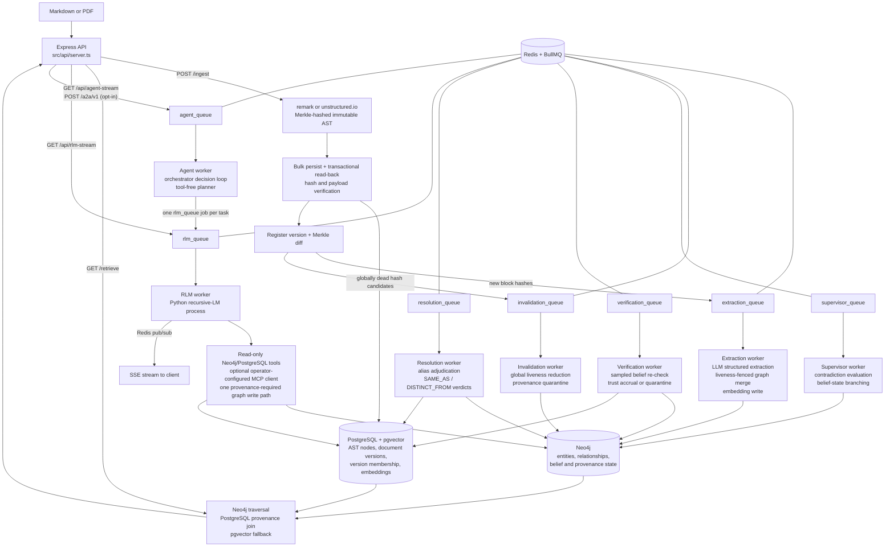

# Trellis Engine — Technical Roadmap

*Generated from a code-led review of the repository (July 4, 2026). File and line references point at the current state of `master`-derived code in this working tree. §1 (architecture overview) was refreshed July 7, 2026 (Session 13) to match the post-Session-12 code; the living session-to-session mental model remains `HANDOFF.md` §1.*

*Status: Foundations, update/invalidation correctness, belief verification, Session 3 deployment/CI readiness, Session 4 structured logging/metrics (T16), Session 5 entity resolution (3.3 #2), Session 6 benchmark maturity (3.3 #3), Session 7's semantic-provenance scale gate, Session 8 whole-codebase ingestion (3.3 #6, including the measured Entity.name merge index), Session 9's agentic orchestration loop (3.3 #7), Session 10's MCP tool surface for the RLM sub-agent (3.3 #8 first slice), Session 11's A2A server surface over the goal loop (3.3 #8 second slice), and Session 12's remote MCP transports with the containerized tool-server pattern (3.3 #8 third slice, closing the item's recorded scope) are complete and verified. Session 13 (July 7, 2026) was an owner-directed documentation, context-alignment, and architectural-consolidation session: the workspace/modules design record (`docs/architecture/WORKSPACE_AND_MODULES.md`) and canonical glossary (`docs/GLOSSARY.md`) landed, this file's §1 drift was corrected, and the frontend deployment was deferred (unscheduled; scope preserved in §3.3 #5). Session 14 is scoped to the design record's §11 steps 2 + 1 — kernel hardening and the Tier-3 workspace — see §4 and §5. The Session 7 measurements did not justify a storage migration; item 3.3 #4 remains open behind explicit observed thresholds, and Session 8's post-index re-measurement kept the gate closed. Every short- and medium-term roadmap item is closed. See §5 Progress Log for what was fixed, what was found along the way, and what remains open.*

---

## 1. Architecture Overview

Trellis is a provenance-preserving GraphRAG system. Its central design commitment is that every semantic fact must remain traceable to an immutable, content-addressed physical location in the source document. The system is organized as an asynchronous pipeline over a three-tier storage layout.

### 1.1 Components and Data Flow

**Storage tiers:**

| Store | Role | Schema |
|---|---|---|
| PostgreSQL + pgvector | Physical layer: immutable AST nodes keyed by SHA-256 Merkle hash, plus embeddings | `ast_nodes(id, document_id, data JSONB, embedding vector(1536))` |
| Neo4j | Semantic layer: `Entity`, `Question`, `Concept` nodes; `ACTION`, `REFERENCES`, `CONTRADICTS`, `DERIVED_INSIGHT` edges, all carrying `sourceNodeIds` back-references | Uniqueness constraints on `Entity.id`, `Question.id`, `Concept.id` |
| Redis | BullMQ job queues (`extraction_queue`, `rlm_queue`, `supervisor_queue`, `invalidation_queue`, `verification_queue`, `resolution_queue`, `agent_queue`), pub/sub channels for SSE streaming, and TTL-bounded A2A task records (`a2a:task:<id>`) | — |

**The RLM harness** ([src/rlm/trellis_agent.py](src/rlm/trellis_agent.py)) wraps the `rlms` recursive-LM library with three injected tool surfaces: a read-only Neo4j client (transport-enforced `default_access_mode=READ`; the keyword blocklist is a fast-fail courtesy only) and a Postgres AST reader ([src/rlm/trellis_tools.py](src/rlm/trellis_tools.py)), plus — only when the operator configures servers in `TRELLIS_MCP_SERVERS` — an allowlisted, time- and size-bounded MCP client ([src/rlm/trellis_mcp.py](src/rlm/trellis_mcp.py), Sessions 10/12) whose results never satisfy the provenance requirement. The agent's only permitted graph write is `write_derived_insight`/`write_derived_insights`, which caches deduced facts as `DERIVED_INSIGHT` edges with mandatory provenance — the "flywheel" that makes repeat queries cheaper. Since Session 9 the RLM also serves as the reusable single-task sub-agent of the agentic goal loop (`src/core/agent/`, `agent_queue`), whose orchestrator is a tool-free planner that dispatches ordinary `rlm_queue` jobs; since Session 11 external agents can dispatch goals over A2A (`POST /a2a/v1`, opt-in).

**The OOLONG-Pairs benchmark** (`src/benchmarks/`, `scripts/`) is a self-contained evaluation harness: a seeded deterministic dataset generator, a verify-as-you-go ingestion loop, a cache-stripping prep script, and a 20-query runner that scores set-based F1 and measures the cold→warm cost collapse. The committed [benchmark_results.json](benchmark_results.json) shows F1 = 1.0 on all 20 queries with mean sub-calls dropping from 0.36 (cold) to 0 (warm).

**The frontend** (`src/frontend/`) is a Next.js app with a force-directed graph pane and a provenance pane; clicking a graph node highlights the exact AST text blocks that produced it, proxied to the backend via a rewrite rule ([next.config.ts](src/frontend/next.config.ts)).

### 1.2 Design Paradigms

- **Pipeline / queue-driven**: ingestion is a fan-out of independent, retryable jobs (Architecture Invariant 4 in [.agents/AGENT_CODING_GUIDELINES.md](.agents/AGENT_CODING_GUIDELINES.md)).
- **Content addressing**: node identity is `SHA-256(type:content:metadata:childHashes)`; block hashes are context-free, which the ingestion loop exploits for independent re-derivation checks.
- **Verification-as-a-loop**: the OOLONG ingester ([scripts/ingest_oolong_dataset.ts](scripts/ingest_oolong_dataset.ts)) writes a batch, reads it back, re-derives every hash through the parser, and refuses to advance past a failing batch.
- **Boundary validation**: dataset files pass through Zod schemas ([src/benchmarks/oolong/schema.ts](src/benchmarks/oolong/schema.ts)) before touching the pipeline.

---

## 2. Current State and Code Quality

### 2.1 Strengths

- **Provenance threading is consistent.** `sourceNodeIds` is carried through extraction ([extraction_worker.ts:59-76](src/workers/extraction_worker.ts:59)), ingestion verification ([ingest_oolong_dataset.ts:216-224](scripts/ingest_oolong_dataset.ts:216)), the RLM write path ([trellis_tools.py:60-62](src/rlm/trellis_tools.py:60), which rejects writes without provenance), and the retrieval join. This is the project's core differentiator and it is enforced, not just documented.
- **The ingestion verification loop is well-structured.** [ingest_oolong_dataset.ts](scripts/ingest_oolong_dataset.ts) separates write, hash-integrity read-back, semantic write, and constraint verification into named phases with a shared retry helper ([retry.ts](src/benchmarks/oolong/retry.ts)) and clear failure semantics.
- **The benchmark runner is defensively written.** [oolong_runner.ts:76-84](src/benchmarks/oolong_runner.ts:76) canonicalizes predicted tuples by category so tuple-ordering mistakes don't mask correct answers; protocol violations (zero tool calls) trigger bounded re-dispatch; per-query logs are persisted.
- **The RLM sandbox has layered guards**: a mutation-keyword blocklist, a single whitelisted write path, tool-call counting for provenance enforcement, and exceptions that propagate real tracebacks back into the REPL loop for self-correction.
- **Documentation is unusually thorough** for a project at this stage: architecture, math foundations, runbook, benchmark spec, and self-critique (`docs/benchmarks/CRITIQUE_AND_FUTURE.md`) all exist. Newer code (benchmarks, RLM harness) carries purposeful comments explaining invariants rather than restating syntax.

### 2.2 Technical Debt and Concerns

Ordered roughly by severity.

**T1 — No test suite.** *Resolved (July 4, 2026) — see §5.* `package.json:10` was the npm default stub (`echo "Error: no test specified" && exit 1`). There is no unit test framework anywhere in the repo. The scripts under `scripts/` (`test_e2e_rlm.ts`, `run_adversarial_tests.ts`, etc.) are manual end-to-end probes that require live Docker infrastructure and an OpenAI key — they are not automated, not assertion-based, and not CI-runnable. Several modules are pure functions that could be tested today with zero infrastructure: [parser.ts](src/core/ast/parser.ts), [corpus.ts](src/benchmarks/oolong/corpus.ts), and the parse/score functions in [oolong_runner.ts:76-94](src/benchmarks/oolong_runner.ts:76) and [rlm_client.ts:32-58](src/benchmarks/oolong/rlm_client.ts:32).

**T2 — Extraction granularity is wrong for markdown ingestion.** *Resolved (July 4, 2026) — see §5.* [server.ts:78](src/api/server.ts:78) selected "leaf nodes" as any node with string content. In a remark AST, leaves are inline tokens (`text`, `inlineCode`, …), not blocks — so `Globex **acquired** Initech` fans out as three separate extraction jobs (`"Globex "`, `"acquired"`, `" Initech"`), none of which contains the full relationship. Extraction should operate at block level (paragraph/heading) with concatenated child text, as [corpus.ts:27-30](src/benchmarks/oolong/corpus.ts:27) already does via `nodeText()`. This directly degrades graph quality for any formatted document.

**T3 — Runtime dependency misclassification.** *Resolved (July 4, 2026) — see §5.* `ioredis` was in `devDependencies` ([package.json:41](package.json:41)) but is imported at runtime by [server.ts:183](src/api/server.ts:183), [queue.ts:2](src/workers/queue.ts:2), and [rlm_worker.ts:5](src/workers/rlm_worker.ts:5). A production install with `--omit=dev` will not start. Conversely, `@types/*`, `typescript`, and `tsx` sit in `dependencies`.

**T4 — The repo violates its own configuration invariant.** *Resolved (July 4, 2026) — see §5.* [.agents/AGENT_CODING_GUIDELINES.md:13](.agents/AGENT_CODING_GUIDELINES.md) mandates a schema-validated config object exported from `src/config/index.ts`; that file did not exist. Instead, connection details and passwords are hardcoded: Postgres and Neo4j credentials in [db.ts:5-17](src/config/db.ts:5), Redis host/port in [queue.ts:4-8](src/workers/queue.ts:4) and duplicated in [server.ts:201-204](src/api/server.ts:201) and [rlm_worker.ts:7-10](src/workers/rlm_worker.ts:7). The Python tools ([trellis_tools.py:22-26](src/rlm/trellis_tools.py:22)) do read env vars, so the two halves of the system configure differently.

**T5 — Machine-specific path hardcoded in the RLM worker.** *Resolved (July 4, 2026) — see §5.* [rlm_worker.ts:25](src/workers/rlm_worker.ts:25) set `PYTHONPATH` to `C:\Users\Darian\AppData\Roaming\Python\Python313\site-packages`. The RLM pipeline cannot run on any other machine without editing source. The bare `python` executable name is also platform-dependent.

**T6 — No authentication, rate limiting, or concurrency control on the API.** *Resolved (July 4, 2026) — see §5.* All three endpoints are unauthenticated. `/api/rlm-stream` is the sharpest edge: each GET spawns a Python process that makes paid LLM calls and holds database connections ([server.ts:186-239](src/api/server.ts:186)). An unauthenticated caller can generate unbounded cost and process load. There is also no cap on concurrent RLM jobs beyond BullMQ's default worker concurrency.

**T7 — The Cypher read-only guard is a keyword blocklist, and APOC is enabled.** *Resolved (July 4, 2026) — see §5.* [trellis_tools.py:34-41](src/rlm/trellis_tools.py:34) blocks `CREATE/MERGE/SET/...` by word-boundary regex, but [docker-compose.yml:26](docker-compose.yml:26) installs the APOC plugin — `CALL apoc.create.node(...)` and similar procedures mutate the graph without using any blocked keyword. The blocklist also false-positives on legitimate queries that contain the words in string literals. The robust fix is transport-level: open sessions with `default_access_mode=READ` (and/or a read-only Neo4j user), keeping the blocklist only as a fast-fail courtesy check.

**T8 — LLM outputs are parsed without runtime validation, violating Guideline 2.** *Resolved (July 4, 2026) — see §5.* [extraction_worker.ts:30](src/workers/extraction_worker.ts:30) and [supervisor_worker.ts:76](src/workers/supervisor_worker.ts:76) call `JSON.parse(rawContent)` on the completion payload without `GraphSchema.parse()` / `safeParse()`. `zodResponseFormat` constrains the request, but nothing verifies the response, and the repo's own guidelines forbid exactly this pattern.

**T9 — Silent data loss in extraction ID resolution.** *Resolved (July 4, 2026) — see §5.* In [extraction_worker.ts:43-51](src/workers/extraction_worker.ts:43), if the LLM emits an action whose `subjectId`/`objectId` doesn't match any returned entity, the code falls back to the raw ID; the subsequent Cypher `MATCH` on the name then finds nothing and the action is dropped with no log line. Failed resolutions should at minimum be counted and logged.

**T10 — Supervisor worker defects.** *Resolved (July 4, 2026) — see §5; the detection-cost heuristic (fourth bullet) remains open by design.*
- The `Conflict` node created at [supervisor_worker.ts:89](src/workers/supervisor_worker.ts:89) is never connected to anything — it floats as an orphan carrying the reasoning text, unreachable from the entities it explains.
- [supervisor_worker.ts:50,54](src/workers/supervisor_worker.ts:50) join text fragments with the two-character literal `"\\n"` instead of a newline.
- The anomaly query ([supervisor_worker.ts:25](src/workers/supervisor_worker.ts:25)) uses `id()`, deprecated in Neo4j 5 (the resolution query already uses `elementId()`).
- Detection treats *any* same-verb fan-out as a candidate contradiction ("acquired X" and "acquired Y" is normal), relying on the LLM to filter — workable, but every false candidate costs a paid completion.
- The supervisor is also not wired into `start_all.ts` and only runs via the manual trigger script.

**T11 — Per-row inserts and per-job enqueues in the hot ingestion path.** *Resolved (July 4, 2026) — see §5.* [server.ts:62-68](src/api/server.ts:62) inserted AST nodes one query at a time inside a transaction, and [server.ts:79-84](src/api/server.ts:79) enqueued extraction jobs one `await` at a time. For large documents this was a straightforward N-round-trip bottleneck. The production path now uses one multi-row `INSERT ... UNNEST` and one `queue.addBulk()` call. The benchmark ingester retains its small, verification-oriented batches.

**T12 — Document membership is not modeled.** *Resolved prior to this review's publication (Phase 4 versioned-ingest work) — see §5.* `ast_nodes.document_id` is set once and `ON CONFLICT (id) DO NOTHING` ([server.ts:63-67](src/api/server.ts:63)) means a node shared by two documents (identical content) keeps whichever document ingested it first. Content addressing makes node reuse across documents *expected*, so membership needs a join table (`document_nodes(document_id, node_id)`) rather than a column.

**T13 — Hash preimage lacks canonical encoding.** *Open by design for now; current behavior is pinned by unit tests — see §5.* [parser.ts:20-31](src/core/ast/parser.ts:20) builds the hash input by joining `type`, `content`, `JSON.stringify(metadata)`, and concatenated child hashes with `:` delimiters. Because none of the segments are length-prefixed, distinct `(type, content, metadata)` combinations can in principle produce identical preimages. Practical risk is low (types come from a fixed vocabulary), but a Merkle-integrity system should use an unambiguous encoding (length-prefixed segments or canonical JSON of the full tuple). Also, `if (content)` treats empty-string content as absent — a falsy check where an `!== undefined` check is meant.

**T14 — No embedding/queue hygiene.** *Resolved (July 4, 2026) — see §5.*
- ~~No pgvector index; vector fallback is a sequential scan.~~ A partial cosine HNSW index is now created idempotently with the schema.
- ~~Queues lack retry and retention policy.~~ Background queues use bounded exponential retries, permanent OpenAI 4xx failures stop immediately, and completed/failed history is bounded by age and count. The interactive RLM queue retains the history bounds but deliberately has no automatic retries.
- ~~Uploaded PDF files land in `uploads/` via multer ([server.ts:12](src/api/server.ts:12)) with no size/type limit and are never deleted.~~ *Resolved with T6 (July 4, 2026): PDF-only, size-capped, deleted after parsing.*
- ~~No graceful shutdown.~~ SIGINT/SIGTERM now stop API admission, close workers, publishers and queues, then drain PostgreSQL/Neo4j clients in phase order.

**T15 — Duplicated helpers and drift between pipelines.** *Resolved (July 5, 2026) — see §5.* The traversal-helper duplication was resolved with T2. Vector similarity ordering now lives in the PostgreSQL `search_ast_nodes` function consumed by both [server.ts](src/api/server.ts) and [trellis_tools.py](src/rlm/trellis_tools.py). Production `/ingest` now performs its own transactional write → read-back → parser re-derivation check before version registration commits. The OOLONG ingester retains its benchmark-specific semantic constraint verification.

**T16 — Observability is `console.log`.** *Resolved (July 6, 2026) — see §5.* Operational code now logs one JSON object per line through a pino-backed observability module with a validated `LOG_LEVEL`, stable correlation fields (service/worker/queue/jobId/attempt/requestId/docKey/version/astNodeId), and preserved event names. Prometheus metrics are exposed per process: the API serves authenticated `GET /metrics`; the worker container serves an internal listener with queue-depth gauges, job outcomes, pipeline transition counters, LLM token spend, and RLM telemetry parsed from the `TRELLIS_TELEMETRY:` line.

**T17 — Minor documentation drift.** *Resolved (July 4, 2026) — see §5.* [README.md:6](README.md:6) now limits the bounding-box claim to PDF nodes whose parser output supplies coordinates; markdown nodes are explicitly documented as geometry-free. The extraction model had already been consolidated into validated configuration.

**T18 — No reproducible backend deployment or CI.** *Resolved (July 5, 2026) — see §5.* The repository now has a compiled production build, non-root Node/Python image, pinned Python manifests, schema-gated API/worker Compose topology with health checks and project-scoped resources, a tested `.env` load path, GitHub Actions, and a deterministic zero-LLM ingest/provenance/retrieve round trip.

---

## 3. Roadmap

### 3.1 Short-Term (immediate fixes, low-hanging fruit)

1. ~~**Fix dependency classification** (T3)~~ — **done** (July 4, 2026): `ioredis` moved to `dependencies`; `@types/*`, `typescript`, `tsx` moved to `devDependencies`.
2. ~~**Remove the hardcoded PYTHONPATH** (T5)~~ — **done** (July 4, 2026): interpreter comes from `PYTHON_EXECUTABLE` (platform-aware default), `PYTHONPATH` is an optional passthrough, and a missing `rlms` package produces an actionable error.
3. ~~**Create `src/config/index.ts`** (T4)~~ — **done** (July 4, 2026): Zod-validated config read once from env, consumed by `db.ts`, `queue.ts`, `server.ts`, and the workers; Neo4j/Postgres settings are forwarded to the spawned Python process. Also collapsed the model-string duplication (part of T17).
4. ~~**Validate LLM responses** (T8)~~ — **done** (July 4, 2026): every worker-consumed completion crosses `parseLlmResponse` in the new `src/core/llm/boundary.ts` (empty / JSON / schema failure stages); structural failures throw into the BullMQ retry flow, now enabled by bounded queue-level retry defaults.
5. ~~**Fix the supervisor bugs** (T10)~~ — **done** (July 4, 2026): the `Conflict` node is linked to the subject and both branch objects with provenance on every created node/edge, text fragments join with real newlines, detection orders by `elementId()`, and the supervisor worker starts with `start_all.ts`. Cypher and pure helpers live in `src/core/graph/conflict_resolution.ts`.
6. ~~**Log dropped actions in the extraction worker** (T9)~~ — **done** (July 4, 2026): unresolved endpoints are logged at resolution time (`src/core/graph/resolve_actions.ts`) and the merge Cypher returns the merged action ids so Cypher-level drops are detected and logged post-merge.
7. ~~**Stand up a unit test harness** (T1)~~ — **done** (July 4, 2026): vitest wired into `npm test`; 45 tests over parser hashing determinism (including the T13 empty-content and delimiter edge cases, pinned as current behavior), `buildCorpus` round trips, `parsePredictedPairs`/`scoreF1`/`estimateCost`, and the SSE extractors in `rlm_client.ts`. No infrastructure required.
8. ~~**Correct the README bounding-box claim** (T17)~~ — **done** (July 4, 2026): README now distinguishes PDF geometry from geometry-free markdown nodes.

### 3.2 Medium-Term (correctness, performance, robustness)

1. ~~**Fix extraction granularity** (T2)~~ — **done** (July 4, 2026): `/ingest` fans out block-level nodes (paragraph, heading, list item, code, PDF element) with reconstructed inline text via the new `src/core/ast/traverse.ts`, which also consolidates the duplicated `flattenAST`/`nodeText` (the traversal-helper half of T15). See §5.
2. ~~**Harden the RLM sandbox** (T7)~~ — **done** (July 4, 2026): `run_cypher` sessions open with `default_access_mode=READ` (server-enforced; blocklist retained as fast-fail courtesy), `write_derived_insight` uses an explicit WRITE session, APOC dropped from the compose file. Verified live by `npm run test:rlm-sandbox`.
3. ~~**Add API protection** (T6)~~ — **done** (July 4, 2026): API-key middleware (header / Bearer / query param), concurrency cap + queue-depth limit on `/api/rlm-stream` (429), body and upload size limits (413), PDF-only uploads with post-parse cleanup. Verified live by `npm run test:api-hardening`.
4. ~~**Queue hygiene** (T14)~~ — **done** (July 4, 2026): bounded retry/retention defaults, typed permanent-vs-transient OpenAI error classification, phase-ordered SIGINT/SIGTERM shutdown, and a cosine HNSW index.
5. ~~**Model document membership properly** (T12)~~ — **done prior to this roadmap review**: version membership is represented by `documents` and `document_nodes`; see §5 Phase 1 findings.
6. ~~**Batch the ingestion hot path** (T11)~~ — **done** (July 4, 2026): `/ingest` uses a single `UNNEST` insert for AST nodes and `addBulk` for extraction fan-out.
7. ~~**Promote the verified-ingestion loop from the benchmark script into the main pipeline** (T15)~~ — **done** (July 5, 2026): `/ingest` reads every bulk-written AST row back inside the same PostgreSQL transaction, re-derives its hash through `parser.ts`, compares the complete JSON payload, and rolls the version back on any mismatch.
8. ~~**Integration tests against Docker infrastructure**~~ — **done** (July 5, 2026): isolated Compose CI runs real schema initialization, a zero-extraction-block ingest, PostgreSQL document/root membership checks, a directly seeded provenance-bearing Neo4j relationship, and `/retrieve`, with no workers or OpenAI key.
9. ~~**Structured logging and basic metrics** (T16)~~ — **done** (July 6, 2026): pino JSON logging with request/job correlation fields, split API/worker Prometheus registries, counters for job outcomes, dropped/unresolved actions, invalidation and verification transitions, LLM/RLM token spend, and scrape-time queue-depth gauges. See §5.

### 3.3 Long-Term (strategic direction)

1. ~~**The document-update story.**~~ **Done (Phase 4, hardened July 5, 2026):** versioned ingestion computes a Merkle set diff, extracts only new block hashes, reduces document-local orphan candidates against global latest-version membership, and quarantines rather than deletes semantic facts whose provenance died. Cross-store extraction races are fenced and compensated. The Update Drill measured selective reprocessing, invalidation recall/precision, and recovery; see the Phase 4 PRD and §5.
2. ~~**Entity resolution beyond exact-name identity.**~~ **Done (Session 5, July 6, 2026):** entity identity stays `SHA-256(lowercased name)` and the extraction merge is untouched; equivalence is an overlay belief. Deterministic lexical candidate generation ([alias_candidates.ts](src/core/graph/alias_candidates.ts): token containment, acronym, near-identity edit distance; same-kind `generic`/`concept` pairs only — `question`/`category_label` are excluded so flywheel exact-id lookups are unaffected) plus batched LLM adjudication behind the Zod boundary ([alias_resolution.ts](src/core/graph/alias_resolution.ts), `resolution_queue`, `scripts/resolve_sweep.ts`) records `SAME_AS`/`DISTINCT_FROM` verdict edges with union provenance. The verdicts inherit the existing quarantine machinery, and `GET /retrieve` expands one non-contested `SAME_AS` hop at `RESOLUTION_MIN_CONFIDENCE` with per-fact alias attribution (`?resolveAliases=false` opts out). Embedding-similarity candidate generation remains a documented follow-up (entity names carry no embeddings today). See §5.
3. ~~**Benchmark maturity.**~~ **Done (Session 6, July 6, 2026):** dataset v2 (`oolong-pairs-trec-synthetic-v2`, [data/oolong_pairs_dataset_hard.json](data/oolong_pairs_dataset_hard.json), seeded pure generator [generate_v2.ts](src/benchmarks/oolong/generate_v2.ts)) breaks the substring-scan shortcut with paraphrased city mentions (canonical token never in the text — pinned by unit test), near-miss questions name-dropping unannotated cities, and non-question prose distractors ingested as `:Passage` nodes that can never pair. The harness CLIs take `--dataset` (default v1), the runner derives its sequence from the dataset and writes non-v1 results to a separate file, and cache-audit accuracy became a first-class metric shared by the audit CLI, the runner's results block, and the poison drill ([cache_audit.ts](src/benchmarks/oolong/cache_audit.ts)). v1, its committed results, and the drills are untouched. Real TREC import (needs paid annotation), adversarial soft-label corpora, embedding-based retrieval difficulty, and 10k+ scale sweeps remain future work; a paid v2 benchmark run awaits owner approval. See §5.
4. **Scalability of the semantic layer.** Entity `sourceNodeIds` arrays remain unbounded under the append-only `ON MATCH` pattern, but Session 7 measured the real headroom before changing storage. A deterministic 300-document × 20-block drill produced 6,096 semantic nodes and 6,000 relationships: the largest node array was 286, every relationship array remained at 1, and fixed-50-hash median sweep latency grew only 1.42x while semantic facts grew 5.77x. The migration gate therefore stayed closed. Keep arrays until an observed run reaches 1,000 live hashes on one fact or fixed-orphan-set median sweep latency grows more than 1.5 times semantic-fact growth; then migrate node scan anchors to `(:ASTRef {hash})` / `[:EVIDENCED_BY]`, retaining relationship arrays unless their own measurements change. See [the scale report](docs/benchmarks/SCALE_PROVENANCE_REPORT.md) and §5. HNSW and block-level embedding granularity already shipped under T14/T2.
5. ~~**Deployment and community readiness.**~~ **Backend deployment/CI done (July 5, 2026); license done (July 6, 2026):** the backend has a compiled non-root Node/Python image, health-gated project-scoped Compose topology, pinned runtime manifests, documented environment/startup contracts, isolated zero-LLM CI, and an MIT license selected by OpenCnid. The frontend remains intentionally excluded from backend containerization, and its Next.js convention note remains in [src/frontend/AGENTS.md](src/frontend/AGENTS.md). **Frontend deferral recorded (July 7, 2026):** the frontend residue (production build + non-root container, a server-side allowlisted proxy that injects the API key without ever handing it to the browser, CI coverage, and the Compose proof) was briefly renumbered to Session 14 during the Session 13 realignment, then deferred by owner direction the same day — **unscheduled, scope preserved exactly as stated here**; it re-enters §4 sequencing when the owner schedules it.

6. ~~**Whole-codebase ingestion.**~~ **Done (Session 8, July 6, 2026):** one repository snapshot is a bounded sequence of per-file verified ingests (`repo:<key>:<path>` doc keys) through the extracted `src/core/ingestion/` service, with code-aware TypeScript/JavaScript/Python parsing, durable PostgreSQL snapshot membership, tombstone-based deletion/rename semantics that quarantine through the existing invalidation sweep, and a zero-paid-work default (`--extract none`; `changed` requires an explicit budget plus confirmation). The measured `Entity.name` merge index shipped alongside (recorded separately from the still-open 3.3 #4 gate). See §5 and `docs/benchmarks/REPOSITORY_INGESTION_REPORT.md`. The original decision record follows. Decision recorded July 4, 2026: this is a pipeline feature, **not** a relaxation of the T6 per-request limits. The natural unit is one document per source file (`doc_key` = repo-relative path), so per-file Merkle diffs drive incremental re-extraction commit-to-commit — exactly what the physical layer was built for — fed by a batch client/CLI rather than one giant request. A single-blob upload of a repo would defeat per-file identity, diff granularity, and the streaming-free `express.text`/single-transaction ingest (the whole body is buffered in memory and inserted row-by-row). Individual source files fit comfortably inside the 5 MB default (generated artifacts that don't should be excluded, or the env knob raised). Prerequisites before this feature: T11 batching (multi-row inserts + `addBulk` for thousands-of-files fan-out), the rest of T14 (queue hygiene at that job volume), a code-aware parser path (tree-sitter or similar — extraction blocks should be functions/classes, not markdown paragraphs), and extraction cost controls (tiered/selective extraction; one LLM call per block across a 50k-file repo is cost-prohibitive). If a convenience archive-upload endpoint is added, the upload allowlist expands to zip/tar with decompressed-size and entry-count guards (zip bombs) — independent of the per-request caps, which stay small on purpose (each request's body is held fully in memory).

7. ~~**Agentic orchestration loop (owner-directed, July 6, 2026).**~~ **Done (Session 9, July 7, 2026):** `GET /api/agent-stream` accepts one goal; the `agent_queue` worker runs an orchestrator (same LLM, planner system prompt, plain structured chat completions through the T8 boundary — never an rlms REPL) whose Zod-validated decisions dispatch single-task RLM runs as ordinary `rlm_queue` jobs, observe their new `TRELLIS_RESULT` envelopes, and iterate until finish/fail or a hard bound trips (`AGENT_MAX_ITERATIONS_PER_GOAL`/`AGENT_MAX_TASKS_PER_GOAL`/`AGENT_MAX_CONCURRENT_TASKS`/`AGENT_TASK_MAX_ITERATIONS`, all single-digit-capped). Task failures and protocol violations are observations for the next decision; every other exit is a typed streamed failure. The orchestrator never writes to the graph; acceptance was zero-LLM (oracle decisions + stubbed tasks over the real queues, pub/sub, and API — `npm run test:agent-loop`). See §5. The original direction follows. Trellis must be able to work agentically: an external loop that accepts a goal, decomposes it into tasks, and mediates execution until the goal completes or a bound is hit. The loop is driven by the same LLM under a different (orchestrator) system prompt — plain structured chat completions crossing the T8 `parseLlmResponse` boundary, never a second REPL (the rlms `custom_system_prompt` replaces the REPL protocol prompt, so the orchestrator persona must not be routed through rlms). The RLM becomes a reusable single-task sub-agent: one `rlm_queue` job per task, one process per run exactly as today, so a goal can dispatch many RLM runs and aggregate their `FINAL_ANSWER:` results and `TRELLIS_TELEMETRY:` spend. Hard per-goal bounds on orchestrator iterations, dispatched tasks, and tokens; all LLM calls stay inside workers; the orchestrator itself never writes to the graph — `write_derived_insight` remains the single agent write path. Zero-LLM acceptance via a deterministic oracle planner plus stubbed task execution over the real queue/stream plumbing. Scheduled as Session 9; see §4 and `HANDOFF.md`.

8. **External tool integration for the RLM sub-agent (owner-directed, July 7, 2026).** **First slice — the MCP client surface — done (Session 10, July 7, 2026):** the RLM gains an operator-configured stdio MCP client (`TRELLIS_MCP_SERVERS` → `src/rlm/trellis_mcp.py`, injected as `trellis_mcp` via `custom_tools`), with allowlist-before-I/O enforcement, per-call timeouts, size-capped results, a separate `mcp_calls` telemetry counter that never satisfies the database-provenance requirement, and zero-paid acceptance against a local deterministic fixture server (`npm run test:rlm-mcp`). See §5. **Second slice — the A2A server surface — done (Session 11, July 7, 2026):** Trellis serves the Agent2Agent protocol (spec v1.0.0, JSON-RPC binding) over the existing goal loop — `TRELLIS_A2A_ENABLED` (default off, byte-identical API when unset) mounts the well-known Agent Card and one JSON-RPC endpoint whose `SendMessage`/`SendStreamingMessage`/`GetTask`/`CancelTask` dispatch goals through the same admission gates and per-goal bounds as `/api/agent-stream`, with TTL-bounded Redis task records and zero-paid acceptance (`npm run test:a2a`). See §5. **Third slice — remote MCP transports and the containerized tool-server pattern — done (Session 12, July 7, 2026):** the registry became a union discriminated on `transport` (`stdio` stays the default; pre-Session-12 values parse unchanged) with an `http` variant carrying a Streamable HTTP URL (spec 2025-06-18; https required for public hosts, plain http only for loopback/RFC1918/dot-free private hosts) and an operator-owned auth story — `auth.valueEnv` NAMES a credential env var, the worker resolves it fail-fast at startup and forwards exactly the named variables, and every raised tool error is scrubbed of credential values before it reaches the model-visible REPL. Same allowlist/timeout/size-cap machinery over both transports; a containerized tool server (own Compose service, project network, no host port, bearer auth) is the demonstrated deployment shape; zero-paid acceptance grew to 86 fixture checks plus the containerized-fixture Compose assertion. **The recorded 3.3 #8 scope is now exhausted** — the shipped surface covers MCP client (stdio + Streamable HTTP + auth + containerized servers) and the A2A server; anything further (new tools, OAuth flows for MCP, Trellis as an A2A client or MCP server) is a new owner direction, not a recorded remainder. See §5. The original direction follows. With the agentic loop in place (3.3 #7), the sub-agent's world is still exactly two injected database tools — it can decompose goals but every task bottoms out in graph/AST lookups. The owner directed that Trellis now gain external tools, **MCP (Model Context Protocol) first**, with web search as the first concrete tool and A2A (agent-to-agent) interoperability as a follow-on direction across future sessions. The extension point already exists: `trellis_agent.py` injects tools via rlms `custom_tools`, and `trellis_tools.py` shows the wrapper discipline (JSON-string returns, tool-call counting, exceptions that surface real tracebacks into the REPL). Hard invariants: MCP servers and their tool allowlists come from operator-validated configuration only — never from job payloads and never chosen freely by the model; MCP calls do NOT satisfy the database-provenance requirement (`TRELLIS_PROTOCOL_VIOLATION` stays keyed to database tool calls) and MCP output can never be passed as `sourceNodeIds` — external content earns citability only by round-tripping through the verified ingest path to become content-addressed AST bytes; responses are size-capped and time-bounded; acceptance is zero-paid against a local deterministic fixture MCP server. Scheduled as Session 10; see §4 and `HANDOFF.md`.

---

## 4. Suggested Sequencing

| Order | Item | Rationale |
|---|---|---|
| ~~1~~ | ~~Structured logging and basic metrics (3.2 #9 / T16)~~ | **Done (July 6, 2026)** — split-process logs/metrics shipped; see §5 |
| ~~2~~ | ~~Entity resolution beyond exact-name identity (3.3 #2)~~ | **Done (Session 5, July 6, 2026)** — SAME_AS overlay beliefs with quarantine inheritance; see §5 |
| ~~3~~ | ~~Benchmark maturity (3.3 #3)~~ | **Done (Session 6, July 6, 2026)** — anti-shortcut dataset v2 + first-class cache-audit metric; see §5 |
| ~~4~~ | ~~Semantic provenance scale gate (3.3 #4 measurement)~~ | **Measured (Session 7, July 6, 2026)** — migration not justified at 300 documents; explicit 1,000-source/superlinear triggers recorded; see §5 |
| ~~5~~ | ~~Whole-codebase ingestion (3.3 #6)~~ | **Done (Session 8, July 6, 2026)** — code-aware per-file snapshots with tombstone deletion, zero-paid-work default, and the measured Entity.name merge index; see §5 |
| ~~6~~ | ~~Agentic orchestration loop (3.3 #7)~~ | **Done (Session 9, July 7, 2026)** — goal loop over the RLM as a reusable single-task sub-agent, zero-LLM acceptance; see §5 |
| ~~7~~ | ~~MCP tool integration for the RLM (3.3 #8, first slice)~~ | **Done (Session 10, July 7, 2026)** — operator-configured stdio MCP client for the sub-agent with fixture-server zero-paid acceptance; see §5 |
| ~~8~~ | ~~A2A server surface (3.3 #8, second slice)~~ | **Done (Session 11, July 7, 2026)** — Trellis serves A2A v1.0 over the goal loop behind the existing gates and bounds, zero-paid acceptance; see §5 |
| ~~9~~ | ~~MCP tool-surface expansion (3.3 #8 continuation)~~ | **Done (Session 12, July 7, 2026)** — remote Streamable HTTP transports with env-referenced credentials, redaction, and the containerized tool-server pattern; the recorded 3.3 #8 scope is exhausted; see §5 |
| ~~10~~ | ~~Kernel hardening and the Tier-3 workspace (design record §11, steps 2 + 1)~~ | **Done (Session 14, July 7, 2026)** — `sourceNodeIds` format + `ast_nodes` existence enforcement at the single write path, then the harness-captured in-REPL workspace (origin-stamped uuid segments, stub returns, plan-in-workspace, byte-identical gating); see §5 |
| ~~11~~ | ~~Module registry + module #0 (design record §11 step 3)~~ | **Done (Session 15, July 7, 2026)** — owner directed the step 3 → step 4 order on July 7, 2026 (PR #40 discussion); protocol-module registry, operator-owned `TRELLIS_MODULES` selection, spatial-flywheel extraction behind a byte-identical composed-prompt pin; the §9.4 graph representation is explicitly deferred to the first research-bearing module; the owner-approved paired-run workspace probe was also measured this session; see §5 |
| ~~12~~ | ~~Workspace lineage (design record §11 step 4)~~ | **Done (Session 16, July 7, 2026)** — serialize/park/seed across a goal's tasks: end-of-run snapshots parked goal-scoped in Redis (TTL + per-goal byte cap), the orchestrator routes by reference (`workspaceRef` observations, `seedFromTasks` dispatches, prior iterations only), seeded runs restored at spawn with stamps preserved and bounds re-enforced; oracle drills extended to seeded runs; see §5 |
| ~~13~~ | ~~Promotion path (design record §11 step 5)~~ | **Done (Session 17, July 7, 2026)** — operator-gated segment→ingest through the unmodified verified transaction: `npm run promote` (list/promote, zero-paid default), typed planner refusals (truncated/empty/unknown/bad-key), the origin audit stamp on the documents row, and the earned-citability loop drilled end to end (`test:promotion` 41); see §5 |
| ~~14~~ | ~~First flywheel turn (design record §11 step 6)~~ | **Machinery done (Session 18, July 8, 2026)** — research existence gate at registration, the §9.4 manifest-as-graph-entity representation (`modules:register`/`modules:verify`, unchanged sweep contests research-superseded modules), and the human recovery loop, drilled end to end (`test:module-lifecycle`); the module #1 PAID authoring turn RAN, owner-approved, July 9, 2026 (module `workspace-discipline`; see §5) and surfaced the laundering finding that produced row 1 below |
| 1 | Grounded authoring (`docs/architecture/GROUNDED_AUTHORING.md` Phases 1–2) | **Owner-directed queue jump (July 9, 2026)** — the module #1 turn demonstrated live provenance laundering in the authoring pathway (real-but-unrelated hashes self-cited; the existence gate is structurally blind to it; caught only at the operator gate). The remediation — kernel `--mode author` scoped to the promoted corpus, harness-pinned citations, fixed template, anchor derivation gate — must land before any further paid authoring turn; Phase 0 procedure covers the gap meanwhile |
| 2 | Repository-scale extraction prerequisites | Scanner test/fixture exclusion plus a code-tuned extraction prompt with generic-identifier suppression, per the recorded pilot findings (moved from row 1 by the July 9 owner direction — moved, not dropped) |
| 3 | Conditional provenance storage migration (3.3 #4) | Blocked behind the recorded trigger (an observed 1,000-source fact or superlinear sweep growth); do not migrate arrays on extrapolation alone |
| — | Frontend deployment and community readiness remainder (3.3 #5 residue) | **Deferred, unscheduled** (owner direction, July 7, 2026 — third deferral); scope preserved in §3.3 #5 and re-enters this table when the owner schedules it |

---

## 5. Progress Log

### July 4, 2026 — Phase 1: Foundations & Portability (items 3.1 #1–3, #7)

Completed as three commits, each verified before the next was started (module smoke-loads, ad-hoc `tsc --noEmit` typecheck, and the unit suite).

1. **T3 resolved** — `fix: classify runtime and dev dependencies correctly`. `ioredis` is a runtime dependency; `@types/*`, `typescript`, and `tsx` are dev-only. A `--omit=dev` production install can now start.
2. **T4 + T5 resolved** — `feat: unified Zod-validated configuration module`. `src/config/index.ts` reads and validates the environment exactly once; invalid values fail fast with a readable error. Defaults match the docker-compose development stack, so a bare local run needs no `.env`. All hardcoded Postgres/Neo4j/Redis values, the API port, the extraction-model string, and the Python interpreter selection now flow from this module. `rlm_worker.ts` forwards `NEO4J_URI`/`NEO4J_USER`/`NEO4J_PASSWORD`/`PG_DSN` to the spawned agent so the TypeScript and Python halves configure from one source. Spawn failures and a missing `rlms` package produce actionable error messages.
3. **T1 resolved** — `test: add vitest unit-test harness for the pure modules`. `npm test` runs 45 assertions across `parser.ts`, `scoring.ts`, `rlm_client.ts`, and `corpus.ts` with no database, Docker, or API key. Failure detection was verified with a deliberate negative-control test.

**Findings recorded during this work:**

- **T12 was already resolved** by the Phase 4 versioned-ingest work before this phase began: `documents` and `document_nodes` tables exist ([init_db.ts](src/config/init_db.ts)), `/ingest` records per-version membership and runs Merkle diffs, and orphaned provenance triggers invalidation sweeps. `ast_nodes.document_id` remains as a non-authoritative column, documented as such in `init_db.ts`.
- **New issue found and fixed: ioredis version split.** `bullmq` pins `ioredis@5.10.1` exactly, while the app declared `^5.11.1`; npm therefore installed two copies whose TypeScript types are nominally incompatible. The app now pins `5.10.1` to match. If bullmq's pin moves, the two declarations must move together.
- **T13 is deliberately left open.** Changing the hash preimage (empty-content falsy check, unprefixed `:` delimiters) invalidates every hash already stored in `ast_nodes`, so the fix requires a re-hash migration story. Until then, the current behavior is pinned by tests in [parser.test.ts](src/core/ast/parser.test.ts) so any accidental change to the preimage fails the suite.

**Still open** (unchanged by this phase): T6 (API authentication/rate limiting), T7 (transport-level read-only Cypher sessions; APOC), T8 (Zod validation of LLM responses), T9 (dropped-action logging), T10 (supervisor defects), T11 (ingestion batching), T14 (queue hygiene, pgvector index, upload cleanup, graceful shutdown), T16 (structured logging/metrics), and the T17 README bounding-box correction.

### July 4, 2026 — Phase 2 start: extraction granularity (item 3.2 #1)

**T2 resolved** — `/ingest` now fans out one extraction job per block-level node instead of per inline leaf. `Globex **acquired** Initech` is a single extraction unit carrying the full sentence, rather than three fragments none of which contains the relationship.

- New module [src/core/ast/traverse.ts](src/core/ast/traverse.ts): `collectExtractionBlocks` stops at the top-most block (paragraph, heading, list item, fenced code) and traverses through containers (root, list, blockquote); childless content nodes (PDF elements from unstructured.io) remain units as-is; content-less structural nodes (thematic breaks) are skipped from extraction while still being hashed and persisted.
- `flattenAST`/`nodeText` are consolidated here (previously duplicated between `server.ts` and `corpus.ts` — the traversal-helper half of T15); `corpus.ts` re-exports them so existing imports are unaffected. The vector-search SQL duplication and the verified-loop divergence noted in T15 remain open.
- Re-ingest behavior is preserved: an inline edit changes its parent block's Merkle hash, so exactly that block lands in `diff.added` and re-extracts; byte-identical re-ingests queue nothing. Both properties are covered by unit tests ([traverse.test.ts](src/core/ast/traverse.test.ts), 14 new assertions; suite total 59).
- The `/ingest` response field `leafNodesQueued` was renamed to `blocksQueued`; `API_REFERENCE.md` is updated. Provenance is unchanged: queued jobs carry the block's AST hash as `astNodeId`, which extraction threads into `sourceNodeIds` as before — block hashes are stored in `ast_nodes` like every other node.

**Follow-up noted for the semantic layer** (pre-existing, now more visible): embeddings are written per extraction unit, so they now land on block nodes rather than inline leaves — this matches the 3.3 #4 suggestion to embed at block granularity.

### July 4, 2026 — Belief-quarantine recovery gap for extraction-produced facts (found by live smoke test, fixed)

**The gap.** [invalidation.ts](src/core/graph/invalidation.ts) promises that a contested fact is excluded from `/retrieve` "until it is re-derived from live bytes" — but for extraction-produced facts, re-derivation never cleared the flag. The extraction worker MERGEs actions on `(subject, verb, object)` and its `ON MATCH` only appended `sourceNodeIds`; the only paths that ever set `contested = false` were the RLM's `write_derived_insight` ([trellis_tools.py](src/rlm/trellis_tools.py)) and benchmark helpers. Reproduced live: editing "acquired Initech in 2024" to "in 2025" and re-ingesting re-extracts the same `(globex corporation)-[ACTION {verb:'acquired'}]->(initech)` edge with fresh block provenance, yet the edge stayed `contested = true` and hidden from `/retrieve` forever — a frozen quarantine with a live source. Entity endpoint nodes had the same defect.

**The fix** converges every writer on one belief-provenance state machine, specified as pure functions in the new [provenance.ts](src/core/graph/provenance.ts) (`applyQuarantineSweep` / `applyRederivation`) and mirrored by the Cypher:

- **Extraction merge recovers** ([extraction_merge.ts](src/core/graph/extraction_merge.ts), extracted from the worker so scripts can drive the identical Cypher): `ON MATCH` clears `contested`, stamps `rederivedAt` when the fact was quarantined, keeps `sourceNodeIds` live-only (known-dead hashes stay filtered out; an incoming hash that was once orphaned is resurrected — document reverts re-create old content hashes), and leaves `contestedAt`/`orphanedSourceIds` behind as audit history. Same semantics as the RLM write path, now for `Entity` nodes and `ACTION` edges too.
- **The sweep is order-independent** ([invalidation.ts](src/core/graph/invalidation.ts)): the extraction workers and the invalidation worker race on separate queues, so `/ingest` now passes the version's queued extraction-block hashes as a **fresh set** alongside the orphan set. A fact already carrying fresh provenance was re-derived from live bytes by a racing extraction job and escapes quarantine; dead hashes still move into `orphanedSourceIds` either way. The two transitions commute — proved exhaustively in [provenance.test.ts](src/core/graph/provenance.test.ts) (14 new vitest assertions; suite total 73) and verified against the live stack in both worker orders by the new `npm run test:belief-recovery` ([test_belief_recovery.ts](scripts/test_belief_recovery.ts), 24 checks incl. quarantine → recovery → revert/resurrection).
- **A liveness gate closes the cross-version race** ([registry.ts](src/core/ast/registry.ts) `isAstNodeLive`, called by the worker before the paid LLM call): a queue-lagged extraction job whose block was superseded by a newer re-ingest is skipped instead of resurrecting facts from dead bytes. Registry-unknown nodes (unversioned ingests) are treated as live. Backed by a new `document_nodes(node_id)` index ([init_db.ts](src/config/init_db.ts)).
- The Update Drill re-ingest ([reingest.ts](src/benchmarks/oolong/reingest.ts)) now passes `diff.added` as the fresh set, so its deterministic semantic refresh gets the same recovery semantics as production extraction; its previously "on purpose" permanently-contested refreshed `REFERENCES` edges now recover. The invalidation-recall/precision audit is unaffected (cached `has_category` insights carry no fresh provenance at sweep time and are quarantined exactly as before). `SweepResult` gained `survivedNodes`/`survivedRelationships` telemetry.

**Preserved semantics:** mixed provenance is still contested conservatively per PHASE_4_PRD.md §5 — a part-dead fact survives only if one of its live sources is *fresh* (just re-derived); a fact supported only by *retained* (unchanged) blocks is still quarantined and recovers lazily on next re-derivation, exactly the PRD's story. `npm run test:invalidation-sweep` (RLM write path + sweep) passes unchanged.

**Known residuals (open):** (1) orphan sets are computed per document, so a source hash shared with another live document is still treated as dead — content-addressed cross-document sharing needs a global liveness notion (pre-existing; the `isAstNodeLive` helper is the building block); (2) a sub-millisecond check-then-write window remains if a re-ingest of the same document lands between the worker's liveness check and its merge and the sweep's Cypher executes first (documented in registry.ts); (3) the RLM write path still filters *incoming* provenance against `orphanedSourceIds`, so an agent citing a resurrected (reverted) hash does not un-orphan it the way extraction does — harmless today, worth unifying when trellis_tools.py is next touched.

### July 4, 2026 — LLM response boundary + dropped-action telemetry (items 3.1 #4, #6 — T8, T9)

**T8 resolved.** Raw completions no longer reach `JSON.parse` directly. The new [src/core/llm/boundary.ts](src/core/llm/boundary.ts) exports `parseLlmResponse(schema, raw, context)`, which distinguishes three failure stages — `empty` (nullable/blank content), `json` (malformed or truncated payload), `schema` (valid JSON that fails Zod) — and throws `LlmResponseError` carrying the stage, caller context, and a bounded raw-payload snippet for diagnosis.

- The extraction worker validates against `GraphSchema` and lets the error propagate: the job fails into BullMQ's retry flow, where a fresh (sampled) completion usually parses.
- The supervisor worker validates each conflict evaluation against `ConflictEvaluationSchema` (moved into [schemas.ts](src/core/graph/schemas.ts) so it is importable without the worker's side effects). An invalid evaluation is logged with context and skipped so one bad completion cannot block the other candidate pairs, but any failure still fails the job at the end — the affected pairs still have `belief_state = NULL`, so the retried scan picks them up. The previous `if (!rawContent) continue` silent skip is gone.
- **Retry flow enabled (minimal T14 slice):** the queues in [queue.ts](src/workers/queue.ts) now carry `defaultJobOptions` (`attempts: 3`, exponential backoff), without which "route to the retry flow" was a no-op — a thrown error was a permanent failure. The `rlm_queue` is deliberately excluded: its jobs stream to an interactive SSE client that re-dispatches at its own layer, and a background re-run would spend LLM budget with no listener. The rest of T14 (`removeOnComplete`/`removeOnAge`, retryable-vs-permanent classification, graceful shutdown) remains open. Retried extraction jobs are safe to re-run: the merge is idempotent and the liveness gate re-checks.

**T9 resolved.** Dropped actions are now detected at both layers where they could vanish:

- **Resolution time:** the ID-resolution logic moved out of the worker into the pure [src/core/graph/resolve_actions.ts](src/core/graph/resolve_actions.ts) (`resolveExtractedGraph`), which reports every action whose `subjectId`/`objectId` matched no extracted entity. The worker emits a structured `extraction.unresolved_action_endpoint` warning per occurrence. Unresolved actions are still submitted (unchanged behavior): the raw id passes through as the endpoint name and can legitimately match a pre-existing entity by name.
- **Merge time (the definitive check):** `ACTION_MERGE_CYPHER` now ends with `RETURN act.id`, and `mergeExtractedGraph` returns the merged ids. The worker diffs submitted vs. merged and emits a structured `extraction.action_dropped` warning for each action the Cypher `MATCH` filtered out. The per-job summary log reports `merged/submitted` counts.

Telemetry is single-line JSON on `console.warn` — greppable and machine-parsable now, and a trivial mechanical swap when structured logging lands (T16).

**Tests:** 21 new unit assertions, no infrastructure required ([boundary.test.ts](src/core/llm/boundary.test.ts): all three failure stages, context propagation, snippet bounding; [resolve_actions.test.ts](src/core/graph/resolve_actions.test.ts): pins the SHA-256-of-lowercased-name entity identity, purity, endpoint-level unresolved reporting). Suite total 94, all passing. `mergeExtractedGraph`'s signature change (`Promise<void>` → `Promise<MergeResult>`) is backward compatible for `scripts/test_belief_recovery.ts`, which ignores the return value.

**Why this over the PR #17 residuals:** T8/T9 were the next unstruck short-term roadmap items, violate the repo's own Guidelines 1–2 on the paid-LLM hot path of every ingestion, and are fully unit-testable offline. Of the residuals, global liveness is a design-level change (global orphan tracking) worth its own phase, the check-then-write race is sub-millisecond with no cheap cross-database fix, and the RLM resurrection alignment is documented as harmless today.

### July 4, 2026 — Supervisor worker fixes (item 3.1 #5 — T10)

The supervisor's Cypher and pure helpers moved into [src/core/graph/conflict_resolution.ts](src/core/graph/conflict_resolution.ts) (same importable-without-side-effects pattern as `extraction_merge.ts`); the worker consumes them.

- **The `Conflict` node is no longer an orphan.** The resolution Cypher now creates `(subj)-[:HAS_CONFLICT]->(c:Conflict)` and `(c)-[:CONFLICT_BRANCH {beliefState, actionElementId}]->(obj1/obj2)`, so the reasoning is reachable from all three entities it explains. Neo4j cannot point an edge at a relationship, so each branch records the `elementId` of the ACTION it explains. The node also gains `detectedAt` and the evaluation's `resolutionType` (previously discarded), and — per the architecture invariant — the `Conflict` node and every created edge carry `sourceNodeIds` (each branch inherits its ACTION's provenance; the node, `HAS_CONFLICT`, and `CONTRADICTS` carry the union of both sides; a pre-existing `CONTRADICTS` keeps its original provenance as audit).
- **Real newlines.** Prompt text fragments fetched from Postgres are joined with `"\n"` via the pure `joinAstTexts`/`astRowText` helpers (fallback order `data.value` → `data.text` → raw JSON preserved and pinned by tests) instead of the two-character literal `"\\n"`.
- **`id()` → `elementId()`** in the anomaly query's candidate ordering, matching the resolution query and Neo4j 5 deprecation.
- **Startup wiring:** `scripts/start_all.ts` imports the supervisor worker, so a full-stack start listens on `supervisor_queue` (jobs are still enqueued via the manual trigger script).

**Still open by design:** detection continues to treat any same-verb fan-out as a candidate contradiction, so every false candidate costs one paid evaluation (T10's cost bullet); the schema-validated evaluation boundary from the T8 work is unchanged.

**Tests:** 10 new unit assertions in [conflict_resolution.test.ts](src/core/graph/conflict_resolution.test.ts) — no deprecated `id()` calls, conflict-node linkage and provenance parameters present in the Cypher, evaluation→params mapping with order-preserving provenance union, and the newline-join regression. Suite total 104, all passing; both queries verified to compile against the live Neo4j 5.11 via `EXPLAIN`.

### July 4, 2026 — Sandbox and API hardening (items 3.2 #2, #3 — T7, T6)

**T7 resolved.** The RLM sandbox's read-only guarantee is now transport-level, not lexical:

- [trellis_tools.py](src/rlm/trellis_tools.py) opens every `run_cypher` session with `default_access_mode=READ`, so the Neo4j server itself rejects any write in that session — including write *procedures* whose names contain no blocked keyword. The keyword blocklist is retained as a fast-fail courtesy check (readable error, no round trip); `write_derived_insight` opens its session with explicit WRITE access and remains the single whitelisted mutation path.
- APOC is dropped from [docker-compose.yml](docker-compose.yml): nothing in the codebase calls `apoc.*`, and its procedures were the canonical blocklist bypass. The compose comment records the re-add recipe (plugin + `dbms.security.procedures.allowlist`) should a future feature need it.
- **Live verification:** `npm run test:rlm-sandbox` ([test_rlm_sandbox.ts](scripts/test_rlm_sandbox.ts) spawning [test_rlm_sandbox.py](scripts/test_rlm_sandbox.py) with production env forwarding). The decisive probe is `CALL db.createLabel(...)` — a genuine write whose name defeats `\bCREATE\b` (no word boundary inside `CREATELABEL`), so only the READ session stops it. Before this fix the probe mutated the graph; now the server rejects it, and the write path still works (probe fact written then cleaned up).

**T6 resolved.** All endpoints and the expensive stream path are protected:

- **Authentication:** [src/api/auth.ts](src/api/auth.ts) — when `API_KEY` is set, every endpoint requires it via `x-api-key`, `Authorization: Bearer`, or the `api_key` query parameter (EventSource cannot set headers); comparison is constant-time. Unset ⇒ open with a startup warning, keeping the bare local-dev run working. Auth runs before body parsing.
- **RLM stream admission** ([src/api/stream_gate.ts](src/api/stream_gate.ts) + server wiring): a per-process concurrency gate (`RLM_MAX_CONCURRENT_STREAMS`, default 4) and an `rlm_queue` waiting-depth backstop (`RLM_QUEUE_MAX_DEPTH`, default 32) both return 429 before any SSE/Redis/Python resources are allocated; the gate slot is reclaimed on response close (abort or normal end). The previously fire-and-forget `rlmQueue.add` inside the subscribe callback now reports enqueue failure to the client as an SSE `error` event instead of hanging the stream (the T16 note).
- **Size and type limits:** raw body capped at `INGEST_MAX_BODY_MB` (default 5 MB → 413), uploads PDF-only (→ 400) and capped at `INGEST_MAX_UPLOAD_MB` (default 25 MB → 413), single file; parsed uploads are deleted from `uploads/` in a `finally` (part of T14's hygiene list). A JSON error handler replaces the default HTML error page.
- Config additions are Zod-validated in [src/config/index.ts](src/config/index.ts) with compose-compatible defaults; [API_REFERENCE.md](API_REFERENCE.md) gains §0 (authentication and limits) and the stream endpoint's 401/429/503 semantics.

**Tests:** 19 new unit assertions ([auth.test.ts](src/api/auth.test.ts): constant-time validation incl. length mismatch, key extraction precedence, middleware 401/pass-through; [stream_gate.test.ts](src/api/stream_gate.test.ts): cap admission, release semantics, double-release guard) — suite total 123, all passing offline. Live: `npm run test:api-hardening` boots the real server with a key and asserts 401s on all endpoints, 202 authorized ingest (via header and Bearer), 413 oversize body, and 400 non-PDF upload — designed to queue zero extraction jobs and make zero LLM calls (the probe document is a lone thematic break). `npm run test:rlm-sandbox` covers T7 (4 checks).

**Deliberately not done here:** per-key rate limiting/quotas (single shared key only), TLS termination, and horizontal-scale coordination of the stream gate (each process enforces its own cap; the queue-depth check is the shared backstop) — all deployment-story items for 3.3 #5. The RLM write-path resurrection alignment (PR #17 residual 3) remains open: this change touched `trellis_tools.py`'s session modes only, not the `_WRITE_INSIGHT_QUERY` provenance semantics, which deserve their own belief-state test pass.

### July 4, 2026 — Async reliability and ingestion batching (items 3.1 #8, 3.2 #4 and #6 — T17, T14, T11)

**T14 resolved.** Queue behavior is now bounded and failure-aware:

- Background queues retain three attempts with exponential backoff. Typed OpenAI connection failures, HTTP 408/409/429, and 5xx responses retry; typed permanent 4xx responses become BullMQ `UnrecoverableError` and skip wasteful remaining attempts. Classification uses SDK error types and status fields, never message substrings. Structural `LlmResponseError` and unknown infrastructure failures remain retryable under the bounded policy.
- Every queue now bounds completed and failed history by both age and count. The limits are Zod-validated configuration. `rlm_queue` gets retention but still no automatic retries because an SSE client owns re-dispatch and a background retry would spend tokens without a listener.
- A phase-ordered shutdown coordinator handles SIGINT/SIGTERM: stop API admission, wait for workers, close the RLM publisher and BullMQ queues/connection, then drain PostgreSQL and Neo4j clients. Registration is shared by combined and single-process entry points.
- Database initialization creates a partial cosine HNSW index over non-null `ast_nodes.embedding` values. The TypeScript vector query now uses the same explicit `::vector` cast as the Python path.

**T11 resolved.** `/ingest` replaces one PostgreSQL call per AST node with one aligned-array `INSERT ... UNNEST`, and replaces one BullMQ call per extraction block with `queue.addBulk()`. Transaction boundaries, immutable hash identity, version membership, diff filtering, and per-block job payloads are unchanged.

**Boundary and no-loss findings fixed while completing the retry path.**

- The verification classifier was the one worker-consumed LLM completion still using raw `JSON.parse` despite the earlier T8 record. It now requests strict structured output and crosses `parseLlmResponse(VerificationResponseSchema, ...)`; malformed or partial batches fail into the bounded retry flow instead of silently dropping answers.
- Supervisor resolution transaction failures were logged and swallowed, allowing the scan job to report success after losing a conflict transition. They now fail the job and enter the same retry policy.
- `scripts/start_all.ts` now starts the verification worker, so the unified process consumes every declared production queue.

**T17 resolved.** README now states that bounding boxes are preserved for PDF nodes only when parser coordinates exist; markdown nodes do not carry geometry.

**Tests:** 29 new offline assertions cover typed retry decisions and BullMQ conversion, RLM retry exclusion plus retention defaults, one-round-trip AST persistence and bulk-job payloads, shutdown ordering/idempotence/failure continuation, strict verification payload/coverage validation, and HNSW schema presence. Suite total: 152 passing.

**Deliberately not included:** structured logging/metrics (T16), the provenance residuals from the belief-recovery entry, verified production ingestion (T15), CI/container packaging, entity resolution, benchmark expansion, and hash-preimage changes (T13).

### July 5, 2026 — Provenance residuals and verified production ingestion (item 3.2 #7 — T15)

The correctness residuals recorded after belief-quarantine recovery are closed at their owning boundaries:

- **Global source liveness:** a per-document Merkle diff now supplies orphan *candidates*. At invalidation-worker execution time, [registry.ts](src/core/ast/registry.ts) retains any candidate present in the latest version of another registered document. Skipped shared hashes emit the `invalidation.shared_sources_retained` JSON event with job/document context. The live belief-recovery script proves that one document can remove a block while another keeps the identical content hash without quarantining its semantic evidence.
- **Extraction check/write race:** the early liveness gate still avoids a paid completion for queue-lagged dead bytes. A second check immediately precedes the Neo4j merge; a post-merge check applies a compensating quarantine if a re-ingest committed during the merge. A pre-dead retry also compensates in case an earlier BullMQ attempt committed Neo4j and failed before its post-check. [extraction_liveness.ts](src/core/graph/extraction_liveness.ts) specifies the ordering without worker side effects. PostgreSQL and Neo4j do not share a transaction, so atomic reader visibility during the short merge/post-check interval is not claimed; the settled state cannot remain trusted with dead provenance.
- **RLM resurrection alignment:** `_WRITE_INSIGHT_QUERY` now implements the same `applyRederivation` transition as extraction. Incoming live hashes are authoritative, including a reverted hash previously present in `orphanedSourceIds`; that hash moves back to `sourceNodeIds` on the edge and both endpoint nodes. Other orphan history remains.
- **Verified production ingestion:** after the existing bulk `UNNEST` write, `/ingest` performs one read-back query inside the same transaction. Every expected row must exist, its stored payload must re-derive the expected ID through the unchanged parser preimage, and its full JSON payload must match parser output. Any failure rolls back AST rows, membership, and version registration before jobs can be queued.
- **Vector-query deduplication:** cosine ordering, null filtering, and result shape now live in the schema-level `search_ast_nodes(vector, count)` function. The Express and Python clients call that function instead of carrying parallel `<=>` queries.

**Tests:** 14 new offline assertions cover global-orphan query behavior, tracked/untracked liveness, all liveness-fence orders including compensation failure, read-back success/missing/corrupt/payload-drift cases, and schema-level vector search; suite total 166 passing. Live verification: `test:belief-recovery` (30 checks, including global sharing and real Neo4j race compensation), `test:invalidation-sweep` (17 checks, including Python RLM revert resurrection), `test:api-hardening` (9 checks, exercising verified `/ingest` with zero extraction jobs), and `test:rlm-sandbox` (4 checks). A direct 1536-dimension zero-vector call verified the database function without an LLM call.

**Deliberately not included:** the T13 hash-preimage migration, structured logging/metrics (T16), CI/container packaging, entity resolution, benchmark expansion, and whole-codebase ingestion.

### July 5, 2026 — Deployment and CI readiness (items 3.2 #8 and 3.3 #5 — T18)

The backend now has a reproducible production and CI path without changing the PR #22 correctness boundaries:

- **Compiled production runtime:** [tsconfig.build.json](tsconfig.build.json) emits `dist/`; `npm start`, `start:api`, `start:workers`, and `db:init` execute emitted JavaScript with production dependencies. `tsx` and TypeScript remain dev-only. API and worker entrypoints are split for process isolation while `start_all.ts` retains the unified local path.
- **Node/Python image:** [Dockerfile](Dockerfile) builds TypeScript separately, installs only production Node modules in the runtime, runs as UID 1000 with a writable upload directory, and uses an init-then-`exec` entrypoint so SIGTERM reaches Node directly. Direct application dependencies and the imports required by `partition_pdf(strategy="fast")` are pinned in reviewed manifests; hi-res Torch/transformer packages are deliberately excluded. The final image is 583 MB and includes the RLM Python files, rubric, and PDF parser at their existing paths.
- **Failing schema gate and health contract:** `init_db.ts` now exits nonzero when either store or client cleanup fails. Compose waits for PostgreSQL, Neo4j, and Redis health before starting the API/workers, and the image entrypoint completes idempotent initialization before Node accepts traffic. `/healthz` is an unauthenticated liveness-only endpoint; dependency readiness is intentionally established by bootstrap/Compose rather than turning outages into restart loops.
- **Project-scoped Compose topology:** the obsolete version key and fixed container names are gone. API and workers share one image but run as separate services with service-DNS configuration. Ports are overrideable (including Docker-assigned port `0` for CI), and named volumes remain scoped to the selected Compose project.
- **Environment contract:** dotenv loads `.env` once before the existing Zod boundary and never overrides shell/Compose values. [.env.example](.env.example) covers every supported TypeScript variable plus `OPENAI_API_KEY`; README distinguishes bare-host loading from Compose interpolation and marks API/LLM keys as non-local requirements.
- **Deterministic CI:** [.github/workflows/ci.yml](.github/workflows/ci.yml) runs the offline suite/build/Python smoke check, builds the image, and starts an isolated Compose project. The compiled integration script starts no workers and receives no OpenAI key; it ingests a lone thematic break, verifies PostgreSQL document/root membership, seeds an `ACTION` whose nodes and edge carry `sourceNodeIds`, then proves `/retrieve` joins the fact to the physical hash.

**Verification:** `npm ci`; `npm test` (170 passing across 22 files); `npm run build`; `npm run python:check`; `docker compose --profile test config --quiet`; `docker build --tag trellis-backend:session3 .`; a disposable image check verified UID 1000, no TypeScript dev dependency, no Torch package, and Python runtime imports; the isolated Compose integration completed five assertions and removed only its project-scoped containers/volumes; `npm run test:api-hardening` passed 11 checks; `npm run test:rlm-sandbox` passed 4 checks. `git diff --check` passes.

**License gate at that session boundary:** OpenCnid's choice was still pending, so no license was inferred during Session 3. OpenCnid selected MIT on July 6, 2026; see the next entry.

### July 6, 2026 — Session 4 direction, documentation reconciliation, and MIT license

- Session 4 is scoped to the final open medium-term roadmap item: structured logging and basic metrics (T16). The handoff requires correlation fields across API requests and BullMQ jobs, counters for failures/dropped transitions/LLM usage, queue-depth gauges, and an explicit cross-process metrics design because API and workers run in separate containers.
- The component diagram in §1.1 now uses Mermaid and includes the version/diff/invalidation path, verification worker, RLM tool boundary, all five queues, and the split physical/semantic stores.
- The stale long-term document-update entry and suggested sequencing table now reflect the shipped Phase 4/5 and deployment work instead of re-proposing it.
- The operations runbook now uses project-scoped `docker compose` commands, removes assumptions about fixed container names, and replaces broad Redis destruction advice with scoped diagnosis and recovery guidance.
- OpenCnid selected the MIT License. A repository `LICENSE` was added, package metadata was aligned to `MIT`, and the README's pending-license statement was removed.

**Still open at that entry:** T16 implementation, T13's migration-dependent hash preimage, entity resolution, benchmark/scale maturity, semantic provenance scaling, whole-codebase ingestion, and frontend deployment.

### July 6, 2026 — Session 4: structured logging and basic metrics (item 3.2 #9 — T16)

Operational logging and metrics now describe the split API/worker topology directly instead of through greppable ad-hoc JSON.

**Structured logging.** A side-effect-free `src/core/observability/` module wraps `pino`: `buildLogger` is a pure factory (offline-testable against an in-memory sink) and the lazy process-root logger takes its level from a new Zod-validated `LOG_LEVEL` and stamps `service` from `TRELLIS_SERVICE` (Compose sets `api`/`workers` per container). Every operational line is one JSON object with a stable dot-namespaced `event` field, child-logger correlation bindings (`worker`, `queue`, `jobId`, `attempt`, `requestId`, `docKey`, `version`, `astNodeId`), and an `err` serializer preserving type/message/stack. All `src/api`, `src/workers`, `src/config`, and `src/core/runtime` console output converted; pre-existing machine-readable event names (`extraction.unresolved_action_endpoint`, `extraction.action_dropped`, `invalidation.shared_sources_retained`, `supervisor.evaluation_invalid`, `worker.error_classified`, `runtime.shutdown_*`, `database.initialization_failed`, …) are preserved as `event` values. The injected sinks in `withWorkerRetryPolicy`, `ShutdownCoordinator`, and `runInitializationTasks` changed from `(line: string)` to structured `(fields)` emitters defaulting to the root logger. Benchmark runners and maintenance CLIs deliberately keep human-formatted output. Request bodies, source text, prompts, SSE query content, embeddings, and secrets are never logged.

**Request/job correlation.** The API binds a generated `requestId` to every request (returned as the `x-request-id` header, logged in `http.request_completed`), and `/ingest` threads `requestId`/`docKey`/`version` into every extraction and invalidation job payload as optional fields (pre-T16 queued jobs still process), so a failed or dropped job resolves to the request and version that produced it.

**Metrics.** `prom-client` registries are per process — one process-local registry cannot describe both containers, so: the API serves authenticated `GET /metrics` (same API-key middleware as every operational endpoint; `/healthz` unchanged, liveness-only), and the worker process serves its own registry on an internal listener (`WORKER_METRICS_PORT`, default 9464) that Compose deliberately does not publish to the host. Metric handles come from a `createMetrics(registry)` factory, so duplicate registration is structurally impossible in tests. Instrumented: HTTP requests by method/normalized-route/status class (fixed route table — entity names, doc keys, and query strings can never mint label values); BullMQ outcomes `started`/`completed`/`failed_retryable`/`failed_exhausted`/`failed_unrecoverable` plus duration per worker/queue; extraction unresolved endpoints, dropped actions, and superseded/compensated liveness fences; invalidation candidates, globally retained shared hashes, contested/survived nodes and relationships, and batches; verification classified/agreed/disputed/skipped results; LLM calls and input/output/embedding tokens by operation/model; and scrape-time queue-depth gauges (`waiting`/`active`/`delayed`/`failed`) for all five queues, where a per-queue Redis read failure emits a structured warning plus a failure counter without breaking the scrape.

**RLM telemetry boundary.** `rlm_worker.ts` now feeds stdout chunks through a bounded line scanner (`rlm_telemetry.ts`) that parses the existing `TRELLIS_TELEMETRY: {...}` line into token/subcall/tool-call/duration metrics and an `rlm.telemetry` log event. The scanner is a pure observer: the Redis/SSE byte stream is published unchanged, split records and multiple records per chunk are handled, a final partial line is flushed at process exit, an oversized unterminated line is dropped without unbounded buffering, and a malformed payload emits `rlm.telemetry_malformed` plus a counter — never a job failure or stream corruption. Run exits feed `trellis_rlm_runs_total{exit_status}`.

**Verification.** Offline: 37 new assertions covering log shape/level filtering/child bindings/error serialization, route normalization and status classes, job-outcome classification incl. `UnrecoverableError` and missing jobs, queue gauge collection incl. isolated read failure, LLM usage present/absent, telemetry chunk-boundary/malformed/partial-line/oversized cases, exposition without duplicate registration, metrics listener lifecycle, job-context threading, and the bootstrap advisory lock (suite total 207 across 30 files, from 170/22). `npm run build`, `npm run python:check`, and `docker compose --profile test config --quiet` pass. Live zero-LLM: `npm run test:api-hardening` grew to 18 checks (metrics 401/200/content-type, ingest visible in counters, 401s counted, and every server stdout line parses as JSON with `api.started`/`http.request_completed` events); `npm run test:rlm-sandbox` passes 4 checks; the isolated Compose integration grew to 9 assertions — API `/metrics` authentication/content-type/counters after the deterministic ingest, the worker listener reachable via service DNS on the internal network (the `workers` service joined the integration's dependencies; the probe document still queues zero extraction jobs) with live queue gauges for all five queues, and an unchanged `/healthz` contract.

**Found and fixed: concurrent schema-bootstrap race.** Adding `workers` to the integration service's dependencies made CI start the API and worker containers against a fresh PostgreSQL simultaneously for the first time — and both entrypoints run the idempotent `db:init`. `CREATE EXTENSION IF NOT EXISTS` is not concurrency-safe (`duplicate key value violates unique constraint "pg_extension_name_index"`), so one container's bootstrap failed and Compose declared its dependency dead even though the restart succeeded. The race pre-dated Session 4 for any fresh-volume `docker compose up` of the full stack; CI had simply never started both app containers. `POSTGRES_SCHEMA_SQL` now begins with `SELECT pg_advisory_xact_lock(hashtext('trellis_schema_init'))`, serializing the whole single-transaction script; a unit test pins the lock as the first statement.

**Found and fixed: the Session 3 image's worker process could not start.** With workers actually exercised in CI, the container crash-looped at import: `verification.ts` resolves `trec_rubric.json` relative to `__dirname`, which is `dist/src/core/graph` in the compiled runtime, but the image only shipped the rubric at the Python path (`src/rlm/`). Every compiled `start:workers` run since Session 3 would have crashed the same way; local development never noticed because `tsx` runs from source where the relative path resolves. The Dockerfile now copies the same versioned rubric to `dist/src/rlm/` as well, and the Compose integration keeps workers in its dependency set so a worker-process import regression fails CI from now on.

**Documentation.** `.env.example` and README gained `LOG_LEVEL`, `TRELLIS_SERVICE`, `WORKER_METRICS_PORT`/`HOST`; `API_REFERENCE.md` §0 documents `GET /metrics`, the worker listener, and the `x-request-id` correlation contract; the runbook's §7 now catalogs the real metric names with diagnostic PromQL and log-trace recipes, and §3 gained a no-`redis-cli` queue-depth probe.

**Deliberately not included:** OpenTelemetry/vendor exporters and tracing (they can now layer on the stable local log/metric contract), per-metric persistence across process restarts (counters are process-lifetime by Prometheus convention), publishing the worker metrics port to the host, T13 re-hashing, entity resolution, and benchmark expansion.

**Still open:** T13's migration-dependent hash preimage, entity resolution, benchmark/scale maturity, semantic provenance scaling, whole-codebase ingestion, and frontend deployment.

### July 6, 2026 — The handoff loop

`HANDOFF.md` is now self-regenerating: it is both the prompt that starts a session and a deliverable that session must produce. Each session executes the objective the file specifies, records completion in this §5 log, then rewrites the file for the next objective — taken from the first unstruck row of the §4 sequencing table unless a discovered defect should jump the queue — updating the baseline facts (master commit, test counts, live-check counts) and preserving the permanent §0 loop protocol and invariant guardrails verbatim. A session that ships its objective but does not regenerate the handoff has not finished. The first handoff written under this protocol targets Session 5: entity resolution beyond exact-name identity (item 3.3 #2), designed as a `SAME_AS`/`DISTINCT_FROM` overlay belief with provenance that inherits the existing quarantine machinery — never a merge of Entity nodes.

### July 6, 2026 — Session 5: entity resolution beyond exact-name identity (item 3.3 #2)

Entity identity remains immutable — `globalEntityId` (`SHA-256(lowercase(name))`) and both merge Cyphers are byte-for-byte unchanged, and no Entity node is ever merged, renamed, or deleted. Equivalence became a first-class, quarantinable belief.

**Candidate generation (deterministic, LLM-free).** New pure module [alias_candidates.ts](src/core/graph/alias_candidates.ts): normalized-token containment ("globex" ⊂ "globex corporation"), acronym/initialism match ("ibm" ↔ "international business machines"), and a near-identity edit-distance guard (Levenshtein ≤ 1, ≤ 2 for names of 12+ characters — punctuation/typo variants). Kind discipline: only same-kind pairs among `generic`/`concept`; a NULL kind (extraction-created entities predate kind stamping) behaves as `generic` per the entity_kinds migration's rule 4; `q_<digits>` names and the six TREC labels are additionally excluded *by name* regardless of stamped kind, so the OOLONG flywheel's exact-id lookups are structurally untouchable. Pairs are emitted in canonical order (lexicographically smaller entity id first, sorted, deduplicated), making the candidate set, the edge direction, and the sweep cap deterministic.

**Adjudication (LLM, batched, validated).** New `resolution_queue` (standard retrying job options — verdict edges MERGE on the pair, so re-runs are idempotent) and [resolution_worker.ts](src/workers/resolution_worker.ts) on the verification-worker skeleton, wired into `queue.ts`, `start_workers.ts`, the queue-gauge list, and shutdown. `AliasAdjudicationSchema` (per pair: `sameEntity`, `confidence` 0..1, `reasoning`) crosses `parseLlmResponse`; hallucinated pairIds are discarded rather than written. Prompt context per pair is both names/types/kinds plus source-text snippets (600 chars max per entity) fetched from each endpoint's live `sourceNodeIds` — never whole documents. `makeOracleAdjudicator` mirrors `makeOracleClassifier` for zero-LLM drills. The sweep scheduler [resolve_sweep.ts](scripts/resolve_sweep.ts) (`npm run resolve:sweep`, flags `--max-pairs`/`--prefix`/`--oracle`/`--sync`/`--dry-run`) selects uncontested, provenance-bearing entities, excludes pairs already settled by a non-contested verdict, caps at `RESOLUTION_MAX_PAIRS_PER_SWEEP` (default 200), and enqueues one job.

**Verdict edges.** Positive: `(a)-[:SAME_AS]->(b)` in canonical id order; negative: `(a)-[:DISTINCT_FROM]->(b)` so a settled pair is never re-paid for. Both carry `confidence`, `adjudicatedAt`, `method` (`llm`/`oracle`), `model`, bounded `reasoning` (500 chars), and `sourceNodeIds` = the union of both endpoints' live provenance at adjudication time. The merge's ON MATCH mirrors `ENTITY_MERGE_CYPHER`'s `applyRederivation` semantics, so quarantine inheritance is free: the existing invalidation sweep contests a verdict edge when its provenance dies (its relationship pass matches any edge with `sourceNodeIds`), the contested pair becomes re-adjudicable on a later sweep, and a fresh verdict recovers the edge with `rederivedAt` stamped and the dead hash kept in `orphanedSourceIds` as audit. Zero new quarantine machinery.

**Retrieval integration.** `GET /retrieve` expands the seed across non-contested `SAME_AS` edges with `confidence >= RESOLUTION_MIN_CONFIDENCE` (default 0.8) — one undirected hop, since canonical direction is an id artifact — then runs the existing traversal over seed + aliases, unions provenance, and attributes each fact via a `viaAlias` field per graph row plus a `resolvedAliases` response field. `?resolveAliases=false` opts out; `includeContested` stays orthogonal and never relaxes the expansion filter. The fixed route-label table is untouched.

**Configuration and observability.** `RESOLUTION_MIN_CONFIDENCE` / `RESOLUTION_MAX_PAIRS_PER_SWEEP` / `RESOLUTION_BATCH_SIZE` (default 25 pairs per completion) flow through `src/config/index.ts` only. T16 house style throughout: child logger (`worker: 'resolution'`), `instrumentWorker`, `recordLlmCall`-equivalent spend under `operation: 'resolution'`, events `resolution.sweep_started`/`sweep_completed`/`alias_recorded`/`pair_distinct`, counters `trellis_resolution_candidates_total` and `trellis_resolution_pairs_total{verdict}`. Entity names appear in logs only, never in metric labels; telemetry emission lives in the side-effect-free [resolution_telemetry.ts](src/core/graph/resolution_telemetry.ts) so it is testable with injected fakes.

**Verification (all commands run, zero LLM calls end to end).** Offline: `npm test` = 247 passing across 33 files (baseline 207/30; +40 assertions covering containment/acronym/edit-distance signals, kind restrictions and the by-name question/TREC exclusion, canonical ordering/dedup/cap determinism/purity, `AliasAdjudicationSchema` through all three `parseLlmResponse` failure stages, verdict-param canonical direction/provenance union/reasoning bounding, verdict/selection/expansion Cypher pins, oracle adjudicator including absent pairs, telemetry metrics/log emission via fakes, and the sixth queue's gauge exposition). `npm run build`, `npm run python:check`, `docker compose --profile test config --quiet` pass; the isolated Compose integration's queue-gauge assertion now covers `resolution_queue`. Live zero-LLM: new `npm run test:entity-resolution` (33 checks) seeds "globex"/"globex corporation"/decoy "globex group" with distinct facts and real Merkle provenance, runs selection + the real worker over Redis in oracle mode, and proves canonical-direction `SAME_AS` with union provenance, the `DISTINCT_FROM` decoy verdict, settled-pair exclusion on re-selection, `/retrieve` alias expansion with attribution and union provenance (and `resolveAliases=false` restoring old behavior), quarantine inheritance through a real re-ingest diff + the existing sweep (expansion stops), and contested-pair re-adjudication recovering the edge. Existing suites stayed green: `test:api-hardening` (18), `test:rlm-sandbox` (4), `test:belief-recovery`, `test:invalidation-sweep`. `git diff --check` passes.

**Deliberately not included:** embedding-based candidate generation (entity names carry no embeddings today — documented follow-up), automatic entity merging or canonical-node rewriting, coreference/NLP libraries, RLM prompt changes to exploit `SAME_AS`, verification-worker spot-checks of `SAME_AS` beliefs (natural extension of the existing sampler), benchmark corpus expansion, and T13 re-hashing.

### July 6, 2026 — Session 6: benchmark maturity (item 3.3 #3)

The saturated v1 benchmark (F1 = 1.0 on all 20 queries; every city mention a literal capitalized token satisfiable by substring scan) now has a discriminating successor, and cache trustworthiness is a recorded metric instead of an out-of-band script.

**Dataset v2 — the anti-shortcut corpus.** New pure seeded generator [src/benchmarks/oolong/generate_v2.ts](src/benchmarks/oolong/generate_v2.ts) (`buildV2Dataset()`, seed 43, byte-identical across runs) emits [data/oolong_pairs_dataset_hard.json](data/oolong_pairs_dataset_hard.json) (`oolong-pairs-trec-synthetic-v2`): 220 questions (50 LOC + 50 HUM + 35 NUM + 35 ENTY + 35 DESC + 15 ABBR over the same 14 cities) plus 20 prose passages. Three shortcut breakers, all with offline-derivable ground truth: (1) **paraphrases** — a hand-authored per-city alias table ("the French capital"); 14 LOC + 14 HUM records mention their city only indirectly, `concepts` keeps the canonical name, the new optional `surface_forms` schema field records the alias, and a unit test pins that no paraphrased text contains its canonical token; (2) **near misses** — 6 LOC + 6 HUM records where the city token names a quoted artifact (`concepts: []`) and 8 ENTY records annotated with city Y while name-dropping city X, recorded in the new optional `distractor_mentions` field, all structurally excluded from ground truth; (3) **prose distractors** — a new optional `distractor_passages` dataset field (kept out of `records` so every question-record consumer — poison seeding, mutation, scoring — works on v2 unchanged), ingested as `:Passage` nodes with real provenance but no category and no `REFERENCES`, so they can never pair. Question ids are `q_1001..q_1220` — disjoint from v1's `q_0001..q_0220` so both corpora coexist in one graph, still matching the `q_\d+` shape pinned by `parsePredictedPairs` and the entity-kind question pattern (alias resolution keeps ignoring them by name). All v2 template wording is disjoint from v1's so no content-addressed block hash is shared between corpora.

**Filename deviation from the handoff, with reason:** the handoff suggested `data/oolong_pairs_dataset_v2.json`, but that file already exists — it is the Update Drill's MUTATED byte-version 2 of the v1 corpus (`oolong-pairs-trec-synthetic-v1-drill-v2`), referenced by `poison_drill_runner.ts` and the re-ingest drill. The harder corpus therefore lives at `data/oolong_pairs_dataset_hard.json`; the dataset `name` field keeps the handoff's `oolong-pairs-trec-synthetic-v2`.

**Harness generalization.** [scripts/ingest_oolong_dataset.ts](scripts/ingest_oolong_dataset.ts), [scripts/audit_flywheel_cache.ts](scripts/audit_flywheel_cache.ts), [scripts/test_oolong_pairs_query.ts](scripts/test_oolong_pairs_query.ts), and the benchmark runner accept `--dataset <path>` defaulting to v1 (shared plumbing in [dataset_cli.ts](src/benchmarks/oolong/dataset_cli.ts)); `prepare_oolong_flywheel.ts` needed no flag — contrary to the handoff's claim it reads no dataset path and already strips annotations graph-wide. The ingest loop gained passage phases with the same write → read-back → re-derive → constraint shape (`:Passage` verification asserts provenance resolves AND that no passage carries a category, `REFERENCES` edges, or a `:Question` id collision). The pairs query and the cache fetch are now id-scoped to their dataset so coexisting corpora cannot pollute each other's answer keys. `buildCorpus` binds passages through the identical heading+paragraph round trip (empty `boundPassages` for v1). The runner derives its city list from the dataset it is pointed at, defaults non-v1 results to `benchmark_results_v2.json` (or `--results <path>`), and refuses to write the committed v1 `benchmark_results.json` for any other dataset.

**Cache-audit accuracy as a first-class metric.** New pure module [src/benchmarks/oolong/cache_audit.ts](src/benchmarks/oolong/cache_audit.ts) (`auditCacheRows` → `{ cached, correct, wrong, unknown, accuracy, mistakes }`, accuracy `null` when nothing is gradable) with an id-scoped fetch of EFFECTIVE (non-contested) `has_category` edges — the audit grades what the cache actually serves. `scripts/audit_flywheel_cache.ts` became a thin caller; the benchmark runner appends a post-warm `cache_audit` block to its results file; the poison drill records `cache_audit_post_poison` and `cache_audit_post_detection` per policy from the same implementation, so poison recall and cache accuracy can never drift apart.

**Defect found and fixed along the way (1):** the first draft of the passage constraint check used a bare-node pattern comprehension (`size([(q:Question {id: p.id}) | 1])`), which Neo4j 5 rejects — pattern comprehensions require a relationship. Replaced with a `COUNT { MATCH ... }` subquery in both the ingest verification and the live test before merge; caught by running the live suite, not by review.

**Defect found and fixed along the way (2) — pre-existing concurrent-bootstrap deadlock on the Neo4j side.** This PR's first CI run failed with the backend container unhealthy: both app containers run the idempotent `db:init` against a fresh graph simultaneously, and the two concurrent `CREATE CONSTRAINT IF NOT EXISTS` calls deadlocked on the label lock (`Neo.TransientError.Transaction.DeadlockDetected`, `ForsetiClient ... can't acquire UpdateLock ... on LABEL(0)`). Session 4's fix serialized only the PostgreSQL half (`pg_advisory_xact_lock`); the Neo4j half ran as a bare `session.run` — one attempt, no retry — and had been a latent timing race in every fresh-volume dual-container start since. The bootstrap now goes through `executeWrite` in the extracted [src/config/neo4j_bootstrap.ts](src/config/neo4j_bootstrap.ts) (the driver's managed transaction function retries transient errors by contract), pinned by 4 unit tests with an injected fake driver (suite 283/37). Verified live by a stress harness: 8 rounds of two concurrent compiled `db:init` processes against a throwaway Neo4j with the constraint dropped before each round — 16/16 exits clean — plus a fresh isolated Compose integration pass.

**Verification (all commands run, zero LLM calls end to end).** Offline: `npm test` = **283 passing across 37 files** (baseline 247/33; +36 assertions covering generator determinism/schema/category distribution/id disjointness, the anti-shortcut pin (28 paraphrased records, no canonical token, alias table covers all 14 cities), near-miss and passage exclusion from ground truth, hand-computed pair fixture plus independent re-derivation and per-city aggregate cross-check, passage corpus binding round trips (including hash stability of record blocks when passages are appended), cache-audit arithmetic (correct/wrong/unknown, case-insensitivity, empty cache and all-unknown → null accuracy, mistake-sample bounding), `--dataset` flag parsing + committed-file validation for both corpora, and the Neo4j bootstrap retry pins from defect (2)). `npm run build`, `npm run python:check`, `docker compose --profile test config --quiet` pass; the isolated Compose integration passed its 9 assertions in a scoped project (`trellis-s6-integration`) and removed only its own volumes. Live zero-LLM: new `npm run test:benchmark-hardening` (**24 checks**) ingests v2 through the real `--dataset` flag path (exit 0 = hash round trip + constraints), proves the id-scoped `REFERENCES` traversal reproduces the 139-pair v2 ground truth exactly, asserts all 20 `:Passage` nodes carry resolvable provenance with no category/REFERENCES/`:Question` collision, seeds the oracle cache (`seedVerifiedCache`) and audits accuracy 1.0, poisons 11 labels and audits accuracy 209/220 with mistakes matching the manifest exactly, verifies v2 question/label entities carry kinds `question`/`category_label` and `selectResolutionCandidates` proposes zero pairs touching them, then cleans up everything it created while preserving pre-existing shared rows. Existing suites stayed green: `test:entity-resolution` (33), `test:api-hardening` (18), `test:rlm-sandbox` (4), `test:belief-recovery`, `test:invalidation-sweep`. `git diff --check` passes.

**Cost:** zero paid LLM calls. No benchmark run against v2 was executed; per the cost policy it requires explicit owner approval with an estimate derived from v1 telemetry ($0.81–$0.87 per 20-query run; a v2 run is expected to cost more in the warm phase because mention resolution is no longer a free substring scan).

**Deliberately not included:** real TREC import (needs a paid, non-deterministic annotation pass — recorded as future work in `docs/benchmarks/CRITIQUE_AND_FUTURE.md` §3.3), adversarial soft-label corpora, embedding-based candidate generation or retrieval changes, RLM prompt/protocol changes, 10k+ scale sweeps, provenance-scaling migrations (3.3 #4, next session), and T13 re-hashing.

**Still open:** T13's migration-dependent hash preimage, semantic provenance scaling behind its measured trigger, whole-codebase ingestion, and frontend deployment.

### July 6, 2026 — Session 7: semantic-provenance scale gate (item 3.3 #4 measurement)

Session 7 implemented the roadmap's measurement-first gate and did **not**
migrate provenance storage because the observed arrays and sweep curve stayed
below the declared thresholds.

**Deterministic corpus and production-path drill.** New pure module
[generate_scale_corpus.ts](src/benchmarks/scale/generate_scale_corpus.ts)
uses seed `20260706` and weighted sampling without replacement from 96 shared
entities. The default 300 documents contain 20 paragraph/extraction blocks
each (6,000 citations); one shared entity plus one unique detail per block
grows both hub arrays and total graph size without repeating a hub inside one
document. The five most frequent entities occur in 286/258/212/200/193
documents and the five least frequent in 23/21/21/20/19, pinned by tests.
`scripts/scale_provenance_drill.ts` (`npm run drill:scale`) drives every
document through `persistAstNodes` + read-back/re-hash verification,
`recordDocumentNodes`, `registerDocumentVersion`, and
`mergeExtractedGraph`; no extraction worker or OpenAI client is invoked.

**Measurements.** New pure
[statistics.ts](src/benchmarks/scale/statistics.ts) defines nearest-rank
percentiles and the predeclared gate: migrate if an observed fact reaches
1,000 live source hashes, or fixed-orphan-set median sweep latency grows by
more than 1.5 times semantic-fact growth. At 50/150/300 documents the graph
held 2,096/6,096/12,096 semantic facts; maximum node arrays were 47/144/286,
node means 1.82/1.94/1.97, and every `ACTION` array remained exactly 1.
Fixed-50-hash sweep medians were 15.32/17.50/21.81 ms: 1.42x latency growth
against 5.77x fact growth. The gate stayed closed with 714 entries of array
headroom. `scale_drill_results.json` preserves every raw min/mean/p50/p95 and
[SCALE_PROVENANCE_REPORT.md](docs/benchmarks/SCALE_PROVENANCE_REPORT.md)
records the decision and trigger.

**Merge, retrieval, and context evidence.** Whole-document merge p50 grew
40.18 → 98.16 → 204.77 ms as the graph grew, but same-graph no-op probes at
300 documents measured 7.72 ms for the 286-source hub and 7.78 ms for a
one-source detail. Array union is therefore not the observed merge bottleneck.
`ENTITY_MERGE_CYPHER` matches `Entity.name`, while bootstrap constrains only
`Entity.id`; the report records name-lookup/index profiling as a prerequisite
for repository-scale semantic enqueue rather than misattributing graph-size
growth to arrays. Real authenticated `/retrieve` p50 was 123.34 ms for the hub
(286 graph/provenance rows) versus 10.82 ms for the 19-source tail;
`fetchEntitySnippets` p50 was 4.46 versus 0.79 ms.

**Scale correctness and cleanup.** Twelve documents were re-ingested with two
changed blocks each: one re-derived the same fact from fresh bytes and one
replaced the semantic object. Global liveness retained all 60 orphan
candidates; the real sweep processed six 10-hash batches in 174.58 ms
(batch p50/p95 26.57/39.84 ms). Its counters were 12 contested nodes, 12
contested relationships, 35 fresh-surviving nodes, and 12
fresh-surviving relationships. Forty-eight explicit fact-state checks passed:
24 quarantined single-source details/edges and 24 fresh-surviving details/edges,
including live-source removal and orphan audit preservation. Cleanup removed
6,108 token-scoped graph nodes, 312 document versions, 12,792 membership rows,
and 12,360 new AST rows, then asserted zero seeded graph/document/AST residue;
pre-existing candidates are snapshotted and never deleted.

**Defect found and fixed along the way.** The first live smoke run launched two
`executeRead` calls concurrently on one Neo4j session while collecting node
and relationship cardinalities. Neo4j rejected the second managed transaction
with "session with ongoing work." The reads are now serialized on that
session. The smoke run also established that reduced corpora may not mention
every 96-member tail; the comparison now selects the rarest actually observed
entity. The corrected 12-document smoke completed 48/48 state checks and
zero-residue cleanup before the full run.

**Verification (all commands run, zero LLM calls end to end).** `npm ci`
installed 311 locked packages with 0 vulnerabilities. `npm test` = **294
passing across 40 files** (baseline 283/37; +11 assertions covering corpus
determinism/default shape/pinned Zipf distribution, percentile and aggregation
arithmetic, both migration-gate branches/headroom, and injectable end-to-end
plus per-batch sweep timing). `npm run build`, `npm run python:check`, and
`docker compose --profile test config --quiet` pass. `npm run drill:scale`
produced the committed numbers above in 57.2 seconds with zero seeded residue.
Live zero-LLM regressions passed: `test:benchmark-hardening` (24),
`test:entity-resolution` (33), `test:api-hardening` (18),
`test:rlm-sandbox` (4), `test:belief-recovery` (30), and
`test:invalidation-sweep` (17). The isolated `trellis-s7-integration` Compose
project passed all 9 assertions, then removed only its own containers and
volumes. `git diff --check` passes.

**Cost and decision:** zero paid calls. No `ASTRef`/`EVIDENCED_BY` nodes,
backfill, dual-write path, or relationship reification shipped: doing so with
max cardinality 286 and a sublinear measured sweep curve would violate the
measurement gate. Relationship arrays are especially unindicted (max 1).

**Still open:** T13's migration-dependent hash preimage; conditional semantic
provenance migration after an observed threshold crossing; whole-codebase
ingestion (Session 8); frontend deployment. The scale measurement phase is
complete, but roadmap item 3.3 #4 remains unstruck until a justified migration
actually ships.

### July 6, 2026 — Session 8: whole-codebase ingestion (item 3.3 #6)

One repository snapshot is now a bounded sequence of per-source-file verified
ingests with incremental diff/deletion semantics and zero paid work by
default. Full details and measurements: `docs/benchmarks/REPOSITORY_INGESTION_REPORT.md`.

**Verified ingest service extracted.** The exact `POST /ingest` transaction
(`flattenAST` → `persistAstNodes` → read-back re-hash verification →
`recordDocumentNodes` → `registerDocumentVersion`) moved into
[src/core/ingestion/ingest_document.ts](src/core/ingestion/ingest_document.ts)
with the Merkle diff relocated *inside* the transaction, so an
over-budget extraction plan rolls the whole version back before any queue
write. Extraction policy is explicit ([plan_ingest.ts](src/core/ingestion/plan_ingest.ts)):
`none` (repository default — persist/diff/queue invalidation with an empty
fresh set, so dead facts quarantine conservatively) or `changed`
(pre-Session-8 behavior, optionally bounded by a hard `maxBlocks` budget
rejected before enqueue). The API is now a thin parse/validate/delegate layer
with unchanged defaults; its response gains `blocksEligible` and
`extractionPolicy`. Tombstones are ordinary verified ingests of a
deterministic empty root under policy `none`.

**Code-aware immutable AST.** [source_parser.ts](src/core/ast/source_parser.ts)
dispatches by an explicit extension/filename table: TypeScript/JavaScript via
`@babel/parser` (new production dependency; pure JS, deterministic), Python
via the stdlib `ast` module spawned through the pinned interpreter
([scripts/parse_python_source.py](scripts/parse_python_source.py), output
Zod-validated), Markdown unchanged on the T13 preimage, and a named
opaque-text fallback for configuration formats. Extraction blocks are
top-level functions, classes as containers with per-method child blocks, and
bounded chunks for imports/trivia; `collectExtractionBlocks` selects them
explicitly. Block content is the exact source slice — concatenated leaf
contents must reproduce the file byte-for-byte or the file is skipped with a
typed `coverage_error` — and parser ranges are ephemeral: nothing positional
is persisted, `rederiveAstNodeId` stays authoritative, and a live check
verified a stored `code_function` payload re-derives its Merkle id.

**Repository snapshots and deletion.** [src/core/repository/](src/core/repository/)
adds pure path safety (rejecting absolute/`..`/NUL/backslash paths; symlinks
skipped unfollowed; vendor/generated directories excluded), `git ls-files -z`
enumeration via `execFile` argument vectors, a pure manifest diff, and durable
snapshot membership in PostgreSQL (`repository_snapshots` +
`repository_snapshot_paths`, idempotent DDL under the existing advisory-lock
bootstrap). Only *published* snapshots are effective; publication is atomic
with the path rows and happens only after every file ingest and tombstone
succeeds, so a partial failure exits nonzero, leaves the previous snapshot as
the deletion baseline, and never marks unprocessed paths deleted. A removed
or no-longer-acceptable path tombstones through the service; a rename is
tombstone + new doc key (`repo:<repo-key>:<relative-path>`), with physical
root hashes deduplicating across the rename. Unchanged files (matching root
hash in the prior published snapshot) are recorded without new versions, so
an unchanged rerun is an auditable no-op.

**CLI, cost, and observability.** `npm run repo:ingest`
([scripts/ingest_repository.ts](scripts/ingest_repository.ts)) defaults to
`--extract none` and prints files/bytes/languages/skip counts and the exact
paid-job upper bound before any write (`--dry-run` stops there);
`--extract changed` demands a positive `--max-blocks` and
`--confirm-extraction`, is serialized so the running budget is exact, and the
plan is rejected before the snapshot row exists if the upper bound exceeds
the budget. File concurrency and total bytes in flight are bounded
(client-side pipeline; T6 request limits untouched). New bounded-label
metrics: `trellis_repo_snapshots_total{result}`,
`trellis_repo_files_total{outcome,language}`,
`trellis_repo_skipped_files_total{reason}`, `trellis_repo_blocks_total{stage}`,
plus `repo.*` structured log events. Repo keys, paths, and hashes never
become label values.

**Entity.name merge index (measured, then shipped).** `EXPLAIN` confirmed the
Session 7 suspicion: `ENTITY_MERGE_CYPHER`'s name `MERGE` ran as
NodeByLabelScan (only `Entity.id` was constrained). An idempotent
`entity_name_index` was added to
[neo4j_bootstrap.ts](src/config/neo4j_bootstrap.ts) under the same
`executeWrite` retry contract (unit-pinned). Re-running `drill:scale` on the
same machine: whole-document merge p50 went from 50.51/95.58/175.92 ms at
50/150/300 documents (no index, measured the same day) to a flat
13.77/13.24/14.82 ms — an 11.9x improvement at 300 documents that removes the
graph-size dependence, exonerating provenance arrays as Session 7
hypothesized. The 3.3 #4 gate stays closed: max cardinality 286 and sweep
growth 1.88x versus 5.77x fact growth (recorded separately from this index —
a name index is not an `ASTRef` migration).

**Defects found and fixed along the way:** (1) the first snapshot-sequence
insert used `$1` both as a bare SELECT output and a `repo_key` comparison, so
PostgreSQL failed with "inconsistent types deduced for parameter $1" —
caught by the live drill's first CLI run, fixed with explicit `::varchar`
casts; (2) drill assertions initially relied on PostgreSQL `ORDER BY`
(case-insensitive collation) and JSONB key order — fixed by canonical JS
sorting in the test.

**Verification (all commands run, zero LLM calls end to end).** Offline:
`npm test` = **345 passing across 44 files** (baseline 294/40; +51 covering
the new repository snapshot schema pins,
the ingest planner/executor transaction-order pins, policy and budget
semantics, tombstone planning, source-parser determinism/coverage/minimal
diffs for TS and Python (spawning the real interpreter), typed skips,
markdown preimage equivalence, chunk bounding, path/repo-key/manifest/scanner
rules, snapshot orchestration incl. partial-failure atomicity and budget
threading, bounded concurrency/byte-gate primitives, repo metric label pins,
and the two-statement Neo4j bootstrap). `npm run build`,
`npm run python:check`, `docker compose --profile test config --quiet` pass;
`git diff --check` clean. Live zero-LLM: new `npm run test:repo-ingest`
(**45 checks** — CLI fresh snapshot with pinned skip counts
binary/oversize/unsupported/vendor/symlink, verified membership, zero Redis
extraction jobs, no-op rerun, minimal one-method diff, delete/rename
tombstones with quarantine + shared-provenance survival via global liveness,
forced-failure atomicity and recovery). `npm run drill:scale` closed its gate
with zero residue. Existing suites stayed green: `test:benchmark-hardening`
(24), `test:entity-resolution` (33), `test:api-hardening` (18),
`test:rlm-sandbox` (4), `test:belief-recovery` (30),
`test:invalidation-sweep` (17). The isolated `trellis-s8-integration` Compose
project passed 9/9 and removed only its own containers and volumes (the
image now ships `parse_python_source.py` and the compiled repository CLI).

**Deliberately not included:** real paid repository extraction (requires
owner approval with a printed block count), cloning/fetching remote
repositories, zip/tar upload endpoints, more languages than
TS/JS/Python/Markdown/opaque-text, generated/vendor/binary ingestion,
`ASTRef` migration (gate closed), T13 re-hashing, RLM prompt changes, and
frontend work.

**Still open:** T13's migration-dependent hash preimage; conditional 3.3 #4
migration behind its unchanged trigger; frontend deployment and community
readiness remainder (3.3 #5 residue) — the Session 9 target.

### July 6, 2026 — Owner-approved extraction pilot on real code (post-Session-8)

With Session 8 acceptance closed, the owner approved one bounded paid pilot:
`repo:ingest --root src/core/graph --repo-key trellis-graph-pilot --extract
changed --max-blocks 150 --confirm-extraction` — 22 TypeScript files, 112
blocks. The pipeline was flawless (112/112 jobs, zero failures, zero
dropped/unresolved actions; 57,323 input / 46,862 output `gpt-5.4` tokens
plus 28,618 embedding tokens), producing 340 entities and 318 relationships
with pilot provenance, including genuine API-level facts.

**Findings recorded as prerequisites for repository-scale extraction:**
(1) *test-fixture contamination* — fixture strings in `alias_candidates.test.ts`
produced `globex corporation --[acquired]-> initech` and name-based identity
merged it onto the pre-existing demo entities, so the scanner needs a
test/fixture exclusion; (2) *generic-identifier hubs* — `entity` (14
sources), `name`, `id`, `action` will become mega-hubs at repo scale and a
spurious fast path to the 3.3 #4 trigger; (3) *prompt mismatch* — the
business-tuned extraction prompt improvises on source code, so a code-tuned
prompt with generic-identifier suppression is needed. These are the natural
Session 10 objective after the frontend session; details in
`docs/benchmarks/REPOSITORY_INGESTION_REPORT.md` §5.

The pilot was then cleaned up through the shipped deletion protocol itself:
a second snapshot against an empty tree tombstoned all 22 documents and the
real invalidation worker swept the globally dead code hashes, quarantining
the pilot-derived facts (mixed-provenance demo entities like `initech` stay
conservatively contested until next re-derived — the standard lazy recovery).

### July 6, 2026 — Session 9 redirected: agentic orchestration loop (3.3 #7)

The owner redirected the next session away from the sequencing default
(frontend deployment) to a new capability: Trellis must be able to work
agentically. The direction, recorded as roadmap item 3.3 #7 and the rewritten
`HANDOFF.md`:

- an **external agentic loop** that accepts a goal, decomposes it into tasks,
  dispatches them, evaluates results, and iterates;
- the loop is **mediated by the same LLM under a different system prompt**
  (an orchestrator persona making structured decisions through the existing
  T8 Zod boundary — not a second rlms REPL, whose `custom_system_prompt`
  would replace the execution protocol);
- the **RLM becomes its own reusable agent**: today `rlm_worker.ts` spawns
  `trellis_agent.py` once per `rlm_queue` job with exactly one query, and its
  `FINAL_ANSWER:`/`TRELLIS_TELEMETRY:` stdout contract is already
  machine-parseable — the loop reuses that as the single-task sub-agent so
  one goal can perform more than one task.

Frontend deployment is deferred to the next sequencing row, not dropped; the
repository-extraction prerequisites from the pilot follow it. No code changed
in this entry — it records the priority decision and the handoff rewrite so
the next session starts with zero external context.

### July 7, 2026 — Session 9: agentic orchestration loop (item 3.3 #7)

Trellis can now pursue a goal, not just answer a question: an external
loop, mediated by the same LLM under an orchestrator system prompt, drives
the RLM as a reusable single-task sub-agent.

**The RLM as a formal sub-agent.** `trellis_agent.py` prints one
machine-readable `TRELLIS_RESULT: {json}` envelope
(`{status: ok|protocol_violation|error, answer, toolCalls}`) on both the
success and exception paths, alongside the untouched `FINAL_ANSWER:`,
`TRELLIS_TELEMETRY:`, and `TRELLIS_PROTOCOL_VIOLATION` conventions. A new
bounded scanner ([rlm_result.ts](src/core/observability/rlm_result.ts))
observes the same stdout chunks the SSE path publishes; the shared
buffering moved to [line_scanner.ts](src/core/observability/line_scanner.ts)
with the telemetry scanner re-based on it (its unit tests pin no behavior
change). The `rlm_queue` payload is normalized by a pure helper
([rlm_job.ts](src/workers/rlm_job.ts)): the pre-Session-9 `{query, jobId}`
shape still processes (unit-pinned), with optional `goalId`/`taskId`
correlation, a per-task `maxIterations` forwarded as `--max-iterations`,
and a data-only `stub` replay mode (the `ResolutionJobData.oracle`
precedent — canned stdout through the identical publish/scan path, no
Python spawn, no field can name a script). The worker's completion value
is now the parsed envelope plus telemetry instead of a placeholder string.

**The orchestrator.** New `src/core/agent/`:
`OrchestratorDecisionSchema` (three actions only; cross-field checks make
dispatch-without-tasks, finish-without-answer, and fail-without-reason
schema-stage failures) crossing `parseLlmResponse` with
`zodResponseFormat`, exactly like extraction/verification/resolution; a
planner persona prompt ([orchestrator_prompt.ts](src/core/agent/orchestrator_prompt.ts))
consumed only by plain chat completions (never rlms — unit tests pin that
the Python harness cannot reference it and that it carries no REPL
fences/placeholders); pure transcript construction with per-answer
truncation; and the dependency-injected loop
([goal_loop.ts](src/core/agent/goal_loop.ts)): decision → dispatch →
await envelopes → observations → next decision. Task failures and
protocol violations are observations; a tripped bound, a boundary-failing
completion, or an exhausted oracle script is a typed streamed failure
(`iteration_bound`/`task_bound`/`concurrency_bound`/`decision_error`/
`orchestrator_fail`) with no further dispatches.

**Execution home and API.** New `agent_queue` with the rlm_queue
interactive no-retry precedent and [agent_worker.ts](src/workers/agent_worker.ts)
(dispatches tasks via `rlmQueue.add` + `waitUntilFinished` on a
`QueueEvents` subscriber with a 30-minute ceiling; publishes goal events
on `agent-stream:<goalId>`; records `operation: 'orchestration'` spend).
`GET /api/agent-stream` mirrors the RLM stream: API-key gated, its own
`StreamGate` (`AGENT_MAX_CONCURRENT_GOALS`) plus queue-depth backstop
(`AGENT_QUEUE_MAX_DEPTH`), subscribe-then-enqueue ordering, SSE ending on
the terminal event. Zero-LLM drills are an explicit opt-in
(`AGENT_ORACLE_ENABLED`, default false → oracle scripts get 400). Bounds
are Zod-validated with single-digit caps and defaults
(iterations 4, tasks 8, batch 2, task iterations 5). T16: events
`agent.*` and `rlm.result`; counters `trellis_agent_goals_total{outcome}`,
`trellis_agent_decisions_total{action}`, `trellis_agent_tasks_total{outcome}`;
`agent_queue` in the gauge list and shutdown coordinator; goal text and
task queries in no metric label and no log line.

**Defects found and fixed along the way:** (1) the loop initially passed
its mutable history array to the decision source by reference, so a
decision source could observe later rounds retroactively — caught by the
first goal-loop unit test, fixed by snapshotting at the decision boundary;
(2) the first prompt-hygiene test asserted no `/ORCHESTRATOR/i` anywhere in
the Python harness, which its own explanatory comment tripped — tightened
to the real coupling (`ORCHESTRATOR_SYSTEM_PROMPT`/`orchestrator_prompt`
references).

**Verification (all commands run, zero LLM calls end to end).** Offline:
`npm test` = **397 passing across 52 files** (baseline 345/44; +52
covering the decision schema through all three boundary stages incl.
hallucinated actions, the loop against injected fakes — multi-iteration
completion, fan-out aggregation, violations/crashes as observations, all
three bounds tripping typed with zero further dispatches, stub threading —
the result-envelope scanner mirror suite, rlm/agent job payload
normalization incl. the pre-Session-9 payload pin and data-only stub pin,
transcript/budget rendering and truncation, prompt hygiene, agent-bounds
config validation incl. the non-coercing oracle switch, metric label pins,
and `agent_queue` gauge exposition). `npm run build`,
`npm run python:check`, `docker compose --profile test config --quiet`,
and `git diff --check` pass. New live zero-LLM suite:
`npm run test:agent-loop` = **23 checks** (401 without key; oracle
rejected 400 by default and when malformed; one goal decomposing into two
stubbed tasks that round-trip through the real `agent_queue`/`rlm_queue`/
Redis pub-sub with answers and telemetry aggregating into
`goal_completed`; a protocol-violation task surfacing as an observation
with the oracle's reactive branch taken; task-bound and concurrency-bound
goals ending as streamed typed failures with zero further dispatches;
429 over the goal gate while a delayed goal holds it, which then still
completes; agent counters present with bounded labels and no goal text in
the exposition). Existing live suites stayed green: `test:repo-ingest`
(45), `test:benchmark-hardening` (24), `test:entity-resolution` (33),
`test:api-hardening` (18), `test:rlm-sandbox` (4), `test:belief-recovery`
(30), `test:invalidation-sweep` (17). `npm run drill:scale` closed its
gate (max cardinality 286, sweep growth 1.94x, zero residue). The
isolated `trellis-s9-integration` Compose project passed its 9 assertions
and removed only its own containers and volumes.

**Cost:** zero paid calls. A real goal run (owner-approved, needs
`OPENAI_API_KEY`) prints its per-goal bounds in the `goal_started` event
and reports aggregated decision/task spend on the terminal event and
under `operation="orchestration"`.

**Deliberately not included:** multi-orchestrator hierarchies or
recursive goal dispatch (the decision schema cannot express a goal, and
`max_depth` stays 1); RLM session reuse across tasks (one process per
task); autonomous goal triggers; new sandbox tools or write paths; rlms
modifications; frontend work.

**Still open:** frontend deployment and community readiness remainder
(3.3 #5 residue — the next session); repository-extraction prerequisites;
conditional 3.3 #4 migration behind its unchanged trigger; T13's
migration-dependent hash preimage.

### July 7, 2026 — Session 10 redirected: external tools for the RLM (3.3 #8, MCP first)

Immediately after Session 9's acceptance, the owner redirected the next
session away from the sequencing default (frontend deployment) to a new
capability: give the agentic sub-agent tools beyond its two databases.
The direction, recorded as roadmap item 3.3 #8 and the rewritten
`HANDOFF.md`:

- **MCP first**: an operator-configured Model Context Protocol client
  surface injected into the RLM alongside `trellis_neo4j`/
  `trellis_postgres`, with **web search as the first tool**;
- **A2A and further tool expansion follow** in later sessions, as the
  3.3 #8 continuation row in §4;
- **provenance is not negotiable**: MCP calls never satisfy the
  database-provenance requirement, and external content becomes citable
  only through the verified ingest path (content-addressed AST bytes) —
  `write_derived_insight` stays the single write path and still demands
  live AST provenance;
- **operator control**: servers, transports, and tool allowlists come
  from validated configuration only, never from job payloads or model
  choice; acceptance stays zero-paid via a local deterministic fixture
  MCP server.

Frontend deployment moves to sequencing row 3, deferred a second time,
not dropped. No code changed in this entry — it records the priority
decision and the handoff rewrite so the next session starts with zero
external context.

### July 7, 2026 — Session 10: MCP tool surface for the RLM sub-agent (item 3.3 #8, first slice)

The RLM sub-agent can now consult operator-configured external tools over
the Model Context Protocol — web search is the intended first tool — while
every provenance rule stays exactly where it was.

**Configuration is the only gate.** New `TRELLIS_MCP_SERVERS` env value: a
JSON array of `{name, command, tools, timeoutMs, maxResultBytes}`,
Zod-validated at startup by the new pure
[mcp_servers.ts](src/config/mcp_servers.ts) (name/tool charset
`^[a-z][a-z0-9_-]*$` so a name can never smuggle prompt braces or
whitespace; commands are argument vectors, never shell strings; unique
names; capped timeouts/sizes; max 8 servers; default empty).
`rlm_worker.ts` forwards the canonical re-serialization through the new
pure `buildAgentEnv` helper ([rlm_job.ts](src/workers/rlm_job.ts)) — which
also *strips* any raw inherited registry when none is configured, so the
child only ever sees validated values — and
[trellis_mcp.py](src/rlm/trellis_mcp.py) re-validates defensively with
bound-for-bound identical rules. Queue payloads carry nothing MCP-shaped
(unit-pinned); no model completion or REPL string can name a server or
tool outside the config.

**The client.** `src/rlm/trellis_mcp.py` wraps the official `mcp` SDK
(pinned `mcp==1.12.4` in `requirements.txt`, covered by `python:check`).
Stdio transport only: each server is spawned as a child of the RLM
process, handshaken once at construction, and closed in the agent's
`finally` alongside the database tools; each connection lives inside one
long-lived asyncio task on a background loop thread because anyio cancel
scopes are task-bound. One injected object (`trellis_mcp`) following the
`trellis_tools.py` discipline: JSON-string returns, errors raised with
real messages for REPL self-correction, `list_tools()` reporting the
configured surface with no I/O, and `call_tool(server, tool, arguments)`
enforcing the allowlist *before any I/O*. Every call is bounded twice
(the SDK's `read_timeout_seconds` plus a sync-side backstop so the REPL
thread can never hang) and size-capped with an explicit
`TRELLIS_MCP_TRUNCATED` marker (UTF-8-safe truncation). A dead-on-arrival
server raises a readable startup error instead of hanging.

**Provenance is structurally unchanged.** MCP calls increment their own
counter — never `_count_tool_call()` — so `TRELLIS_PROTOCOL_VIOLATION`
stays keyed to database tool calls and a run that only searched the web
is still provenance-free. `write_derived_insight` and its
`sourceNodeIds` validation are untouched. The prompt addendum generated
from the config (`build_mcp_addendum`; empty registry → empty string →
byte-identical prompt, unit- and live-pinned) states the contract in the
prompt itself: MCP results are research context, never `sourceNodeIds`;
external content earns citability only through the verified ingest path.
`TRELLIS_TELEMETRY` gains `mcp_calls` (backward-compatible in both
directions across the scanner and the benchmark `TelemetrySchema`), with
the label-free `trellis_rlm_mcp_calls_total` counter and an `rlm.mcp`
counts-only log event (T16 discipline: commands, arguments, and results
never reach labels or logs).

**Zero-paid acceptance.** New
[fixture_mcp_server.py](scripts/fixture_mcp_server.py): a local
deterministic FastMCP stdio server with a canned `web_search` plus
misbehaving modes (`slow_search`, `oversized_search`). The new
`npm run test:rlm-mcp` ([test_rlm_mcp.ts](scripts/test_rlm_mcp.ts) →
[test_rlm_mcp.py](scripts/test_rlm_mcp.py) under the pinned interpreter)
builds its registry with the Node-side Zod helpers and forwards it via
env exactly as the worker does, pinning the cross-language contract along
the real delivery path.

**Defects found and fixed along the way:** (1) the fixture's slow tool
originally used a synchronous `time.sleep`, which blocked the FastMCP
event loop and made the *following* call time out too — the first live
run caught it; fixed by making the misbehaving tool async so it stalls
only its own request; (2) `TrellisMcp.close()` initially gated the loop
shutdown on `is_running()`, leaving a hang window if close raced a loop
thread that had not reached `run_forever` yet — now the stop is always
scheduled and a closed loop is tolerated.

**Verification (all commands run, zero paid calls, no external network).**
Offline: `npm test` = **419 passing across 53 files** (baseline 397/52;
+22: registry validation pure and through the config import via the
reset-modules pattern, `buildAgentEnv` forwarding pins including the
raw-registry strip, the payload-carries-nothing-MCP pin, `mcp_calls`
telemetry compatibility in both directions in the scanner and the
benchmark schema, and the label-free metric name pin). `npm run build`,
`npm run python:check` (now compiles `trellis_mcp.py` and the fixture and
imports `mcp`), `docker compose --profile test config --quiet`, and
`git diff --check` pass. New live suite: `npm run test:rlm-mcp` =
**46 checks** (Python re-validation twins, addendum hygiene incl.
byte-identity on empty config and no unescaped braces, truncation
purity/UTF-8 safety, two fixture servers handshaking once, deterministic
canned search, unknown-server/unknown-tool/configured-but-not-allowlisted
rejections before I/O, the 2 s timeout tripping at 2.0 s, the 512-byte
cap with marker, database tool-call count staying **0** while
`mcp_calls` counted 6+, clean loop-thread shutdown, and the
dead-on-arrival server raising). `npm run test:agent-loop` (23 checks)
passed **both with `TRELLIS_MCP_SERVERS` set and unset** — config
presence does not disturb the stub path. Existing live suites stayed
green: `test:repo-ingest` (45), `test:benchmark-hardening` (24),
`test:entity-resolution` (33), `test:api-hardening` (18),
`test:rlm-sandbox` (4), `test:belief-recovery` (30),
`test:invalidation-sweep` (17). `npm run drill:scale` closed its gate
(max cardinality 286, sweep growth 1.99x, zero residue). The isolated
`trellis-s10-integration` Compose project passed its 9 assertions with
the rebuilt image (which now installs `mcp==1.12.4`) and removed only its
own containers and volumes.

**Cost:** zero paid calls; the fixture is the only server acceptance
configures. A real web-search MCP server is an owner-approved run:
print the configured allowlist first, record observed `mcp_calls`.

**Deliberately not included (the recorded follow-on, sequencing row 1):**
A2A interoperability; transports beyond stdio (HTTP/SSE/remote and their
auth story); orchestrator tools of any kind (the orchestrator stays
tool-free); a fetch-then-ingest pipeline or any new graph write path;
MCP through the API or job payloads; containerized tool servers in
Compose; vendor-specific web-search integrations.

**Still open:** the 3.3 #8 continuation (tool-surface expansion and A2A);
frontend deployment (3.3 #5 residue); repository-extraction
prerequisites; conditional 3.3 #4 migration behind its unchanged trigger;
T13's migration-dependent hash preimage.

### July 7, 2026 — Session 11: the A2A server surface over the goal loop (3.3 #8, second slice)

Trellis is now dispatchable by external agents through a standards
surface: the Agent2Agent protocol, served directly over the Session 9
goal loop. One A2A task is one agentic goal — a second door into the
same room, never a bypass.

**Protocol version pinned.** Built against **A2A specification v1.0.0**
(a2a-protocol.org / a2aproject/A2A; verified against
`specification/a2a.proto` and the §9 JSON-RPC binding before any wire
shape was written, per the handoff's do-not-build-from-memory rule).
v1.0 differs materially from the 2025 0.x line: PascalCase JSON-RPC
methods (`SendMessage`, `GetTask`, …), ProtoJSON serialization
(`TASK_STATE_*`/`ROLE_*` enums, camelCase fields, no `kind`
discriminators), the well-known card at `/.well-known/agent-card.json`,
blocking-by-default `SendMessage` with `configuration.returnImmediately`,
and a mandate that an absent `A2A-Version` header be interpreted as a
0.3 client (declined here with `VersionNotSupportedError`, supported
version advertised in the error detail). **SDK decision:** the official
`@a2a-js/sdk` (evaluated at 0.3.13) still implements the 0.3.x wire
format and brings its own Express app/executor/task-store machinery that
would bypass the `StreamGate` admission pattern and the Zod boundary
discipline — not adopted. The v1.0 subset is hand-rolled with Zod at the
boundary; **zero new dependencies** in either language.

**The surface** (`src/api/a2a.ts` + pure modules in `src/core/a2a/`;
mounted by `server.ts` only when `TRELLIS_A2A_ENABLED=true`, default
false, with the API byte-identical when unset — drill-pinned):

- `GET /.well-known/agent-card.json` — the Agent Card
  (`agent_card.ts`), served before the API-key middleware because
  discovery is how a client learns the required scheme; it carries only
  public contract (name/description/URL from validated config, JSONRPC
  1.0 interface, streaming capability, the `x-api-key` scheme
  declaration, one `goal-execution` skill). No-secret-leak pinned by
  unit test and drill.
- `POST /a2a/v1` — one JSON-RPC endpoint behind the existing API key.
  Every envelope and parameter crosses Zod schemas (`protocol.ts`) with
  the spec's error vocabulary: -32700/-32600/-32601/-32602 for transport
  failures, -32001 TaskNotFound, -32002 TaskNotCancelable (the loop has
  no abort path; cancel is always declined), -32003 for push-notification
  methods, -32004 for `ListTasks`/`SubscribeToTask`/`GetExtendedAgentCard`
  and for multi-turn `taskId`/client `contextId` attempts (goals are
  one-shot), -32005 for non-text parts, -32009 for version mismatches.
  Inbound size caps: ≤8 text parts, ≤32 KiB goal text.
- Dispatch shares the `/api/agent-stream` admission verbatim — the SAME
  `StreamGate` instance (one concurrent-goal cap across both surfaces)
  plus the `agent_queue` depth backstop; over-limit requests get HTTP
  429 carrying a JSON-RPC error body with a `RATE_LIMITED` detail. The
  concatenated message text is the only payload that enters the loop;
  oracle scripts ride only in `metadata.oracle` and only when
  `AGENT_ORACLE_ENABLED=true` (rejected with -32602 otherwise — the
  Session 9 SSE posture exactly).
- Task state is a TTL-bounded Redis record (`a2a:task:<goalId>`,
  `A2A_TASK_TTL_SECONDS`, default 3600) maintained by a per-goal
  server-side recorder subscribed to the existing
  `agent-stream:<goalId>` channel (subscribe-then-enqueue). The pure
  state machine and all wire rendering live in `task_record.ts`:
  SUBMITTED → WORKING on progress events → COMPLETED with one text
  artifact (`lastChunk: true` on the stream) or FAILED carrying the
  typed `kind: reason` as the status message — every goal lifecycle
  path and all five `GoalFailureKind`s pinned exhaustively by unit test.
  `SendMessage` blocks on the terminal event per spec (or returns the
  SUBMITTED task under `returnImmediately`); `SendStreamingMessage`
  streams JSON-RPC-enveloped `StreamResponse` frames and closes on the
  terminal status; `GetTask` renders the record. The recorder reclaims
  its subscriber and gate slot at the record TTL if a goal somehow
  outlives it (`a2a.recorder_ceiling`).
- Observability (T16): `trellis_a2a_requests_total{method}` (fixed
  vocabulary + `declined`/`invalid`) and
  `trellis_a2a_tasks_total{outcome}` in the API process; `a2a.*` events
  carry ids, states, and codes only — message content and artifacts
  never reach labels or logs.

**Defect found and fixed along the way:** the first live run wedged
every blocking send — the recorder issued its Redis `SUBSCRIBE` after an
unrelated `await` (the initial record write), which can land the
subscribe mid ready-check on a fresh ioredis connection; the connection
then loops on "Connection in subscriber mode" reconnects and delivers no
events. Fixed by subscribing in the same tick the connection is created
(the SSE endpoints' existing discipline) and writing the initial record
after the subscription is confirmed; recorder/store connections also
gained error listeners so transient connection errors cannot become
unhandled-error noise.

**Verification (all commands run, zero paid calls, no external
network).** Offline: `npm test` = **468 passing across 57 files**
(baseline 419/53; +49: A2A config validation via the reset-modules
pattern, the JSON-RPC envelope/params/version/method-classification
boundary, the exhaustive goal→task translation and stream-frame
rendering, Agent Card shape + no-secret-leak, and the a2a metric label
pins). `npm run build`, `npm run python:check`,
`docker compose --profile test config --quiet`, and `git diff --check`
pass. New live suite: `npm run test:a2a` = **46 checks** across three
server postures (disabled-default: routes absent; drill: discovery,
auth, version negotiation, the full malformed-JSON-RPC matrix, blocking
send with the answer artifact, returnImmediately + GetTask polling
across the lifecycle, the SSE stream from SUBMITTED task through
artifactUpdate/lastChunk to terminal status, a concurrency-bound trip
surfacing as TASK_STATE_FAILED with the typed reason, CancelTask/GetTask
error codes, 429 saturation with a JSON-RPC body, and API-process
metrics with no goal-text leakage; enabled-without-oracle: drill
metadata rejected before enqueue). Regression: `npm run test:agent-loop`
(23) green and untouched. Existing live suites stayed green:
`test:rlm-mcp` (46), `test:repo-ingest` (45), `test:benchmark-hardening`
(24), `test:entity-resolution` (33), `test:api-hardening` (18),
`test:rlm-sandbox` (4), `test:belief-recovery` (30),
`test:invalidation-sweep` (17). `npm run drill:scale` closed its gate
(max cardinality 286, sweep growth 1.23x, zero residue). The isolated
`trellis-s11-integration` Compose project passed its 9 assertions and
removed only its own containers and volumes.

**Deliberately not included (HANDOFF §8):** Trellis as an A2A *client*;
push notifications/webhooks; goal cancellation mid-flight; multi-turn
`input-required` interactions; MCP transport expansion (the recorded
next slice); exposing MCP through A2A in any form; authentication
schemes beyond the existing API key (OAuth is follow-on); frontend work.

**Still open:** the 3.3 #8 continuation (MCP remote/HTTP transports and
containerized tool servers); frontend deployment (3.3 #5 residue);
repository-extraction prerequisites; conditional 3.3 #4 migration behind
its unchanged trigger; T13's migration-dependent hash preimage.

### July 7, 2026 — Session 12: remote MCP transports and the containerized tool-server pattern (3.3 #8, third and closing slice)

The RLM's external tool surface was stdio-only: every MCP server had to
be a spawnable child inside the worker container. Session 12 moves the
*transport*, not the capabilities — the same allowlist-before-I/O,
per-call timeout, size-cap, and provenance-split discipline now holds
for tool servers reached over the network.

**Spec/SDK state verified before designing (recorded per the handoff):**
the pinned `mcp==1.12.4` SDK ships
`mcp.client.streamable_http.streamablehttp_client(url, headers, timeout,
sse_read_timeout, auth)` and speaks MCP protocol revision **2025-06-18**,
under which Streamable HTTP is the current remote transport and HTTP+SSE
is deprecated (and deliberately unsupported here). FastMCP serves
`streamable-http` natively with a `streamable_http_app()` ASGI export;
DNS-rebinding protection defaults off in this SDK version, so a
Compose-internal Host header needs no extra settings. **No SDK bump was
needed**: `requirements.txt`, the Docker image, and `python:check` stay
on `mcp==1.12.4`.

**The registry union.** `src/config/mcp_servers.ts` became a Zod union
discriminated on `transport`: the pre-Session-12 shape is
`{transport:'stdio', name, command, tools, timeoutMs, maxResultBytes}`
with `stdio` filled in when the field is absent (every existing registry
parses unchanged — unit-pinned, including the explicit-vs-defaulted
equivalence); the new variant is `{transport:'http', name, url, tools,
timeoutMs, maxResultBytes, auth?}`. URL posture, enforced identically in
Zod and the Python twin: `https://` always; plain `http://` only for
loopback, RFC1918, or dot-free (Compose/LAN service DNS) hosts, so a
credential is never sent in cleartext across a public network
(`isPrivateMcpHost` / `_is_private_mcp_host`, pinned host-by-host on
both sides including the 172.16/12 boundary octets).

**The operator-owned auth story.** `auth: {kind: 'bearer' | 'header',
header?, valueEnv}` — the registry carries a credential REFERENCE (an
environment variable name matching `^[A-Z][A-Z0-9_]*$`), never a value.
The new pure `resolveMcpCredentialEnv` resolves the named variables at
config load: a registry naming an unset variable fails startup with an
error that names the variable and the server, never a value (the
Guardrail-5 fail-fast posture). `buildAgentEnv` gained an explicit
`mcpCredentialEnv` map so the spawned agent receives exactly the named
variables (unit-pinned, including the stale-inherited-value override);
the Python side re-resolves from its own environment at construction,
before any I/O. **Redaction guarantee:** every resolved secret is
registered the moment it exists, and every exception crossing into the
model-visible REPL is scrubbed (`[REDACTED]`) — auth-failure drills
assert the secret is absent from raised errors, `list_tools()`, the
prompt addendum, and the canonical serialization. anyio's
`ExceptionGroup` wrapper is flattened (`_describe_exception`) so a 401
or connect refusal stays diagnosable instead of reading "unhandled
errors in a TaskGroup".

**One connection machinery, two dial functions.** In
`src/rlm/trellis_mcp.py` the per-server long-lived asyncio task,
handshake-once, allowlist, double timeout bound, truncation, and
close-in-`finally` machinery is untouched; the only transport-aware seam
is the new `_dial` async context manager (`stdio_client` vs
`streamablehttp_client` with the resolved auth header and a bounded
connect). An unreachable URL fails the run in seconds with a readable
startup error. `build_mcp_addendum` output is transport-blind
(names/tools/bounds only — never a URL or credential; empty-registry
byte-identity unchanged).

**The containerized tool-server pattern.**
`scripts/fixture_mcp_server.py` gained `--transport streamable-http
--host --port` plus an auth mode (`--auth-token-env` — the expected
token arrives via environment, never argv; a Starlette middleware over
`streamable_http_app()` returns 401 before any MCP handling). Compose
gained the `mcp-fixture` service under the `test` profile: own service
on the project network, no host-published port, bearer auth via env
reference, and — because a tool server needs no Trellis databases — an
entrypoint override that bypasses the image's schema bootstrap. The
integration builds its registry with the production Zod helpers and
probes the service through `scripts/compose_mcp_probe.py`. README and
RUNBOOK §8 document this as the deployment shape for operator-owned
tool servers.

**Observability decision (recorded per the handoff):**
`trellis_rlm_mcp_calls_total` **stays label-free**. A `transport` label
would require extending the `TRELLIS_TELEMETRY` wire line to split the
per-run count for a distinction the operator already knows from their
own registry; not worth the surface. The `rlm.mcp` event still carries
counts only.

**Defects found and fixed along the way:** (1) **the Docker image never
shipped `trellis_mcp.py`** — the Session 10 Dockerfile copies
`trellis_agent.py`/`trellis_tools.py` but not the module
`trellis_agent.py` has imported unconditionally since Session 10, so
every containerized RLM run would have crashed at import; the Compose
integration never runs an RLM job, which is how it slipped through.
Fixed (the image now also carries the fixture and probe for the test
profile), and the new containerized-fixture assertion imports the module
in-container so a regression cannot slip through silently again.
(2) The first containerized-fixture run failed because the fixture
inherited the image's schema-bootstrap entrypoint, spent ~65 s failing
to reach databases it does not need, and died before serving — fixed
with the entrypoint override now recorded in the compose file as part of
the pattern.

**Verification (all commands run, zero paid calls, no external
network — loopback and Compose-internal traffic only).** Offline:
`npm test` = **485 passing across 57 files** (baseline 468/57; +17: the
transport union incl. stdio-default backward compatibility, URL/auth
validation and rejection matrices, the private-host posture pinned
host-by-host, `resolveMcpCredentialEnv` exact-map/fail-fast/shared-var
behavior, secret-never-serialized, and the `buildAgentEnv` credential
passthrough pins). `npm run build`, `npm run python:check` (now also
compiles the probe), `docker compose --profile test config --quiet`, and
`git diff --check` pass. `npm run test:rlm-mcp` = **86 checks**
(baseline 46; the Python twin matrices for the http variant; a mixed
five-server stdio+HTTP registry — including a credentialed server —
handshaking in one client; deterministic canned search byte-identical
across transports; allowlist rejection before I/O, the 2 s per-call
timeout, and the 512-byte truncation cap all holding over HTTP; auth
success; wrong-credential failing fast (0.3 s) with a readable 401 and
both token values absent from the error; unset-`valueEnv` failing before
any I/O; an unreachable URL failing in 2.3 s; addendum and `list_tools`
carrying no URL or credential material). The isolated
`trellis-s12-mcp` Compose project passed **10 assertions** (the 9
existing plus the containerized credentialed fixture probe) and removed
only its own containers and volumes. Regression, all green:
`test:a2a` (46), `test:agent-loop` (23), `test:repo-ingest` (45),
`test:benchmark-hardening` (24), `test:entity-resolution` (33),
`test:api-hardening` (18), `test:rlm-sandbox` (4),
`test:belief-recovery` (30), `test:invalidation-sweep` (17).
`npm run drill:scale` closed its gate (max cardinality 286, sweep
growth 1.63x against 5.77x fact growth, zero residue).

**Deliberately not included (HANDOFF §8):** new tools or tool semantics;
OAuth flows for MCP servers (bearer/header env-referenced credentials
only); the deprecated HTTP+SSE transport; MCP server auto-discovery or
registry fetching; Trellis as an MCP server or A2A client; exposing MCP
through A2A; new RLM write paths; orchestrator tools; frontend work.

**Still open:** frontend deployment (3.3 #5 residue — sequencing row 1);
repository-extraction prerequisites; conditional 3.3 #4 migration behind
its unchanged trigger; T13's migration-dependent hash preimage. The
recorded 3.3 #8 scope is exhausted; further external-tool work is a new
owner direction.

### July 7, 2026 — Session 13: documentation, context alignment, and architectural consolidation (owner-directed)

The owner redirected Session 13 from the frontend deployment (initially
renumbered to Session 14; superseded by the close-out addendum below,
which defers it unscheduled) to a documentation and
context-engineering session. Origin: a one-shot design study (July 7,
2026) that assessed an explicit working memory for the RLM, was steered
by the owner toward harness-captured search/MCP results and the
compositional-intelligence direction, and closed with a
Document-Driven-Design audit of this repository's docs. No code changed;
`npm test` remained 485 passing across 57 files before and after.

**Landed:**

- **`docs/architecture/WORKSPACE_AND_MODULES.md`** — the design record
  (design only; nothing implemented). Contents: the four governing
  axioms with an anti-drift mandate; the two flywheels (knowledge —
  shipped; capability — designed) and the momentum law with its
  governing condition; the three-tier trust model; the Tier-3 workspace
  contract (mechanical harness capture of external-tool results into
  uuid-delimited, origin-stamped segments; stub returns;
  plan-in-workspace; a JSON-serializable data-not-objects contract; the
  verified `rlms==0.1.3` rebind-vs-mutate exception semantics; bounds
  and byte-identical injection gating); cross-task workspace lineage
  (serialize → park in TTL-bounded goal-scoped Redis → seed at spawn;
  the orchestrator routes by reference and stays tool-free — explicitly
  not a live blackboard, matching the batch-independence rule); the
  operator-gated promotion path (workspace segment → verified ingest →
  citable AST bytes, inheriting the update/quarantine machinery for
  refreshed external content); the L0–L3 self-editing capability ladder
  (L1 runtime config mutation FORBIDDEN, L2 hot-patching REJECTED, L3
  staged self-modification through the verified pipeline APPROVED as
  the capability flywheel's mechanism); the kernel/userspace boundary;
  the module manifest/registry/composition/gates design with module #0
  (extracting the hardcoded spatial-flywheel protocol behind a
  byte-identical composed-prompt pin); provenance-boundary enforcement
  (identifier disjointness plus the recorded `_normalize_fact`
  hardening: `^[0-9a-f]{64}$` format check and `ast_nodes` existence
  check — a severable pre-existing gap, writable-hallucinated-hash
  today); a six-step implementation sequence; a corrections ledger; and
  explicit exclusions.
- **`docs/GLOSSARY.md`** — canonical one-line definitions for the
  load-bearing terms (RLM = Recursive Language Model; provenance /
  `sourceNodeIds`; contested/quarantine; both flywheels;
  workspace/segment; graph-addressing vs. graph-addressed; the
  promotion path; kernel vs. userspace; module #0; addendum
  conventions), with a stated authority hierarchy: code > glossary >
  prose. Motivated by observed semantic drift in summarization
  pipelines during the design study (an "RLM" mis-expansion and an
  inverted reliability causality, both recorded in the design record's
  corrections ledger).
- **§1 drift fixes in this file** (the architecture overview had
  fossilized at its July 4 generation date while §3/§5 stayed current):
  the RLM harness paragraph now records three injected tool surfaces
  (read-only Neo4j, Postgres AST reader, operator-configured MCP) plus
  the Session 9/11 agentic and A2A surfaces; the §1.1 diagram gains
  `agent_queue`, the agent worker, and the A2A entry point; the storage
  table's Redis row lists all seven queues and the TTL-bounded A2A task
  records. The header now dates the §1 refresh and names `HANDOFF.md`
  §1 as the living mental model.
- **`HANDOFF.md`** — session list extended with Session 13 and its
  deliverable; the objective, problem statement, and acceptance
  language renumbered to Session 14 (frontend deployment, scope
  untouched).

**Close-out addendum (July 7, 2026, same session, second PR):** the
owner accepted the trajectory recommendation and took the sequencing
decision the paragraph above anticipated:

- **Session 14 is scoped to design-record §11 steps 2 + 1** — kernel
  hardening (the `_normalize_fact` `^[0-9a-f]{64}$` format check and
  batched `ast_nodes` existence check at the single write path, wired
  fail-fast before the WRITE session) first, then the Tier-3 workspace
  (harness-captured origin-stamped uuid segments, stub returns,
  plan-in-workspace, `TRELLIS_WORKSPACE_MAX_SEGMENTS`/`_MAX_BYTES`
  bounds, gating on MCP-configured-or-goalId with byte-identical
  baseline, `workspace_ops`/`workspace_segments`/`workspace_bytes`
  telemetry counts). One branch, one PR; zero-paid acceptance including
  the new `test:rlm-workspace` drill with a direct-`LocalREPL`
  semantics pin against the installed `rlms==0.1.3`; the paired-run
  behavioral probe stays owner-gated and is not an acceptance gate.
  Full spec: the regenerated `HANDOFF.md` §3–§8.
- **The frontend deployment (3.3 #5 residue) is deferred, unscheduled**
  (third deferral), scope preserved in §3.3 #5; it re-enters §4 when
  the owner schedules it. Design-record steps 3–6 are owner-sequenced
  after Session 14 (§4 row 2).
- **README aligned with the July 7 baseline:** a fourth (agency-layer)
  bullet in the architecture summary, an explicit pointer naming
  `HANDOFF.md` §1 the single source of truth for the active mental
  model (with the design record and glossary as companions), and
  `test:a2a` added to the live zero-LLM check list it had drifted out
  of.
- **Terminology invariant re-verified across README, HANDOFF, this
  file, the design record, and the glossary:** every expansion of RLM
  reads Recursive Language Model (MIT CSAIL formulation); the only
  occurrences of the erroneous forms are the corrections-ledger
  negations that exist to forbid them.
- Offline suite unchanged: 485 passing across 57 files;
  `npm run python:check` green.

### July 7, 2026 — Session 14: kernel hardening and the Tier-3 workspace (design record §11 steps 2 + 1)

Both halves of the owner-accepted scope shipped on one branch, hardening
first, exactly as sequenced. Design record
`docs/architecture/WORKSPACE_AND_MODULES.md` §11 steps 1 and 2 are now
marked done; steps 3–6 remain open and owner-sequenced.

**Write-path hardening (§10.2, first commit).** The single agent write
path now enforces what was previously convention:

- `_normalize_fact` ([trellis_tools.py](src/rlm/trellis_tools.py))
  rejects any `sourceNodeIds` element not matching `^[0-9a-f]{64}$`
  (module-level `AST_HASH_PATTERN`) with a `Provenance Violation` error
  carrying a bounded (80-char) repr echo.
- `TrellisPostgres.ast_hashes_exist(hashes)` returns a JSON list of the
  MISSING hashes via one `SELECT id FROM ast_nodes WHERE id = ANY(%s)`,
  with the same rollback-on-error posture as `get_ast_texts`. It is
  deliberately NOT counted as a database tool call: reading it never
  satisfies the provenance protocol, and the write it guards already
  counts.
- `TrellisNeo4j.__init__` accepts an `ast_existence_check` callable;
  `_run_insight_writes` verifies the deduped union of the batch's
  hashes BEFORE opening the WRITE session. Unknown hashes raise listing
  the first 5 plus a total count; no partial write. An infrastructure
  failure from the checker propagates as `RuntimeError` — never
  reported as a provenance verdict. `trellis_agent.py` wires the check
  unconditionally (no toggle).
- Structural-disjointness note: workspace segment ids are UUIDv4 and
  origin `argsHash` stamps are 16 hex chars, so no Tier-3 identifier
  can even be shape-confused with Tier-1 provenance.

**The Tier-3 workspace (§4, second commit).** New
[trellis_workspace.py](src/rlm/trellis_workspace.py): `TrellisWorkspace`
is injected via rlms `custom_tools` as `trellis_workspace` (non-callable
⇒ persistent REPL locals, by construction). Inner state is the plain
version-tagged dict `{version, plan, notes, segments}` — the
data-not-objects contract. Model-visible methods return JSON strings and
raise real exceptions: `read()` (bounded index — ids/origins/sizes/plan/
notes, never contents), `segment(id)`, `set_plan(plan)` (JSON-round-trip
enforced), `add_note(text)`, `drop(id)`, `snapshot()` (canonical
sorted-key JSON — the future lineage seam). Harness-side
`capture(server, tool, args_hash, content, truncated)` mints a uuid4
segment stamped `origin/fetchedAt/bytes/truncated` (+`goalId`/`taskId`
when present) and returns the stub; stamps are wrapper-owned.
`WorkspaceBudgetError` carries current usage and a `drop()` hint; stored
state is never silently truncated.

- **Capture and stub returns:** `TrellisMcp(servers, workspace=None)`;
  with a workspace attached, `call_tool` deposits the (already
  size-capped) result inside the call and returns
  `{"server","tool","segmentId","bytes","truncated","preview"}`
  (preview ≤ 500 chars); a capture that trips the budget raises before
  returning and the result is discarded deterministically. With no
  workspace the legacy full-result return is byte-identical (pinned).
- **Gating:** new `--goal-id` CLI arg on `trellis_agent.py`
  (`buildAgentArgs` forwards it when `job.goalId` exists); the
  workspace and its brace-free addendum (`dict(...)` example syntax,
  rebind-for-atomic-updates guidance, the workspace-never-provenance
  hard rule) are injected only when MCP servers are configured OR
  `--goal-id` is present. Otherwise the prompt is byte-identical
  (pinned).
- **Bounds:** `TRELLIS_WORKSPACE_MAX_SEGMENTS` (default 128, cap 1024)
  and `TRELLIS_WORKSPACE_MAX_BYTES` (default 4 MiB, cap 32 MiB),
  Zod-validated in `src/config/index.ts`, forwarded by `buildAgentEnv`
  (raw inherited values stripped when unset), re-validated defensively
  in Python (`parse_workspace_bounds`) with identical maxima.
- **Telemetry:** `TRELLIS_TELEMETRY` gains
  `workspace_ops`/`workspace_segments`/`workspace_bytes` — counts only
  (T16); the Node scanner parses them with degrade-to-0 for
  pre-Session-14 payloads. The provenance protocol is unchanged: zero
  DATABASE tool calls is still `TRELLIS_PROTOCOL_VIOLATION` regardless
  of workspace or MCP activity.
- **Shipping hygiene:** the Docker image `COPY` line and
  `check_python_runtime.py` gained `trellis_workspace.py` (the Session
  12 missing-module defect class, closed proactively); the isolated
  Compose integration rebuilt the image with the new module and passed.

**Acceptance (all zero-paid, July 7, 2026).** Exact commands and
observed counts:

- `npm test` — 493 passing across 58 files (baseline 485/57; new:
  `workspace_bounds.test.ts`, `--goal-id`/workspace-env forwarding in
  `rlm_job.test.ts`, workspace telemetry parsing pins in
  `rlm_telemetry.test.ts`).
- `npm run build`, `npm run python:check`,
  `docker compose --profile test config --quiet` — green.
- Isolated Compose integration (`trellis-s14-integration`, host ports
  0): 10/10 including the containerized credentialed MCP fixture probe.
- `npm run test:rlm-workspace` — NEW, 64 checks: bounds twins, holder
  surface, capture-inside-`call_tool` against the stdio fixture,
  truncation stamps, budget raise + `drop()` recovery, deterministic
  discard, gated-off byte-identity, and the direct-`LocalREPL`
  rlms==0.1.3 pin (persistence, scaffold restore, rebind-vs-mutate on
  exception, underscore filtering).
- `npm run test:rlm-sandbox` — 21 checks (was 4), extended with the
  hardening matrix.
- `npm run test:rlm-mcp` — 86; `npm run test:a2a` — 46;
  `npm run test:agent-loop` — 23; `npm run test:repo-ingest` — 45;
  `npm run test:benchmark-hardening` — 24;
  `npm run test:entity-resolution` — 34 (the drill has always had 34
  `check()` calls; the previously recorded 33 was a stale count, not a
  behavior change); `npm run test:api-hardening` — 18;
  `npm run test:belief-recovery` — 30;
  `npm run test:invalidation-sweep` — 17 — all unchanged and green.
- `npm run drill:scale` — migration gate CLOSED: maximum
  `sourceNodeIds` cardinality 286, sweep latency growth 1.85x against
  5.77x fact growth (within run-to-run variance of Session 12's 1.63x;
  both far under the superlinear trigger).

**Defects found along the way:** one, in the pre-existing test suite
rather than production code — `test_rlm_sandbox.py`'s write-path probe
had always written with the fake hash `sandbox-test-hash`, which is
exactly what the hardening now forbids; the probe was rewritten around a
token-scoped real AST row the test inserts and deletes. No production
defects surfaced; the Session 10–12 MCP suite passed unchanged against
the tuple-returning internal `call` seam.

**Not run (owner-gated):** the design record §11 step-1 paired-run
behavioral probe is PAID and remains proposed-not-executed; see the PR
for the cost estimate.

### July 7, 2026 — The paired-run workspace probe (design record §11 step 1, owner-approved paid run)

Executed after the owner approved the PR #40 proposal. Full protocol
and results: `docs/benchmarks/WORKSPACE_PROBE_REPORT.md`. One
sequential four-fetch task against the deterministic fixture (new
`archive_search` tool: ~3.9 KB payloads with the needed access code at
the END, past the 500-char stub preview), two runs identical except the
workspace; driver `scripts/probe_workspace_paired.py` (wrapper
`scripts/probe_workspace_paired.ts` — deliberately no npm alias; it is
the owner-gated paid path and joins no acceptance suite).

Results: both arms answered correctly. The workspace arm made exactly
the minimum 4 external calls (zero repeats) with a well-formed
end-of-run snapshot (4 uuid segments, wrapper-owned origin stamps, all
codes captured; `workspace_ops` 16, `workspace_bytes` 15,531); the
legacy arm made 8 — **every external call repeated** — the
scrollback-as-memory failure mode the design record predicts, observed
directly. Token cost comparable (14,221/1,035 vs 12,764/867
input/output). n=1 per arm: directional evidence, not statistics. The
probe was executed twice end-to-end (a log-capture defect in the first
execution's shell pipeline — an early-terminating `Select-Object` —
truncated the measurement JSON; both executions' answers were correct);
total spend ≈55K input / ≈4K output tokens, inside the approved
envelope.

### July 7, 2026 — Session 15: module registry + module #0 (design record §11 step 3, owner-directed)

The owner recorded the Session 15 direction on the PR #40 discussion:
design-record step 3, then step 4 as Session 16. Step 3 shipped on
branch `session-15-probe-and-modules` together with the probe above.

**The registry (design record §9.1–§9.3).** A module is a versioned
document-plus-assets artifact under `modules/<name>/`: a `module.json`
manifest (name charset `^[a-z][a-z0-9_-]*$`, integer version, purpose,
`research.sourceNodeIds` AST-hash list, bare-filename `addendum`,
`tools` — must be empty: this kernel edition supports PROTOCOL MODULES
only, the §9.3 first class — hard-capped `bounds.addendumMaxBytes`
default 8192/cap 16384, `status` active|contested|retired with only
`active` composable, `kernelCompat: 1`) plus a brace-free addendum text
file. Validators are bound-for-bound twins: `src/config/modules.ts`
(Zod, strict schema, fail-fast at config load — a process that cannot
compose its prompt surface must not run) and
`src/rlm/trellis_modules.py` (defensive re-validation at agent spawn).
Both normalize CRLF→LF so composition is byte-stable across checkout
conventions.

**Selection and composition (§9.2).** `TRELLIS_MODULES` is
operator-owned (Guardrail 5): unset → the DEFAULT selection
`["spatial-flywheel"]`; a JSON array → exactly that selection (max 4 per
run, duplicates rejected); `[]` → no modules. `buildAgentEnv` always
forwards the canonical validated serialization — a raw inherited value
can never leak through (unit-pinned). The composed addendum is
`TRELLIS_ADDENDUM_BASE` + Σ module addenda (each normalized to end with
one blank line, selection order) + `TRELLIS_WORKFLOW_RULES`; rubric
text enters through the single `<<TRELLIS_RUBRIC>>` substitution token,
replaced with the escape-doubled `_SAFE_RUBRIC`, and composition
re-verifies brace-freedom after substitution.

**Module #0 (§9.5).** The spatial-flywheel protocol was extracted from
the `TRELLIS_ADDENDUM` monolith MECHANICALLY (a script split the live
string and proved recomposition byte-identical before any source edit)
into `modules/spatial-flywheel/`. The pin of record: with the default
selection, sha256(SYSTEM_PROMPT) equals the recorded pre-extraction
value `abb945a6…f9b2` — the loader proved itself with zero behavior
change. The Docker image ships `modules/` and `trellis_modules.py`;
`python:check` verifies the module assets.

**Deferred with reason (§9.4):** the manifest-as-graph-entity
representation. Module #0 cites no research `sourceNodeIds` (it
predates the promotion path), so its graph entity would be empty and
unreachable by the invalidation sweep; the representation lands with
the first research-bearing module (steps 5–6), where contestation has a
substrate. Recorded in the design record §11 step 3.

**Acceptance (July 7, 2026, all zero-paid):** `npm test` = 513 passing
across 59 files (was 493/58; new `modules.test.ts` + the
`modulesJson` forwarding pin in `rlm_job.test.ts`); `npm run build`,
`npm run python:check` (now also validating module assets) green; NEW
`npm run test:modules` = 27 checks (selection twins, module #0
validation, the Node↔Python byte-identical addendum hash pin,
composition normalization, unescaped-brace rejection, the
byte-identical composed-prompt pin, the empty-selection pin);
`test:rlm-workspace` 64, `test:rlm-mcp` 86, `test:rlm-sandbox` 21,
`test:agent-loop` 23, `test:a2a` 46, `test:api-hardening` 18,
`test:invalidation-sweep` 17, `test:belief-recovery` 30,
`test:entity-resolution` 34, `test:benchmark-hardening` 24,
`test:repo-ingest` 45 — unchanged and green; `npm run drill:scale` gate
CLOSED (max provenance 286, sweep growth 2.26x this run — run-to-run
variance across 1.63x/1.85x/2.26x, all far under the superlinear
trigger); the isolated Compose integration
(`trellis-s15-integration`, host ports 0) rebuilt the image with
`modules/` + `trellis_modules.py` and passed 10/10. No defects found in
existing code this session.

### July 7, 2026 — Session 16: workspace lineage (design record §11 step 4, owner-directed)

The owner directed step 4 for Session 16 on the PR #40 discussion.
Design record §5 is normative and shipped as specified: workspace
inheritance along the goal iteration structure — explicitly not a live
blackboard.

**Serialize (agent side).** `trellis_agent.py` gains `--workspace-out`:
in the `finally`, success or failure, a non-empty workspace writes
`snapshot()` (canonical sorted-key JSON, the Session 14 seam) to the
worker-named temp file. Nothing new crosses stdout — the telemetry
scanner stays bounded and SSE clients see nothing new. A failed run
still serializes: its partial workspace can seed the retry.
`TrellisWorkspace.is_empty()` gates the write.

**Park (worker side).** For goal-correlated jobs `rlm_worker.ts` names
the temp file, and after process exit validates the snapshot against
the new Zod schema (`src/workers/workspace_scratch.ts`, twin of the
Python state dict: version 1, plan, notes, origin-stamped segments) and
parks it at `scratch:goal:<goalId>:task:<taskId>` with
`SCRATCH_TTL_SECONDS` (default 3600, hard cap 86400 — the
`a2a:task:<id>` retention precedent). A per-goal parked-bytes cap
(`SCRATCH_MAX_BYTES_PER_GOAL`, default 8 MiB, cap 64 MiB) is enforced
via a goal-scoped counter key expiring alongside; an over-cap snapshot
is refused with a counts-only warning. Redis is a parking lot for
checkpoints, never a live store the model queries. The job completion
value gains `workspaceRef` (`{taskId, segments, bytes}` — counts only).
Parking failures degrade to "nothing parked"; they never fail the run
that produced the result.

**Seed (dispatch side).** `RlmJobDataSchema` gains `seedTasks` (ids
only, requires `goalId`, bounded 8). The worker resolves each parked
snapshot BEFORE anything runs — a missing/expired reference or a
malformed parked payload is a readable dispatch-time failure with zero
spend, never a silent empty seed — merges them (notes concatenate,
segments union first-wins, last non-default plan wins), writes a seed
file, and passes `--seed-workspace`.
`TrellisWorkspace.seed_from_snapshot` restores it at spawn: wrapper
stamps preserved verbatim (a seeded segment still records the task that
fetched it), structural and integrity validation (a bytes-stamp/content
mismatch is a torn seed and raises), bounds re-enforced — an
over-budget seed fails the task fast. A seeded run always gets a
workspace, and its prompt appends the brace-free `SEEDED RUN` addendum
telling the model to `read()` first; the unseeded prompt is
byte-identical to Session 14 (pinned).

**Route by reference (orchestrator).** The orchestrator stays
tool-free. `AgentTaskSpecSchema` gains `seedFromTasks` (nullable for
the OpenAI strict-schema contract; max 8); the goal loop validates
every id against tasks dispatched in PRIOR iterations — unknown ids and
same-batch ids end the goal as a typed `decision_error` before any
dispatch (batches stay independent, per the §5 no-blackboard rule).
`TaskOutcome` gains the counts-only `workspaceRef`;
`buildDecisionMessages` renders it in observations; the orchestrator
prompt teaches routing by reference (byte-exact identifier transfer
instead of restating findings). Oracle scripts express seeded
dispatches, and `RlmStubSchema` gains a data-only `workspaceSnapshot`
parked through the identical validate/park path, so the whole
park/resolve loop drills with zero LLM calls.

**Acceptance (July 7, 2026, all zero-paid).** `npm test` = 536 passing
across 61 files (was 513/59; new `workspace_scratch.test.ts` and
`scratch_bounds.test.ts`, plus seed/lineage cases in `rlm_job`,
`decision`, `goal_loop`, `transcript`, and `oracle` tests);
`npm run build` and `npm run python:check` green. Live:
`test:rlm-workspace` 83 (was 64 — seed round-trips a real snapshot
byte-identically, stamps preserved, seed budgets raise, malformed/torn
seeds raise readable errors, seeded-addendum gating pinned);
`test:agent-loop` 35 (was 23 — a stub task parks a snapshot in real
Redis with byte-exact content and a bounded TTL, a second-iteration
task seeds from it by reference, the per-goal cap refuses an oversized
park live, and a missing reference fails the seeded task readably;
token-scoped cleanup). Unchanged and green: `test:modules` 27,
`test:rlm-mcp` 86, `test:rlm-sandbox` 21, `test:a2a` 46,
`test:api-hardening` 18, `test:belief-recovery` 30,
`test:invalidation-sweep` 17, `test:entity-resolution` 34,
`test:benchmark-hardening` 24, `test:repo-ingest` 45.
`npm run drill:scale`: gate CLOSED (max provenance 286, sweep growth
2.04x — within the recorded 1.63x–2.26x run-to-run band). The isolated
Compose integration (`trellis-s16-integration`, host ports 0) passed
10/10 on a rebuilt image. No new Python files shipped (the Dockerfile
`COPY` line and `check_python_runtime.py` were already complete for
`trellis_workspace.py`); no defects found in existing code this
session. The natural follow-up remains owner-gated: the paired-run
probe protocol across a two-task goal, measuring whether seeded
workspaces eliminate the cross-task re-derivation the Session 15 report
names.

### July 8, 2026 — The two-task lineage probe (Session 16 follow-up, owner-approved paid run)

The owner approved the Session 16 lineage follow-up the report named:
the paired workspace protocol lifted from one task to a two-task goal,
measuring whether seeded workspaces eliminate cross-task re-derivation.
Driver `scripts/probe_workspace_lineage.py` (wrapper
`tsx scripts/probe_workspace_lineage.ts`, no npm alias, PAID, excluded
from every zero-paid suite — the single-task probe precedent). One
upstream task fetched four `archive_search` results into a workspace and
parked the snapshot; one dependent task ran twice, identical except for
lineage — seeded (real `seed_from_snapshot` + `SEEDED RUN` addendum) vs
unseeded (fresh goal workspace). Task 1 ran once so both arms faced
identical upstream state; the only variable was seeding.

**Result (n=1 per arm, directional):** all three runs answered the four
codes correctly. Goal-total external calls **4 (seeded) vs 8 (unseeded)**
— the dependent task made **0** external calls when seeded (it read the
inherited four segments, stamps intact, and re-fetched nothing) and **4**
when unseeded (it re-fetched everything task 1 had already retrieved).
The Session 15 within-task 8-vs-4 effect, confirmed at the cross-task
level lineage targets. Token cost was higher in the seeded arm (22.4K vs
16.6K input — the seed carries the four full ~4 KB segments the model
pulls into context; the unseeded arm's own re-fetches return bounded
stubs), so at this deliberately small task size the external-call
elimination and the token cost roughly trade off, exactly the wash the
Session 15 report noted within a task. Combined spend ≈48.6K input /
≈3.4K output; `reported_cost_usd` not populated by the rlms usage
summary for this model, as in Session 15. Recorded in
`docs/benchmarks/WORKSPACE_LINEAGE_PROBE_REPORT.md`. No code changes; the
lineage mechanism stays pinned zero-paid by `test:rlm-workspace` (the
`seed_from_snapshot` round-trip) and `test:agent-loop` (the real Redis
park/seed path).

### July 7, 2026 — Session 17: the promotion path (design record §6, §11 step 5)

Design record §6 is normative and shipped as specified: the
operator-gated, byte-preserving bridge from a parked Tier-3 workspace
segment to the ordinary verified ingest path — the missing middle step
of "ephemeral intake → verified substrate → compounding belief →
continuous self-correction". No API surface, no new queue, no new
Python runtime file: the operator gate is a CLI.

**The pure planner** (`src/core/promotion/plan_promotion.ts`). Takes a
parsed `WorkspaceSnapshot` (reuses `parseWorkspaceSnapshot` /
`WorkspaceSnapshotSchema` from `src/workers/workspace_scratch.ts` — the
schema is not duplicated) plus a segment id and doc key, and returns
either the exact ingest request `{docKey, content, origin}` — content
byte-verbatim, no normalization — or a typed refusal:
`truncated_segment` (a size-capped capture is NOT the source bytes;
promoting it would mint verified hashes over corrupt content),
`empty_content`, `unknown_segment` (with a bounded listing of what the
snapshot does hold), or `invalid_doc_key`. Doc keys are never invented
silently: the operator supplies one explicitly (recommended `web:<url>`
for web content — stable across refreshes, which is what makes the
update machinery cover re-fetches), and the deterministic fallback
`mcp:<server>:<tool>:<argsHash>` (from `derivedDocKey`) is printed as a
hint for non-URL tool results. Key validation is conservative:
printable, whitespace-free, ≤512 chars, not shaped like an AST hash
(the anonymous-ingest namespace), not under the reserved `repo:` prefix
(the next `repo:ingest` run would tombstone it).

**Origin traceability.** The `documents` table gains a nullable,
additive `origin JSONB` column (`ALTER TABLE ... ADD COLUMN IF NOT
EXISTS` in the idempotent bootstrap); `registerDocumentVersion` takes an
optional origin argument and `IngestRequest.origin` threads it through
`ingestDocument`, so the stamp — server, tool, argsHash, fetchedAt,
segmentId, bytes, goal/task correlation, copied verbatim from the
wrapper-owned segment stamps — commits atomically with the version row.
Every pre-existing caller is unchanged and leaves the column NULL.

**The operator CLI** (`scripts/promote_segment.ts`, npm alias
`promote`; execution shared with the drill via
`src/core/promotion/promote_segment.ts`). LIST mode (default) is
read-only: each segment's id, origin stamps, size, truncation marker,
bounded preview, and doc-key hint; a missing/expired parked snapshot is
a readable failure naming `SCRATCH_TTL_SECONDS`. PROMOTE mode
(`--segment` + `--doc-key`) echoes exactly what will be ingested (doc
key, byte count, origin) before any write, runs the UNMODIFIED verified
ingest transaction in-process (persist → read-back re-hash → membership
→ registration with origin → in-transaction Merkle diff — promotion
bypasses nothing, which is why the resulting hashes are citable), and
prints the root hash plus the block-level hashes the RLM may now cite.
Zero paid work by default (`--extract none`); `--extract changed`
requires an explicit positive `--max-blocks` budget AND
`--confirm-extraction` (the `repo:ingest` double gate). One segment per
invocation; promotion consumes PARKED snapshots only, never a live
workspace.

**Acceptance (July 7, 2026, all zero-paid).** `npm test` = 554 passing
across 62 files (was 536/61; new `plan_promotion.test.ts` — 17 cases
over refusals, key validation, verbatim content, stamp copying,
bounded listings — plus an `ingest_document.test.ts` case pinning
origin threading and the NULL default). `npm run build` and
`npm run python:check` green. New live drill `npm run test:promotion`
(41 checks): parks a drill-authored snapshot at the production scratch
key; list mode inventories it through the real CLI; missing-snapshot,
truncated, unknown-segment, empty, missing-key (with the derived-key
hint), and reserved-key refusals all exercised against real Redis with
nothing ingested; then the earned-citability loop end to end —
`write_derived_insight` citing the would-be block hash is a Provenance
Violation BEFORE promotion and SUCCEEDS with the same hash after the
CLI promotes (the real hardened write path via
`scripts/test_promotion_write.py`); the documents row carries the
origin stamp; re-promoting changed bytes under the same doc key
registers version 2, the Merkle diff orphans the v1 block, and the
captured invalidation payload driven through
`findGloballyOrphanedAstNodeIds` + `sweepOrphanedProvenance` contests
the insight with the audit trail preserved (provenance moved to
`orphanedSourceIds`), v1 dead, v2 live. Token-scoped cleanup.
Unchanged and green: `test:rlm-workspace` 83, `test:agent-loop` 35,
`test:modules` 27, `test:rlm-mcp` 86, `test:rlm-sandbox` 21,
`test:a2a` 46, `test:api-hardening` 18, `test:belief-recovery` 30,
`test:invalidation-sweep` 17, `test:entity-resolution` 34,
`test:repo-ingest` 45. `npm run drill:scale`: gate CLOSED (max
provenance 286, sweep growth 2.17x — within the recorded 1.63x–2.26x
band). The isolated Compose integration (`trellis-s17-promotion`, host
ports 0, CI's exact recipe) passed 10/10 on the rebuilt Session 17
image — including the containerized credentialed MCP fixture probe —
with the schema bootstrap applying the `documents.origin` column
inside the container. The first attempt was blocked by host disk
exhaustion (the image rebuild filled C: to 0 bytes mid-build and
crashed Docker Desktop); after the operator freed disk space the run
completed clean on the second attempt, exit 0, project and volumes
removed.

**Defect found and fixed during the session (tooling, not product):**
an early draft of the doc-key validator embedded literal C0 control
bytes in its regex character class (an editor escape-decoding
artifact); the committed source spells the class with source-level
unicode escapes, the file is verified free of control bytes, and the
unit tests pin control-character rejection behaviorally
(`String.fromCharCode`, so no raw control byte ever sits in a source
file). No pre-existing tests needed adjustment — the `documents`
INSERT statement-prefix pins in `ingest_document.test.ts` were
unaffected by the added column.

### July 8, 2026 — Session 18: the first flywheel turn, machinery (design record §11 step 6 + the §9.4 deferral)

Every prerequisite for the capability flywheel existed after Session 17
— research into origin-stamped workspaces (S14), cross-task checkpoints
(S16), operator promotion to verified substrate (S17), and the module
registry (S15) whose manifest schema already carried format-checked
`research.sourceNodeIds` — but three pieces of machinery were missing
before the flywheel could turn: research provenance was never
existence-checked, module manifests were unreachable by the
invalidation sweep (the recorded §9.4 deferral), and nothing surfaced a
contested capability to the operator. Session 18 ships all three; the
module #1 PAID authoring turn itself stays owner-gated (below).

**Research existence gate.** Registration — not prompt composition,
which stays free of any PostgreSQL dependency — verifies every cited
research hash against `ast_nodes` before any write session opens
(`findMissingAstHashes` in the new
`src/core/graph/module_registration.ts`, the Session 14
`ast_hashes_exist` discipline applied to capability provenance). A
manifest citing a well-formed unknown hash refuses the WHOLE invocation
with a bounded missing-hash listing and the offending module named;
co-registered valid modules are not written either.

**Manifest-as-graph-entity (§9.4, deferral closed).** The new operator
CLI `npm run modules:register` (`scripts/register_modules.ts`) MERGEs
each research-bearing ACTIVE manifest as one ordinary
`(:Entity {kind: 'module_manifest', name: 'module:<name>'})` carrying
`sourceNodeIds` = the manifest's research hashes plus a `moduleVersion`
stamp. The ON MATCH mirrors `applyRederivation`
(`src/core/graph/provenance.ts`) field-for-field — the
`extraction_merge.ts` discipline, so the sweep transition and
registration commute and the UNCHANGED sweep (`sweepOrphanedProvenance`)
contests a module whose promoted research is superseded, with zero sweep
changes. The `module:` name prefix (validated lowercase charset) keeps
these entities out of every retrieval path that matches user-facing
names. Registration is idempotent, operator-only (no API endpoint,
never worker startup, never reachable from a model completion), and
skips two classes deliberately: empty-research manifests (module #0 —
the entity would be unreachable by the sweep; pinned no-op) and
contested/retired manifests (re-registration is the RECOVERY transition
and must follow re-review, never precede it — a re-run can never
silently un-contest a quarantined capability).

**Contested-module surfacing.** `npm run modules:verify` (read-only)
reports each registered entity's contested state, live/orphaned research
hash counts, bounded orphaned-hash listing, recovery timestamp, and the
on-disk manifest status, with an ACTION prescription for contested
modules. The loop stays human: sweep contests → operator reads the
report → flips manifest `status` to `contested` by hand (the Session 15
loader refuses composing it) → re-review lands refreshed research →
status back to `active` → re-registration recovers the entity
(`rederivedAt` stamped, orphaned audit trail preserved). Nothing
auto-edits manifest files from graph state.

**Loader seam (no behavior change).** `readModuleManifest` and
`listModuleNames` extracted in `src/config/modules.ts`; `loadModule`
now delegates to the former and is behavior-identical (the `test:modules`
sha256 composed-prompt pin did not move).

**Verification (all commands run, zero paid calls, no external
network).** Offline: `npm test` = **568 passing across 63 files**
(baseline 554/62; +14: the registration planner/param/refusal units in
`module_registration.test.ts`, and the `readModuleManifest`/
`listModuleNames` seam cases in `modules.test.ts`). `npm run build`,
`npm run python:check`, `docker compose --profile test config --quiet`,
and `git diff --check` pass. New live suite:
`npm run test:module-lifecycle` = **35 checks**: fixture research
promoted through the REAL Session 17 path (parked snapshot →
`planSegmentPromotion` → `promoteSegment`, policy `none`); a temp-dir
module citing the promoted hash registered through the real CLI; the
existence-gate refusal matrix over real PostgreSQL (unknown hash refused
with bounded listing, co-registered valid module not written); module #0
no-op pinned; MERGE idempotency (identical full entity state on re-run,
before and after recovery); the §9.4 loop live — re-promotion of changed
bytes under the same doc key orphans the research hash, the captured
invalidation payload driven through `findGloballyOrphanedAstNodeIds` +
`sweepOrphanedProvenance` contests the module entity with the audit
trail preserved, verify mode reports it, the flipped manifest is refused
composition AND skipped by re-registration, and re-registration with the
refreshed hash recovers per the state machine. All state token-scoped
and cleaned up. Unchanged and green: `test:promotion` 41,
`test:rlm-workspace` 82 (the 83 recorded by Sessions 16/17 was a
miscount — 82 PASS lines observed on the unmodified Session 17 master
too, drill green either way), `test:agent-loop` 35, `test:modules` 27
(the composed-prompt sha256 pin did not move), `test:rlm-mcp` 86,
`test:rlm-sandbox` 21, `test:a2a` 46, `test:repo-ingest` 45,
`test:benchmark-hardening` 24, `test:entity-resolution` 34,
`test:api-hardening` 18, `test:belief-recovery` 30,
`test:invalidation-sweep` 17. `npm run drill:scale`: gate CLOSED (max
provenance 286, sweep growth 1.80x — within the recorded 1.63x–2.26x
band). The isolated Compose integration (`trellis-s18-lifecycle`, host
ports 0, CI's exact recipe) passed 10/10 on the rebuilt image, project
and volumes removed.

**Defect found and fixed during the session (drill authoring, not
product):** the drill's first draft indexed the captured invalidation
payloads assuming the version-1 promotion queues one — it does not (a
first version has no prior root and queues no invalidation), so the
re-promotion's payload is `capturedSweeps[0]`, not `[1]`. Fixed with a
comment recording why.

**The module #1 paid authoring turn (owner-gated; proposed, not run).**
With the machinery green, the recorded proposal for the first real
flywheel turn: the owner picks the topic; one research goal (2–3 tasks,
MCP web-search or an owner-supplied corpus) into a goal workspace;
operator promotion of the load-bearing segments (`npm run promote`); one
authoring run drafting `modules/<name>/module.json` + brace-free
`addendum.txt` + a zero-paid drill citing the promoted hashes as
`research.sourceNodeIds`; landed as an ordinary human-reviewed PR, then
`npm run modules:register`. Estimated spend, grounded on the measured
lineage probe (a two-task goal ran ~32k input / ~2.3k output gpt-5.4
tokens per arm): roughly 100k–200k input plus 10k–20k output tokens
end-to-end — same order as the two paired probes combined. Awaiting
per-run owner approval.

**Still open:** repository-scale extraction prerequisites (the next
sequencing row); conditional 3.3 #4 migration behind its unchanged
trigger; frontend deployment (unscheduled 3.3 #5 residue); T13's
migration-dependent hash preimage.

### July 9, 2026 — Module #1 (workspace-discipline): the first paid flywheel turn

The Session 18 machinery was exercised end-to-end with a real, owner-approved
paid authoring run — the first turn of the capability flywheel (design record
§11 step 6). Owner picked the topic (workspace discipline) and authorized the
spend; no web-search MCP server is configured, so the research source was the
owner-supplied-corpus path the design permits.

**Phase 1 — research promoted (zero paid).** Two documents assembled from
Trellis's own workspace research — design record §4 (the workspace contract)
and the two measured probe reports — were parked as workspace segments and
promoted through the real `npm run promote` CLI (extraction `none`):
`research:trellis/workspace-discipline/contract` (root
`23637ac1…2293f1b`, 14 blocks) and `research:trellis/workspace-discipline/evidence`
(root `976f62ce…8098fe99`, 10 blocks) — 24 citable AST block hashes in
`ast_nodes`.

**Phase 2 — paid authoring run.** `trellis_agent.py --query <authoring brief>
--max-iterations 12`, model `gpt-5.4-2026-03-05`. Result envelope `status: ok`
(no protocol violation — 7 `get_ast_texts` calls read the promoted corpus).
Spend: **160,270 input / 7,827 output tokens** across 14 model calls, 44 tool
calls, 99.8 s — within the approved envelope. The run drafted the module
purpose, a brace-free `WORKSPACE DISCIPLINE PROTOCOL` addendum (1,729 bytes,
preserved essentially verbatim — a faithful synthesis of the corpus), a
research-hash list, and a drill spec.

**Operator correction (the gate earning its keep).** The run's *self-reported*
`research.sourceNodeIds` were NOT the promoted corpus: it surfaced unrelated
real TypeScript code blocks (entity-snippet-fetch code) through 21
`vector_search` calls and cited those. Those hashes exist in `ast_nodes`, so
the existence gate alone would have passed them — this is precisely the
"provenance laundering" residual design record §10 names (a real hash cited
for content the claim did not come from). The operator replaced the citations
with the actual 24 promoted corpus hashes before landing. Recorded in
`modules/workspace-discipline/RESEARCH.md`. This is why module landing is
operator-gated and nomination is prose: the human verifies cited provenance is
the provenance the capability actually derives from.

**Phase 3 — landed.** `modules/workspace-discipline/` (manifest citing the 24
promoted hashes, `status: active`, protocol-only; addendum; RESEARCH.md
provenance note). Its zero-paid acceptance extends `npm run test:modules`
(27 → 33 checks: module #1 loads, is brace-free and titled, composes after
module #0 when selected, stays brace-safe, and is NOT in the default selection
— the byte-identical pin is untouched, still `abb945a6…f9b2`). Registered live:
`npm run modules:register -- --module workspace-discipline` created
`module:workspace-discipline` (24 live research hashes, uncontested — the
existence gate passed all 24); `npm run modules:verify` reports it clean. The
module is NOT added to the default `TRELLIS_MODULES` selection; it composes
only when an operator selects it.

**Verification:** offline `npm test` 568/63 (unchanged — the module is
config/data, not code); `npm run build` and `npm run python:check` pass;
`npm run test:modules` 33/33. The flywheel has turned once: research → promote
→ author → gate → register, with the sweep now able to contest this capability
if its promoted research changes.

### July 9, 2026 — Grounded-authoring design record (module #1 follow-up)

The module #1 review surfaced that the turn's provenance-laundering
miscitation was structural, not incidental: authoring ran on the general
research agent (whole-database `vector_search`/`run_cypher`, self-reported
citations) under a brief that pre-stated the target directives — so access,
attribution, and derivation grounding all failed or went unproven, and only
the operator gate caught it. The remediation is designed, not yet
implemented: `docs/architecture/GROUNDED_AUTHORING.md` (PROPOSED) — a
kernel-owned `--mode author` scoped to a seeded read-only corpus workspace
with a `TRELLIS_DRAFT` contract, harness-pinned `research.sourceNodeIds`
(the model never chooses hashes; registration's existence gate unchanged),
a fixed harness-composed authoring template (sources in, protocol out), and
a derivation gate on the sampled-verifier rails (v1 deterministic anchor
coverage, zero-paid, joining the module acceptance drill; embedding and
narrow-entailment tiers class-gated later — note the measured constraint
that promoted-with-`none` blocks carry no embeddings, 0/50 on the module #1
corpus). No invariant is touched; the operator gate stays the backstop.
Phase 0 (procedure only) is effective immediately: authoring briefs must
not pre-state directives, and citations are pinned by the operator from
promotion output.

**Owner direction, recorded the same day (July 9, 2026):** the
implementation JUMPS the queue — grounded authoring (Phases 1–2) is
Session 19 (§4 row 1); repository-scale extraction prerequisites move to
row 2 (moved, not dropped). The HANDOFF was regenerated accordingly in the
same PR, and the §0 loop protocol gained a permanent step 5 (the
event-loop rule): work landing AFTER a session's handoff regeneration —
an owner-approved paid run, a follow-up fix, a new design record —
re-runs step 3's objective selection before handing off; pointer edits
are not a substitute, and a defect discovered in a pathway the flywheel
depends on satisfies the jump-the-queue rule even when an existing gate
contained it. Origin of the rule: this very sequence — the laundering
finding and its design record initially landed as standing-item pointers
while the handoff's §3 still named the pre-finding objective.
