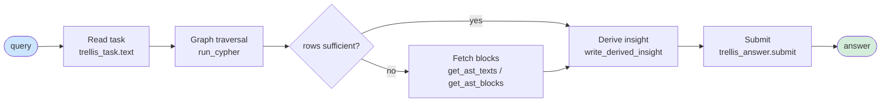
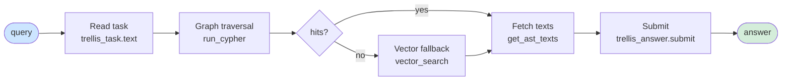
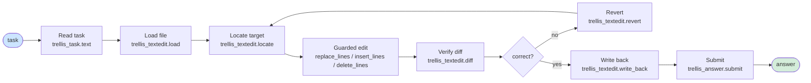
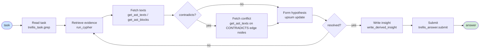
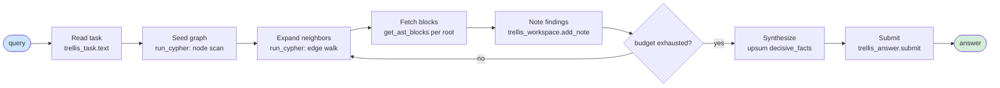
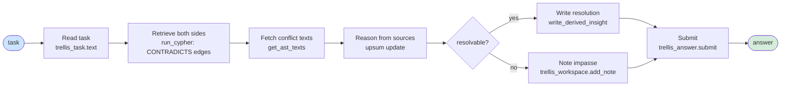
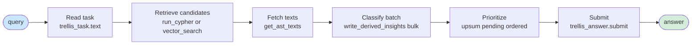
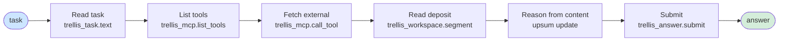

# Reasoning Template Library: L-axis userspace module

**Status:** design-record proposal (NOT sequenced). Written 2026-07-14; document-first, before the implementation it specifies. Authored against `master @ 51d9c7a4`.

**Scope:** a new userspace module, `modules/reasoning-templates/`, composed sparsely into RLM runs; adds a reasoning-mode template set plus a rough-fuzzy match protocol. No kernel change.

**Parent doctrine:** `CODE_MEDIATED_TEXT.md` (the model authors only genuinely new text plus the code that moves everything else); `WORKSPACE_AND_MODULES.md` (the module/registry mold, sections 2 and 9); `GLOSSARY.md` (Module, Addendum, Userspace, Byte-identical-when-absent). Nearest precedent: `modules/workspace-discipline/` (manifest + brace-free addendum + RESEARCH.md; acceptance `npm run test:modules`).

---

## 1. Problem statement

A run entering an unfamiliar task has no shared scaffold for how to reason over it; the operating mode is left implicit in the root model's attention. The invariant is knowable before the task specifics are: when the operating mode is construction, construction is the fixed parameter; the domain, the artifacts to build, and the evaluation criterion are all unknown at compose time. The remaining parameters form a combinatorial distribution (CLASS). The library fixes the invariant scaffold and leaves the unfixed parameters as free variables the root model fills per task. Fixed structure is supplied by userspace; only the genuinely new task-specific composition is authored by the model.

The current kernel (verified in `src/rlm/trellis_agent.py @ 51d9c7a4`) composes one fixed scaffold for every task, regardless of kind:

```
SYSTEM_PROMPT = RLM_SYSTEM_PROMPT + TRELLIS_ADDENDUM
TRELLIS_ADDENDUM = TRELLIS_ADDENDUM_BASE + build_modules_addendum(selected) + TRELLIS_WORKFLOW_RULES
```

`TRELLIS_ADDENDUM_BASE` is hand-authored prose: turn discipline, the tool contract, task precedence, re-read discipline, the CODE_MEDIATED_TEXT hard rule, and the UPSUM running-state block. The reasoning shape is identical for every task kind. The upgrade lifts hand-authoring up one level: author a generating set of primitives once and let the worker compose the per-task scaffold from them, so future task-state configurations become compositions, not new hand-written blobs.

---

## 2. The design

The L axis is a hand-crafted template set delivered as a userspace module, authored to cover the full mode space. The harness does not carry prompt-engineering craft as a self-extending skill; the craft is spent at authoring time (under the prompt-engineering and hypershot skills), and what ships is brace-free template content plus a match protocol. The library grows through two channels: registration of new modules (section 13), and the Skills axis, where successful runs are abstracted in the per-REPL workspace and proven composites promote to modules (sections 9 and 17).

Each template fixes the invariant structure of one reasoning mode and exposes named free variables for the unfixed, per-task parameters. Templates carry no cross-mode vocabulary; the proof template carries no navigation vocabulary, and the reverse. Set-theoretic seam: the fixed parameter (the operating-mode invariant) is what the module supplies; CLASS gives the combinatorial distribution over the unfixed parameters; rough-fuzzy classification begins there.

Mode set: proof, search, construction, troubleshooting, exploration, negotiation, triage. The A x R map (section 17) fixes the complete set; no partial subset ships.

---

## 3. Grounding in real symbols

Module mold (verified against `modules/workspace-discipline/module.json` and `src/config/modules.ts @ 51d9c7a4`):

- `modules/<name>/module.json`: fields name, version, purpose, research.sourceNodeIds, addendum, tools, bounds.addendumMaxBytes, acceptance.zeroPaid, status, kernelCompat.
- Valid status enum (from `src/config/modules.ts` Zod schema): `active`, `contested`, `retired`. Only `active` modules compose. This module ships `contested`: the research basis is not yet promoted to `ast_nodes` hashes, so it does not compose.
- `bounds.addendumMaxBytes`: 8192, carried from the workspace-discipline precedent; cap enforced by `loadModule` in `src/config/modules.ts`.
- Composition path: `trellis_agent.py` line: `TRELLIS_ADDENDUM = TRELLIS_ADDENDUM_BASE + build_modules_addendum(_SELECTED_MODULES, ...) + TRELLIS_WORKFLOW_RULES`. The addendum composes via `build_modules_addendum` once at startup.
- Prompt contract: brace-free (`rlms` runs `.format()` over the system prompt); `<<TRELLIS_RUBRIC>>` is the only substitution token; ASCII only.
- Registration and provenance: `scripts/register_modules.ts` (`npm run modules:register`) represents a research-bearing manifest as a `module:<name>` graph entity citing its research.sourceNodeIds after verifying each hash exists in `ast_nodes`. Empty-research manifests register nothing. The module registers non-active until research hashes are promoted.
- Acceptance drill: `npm run test:modules`. Both composed-prompt sha pins (default arm + omit arm in `scripts/test_modules.py`) recomputed in the same commit when the composed prompt legitimately changes.

---

## 4. Behavior / tooling / pin

| Behavior wanted | Tooling that enforces it | Pin that detects drift |
|---|---|---|
| Reasoning-mode scaffold available to a run | Brace-free addendum composed via `trellis_agent.py` `build_modules_addendum` (userspace, sparse) | Composed-prompt sha pins in `scripts/test_modules.py` (default + omit arm); `npm run test:modules` |
| Byte-identical when the module is absent/unregistered | Loader composes only registered active modules | Omit-arm composed-prompt pin (byte-identical-when-absent) |
| Templates carry no cross-mode vocabulary | Authoring-time discipline + review; addendum content check | TODO: add a content pin (per-mode vocabulary fence); confirm the right test home before implementation |
| Capability is provenance-tracked | `research.sourceNodeIds` cite real `ast_nodes` hashes; `register_modules` verifies existence | `npm run modules:verify` (contested reporting) |
| Structure stays fixed, free-variable fill stays model-authored | Addendum supplies fixed structure; model composes only new task text | CODE_MEDIATED_TEXT posture; no model counting or copying |

---

## 5. Open decisions

- **Prompt-engineering craft in composition:** feeding fixed invariant pieces to the root model to compose per task is the right long-term shape, but it is a second capability; deferred to its own record so this slice stays one capability.
- **Hand-crafted core plus Skills growth:** both, on separate channels. The A x R core is hand-authored to full coverage and fixed; growth is the Skills axis, not craft self-extension. Per-REPL workspaces are where learning accumulates: successful runs are abstracted via UPSUM and prioritized, and proven composites promote to modules by registration (the Capability Flywheel, sections 9, 13, 17).
- **Mode coverage:** full coverage. A partial system gives partial coverage and is not properly evaluable.
- **`module.json` status:** `contested` (non-active, non-composing, awaiting research promotion). Verified against `src/config/modules.ts` Zod enum: `['active', 'contested', 'retired']`.

---

## 6. What this record does NOT touch

- No kernel change; no change to `trellis_agent.py` beyond composing one more registered module through the existing path.
- No change to existing modules, prompts, or prompt pins, except the necessary composed-prompt pin recompute when the module is actually registered (implementation-time, not this proposal).
- No injected vector-magnitude form of the L axis.
- No RLM orchestrator work; no FEV/CHARM harness scope; no Session 56 / EL-* work.
- No paid run.

---

## 7. Acceptance

Zero-paid: `npm run test:modules` green with the new module registered; both composed-prompt pins recomputed in the same commit; `npm run modules:verify` clean once research hashes are promoted. `npm ci`, `npm test`, `npm run build`, `npm run python:check` per `AGENTS.md` section 5.

Owner-gated paid: none in this proposal (additive). Behavioral measurement of the templates is a later, owner-gated, zero-paid-first exercise.

---

## 8. Honest scope

Proposal, not a session: no roadmap ledger entry, no HANDOFF regeneration. Additive; ratification is where bytes move and the pin ceremony attaches. The record fixes the shape; the actual templates, the matcher spec, and the research basis are filled at implementation.

---

## 9. Composition model (constructor-theory framing)

Each primitive is a constructor: it consumes an input substrate (a task state), produces an output substrate (the task advanced), and remains able to repeat. Its interface is its ports: in-type, out-type, free variables (hypershot slots), and admissible next-modes.

Composition is legal when types match: the out-type of A is an admissible in-type of B. A compossible set is one that can run together. The composer wires by interface, never by parsing Mermaid.

Render on demand: emit one flowchart, each chosen primitive a subgraph, ports wired with cross-boundary edges; `click <subgraph> href "modes/<mode>"` links each subgraph back to its own tiny primitive graph. That href is the navigational connector, standing in for the cross-graph edge Mermaid lacks.

A proven composite promotes to its own module (Capability Flywheel): a constructor built of constructors, entering the library as fixed vocabulary.

Tool-fit note: a flowchart with typed-port subgraphs fits both the primitive (a tiny flowchart with ports) and the composed view (subgraphs wired). A sequence diagram fits an execution trace of one run, not the library.

---

## 10. Layer distribution

- Orchestrator (`src/core/agent/`) or harness code: sets the invariant, the fixed parameter that constrains which primitives are in play. Fixed at task-definition time and immutable within the run; orchestrator/kernel authority, never model-writable.
- Worker (`src/rlm/`): does the logic switching. Given the fixed invariant, it rough-fuzzy matches the task to entry primitives, picks a compossible few, switches modes through explicit exits declared in each addendum, instantiates free variables with the domain's own terms, and maintains the working composite in the workspace (Tier 3) for reuse.

---

## 11. Current-system finding (verified 2026-07-14, master @ 51d9c7a4)

Verified in `src/rlm/trellis_agent.py` by reading the symbol:

```
TRELLIS_ADDENDUM_BASE = (
    _ADDENDUM_BASE_PREFIX
    + ("" if EXP_OMIT_CMT_ENABLED else CODE_MEDIATED_TEXT_BLOCK)
    + _ADDENDUM_BASE_SUFFIX
)
```

`_ADDENDUM_BASE_PREFIX` contains: turn discipline, the tool contract, task precedence, re-read discipline, the UPSUM running-state block. `CODE_MEDIATED_TEXT_BLOCK` is the code-mediated-text hard rule. The only per-task variation is the injected task text. The reasoning shape is identical for every task kind. This is the gap this module addresses.

---

## 12. Convergent grounding

- PCF (Polymorphic Combinatorial Frameworks, arXiv 2508.01581): the combinatorial construction of the mode space; CLASS gives the distribution over unfixed parameters; the SPARK categories (Skills, Personas, Approaches, Resources, Knowledge) frame each primitive as a composed unit.
- Constructor theory: compossibility and closure; the generating-set obligation (the primitive set must generate the mode space with no gaps).
- MASH (github.com/gusthemole/MASH): traceable proof of the composition method and the classifier-placement principle (section 16).

---

## 13. Rule: new modules register new primitives

A module's registration IS the registration of the primitives it contributes. `scripts/register_modules.ts` represents each research-bearing manifest as a `module:<name>` graph entity; under this design the manifest also declares its reasoning primitives (modes plus their port interfaces), and registering the module adds those primitives to the harness's composable set. Adding a primitive is a module registration and nothing else; there is no side channel. This keeps every primitive provenance-tracked and contestable by the same invalidation sweep, and makes the library's growth auditable.

Registration is self-documenting: a module's manifest declares each primitive's mode, purpose, and port interface at registration time, so registering a module publishes its primitives into the composable catalog and documents them in one act (see section 15). A new module must be registerable this way to enter the library.

---

## 14. Where classification lives: the model, not the code

Mode classification is delegated to the root model. The prompt composition stays symbolic and faithful; the worker model performs the mode classification. The matcher is not a separate subsystem.

Mechanism: present a compact catalog of the invariant-relevant primitive space in the composed addendum. For each mode: its name, a one-line purpose, and its port types (in-type, out-type). The worker classifies against that catalog in-model and composes. The full template for a selected mode is instantiated only once chosen, which preserves the no-cross-mode-vocabulary rule and the byte budget; the catalog is an index of labels, not the full template bodies.

The invariant (set by orchestrator or code, section 10) prunes the catalog to the relevant slice, so the worker classifies within a bounded space.

Classifier placement traced to MASH (section 16): `get_image_prompt` composes the scene prompt but performs no classification; the autoregressive image model that consumes the prompt classifies, resolving the assembled contents into one image. The placement here is the same.

---

## 15. Execution is a PCF category: Resources composed with Approaches

Execution sits inside the SPARK framework. A primitive is a SPARK-composed unit, not an Approach alone. Each catalog entry carries:

- **Approaches:** the mode and its one-line purpose (the concept the worker classifies against).
- **Resources:** the guarded-verb REPL syntax the mode reaches for, materialized as a verbatim usage snippet. The snippet is how syntax is handed to the worker.
- **Skills, Personas, Knowledge:** present as axes, drawn on when a mode needs them; not every mode uses all five.

The one object the worker consults to classify (section 14) is the same object that hands it the correctly-invoked Resource. Self-documentation is the Resources axis materialized beside its Approach.

PCF (arXiv 2508.01581) and its SPARK categories are the record-facing frame for this section.

Boundary: the Resources axis carries the guarded verb's interface; it does not implement the guard. The engine owning the mechanics and PCF composing the Resource that names that verb are orthogonal and both needed.

---

## 16. MASH: the traceable proof

Claims in sections 9, 14, and 15 rest on a public, inspectable precedent: MASH (github.com/gusthemole/MASH).

- **Composition method:** `ai_layer.py`, `get_image_prompt` composes a faithful prompt from a room, its contents, and a buffer of any speech or actions. `mash_engine.py`, `_snapshot_worker` is the compose-then-render loop. `get_scene_context` snapshots the live room at call time, so the assembler renders content discovered at runtime that the author never enumerated.
- **Self-documentation:** `mash_engine.py`, `register_command` declares each command with a `usage` string (the syntax) and a `help` string (the concept); `help [command]` renders the registry by category. Every documented command is a guarded verb; the engine does the mechanics.
- **Classifier placement:** `get_image_prompt` does not classify; the autoregressive image model that consumes the prompt classifies. Composition is in the code; classification is in the model.

Status: external precedent, public and citable, distinct from in-repo Trellis grounding.

---

## 17. SPARK mapping of Trellis (the organizing frame)

PCF SPARK categories applied to the Trellis RLM, verified against source code at `master @ 51d9c7a4`.

### K (Knowledge): the stores and how they are read

The REPL and the stores it queries:

- Semantic graph (`trellis_neo4j`): `run_cypher(query)` returns JSON string; parse with `json.loads()`. Returns list of row dicts keyed by RETURN aliases. Node labels: Question (id, text, category), Concept (name), Entity (name). Edge types: REFERENCES, ACTION, CONTRADICTS, DERIVED_INSIGHT. Nodes and edges carry `sourceNodeIds` (AST hashes).
- Physical AST layer (`trellis_postgres`): `get_ast_texts(hashes)` returns `{"<hash>": "text"}` JSON string. `get_ast_blocks(root_hash)` returns ordered block list JSON `[{"id", "type", "text"}]`. `vector_search(query)` returns `[{"id", "content"}]` JSON string (top 3, semantic fallback).

### R (Resources): the full operation set

Enumerated by top-down code review of all six source files. 8 families, 25 operations total. Verbatim REPL snippets for all operations are in the companion review section below (section 17.R).

Every call returns a JSON string; every return must be wrapped in `json.loads()` before indexing or iterating. Exceptions: `trellis_task.text()` and `trellis_task.uuid` return plain Python values directly; S3 scaffold helpers (`frame_text`, `region_lines`, `region_equal`, `concat_files`, `citable`) return Python values directly.

### A (Approaches): the reasoning-mode set

Eight reasoning modes, drawn as minimal Mermaid flowcharts with typed ports. Generalized node labels; each operation-node bound to its verbatim R snippet; typed ports at the boundary.

**proof:** Establish a claim from the corpus with cited evidence.



In-ports: `query`, `task`. Out-port: `answer`. Key R snippets: `run_cypher`, `get_ast_texts`, `write_derived_insight`, `trellis_answer.submit`.

**search:** Locate relevant nodes across the corpus without a prior claim.



In-ports: `query`, `task`. Out-port: `answer`. Key R snippets: `run_cypher`, `vector_search`, `get_ast_texts`, `trellis_answer.submit`.

**construction:** Build or modify a file artifact in the edit root.



In-ports: `task`, `address`. Out-port: `answer`. Key R snippets: `load`, `locate`, `replace_lines`, `insert_lines`, `delete_lines`, `diff`, `revert`, `write_back`, `trellis_answer.submit`.

**troubleshooting:** Diagnose a failure by iterating query, evidence, and hypothesis.



In-ports: `task`, `query`. Out-port: `answer`. Key R snippets: `trellis_task.grep`, `run_cypher`, `get_ast_texts`, `get_ast_blocks`, `write_derived_insight`, `trellis_answer.submit`.

**exploration:** Map an unknown domain by traversal without a prior hypothesis.



In-ports: `query`, `task`. Out-port: `answer`. Key R snippets: `run_cypher`, `get_ast_blocks`, `trellis_workspace.add_note`, `trellis_answer.submit`.

**negotiation:** Resolve conflicting evidence or constraint sets to a consistent position.



In-ports: `task`, `hashes`. Out-port: `answer`, `insight`. Key R snippets: `run_cypher`, `get_ast_texts`, `write_derived_insight`, `trellis_workspace.add_note`, `trellis_answer.submit`.

**triage:** Classify and prioritize a set of items from the corpus for downstream action.



In-ports: `query`, `task`. Out-port: `answer`, `insight`. Key R snippets: `run_cypher`, `vector_search`, `get_ast_texts`, `write_derived_insights`, `trellis_answer.submit`.

**ingestion (external):** Retrieve, deposit, and reason over external content via MCP, when configured.



In-ports: `task`. Out-port: `answer`. Key R snippets: `trellis_mcp.list_tools`, `trellis_mcp.call_tool`, `trellis_workspace.segment`, `trellis_answer.submit`. Note: MCP calls never count as database tool calls; external content has no provenance standing.

### S (Skills): the growth channel

Per-REPL workspaces (Tier 3) are where learning grows. Successful runs are abstracted via UPSUM and prioritized; proven composites promote to modules by registration (the Capability Flywheel, sections 9, 13). `trellis_workspace.add_note`, `trellis_workspace.set_plan`, and `trellis_workspace.segment` are the S-axis operations.

### P (Personas): deliberately omitted

A persona is a loadable overlay, one axis of SPARK (PCF, arXiv 2508.01581); omitting it is a configuration choice within the framework, not a gap. For an accuracy-critical code worker a persona is a constraint without benefit: adding a persona to a system prompt does not improve objective-task performance (Zheng et al., Findings of the ACL: EMNLP 2024, arXiv 2311.10054), and expert personas specifically degrade accuracy on pretraining-dependent tasks including coding and math while helping only alignment-style tasks (Hu, Rostami, and Thomason, 2026, arXiv 2603.18507). No P is composed for the worker; the pretrained model's base behavior runs on its own.

---

## 17.R. Full R-axis operation inventory (code review, master @ 51d9c7a4)

Every operation the RLM can take in the REPL, with verbatim call syntax. Source file noted for each family.

**Family 1: Graph read and write (`trellis_neo4j`, source: `src/rlm/trellis_tools.py`)**

`run_cypher(query)` -- read-only semantic graph traversal. Returns JSON string; parse with `json.loads()`. Result: list of row dicts keyed by RETURN aliases. Mutation keywords refused server-side (READ session).

```python
results = json.loads(trellis_neo4j.run_cypher(
    "MATCH (q:Question)-[:REFERENCES]->(c:Concept) "
    "WHERE q.id = 'q_0001' RETURN c.name AS concept, q.text AS question"
))
# [{"concept": "entailment", "question": "..."}]
```

`write_derived_insight(subject, verb, obj, sourceNodeIds, confidence, subject_kind, object_kind)` -- single fact write, the ONLY mutation path. Cited hashes must exist in `ast_nodes` and must have been retrieved by a retrieval tool this run. Returns JSON string: list of written edge records.

```python
receipt = json.loads(trellis_neo4j.write_derived_insight(
    subject="entailment",
    verb="requires",
    obj="semantic_overlap",
    sourceNodeIds=["<64-hex-hash>"],
    confidence=0.87,
    subject_kind="concept",
    object_kind="concept",
))
# [{"subject": "entailment", "verb": "requires", "object": "semantic_overlap", "confidence": 0.87}]
```

`write_derived_insights(facts)` -- bulk write, one UNWIND round trip. Each fact is a dict with keys subject, verb, obj, sourceNodeIds, confidence (optional), subject_kind, object_kind (optional).

```python
facts = [
    {"subject": "s1", "verb": "relates_to", "obj": "s2",
     "sourceNodeIds": ["<hash1>"], "confidence": 0.9},
    {"subject": "s2", "verb": "implies", "obj": "s3",
     "sourceNodeIds": ["<hash2>"], "confidence": 0.75},
]
receipt = json.loads(trellis_neo4j.write_derived_insights(facts))
```

**Family 2: Physical AST layer (`trellis_postgres`, source: `src/rlm/trellis_tools.py`)**

`get_ast_texts(hashes)` -- fetch exact text for AST node hashes. Retrieval-discipline: refuses if ALL requested hashes already served this run (dedup) or budget exhausted.

```python
texts = json.loads(trellis_postgres.get_ast_texts(["<hash1>", "<hash2>"]))
# {"<hash1>": "block text...", "<hash2>": "other text..."}
```

`get_ast_blocks(root_hash)` -- fetch document blocks in document order from root hash. Returns `[{"id": "<hash>", "type": "paragraph", "text": "..."}]`. Retrieval-discipline: refuses repeat root call this run.

```python
blocks = json.loads(trellis_postgres.get_ast_blocks("<root-hash>"))
# [{"id": "<hash>", "type": "heading", "text": "Introduction"}, ...]
```

`vector_search(query)` -- hybrid pgvector semantic fallback. Returns `[{"id": "<hash>", "content": "text"}]` (top 3). Refuses exact-string repeat. Hit ids join search-set only; call `get_ast_texts` before citing.

```python
hits = json.loads(trellis_postgres.vector_search("semantic textual entailment"))
# [{"id": "<hash>", "content": "..."}]
```

**Family 3: Answer channel (`trellis_answer`, source: `src/rlm/trellis_answer.py`)**

`submit(expression_text)` -- by-reference final answer. Evaluates the given Python expression text in the calling REPL frame, prefixes `FINAL_ANSWER:` engine-side, and sets `answer["content"]` and `answer["ready"]`. Literal-only expressions refused. Expression cap: 400 chars.

```python
answer_text = f"The concept appears {count} times across {docs} documents."
trellis_answer.submit("answer_text")
# or: trellis_answer.submit("f'Found {count} results in {docs} docs.'")
# or: trellis_answer.submit("results[0]['concept']")
```

**Family 4: Task access (`trellis_task`, source: `src/rlm/trellis_scaffold.py`)**

`trellis_task.text()` -- operator task verbatim as plain string (not JSON).

```python
task = trellis_task.text()
```

`trellis_task.grep(pattern)` -- engine-side regex over task text. Returns JSON string with bounded hits.

```python
hits = json.loads(trellis_task.grep(r"\bwrite.+insight\b"))
# {"pattern": "...", "totalHits": 2, "capped": false, "hits": [{"line": 0, "text": "..."}]}
```

`trellis_task.uuid` -- this run's task id, plain string attribute.

```python
run_id = trellis_task.uuid
```

**Family 5: Text editing (`trellis_textedit`, source: `src/rlm/trellis_textedit.py`) [operator-gated: TRELLIS_EDIT_ROOT]**

`load(relpath)` -- read file into held frame. Returns shape JSON.

```python
info = json.loads(trellis_textedit.load("src/rlm/trellis_tools.py"))
# {"path": "...", "lineCount": 849, "bytes": 44355, "digest": "..."}
```

`lines(relpath, start, end)` -- bounded slice [start, end). Addresses 0-based, half-open.

```python
region = json.loads(trellis_textedit.lines("src/rlm/trellis_tools.py", 100, 110))
# {"path": "...", "start": 100, "end": 110, "lines": [[100, "text..."], ...]}
```

`locate(relpath, pattern, regex=False)` -- engine-computed addresses. Never count lines; always locate.

```python
locs = json.loads(trellis_textedit.locate("src/rlm/trellis_tools.py", "def run_cypher"))
# {"totalHits": 1, "hits": [{"line": 74, "preview": "    def run_cypher..."}]}
```

`splice(relpath, start, end, new_lines)` -- raw staged replacement. Prefer guarded family.

```python
result = json.loads(trellis_textedit.splice(
    "src/rlm/example.py", 5, 7,
    ["    # replaced line A", "    # replaced line B"]
))
```

`replace_lines(relpath, start, end, expected_lines, new_lines)` -- guarded replace; verifies expected bytes before staging.

```python
result = json.loads(trellis_textedit.replace_lines(
    "src/rlm/example.py", 5, 7,
    ["    old_line_A", "    old_line_B"],
    ["    new_line_A", "    new_line_B"],
))
```

`insert_lines(relpath, at, new_lines, anchor_before=None, anchor_after=None)` -- guarded insert; at least one anchor required.

```python
result = json.loads(trellis_textedit.insert_lines(
    "src/rlm/example.py", 10,
    ["    # new inserted line"],
    anchor_after="    def existing_function():",
))
```

`delete_lines(relpath, start, end, expected_lines)` -- guarded delete; verifies exact bytes before removing.

```python
result = json.loads(trellis_textedit.delete_lines(
    "src/rlm/example.py", 5, 7,
    ["    old_line_A", "    old_line_B"],
))
```

`diff(relpath)` -- bounded unified diff of staged vs loaded.

```python
d = json.loads(trellis_textedit.diff("src/rlm/example.py"))
# {"pendingSplices": 2, "truncated": false, "diff": "--- ..."}
```

`revert(relpath)` -- discard staged splices, restore loaded snapshot.

```python
trellis_textedit.revert("src/rlm/example.py")
```

`drop(relpath)` -- free held frame slot.

```python
trellis_textedit.drop("src/rlm/example.py")
```

`write_back(relpath)` -- hash-guarded atomic disk write; raises `StaleFileError` on digest mismatch.

```python
receipt = json.loads(trellis_textedit.write_back("src/rlm/example.py"))
# {"bytesWritten": 1234, "newDigest": "..."}
```

**Family 6: Workspace (`trellis_workspace`, source: `src/rlm/trellis_workspace.py`) [gated: MCP active OR goal-id set]**

`read()` -- bounded index; plan, notes, segment metadata; never segment content.

```python
index = json.loads(trellis_workspace.read())
# {"version": 1, "plan": [...], "notes": [...], "segments": {"<uuid>": {...}}, "usage": {...}}
```

`segment(segment_id)` -- full record for one segment, content included.

```python
seg = json.loads(trellis_workspace.segment("<uuid>"))
# {"segmentId": "<uuid>", "origin": {...}, "content": "full text...", ...}
```

`set_plan(plan)` -- replace plan atomically with plain JSON-serializable data.

```python
trellis_workspace.set_plan([
    {"id": "s1", "desc": "retrieve concept graph", "status": "done"},
    {"id": "s2", "desc": "write insights", "status": "pending"},
])
```

`add_note(text)` -- append a self-note string.

```python
trellis_workspace.add_note("q_0001 references entailment via REFERENCES edge. Confirmed.")
```

`drop(segment_id)` -- free one segment.

```python
trellis_workspace.drop("<uuid>")
```

**Family 7: External tools (`trellis_mcp`, source: `src/rlm/trellis_mcp.py`) [operator-gated: TRELLIS_MCP_SERVERS]**

`list_tools()` -- configured surface; registry truth; no I/O.

```python
tools = json.loads(trellis_mcp.list_tools())
# [{"server": "my-server", "tools": ["search", "fetch"], "timeoutMs": 10000, ...}]
```

`call_tool(server, tool, arguments)` -- invoke allowlisted MCP tool. With workspace active, returns stub; without workspace, returns `{"server", "tool", "result"}`. MCP calls never count as database tool calls.

```python
stub = json.loads(trellis_mcp.call_tool("my-server", "search", {"query": "entailment"}))
# With workspace: {"segmentId": "<uuid>", "bytes": ..., "preview": "..."}
full = json.loads(trellis_workspace.segment(stub["segmentId"]))
# Without workspace: {"server": "my-server", "tool": "search", "result": "text..."}
```

**Family 8: Scaffold helpers (injected into REPL namespace, source: `src/rlm/trellis_scaffold.py`) [gated: textedit active]**

`frame_text(relpath)` -- entire working frame as plain string (not JSON).

```python
full = frame_text("src/rlm/example.py")
```

`region_lines(relpath, start, end)` -- working lines [start, end) as list.

```python
region = region_lines("src/rlm/example.py", 5, 10)
# ["    line 5 text", "    line 6 text", ...]
```

`region_equal(relpath, start, expected_lines)` -- byte-match assertion; returns bool directly.

```python
ok = region_equal("src/rlm/example.py", 5, ["    line 5 text", "    line 6 text"])
```

`concat_files(relpaths)` -- held frames joined as one string; use for `llm_query` buffers.

```python
buffer = concat_files(["src/a.py", "src/b.py"])
```

`citable(hashes)` -- READ-ONLY citability probe [gated: named_files provided]. Returns plain dict; never satisfies provenance protocol.

```python
report = citable(["<hash1>", "<hash2>"])
# {"<hash1>": {"retrieved": True, "exists": True, "bridges_named_file": True, "citable": True}, ...}
```

---

## 17.X. Cross-cutting REPL protocol

From `TRELLIS_ADDENDUM_BASE` in `src/rlm/trellis_agent.py`:

- One `repl` block per turn, always, until `trellis_answer.submit`.
- `json.loads()` on every tool return before indexing or iterating.
- `upsum` dict: created in first block, REWRITTEN (not appended) at end of every block. Keys: `done`, `pending`, `blocked`, `decisive_facts`. Size bound: `len(str(upsum)) < UPSUM_BUDGET` (constant injected into namespace).
- Re-read task before each decisive step: `trellis_task.grep` or `trellis_task.text`.
- Zero database tool calls yields `TRELLIS_PROTOCOL_VIOLATION`; answer rejected.
- MCP calls, workspace ops, and textedit ops never count as database tool calls.

---

## 17.Y. Port type vocabulary (locked from operation data types)

| Port type | Definition |
|---|---|
| `query` | String sent to `run_cypher`, `vector_search`, `trellis_task.grep`, or `locate` |
| `rows` | `json.loads`-parsed list of row dicts from `run_cypher` |
| `hashes` | List of 64-hex AST node ids; cite only addresses retrieved this run |
| `blocks` | `json.loads`-parsed `[{id, type, text}]` list from `get_ast_blocks` |
| `insight` | Derived fact dict: `{subject, verb, obj, sourceNodeIds, confidence}` |
| `address` | Integer line index, engine-computed by `locate`; never estimated |
| `answer` | Final answer value submitted via `trellis_answer.submit` |
| `task` | Operator task text, engine-held in `trellis_task` |
