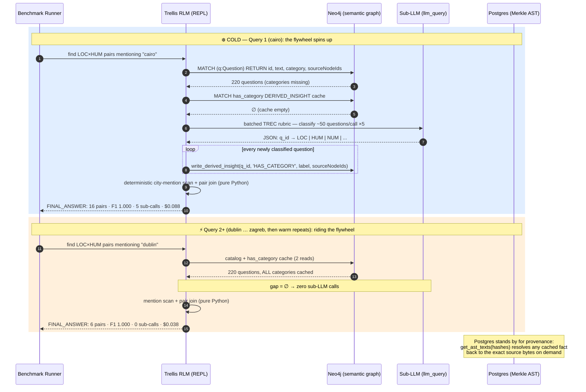

# The Spatial Flywheel — Why This Benchmark Result Is a Paradigm Shift

> **TL;DR** — Standard recursive agents re-derive their understanding of a corpus on *every* query, so cost scales as $O(N)$ dollars per query, forever. The Trellis RLM derives understanding **once**, writes it into a provenance-anchored knowledge graph, and every later query — about *any* city, not just repeated ones — becomes a cheap deterministic database join. In the benchmark run, sub-LLM calls went from 5 (Query 1) to **exactly 0 for all 19 remaining queries**. That is not an optimization. It is a different cost model.

If you are new to active reasoning agents, this document explains what just happened and why it matters. If you are an experienced systems engineer, skip to [§3](#3-the-key-telemetry-observation-the-flywheel-completes-during-the-cold-phase) — the telemetry detail there is the interesting part.

---

## 1. The Problem with Standard Agentic Search

A Recursive Language Model (RLM), in the MIT CSAIL formulation, is a language model given a Python REPL and the ability to call *itself* (or a cheaper sibling) as a subroutine via `llm_query()`. Faced with a corpus too large or too dense to reason over in one context window, it writes code that chunks the data and fans out sub-LLM calls to classify, extract, or summarize each piece — then aggregates the results programmatically.

This works. It is the reason RLMs crush flat-context models on tasks like OOLONG-Pairs, where a single context window suffers "context rot" and accuracy collapses toward 0%.

But the standard RLM has a structural flaw: **it is ephemeral.** Everything it learns about the corpus — every classification, every extracted entity — lives in REPL variables that evaporate when the query ends.

```
Query 1: "Find LOC×HUM pairs mentioning cairo"
  → classify all 220 questions via sub-LLM calls  → answer → 🗑️ forget everything

Query 2: "Find LOC×HUM pairs mentioning dublin"
  → classify all 220 questions AGAIN              → answer → 🗑️ forget everything

Query k: ...the same 220 classifications, re-purchased, every single time.
```

The per-query cost is dominated by re-deriving the same facts. The MIT baseline on this task class runs on the order of **~$1.12 per query — for every query, forever** ([benchmark spec §2](../product/BENCHMARK_OOLONG.md)). Ask 1,000 questions about the same corpus and you pay for the same understanding 1,000 times: $O(N)$ USD in query count, with no mechanism to ever get cheaper.

> [!NOTE]
> This is not a bug in any particular agent — it is the default economics of *stateless* recursive reasoning. The model has no durable place to put what it learned, so it cannot compound.

## 2. The Trellis Solution: Reasoning That Compounds

Trellis gives the RLM the missing durable substrate — but with strict rules about what may be written and how. The agent operates across two layers:

| Layer | Store | Role |
|---|---|---|
| **Physical** | PostgreSQL (`ast_nodes`) | Merkle-addressed AST: `id = SHA256(type + ":" + content)`. The immutable ground truth of *what the text actually says*. |
| **Semantic** | Neo4j | `(:Question)`, `(:Concept)` nodes and typed edges, every one carrying `sourceNodeIds` — the physical hashes it was derived from. |

Under the **Spatial Flywheel Protocol** (enforced by the system prompt in [trellis_agent.py](../../src/rlm/trellis_agent.py)), a classification task proceeds:

1. **Load the catalog** — one Cypher query pulls every question's id, text, and any known category.
2. **Load the cache** — one Cypher query pulls all `DERIVED_INSIGHT` edges where `verb = 'has_category'`.
3. **Delegate only the gap** — questions with no effective category are batched (~50 per call) into `llm_query` sub-calls carrying a fixed TREC classification rubric. The agent's own in-context guesses are treated as unreliable and are inadmissible.
4. **Cache immediately** — every new label is written back **before answering**:
   ```python
   trellis_neo4j.write_derived_insight(question_id, 'HAS_CATEGORY', category, source_node_ids)
   ```
5. **Resolve mentions deterministically** — city mentions are decided by a case-insensitive scan of `q.text` in Python, never inferred from the *absence* of a graph edge.
6. **Compute the pair set** — a deterministic cross-product join over effective categories × mention scan.

> [!IMPORTANT]
> **The write path is a needle's eye, and that is the whole design.** `write_derived_insight` is the *only* mutation the sandbox permits — raw Cypher with `CREATE`/`MERGE`/`SET`/`DELETE` is blocked by keyword filter — and it **refuses to execute without `sourceNodeIds`**. The agent physically cannot cache an opinion without citing the Merkle-hashed AST nodes that justify it. Cached knowledge in Trellis is therefore never "the model said so"; it is always "the model said so, *about these exact bytes*, and here are their hashes." That is the zero-hallucination provenance constraint doing its job at the exact moment knowledge is created.

The result is a flywheel in the mechanical sense: expensive early rotations (sub-LLM classification) store energy in the graph, and every later rotation rides that stored momentum.

### From ephemeral fan-out to cached retrieval



*The diagram shows Run A's single-query spin-up; in Run B the same cold section repeats in smaller increments across Queries 1–4 (§3) before the graph is fully warmed. The retrieval section is identical in both runs.*

## 3. The Key Telemetry Observation: The Flywheel Completes During the Cold Phase

The benchmark was designed with a polite hypothesis: cold queries (1–14) would be expensive, and the warm repeats (15–20) would demonstrate the savings. The benchmark was run twice, independently, on two development branches — and both runs show something better: **the flywheel didn't wait for the warm phase.**

**Run A** (canonical, persisted as [benchmark_results.json](../../benchmark_results.json)) front-loaded the entire spin-up into a single query:

| Query window | Sub-LLM calls | What happened |
|---|--:|---|
| Q1 (cairo) | **5** | The agent discovered the cache was empty and swept the **entire corpus**: 5 batched classification sub-calls, 222 tool calls, writing `HAS_CATEGORY` insights for all 220 questions — not just cairo's. Cost: $0.088, 24.8s. |
| Q2–Q14 (13 remaining *cold* cities) | **0** | Every "cold" query found a fully-warmed cache. Two Cypher reads, a deterministic Python join, done. ~$0.03–0.06 each. |
| Q15–Q20 (warm repeats) | **0** | Indistinguishable from Q2–14 — because the real phase transition already happened at Q2. |

**Run B** (independent replication) spun the flywheel up *incrementally* — and the incremental path is the more instructive one:

| Query window | Sub-LLM calls | What happened |
|---|--:|---|
| Q1–Q3 (cairo, dublin, havana) | **1 each** | Each query classified just enough of the corpus to answer itself, caching category labels as it went (17, 14, 16 tool calls respectively). |
| Q4 (lima) | **4** | The agent executed a **bulk-classification sweep** — 4 batched sub-calls, 184 tool calls — mapping every remaining unclassified question in the corpus in one pass. |
| Q5–Q14 (10 remaining *cold* cities) | **0** | **Still in the cold phase**, sub-calls drop to exactly 0. The agent transitions to cheap $O(1)$ graph checks without waiting for the warm phase to start saving money. |
| Q15–Q20 (warm repeats) | **0** | Same as Q5–14 — the phase boundary is a formality. |

Full per-query tables for both runs are in the [benchmark report §3](./OOLONG_BENCHMARK_REPORT.md#3-the-telemetry--cold-phase--warm-phase).

> [!TIP]
> **In both runs, the majority of *cold* queries — cities the agent had never been asked about — answered with zero semantic sub-calls.** This is the difference between a *memoization cache* and a *knowledge graph*. A memo cache keyed on the query ("cairo pairs") would only help on exact repeats — Q15–20. The flywheel instead caches the **decomposed facts** (`q_0042 HAS_CATEGORY loc`), which every future query about *any* city recombines for free. The warm phase was designed to prove the savings; the cold phase itself proved a stronger claim — in both replications.

Two honest footnotes on that story:

- **Where the sweep lands varies run to run — but the invariant holds.** Run A front-loaded everything into Query 1; Run B amortized it across Queries 1–4 before the lima bulk sweep closed the gap. The invariant across runs is not *which* early query pays; it is that the corpus is classified **exactly once**, and sub-calls reach zero well before the warm phase begins (Q2 in Run A, Q5 in Run B). The agent decides opportunistically how much of the corpus to classify per query, which is why reporting multiple runs matters (see [CRITIQUE_AND_FUTURE.md §3.3](./CRITIQUE_AND_FUTURE.md#33-benchmark-hardening)).
- **Cost floors at the protocol, not at zero.** Warm-phase queries still cost ~$0.032–0.038 on average (−16% to −28% vs. cold across the two runs): the root model must still read its protocol prompt, run 2–4 REPL iterations, and emit the answer. What the flywheel eliminates is the growing part of the cost — the per-corpus semantic work. In big-O terms: the *classification* cost is $O(\text{corpus})$ **once**, amortized to $O(1)$ per query, instead of $O(\text{corpus})$ **per query**.

### The cost model, side by side

| | Standard RLM (MIT baseline) | Trellis Spatial Flywheel |
|---|---|---|
| Query 1 | ~$1.12 (full classification fan-out) | $0.088 (full sweep, cached to graph) |
| Query 2 | ~$1.12 (identical fan-out, again) | $0.038 (2 graph reads + Python join) |
| Query k | ~$1.12 · k total | ~$0.04 · k + one-time sweep |
| 1,000 queries | ~$1,120 | **~$40** |
| Knowledge after the run | none — evaporated with the REPL | 220 provenance-anchored facts, queryable by any future agent |

That last row is the strategic point. The dollar savings are large, but the durable asset is larger: **the graph is now smarter than it was before the benchmark ran**, and every future workload — a different agent, a different question shape, a human analyst writing Cypher by hand — inherits those 220 classifications with their provenance intact. Stateless agents spend; the flywheel invests.

## 4. What Could Go Wrong

A cache that makes early beliefs permanent is a double-edged instrument — a mis-classification written on Query 1 would be *deterministically* wrong on every query thereafter. That risk, why this run avoided it, and the mitigation roadmap (verification-on-hit, confidence scoring, TTL, parallel ingestion) are treated honestly in [CRITIQUE_AND_FUTURE.md](./CRITIQUE_AND_FUTURE.md).
