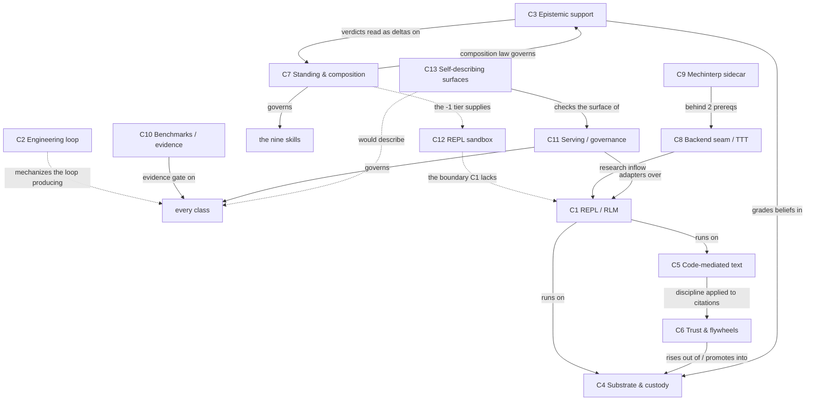

# The Trellis Density-Trellis — a branching chain-of-density map of the whole system

**Status: orientation artifact, reverse-engineered 2026-07-21/22 at commit `2b937e8`.** PROPOSED /
unratified. Subordinate to everything it summarizes: the authority order **code > glossary > prose**
binds here with extra force, and [`docs/ORIENTATION.md`](../ORIENTATION.md) (D4, the per-record standing index) refines it —
ratified record → adopted doctrine → design record → orientation compression → skill, memory. This
file sits at the *orientation compression* rung. If any sentence disagrees with
[`docs/GLOSSARY.md`](../GLOSSARY.md), a design record, or code, the other source wins and this file
has a defect. It is non-authoritative relative to the collaborator's live task and to the acceptance
ledger (`npm run el:activate -- status`).

> **Rendered companion.** An interactive, theme-aware HTML render lives beside this file at
> [`DENSITY-CHAIN.html`](DENSITY-CHAIN.html). The two are kept in sync; **this markdown is the ground
> truth, the HTML is the map.**

> **Living wiki.** This document is maintained by machine-detected staleness, not by memory. When the
> repository moves, `npm run wiki:check` names exactly which branch classes the change touched, and a
> `Stop` hook raises it in-session. See [Maintenance — the living-wiki loop](#maintenance--the-living-wiki-loop)
> and the folder [`README.md`](README.md).

---

## Why a *trellis*, and what "density trellis" means

Chain of density (Adams et al. 2023, [arXiv:2309.04269](https://arxiv.org/abs/2309.04269)) rewrites
one summary five times **at a fixed length**, fusing in new entities each pass by compressing what is
already there. Fixed length is the engine: without it, "add detail" produces a longer summary, never a
denser one.

[`docs/ORIENTATION.md`](../ORIENTATION.md) already applies that method to Trellis as a **single
spine** — one system, summarized at a growing budget. A **density-trellis is the second tier of the
format: several density-chains stacked together.** One shared *trunk* plus one *branch per subsystem
class*, each branch its own fixed-length five-tier chain, plus a lattice of cross-links so the
branches interlock instead of standing in parallel columns. The tier ladder is the same; what is new
is that a system has many salience orders at once, and a spine can only carry one.

Because salience runs from the invariant to the specific, each branch's tiers traverse time on their
own: **T1 general essence → T2–T3 current shipped machinery, with receipts → T4 the frontier → T5
future plans.** That is "from the basic level through current features and future feature plans,"
thirteen times over.

This map was reverse-engineered from the project's **157 first-parent commits** (`c454d1a` →
`2b937e8`; 216 including PR-branch commits) by **fifteen parallel read-only sub-agents** — one per
class, plus a commit historian and a constellation indexer — each verifying against source with
locators, none of them permitted to read the previous edition of this file. Method and honest gaps
are at the end ([Provenance & method](#provenance--method)).

## How to read this file (the contract)

1. **The trunk is the whole system, thrice.** Read T0–T2 always; it is under 500 words and orients
   everything below.
2. **Each branch is conceptually complete at every tier.** What T1 says is true and self-consistent on
   its own terms; T2–T5 *add* entities and mechanism, never *correct* a shallower tier (the **layer
   test**). Stop at the first tier that answers your question.
3. **Status labels are load-bearing.** `shipped-pinned` (committed code plus a passing drill) ≠
   `implemented, not accepted` ≠ `adopted / ratified-as-principle (no build)` ≠ `proposed /
   design-record` ≠ `recorded-research` ≠ `rolled back / retired`. Blurring them is the failure this
   house has paid for repeatedly.
4. **Reachability is reported separately from correctness.** `AMBIENT.md` rule 15 — *correct is
   not the same claim as reachable*. Each branch carries a **no non-test caller** list. Those are
   findings, not accusations.
5. **Every number here is *as recorded*, never re-run** — with one dated carve-out. No sub-agent has
   executed a paid run, and no measured result in this map was re-derived. From **July 22, 2026**, a
   densifier MAY run a zero-paid check whose output is an exit code or a pass/fail verdict (a suite
   count, a checker verdict, a negative control) and record it marked *measured this session*; C10,
   C12 and C13 carry such marks. That licenses nothing further: a scripted zero-paid harness's
   counters belong to the script author, not to any model.

---

## The trunk — the whole system at three densities

### Trunk-T0 (what Trellis is, in one sentence)

Trellis is a **personalized composable expert system whose expertise is the user's data** — built as
OpenCnid's **Recursive Language Model runtime**, where the user's context, memory, knowledge and
capabilities live as queryable engine state with enforced provenance, the model reaches all of it only
by writing code, and because the expertise *is* the user's data the **user is the domain authority**:
Trellis composes its experts, judges and protocols per question from primitives, and never overrules
the user about the user's own domain.

### Trunk-T1 (one paragraph)

The **substrate** turns every source into an immutable SHA-256 **Merkle AST** in PostgreSQL (Tier 1)
and every derived belief into a Neo4j node carrying **`sourceNodeIds`** — the exact block hashes it
came from (Tier 2); a Tier-3 **workspace** has no trust standing. The **execution model** is the RLM,
and it is integral: context is a database, not a scroll, reached by writing Python and calling
`llm_query` over slices. **Trust moves one way**, upward, only through operator-gated **promotion**.
Two **flywheels** compound — derived facts cached once and reused (knowledge), and the system's own
instructions versioned as **modules governed as beliefs** (capability). One discipline binds text
handling — **code-mediated text**: the model never counts, never copies. Orthogonal to custody (*where
from*), a signed-ternary **standing model** (−1 doubt · 0 belief · +1 fact) grades *how a claim held
up*, moved only by evidence or a **user gate**. And Trellis's evaluating functions — judges, experts,
protocols — **compose per context from primitives**; there is no default cast.

### Trunk-T2 (the class map — the thirteen branches)

Three tiers of branch, matching how the work grew:

- **Seeds** (the starting points): **C1** REPL & RLM execution · **C2** Engineering loop ·
  **C3** Epistemic support & judges.
- **Branch-out** (the substrate and disciplines the seeds stand on): **C4** Substrate & custody ·
  **C5** Code-mediated text (the ratified pillar) · **C6** Trust pipeline & flywheels · **C7**
  Standing model & composition from primitives.
- **Frontier** (research inflow, evidence, and how the whole thing is served and explained): **C8**
  Model-backend seam & test-time training · **C9** Mechinterp / residual-stream sidecar · **C10**
  Benchmarks & the evidence ledger · **C11** Serving surfaces & governance · **C12** REPL sandbox &
  isolation · **C13** Self-describing surfaces & discoverability.

The weave: **C1** runs on **C4**/**C5**; **C6** rises out of **C4** and is the only bridge up into it;
**C3** grades **C4**'s beliefs and feeds **C7**'s standing axis; **C7**'s composition law governs
**C3** and the skills; **C2** mechanizes the loop that produces all of it; **C8**/**C9** are the
research inflow into **C1**; **C12** is the trust boundary **C1** does not yet have; **C10** is the
evidence gate on every claim any class makes; **C11** is the skin; **C13** is how the whole thing
explains itself to the agent operating it — including this file.

---

## The temporal cross-section — general → current → future, all thirteen at once

One row per class. Read a column down for a snapshot of the whole system at one time-depth; read a row
across for one subsystem's arc.

| Class | Basic (what it *is*) | Current (shipped-pinned) | Frontier (in flight / adopted, unbuilt / known-broken) | Future (proposed / open) |
|---|---|---|---|---|
| **C1 REPL & RLM** | the model's only actuator is a persistent Python REPL; context is a database | `trellis_agent.py` over `rlms==0.1.3`, one process per task, goal loop, UPSUM + task wrapper, A2A/MCP injection | telemetry allowlist drops every counter added since Session 20; `max_depth` 1 unenforced on this path; pinned `rlms` `REPLResult` `repr`/`==` raise; `citable()` unreachable | sandbox build plan; `rlms` compaction (S2b, never enabled); `llm_help`; paid adoption probe |
| **C2 Engineering loop** | a controller outside the worktree that mechanizes the session loop | EL-00…EL-06 accepted; ledger + `el:activate`'s ten commands | EL-10/EL-11 **implemented, not accepted**; EL-07 **blocked**; kernel, prompt compiler, runner, verifier, checker, renderer have **no non-test caller** | EL-08 scheduler/extraction, EL-09 report ingest — each needs a fresh owner proposal |
| **C3 Epistemic support** | a graded, decaying (b,d,u) opinion of how a belief held up, computed sweep-side, writer-blind | support arithmetic, judge panel, intake, convocation, `judge_explain` render — all zero-paid | four-role cast **demoted to one instance** (S71); live judge constructor exists and has only ever refused; paid queue **ON HOLD** | reopen the paid queue; J3 live gatherer; the metered promotion-cost run (≈$0.02–$0.06/belief) |
| **C4 Substrate & custody** | provenance-enforced storage: Merkle ASTs plus beliefs bound by `sourceNodeIds` | verified ingest, invalidation sweep, quarantine/recovery, `repo:ingest`, entity resolution — measured | structural chunking pilot **FAILED as worded**, recovered only after the liveness filter; node-level `contested` has no consumer | `ASTRef`/`EVIDENCED_BY` migration (gate closed at 286/1,000 hashes); CRDT; trust decay; docs-corpus extraction |
| **C5 Code-mediated text** | the pillar: the model never counts, never copies | `trellis_textedit` (addendum descriptor-composed, byte-identity pinned), `trellis_answer`, `get_ast_blocks`, guarded splice family, retrieval discipline, structural chunking | guarded-only is an **operator gate `buildAgentEnv` neither sets nor strips**, with no dated behavior report; the guarded family's own driver failed three times | engine-resolved-anchor insert; guarded-only as default; `py-tree-sitter` addressing; superseded-embedding sweep |
| **C6 Trust & flywheels** | three tiers; one-way promotion; derive once, cache with custody, reuse | workspace, lineage, promotion, module registry (#0, #1), grounded authoring, anchor gate | module #2 **shipped then retired the same day** on its own control; laundering stays structurally undecidable; no authored module composes by default | per-claim citation mapping; `promote --embed`; entailment as a capability gate; tool-bearing modules (unopened) |
| **C7 Standing & composition** | signed-ternary standing, user-gated; compose from primitives, no default cast | the nine in-repo skills; the composition-from-primitives lesson | standing model **ratified as principle, no build**; corrosion bound **falsified as written** (positive core survives); `ROLE_DEFINITIONS` is still the cast rule 17 forbids | hash-kind stamp; recorder-plus-gate promotion; §11 repair directions; `affirmation` as an object |
| **C8 Backend seam & TTT** | make the completion backend a choice; ask whether test-time training helps adherence | the T1 config surface, and one live guard: the ambient `OPENAI_BASE_URL` refusal | T1 **consumer-less**; T2 **failed three straight sessions**, PAUSED on an unbuilt tooling increment; hosted arm is a proposal | R3–R5 rungs; LaCT arms; worker-transport override. **No TTT run or alternate backend has ever executed** |
| **C9 Mechinterp sidecar** | read and steer a served model's functional-affect state in the residual stream | *(nothing)* — one 288-line docs-only record | entirely prerequisite: hosted arm → local backend → sidecar, and step one is a proposal | instrument/actuator/mixture ladder M1–M4; percolative-Ising controller; the judge-actuation hazard, held outside the repo |
| **C10 Benchmarks & evidence** | a capability claim is a hypothesis until a dated report retires it | OOLONG v1, update/poison/scale drills, effective-context rounds, citation A/B, wall-clock — all dated | anti-shortcut corpus v2 pinned zero-paid with **no paid run**; the uncommitted nine-refusal sandbox drill is **[R]**-only, outside CI | real TREC import; adversarial corpora; 10k sweeps; multi-run variance replacing n=1; consensus writes |
| **C11 Serving & governance** | narrow, authenticated, admission-bounded doors; a written contract about which record wins | HTTP/SSE API, A2A server, outbound MCP client (byte-identical when off); AGENTS.md, session governance, the root contract | the surface checker is **green again** (`20e94ae` restored the density-chain links); `KNOWN_ROUTES` mislabels two routes | inbound MCP server surface with five open decisions; OAuth posture; the dual client+server role |
| **C12 REPL sandbox** | treat model-authored Python as hostile and own the boundary between it and the operator's secrets | the host-independent control plane, merged with CI and npm callers; on one Hetzner AX41: **G1, S2, S3 `[R]`+`[A]`, S4 `[R]`+`[A]`, S5 `[R]`**, and **2026-07-25 a production launch path** — a microVM boots, a frame crosses, a real model drives `llm_query` and composes the `run_query` facade against a real Postgres holding only a handle, Tier-0 caps a fork bomb and denies a syscall and a write while both channels still cross, and `KataLauncher.boot` now claims a real VMM in its own containerd namespace, refuses a shim that exited 0 without one, and releases everything it allocated when it does | **still not a sandbox and must not be read as one**: the NIC egress policy is absent, and the **[A] halves are unspent** — the composition layer closed the listener-ownership seam on 2026-07-25 (`session_host.open_workspace_session`, a context manager over lease/host/session/boot/listeners/scaffold), and the *diagonal* ran on the AX41 7/7: real backend composition against a real microVM, host end bound at `<uds>_5001`, a second session on a live workspace refused, a crashed holder's lease auto-reclaimed on a real liveness check, and the scope closing to zero residue. Egress self-labels **weak**; the spend cap is between-calls; the watchdog is unproven against real shim wedges | that listener-ownership decision, which S6's `[A]` gate needs and no build item named; then S6's equivalence harness against its stated target (twelve clauses predicted FALSE); GB, GA-eq, GA-rt; doubt-filter Layers 1–2; warm pool; `max_depth` 2; a paramstyle line in the `run_query` doc; the remaining **[A]** halves (S6, GB, GA-eq), ≤$5, unspent |
| **C13 Self-describing surfaces** | the account a system gives of itself must be derived from whatever enforces its behavior | the root contract, its machine twin, and the deterministic surface checker in CI; the first shipped descriptor — `trellis_textedit`'s addendum composes, byte-identity pinned per arm | the record↔twin asymmetry is structural — the checker proves twin↔tree only; Phase 0 **falsified its own specification**; a newline-free bijection orphan is pinned in the guarded arm; `llm_help` stays **authorized and unbuilt** | `llm_help`; the surface registry and its coverage diagnostic; the remaining eight descriptors (no pin ceremony owed); a human-doc generator; the self-play discrimination gate |

---

## The branches

Each branch is a self-contained five-tier chain of density at a held **~90 words per tier**.

### Seed classes

#### C1 — the REPL execution model: one process, one task, context as database
*Charter: everything between a dispatched task and the bytes a run emits — the Python process, its
injected namespace, the run-bounding scaffolds, the queue and stream plumbing, and the tool-free
planner above it. Not what the injected tools reach into, only that they arrive as REPL objects.*

- **T1 — essence.** A language model's only actuator is a persistent Python REPL. Context is a
  database, not a scroll: retrieved bytes live in namespace variables the model reaches by writing
  code, and it calls itself over slices rather than holding everything in attention. One process
  bounds one task; state dies with it. A tool-free planner above decomposes goals into self-contained
  tasks and routes working state by reference, never by paraphrase. Scaffolding makes the run's
  instructions and its own running state re-readable by code, because transcript distance corrupts
  attention, not memory.
- **T2 — current machinery.** One Python process per task: `rlm_worker.ts` spawns `trellis_agent.py`
  per `rlm_queue` job, which composes `RLM_SYSTEM_PROMPT` + TRELLIS_ADDENDUM + selected modules and
  calls `rlm.completion()` on one stateful `rlms` LocalREPL. `custom_tools` injects `trellis_neo4j`,
  `trellis_postgres`, `trellis_answer`, `trellis_task`, `trellis_upsum`, plus gated workspace,
  textedit, MCP and S3 helpers; `llm_query` fans sub-calls over slices. stdout streams to Redis,
  watched by two scanners. Above, `agent_worker.ts` runs `runGoalLoop` over tool-free
  dispatch/finish/fail decisions. Zero tool calls prints `TRELLIS_PROTOCOL_VIOLATION`. Neither queue
  retries.
- **T3 — with receipts.** PR #95 (`1878e89`) landed S1/S3; #98 (`74c3b48`) UPSUM; #135 (`3bdc0e7`)
  made it enforce — `commit()` refuses over `UPSUM_BUDGET = 2000`, `UPSUM_MAX_DOMAIN_KEYS = 12`. Pins:
  `COMPOSED_SYSTEM_PROMPT_SHA256 = d58abbb2…7bf0`, omit-arm `51eab4af…c0aa` (both moved
  2026-07-25 with the rule-24 turn-composition fix; the live pair is always the pair in
  `scripts/test_modules.py`);
  `trellis_scaffold.test.ts` pins `{upsum_commits: 1, upsum_budget_refusals: 1,
  upsum_shape_refusals: 5}`. Motivating run: **402,781 input tokens by iteration 14**. Probe round 1:
  12 runs, $0.7320; the off arm pushed 110,550 tokens through one `llm_query`, 7.6×. `rlms==0.1.3`,
  20,000-char block cap. Bounds `AGENT_MAX_TASKS_PER_GOAL` 8, `…ITERATIONS_PER_GOAL` 4,
  `TASK_WAIT_TTL_MS` 30 min.
- **T4 — the frontier.** `rlms` LocalREPL still runs model-authored Python in-process with live Neo4j
  and Postgres credentials in-namespace; the boundary stays [[C12]]'s, unmoved. A sibling in
  `src/core/runtime/` decides *which* database a destructive operator script may
  touch ([[C10]]'s); the contrast is the finding — **the REPL path has no equivalent**, an
  `execute_code` reaching `trellis_neo4j` asserting nothing about its target. A pinned
  `rlms==0.1.3` defect stands: `REPLResult` annotates `llm_calls` but assigns
  `rlm_calls`, so `repr()` and `==` **raise** on every `execute_code` return.
  `parseTelemetryLine`'s nine-field allowlist **drops every counter added since Session 20**.
  `verify()` informs, never gates. S2b `compaction=True` was measured and **never enabled**.
  `citable()` has **no non-test caller**; §8.6's document transposition of UPSUM had none either
  until the repository-surface checker became one, while the REPL form that would measure a *staged*
  frame stays proposed — the CLI reads disk, never the frame in flight.
- **T5 — future plans.** Proposed and open: replacing this substrate — the ladder, gates and exfil
  doubt-filter are [[C12]]'s. Descriptors — Workstream B AUTHORIZED 2026-07-23, the first shipped
  byte-identical on [[C5]]'s toolkit, so this seam consumed it byte-unchanged. The **surface
  registry** now reads THIS class's seam: a coverage diagnostic AST-derives the injected names from
  the `custom_tools` construction itself and reports **1 of 9** described, naming
  `scaffold_helpers` and `build_author_tools` as the two it cannot enumerate statically.
  `llm_help`'s landing moves both composed-prompt pins, which stay the natural cache key for any
  prefix fast-state. Reasoning-templates, not sequenced. Backend T2–T4, the hosted arm, TTT
  rungs R3–R5 — owner-gated. `max_depth` 2 is a contingency.

*Status ledger:* RLM · REPL · `llm_query` · orchestrator · workspace injection · A2A/MCP seam — all
**shipped-pinned**. Telemetry allowlist gap · `citable()` · `REPLResult` `repr`/`==` · `max_depth` 1
unenforced **here** · no target assertion on the REPL's own DB clients — **confirmed open**; the host
`depth_ceiling` that now exists guards [[C12]]'s channel, not this one. *Cross-links:* [[C4]] (DB
tools + the `sourceNodeIds` gate), [[C5]] (the toolkit rides the same injection), [[C6]]
(workspace/promotion/modules), [[C10]] (the drill-target gate that shares this directory), [[C11]]
(A2A/MCP serving), [[C12]] (the boundary this class lacks, and does not call).

#### C2 — the engineering loop: an out-of-process session controller and its acceptance ledger
*Charter: the repository-external, protected-state machinery that mechanizes the engineering session
itself. It owns no part of the Trellis product runtime, and no authority to declare its own work
accepted.*

- **T1 — essence.** An engineering loop is a controller that owns the session itself. It observes the
  repository rather than believing an agent's report, compiles bounded role packets from typed state,
  runs one coding episode at a time, verifies deterministically, and stops at human gates for paid,
  destructive, push, merge, and acceptance actions. Its mutable truth lives outside the writable
  worktree, so whatever edits the policy cannot rewrite the approvals judging that edit. A separate
  append-only ledger records what the owner accepted; prose never does. Status is a protected artifact,
  not a document.
- **T2 — current machinery.** `tools/engineering-loop/` runs out-of-process. `state_machine.ts` and
  `kernel.ts` own transitions; `state_store.ts` plus `writer_lock.ts` hold single-writer protected
  state; `repo_observer.ts` computes Git facts; `prompt_compiler.ts` compiles pinned
  planner/implementer/checker/recovery packets; `codex_app_server_runner.ts` bounds episodes;
  `verifier.ts` and `policy.ts` gate nineteen protected actions on approval-channel material.
  `acceptance_ledger.ts` is the append-only status authority, seeded by `seed.ts`, advanced by
  `acceptance_change.ts`, repaired by two disjoint ceremonies. `activate.ts` (`npm run el:activate`)
  is the sole entrypoint.
- **T3 — with receipts.** EL-00/EL-01 landed at `51d9c7a` (#102): 106 MUSTs, zero unmapped. `e0504b1`
  pinned **41 allowed / 91 forbidden of 132** transitions. EL-06 `9d50b0e`: 36 requirements, 76 tests
  across 5 files focused, 1,161 across 105 repo-wide. `6d5670d` (#111) built activation; the owner's
  run seeded eleven records, generation 0, sha256 `8bc0e033…`. `841f875` (#114): **116 declared / 116
  mapped**, 1,239/110. `40b0ff6` (#117) wired both ceremonies: focused 371/23, `npm test` 1247/110.
  Codex pin `codex-app-server-jsonl:v2@0.144.2`. Model completions and paid calls: **zero throughout**.
- **T4 — the frontier.** EL-10 and EL-11 are **implemented, not accepted** — no owner acceptance
  exists in the ledger, so `next_feature` still resolves to EL-10. EL-07 stays `blocked`, its
  `paid_run` gate never opened, and `docs/benchmarks/ENGINEERING_LOOP_REPORT.md` does not exist. Under
  hard rule 15: `kernel.ts`, `prompt_compiler.ts`, the Codex runner, `verifier.ts`, `checker.ts` and
  `handoff_renderer.ts` have **no non-test caller**; `activate.ts` imports only ledger, observer and
  policy. `72ac673` (#156) retired `HANDOFF.md` **without** adopting the generated view.
- **T5 — future plans.** Open: the roadmap states a live collaborator task must explicitly re-sequence
  or redesign this preserved program before further implementation. Proposed only: EL-07's measured
  pilot — isolated fixtures, repeated trials under an owner-approved estimate, a
  context/time/cost/intervention comparison, an adopt-revise-reject verdict — is the sole path making
  `HANDOFF.md` generated. EL-08 (tracker, scheduler, concurrency, durability, extraction) and EL-09
  (sanitized ingestion of completed-run reports, never a live control dependency) are deferred, each
  needing a fresh owner proposal.

*Status ledger:* EL-00…EL-06 — **accepted**; ledger + `el:activate` — **shipped, reachable**; EL-10 /
EL-11 — **implemented, not accepted**; EL-07 — **blocked**; kernel, compiler, runner, verifier,
checker, renderer — **implemented, unreachable**; EL-08/EL-09 — **proposed**. *Cross-links:* [[C11]]
(the root contract retired the handoff surface this program was to generate), [[C3]] (the
approval-channel is the belief-promotion-gate precedent), [[C13]] (SPEC cites the root contract as its
surface authority).

#### C3 — epistemic support and the judge layer
*Charter: the graded, sweep-side "how has this belief held up" opinion — support arithmetic, the
metric grammar, the differently-blind panel, intake, convocation, the read-time explanation render,
and the per-candidate composition ceremony. Not custody, and not the standing axis above it.*

- **T1 — essence.** Trellis beliefs carry a second axis beside custody: epistemic support — a graded,
  decaying opinion, belief plus disbelief plus uncertainty summing to one, answering how a claim has
  held up. It is computed sweep-side from judged verdicts, never asserted by the writer, and never
  mints custody; a fresh belief starts at maximal uncertainty. Judges are differently blind, each
  seeing only its allowlisted evidence, never the claimant, each other, or any forecast. Abstention
  reaches the opinion only by omission. Scoring automates; trust elevation stays human. Explanation is
  rendered at read time, never stored as model prose.
- **T2 — current machinery.** `support.ts` folds SupportEvents into (b,d,u,projected) — prior weight
  2, base rate 0.5, 30-day half-life; `support_metrics.ts` composes leaf/any/all/kofk metrics behind a
  fail-closed validity gate and a `metricSha`. `judge_panel.ts` holds the four role slots,
  `assembleJudgeContext` and `composePanel`; `judge_audit.ts` imports no gating surface.
  `judge_intake.ts`, `judge_intake_prompt.ts` and `judge_prereg.ts` carry addresses, strip attribution,
  write once; `judge_convocation_store.ts` validates through them before appending, under a Postgres
  `(kind, key)` write-once backstop. `judge_registration.ts` keeps manifests out of the graph behind an
  opaque contest hook. `support_sweep.ts` judges each candidate-judge pair once; `judge_spawn.ts` alone
  constructs a model call; `judge_explain.ts` renders explanation lines. Nothing gates a write.
- **T3 — with receipts.** Shipped across PR #119 (`2da290b`), #124 (`22ce260`), #133 (`cbb0b96`), #134
  (`24e1fe0`), #151 (`7ad6af5`). Five operator entry points reach the layer: `support:sweep`,
  `support:report`, `judges:register`, `judges:verify`, `judge:ratify`, each a `scripts/` runner over
  these modules. Every drill re-run this session, all green: `test:support-oracle` 7 / 106 checks;
  `test:judge-panel` 10 / 182; `test:judge-intake` 13 / 145; `test:judge-convocation` 23 / 140; graph
  vitest 179/179 across 17 files. All four ship `--negative-control`; the oracle's plants
  `support-oracle:003` field `b` and exits 3 once detected. RECONCILIATION RATIFIED 2026-07-18 §7.
  Registered estimate $0.002–$0.01 per verdict. **No live run has ever executed.**
- **T4 — the frontier.** `judge_spawn.ts`'s `makeLiveJudge` is real, not inert: past the R-27
  model-identity refusal and the pre-send prompt re-verification it calls `chat.completions.create`.
  What holds spend is outside it — the runner's `--live` plus `--confirm-paid` gate, and the paid queue
  ON HOLD by owner ruling (2026-07-17). Zero live convocations, $0.002–$0.01 estimated per verdict.
  Session 71 (`8926e12`, #137) demoted the four seats from law to *one composition instance*, reopening
  routing layers 1, 2 and 5. The ceremony is design-resolved with **nothing built**: no engine module
  names a characterizer or composer. `2b937e8` (#158) superseded the four-plane per-seat schema.
- **T5 — future plans.** Proposed and open: reopening the paid queue (an owner act), then the per-run
  ceremony under the ≤$5 cap; the J3 live evidence gatherer, deferred, so today's runner reports J1–J3
  evidence unavailable and the R-29 gate excludes them, counted; the merged ceremony-per-candidate
  replacing two road-to-Option-C items, each consequence — composed `rubricSha`, evidentiary basis,
  one hook per ceremony, `judges:register`'s survival, sweep sampling — needing its own design pass.
  The metered promotion-cost test, **≈$0.02–$0.06 per promoted belief**, is registered and queued, not
  scheduled. PROPOSED: composable rubrics, the claim-kind plane, `rationaleSpan` Option B, the IEG
  change queue.

*Status ledger:* support-oracle · judge-panel · judge-intake · judge-convocation · `judge_explain` —
**shipped-pinned (zero-paid)**; the four-seat cast — **demoted to one instance**; per-candidate
ceremony and a composed `orientation` — **design only / ratified-yet-absent, no engine module names
either**; the worked role YAMLs — **superseded, awaiting rewrite**; **no live paid judge run through
the Trellis engine, ever**, and no dated run report anywhere.

*Reachability:* reached by non-test callers — `support.ts`, `support_sweep.ts`, `judge_explain.ts`,
`judge_convocation_store.ts`, `judge_registration.ts`, `judge_spawn.ts`, `judge_intake.ts`,
`judge_intake_prompt.ts`, `judge_panel.ts`, `judge_prereg.ts`, via the four `scripts/` runners behind
those five npm entry points, whose sweep bounds are operator-authored (`SUPPORT_SAMPLE_RATE` 0.1,
`SUPPORT_JUDGE_BUDGET_PER_SWEEP` 25, `SUPPORT_VERDICT_WEIGHT` 1). **No non-test caller:**
`support_metrics.ts`, `judge_audit.ts`.

> **Method versus port.** The judge/composition *method* is validated in the Claude Code test bed
> (`.claude/skills/judge-composition`, `self-play`); what is unexercised is the *Trellis engine port*.
> The only live tests worth their cost are therefore **engine-fidelity** checks — reachability
> (does `judge_spawn` actually spawn the intake-selected judges?), equivalence (does a live-model
> sweep reproduce the oracle drill's scripted (b,d,u)?), and the registered metered promotion-cost run —
> never method-efficacy ones, which hard rule 20 forbids.

*Cross-links:* [[C7]] (verdicts read as signed deltas on the standing axis the user gates), [[C4]]
(grades C4's beliefs; judge registration reuses the unchanged invalidation sweep), [[C2]] (the
approval-channel precedent), [[C5]] (`judge_explain` is explainability without model prose in the
record).
### Branch-out classes

#### C4 — substrate and custody: the verified byte store and its invalidation loop
*Charter: how source bytes become immutable content-addressed identity, how document versions are
registered and diffed, and how derived beliefs are contested and recovered when their cited bytes die.
Not what the beliefs mean, nor who may promote them.*

- **T1 — essence.** Every belief must be traceable to bytes nobody can silently change. So the
  substrate stores source as an immutable content-addressed tree: a node's identity is the hash of its
  content and its children's, never a position, so editing one leaf leaves every sibling's address
  intact. Documents keep a stable key across versions; comparison is set arithmetic over hashes.
  Derived beliefs live elsewhere and may cite only addresses handed to the run that wrote them. When
  cited bytes stop existing the belief is suspended, never deleted, and recovers only by re-derivation
  from live bytes.
- **T2 — current machinery.** `ingestDocument` runs one PostgreSQL transaction: `persistAstNodes` →
  `verifyPersistedAstNodes`, re-deriving every id and deep-comparing against parser output →
  `recordDocumentNodes` → `registerDocumentVersion` → in-transaction `diffVersions`; identity is
  `createASTNode`'s SHA-256 preimage. `planExtraction` gates paid blocks under `none`/`changed`,
  throwing over budget before COMMIT. Orphans queue `sweepOrphanedProvenance`: dead hashes move to
  `orphanedSourceIds`; `contested` sets unless a fresh hash saved it. `findGloballyOrphanedAstNodeIds`
  and `mergeWithAstLivenessFence` guard the cross-store window. `write_derived_insight` admits
  provenance through three ordered checks: format, existence, retrieval membership. `repo:ingest`
  publishes snapshots with tombstones and carry-forward; `search_ast_nodes` returns live blocks only.
  Entity identity is immutable; equivalence is overlay belief.
- **T3 — with receipts.** Registry, diff and sweep landed in `1efd97f`; verified read-back `e725c1a`;
  recovery `5cc8448`; snapshots `fabf6c9`. `provenance.test.ts:156` proves the two transitions commute
  exhaustively — `expect(cases).toBe(48)`; nine C4 unit files green, 79 tests, *measured this session*.
  Update Drill: `added 23 | orphaned 23 | retained 858` of 881 nodes, 11 contested at **recall 1.000 /
  precision 1.000**, $0.7263 versus $0.8002 rebuild, post-update F1 1.000. Scale drill: max
  `sourceNodeIds` **286** against the 1,000 trigger; sweep latency 15.32 → 21.81 ms, **1.42×** against
  **5.77×** fact growth. Snapshot `trellis#1`: 1,921 eligible, 1,423 queued, ≈$2.75; `trellis#13`
  re-ingested 4 against 313 unchanged.
- **T4 — the frontier.** Structural chunking (`5c7bfc7`, #80) reached increment 2, **not accepted** for
  wider rollout — the pilot's seam criterion **failed 5/8 → 4/8**, root-caused to dead-block pollution
  (1,731 embedded rows, **286 dead**), recovered to 5/8 only once the `search_ast_nodes` liveness filter
  shipped; a merge-dilution miss persists, named. Superseded versions are archive: ratified as
  principle, filtered from vector search, still served by hash elsewhere. Node-level `contested` is no
  longer consumerless — the resolution pool and self-edit pre-check read it; `/retrieve` still filters
  relationships only. Cross-store atomicity is not claimed: the liveness fence compensates, never
  transacts.
- **T5 — future plans.** Proposed and gated: migrating provenance arrays to indexed
  `ASTRef`/`EVIDENCED_BY` anchors, opened only by a rerun `drill:scale` observing a 1,000-hash array or
  superlinear sweep latency — extrapolation is explicitly not a substitute. Proposed on the standing
  owner menu: the destructive superseded-embedding sweep instead of today's filter, storage its one
  remaining argument now correctness is closed. Deferred, not rejected: extracting `docs/` and root
  prose, roughly 2,900 blocks ≈ $7.8, as its own chunked proposal. Open: error-tolerant ingestion of
  unparseable files, a targeted stage-1 entailment sweep, eager re-warm, trust decay, and CRDT
  concurrent editing.

*Status ledger:* Merkle AST · verified ingest · invalidation sweep · quarantine/recovery ·
`repo:ingest` · entity resolution · the `search_ast_nodes` liveness filter · the three-check provenance
write gate — **shipped-pinned**; structural chunking increment 2 — **implemented, not accepted**; rule
13's whole-substrate reading, beyond that one filter — **adopted / ratified-as-principle (no build)**,
every other surface reaching history only by explicit address; ASTRef migration · superseded-embedding
sweep · trust decay · CRDT — **proposed / design-record**.
*Reachability finding:* `src/core/graph/provenance.ts` — the executable specification of the
quarantine/re-derivation state machine — is imported **only by its own test**. Five hand-written Cypher
blocks mirror it by comment; three are pinned textually (`alias_resolution`, `module_registration`,
`judge_registration`), and the two on the production ingest path are not — `invalidation.ts`'s sweep
Cypher is unexported, and `extraction_merge.ts` has no test file at all. *Cross-links:* [[C5]]
(`retrieved(run)` enforces never-copies over these addresses), [[C6]] (`promote` is the only Tier-3 →
Tier-1 door), [[C3]] (the entailment detector contests through this class's transition).
#### C5 — code-mediated text: engine-computed locations, code-moved bytes
*Charter: every surface that keeps a location out of the model's arithmetic and an existing byte out of
the model's attention. Not whether moved bytes are citable, nor whether a belief is true.*

- **T1 — essence.** Two failure modes share one cause: attention doing code's job. Localization error —
  the model estimating where text sits — and transcription error — the model retyping bytes it is
  merely moving. One rule kills both: the model never counts, and the model never copies. Locations are
  computed by the engine and returned by query; existing bytes move only through code; the model
  authors genuinely new text and the code that manipulates everything else. Text becomes queryable
  state, so the working set decouples from the attention window. Enforcement is tooling shape, never
  prompt text.
- **T2 — current machinery.** `trellis_textedit` (gated by `TRELLIS_EDIT_ROOT`) holds a `split("\n")`
  frame: `load`/`lines`/`locate` compute half-open addresses; `splice` and the guarded family —
  `replace_lines`, `insert_lines`, `delete_lines` — stage verified removal manifests, raising
  `AnchorMismatchError` or naming the minimal window; `TRELLIS_TEXTEDIT_GUARDED_ONLY` deletes the raw
  path; `write_back` refuses on digest mismatch. `trellis_answer.submit()` evaluates in the live
  namespace, refusing bare literals. `get_ast_blocks` serves ordered blocks through
  `trellis_blocks.py`. Retrieval discipline dedups hashes, roots and queries under a 64-fetch budget.
  Each now describes itself from the predicates that refuse: a registered descriptor plus derived
  expectations renders the textedit addendum and the one line rlms reserves.
- **T3 — with receipts.** Toolkit #55; answer channel #60; `get_ast_blocks` #62 (parity 4/4); guarded
  family `ec3f824`/#83; guarded-only #135; retrieval discipline #75; descriptor composition
  `a3a5e56`/#177, extended by `5b1d0e5`/#194 — arms 3,066/3,139 chars, one sha each, textedit's
  142-char line pinned, each seen to fail once (rule 19(c)). Probe round 1: an off-arm run pushed
  **110,550** input tokens versus 14,457; the on arm answered 47 for a computed 55, the error that
  bought the channel; rounds 2–4 returned **180/180 submits, zero transcription errors**. Round 4: 0/36
  locate misses versus 7/30, $0.9452. Session 43: 25/25, $1.9619. Chunking: structureless TypeScript
  51.6% → 0.4%.
- **T4 — the frontier.** The guarded family's own driver failed. Sessions 52/53/54 spent
  $1.0888/$0.7139/$0.8163 on three no-landings; the last batched `insert_lines` on pre-staging
  addresses, drawing **`AnchorMismatchError` ×11** and burning 14 of 16 iterations with every layer
  firing per contract. The owner chose tooling shape — an engine-resolved-anchor or batch insert —
  recommended, design-record-first, **unbuilt**. Known-broken residuals stand recorded: raw `splice`
  reachable by default, because `buildAgentEnv` **neither sets nor strips**
  `TRELLIS_TEXTEDIT_GUARDED_ONLY`; `write_back`'s TOCTOU narrowed, not eliminated; dedup
  padding-evadable. Registered, contributing and wired stay three separate claims, and 8 of 9 injected
  surfaces carry a descriptor.
- **T5 — future plans.** Proposed next: the engine-resolved-anchor insert (a unique substring in, the
  engine computes address and terminator; non-unique refuses) or a batch insert re-resolving drift
  internally — additive, zero-paid, drill-pinned. Open: making guarded-only the default is its own
  behavior-changing increment; `py-tree-sitter` construct addressing carries a recorded revisit
  trigger; the superseded-embedding sweep stays unchosen; error-tolerant ingestion of broken files is
  undecided; prose chunking and wider policy-2 rollout await an owner call. Deliberately open: how an
  account marks enforced versus aspirational, to be settled once across every surface with
  `llm_help`'s frame, which is unbuilt.

*Status ledger:* the pillar (RATIFIED 2026-07-09) · textedit · answer channel · `get_ast_blocks` ·
guarded splice · retrieval discipline · structural chunking · the descriptor-composed addendum · the
one-line surface contributions — **shipped-pinned**; the engine-resolved-anchor insert and
guarded-only-by-default — **proposed / design-record**; the three no-landing runs and the probe rounds
— **recorded-research**. *Reachability:* all four surfaces of this class reach a model's prompt —
`check:surfaces` reports `trellis_textedit`, `trellis_answer`, `trellis_postgres` and `trellis_neo4j`
registered, contributing and wired — while `trellis_blocks.py` carries no descriptor and is reached
only through `get_ast_blocks`. *The honest gap:* guarded-only has **no dated behavior report at all** —
the record says so outright, and the recorded `raw_splices == 0` values in Sessions 50–54 are
*choices*, not observed enforcement. The guarded family's founding evidence is a **script**, not a
model; the only model-behavior evidence is three consecutive no-landings. Whether a model behaves
differently for reading a composed line is unmeasured, and rule 20 bars the new-versus-null arm that
would be reached for. §2.9 (a paraphrase of authority is a retyping) has **no enforcing surface**.
*Cross-links:* [[C4]] (ingest is already compliant; toolkit ops carry no provenance), [[C6]] (grounded
authoring is the pillar applied to citations), [[C12]] (the handle model is this pillar realised as a
slicing API), [[C13]] (`trellis_textedit` carried that program's first descriptor; the composition
frame and its budget belong to it).
#### C6 — earned permanence: the three-tier trust pipeline and the two flywheels
*Charter: the trust gradient, the Tier-3 workspace and its lineage, the operator-gated one-way
promotion bridge, the module registry that governs the system's own instructions as beliefs, grounded
authoring, and the two flywheels. Not the Merkle substrate it promotes into.*

- **T1 — essence.** Trust descends in three tiers and permanence ascends only through one gate.
  Verified bytes ground provenance-carrying beliefs; ephemeral working state holds process — plans,
  notes, fetched results — origin-stamped, bounded, never masquerading as provenance. External
  material earns citability only by operator-approved crossing into ingest. The system's own
  instructions are governed as beliefs: authored from a fixed corpus, cited by the harness not the
  model, each naming its own falsifier, contested when their basis dies. Two flywheels compound —
  facts derived once, capabilities built once — and verification is the bearing they spin on.
- **T2 — current machinery.** Tier 1 `ast_nodes`, Tier 2 Neo4j beliefs, Tier 3 `TrellisWorkspace` —
  origin-stamped segments parked at `scratch:goal:<id>:task:<id>`, seeded by `seed_from_snapshot`.
  `npm run promote` refuses truncated segments, runs the **unmodified** ingest, stamps
  `documents.origin`. `modules/<name>/module.json` plus brace-free addenda compose under
  `TRELLIS_MODULES`; `modules:register` MERGEs manifests as entities the sweep contests.
  `acceptance.zeroPaid` must **equal** `npm run test:module -- <name>` — a `superRefine` inside
  `readModuleManifest`, the one seam. Unset selects module #0 `spatial-flywheel` alone; every run is
  handed one line per active module carrying its manifest `purpose` verbatim, outside the pinned
  prompt. `--mode author` sees only the seeded corpus.
- **T3 — with receipts.** Shipped: `9f25a5b` workspace, `eb1069f` lineage, `4bea09a` promotion,
  `9a4e01f` registration, `5d9102d` grounded authoring, `5b1d0e5` the module segment. Probes: **8
  versus 4** external calls, **0 versus 4** re-derivations. Module #1 laundered **all 24 true
  citations**, hashes real, none supporting; `ANCHOR_COVERAGE_THRESHOLD = 0.3` against 0.69–0.83
  derived, 0.0 corpus-blind. A/B sweep: 0% / **100%** / 67% laundered under min-cite pressure,
  entailment 0%, readership blind; module #2's control 50 runs, $2.3981, 25/25. The shared criterion
  lorem ipsum passed is closed; six unit refusals pin it. Green this run: 96 registry checks, 136
  workspace, 75 unit, four per-module drills.
- **T4 — the frontier.** Module #0 `spatial-flywheel`, the whole default selection, prescribed writes
  the engine's guard refuses: **24 of 24** hashes unretrieved, zero insights cached. `5b1d0e5`
  inserted a bulk retrieve-before-write step — **220** cached after, control discriminated — and the
  drill now pins that ordering. `reasoning-templates` sits **contested**: 8,335 bytes, empty
  `research.sourceNodeIds`; the drill skips, not fails. `estimation-discipline` was **retired on its
  own pre-stated criterion**, its doctrine now `.claude/rules/measurement-and-reporting.md` rule 8.
  Registration reaches one of four manifests. Addendum quality stays structurally unobservable;
  `TRELLIS_CITATION_ENTAIL` is prototyped, off; kernel edition 1 rejects tool-bearing modules. **No
  flywheel-authored module composes by default.**
- **T5 — future plans.** Open: per-claim citation mapping, deferred until a class needs it; v2
  embedding similarity, blocked because promotion policy `none` leaves blocks embedding-less — **0 of
  50** module #1 nodes were embedded — so `promote --embed` is proposed and still absent. Proposed
  next: forwarding whether the operator's own environment set `TRELLIS_MODULES`, a spawn-contract
  change, so the run-facing segment can stop reporting its authorship unrecorded. v3 shipped
  belief-side only, awaiting a tool-bearing class capability-side. `reasoning-templates` proposes
  promoting three arXiv sources to earn active. Auto-landing remains proposed; **the operator gate is
  declared non-negotiable**.

*Status ledger:* workspace · lineage · promotion · registry (#0, #1) · grounded authoring · anchor
gate · acceptance self-naming · the run-facing module segment · module #0's retrieve-before-write
repair — **shipped-pinned**; `reasoning-templates` — **implemented, not accepted**;
`estimation-discipline` — **rolled back / retired**; the laundering A/B and the repair measurement —
**recorded-research**; `promote --embed`, per-claim citation mapping, and forwarding the operator's
own `TRELLIS_MODULES` bit — **proposed / design-record**.
*Cross-links:* [[C4]] (promotion writes through verified ingest; the sweep contests registered
modules), [[C5]] (grounded authoring is the pillar applied to citations), [[C10]] (flywheel economics
measured; the repair's before/after rests there), [[C13]] (the workspace surface's descriptor and the
module segment ride that program), [[C7]] ("autonomous promotion, operator gate is absolute" is the
shipped ancestor of the user gate).
#### C7 — standing, the user gate, and composition from primitives
*Charter: the signed-ternary standing axis, the user gate and meet rule that move it, the
doubt/objection/defeater tier with its corrosion bound and its `affirmation` mirror, and the law that
every evaluating function composes per context from categoric primitives. Not the support arithmetic
beneath it.*

- **T1 — essence.** A claim's worth rides one signed ternary axis — doubt −1, belief 0, fact +1 —
  orthogonal to custody: provenance says where bytes came from; standing says what they are worth. Only
  the user moves standing toward fact, because the system's expertise *is* the user's own data; the
  panel emits signed deltas and records. Derived claims inherit the meet of their dependencies'
  qualifiers, so a gate cannot launder itself. Doubt is constructed, not residual: an objection cites
  facts only, or critique dissolves everything. Every evaluator composes per context from primitives;
  there is no default cast.
- **T2 — current machinery.** Shipped: none of the axis itself. `judge_panel.ts:38` closes `PanelRole`
  to four names and `ROLE_DEFINITIONS` hard-codes them; the six-value claim-mode enum is declared three
  times, and the applicability gate keys on it at line 464. Defeat is a boolean —
  `contested`/`contestedReason`/`contestedAt` across forty `src/` files. `judge_explain.ts:105` prints
  "doubt-dominant", but that is subjective-logic disbelief, not the tier. User gates ship as CLI flags:
  `judge_ratify.ts --confirm`, `promote_segment.ts --confirm-extraction` — custody gates, not standing
  moves. Nine `.claude/skills/` and `.claude/rules/composed-evaluators.md` rule 17 carry the composition
  law, whose `judge-composition/SKILL.md:20` calls four the current cover, not a required number.
- **T3 — with receipts.** `e5e7844` (#138) ratified the standing model and doubts workspace **as
  principle** — 179 and 575 lines, **zero `src/` changes**; `8926e12` (#137) adopted
  composition-from-primitives after rolling the roster back. Corrosion-bound test: a ~35-item fact base
  compiled blind to the dispute, against **fourteen** flat-earth arguments, **eleven** citing real
  observations — **13 rejected, 1 admitted, none with a false conclusion**. `880e63a` (#155) named
  `affirmation`; its third round returned identical 8/8 verdicts across labels, **positive control
  `proof` silent**. `cd093c7`/`5b1d0e5` add the disproving arm and ground-block rule after a four-seat
  ceremony the audit ruled unestablishable; the re-run composed **seven**.
- **T4 — the frontier.** The axis is adopted, unbuilt: §5 gates three bounded builds and the live paid
  run separately. The corrosion bound is **falsified as written** — only the positive-citation core is
  ratified, a *derivation* test, not a citation test; bootstrap and cost gaps stay open, one job
  contradicts the record's own table, the undercut branch is undetermined. The applicability gate has
  never run against a composed defeater. `affirmation` is gateable and renames nothing; `contested`
  stays a primitive boolean. **Known-broken: `ROLE_DEFINITIONS` is still the default cast rule 17
  forbids** — `registerJudge` refuses only a duplicate id.
- **T5 — future plans.** PROPOSED, none authorized: the address hash-kind stamp; reducing promotion
  machinery to findings-recorder-plus-gate, including code removal; re-deriving applicability onto
  locus intersection; the repair directions — distinguishing world-facts from critique-derived facts,
  requiring the cited fact reachable from the target's citation chain, a per-target objection budget;
  the vocabulary rename landing as its own change; three routing layers reopened behind their own
  proposal. Build parity remains the gap: the fact side is built, the doubt side is not. OPEN: live paid
  runs stay behind the paid-queue gate, owner re-opening plus per-run approval under the ≤$5 cap.

*Status ledger:* standing model · user gate · meet rule · panel-never-moves —
**adopted / ratified-as-principle (no build)**; composition-from-primitives — same, carried by nine
`.claude/skills/` whose copies hold DERIVED standing (the record wins on drift); doubts workspace and
`affirmation` — **proposed / design-record**; Session 71's standing four-judge roster — **rolled back /
retired**; the flat-earth corpus and the affirmation self-play — **recorded-research**.
*Reachability:* `objection`, `defeater`, `hashKind` and `affirmation` each return **zero hits in
`src/`**; the doubt tier reaches code only as two `repl_sandbox` comments naming doubts a root-handle
kind. No drill covers `.claude/skills/`, so enforcement of the composition law is prose.
*Cross-links:* [[C3]] (support arithmetic sits underneath; verdicts feed standing), [[C9]] (the
decomposability bet links to the sidecar), [[C12]] (the doubt tier supplies the sandbox's filter
layers), [[all]] (composition governs judges, experts and protocols everywhere).
### Frontier classes

#### C8 — the model-backend seam and the test-time-training research track
*Charter: whether the RLM's root completion backend can become a validated configuration choice, and
the owner-gated ladder asking whether test-time-trained open sparse weights would improve
house-protocol adherence. Not the embedder, worker transport, or any training pipeline.*

- **T1 — essence.** The class asks whether the model driving the runtime is a choice rather than a
  constant, and whether adapting a model's weights at inference time would make it follow the house
  protocol better. Two claims, one dependency: nothing can be served until backend choice is
  expressible; nothing can be measured until the served model can drive the protocol at all. Every
  enforcement gate lives engine-side, so a backend swap changes none of them. The research record's
  measurement doctrine now binds sessions outside this track. It owns no embedder, worker transport,
  or training.
- **T2 — current machinery.** Backend choice is expressible only through validated config. Live in
  `src/config/index.ts`: four optional keys — `TRELLIS_RLM_BACKEND` (openai|vllm), `…_MODEL`,
  `…_BASE_URL`, `…_API_KEY_ENV` — three cross-field refusals, an ambient `OPENAI_BASE_URL` fail-fast
  throw at line 285, and the `config.rlmBackend` export, nine cases green this run. **Nothing consumes
  it.** `trellis_agent.py` hardcodes `gpt-5.4-2026-03-05` three times: both `backend_kwargs`
  construction sites (lines 424, 737) plus the experimental checker client. The census fixed three
  lanes — root completion moves, worker transport deferred, embedder never. `rlms==0.1.3` admits
  `base_url` unmodified. The reasoning-template module ships `contested`, its research hashes empty,
  composing nothing.
- **T3 — with receipts.** Track opened `6e4238e` (#89); census `a41515d` (#90); seam record `adb52bf`
  (#91). T1 failed `1981738` (#92, $2.1063 against a ≤$1.80 envelope), was quota-blocked `b3ba91a`
  (#93, **$0.0000**, `429 insufficient_quota`), then LANDED `1878e89` (#95): 173 insertions, zero
  deletions, `stage2:check` zero findings, `npm test` 866/86 → 875/87, $0.5781. T2 failed thrice —
  `b1c7da2` (#99, $1.0888), `920fba3` (#100, $0.7139), `50f8810` (#101, $0.8163,
  `AnchorMismatchError` ×11). Six attempts, $5.3034 summed, one landing. The template record is
  `0925c3e` (#103); its acceptance criterion was repaired `5f4b053` (#186).
  `npx vitest run src/config/rlm_backend.test.ts` 9/9 and `test:modules` both green this session.
- **T4 — the frontier.** `config.rlmBackend` is implemented, **not reachable** — zero non-test
  consumers, as its record says. T2 is PAUSED after three no-landings; the owner chose tooling shape,
  an engine-resolved-anchor insert, still **unbuilt** — `insert_lines` verifies anchors the model
  states; no method resolves a substring to an address. T3 and T4 do not exist. The seam record's
  quoted construction sites, lines 353 and 589, now sit at 424 and 737. `ORIENTATION.md` never names
  this class, but `FEATURE_LIST.md` now names the track as rule 24's mechanism. The hosted arm sits
  downstream of the paused T2.
- **T5 — future plans.** Proposed, none authorized: R3a serving bring-up, asserting `usage` first, and
  R3b the paired baseline, both gated on the T-series landing; R4a–R4d awaiting a collaborator-side
  LaCT retrofit checkpoint; R5 isolating the meta-prompt hypothesis through a composed-prompt-sha
  fast-state cache key. Open: whether a hosted comparison arm is allowed at all, and its endpoint,
  model id and sequencing. Deferred: worker-transport override, behind an unsplit completion and
  embedding client. The template module promotes to `active` only once its research hashes exist. Open
  still: can any open sparse model drive the house REPL protocol acceptably?

*Status ledger:* the T1 config surface and the ambient `OPENAI_BASE_URL` refusal — **shipped-pinned**
(nine cases, the guard message among them, green this session); the R2a census — **recorded-research**;
the seam record, the hosted Gemini 3.5 Flash arm and R3–R5 — **proposed / design-record**; the
engine-resolved-anchor insert the owner chose after T2's third strike — **adopted /
ratified-as-principle (no build)**; `modules/reasoning-templates/` — **implemented, not accepted**
(manifest, 151-line addendum, `contested`, awaiting research promotion); the collaborator's naming of
this track as rule 24's mechanism, scored by RLVCG — **recorded-research**. **No test-time-training run
and no alternate-backend run has ever executed**; the six spawn attempts charged here are all self-edit
authoring runs — one billed $0.0000 having died before its first API call, and exactly one landed code.
*Reachability:* `config.rlmBackend` has **zero non-test consumers** — `src/config/index.ts` and
`rlm_backend.test.ts` are its whole call graph, and the three `gpt-5.4-2026-03-05` literals in
`trellis_agent.py` still decide the model. The record is reachable where its code is not:
`TEST_TIME_TRAINING.md` §6 is the cited source for the positive-control duty in
`.claude/rules/measurement-and-reporting.md` (rules 8 and 11), the `judge-composition` and `self-play`
skills, and `VALIDATION_STRATEGY.md`.
*Cross-links:* [[C5]] (the anchor tooling that blocks T2 lives there), [[C6]] (the module tree and
registry the template record ships into), [[C13]] (the rule leaf carrying this record's §6, and the
`ORIENTATION.md` silence), [[C2]] (the EL program was prioritized ahead of this track), [[C9]] (the
sidecar sits behind this class's prerequisites).
#### C9 — mechanistic interpretability and the residual-stream sidecar
*Charter: the recorded thesis that a served model's residual stream carries functional-affect state
which causally shapes agentic behavior, the sidecar proposed to instrument and correct it, and the
bounds and prerequisites gating any build. It owns no code, no test, no roadmap row.*

- **T1 — essence.** A served model carries functional-affect state in its residual stream that causally
  shapes agentic behavior: repeated failure accumulates desperation-class activation; the desperate
  regime is where accuracy collapses into cheating. The target is the best RLM harness, not safety. This
  class owns that claim, its read side (cheap linear probes), its write side (scaled vector addition),
  and the governing discipline: the actuator is kernel-owned, never model-reachable — self-administered
  calm is wireheading; intervention never erases detection, because the event is the data; fire rate
  measures harness health, not model virtue. Fewer desperate regimes, not quieter ones.
- **T2 — current machinery.** Current machinery is one document. `RESIDUAL_STREAM_SIDECAR.md`, status
  FUTURE PROJECT / OUT OF SCOPE, **288 lines, 16,348 bytes**, ten sections: thesis, evidence anchor,
  instrument (linear probes or an SAE sidecar), actuator, three owner-agreed bounds, the mixture ladder
  M1–M4, a percolative-Ising controller frame, prerequisite sequencing, a non-claims disclaimer, and a
  nine-row claims register. It ratifies no design decision, lands no machinery, proposes no spend, and
  sits outside the root contract's byte budgets. No probe, steering hook, telemetry counter, glossary
  term, or roadmap row exists; searches over `src`, `scripts`, `modules` and `tools` return **zero**
  implementations.
- **T3 — with receipts.** Authored `a239342` (#123, 2026-07-17, +266, docs-only); amended three times
  since — `d6c6ea7` (#130, +6/−1, the OpenCnid pointer), `9419796` (#132, +17, the judge-actuation
  hazard pointer), `11335e7` (#187, +1/−1, its rule-8 citation following the AGENTS restructure).
  Anchor: Anthropic's emotion-concepts paper, transformer-circuits.pub, 2026-04-02, measured on Sonnet
  4.5 — register **S12** of `RESEARCH_MAP.md` (13 sources, 38 claims, 11 adoption bounds). Its §10 types
  nine claims: **one MEASURED and external, two EXTRAPOLATED, two HYPOTHESIS, two AGREED, one DESIGN
  VOCABULARY, one CONJECTURE**. Six documents outside this chain point in; `ORIENTATION.md` never names
  it. Zero tests, zero drills.
- **T4 — the frontier.** The frontier is prerequisite, not sidecar. §8 sequences hosted A/B → local
  model → sidecar, and the record stays inert until rung two: today's root model is
  `gpt-5.4-2026-03-05` behind a closed API, so activation access is absent.
  `MODEL_BACKEND_HOSTED_ARM.md` is a **PROPOSAL, zero code**, the local-model rung unstarted. Adopted
  but unbuilt: the July-18 owner ruling resting three entries on one decomposability bet whose falsifier
  is representational holism — this direction, the primitives thesis, the refined functional-infinity
  claim — tested empirically, never argued. §7's three caveats are pre-registered falsifiers, a
  hysteresis sweep discriminating.
- **T5 — future plans.** All PROPOSED or OPEN. Mixture ladder: M1 valence-orthogonal desperation
  suppression, the agreed first candidate, untested; M2 arousal damping, M3 calm-additive versus
  desperation-subtractive — hypotheses; M4 deflection detection, instrument-side. The controller frame
  is open, binding one thing already: dosing near criticality is feedback-controlled, never open-loop.
  Proposed entry moves: a register S-entry, the owner's read-plus-write design entering repository
  orbit, per-increment records with zero-paid acceptance drills. The collaborator's calm-sycophancy
  answer is **held, outside scope, not to be re-derived** — `JUDGE_CONVOCATION_DESIGN.md` reserves the
  name `judge-actuation` accordingly. Jacobian-lens probing: the prerequisite track's avenue, no
  criterion.

*Status ledger:* the sidecar project — **proposed / design-record**, a record that ratifies no design
decision; the §2 anchor distillation and the §7 percolative-Ising frame — **recorded-research**; the
three §5 bounds, M1's first-candidate standing, and the fire-rate metric definition — **adopted /
ratified-as-principle (no build)**. Nothing is **shipped-pinned**, nothing **implemented, not accepted**,
nothing **rolled back / retired**: **no code, test, script, glossary term, or roadmap row exists at
`65fdb1f`**, working tree included. *Correction carried:* `MATHEMATICAL_FOUNDATIONS.md` is *not* a source
for this class — 53 lines on Merkle trees, graph extraction and future CRDTs, with zero occurrences of
residual, sidecar, probe, Ising, or Landauer. The Ising math lives inside the record's own §7, in prose.
*Cross-links:* [[C8]] (owns both prerequisites), [[C3]]/[[C7]] (the judge-actuation hazard and the
shared decomposability bet).
#### C10 — benchmarks, drills, and the evidence ledger
*Charter: the instruments that turn Trellis claims into dated numbers — corpora, harnesses, adversarial
drills, spend gates, and the reports that carry every caveat. Not the subsystems being measured, only
the measurement of them.*

- **T1 — essence.** Trellis treats every capability claim as a hypothesis until a dated measurement
  retires it. It owns the instruments: offline-scorable corpora, black-box agent harnesses, adversarial
  drills that break a cached belief on purpose. Two probe kinds never substitute — scripted **[R]
  reachability** shows a control present and firing; metered **[A] adoption** asks whether a real model
  drives it right. Discipline outranks results: a null needs a positive control, outliers are re-run, a
  zero-paid harness records its author, not a model, and every paid run leaves two figures: an estimate
  before, a measured actual after.
- **T2 — current machinery.** `docs/benchmarks/` holds twelve records and the four JSON run artifacts
  in `artifacts/`, and `data/` carries nine tracked corpus files: three OOLONG-Pairs datasets, two
  prose corpora, four drill manifests. `src/benchmarks/oolong` scores set-F1, rejects a zero-tool-call
  answer as `TRELLIS_PROTOCOL_VIOLATION`, re-dispatches while accumulating the discarded cost, and
  audits cache accuracy; its pair parser reads parenthesis and JSON-bracket notation alike. Four
  runners sit behind `oolong:benchmark` and `drill:update|poison|scale`. Paid probes — effective
  context, the citation A/B, the workspace pair — carry **no npm alias by design**, print estimates,
  and abort at $5.
- **T3 — with receipts.** Run A (`17bc7ba`, 2026-07-02): F1 **1.000 ×20** at **$0.8655**; Run B
  replicated at $0.8115. Update drill: 11/220 mutated, invalidation recall and precision **1.000**,
  $0.7263 versus $0.8002. Poison drill: **mandatory-only recall 0.000**; at p=0.05, recall 1.000 across
  62 sweeps, 0.0% false disputes, total $3.27. Scale: max **286** hashes, 15.32 → 21.81 ms, zero paid
  calls. Effective-context round 4: **0/36 misses** against round 3's 7/30, $0.9452; answer channel
  **255/255** by reference. Provenance A/B, 2026-07-26: **24/24 cited hashes refused → none**, 0 →
  **220** insights cached, F1 0.800 → 1.000, control **discriminated**, $0.25 estimated / $0.4591 actual.
- **T4 — the frontier.** The instruments themselves needed instrumenting, twice. `oolong:flywheel-prep`
  and `drill:reset` once ran graph-wide `DELETE`s against whatever `NEO4J_URI` the environment supplied;
  `drill_target.ts` now gates **eight** entrypoints on a database-resident marker plus per-act
  `--confirm-*` flags, refusing exit 2 after a counted plan, and `test:drill-gate --negative-control`
  **exits 3** when four planted routes are refused. Its marker Cypher has since run live; the Postgres
  half stays typechecked only. Then the scorer misread: parentheses-only pair matching scored a valid
  JSON answer **0.0** and published it as a reasoning failure. Corpus v2 has **no paid run**;
  **headlines remain n=1–2**.
- **T5 — future plans.** Open: the real TREC import, unattempted because the per-question annotations
  real TREC lacks need a paid non-deterministic pass; adversarial corpora with contested gold labels;
  embedding-shortcut corpora, since v2's paraphrases defeat lexical scans but not semantic similarity;
  10k-question scale sweeps; multi-run variance replacing n=1–2. Proposed: 2-of-3 consensus writes on
  confusable boundaries; re-running the scale drill at 1,000 live hashes, its predeclared migration
  trigger; the TTT ladder reusing the estimation suite on behavioral criteria only; corpus v2's paid
  acceptance run; the marker's Postgres round-trip. **None scheduled or funded.**

*Status ledger:* OOLONG harness · v1/v2 corpora · update/poison/scale drills · probe runners · the
drill-target gate — **shipped-pinned**; the dated measurement reports — **recorded-research**; corpus v2's
paid acceptance arm — **implemented, not accepted**; prompt module #2 — **rolled back / retired** (owner
retired it on its own numbers: correctness 25/25 in *both* arms, pooled median input tokens 13,240 on
versus 9,217 off; manifest `status: retired`, loader refuses composition, pinned `test:modules` [8]);
real TREC · adversarial corpora · variance · consensus writes — **proposed / design-record**; the
sandbox refusal drill and its S2–S5 probes — **[R] outside CI**, standing shared with [[C12]].
*What those license:* every headline above rests on n=1 or n=2 and licenses no distribution. The
July-26 provenance A/B is a *finding* rather than noise because its control discriminated on the same
instrument — 24 refusals against none — and its own first arm was blind (F1 1.0 on zero sub-LLM calls,
nothing classified, the guard never fired), published as noise by the report that ran it. The gate's
four refusal paths run against injected readers, so `test:drill-gate` establishes refusal and not a
live round-trip; the one live exercise is the July-26 `--confirm-strip` cold start, Neo4j only.
`scripts/run_adversarial_tests.ts` still has neither alias nor caller, and CI runs no pytest at all.
Rule 19(c)'s flag now spans **sixteen** npm-invokable surfaces; `test:drill-gate` is the first inside
this class, and it guards the drills, not a corpus.
*Honest note:* "26× at scale" (≈$1,120 vs ≈$40 per 1,000 queries) is an **extrapolation** carried from
the cost model, not a measurement; no external baseline run exists here, and `benchmark_logs/` is
gitignored.
*Cross-links:* [[C4]] · [[C1]] (measured, not owned) · [[C6]] (flywheel economics) · [[C12]] (owns the
sandbox; C10 owns its drill's standing) · [[C11]] (guardrails 7/8/11/15/19/20).
#### C11 — serving surfaces and project governance
*Charter: every door through which something outside the Trellis process reaches it, and the written
contracts by which the engineering project governs itself. Not the goal loop, the harness, retrieval,
the write path, or the discoverability program.*

- **T1 — essence.** Trellis meets the outside world through narrow, authenticated, admission-bounded
  doors, and the project that builds Trellis governs itself by a written contract about which record
  wins. Every door serves capability that already exists internally; none adds authority. A door
  defaults closed, and closed means the process is byte-identical to one that never had it. Governance
  separates the substrate's provenance law from ordinary source-control collaboration: a live
  collaborator outranks the committed record, the record outranks memory, and deprecated compressions
  never select work. Rule numbers are append-only, because code and other records cite them.
- **T2 — current machinery.** One Express app serves `/healthz`, `/metrics`, `/ingest`, `/retrieve` and
  two SSE streams behind API-key middleware, per-process stream gates, and queue-depth backstops
  returning 429. `TRELLIS_A2A_ENABLED` mounts the pre-auth agent card and `/a2a/v1` JSON-RPC —
  SendMessage, SendStreamingMessage, GetTask, and CancelTask, routed but always refusing as
  not-cancelable; seven others typed-declined across two spec codes — over TTL-bounded Redis records,
  sharing the agent gate. Outbound, `trellis_mcp.py` dials operator-configured stdio and
  Streamable-HTTP servers, counting MCP calls separately from provenance-bearing ones. Governance:
  twenty-four numbered rules, six ambient in `AMBIENT.md`, the rest across nine `.claude/rules/`
  files, plus the root contract.
- **T3 — with receipts.** `264b007` built A2A hand-rolled with Zod, "zero new dependencies", recording
  `npm test` 468/57 (baseline 419/53), `test:a2a` 46 checks, 9 Compose assertions. `a2119c0` plus
  `c3b4c39` (#36) built the MCP client on `mcp==1.12.4`, spec revision 2025-06-18, `test:rlm-mcp` 86
  checks. `72ac673` (#156) ratified the root contract — caps 32768 / 8192 / 8192 — cut `HANDOFF.md` by
  **3,552 lines to 26**, and added `check:repo-surface`, whose eleven issue codes include bidirectional
  `.env.example`-against-`EnvSchema` parity with two allowed exceptions; **PASS, 0 issues, measured this
  session**. `6259766` (#126) applied the session-governance ruling.
- **T4 — the frontier.** `normalizeRoute`'s five-route table omits `/api/agent-stream` always and both
  A2A paths whenever the flag is on, labelling each `unmatched`; `API_REFERENCE.md` publishes the same
  five, so no check sees the drift. **The asymmetry survives the `AGENTS.md` restructure:** those eleven
  codes govern root names, links, deprecation markers and environment parity — never navigation
  completeness, so nothing detects the next missing tree row, the same shape one level up as [[C13]]'s
  record-against-twin gap. **The byte margin is no longer thin:** 7,659 bytes, 25,109 free under 32,768,
  measured this session. `test:a2a` and `test:rlm-mcp` are not CI steps.
- **T5 — future plans.** PROPOSED, unsequenced: an inbound MCP server surface letting external hosts
  call Trellis — one `query` tool over the goal loop, `trellis://kb/node/{hash}` citation resources,
  byte-identical when unset, API-key parity — carrying five open decisions: read-tool exposure,
  transports, the adapter seam, the citation-set source (today's result envelope has none), and the SDK
  and language, where serving spec 2025-11-25 against the client's pinned 2025-06-18 is deliberate
  negotiated skew. DEFERRED to its own record: the OAuth resource-server posture. Separate record: the
  dual client-and-server role. Root-contract changes require prose plus twin, both checks run.

*Status ledger:* HTTP/SSE API · A2A server · MCP client — **shipped-pinned, byte-identical when off**;
inbound MCP server — **design record, zero implementation** (`TRELLIS_MCP_SERVER_ENABLED` still has
exactly one grep hit, inside that record); session-governance scoping and the root contract —
**ratified**.
*Honest note:* the newest suite total recorded at HEAD is **1,424 vitest tests** (`5b1d0e5`'s
verification block), superseding the 1,387-across-118-files figure this section carried; `65fdb1f`
records no number. *Cross-links:* [[C1]] (A2A and the streams are thin
adapters over the goal loop), [[C4]] (MCP results never mint provenance), [[C13]] (the root contract's
checker is that class's machinery; this class is what it checks).
#### C12 — the REPL sandbox and isolation program
*Charter: the trust boundary around model-authored Python — the isolation backend, the host-side
chokepoints, the vsock wire, the handle data-flow rule, the threat model, and the gated build plan. Not
the RLM execution model, the doubts machinery it borrows, or the pillar it realises.*

- **T1 — essence.** Model-authored Python is retrieval-steerable, so it is hostile; this class owns the
  boundary to the operator's secrets. Invariants: one hardware-isolated unit per session; credentials
  outside it; one narrow channel out; identity from the *listener*, never a frame; deepest, code may
  *address* data, never *hold* it. Language-level guards are telemetry, never the boundary. A microVM
  boots, a real model and a real query cross it, Tier-0 caps the worker from inside, and a launcher
  claims a real VMM or refuses — yet no guest supervisor has ever run inside one, so this is not a
  sandbox.
- **T2 — current machinery.** Execution still runs in-process on `rlms==0.1.3` LocalREPL holding live
  credential-bearing clients. Beside it a host-independent control plane, `src/repl_sandbox/`: **26
  modules, 28 test files**. The frame codec; a transport carrying both the native `Vsock*` pair and the
  `HybridVsock*` pair the ratified VMM actually provides; the guest-supervisor protocol; handle table
  and slice algebra; a DB broker with `inspect_sql` and a `NOSUPERUSER` role DDL; an LM handler with
  byte and dollar ledgers, DLP; `KataREPL`; `guest_main` binding **native** `AF_VSOCK`;
  `KataLauncher`; and `session_host.open_workspace_session`, the composition layer. Ten capabilities
  bind descriptors at the guards that refuse. Host-side: `provision_kata_host.sh`, the S2–S5 probes.
- **T3 — with receipts.** **G0 lifted 2026-07-22** by owner (BUILD_PLAN §2), qualified twice: G1 is
  unsatisfiable here, and a loopback double is never a boundary. **S1 closed** — a 13-test conformance
  pass over installed `rlms==0.1.3` found **four records the source contradicts** (two marked
  *(source-confirmed)*), listed unfixed. `pytest src/repl_sandbox/tests` → **1,153 passed, 5 skipped**
  (`AF_UNIX`-gated on Windows). The fuzz harness's first pass found **six** defects, three
  over-permissive; `fuzz_frame.py --negative-control` plants **eight** broken readers and **exits 3**.
  Two upstream pins, never one: **Kata ≥ 3.31.0 AND Cloud Hypervisor ≥ 52.0**; depth-2 harmful (~96×).
  No CI job runs any.
- **T4 — the frontier.** All host-observed on one Hetzner AX41. **G1, S2, S3 `[R]`+`[A]`** (~$0.001);
  **S4 `[R]`+`[A]`** ($0.011: a real `gpt-5.4`, given only stubs, composed `run_query` → `materialize`,
  answering what only Postgres held; credential grep clean, canary firing; the write denied at broker
  *and* Postgres); **S5 `[R]`** (fork bomb refused at **23 of 24** against **200 uncapped**, both
  listeners open at once). **2026-07-25:** `boot` claims a real VMM or refuses leaving nothing; the
  diagonal ran **7/7**. But `install_scaffold` and `control` still raise, so `KataREPL.setup` cannot
  finish over a real guest. Egress self-labels **weak**; the spend cap is between-calls.
- **T5 — future plans.** **S6's equivalence harness is unbuilt**, its **[A]** half unproposed; the
  target was fixed ahead of it (`CONFORMANCE §6`, **twelve clauses predicted FALSE**), so the spike
  measures rather than confirms. **`MAX_FRAME_LEN` RATIFIED 2026-07-24** — slice 2 MiB, frame 4 MiB,
  `frame ≥ 2 × slice` pinned in `test_config.py`. **`answer.submit(H)` DOES NOT EXIST**: `submit` takes
  an expression, so the by-reference sink two records route bulk content through is unbuilt, and
  `charge_outbound` fires only for the `llm_query` prompt. Then GB, GA-eq, GA-rt; doubt-filter Layers
  1–2; warm pool; handle lifetime; depth-2. Remaining **[A]** halves ≤$5, **unspent**.

*Status ledger:* the control plane and the launch path — **shipped-pinned** (1,153 pytest checks green;
`fuzz_frame.py`, the drill and each host probe ship a falsifier arm — S5 two, the S3 `[A]` harness's
being `--cap-halt`). The boundary itself — **implemented, not accepted**: **STILL not a sandbox and must
not be read as one**, because NIC egress policy is absent and `KataGuestHandle.install_scaffold` and
`control` raise, so no `GuestSupervisor` has ever run inside a microVM. Accepted: **SPEC §8 gate 1 (G1),
2026-07-23**; gates 2–4 unpassed. Dated passes that are not gates: S1, S2, **S3 (`[R]`+`[A]`)**, **S4
(`[R]`+`[A]`)**, **S5 (`[R]`)**, S6's build half and the 2026-07-25 diagonal. Doubt-filter Layers 1–2 —
**proposed / design-record**; the S1 conformance contradictions — **recorded-research**.
*Reachability:* `host.py`, `cli.py`, the drill, the S2–S5 probes, `provision_kata_host.sh` and **twelve**
`npm` scripts reach the program; **no CI job runs any** — CI's one Python step is `python:check`, which
enumerates nine `src/rlm/*` files plus five `scripts/` files and no `repl_sandbox` module at all, so the
whole pytest surface is hand-run and the host probes *cannot* run in CI (they need
`/dev/kvm`). `KataLauncher.boot` is **no longer uncalled** — `session_host.open_workspace_session` and
`KataREPL.setup` each call it — but `open_workspace_session` itself has **no non-test caller**, and the
diagonal that exercised it on the AX41 is not committed as a probe script.
*Discoverability:* `AGENTS.md` rows `src/repl_sandbox/`, but this class's own index is now its stalest
surface: `docs/product/repl-sandbox/README.md` still describes the guest as having no vsock channel, no
broker and no Tier-0; `docs/README.md` and `docs/ORIENTATION.md` still read **G1 unsatisfied** and the
handle model as **proposed, unbuilt**; `REPL_SANDBOX_LEARNINGS.md` stops at S5. The provisioned host is
reached by the local alias `ssh trellis-kata` — **the address is deliberately absent from this public
tree** (BUILD_PLAN §4.1) and the host holds no checkout, so a fact living only there is unrecorded.
*Cross-links:* [[C1]] (replaces that substrate, preserving its contract), [[C5]] (the handle model is
the pillar as a slicing API), [[C7]] (Layers 1–2 compose the −1 tier), [[C10]] (owns the standing of
the probes this class ships), [[C13]] (the descriptor mechanism these chokepoints register through).
#### C13 — self-describing surfaces and agent-first discoverability
*Charter: the machinery and design records by which Trellis explains itself to the agent operating it —
the ratified root contract and its deterministic checker, plus the harness self-model, `llm_help` and
descriptor program. Not the guards it describes, only the accounts of them.*

- **T1 — essence.** A system operated by an agent must be able to explain itself to that agent. Two
  surfaces carry it: the repository a cold-start reader meets first, and the runtime it meets during
  work. Both accounts must be derived from whatever actually enforces behavior — the guards that
  refuse, the allowlists that gate — rather than authored separately as prose, because separately
  authored description drifts silently from behavior. Discoverability is then a property of each
  component, not a maintenance chore.
- **T2 — current machinery.** The root contract is ratified; its
  machine twin fixes **eighteen** permitted root files with byte caps (`AMBIENT.md` joined in the #187 restructure), **ten** top-level directories,
  forbidden artifacts, deprecation markers, and one near-cap ratio. `tools/repository-surface/check.ts`
  enforces them plus Markdown links and environment-example coverage through **eleven issue codes held
  as a runtime list**, and every `npm run check:repo-surface` — a CI step — also prints governed byte
  headroom tightest-first, calling `tools/document-upsum`'s section ranking for anything near its cap.
  The runtime half ships: `trellis_surfaces.py` holds the **registry** — `register_surface` bound at
  each surface's own definition site, validating a key and no field set — and `check:surfaces`
  reports which injected surfaces carry descriptors, deriving the roster by AST from the
  `custom_tools` seam itself. `TEXTEDIT_DESCRIPTOR` plus guard-keyed expectations compose that
  toolkit's addendum, mode-selected by the refusing `_guarded_only` bool. `llm_help` stays
  specified, authorized, unbuilt.
- **T3 — with receipts.** `72ac673` (#156, 2026-07-21) landed the contract, its twin, and the checker —
  **ten issue codes**; `conftest.py`/`pytest.ini` were admitted 2026-07-22 as class `tool`, twin
  **and** record together. `794aab2` (2026-07-23) ratified
  `SELF_DESCRIBING_SURFACES.md` and authorized **Workstream B only** of the self-model;
  `f82cf51` (#177, same day) executed increment 1: **byte-identity held on both arms**
  (3,066/3,067 chars), one pin per arm, each seen to fail on a planted one-byte perturbation
  (19(c)). Increments 2–3: registry and diagnostic — **1 of 9 described** — constants **retired**,
  the guarded arm's pin moved wittingly (`27cc00b2…2835` → `c673f0a0…f124`) to close the orphan,
  the default arm's sha held. `test:surfaces --negative-control` detects **7/7**; both
  composed-prompt shas unmoved throughout. The repository control then went **four planted codes to
  eleven** — three of the seven unplanted could not have fired at all, their contract arrays being
  empty — each break now asserted **by path**, the code list itself runtime data so a twelfth cannot
  land unplanted, and the whole seen to fail three ways, including the deprecation-marker branch
  reduced to an existence check with the fixture untouched. The exclusion that fixture still set to
  `[]` — the `docs/archive/` exemption the record has always claimed — is now planted too, as a
  **silent** pair rather than an expected break: a dangling link in the archive beside an identical
  one in a `docs/` sibling, so widening the prefix loses the sibling and narrowing it fires the
  archive. First headroom run: `docs/README.md`
  **45 bytes** under its 20,480 cap, `docs/ORIENTATION.md` **352** under 32,768. Checker
  **PASS (0 issues)**.
- **T4 — the frontier.** **The honest scope of "derived" is recorded:** phrase text is still
  hand-authored once per guard class and pinned; what the engine derives is the selection (the
  refusing bool), single-encoding ownership, and now the injected-name roster — nothing generates
  prose from predicate code. **Eight of nine injected surfaces still carry no descriptor**, which
  the diagnostic reports rather than leaving to memory, and the two dynamic seams
  (`scaffold_helpers`, `build_author_tools`) are named as unenumerable rather than dropped. The
  guarded-arm orphan is **closed**; the advisory-marking duty is deliberately still open, because
  settling it for one surface would make an instance into law (rule 17). **The record↔twin asymmetry is structural:** the checker proves twin↔tree, never
  record↔twin — **named-implies-exists is proved; exists-implies-named is not** (green again since
  `20e94ae`). **Confirmed unfixed, deliberately:** the nine-field telemetry allowlist — Workstream A's
  Phase 0a, and A was held back. **Falsified:** Phase 0, 2026-07-19, proved its own specification
  impossible. **Unscheduled:** `.claude/ceremonies/` — the dedupe loop whose prompt is committed
  beside the rulings it honors, whose allow-list travels by checkout, and which cannot rewrite its
  own prompt; nothing schedules it yet.
- **T5 — future plans.** Authorized, unbuilt: `llm_help()` as an always-present kernel builtin listing
  the run's alive catalog, `llm_help(name)` returning purpose, when-to-use, exposes, expects, example,
  see-also, with `expects` **guard-derived** and the human winning on stalemate; the module manifest
  schema extended; one generator emitting human navigation pointers. The remaining surfaces proceed
  descriptor by descriptor **without a pin ceremony**: the pins hash the BASE prompt, which
  conditional addenda never enter, so `llm_help` — a kernel builtin taught in the base manifest — is
  the pin-moving event and an addendum edit is not. Gates that bind: the self-play discrimination and drift game whose falsifying
  cell is *selected-on-a-lie*; the paid adoption probe stays owner-gated. Both of ratification's open
  questions closed 2026-07-23: **descriptors are a registration, not a schema** — the field set is
  *dissolved* rather than settled, because a vocabulary that becomes law early cannot survive the
  iteration prompt authoring needs — and that registry, populated at each surface's definition site,
  is also where `llm_help` composes from — and that registry, with its **coverage** diagnostic, is
  now BUILT. What remains unbuilt: `llm_help` itself, the eight further descriptors, the human-doc
  generator, and the advisory-marking convention that belongs with `llm_help`'s frame.

**AMBIENT.md gained rule 24 on 2026-07-24 — what is being built — and it is this class's business
because it is a self-description that construction has to be able to see.** The rule is numbered
last and printed first: the target existed only in records a construction decision never had to
open, and the build converged on the nearest familiar shape. That is rule 20's ordering failure
raised from measurement to construction, and the placement is the correction. Fitting it obeyed the
byte discipline rather than the ceiling — the file's least-decisive prose was compressed instead of
appending past the bound (**8,070 / 8,192**, 122 free). `docs/product/FEATURE_LIST.md` is the
consequence: eight capability groups, every row marked shipped, built-unreachable, partial or
absent, written **before** security hardening because a hardening pass over an unspecified feature
set yields follow-ups rather than a boundary.

*Status ledger:* root contract · machine twin · surface checker · its governed-headroom report · CI
wiring — **shipped-pinned**;
self-describing surfaces — **RATIFIED** (2026-07-23); harness self-model — **principle endorsed,
Workstream B authorized, A gated**; the textedit descriptor composition, the surface registry, and
the coverage diagnostic — **shipped-pinned** (increments 1–3), the hand-authored addendum constants
**retired** so the descriptor is the sole encoding; `llm_help` — **specified, authorized, unbuilt**.
*Reachability:*
`llm_help` has **no occurrence anywhere** under `src/`, `scripts/`, `modules/` or `tools/`; the
shipped descriptor is kernel-side Python — a dict literal **no validator anywhere reads**, whose
non-test caller is the `trellis_agent.py` prompt seam; the registry's is that same seam through
`trellis_textedit`, and the diagnostic's is `npm run check:surfaces`, which is **not in CI** by the
same reasoning that keeps `wiki:check`'s staleness half out. `ModuleManifestSchema` stays
`.strict()` and descriptor-free, a different artifact class the §11 ruling makes it less likely to
enter; the bijection is mechanized as drill §16's registry↔line checks on **one** surface.
`wiki:check --verify` is a CI step and **neither negative-control entrypoint is** — but the
repository control's fixture now lives in `negative-control.ts` and is shared with the unit battery,
so its **eleven plants run inside `npm test`**; the exit-3 convention still rests on operator
discipline, the plants no longer do. `npm run upsum` was this class's own rule-15 defect — a correct
entrypoint with **no automatic caller**, zero hits in `ci.yml` and no hook — closed by making the
surface check invoke the ranking itself, so the tool that says *where* the bytes are is reached
without being asked and before a cap is crossed. `--verify` also **compiles the map's own
HTML render**, whose data is JS source: one straight apostrophe inside a single-quoted string was a
`SyntaxError` blanking the whole interactive table, reported to nothing but a browser console. It
**survived every PR through `a3a5e56`**, one of which edited that file without noticing, the checker
having validated the Markdown and merely *inferred* the render — T4's
**exists-implies-named** gap one level down, in this class's own instrument. `4f945ef` (#176) fixed
the character by hand while this gate was built; the gate adds only that the class cannot recur
silently — not the same claim as having fixed it. Thirty-two planted
conditions now, up from twenty-five. *Orphans:* closed 2026-07-23 — both
runtime-half records now carry rows in `docs/ORIENTATION.md` D4. This map's own open item 3 (derivation
inverted) is **paid**: `SELF_DESCRIBING_SURFACES.md` §9.1 distinguishes guard-derived from editorial
facts under one invariant — *one encoding, owned by whoever is authoritative for the fact*.
*Cross-links:* [[C11]] (this class's checker governs that class's surfaces), [[C5]] (the pillar's
enforcement posture, generalized by the self-model; its toolkit carries the first shipped
descriptor), [[C7]] (the alive catalog is the run's actual cover — no default cast), [[C12]] (the
package that tested both halves — root files caught, navigation map not).

---

## The cross-link lattice

The branches are not parallel columns; they interlock. This is the trellis proper — support running up
the frame.



Read the lattice as load paths: nothing in an upper class is trusted unless the class beneath it holds.
**C4** is bedrock (custody); **C5** is the discipline that keeps the model's hands off the bytes;
**C6** is the only sanctioned way up; **C3**/**C7** are the second axis, which never mints custody;
**C1** is where the model runs and **C12** is the boundary it does not yet have; **C2** mechanizes the
session that builds all of it; **C8**/**C9** feed research in; **C10** turns any claim from hypothesis
to record; **C11** is the skin; **C13** is the account the whole thing gives of itself.

---

## The self-index — where each class lives

**This table is an interface, not a summary.** `tools/density-chain/wiki_check.mjs` parses the
**Declares** column at run time and *derives* its routing from it — there is no second copy to drift
against. Editing a cell changes which branch a change is dispatched to. Every path is repo-relative
and every glob is backticked; the prose around a glob is ignored, and `*(none)*` declares nothing.

The **Drills and reports** column is prose and script *names*, never paths, and is not parsed.

| Class | Declares (paths this branch covers) | Drills and reports |
|---|---|---|
| **C1** | `src/rlm/**`, `src/core/agent/**`, `src/core/async/**`, `src/core/runtime/**`, `src/core/observability/**`, `src/workers/**`, `docs/architecture/ARCHITECTURE.md`, `docs/architecture/RLM_HARNESS_SCAFFOLDING.md` | `test:agent-loop`, `test:rlm-sandbox`, `test:modules` |
| **C2** | `tools/engineering-loop/**`, `docs/architecture/ENGINEERING_LOOP.md`, `docs/product/engineering-loop/**` | 23 test files, zero-model; `el:activate` |
| **C3** | `src/core/graph/support*`, `src/core/graph/judge_*`, `docs/architecture/EPISTEMIC_SUPPORT.md`, `docs/product/epistemic-support/**` | `test:support-oracle`, `test:judge-{panel,intake,convocation}` |
| **C4** | `src/core/ingestion/**`, `src/core/ast/**`, `src/core/graph/**`, `src/core/repository/**`, `src/config/schema.ts`, `src/rlm/trellis_tools*`, `docs/architecture/{SYSTEM_ARCHITECTURE,TECHNICAL_SPEC,PROVENANCE_THREADING,MATHEMATICAL_FOUNDATIONS}.md` | `test:repo-ingest`, `test:invalidation-sweep`, `test:belief-recovery`, `drill:update`, `drill:scale` |
| **C5** | `src/rlm/trellis_textedit*`, `src/rlm/trellis_answer*`, `src/rlm/trellis_blocks*`, `src/rlm/trellis_tools*`, `src/core/ast/block_parity.test.ts`, `docs/architecture/{CODE_MEDIATED_TEXT,STRUCTURAL_SPLICE,STRUCTURAL_CHUNKING,RETRIEVAL_DISCIPLINE}.md` | `test:textedit`, `test:answer-channel`, effective-context + wall-clock reports |
| **C6** | `src/core/promotion/**`, `src/core/authoring/**`, `src/core/graph/module_registration*`, `src/rlm/trellis_workspace*`, `src/rlm/trellis_modules*`, `src/config/modules*`, `src/workers/workspace_scratch.ts`, `modules/**`, `docs/architecture/{WORKSPACE_AND_MODULES,GROUNDED_AUTHORING}.md` | `test:promotion`, `test:module-lifecycle`, workspace + lineage probes, citation A/B |
| **C7** | `.claude/skills/**`, `fixtures/doubts_workspace/**`, `docs/product/epistemic-support/STANDING_MODEL.md`, `docs/architecture/{DOUBTS_WORKSPACE,COMPOSITION_FROM_PRIMITIVES}.md` | no engine code — principle only; `fixtures/doubts_workspace/` is the only committed artifact |
| **C8** | `src/config/index.ts`, `docs/architecture/{MODEL_BACKEND_SEAM,MODEL_BACKEND_HOSTED_ARM,TEST_TIME_TRAINING,REASONING_TEMPLATES}.md` | `rlm_backend.test.ts` (nine groups); no drill |
| **C9** | `docs/architecture/RESIDUAL_STREAM_SIDECAR.md` | *(none)* |
| **C10** | `src/benchmarks/**`, `src/core/runtime/drill_target*`, `data/**`, `docs/benchmarks/**`, `docs/product/{BENCHMARK_OOLONG,OOLONG_BENCHMARK_SPEC,VALIDATION_STRATEGY,PRD}.md`, `docs/product/PHASE_*.md`, `docs/operations/OOLONG_BENCHMARK_GUIDE.md` | `oolong:benchmark`, `drill:update`, `drill:poison`, `drill:scale`, `test:drill-gate` (+ `--negative-control`, healthy exit 3); `repl-sandbox:drill` — uncommitted, outside CI |
| **C11** | `src/api/**`, `src/core/a2a/**`, `src/frontend/**`, `src/rlm/trellis_mcp*`, `src/config/mcp_servers*`, `.env.example`, `AGENTS.md`, `README.md`, `HANDOFF.md`, `.github/**`, `docs/architecture/{MCP_SERVER_SURFACE,SESSION_GOVERNANCE}.md`, `docs/reference/**`, `docs/operations/**` | `test:a2a`, `test:rlm-mcp`, `test:api-hardening` |
| **C12** | `docs/product/repl-sandbox/**`, `src/repl_sandbox/**`, `scripts/repl_sandbox_*.py`, `scripts/provision_kata_host.sh`, `conftest.py`, `pytest.ini` | `test:repl-sandbox`, zero-paid; `repl-sandbox:{preflight,selftest,drill,provision,s2-probe,s3-probe,s3-paid,s4-probe,s4-paid,s5-probe}`; `fuzz_frame.py`, `repl_sandbox_drill.py`, every host probe and `provision_kata_host.sh` each carry a falsifier (`--negative-control`, healthy exit 3 — S5 carries a second, `--no-harden`, because it makes two kinds of claim; or `--verify`, exit 1 naming what it would change); `test_rlms_conformance.py` (pinned source). **No CI job runs any of them**, and the host probes cannot — they need `/dev/kvm` |
| **C13** | `tools/repository-surface/**`, `tools/density-chain/**`, `.claude/**`, `AGENTS.md`, `AMBIENT.md`, `README.md`, `.github/**`, `docs/{ORIENTATION,README,GLOSSARY,COLLABORATOR_BRIEFING,RESEARCH_NOTES_COLLECTION}.md`, `docs/architecture/{REPOSITORY_ROOT_CONTRACT,SELF_DESCRIBING_SURFACES,LLM_HELP_SPEC,HARNESS_SELF_MODEL}.md`, `src/rlm/trellis_surfaces*`, `scripts/check_surface_coverage.py`, `scripts/test_surfaces.py` | `check:repo-surface` (+ `--negative-control`), `wiki:check --verify`, `check:surfaces`, `test:surfaces` (+ `--negative-control`) |

Two branches may declare the same path — `AGENTS.md` is both a serving-and-governance surface (C11)
and a discoverability surface (C13) — and the derivation merges them into one multi-class route rather
than making anyone pick. Where a broad declaration and a narrow one overlap, the narrow one wins:
C1 declares `src/rlm/**` and C5 declares `src/rlm/trellis_textedit*`, so the editing toolkit dispatches
to C5. What the map deliberately does *not* declare — churn it does not describe, and the script-naming
heuristics that no branch should have to enumerate — lives in
[`routing-residue.json`](../../tools/density-chain/routing-residue.json), where every entry owes a
stated reason and none may shadow a declaration.

---

## The constellation — repositories Trellis connects to, and their own density-chains

This is the outer tier of the living wiki: a density-trellis stacks chains within one system, and the
constellation stacks systems. Every row was verified this session against a local clone or the public
repository page; nothing is described from memory.

| Repository | What it is | Relation to Trellis | Its own chain |
|---|---|---|---|
| [`OpenCnid/chain-of-density`](https://github.com/OpenCnid/chain-of-density) | the note-taking methodology every OpenCnid paper repo follows | the method this file uses; canonical home of `METHOD.md` and the synthesis prompt, cited by `docs/RESEARCH_NOTES_COLLECTION.md` §1 | ✅ `density-chain.md` + `index.json` |
| [`gusthemole/MASH`](https://github.com/gusthemole/MASH) | "Multi-Agent Semantic Hallucination" — a semantic reality engine on TinyMUSH foundations (Matthew Murphy) | the prior art `architecture/SELF_DESCRIBING_SURFACES.md` §1 names as the seed of self-documenting surfaces | ✅ **system-mode density-trellis** at `docs/density-chain/` |
| [`OpenCnid/MASH`](https://github.com/OpenCnid/MASH/tree/main/docs/density-chain) | OpenCnid's fork, where MASH's own trellis was authored — one trunk + 9 subsystem branches | the only outbound density-chain pointer that already existed in this tree (`SELF_DESCRIBING_SURFACES.md` §8) | ✅ trunk + 9 branches |
| [`OpenCnid/recursive-language-models`](https://github.com/OpenCnid/recursive-language-models) | chain-of-density study of *Recursive Language Models* (Zhang, Kraska & Khattab 2025, MIT CSAIL) | the formulation Trellis implements; rooted in `architecture/ARCHITECTURE.md` | ✅ |
| [`OpenCnid/who-grades-the-grader`](https://github.com/OpenCnid/who-grades-the-grader) | study of *Who Grades the Grader?* (2026, arXiv:2607.12790) | register **S1**; reconstruction substrate for `COMPOSABLE_RUBRICS_DESIGN.md` | ✅ |
| [`OpenCnid/better-harnesses-smaller-models`](https://github.com/OpenCnid/better-harnesses-smaller-models) | study of *Better Harnesses, Smaller Models* (CMU 2026, arXiv:2607.08938) | register **S9**, owner-adopted purpose-level guide | ✅ |
| [`OpenCnid/global-workspace-in-llms`](https://github.com/OpenCnid/global-workspace-in-llms) | study of *Verbalizable Representations Form a Global Workspace* (Transformer Circuits 2026) | register **S8**; the J-space findings behind [[C9]] | ✅ |
| [`OpenCnid/emotion-concepts-in-llms`](https://github.com/OpenCnid/emotion-concepts-in-llms) | study of *Emotion Concepts and their Function in a LLM* (2026, arXiv:2604.07729) | register **S12** — the evidence anchor of `RESIDUAL_STREAM_SIDECAR.md` | ✅ |
| [`OpenCnid/pcf-adaptive-agents`](https://github.com/OpenCnid/pcf-adaptive-agents) | study of *Polymorphic Combinatorial Frameworks* (Pearl, Murphy & Intriligator 2025, arXiv:2508.01581) | register **S11**; PCF's SPARK-space frames the `spark-steering` skill | ✅ |
| [`OpenCnid/llm-research-inspirations`](https://github.com/OpenCnid/llm-research-inspirations) | "the map from the research we admire to the things we built because of it — with receipts" | the recognition hub; entries require a receipt | ❌ (hub, not a note) |
| [`gusthemole/WonderSuite`](https://github.com/gusthemole/WonderSuite) | "a suite of creative and topological cognitive engines" | register **S7** (GPL v3 — cite, do not vendor); the conceptual-primitives strategy behind composable rubrics | ❌ |
| [`OpenCnid/migration-analysis`](https://github.com/OpenCnid/migration-analysis) | the replication package for S9's paper | S9's acquired released code | ❌ (upstream fork) |

*Honest notes.* `OpenCnid/subagent-composition`, `OpenCnid/claude-spark-steering` and
`OpenCnid/claude-harness-traps` are cloned locally and their skill bodies vendored into
`.claude/skills/`, but **no file in this repository links them** — the relationship is inferred from
naming, not evidence, so they are not rows above. `Lexideck-Technologies/Lexideck2026` was located by
search, not by any Trellis link. Several OpenCnid repositories are private and were not inspected. The
per-paper `index.json` schema exists and is stable; **neither system-mode trellis carries one**, which
is why this repository's [`index.json`](index.json) proposes the first system-mode shape.

---

## Provenance & method

**How the true state was reconstructed.** Reverse-engineered from **157 first-parent commits**
(`c454d1a`, "Initial commit: Trellis Engine MVP", 2026-06-29 → `2b937e8`, "judge schema: reconcile the
provenance gap (docs only) (#158)", 2026-07-21; 216 counting PR-branch commits) — not from memory. The
arc: a provenance-enforced ingestion-and-graph MVP → production hardening → deployment, CI,
observability, entity resolution and scale drills → agentic surfaces → workspace, modules, lineage and
promotion → the first paid flywheel turns and the code-mediated-text pillar → the effective-context
measurement campaign → mechanical provenance threading, retrieval discipline, structural chunking and
splice → the test-time-training track and RLM scaffolds → the deterministic engineering loop → the
epistemic-support program → composition-from-primitives turned into versioned in-repo skills → and an
agent-first repository surface with the REPL-sandbox and self-describing-surface specs.

**Fifteen sub-agents, one frame.** Thirteen read-only agents investigated one class each; a fourteenth
reconstructed the commit arc; a fifteenth verified the constellation. All shared a **verbatim ground
block** and a **rigid return frame** — chain-of-density rules, the status taxonomy, an entity ledger
with locators, commit receipts, a *reachability check*, cross-links, and an explicit *uncovered* slot.
Every agent was forbidden to read the previous edition of this file, so the derivation is independent
by construction.

**Why there was a previous edition to avoid.** `5e7295d` (PR #159) removed it, with an empty commit
body and no linked record — which left a later reader unable to tell rejection from pending rework.
The owner resolved it on 2026-07-22: **the removal was a rejection of the work.** An older version of
the `density-chain` skill had generated text that no longer matched the method, so the artifact was
deleted rather than patched. That is why this edition was re-derived from the repository instead of
edited from the old one, and why no cartographer was permitted to see it: the prior text was the
defect, so inheriting its framing would have reproduced it. Cross-cutting judgment — the trunk, the cross-section,
the lattice, the self-index and the constellation — was composed here, after the branches returned,
because siblings cannot see each other. The prompt frames were authored under the house
`prompt-engineering`, `hypershot-protocol` and `subagent-composition` skills (Guardrail 15 / hard rule 16).

**A sixteenth agent checked the work.** After assembly, a blind fact-checker — forbidden to read this
file, so it could not be anchored by the claims it was checking — re-verified **20 sampled locators**
against primary sources: assertions in test files, exact printed values in benchmark reports, constant
definitions, absence greps, and commit counts. **19 CONFIRMED, 1 WRONG.** The falsified one — a claim
that `npm test` chains a type-check fallback, when `package.json` runs plain `vitest run` — came from a
cartographer's return and had **not** been carried into this document; it is recorded here because a
verification pass that never catches anything is not a verification pass. (The checker's own
verdict was imperfect in turn: it reported `src/api/a2a.ts` absent when the file exists. A sub-agent
return is data, not authority — including this one.)

**Four more agents attacked the maintenance loop before it shipped.** A harness specialist, an
ecosystem prior-art researcher, an in-repo integration auditor, and a red-teamer reviewed the
staleness checker in parallel. The red team demonstrated a **fatal false negative on this
repository's real history**: because the satisfaction predicate unioned the committed window with the
working tree, pinning the snapshot before `5e7295d` — *the commit that deleted this map* — scored that
deletion as maintenance, and would then stay satisfied until someone re-stamped `snapshot_commit`,
silently disabling the gate through exactly the human error it exists to catch. That, a three-dot diff
that returned nothing whenever the snapshot was a descendant of HEAD, a `--negative-control` inverted
against the house convention, unmapped paths that printed without gating, and eight further defects
were fixed before this file was finished. The prior-art survey found the design is a recombination of
CODEOWNERS path routing, Swimm's continuous-documentation coupling, and Google's freshness dates —
and found **no published application of chain of density to a system rather than a text**, which is
where the novelty actually sits. Open items the review raised and this session did *not* close are
listed in the folder [`README.md`](README.md).

**What is *not* settled (the honest ledger).** Carried forward rather than smoothed over:

- **Nothing was executed.** No sub-agent ran a test, a drill, a database, or a paid call. Every count,
  timing and cost above is *as recorded* in a committed report or commit message. Treat them as of
  `2b937e8`.
- **No current `npm test` total was recorded anywhere at HEAD.** Two independent branches searched and
  found none; the highest recorded totals sit in the deprecated archived roadmap, which `AMBIENT.md`
  rule 1 and the trunk's authority ordering forbid as a source of current state. So this session *observed* one rather than quoting one:
  **`npm test` → 1,342 tests across 117 files, 2026-07-22**, on a clean `npm ci` at this commit.
  Fourteen of those are this map's own new pin, so the pre-existing baseline is **1,328 across 116**.
  Treat both as a dated observation of one machine, not as a pin.
- **No live paid run underlies the epistemic-support, engineering-loop, or test-time-training *engine
  ports*.** That is a claim about the ports, not the methods: judge composition and self-play are
  heavily exercised in the Claude Code test bed. What a live Trellis run would establish is engine
  *fidelity*, not whether a method works.
- **The ratified repository-surface checker was red at this commit** — two `broken_markdown_link`
  findings pointing at the file you are reading, from `docs/README.md:29` and `docs/ORIENTATION.md:30`.
  Two branches derived that by re-implementing the checker's link logic rather than running it; this
  session then **ran it and confirmed exactly those two**, and confirmed that returning this file
  clears them (`check:repo-surface` → **PASS, 0 issues**). Its falsifier was observed too:
  `--negative-control` exits **3**, naming all four planted breaks.
- **`AGENTS.md`'s stale "11 subsystem-class branches" row is gone.** The #187 restructure replaced the
  counted navigation row with an index line stating no count (*to see the whole system, branch by
  branch — `docs/density-chain/`*), so the drift this item recorded — there are thirteen branches — can
  no longer accrue; the general gap it showed, a wrong figure in plain backticks escaping the checker,
  stands.
- **Two classes are unreachable from the repository's own navigation map** — the REPL sandbox
  (`docs/product/repl-sandbox/`) is referenced by no entrypoint document, and the self-describing
  records are orphans. Both are findings of the classes themselves.
- **Several documents disagree with the log.** Phase numbering post-dates the code it labels; the
  archive's session range exceeds anything the log names; PR order and merge order diverge (the
  density-chain removal merged *before* two later PRs, so it is not the final act it looks like); and
  one PR was reverted wholesale the next day.
- Per-branch *uncovered* notes list the finer gaps; they are preserved in each branch's status ledger.

---

## Maintenance — the living-wiki loop

Densification, never elongation. New machinery enters a branch's **T4** first, as one entity, and rises
toward T1 only as the *concept* of that subsystem changes. At a fixed per-tier budget, adding means
compressing or evicting something less salient — visible in the diff. The layer test binds every edit:
each tier read alone must stay true.

The loop is mechanized rather than remembered:

```bash
npm run wiki:check
```

[`tools/density-chain/wiki_check.mjs`](../../tools/density-chain/wiki_check.mjs) verifies **per class**,
and **stores nothing**. A branch is current when the last commit that changed its section is at or
after the last commit that changed any code it covers — both derived from git, routed through the
**Declares** column above. A `Stop` hook in
[`.claude/settings.json`](../../.claude/settings.json) raises the stale roster **once per session**, so
an agent that changed the repository is told, in-session, which branches it owes.

There is no pin and no stamp. An earlier edition stored a per-class `verified_at` commit; storing it
was the mistake, because a pin is a claim about a commit that a squash merge can erase — and when it
did, the class failed stale (correct) while a re-stamp was refused for an unedited section (also
correct), composing two right answers into a permanent deadlock. Because a commit is its own ancestor,
**committing a branch section alongside the code it describes keeps it current permanently**, which is
the habit the design exists to reward.

The enforcement is split, because the two halves can honestly promise different things.
`npm run wiki:check -- --verify` runs **in CI** and fails the build: every tracked path routes to a
branch class, every class is reachable from some rule, and the roster in `index.json` is identical to
the class map's. Those invariants hold at any history depth — which matters, because CI checks out
shallow and the staleness diff would silently see nothing there. **Staleness itself is not a build
failure:** an in-progress branch is legitimately stale, and a gate that reddens every honest PR gets
switched off. CI enforces the contract; the session reports the drift.

Satisfaction is a **working-tree edit of this file**, never a committed one — pin the snapshot before
the commit that deleted this map and a union predicate scores that deletion as maintenance, then stays
satisfied until someone re-stamps `snapshot_commit`. `--negative-control` plants thirty-two conditions
the gate must detect, including that one, and **exits 3 when healthy**, matching the house convention.
`--budget` is the tier-length half: the declared `tier_budget_words` is read from `index.json`, every
tier must sit inside its band, and no class may end longer than it starts.

The house rule the hook enforces: **when a change spans classes, spawn one updating sub-agent per
class.** Siblings cannot see each other, so per-class agents cannot smear one subsystem's status onto
another's — and the cross-cutting composition (trunk, cross-section, lattice) belongs to whoever
assembles their returns. Volatile counts stay out of this file; it names mechanisms and points at
authorities. Anything that drifts with the week belongs in observed evidence, not in a map.
