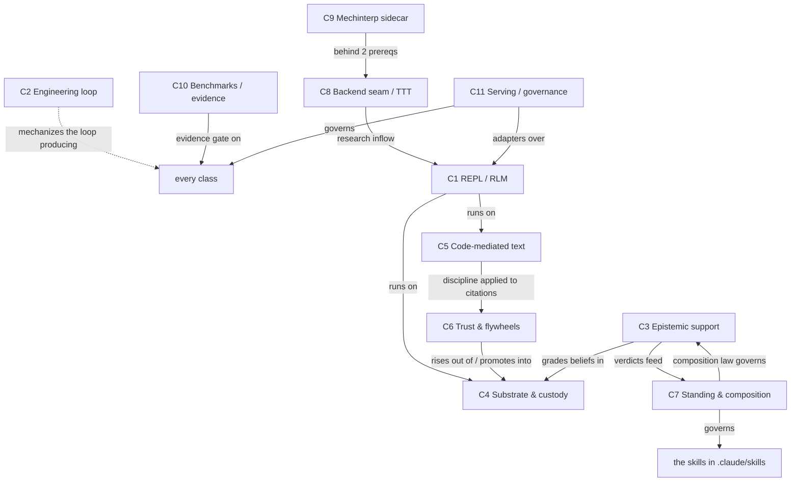

# The Trellis Density-Trellis — a branching chain-of-density map of the whole system

**Status: session orientation artifact, reverse-engineered July 20, 2026 (owner-directed,
Cnid).** PROPOSED / unratified. Subordinate to everything it summarizes: authority order
**code > glossary > prose** binds here with extra force — if any sentence disagrees with
[`GLOSSARY.md`](../GLOSSARY.md), a design record, or code, the other source wins and this file
has a defect. It is **non-authoritative** relative to the collaborator's live task, the
acceptance ledger (`npm run el:activate -- status`), and
[`ORIENTATION.md`](../ORIENTATION.md). Counts and statuses are as of the reverse-engineered
snapshot **`77a7018`**, **updated July 21, 2026 to fold in PR #151** (`7ad6af5` — the
read-time explanation render and the trilemma-steelman adoption), and drift with the week;
treat named mechanisms and pointers as the durable content, numbers as convenience.

> **Rendered companion.** An interactive, theme-aware HTML render of this trellis — the house
> animated SVG banner, the density ramp as a colour gradient, click-to-expand tiers — lives
> beside this file at [`DENSITY-CHAIN.html`](DENSITY-CHAIN.html). The two are kept in sync; this
> markdown is the ground truth, the HTML is the map.

> **Dated maintenance entry — July 21, 2026.** The manual `HANDOFF.md` and root
> roadmap were retired as active authorities after this snapshot. The
> engineering-loop tiers below preserve the controller program's state; current
> repository routing comes from root `AGENTS.md`, the collaborator's live task,
> and [`REPOSITORY_ROOT_CONTRACT.md`](../architecture/REPOSITORY_ROOT_CONTRACT.md).

> **Living document.** Maintained by densification and dated entry, never a silent edit; the
> repo is ground truth (code > glossary > prose) except during a live session, where a
> collaborator's current instruction outranks the committed record — see the authority chain in
> [`README.md`](../../README.md) and [`SESSION_GOVERNANCE.md`](../architecture/SESSION_GOVERNANCE.md).

## Why a *trellis* and not the ladder

[`ORIENTATION.md`](../ORIENTATION.md) already applies chain-of-density (Adams et al. 2023,
[arXiv:2309.04269](https://arxiv.org/abs/2309.04269)) to Trellis as a **single spine**: one
system, summarized five times at a *growing* budget (D0 sentence → D4 index). A trellis is
the other shape — a **branching lattice**: one shared *trunk* plus one *branch per
subsystem class*, and each branch is its own **fixed-length** chain of density. Fixed length
is the engine: a deeper tier is *denser*, never longer. Because salience naturally runs from
the invariant to the specific, each branch's five tiers traverse time on their own —
**general essence (T1) → current shipped machinery (T2–T3) → the frontier and future plans
(T4–T5)** — which is exactly "from the basic level through current features and future
feature plans," eleven times over.

This map was reverse-engineered from the project's **203 commits** (`c454d1a` → `77a7018`)
by eleven parallel read-only sub-agents, one per class, each verifying against source with
locators. The method and the honest gaps are recorded at the end (["Provenance &
method"](#provenance--method)).

## How to read this file (the contract)

1. **The trunk is the whole system, thrice.** Read T0–T2 of the trunk always; it is under
   400 words and orients everything below.
2. **Each branch is conceptually complete at every tier.** What T1 tells you is true and
   self-consistent on its own terms; T2–T5 *add* entities and mechanism, never *correct* a
   shallower tier (the **layer test**). Stop at the first tier that answers your question.
3. **Status labels are load-bearing.** `shipped-pinned` (committed code + a passing drill)
   ≠ `adopted / ratified-as-principle (no build)` ≠ `proposed / recorded-research`. A future
   entity always carries its status. Blurring them is the failure the house has paid for.
4. **Bold marks an entity's first introduction** within its branch; the branch's status
   ledger gives its locator.

---

## The trunk — the whole system at three densities

### Trunk-T0 (what Trellis is, in one sentence)

Trellis is a **personalized composable expert system whose expertise is the user's data** —
not strictly a coding tool, not strictly a RAG system — built as OpenCnid's **Recursive
Language Model runtime**: the user's context, memory, knowledge, and capabilities live as
queryable engine state with enforced provenance, the model reaches all of it only through
code, and because the expertise *is* the user's data the **user is the domain authority** —
Trellis composes its experts, judges, and protocols per question from primitives against that
data and never overrules the user about the user's own domain.

### Trunk-T1 (one paragraph)

The **substrate** turns every source into an immutable SHA-256 **Merkle AST** in PostgreSQL
(Tier 1) and every derived belief into a Neo4j node carrying **sourceNodeIds** — the exact
block hashes it came from (Tier 2); a Tier-3 **workspace** has no trust standing. The
**execution model** is the RLM, and it is *integral*: context is a database, not a scroll,
reached by writing code and calling `llm_query` over slices — it is how Trellis builds the
user's knowledge and how it reasons over it. **Trust moves one way**, upward, only through
operator-gated **promotion**. Two **flywheels** compound — derived facts cached once and
reused (knowledge), and the system's own instructions versioned as **modules governed as
beliefs** (capability). One discipline binds text handling — **code-mediated text**: the
model never counts, never copies. And Trellis's functions — judges, experts, protocols —
**compose per context from primitives**; there is no default cast. Orthogonal to custody
(*where from*), a signed-ternary **standing model** (−1 doubt · 0 belief · +1 fact) grades
*how a claim held up*, moved only by evidence or a **user gate**. The session loop itself is
mechanized by the **engineering loop**.

### Trunk-T2 (the class map — the eleven branches)

The trellis has three tiers of branch, matching how the work grew and how this map was
seeded:

- **Seeds** (the starting points): **C1** REPL & RLM execution · **C2** Engineering loop ·
  **C3** Epistemic support & judges.
- **Branch-out** (the substrate and disciplines the seeds stand on): **C4** Substrate &
  custody · **C5** Code-mediated text (the core pillar) · **C6** Trust pipeline & flywheels ·
  **C7** Standing model & composition from primitives.
- **The frontier classes** (research inflow, evidence, and how it's served): **C8**
  Model-backend seam & test-time-training · **C9** Mechinterp / residual-stream sidecar ·
  **C10** Benchmarks & evidence culture · **C11** Serving surfaces & governance.

The weave: **C1** runs on **C4**/**C5**; **C6** rises out of **C4** and is the only bridge
up into it; **C3** grades **C4**'s beliefs and feeds **C7**'s standing axis; **C7**'s
composition law governs **C3** and the skills; **C2** mechanizes the loop that produces all
of it; **C8**/**C9** are the research inflow into **C1**; **C10** is the evidence gate on
every claim any class makes; **C11** is how the whole thing is served and governed.

### The product thesis (collaborator framing — Matt / Lexideck, July 20 2026)

*Recorded as the collaborator's framing, standing annotated. It sharpens the trunk without
changing committed state — and it is why Trellis is more than an RLM runtime.*

- **The RLM is integral, not incidental.** T0 leads with the target function, but the
  Recursive Language Model is the *engine* of it — how Trellis **builds** the user's knowledge
  and how it **reasons over** it. *(shipped)*
- **The user's knowledge lives as three canonical workspaces — doubts, beliefs, facts — in
  the REPL** (the signed-ternary standing, as *containers* of the user's data, not a scalar on
  a claim). Running reliably on the user's own data is what makes Trellis a strong
  **generalist-agent** candidate. Facts and beliefs exist today as the verified/derived tiers;
  the **doubts workspace as a first-class REPL object is *proposed***
  ([`DOUBTS_WORKSPACE.md`](../architecture/DOUBTS_WORKSPACE.md)). *(mixed — shipped tiers +
  proposed doubts object)*
- **The REPL is never compacted; the model's context must be.** The product turns a language
  model of very limited, lossy context into a more deterministic system with a much less
  limited and *infinitely more preservable* context — because the user's context, memory,
  knowledge, and capabilities live in the REPL as engine state, not in the attention window.
  This is the durability guarantee behind "context is a database, not a scroll." *(design
  thesis)*
- **Trellis becomes its own feature flywheel.** Once running, it should know how to **build
  its own modules** for end users. The mechanism is *internal messaging* — the SPARK / PCF
  map extended **into** Trellis — where **each chain of each internal function composes the
  meta-prompt for its next execution**. The harness makes the model able to reason about how
  it works inside the harness itself, and it is **always honest about what it is** (the
  guard-derived self-model) — a first shipped instance is the **read-time explanation render**
  (`judge_explain`, #151): explainability without model prose in the record. *(direction —
  unifies the capability flywheel C6, spark-steering C6/C7, and the harness self-model
  C1/C5/C11)*

The consequence Matt states: **Trellis is the next generation of intelligence** — because it
makes an LLM's intelligence *reliable and preservable* on the user's own data.

---

## The temporal cross-section — general → current → future, all eleven at once

One row per class. Read a column down for a snapshot of the whole system at one time-depth;
read a row across for one subsystem's arc. This is the trunk of the "current features →
future plans" question.

| Class | Basic (what it *is*) | Current (shipped-pinned) | Frontier (adopted / in-flight, unbuilt) | Future (proposed / open) |
|---|---|---|---|---|
| **C1 REPL/RLM** | model works only through a Python REPL; context = database; `llm_query` over slices | `trellis_agent.py` over `rlms==0.1.3`, goal-loop orchestrator, workspace, A2A/MCP, UPSUM budget gate | harness self-model (principle endorsed, **not authorized**); telemetry allowlist gap | Workstream B surface-descriptors; `rlms` compaction (S2b); paid adoption probe |
| **C2 Engineering loop** | a controller outside the worktree that mechanizes the session loop | EL-00…EL-06 accepted; kernel, observer, prompt compiler, Codex runner, acceptance ledger | EL-10/EL-11 **implemented, not accepted**; EL-07 **blocked** (no paid episode ever) | EL-08 (scheduler/extraction), EL-09 (report ingest); retired handoff→generated-view design |
| **C3 Epistemic support** | a graded (b,d,u) "how has it held up" opinion, sweep-side, writer-blind | support-oracle, judge-panel, judge-intake, judge-convocation, **judge_explain** render (#151) — all zero-paid | composition-per-ceremony (four-role cast **rolled back**, S71); road to Option C | **no live judge run through the engine** (method test-bed-validated); metered promotion-cost test (~$0.02–0.06) |
| **C4 Substrate/custody** | provenance-enforced storage: Merkle ASTs + beliefs bound by `sourceNodeIds` | verified ingest, invalidation sweep, quarantine/recovery, `repo:ingest`, entity resolution | mechanical provenance threading (row 9 closed); ASTRef migration below trigger | CRDT concurrent-edit safety; earned-permanence trust decay; repo-scale extraction |
| **C5 Code-mediated text** | the pillar: the model never counts, never copies | `trellis_textedit`, `trellis_answer`, `get_ast_blocks`, guarded splice, retrieval discipline, structural chunking | guarded-only default (deferred); harness self-model's first named test | py-tree-sitter construct addressing; error-tolerant ingest; superseded-embedding sweep |
| **C6 Flywheels/trust** | three tiers; one-way promotion; derive-once-cache-forever (knowledge + capability) | workspace/lineage, promotion, module registry (#0,#1), grounded authoring | entailment citation-gate (prototyped, off); module #2 **shipped-then-retired** | per-claim citation mapping; tool-bearing modules (unopened); reasoning-templates (contested) |
| **C7 Standing/composition** | signed-ternary standing, user-gated; compose from primitives, no default cast | the skills (`.claude/skills/`); composition-from-primitives lesson | standing model **ratified as principle, no build**; doubts workspace **proposed**; **trilemma steelman adopted** (#151) | hash-kind stamp; recorder+gate promotion; corrosion-bound bootstrap/cost gaps |
| **C8 Backend/TTT** | make the RLM backend configurable; ask whether TTT sparse models help | T1 backend config surface; harness scaffolding (UPSUM/task) | T2 wiring **failed ×3**; hosted Gemini arm proposed; row 13 paused behind EL | R3–R5 rungs (open-sparse baseline, LaCT arms); never a paid TTT run |
| **C9 Mechinterp sidecar** | read/steer a model's functional-affect state in the residual stream | *(nothing built)* — one docs-only record | future project; behind two prereqs (hosted arm → local backend) | instrument/actuator/mixture ladder; judge-actuation hazard held outside repo |
| **C10 Benchmarks/evidence** | a claim without a dated report is a hypothesis; counts + correctness together | OOLONG-Pairs v1/v2, update/poison/scale drills, Phase 4/5 (measured) | v2 paid run not executed; effective-context & citation A/B (small-n) | real TREC import; adversarial corpora; 10k-scale sweeps; variance reporting; frozen-errors |
| **C11 Serving/governance** | operator-gated surfaces out; project governance within | MCP client, A2A server (byte-identical when off); session-governance scoping | MCP **server** surface (design record); harness self-model (principle) | O1–O5 server decisions; dual client+server role; trace workstream phases 0–4 |

---

## The branches

Each branch is a self-contained five-tier chain of density at a held ~90 words per tier.

### Seed classes

#### C1 — the REPL & the RLM execution model
*Charter: the Python REPL as the model's only interface — context as database, `llm_query`
self-calls over slices, one process per task, and the tool-free orchestrator that decomposes
goals into bounded RLM tasks.*

- **T1 — essence.** Trellis's execution model is a **Recursive Language Model (RLM)** — MIT
  CSAIL's formulation taken as system design: instead of retrieved passages pasted into a
  prompt, the model runs inside a **persistent Python REPL** where context is data in a
  stateful namespace, writing code that chunks, queries, and calls itself (**`llm_query`**)
  as a subroutine over slices, then aggregates programmatically. Each task executes as **one
  Python process**. Above single tasks, a **tool-free orchestrator** decomposes one goal
  into many bounded RLM sub-tasks and routes working state by reference; an **async queue
  layer** isolates every LLM call from request handling.
- **T2 — current machinery.** The RLM runs via **`trellis_agent.py`** (driving the
  **`rlms`** library, `RLM_SYSTEM_PROMPT` extended not replaced) with tools injected into
  the REPL's `custom_tools` seam: **`trellis_task`** (operator instructions, uuid-wrapped),
  **`trellis_upsum`** (a rewritten, budgeted running-state dict), database and workspace
  tools, and the write path **`write_derived_insight`**. Behavior composes from a **kernel
  base plus userspace modules**, hash-pinned. Above single tasks, the **goal_loop
  orchestrator** (tool-free, planner-prompted, Zod-validated) decomposes goals into RLM
  sub-tasks over `rlm_queue`, dispatchable externally via **A2A** and operator **MCP** tools,
  streamed as `TRELLIS_RESULT`/SSE envelopes.
- **T3 — with receipts.** Phase 3 (`10895a8`, 2026-06-30) shipped `trellis_agent.py`,
  spawned per task by **`rlm_worker.ts`**, plus `trellis_tools.py`
  (`TrellisNeo4j`/`TrellisPostgres`) over **`rlms==0.1.3`**. Session 9 (`13dfe32`) added
  `goal_loop`; Session 11 (`264b007`) exposed it over A2A; Session 14 (`9f25a5b`) landed the
  **Tier-3 workspace**. Bounds (`AGENT_MAX_ITERATIONS_PER_GOAL`=4, `…TASKS_PER_GOAL`=8,
  `…TASK_MAX_ITERATIONS`=5) are Zod-validated, zero-paid-drilled (`test:agent-loop`,
  `test:a2a`, `test:rlm-workspace`, `test:rlm-sandbox`, `test:rlm-mcp`). Session 48 measured
  a **402,781-token / 14-iteration transcript-growth failure**, motivating S1/S3 (#95) and
  S2a **UPSUM** (#98; `UPSUM_BUDGET`=2000).
- **T4 — the frontier.** July 19, 2026 (#135) closed a posture gap rule 8 flags: UPSUM's
  budget and task precedence were prose-only. `trellis_upsum.commit()/size()/state()` now
  REFUSES over-budget state by canonical serialization; `trellis_task.verify()` adjudicates
  instruction-shaped data against the run's uuid tag (informs, never gates — deliberately
  uncoupled from decisive steps) and reports `foreignRunTag`. New telemetry (`task_reads`,
  `upsum_commits`, `upsum_*_refusals`) makes reuse measurable for the first time. **S2b**
  (`rlms`' built-in compaction) remains measured-but-never-enabled, its own owner-gated
  increment.
- **T5 — future plans.** **HARNESS_SELF_MODEL.md** (Murphy + owner) generalizes #135:
  interior surfaces as free meta-prompt composition primitives — "Explainable AI for the
  AI," a bounded composed read of the harness's expectations derived from the guard
  predicates enforcing it. Status: PRINCIPLE ENDORSED, IMPLEMENTATION NOT AUTHORIZED. Its
  **Phase 0** (#136) falsified its plan: **Finding 0** — zero-paid harnesses record the
  script, not model adoption, so adoption needs a paid probe; **Finding 1** — the telemetry
  allowlist drops the July-19 counters on the worker path. Phases 1–4 and **Workstream B**
  stay unbuilt, separately owner-gated.

*Key entities & status:* RLM · REPL · `llm_query` · orchestrator · workspace · A2A · MCP —
all **shipped-pinned**; harness self-model — **principle-only**; telemetry gap — **confirmed
open**. *Cross-links:* [[C4]] (DB tools + `sourceNodeIds` gate), [[C6]]
(workspace/promotion/modules), [[C5]] (shared #135 pass), [[C11]] (A2A/MCP serving).

#### C2 — the engineering loop (EL)
*Charter: the repository-owned, out-of-process, protected-state controller that mechanizes
the session loop itself — observing the repo, compiling prompts, running bounded agent
episodes, verifying deterministically, gating every protected action behind human approval.*

- **T1 — essence.** The **engineering loop** replaces prose-authored session handoffs with a
  deterministic controller owning workflow truth outside the agent-writable worktree. It
  observes Git and command state as evidence, compiles small typed context packets per role,
  runs bounded coding-agent episodes, verifies acceptance by code rather than model claim,
  and pauses at named protected actions (paid calls, destructive ops, push, merge,
  self-modification) for explicit human approval. Model output is always an observation;
  controller-observed evidence and human authority alone decide state transitions.
  At the snapshot date, `HANDOFF.md` stayed authoritative pending a measured
  migration verdict; the July 21 maintenance entry above supersedes that routing.
- **T2 — current machinery.** Named components under `tools/engineering-loop/src/`:
  **control kernel** (`kernel.ts`, `state_machine.ts`, `domain.ts` — 11 states, 132-pair
  transition matrix, 41 allowed), **repository observer** (`repo_observer.ts`), **prompt
  compiler** (`prompt_compiler.ts` — planner/implementer/checker/recovery roles), **Codex
  app-server AgentRunner** (`runners/`, pinned `codex-app-server-jsonl:v2@0.144.2`),
  **verifier**/**checker**/**recovery** (deterministic gates), and the **acceptance ledger**
  (`acceptance_ledger.ts`, `activate.ts`) — append-only, integrity-linked, with disjoint
  `ledger_recovery` (content) vs `re_genesis` (chain) ceremonies, run via `npm run
  el:activate`.
- **T3 — with receipts.** Sequential features **EL-00**→**EL-06** shipped and are
  owner-accepted (roadmap test counts: EL-02 916/92 files … EL-06 1,161/105 — all
  zero-model, zero-paid). **EL-10** (`6d5670d`, `b263ae6`, `40b0ff6`; #111/#112/#117)
  activated the real controller (protected roots at
  `D:\trellis-protected\engineering-loop\{ledger,state,channel}`), seeded generation-0 with
  11 owner-approved records, flipped `statusAuthority` to `protected_controller_state`.
  **EL-11** (`841f875`/`272a18e`; #113/#114) added `recordAcceptanceChange` and closed
  EL-10's reachable-producer gap. SPEC.md: 116/116 requirements mapped.
- **T4 — the frontier.** EL-10 and **EL-11 are IMPLEMENTED but NOT ACCEPTED** — built,
  tested, merged, but owner acceptance is unrecorded in the ledger (a self-referential gap:
  the machinery that records acceptance has not had its own acceptance recorded). **EL-07**
  (bounded pilot, repeated evaluation, generated-view migration decision) is **BLOCKED**: its
  preflight requires EL-10 accepted, an EL-11 status, and an explicit owner unblock, none
  recorded — `next_feature` resolves to EL-10/null, not EL-07. The former HANDOFF Appendix B
  froze an EL-07 stage-1 pilot-plan (`EL07_PILOT_PLAN.md`) as its next objective, via
  three owner ceremonies.
- **T5 — future plans.** Deferred, PROPOSED/UNRATIFIED, requiring fresh owner proposal after
  EL-07: **EL-08** (tracker polling, scheduler, concurrency, multi-machine durability, or
  standalone extraction) and **EL-09** (sanitized verified ingestion of completed-run
  reports into Trellis, explicitly NOT feeding the live control path). The
  The preserved generated-view migration design requires EL-07 to clear pre-stated thresholds,
  perfect protected-gate adversarial tests, no acceptance-reliability regression, and human
  transcript review before an owner adopt/revise/reject verdict. **No paid EL-07 trial has
  ever run**; the $5/run cap remains untested against a real agent episode.

*Key entities & status:* EL-00…EL-06 — **accepted**; kernel/observer/compiler/runner/ledger
— **shipped-pinned**; EL-10/EL-11 — **implemented, not accepted**; EL-07 — **blocked**;
EL-08/EL-09 — **proposed**. *Cross-links:* [[C11]] (harness self-model & session-governance),
[[C3]] (EL's approval-channel is the belief-promotion-gate precedent).

#### C3 — epistemic support & judges
*Charter: the graded, sweep-side "how has it held up" opinion over Trellis beliefs, computed
from judged verdicts and never asserted or seen by the writer.*

- **T1 — essence.** Trellis beliefs carry two orthogonal axes: **custody** (where a claim
  came from, structurally enforced) and **epistemic support** (how it has held up) — a
  graded, decaying opinion of **belief, disbelief, and uncertainty** (b+d+u=1), computed
  sweep-side from **judged events**, never asserted by the writer and never visible to it.
  Judges emit **drawback|clean|abstain** verdicts; clean means "no known drawback found,"
  never correctness. Support never mints custody; custody never implies support. Judges are
  **composed per ceremony** from primitives, never a standing cast. **No live judge run has
  ever executed *through the Trellis engine port*** — though the composition *method* it ports
  is battle-tested in the Claude Code test bed; the **paid queue** stays on hold.
- **T2 — current machinery.** Opinion (b,d,u) is computed under **v1 support arithmetic**
  (evidence masses r/s, half-life decay, a fail-closed **validity gate**) and a **metric
  grammar** (leaf/any/all/kofk). A **judge panel** structures four differently-blind role
  slots — **grounding, coherence, corroboration, audit** — with position-debiased audit.
  **Judge intake** (selection, ratification, clean-context prompt assembly, a write-once
  store) feeds **judge convocation** (registration, a **support_sweep** job, a gated spawn
  boundary, a **ratification queue**). An **automation ladder** keeps scoring automated but
  trust-elevation human-gated. No live run; paid queue on hold.
- **T3 — with receipts.** Support arithmetic in **`support.ts`** + **`support_metrics.ts`**,
  pinned by `test:support-oracle` (7 sections/106 checks; #119/`2da290b`). **`judge_panel.ts`**
  + **`judge_audit.ts`** pin structural blindness via `test:judge-panel` (10 sections/182;
  #124/`22ce260`); **RECONCILIATION.md** ratified verdicts July 18 (#131). **`judge_intake.ts`**
  pins via `test:judge-intake` (13 sections; #133). **`judge_convocation_store.ts`** +
  **`support_sweep.ts`** + **`judge_spawn.ts`** + the **judge_records** table pin via
  `test:judge-convocation` (23 sections/140; #134, Option-B). **`judge_explain.ts`** (#151,
  July 21) renders read-time explanations from stored verdict fields — seat, verdict, humanized
  drawback class, its qualified-parameter dimension, abstain reason, typed conflicts — pure, no
  model, no stored byte; pinned by `judge_explain.test.ts` (9), graph suite 179/179; wired into
  `support:report`. No live judge run through the Trellis engine ever; the method is validated
  in the Claude Code test bed; paid queue ON HOLD.
- **T4 — the frontier.** **Session 71** (#137/`8926e12`) found the four role slots had
  calcified from teaching examples into a standing cast across seven documents and rolled the
  build back (judge_records emptied, fixtures deleted, recoverable at `c9d417d`).
  **JUDGE_COMPOSITION_CEREMONY.md** now governs: judges, taxonomies, and anchors compose per
  candidate from an isolated agent's descriptive REPL characterization — anonymity not
  exclusion, judges see the claim only forward-pass, compositions write-once and never
  reused. The **judge-composition** skill shipped the pattern. §11.2 names the **road to
  Option C**: paid-queue reopening, per-run approval, the unbuilt **J3 live evidence
  gatherer**, and a registered **metered promotion-cost test** (~$0.02–$0.06/belief).
- **T5 — future plans.** **PRIMITIVE_ENCODING_AUDIT.md** (July 19–20) found the four S10
  registries do no computational work (`qualifiedParameters` are unvalidated free strings)
  and flagged an abstention-vocabulary/claim-kind mismatch and a disposition grammar unable
  to type a promotion depending on a merit-refused row — each owner-owed, none built.
  **STANDING_MODEL.md** ratifies the sibling principle that the panel only emits signed
  findings — the user gates every standing move — as principle, authorizing no code removal.
  The **judge-actuation sycophancy hazard** has a held, undesigned answer, deliberately kept
  outside this repository.

*Key entities & status:* support-oracle · judge-panel · judge-intake · judge-convocation ·
**judge_explain** (read-time explanation render, #151) — all **shipped-pinned (zero-paid)**;
four-role cast — **rolled back**; **no live judge run ever** *through the Trellis engine*, paid
queue **on hold**. The render is explainability *without model prose in the record* — the
engine-side, code-mediated form of Matt's "always honest about what it is," landed first in the
judges area (Option B, a validated `rationaleSpan` *address*, deferred; Option C, a
model-authored free-text rationale, rejected for the record layer).

> **Method vs port (owner note, July 20 2026).** The judge/composition *method* is heavily
> validated in the **Claude Code test bed** (self-play + judge-composition, ~2 days of hard
> use) — Claude Code being Trellis's toy-model test bed. What is unexercised is the *Trellis
> engine port*. So the only live tests worth their cost are **engine-fidelity** checks, not
> method-efficacy ones (rule 20 bars "does the prompt help"): **(i) reachability** — does
> `judge_spawn` actually spawn the intake-selected judges on a real candidate ("correct ≠
> reachable")? **(ii) equivalence** — does a live-model `support_sweep` reproduce the oracle
> drill's *scripted* (b,d,u) on the same events? **(iii)** the registered **metered
> promotion-cost run** (belief→fact, ≈$0.02–0.06), owner-gated, ≤$5. All three are
> reachability/equivalence, which the rule-20 carve-out permits; none re-litigate the method.

*Cross-links:* [[C7]] (verdicts feed the signed-ternary standing the user gates), [[C4]]
(grades C4's beliefs via the sweep), [[C2]] (EL approval-channel precedent).

### Branch-out classes

#### C4 — the substrate & custody
*Charter: the provenance-enforced storage layer — verified ingest, Merkle-hashed Tier-1
bytes, Tier-2 beliefs bound by `sourceNodeIds`, and the quarantine/recovery machinery that
keeps beliefs honest when bytes change.*

- **T1 — essence.** Trellis's substrate is the provenance-enforced storage every other layer
  stands on. Every source becomes an immutable, content-addressed **SHA-256 Merkle AST**
  persisted in **PostgreSQL** (**Tier 1**) through a **verified ingest transaction**:
  persist, read-back re-hash, membership, registration, in-transaction Merkle diff. Derived
  semantic beliefs — entities, relationships — live in **Neo4j** (**Tier 2**) carrying
  **sourceNodeIds**, exact block hashes proving origin, never correctness. When bytes change,
  the diff identifies exactly what moved; an **invalidation sweep** quarantines (never
  deletes) beliefs whose evidence died, recoverable only by re-deriving from live bytes.
  Entity identity is immutable; equivalence is a separate, overlay belief.
- **T2 — current machinery.** The transaction writes **`ast_nodes`**/**`documents`**/
  **`document_nodes`** in one PostgreSQL transaction. Two commuting transitions govern belief
  state: **applyQuarantineSweep** marks **contested** and moves dead hashes to
  **orphanedSourceIds** when sourceNodeIds intersect an orphan set; **applyRederivation**
  clears contested and stamps **rederivedAt** when live bytes re-assert a fact —
  order-independent by construction. **Repository ingestion** (`repo:ingest`) turns a
  codebase into per-file ingests recorded as durable **snapshots**; deleted paths receive
  **tombstones**. Entity identity is SHA-256(lowercase name); equivalence is an overlay
  **SAME_AS**/**DISTINCT_FROM** edge from **entity resolution**.
- **T3 — with receipts.** `src/core/ingestion/ingest_document.ts` (Session 8, #30) and
  `src/core/graph/{provenance,invalidation}.ts` (Phase 4, `1efd97f`) implement transaction
  and sweep. Measured (**UPDATE_DRILL_REPORT**): a 5% mutation (11/220 questions) quarantined
  exactly 11 facts, recall/precision **1.000**, post-update F1 **1.000**, $0.73 vs $0.80
  rebuild. **SCALE_PROVENANCE_REPORT**: 300 docs, 286-hash hub, sweep latency **1.42×** vs
  **5.77×** fact growth. `test:repo-ingest` (**REPOSITORY_INGESTION_REPORT**, 45 checks) and
  `test:entity-resolution` (Session 5, #27) pin resolution zero-LLM.
- **T4 — the frontier.** **Mechanical provenance threading** (PROVENANCE_THREADING.md,
  Sessions 30–32, #72–74, "row 9 closed") closes the write-path transcription channel —
  citable sourceNodeIds constrained to a run's actual **`retrieved(run)`** set — but the
  semantic-support residual (does a cited block entail the claim?) stays a **sampled
  entailment detector**, never a total gate: an architectural limit, not a gap.
  **`ASTRef`/`EVIDENCED_BY`** indexed-anchor storage is proposed but explicitly not migrated
  (286/1,000-hash and 1.42×/1.5× latency triggers both under threshold). **Structural
  chunking** (tree-sitter/cAST) shipped through increment 2 zero-paid; a full-repo
  `--extract changed` self-ingest (~2,532 blocks, ~1.3M tokens) remains owner-gated, unrun.
- **T5 — future plans.** **CRDT** integration (LSEQ/YATA, MATHEMATICAL_FOUNDATIONS.md §3) is
  proposed, unbuilt, for concurrent-edit AST safety — no code, no drill. **Earned-permanence
  trust decay** (per-edge `verified_count` accrual, lazy rubric-version re-examination) is
  roadmap, replacing today's cache-TTL-of-forever; quarantine-over-deletion is the only piece
  shipped. Repository-scale extraction stays gated: three pilot prerequisites landed zero-paid
  (Session 25), but **no owner-approved whole-repository `changed` run has executed**.
  Session-governance scoping (#126) reaffirms substrate provenance law binds stored beliefs
  and code paths only, not session prose.

*Key entities & status:* Merkle AST · verified ingest · invalidation sweep ·
quarantine/recovery · `repo:ingest` · entity resolution — all **shipped-pinned, measured**;
ASTRef migration · CRDT · trust decay — **proposed**; repo-scale extraction — **pilot-ready,
no approved run**. *Cross-links:* [[C5]] (`retrieved(run)` enforces never-copies over these
addresses), [[C6]] (`promote` is the only Tier-3→Tier-1 door), [[C3]] (entailment detector
feeds judged events).

#### C5 — code-mediated text (the core pillar)
*Charter: the RLM discipline whereby text locations are engine-computed and returned by query
while existing bytes move only through code, never through model attention.*

- **T1 — essence.** **Code-mediated text** is Trellis's core pillar: **the model never
  counts, and the model never copies**. Text loaded into an RLM run enters queryable
  structures, not scrollback; a location (line index, hash, block id) is *computed by the
  engine and returned by a query*, never estimated by attention over a dump; existing bytes
  are moved by *code* — sliced, spliced, joined — never re-typed. The model's only legitimate
  outputs are genuinely new text and the code manipulating everything else. This unifies
  **localization error** and **transcription error** as one pathology: attention doing code's
  job. Enforcement is tooling shape, not prompt text.
- **T2 — current machinery.** Shipped: **`trellis_textedit`** (`load`/`locate`/`splice`/
  `diff`/`write_back`, hash-guarded); **`trellis_answer.submit`** (by-reference final-answer
  channel, refuses bare literals); **`get_ast_blocks`**/**`trellis_blocks.py`**
  (boundary-aware, document-ordered accessor, TS-parity pinned); the **guarded splice
  family** (`replace_lines`/`insert_lines`/`delete_lines`, anchor-verified,
  minimal-span-refusing); **retrieval discipline** (held-state dedup + per-run fetch budget);
  **structural chunking** (cAST-style tree-sitter segmentation) with the **`search_ast_nodes`
  liveness filter** closing dead-block pollution.
- **T3 — with receipts.** Ratified July 9, 2026, **CODE_MEDIATED_TEXT.md** (`15b483d`, #54);
  toolkit **`trellis_textedit.py`** landed Session 20 (`95ff8c7`, #55). Effective-context
  probe (Sessions 21–24, #59–#62): round 4 measured **0/36 localization misses vs round 3's
  7/30** after `get_ast_blocks`. **STRUCTURAL_SPLICE.md** (Session 41, `ec3f824`, #83): the
  guarded family closes retype-splice neighbor-deletion; **`TRELLIS_TEXTEDIT_GUARDED_ONLY`**
  off-switch added July 19. Retrieval discipline (`648dc02`, #75) measured 25/25 correct,
  $1.96. WALL_CLOCK_TEXT_OPS_REPORT: plain lists win splice-shaped insertion at every size
  100k–8M tokens.
- **T4 — the frontier.** **HARNESS_SELF_MODEL.md** (July 19; principle ENDORSED,
  implementation NOT authorized) generalizes §2.8's enforcement posture: interior surfaces as
  *free meta-prompt composition primitives*. Its pre-stated first test names
  **`trellis_textedit`** explicitly — derive its addendum from a full descriptor shape, pin
  byte-identity — unbuilt. **Phase 0** ran read-only July 19 (`cb12a53`, #136) and found a
  confirmed, unfixed gap: the worker-path telemetry allowlist (`parseTelemetryLine`, nine
  fixed fields) **drops** the textedit/guarded/raw-splice/answer counters — an observability
  gap, not a correctness bug. Phase 0b (paid adoption measurement) has not run.
- **T5 — future plans.** Proposed/unratified, named but unbuilt: **py-tree-sitter** for
  construct-granular splice addressing (rejected Session 41, revisit trigger recorded);
  **making guarded-only the DEFAULT** (deferred as its own owner-gated measured increment,
  §9.3); **error-tolerant ingestion of broken files** and **prose/stage-1b chunking** (out of
  scope in STRUCTURAL_CHUNKING.md §8); a **superseded-embedding sweep** (vs the shipped
  liveness filter, on the owner menu, unchosen). HARNESS_SELF_MODEL.md's 5-phase ladder is
  gated behind the unrun Phase 0b adoption measurement.

*Key entities & status:* pillar · textedit · answer-channel · `get_ast_blocks` ·
guarded-splice · retrieval discipline · structural chunking — all **shipped-pinned**; harness
self-model — **principle-only**; telemetry gap — **confirmed open**. *Cross-links:* [[C4]]
(ingest already compliant; toolkit ops carry no provenance), [[C6]] (grounded authoring = the
pillar applied to citations), [[C11]] (harness self-model seed).

#### C6 — the trust pipeline & the two flywheels
*Charter: the operator-gated one-way bridge from ephemeral Tier-3 working memory to citable
Tier-1 substrate, and the two flywheels (knowledge, capability) that compound on top of it.*

- **T1 — essence.** Trellis assigns three trust tiers to everything the RLM touches: **Tier
  1** (immutable, SHA-256 Merkle-hashed AST bytes), **Tier 2** (provenance-anchored derived
  beliefs), **Tier 3** (ephemeral working memory with **no trust standing**). Trust rises
  only through **operator-gated promotion**, never autonomously. Two flywheels ride this
  substrate: the **knowledge flywheel** (derive a fact once, cache it with provenance, reuse
  forever) and the **capability flywheel** (author a cognitive protocol once as a versioned
  module, govern it like a belief, compose it forever). Both are "derive once, cache with a
  chain of custody, reuse."
- **T2 — current machinery.** The **Tier-3 workspace** captures every external-tool result as
  an **origin-stamped segment** (uuid, server/tool/args, bytes) mechanically inside the
  wrapper call, returning a thin **stub**. Workspaces **serialize/park/seed** across a goal's
  tasks (lineage, never a blackboard). A segment reaches Tier 1 only via operator-run
  **promotion** — the sole Tier-3→Tier-1 bridge. Cognitive protocols compose from a **module
  registry** (sparse selection, sha256-pinned prompt). **Grounded authoring** is a
  kernel-owned mode letting the RLM draft a module from a fixed, promoted corpus, remediating
  an observed **provenance-laundering** incident.
- **T3 — with receipts.** Sessions 14–19 (#40–#50) shipped: workspace (`trellis_workspace.py`,
  `test:rlm-workspace`, 83→106 checks), write-path hardening, module registry
  (`trellis_modules.py`, `modules/spatial-flywheel` = module #0, `test:modules`), lineage
  (Redis park/seed), promotion (`src/core/promotion/plan_promotion.ts`, `npm run promote`,
  `test:promotion` 41 checks), manifest-as-graph-entity registration (`modules:register/
  :verify`, `test:module-lifecycle`). Module #1 `workspace-discipline` (#45, now v2/31 hashes)
  laundered citations live; GROUNDED_AUTHORING.md (#49/#50) fixed it (`modules:author`,
  `ANCHOR_COVERAGE_THRESHOLD=0.3`). FLYWHEEL_EXPLAINER: OOLONG sub-LLM calls **5→0**.
- **T4 — the frontier.** PROVENANCE_CITATION_AB_REPORT (#50 follow-on, ≈$10 paid) measured
  laundering as incentive-driven, not dispositional: structural checks (existence, readership)
  miss it; only semantic entailment (`TRELLIS_CITATION_ENTAIL`, §7 v3) catches it, reserved
  class-gated/sampled. Module #2 `estimation-discipline` (#64, authored via grounded
  authoring) was measured (#68, $2.40 paid) to move behavior but fail its token criterion, and
  was **retired outright** the same day (`status: retired`, loader refuses composition) —
  ending the prompt-module era as a behavioral-fix mechanism. `modules/reasoning-templates`
  (#103) ships **contested**: proposed, unpromoted research, non-composing.
- **T5 — future plans.** The owner's permanent ratified direction from module #2's
  retirement: **behavioral failure classes close by tooling shape, not prompt modules**
  (re-ratified July 20 as AGENTS.md rule 20, with a carve-out for live-vs-proposed
  equivalence testing). Per-claim citation mapping (`kernelCompat: 2`) and embedding-based
  derivation checking (§7 v2) are explicitly **deferred, not scheduled**. `reasoning-templates`
  awaits research promotion before it can leave `contested`. Tool-bearing module classes
  (§9.3) remain **unopened** — only protocol modules exist to date.

*Key entities & status:* three-tier trust · workspace · lineage · promotion · module registry
(#0,#1) · grounded authoring — **shipped-pinned**; module #2 — **shipped-then-retired**;
reasoning-templates — **contested/proposed**. *Cross-links:* [[C4]] (promotion writes through
verified ingest; the sweep contests registered modules), [[C5]] (grounded authoring = pillar
applied to citations), [[C10]] (flywheel economics measured).

#### C7 — the standing model & composition from primitives
*Charter: the signed-ternary axis that grades how a claim has held up, gated by the user
rather than the panel, running on judges and skills composed fresh from categoric primitives
with no default cast.*

- **T1 — essence.** Trellis grades a claim's standing on a **signed ternary** — doubt (−1),
  belief (0), fact (+1) — orthogonal to custody. Standing moves toward fact only by evidence
  or a **user gate**, never by a panel alone, because the user is the domain authority over
  their own data (the target function: Trellis is a personalized composable expert system
  whose expertise *is* the user's data). Everything that evaluates a claim — judges,
  defeaters, skills — **composes per context from categoric primitives** rather than running
  a fixed cast; an instance hardened into a schema silently becomes law.
- **T2 — current machinery.** Mode/verdict/standing are one vocabulary at two times: a
  per-seat verdict (`clean|drawback|abstain`) is the delta's sign composing against prior
  standing. **User-gated ratification**: a candidate the panel cannot dispute is ratified
  carrying a qualifier meaning only the user's authority backs it; the qualifier lives in the
  address as a **hash kind**. The **meet rule**: a derived claim's hash kind is the meet of
  its dependencies' — no laundering in one hop. The **panel never moves standing** (carve-out:
  principle only, no code removal). Composition runs through **`.claude/skills/`**
  (judge-composition, complexity-convocation, self-play, spark-steering).
- **T3 — with receipts.** **Session 71** (`8926e12`, #137) found four "teaching-example"
  judge roles had hardened into a default cast across seven docs; rolled the roster back,
  wrote **COMPOSITION_FROM_PRIMITIVES.md** ("frames invariant, instances never; no default
  cast"), shipped **judge-composition** as a skill. `e5e7844` (#138) ratified
  **STANDING_MODEL.md** and **DOUBTS_WORKSPACE.md** (Groups A+B) as *principle, no build*.
  **JUDGE_COMPOSITION_GAME.md** §6's twenty rules bind unchanged. `fe5c13d` (#139) and
  `31dde1b` (#140) added self-play and complexity-convocation, both clean-room validated.
  `758356b`/`77a7018` (#144/#145) relocated + SPARK-minified skills into `.claude/skills/`
  (net −2.4%, 0 regressions). **spark-steering** (`.claude/skills/spark-steering/`) is the
  **PCF/SPARK map** from *tooling* shape to *prompt* shape, verified on **7 of the 8** repo
  skills — the companion to "failures close by tooling, not prompts": the mapping is itself a
  tool, not an exhortation.
- **T4 — the frontier.** STANDING_MODEL.md is **RATIFIED-AS-PRINCIPLE, NO BUILD** — the
  hash-kind stamp layout, the recorder-plus-gate promotion reduction, and re-deriving the
  applicability gate onto locus intersection are each a *separately gated bounded build*,
  unbuilt. DOUBTS_WORKSPACE is **PROPOSED**: `-1` is currently a residual flag
  (`entailment_detection.ts:280`), not a constructed object with body/identity/author. Its
  corrosion bound (§2, "a doubt may cite facts only") was **empirically validated on its
  positive-citation core** (13/14 flat-earth arguments rejected, zero false admissions) but
  the **bootstrap and cost gaps remain open**; §2 as a whole is not ratified.
- **T5 — future plans.** *Correction after owner double-check (July 20):* most doubts-workspace
  critiques **did collapse** — the July-20 §14 dated entry ratified §12.3's membership rule and
  adopted it into §5/§7, §12.2 resolved the relevance gap, and the positive-citation core passed
  a blind 13/14 flat-earth test. The genuinely-open residue is narrower and **kept open by
  design**: §11's **bootstrap** (laundering) and **cost/volume** gaps — because ratifying the
  whole bound before they close would be the exact instance-promotion failure the program guards
  against — plus §7's undercut branch (undetermined). *(If self-play closed the bootstrap/cost
  gaps in the test bed too, that result isn't written back into `DOUBTS_WORKSPACE.md` yet.)* The
  **trilemma steelman** — *no judging system is simultaneously universal, governable, and
  primitive-free; composition-from-primitives is the unique design occupying universal ∩
  governable* — was **adopted as the program's thesis formulation** (#151, July 21; collaborator
  accepts, owner ratifies), carrying its **decomposability falsifier unchanged**: representational
  holism (§8's shared empirical bet, linking judges, the functional-infinity claim, and the
  residual-stream sidecar) still breaks the thesis, settled empirically, never argued — adoption
  states the frame the bet is about, it does not resolve the bet.

*Key entities & status:* standing model · user gate · meet rule · panel-never-moves —
**ratified as principle, no build**; composition-from-primitives — **foundational lesson**;
**trilemma steelman** (universal ∩ governable) — **adopted thesis formulation (#151)**,
decomposability falsifier open; the skills — **shipped-pinned**; doubts workspace —
**proposed** (−1 still a residual flag).
*Cross-links:* [[C3]] (support arithmetic sits underneath; verdicts feed standing), [[C9]]
(the decomposability bet links to the sidecar), [[all]] (composition governs judges/experts/
protocols everywhere).

### The frontier classes

#### C8 — the model-backend seam & the test-time-training research track
*Charter: the design-record and recorded-increment trail for whether Trellis's RLM completion
backend can become configurable, and whether test-time-trained sparse models would improve
it.*

- **T1 — essence.** Trellis's RLM runs a closed API model hardcoded at two construction
  sites; the **model-backend seam** is a proposed config surface that would make backend
  choice expressible instead of hardcoded. **Test-time-training (TTT)** is roadmap row 13: an
  owner-gated research track asking whether fast-weight adaptation on open-weight sparse
  models, layered under the RLM's REPL-as-environment design, improves protocol adherence or
  response quality. Neither TTT nor a served alternate backend runs today. Every TTT/seam
  artifact is research record, proposal, or partial config plumbing — never a runtime
  capability.
- **T2 — current machinery.** The seam's Phase-0 machinery: **R2a**, the backend-seam census
  (read-only; confirmed `rlms==0.1.3` accepts backend/base_url kwargs without library
  modification), and **R2b**, the **MODEL_BACKEND_SEAM.md** record (four `TRELLIS_RLM_*`
  config keys, T1–T4 increment skeletons, a root/worker/embedder split).
  **RLM_HARNESS_SCAFFOLDING.md**, a related design record, specifies **UPSUM** and
  uuid-wrapped **trellis_task** isolation, landed as scaffolding that now serves every RLM
  run. The **reasoning-templates module** is a separate, proposed, unregistered L-axis
  library: status `contested`, empty sourceNodeIds, never composed.
- **T3 — with receipts.** Of the seam's T-series only **T1** (backend config surface) LANDED
  — Session 50, #95 (`1878e89`), first-shot on retry after Session 48's T1 FAILED ($2.11,
  #92, evidence-contract miss) and Session 49's quota-blocked $0.0000 attempt (#93). Harness
  scaffolding (S1 + S2a UPSUM + S3) landed the same commit, refined under #98, then hardened
  into engine gates (**trellis_upsum**, **trellis_task.verify**) by #135. **T2** (buildAgentEnv
  wiring) **FAILED three straight sessions** (#99/#100/#101) as clean self-refusals with zero
  code landed, each a distinct editing-execution class.
- **T4 — the frontier.** T2 sits PAUSED pending an unimplemented **engine-resolved-anchor**
  guarded-insert tool (specified in HANDOFF Appendix A after the third-strike escalation,
  never built); T3 (construction-site rewire) and T4 (fixture-endpoint drill) have zero code.
  The **hosted-comparison-arm proposal** (**MODEL_BACKEND_HOSTED_ARM.md**, #110) asks the
  owner to admit a **Gemini-3.5-Flash** arm beside R3's open-sparse-checkpoint arm through the
  same unbuilt seam — zero implementation, downstream of paused T2. The **EL program** is now
  owner-prioritized ahead of T2; row 13 resumes only on reprioritization.
- **T5 — future plans.** Unreached TTT rungs: **R3** (open-sparse baseline, gating on protocol
  competence) then **R4** (paired TTT arms on collaborator-selected **LaCT**,
  [arXiv:2505.23884], collaborator-side) then **R5** (meta-prompt fast-state). The reliance
  claim splits **C1** SUPPORTED (retrofit efficiency), **C2** EXTRAPOLATED (the load-bearing
  unmeasured improvement gap R3/R4 exist to close), **C3** UNTESTED (meta-prompt adherence).
  HARNESS_SELF_MODEL.md's generalized bijection principle is owner-endorsed but implementation
  NOT authorized. **No TTT run, hosted arm, or worker-transport split has ever executed**;
  every downstream rung needs its own fresh owner gate.

*Key entities & status:* T1 config surface · harness scaffolding (UPSUM/task) —
**shipped-pinned**; R2a/R2b · TTT track · T2 (failed ×3) — **recorded-research**; hosted arm ·
R3–R5 · reasoning-templates — **proposed/contested**. **No dated benchmark exists** for this
class. *Cross-links:* [[C5]] (UPSUM/anchor derive from "never counts"), [[C2]] (EL prioritized
ahead → row 13 paused), [[C9]] (the sidecar sits behind this class's prerequisites).

#### C9 — mechinterp & the residual-stream sidecar
*Charter: a recorded, owner-directed FUTURE-PROJECT engineering thesis for reading and
steering a served model's functional-affect state — almost entirely unbuilt.*

- **T1 — essence.** Trellis's mechanistic-interpretability direction is a recorded **FUTURE
  PROJECT**, not shipped machinery: an RLM-harness thesis that a language model carries
  functional-affect state in its **residual stream** which causally shapes agentic behavior —
  desperation from repeated task failure collapsing accuracy into cheating-shaped behavior.
  The proposed remedy is a **sidecar** that reads that state cheaply (linear probes / an SAE)
  and, under kernel-owned gates only, writes corrective steering when detectors approach
  criticality — extending Trellis's behavioral safeguards to the representational layer.
  Framed as harness engineering, not a safety method; nothing is built, ratified, or spent.
- **T2 — current machinery.** Recorded July 17, 2026 as **RESIDUAL_STREAM_SIDECAR.md**,
  status FUTURE PROJECT / OUT OF SCOPE — ratifies no design, lands no code, adds no roadmap
  row, authorizes no spend. It names: the read-side **instrument** (probes/SAE, pre-registered
  thresholds), the write-side **actuator** (mixture steering), three **owner-agreed bounds**
  (kernel-owned actuator never model-reachable; intervention never erases detection; fire rate
  = harness-health metric), a four-candidate **mixture ladder** (M1 valence-orthogonal
  agreed-first; M2–M4 hypotheses), and a **percolative-Ising controller frame** (typed
  design-vocabulary).
- **T3 — with receipts.** Evidence anchor: Anthropic's *Emotion Concepts and their Function in
  a Large Language Model* (Sofroniew et al., transformer-circuits.pub, April 2, 2026;
  **arXiv:2604.07729v1**) — register **S12**, RESEARCH_MAP.md: "Absent — mirror only, not
  ingested/promoted." §2 distills five findings as MEASURED-but-external/cross-family. §7's
  math — **inverse-Ising**/pairwise maximum-entropy (Schneidman et al. 2006), Boltzmann-machine
  fitting, susceptibility χ — is authored *inside the sidecar record itself*;
  MATHEMATICAL_FOUNDATIONS.md (Merkle/CRDT math) contains none of it. Landed via #123, commit
  **`a239342`** (docs-only) — the only commit that authored subsystem content.
- **T4 — the frontier.** §8's prerequisite ladder gates everything: (1) hosted A/B first —
  **MODEL_BACKEND_HOSTED_ARM.md**, itself still PROPOSAL status; (2) a local model via the
  **row 13** TEST_TIME_TRAINING track (also zero-paid, no backend swap executed) to make
  residual-stream activations reachable at all — Trellis's live backend is a closed hosted API
  today; (3) only then do the instrument/actuator/ladder/controller become buildable. §7's
  caveats are pre-registered falsifiers: binarization vs soft-spin/Potts variants, temperature
  fitted-not-physical, and transition order decidable only by a **hysteresis sweep**.
- **T5 — future plans.** §10's **claims-and-standings register** (nine rows) types everything
  short of MEASURED-external as EXTRAPOLATED, HYPOTHESIS, DESIGN-VOCABULARY, or **CONJECTURE**
  — cross-family transfer, desperation-suppression improving hard-task accuracy, and a
  CONJECTURE'd **Landauer**-cost/wellbeing tell explicitly "not load-bearing." UHE/J-space
  identification stays design-vocabulary-only (**AB-1**, register **S13**, unratified). §9's
  **judge-actuation** pointer names a real, deliberately-unopened hazard — single-axis
  positive-valence steering could sycophancy-corrupt a judge — answered by the collaborator's
  unpublished multi-axis design; explicitly not to be re-derived. Enters scope only by owner
  sequencing.

*Key entities & status:* the **entire class is a FUTURE-PROJECT-RECORD** — one docs-only
commit plus footnotes; no code, module, test, roadmap row, or spend; sits behind two unbuilt
prerequisite layers. *Cross-links:* [[C8]] (§8 prereqs = hosted arm + row-13 local backend),
[[C3]]/[[C7]] (§9 judge-actuation hazard; the decomposability bet), [[C4]] (shares
MATHEMATICAL_FOUNDATIONS.md title only — nominal, no substantive coupling).

#### C10 — benchmarks & the evidence culture
*Charter: the OOLONG-Pairs harness and its drills, the measured reports that back every
capability claim, and the discipline that a claim without a dated report is a hypothesis.*

- **T1 — essence.** Trellis treats a capability claim as a **hypothesis** until a dated,
  reproducible report exists. **docs/benchmarks/** is the evidentiary record;
  **CRITIQUE_AND_FUTURE.md** is the honest ledger of what remains unproven. Every reported
  number carries counts and correctness together, never accuracy alone. Null or surprising
  results are **findings**, not failures to bury; outliers are re-run before being believed.
  Work is graded **SHIPPED-AND-PINNED** — a committed report plus a reproducible drill —
  versus **PROPOSED/QUEUED**, gated behind explicit owner-approved paid spend. Documents are
  written agents-first, for a cold-start reader who cannot ask questions.
- **T2 — current machinery.** The **OOLONG-Pairs harness**: a **v1 saturated TREC-pairwise
  corpus** (220 questions, 182 ground-truth pairs) and a **v2 anti-shortcut hard corpus**
  defeating literal-token shortcuts (Session 6, `test:benchmark-hardening`). **oolong_runner.ts**
  drives the **Spatial Flywheel Protocol**; **drill:update** tests Merkle-diff invalidation
  under mutation; **drill:poison** tests sampled verification against confident-but-wrong
  cached beliefs; **drill:scale** stress-tests provenance-array growth at zero LLM cost.
  CRITIQUE_AND_FUTURE separates SHIPPED — **Phase 4** drift-detection, **Phase 5** original-sin
  detection — from an unbuilt roadmap: **TTL/trust decay**, **parallel ingestion**, **consensus
  writes**.
- **T3 — with receipts.** Measured: **OOLONG_BENCHMARK_REPORT** — F1 **1.000** on 20/20, two
  runs, $0.8655/$0.8115, sub-LLM calls to zero by Q2/Q5. **UPDATE_DRILL_REPORT** — 11/220
  mutated, quarantine recall **1.000**, precision **1.000**, post-update F1 **1.000**, $0.7263
  vs $0.8002 rebuild. **POISONING_DRILL_REPORT** — cold-warmup F1 0.950/$0.878; mandatory-only
  detection recall 0.000; sampled p=0.05 recall **1.000** in 62 sweeps/$0.16; p=0.10 in 18
  sweeps/$0.09. **SCALE_PROVENANCE_REPORT** — 1.42× latency vs 5.77× fact growth at 300 docs,
  below the 1.5× migration gate.
- **T4 — the frontier.** Queued, owner-gated: **no paid benchmark run against v2 has
  executed** — CRITIQUE_AND_FUTURE requires explicit approval first, warm-phase F1 below 1.0
  called an acceptable, informative outcome. Also open: **real TREC import** (needs a paid
  annotation pass), **adversarial corpora** with genuinely contested gold labels,
  embedding-difficulty corpora, **scale sweeps** at 10k+ questions, and **multi-run variance
  reporting** (n=2 so far). In-flight cross-cutting evidence: EFFECTIVE_CONTEXT_PROBE rounds
  1–3 and PROVENANCE_CITATION_AB's entailment-gate finding — both directional, small-n, not
  yet folded into the OOLONG harness.
- **T5 — future plans.** Bounded open residual (§2): the flywheel's cache can freeze a
  stochastic per-query error into a repeated systematic one — **"frozen errors"** — *partly*
  closed: Phase 4 catches drift, Phase 5's sampled verification catches original sin; consensus
  writes for confusable-boundary categories (~2–3× cost) remain unbuilt roadmap. Framed as a
  residual to **minimize, not a defect to eliminate**: stochasticity can be bounded, never
  zeroed, and a critique that can never be ruled out is not a useful critique (the corrosion-bound
  discipline — objections must be grounded and falsifiable). Cache eviction/TTL-decay and parallel
  classification are named future work. Both drills are n=1 paid runs; variance is undetermined.
  **Node-level contested-quarantine** is latent.

*Key entities & status:* OOLONG harness · v1/v2 corpora · update/poison/scale drills · Phase
4/5 — **shipped-measured**; v2 paid run · real TREC · adversarial corpora · variance reporting
— **queued-proposed**; frozen-errors · consensus writes · TTL decay — **open-critique/unbuilt**.
*Cross-links:* [[C1]] (measures the RLM engine, doesn't own it), [[C4]] (every guarantee rides
`sourceNodeIds`/Merkle), [[C3]] (Phase-5 sampled verification = ancestor of the judge-promotion
track).

#### C11 — serving surfaces & governance
*Charter: how Trellis is exposed to external callers (MCP client, A2A server, the proposed MCP
server) and governed as an engineering project (session authority, harness self-model, the
handoff loop).*

- **T1 — essence.** Trellis serves two audiences and is governed by two rule sets. It calls
  out to external tools and serves external agents through named, operator-gated protocol
  surfaces, each off unless explicitly configured. Separately, the engineering project that
  builds Trellis runs its own governance: a self-regenerating session handoff, an authority
  order over committed documents, and hard rules distinguishing tooling-enforced behavior from
  prose-only aspiration. Both halves share one posture — nothing is trusted merely because it
  is stated; behavior must be gated, bounded, and checkable, and a live collaborator's
  instruction outranks any stored record.
- **T2 — current machinery.** Shipped: the **MCP client** (`trellis_mcp.py`) lets the RLM
  sub-agent call external tools (stdio/HTTP, allowlisted, `TRELLIS_MCP_SERVERS`), whose results
  count via `_count_mcp_call()`, never as citable provenance. The **A2A server**
  (`src/core/a2a/`, `TRELLIS_A2A_ENABLED`) serves Trellis's bounded goal loop to external
  agents at `POST /a2a/v1`. Both are byte-identical-when-off. Proposed-only: the **MCP server
  surface** would let external hosts call Trellis. Governing: **AGENTS.md**,
  **REPOSITORY_ROOT_CONTRACT.md**, **SESSION_GOVERNANCE.md**.
- **T3 — with receipts.** MCP client: #34 (`a2119c0`, Session 10), `test:rlm-mcp`. A2A server:
  #35 (`264b007`, Session 11), `test:a2a`, API_REFERENCE §5. Remote transports: #36 (`c3b4c39`,
  Session 12). **Session-governance scoping** (#126, `6259766`, July 17): a collaborator's live
  instruction outranks the committed authority order (code>glossary>prose),
  scoped to the coding-agent session only — stored beliefs keep the old law. **Harness
  invariants** (#135, `3bdc0e7`) closed three prose-only bounds (UPSUM budget, guarded-splice,
  task precedence) per hard rule 8 (the tooling-over-prompts posture; "instructions are specs"
  is the rule-20 framing, not a literal doc phrase).
- **T4 — the frontier.** **MCP_SERVER_SURFACE.md** (#87, `f58163b`, July 13): status "proposed
  design record," not sequenced, zero implementation. It would reuse the goal loop and A2A's
  gates, serving one `query` tool plus `trellis://kb/node/{hash}` citation resources, gated by
  `TRELLIS_MCP_SERVER_ENABLED`; five open decisions (O1–O5) remain. Parallel frontier: the
  **harness self-model** (HARNESS_SELF_MODEL.md, "PRINCIPLE ENDORSED, IMPLEMENTATION NOT
  AUTHORIZED," July 19) — interior surfaces should compose a **guard-derived account**
  ("Explainable AI, but for the AI") so the agent's read of what the system expects is derived
  from the same guards that enforce it.
- **T5 — future plans.** Neither frontier item is authorized to build. MCP_SERVER_SURFACE §7
  leaves O1–O5 (read-tool exposure, transport count, adapter seam, citation source,
  TS-vs-Python SDK) for owner sequencing; §8 flags a later **dual role** (Trellis as both MCP
  server and client). HARNESS_SELF_MODEL §8 splits into workstreams A (trace: buffer + decision
  log, phased 0–4) and B (surface-descriptor convention, its own pin ceremony); **Phase 0**
  (#136) already found its own spec wrong — adoption is unmeasurable zero-paid — and found a
  real telemetry-allowlist gap (`parseTelemetryLine` drops most counters) still open.

*Key entities & status:* MCP client · A2A server — **shipped-pinned (byte-identical when off)**;
MCP **server** surface — **design-record/proposed**; session-governance scoping — **ratified
(docs-only)**; harness self-model — **adopted-direction/principle only**. *Cross-links:* [[C1]]
(A2A/MCP-server are thin adapters over the goal loop), [[C4]] (MCP results never mint
provenance), [[C5]] (harness self-model generalizes pillar §2.8).

---

## The cross-link lattice

The branches are not parallel columns; they interlock. This is the "trellis" proper — support
running up the frame.

Read the lattice as load paths: nothing in an upper class is trusted unless the class beneath
it holds. **C4** is bedrock (custody); **C5** is the discipline that keeps the model's hands
off the bytes; **C6** is the only sanctioned way up; **C3**/**C7** are the second axis
(how-it-held-up) that never mints custody; **C1** is where the model actually runs; **C2**
mechanizes the session that builds all of it; **C8**/**C9** feed research in; **C10** is the
gate that turns any claim from hypothesis to record; **C11** is the skin.

---

## Provenance & method

**How the true state was reconstructed.** This map was reverse-engineered from the project's
**203 commits** (`c454d1a`, "Trellis Engine MVP," → `77a7018`, "SPARK-minify the 7 skills")
— not from memory. The arc: provenance-preserving GraphRAG MVP → Phase 2 provenance UI +
Epic-2 PDF ingestion + hybrid search → Phase 3 RLM harness → OOLONG-Pairs benchmark → the deep
architecture era (code-mediated text, workspace/modules, grounded authoring) → engineering-loop
`EL-00…EL-11` → the test-time-training research track → the epistemic-support program → the
standing model + doubts workspace ratified as principle → composition-from-primitives /
no-default-cast → skills relocated to `.claude/skills/` and SPARK-minified.

**Eleven sub-agents, one frame.** One read-only agent per class investigated the commit log
plus the class's design records and source, and returned a five-tier density chain against a
shared, verbatim ground block and a rigid return frame (chain-of-density rules, status
taxonomy, entity ledger with locators, commit receipts, cross-links, and an explicit
"uncovered" slot). Cross-cutting judgment — the trunk, the product thesis, the temporal cross-section, and this
lattice — was composed here, after the branches returned, because siblings cannot see each
other. The prompt frames were authored under the house `prompt-engineering`,
`hypershot-protocol`, and `subagent-composition` skills (Guardrail 15).

**What is *not* settled (the honest ledger).** Several facts every branch flagged as
unverifiable from a read-only checkout, carried here rather than smoothed over:
- **No live paid run underlies the epistemic-support, EL, or TTT *engine ports*.** No judge,
  EL Codex episode, or TTT run has executed *inside Trellis* (paid queue on hold). This is a
  claim about the **engine port**, not the methods: the judge/composition and self-play methods
  are heavily validated in the Claude Code test bed. What a live Trellis run would establish is
  engine **fidelity** (reachability + scripted-vs-live equivalence), not whether the method works
  — asking for the latter would be the rule-20 "does the prompt help" trap.
- **Test/check counts** are as recorded in commit messages and reports, not re-run this
  session; treat them as of `77a7018`.
- **Acceptance-ledger status** (`npm run el:activate -- status`) was not executed against the
  protected external state root; EL statuses lean on HANDOFF/ROADMAP prose, which those
  documents themselves flag as convenience, never authority.
- **C9's math premise** did not hold: the sidecar's Ising/maximum-entropy math lives inside
  `RESIDUAL_STREAM_SIDECAR.md` itself, not in the shared `MATHEMATICAL_FOUNDATIONS.md`.
- Per-branch "uncovered" notes (in the sub-agent returns) list the finer gaps.

**Maintenance, if ever adopted.** Densification, never elongation: new machinery enters a
branch's T4 first (one entity), rises toward T1 only as the *concept* of that subsystem
changes; at a fixed per-tier budget, adding means compressing or evicting something less
salient, visible in the diff. The layer test binds every edit: each tier read alone must stay
true. Volatile counts stay out — this file names mechanisms and points at authorities;
anything that drifts with the week belongs in observed task evidence, not this map.
