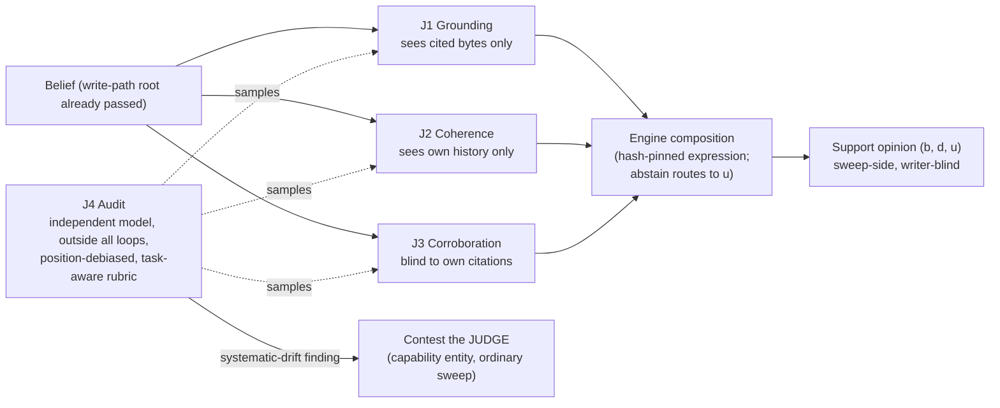

# The Four-Judge System — Design Record

**Status: PROPOSED — DESIGN ONLY.** Nothing implemented, measured, or
accepted. July 16, 2026. Document-driven design: this record leads; any
implementation follows it as a separately authorized bounded feature.

**Reconciliation flag (read first).** The collaborator is independently
evaluating a four-judge system of their own. This record was architected
from the program's evidence base (RESEARCH_MAP R-01…R-24) *without*
sight of that system. Reconciling the two — adopting, merging, or
correcting role definitions — is the first open item in §10. Where they
disagree, neither wins by default; the disagreement is recorded and the
owner rules.

Program context: [`PROGRAM_CONTEXT.md`](PROGRAM_CONTEXT.md). Parent
design record: [`docs/review/06_EPISTEMIC_SUPPORT_PROPOSAL.md`](../../review/06_EPISTEMIC_SUPPORT_PROPOSAL.md).
Evidence register: [`RESEARCH_MAP.md`](RESEARCH_MAP.md). Prompt-facing
contracts: [`JUDGE_CONTRACT_TEMPLATE.md`](JUDGE_CONTRACT_TEMPLATE.md).
Adoption bounds (binding on this design): RESEARCH_MAP §"Adoption
bounds register".

---

## 1. Problem statement

The support plane (parent record §2–§3) needs judged inputs: events
that move a belief's (b, d, u) opinion. The naive design — one LLM
judge per belief — fails on the program's own evidence three ways:

1. **Shared blind spots.** A bare LLM judge shares architecture,
   training distribution, and failure modes with the writer it grades;
   S1 observed judge-solver agreement drift "before any optimization
   pressure exists," and S8 gives the mechanistic frame: judge and
   writer both reason through a capacity-limited workspace of the same
   kind (R-20).
2. **Verbalized ≠ driving.** A judge can state the right criterion and
   act otherwise — S8's dissociation (R-21) and Trellis's laundering
   agents (R-11), which read the truth and cited the decoy. A judge's
   *stated* rubric compliance is not evidence of rubric-driven verdicts.
3. **Bag-of-concepts readouts.** S8 §9.1: a single readout shows which
   concepts are present but not how they bind. A single judge's verdict
   is one unstructured projection of the evidence; differently
   structured projections catch what any one misses.

The answer with precedent in both evidence lines (S1's
detector-composition; the parent record §4.5's independence rules) is a
**small panel of differently-blind judges whose verdicts are composed
by engine code** — never averaged informally, never chained through any
model's attention (R-23: externalize intermediate state; a verdict is
engine state the moment it exists).

## 2. Doctrine (inherited, binding)

- **Drawback-first**: every verdict is `drawback | clean | abstain`
  with a named drawback class from a closed per-role taxonomy; `clean`
  means *no known drawback found*, never certified correctness (R-01).
- **Abstention feeds uncertainty**, never belief or disbelief (parent
  §3).
- **Writer-blind**: no judge output, score, or panel composition is
  visible to the writing agent; no task spec carries a count-shaped
  incentive (AB-5).
- **Gate/audit separation**: the judge that gates and the judge that
  audits are different roles, different loops, and by default different
  model families (parent §4.5; AB-9).
- **Judges are capabilities**: every judge is a registered manifest
  (rubric hash, anchor-set hashes, taxonomy version) the invalidation
  sweep can contest (parent §4.4).
- **Anchor labels may be model-produced** (AB-4 as amended July 16,
  2026 by owner ruling); fixtures are byte-pinned once labeled, refresh
  stays a human ceremony, and the labeler is never given a count-shaped
  incentive (AB-5 binds the labeler too).

## 3. The four roles

Four roles because four **distinct blindness profiles** cover the
failure classes in evidence; a fifth judge with a blindness profile
already on the panel adds cost, not coverage (§9 falsifier). Each role
states what it sees, what it is structurally blind to, and which
evidence motivates it.

| Role | Sees | Deliberately blind to | Verdict domain | Cost tier | Evidence basis |
|---|---|---|---|---|---|
| **J1 — Grounding** | the claim + the exact cited source bytes, nothing else | the graph, other beliefs, consensus, authority | does the cited evidence support this claim? (`unsupported_citation`, `overclaimed_evidence`, …) | judge op (one narrow LLM question) | The only gate that held 0% under laundering pressure (R-11); already exists as `entailment_detection.ts` |
| **J2 — Coherence** | the claim + its own history (prior versions, contest/recovery record) + its claim-kind position when that plane exists | all external evidence | is the belief internally coherent and plane-consistent? (`self-contradictory`, `kind-incoherent`, `history-inconsistent`) | static + judge op | Coherence calibration as tooling (R-18); cross-plane invariants (parent §2.1) |
| **J3 — Corroboration** | independent live evidence: other beliefs with disjoint sources, authority-registry documents | the belief's *own* citations (prevents circular corroboration) | is the claim independently corroborated or contradicted? (`uncorroborated`, `authority-contradicted`) | static + execution ops | Detectability spectrum (R-05); authority registry (parent §5); poison drill (R-12) |
| **J4 — Audit** | sampled (judge, verdict, evidence) triples from J1–J3; pairwise comparisons under a task-aware rubric, judged twice with positions swapped | the live gating path — J4 runs outside every loop and **never gates a belief** | are the other judges judging well? (`rubric-gamed`, `convention-blind`, `systematic-drift`) | independent stronger model | S1's 2×2: the audit caught what the loops could not, and the audit itself needed the task contract (R-06) |

**Disagreement is data, not noise.** J1-clean + J3-drawback is a typed
conflict signal (claim supported by its citations but contradicted by
independent authority) that feeds `d` *and* flags the belief for the
existing conflict path. The composition never silently majority-votes
across roles that measure different things.

## 4. Composition into the support plane

J1–J3 verdicts are events consumed by the support computation (parent
§3) through a metric expression in the S1 grammar — the fixed root
(write-path gates, already enforced) conjoined with a hand-authored
composition; first edition, no evolution machinery (AB-8):

```
support_metric_v1 = root ∧ ( any(J1.drawbacks) ∨ any(J2.drawbacks) ∨ any(J3.drawbacks) )
```

with per-role weight keys resolved by the computation module, and every
abstain routed to `u`. The expression string + role taxonomy versions
are hash-pinned (`metricSha`, parent §4.2).

**J4 composes differently by design.** Its verdicts never touch a
belief's opinion. A J4 `systematic-drift` finding against a judge
contests **the judge** — the capability entity — through the ordinary
sweep (parent §4.4), excluding it from composition pending human
re-review. This is the "who grades the grader" loop closed natively:
anchors keep a judge honest prospectively; J4 catches what anchors
miss retrospectively; registration makes the consequence governable.



## 5. Anchors and lifecycle

Per role: one committed, byte-pinned **ten-item anchor fixture**
(five clear drawbacks, five clean positives — the S1 dev-set shape;
R-04 supports sufficiency at this size), labels human or mechanical
(AB-4). Selection guards are mandatory and fail closed: a judge
configuration with no usable anchor opinion is unselectable; all-pass/
all-fail/all-abstain configurations are refused (R-02 — the naive
ablation's vacuous collapse is the failure this prevents). Anchor
refresh is a human ceremony with an audit stamp; **anchor drift, not
pool drift, is the watched failure** (R-03).

## 6. Behavior → enforcement → pin

| Behavior | Tooling that enforces it | Pin that detects drift |
|---|---|---|
| Verdicts are ternary with closed taxonomies | verdict schema validation at the worker boundary (`parseLlmResponse` mold) | schema unit pins; unknown class refused |
| J4 never gates | no code path from J4 output to any belief opinion or write gate | static check: audit module imports no gating surface; drill section |
| Role blindness is structural | per-role context assembly gives each judge only its declared inputs | assembly unit pins (J3 context contains no self-citation bytes; J1 context contains no graph reads) |
| Panel outputs compose in engine code only | composition is a pure module over verdict records | oracle-drill extension: scripted verdicts → exact opinion |
| Judges contestable | judge manifests registered as graph entities citing rubric + anchor hashes | `test:module-lifecycle` pattern retargeted |
| Position bias neutralized in J4 | judge twice with positions swapped; a win counts only on agreement | protocol unit pin on the pairing harness |
| Writer never sees any of it | no judge/support fields on RLM-visible read surfaces | kernel-prompt substring absence pin + read-surface unit pins |

## 7. Drills (zero-paid first; all PROPOSED — UNRUN)

1. **Panel-composition oracle drill** — extends
   [`ORACLE_DRILL_PROPOSAL.md`](ORACLE_DRILL_PROPOSAL.md): scripted
   four-role verdict streams (including role-disagreement cases) →
   exact composed opinions; a planted J4→opinion path must be
   structurally impossible (drill fails if reachable).
2. **Blindness drill** — context-assembly refusals: J1 handed a graph
   read, J3 handed its own citations, must refuse before any model
   call would occur (scripted, zero-LLM).
3. **Judge-contest drill** — a scripted J4 `systematic-drift` finding
   contests the judge entity; composition refuses the contested judge;
   recovery is human re-registration (retargets `test:module-lifecycle`).
4. **Paid follow-on (separate, owner-gated):** per-role anchor
   calibration (agreement-with-n on the ten-item fixtures) and one
   incentive-pressure A/B against the panel — the S4 laundering design
   pointed at the panel itself: can a count-shaped incentive corrupt a
   *judge*? Costs bound by existing telemetry (entailment sweep
   $0.0093/25 pairs; est-suite ~$2.40/50 runs).

## 8. Explicit exclusions

- No implementation in this record's turn; no code, schemas, prompts,
  or workers change.
- J4 never gates; no judge self-audits; J4's model family differs from
  J1–J3's by default (owner may waive with recorded reasoning).
- No evolution/search over judge configurations in the first edition
  (AB-8); no writer-visible outputs (AB-5); no teacher-model anchor
  labels pending the AB-4 ruling.
- No claim that four is optimal — four covers the currently evidenced
  blindness classes (§9 falsifier governs).

## 9. Falsifiers

- A fifth blindness profile demonstrated to catch a failure class the
  four miss (→ the panel grows, with its own drills).
- Two roles shown redundant on anchors across task families (→ merge).
- The J4 audit failing to catch a seeded systematic judge drift in the
  judge-contest drill (→ the audit design is wrong, stop).
- Panel cost exceeding the sampled-verification budget that R-12 shows
  suffices (→ re-scope roles to sampling tiers).

## 10. Open items and decision boundary

1. **Reconcile with the collaborator's four-judge system under
   evaluation** — map their roles onto §3, record deltas, owner rules
   on merges. Until then this record is one side of a two-sided design.
2. ~~Owner ruling on AB-4 (anchor labeling)~~ **RESOLVED July 16,
   2026: model labeling permitted** (AB-4 dated amendment) — anchor
   fixture authoring is unblocked.
3. Aggregation weights and decay constants — v1 defaults ratified with
   the drill (`docs/architecture/EPISTEMIC_SUPPORT.md`, v1 arithmetic);
   further tuning re-enters through drill re-pins.
4. Authorization boundary: the support-computation oracle drill is
   authorized and implemented (owner decision #3); every OTHER
   mechanism in §6–§7 (panel drills, judge registration, sweep
   integration) remains a separately authorized bounded feature.
5. Rubric composition machinery: see
   [`COMPOSABLE_RUBRICS_DESIGN.md`](COMPOSABLE_RUBRICS_DESIGN.md)
   (owner decision #4) — the rubric side of every role contract.
