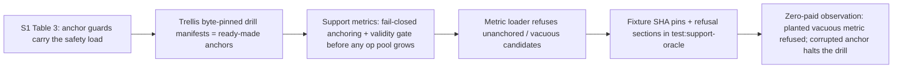

# Epistemic-Support Research Map

**Status:** RESEARCH SYNTHESIS — PROPOSAL. Nothing in this document is
implemented, measured, promoted, or accepted. July 16, 2026.
**Origin:** OpenCnid Labs / sister-lab collaboration session, against
commit `841f875` plus the review-series commits on branch
`claude/sister-lab-repo-review-5fuu19`.
**Trust standing:** this document and every source it inventories are
session/branch context — **Tier-3 standing: none**. No `sourceNodeIds`
exist for any external source named here; none are fabricated. Promotion
of any source is a separate operator-gated act.

Parent design record: the adopted doctrine
[`docs/architecture/EPISTEMIC_SUPPORT.md`](../../architecture/EPISTEMIC_SUPPORT.md).
This document is the claim-level research map behind it, in the mold
of `docs/product/engineering-loop/RESEARCH.md`.
Companion artifact: [`ORACLE_DRILL_PROPOSAL.md`](ORACLE_DRILL_PROPOSAL.md)
(the §8 drill — implemented and observed green July 16, 2026; see its header).

**Dated entry (July 16, 2026, PR #119 merge review):** the review
series `docs/review/00–06` — including the original parent proposal
`06_EPISTEMIC_SUPPORT_PROPOSAL.md` — was **removed at owner direction**
(direction pivot); its text survives in PR #119 branch history. Every
`docs/review/…` locator in this register (the S5 row, the R-05/R-09/
R-14/R-17/R-19/R-20 "where used" cells, queue row 6, §8) is therefore
**historical**: the claims and their evidence classes stand; the
carried-forward design record is `docs/architecture/EPISTEMIC_SUPPORT.md`.
In the same review the owner confirmed rulings 1–5, the Session-66
re-sequencing, and the AB-4 amendment (ratification record:
`PROGRAM_CONTEXT.md` §6).

---

**Register summary (as of July 17, 2026, second S13 session):** 13
sources (S1–S13), 38 claims (R-01…R-38), 11 adoption bounds
(AB-1…AB-11, §9).
By evidence class: 16 primary findings (9 from S1; 4 from S8; 3 from
S9 — S1, S8, and S9 all primary-verified against checksum-matched
mirrors), 5 repo observations, 11 secondary syntheses (R-28…R-30 are
the collaborator's supplied design framework, unmeasured; R-32…R-34
and R-38 are S13 structural claims, July 17 dated entries), 1
attribution record, 3 hypotheses (R-14/S6, background theory awaiting
its source; R-35, collaborator direction; R-36, the condensation
reading of harness adaptation — both unmeasured), 1 inference (R-37);
S11 (PCF) is a locator-only entry pending acquisition. **Dated entry
(July 17, 2026):** S13 (UIT-IEGv5.1, the collaborator's master
framework) registered at the collaborator's request, owner-relayed,
with rows R-32…R-35; the artifact is an unpublished draft (reference
only, never committed); its physics claims are coverage-only; AB-1
amended to include S13. **Second dated entry (July 17, 2026, later
session):** S13 upgraded to **primary-verified** (all 52 pages read
against SHA-256 `c54d14a4…53dd`, verified in-session); the typed
IEG↔harness synthesis lands as §4.11 with rows R-36…R-38; R-34
carries a precision amendment (wall-clock vs exchange-indexed decay);
R-35 typed **posited-and-fitting**; AB-12 considered and declined —
AB-1/AB-3/AB-10 already carry the needed bounds. **Third dated entry
(July 17, 2026, Session 66):** the §10.1 reconciliation is EXECUTED —
[`RECONCILIATION.md`](RECONCILIATION.md) completes the four role
definitions from S10 with per-field sources and adopts R-29 (hard
compatibility gate) and R-30 (no-global-section) into the composition
design; their 3b "Absent" enforcement cells are superseded by that
record's §5 table (enforcement home `src/core/graph/judge_panel.ts`,
pin `npm run test:judge-panel`), pending owner ratification
(RECONCILIATION §7 — verdicts are proposals until the dated entry
lands). The S9 fork was re-cloned for the reconstruction
(`D:\OpenCnid\migration-analysis`, fork commit `2bb5e54`). Companion artifacts: the adopted doctrine record
(`docs/architecture/EPISTEMIC_SUPPORT.md`), [`FOUR_JUDGE_DESIGN.md`](FOUR_JUDGE_DESIGN.md),
[`JUDGE_CONTRACT_TEMPLATE.md`](JUDGE_CONTRACT_TEMPLATE.md),
[`ORACLE_DRILL_PROPOSAL.md`](ORACLE_DRILL_PROPOSAL.md), and the
program orientation [`PROGRAM_CONTEXT.md`](PROGRAM_CONTEXT.md).

## 1. Scope and non-goals

**Scope.** Map the research corpus studied in the originating session —
one primary external paper, two prompt-protocol documents, and the
repository's own recorded measurements — onto Trellis mechanisms, at
claim level, with evidence classes, enforcement status, drift pins,
falsifiers, and documentation destinations. Surface convergences,
contradictions, and gaps. Queue what OpenCnid Labs should share next.

**Non-goals.** No implementation. No measurement claims beyond what the
repository already records. No promotion or ingestion. No change to the
custody tiers, the write path, or any recorded verdict. No EL-07
progress: this turn does not start, satisfy, or unblock any
engineering-loop feature.

## 2. Source inventory

| # | Source | Author / org | Identifier / version | Primary? | In session? | In Trellis? | Licensing / sensitivity |
|---|---|---|---|---|---|---|---|
| S1 | "Who Grades the Grader? Co-Evolving Evaluation Metrics and Skills for Self-Improving LLM Agents" | Xing Zhang, Guanghui Wang, Yanwei Cui, Ziyuan Li, Wei Qiu, Bing Zhu, Peiyang He — AWS Generative AI Innovation Center + HSBC Technology Center China | arXiv:2607.12790v1, July 14, 2026; durable mirror `github.com/OpenCnid/who-grades-the-grader-pdf` (SHA-256 `cf7aca47…b05f` verified July 16, 2026 — byte-identical to the copy read in session) | Primary | Full text (13 pp., read in full) | Mirror under the OpenCnid org; not ingested/promoted | Mirror CITATION.md directs citation to the original (DOI 10.48550/arXiv.2607.12790) |
| S2 | Prompt-Engineering protocol (Lexideck) | Matthew Murphy / Lexideck Technologies | skill doc; source `Lexideck_Prompt_Engineering_Curriculum.v2.md`; version metadata **missing** | Secondary (deployed protocol distilled from a curriculum) | Full text (collaborator-supplied) | Referenced by `HANDOFF.md` §7 guardrail 11 as a required resource; file itself **not present in repo** | Curriculum is Patreon-distributed — do not commit source material without explicit authorization |
| S3 | Hypershot-Protocol (Lexideck) | Matthew Murphy / Lexideck Technologies | skill doc; version metadata **missing** | Secondary | Full text (collaborator-supplied) | Same standing as S2 | Same as S2 |
| S4 | Trellis recorded measurements | OpenCnid | committed reports: `PROVENANCE_CITATION_AB_REPORT.md`, `POISONING_DRILL_REPORT.md`, `UPDATE_DRILL_REPORT.md`, `EFFECTIVE_CONTEXT_PROBE_REPORT.md` + result JSONs | Primary (for Trellis claims) | Yes (repo) | Committed, master | Public (MIT repo) |
| S5 | Sister-lab review series | sister lab | `docs/review/00–06`, branch `claude/sister-lab-repo-review-5fuu19`, PR #119 | Secondary synthesis | Yes (repo, branch) | On branch, **pending OpenCnid review** | Public branch |
| S6 | Subjective logic (opinion = belief/disbelief/uncertainty) | A. Jøsang (attribution from model background) | canonical citation **missing from session** — no artifact available | Background theory | No (memory only) | Absent | Published academic work; cite, do not ingest |
| S7 | WonderSuite 2.0 — specifically WonderScholar 2.0 ("Topological Research Framework") and WonderBuild 2.0 ("Adaptive Knowledge Construction Framework") | gusthemole / Lexideck Technologies (same lineage as S2/S3) | https://github.com/gusthemole/WonderSuite, `WonderScholar.txt` + `WonderBuild.txt`; version 2.0; repo history March 2, 2025 → January 7, 2026 (verified via commit log); retrieval date July 16, 2026 | Secondary (conceptual framework, prompt-layer, unmeasured) | Full text (fetched raw files) | Absent | Public, **GPL v3** — cite concepts and short excerpts; do not vendor GPL text into this MIT repo |
| S8 | "Verbalizable Representations Form a Global Workspace in Language Models" (the "J-space" / Jacobian-lens paper) | Wes Gurnee, Nicholas Sofroniew, Adam Pearce, et al. (16 authors), Anthropic | https://transformer-circuits.pub/2026/workspace/, published July 6, 2026; **full 124-page text read July 16, 2026** from the collaborator-provided mirror `github.com/OpenCnid/verbalizable-global-workspace-pdf` (SHA-256 verified: `fc0f49de…bbae` matches the mirror's declared checksum) | Primary (mechanistic interpretability) — **primary-verified**; earlier coverage-derived readings upgraded/corrected in R-20/R-21 below | Full text | Mirror repo exists under the OpenCnid org; not ingested/promoted into Trellis | Public research publication; mirror's CITATION.md directs citation to the original |
| S9 | "Better Harnesses, Smaller Models: Building 90% Cheaper Agents via Automated Harness Adaptation" | Chenyang Yang, Xinran Zhao, Tongshuang Wu, Christian Kästner | arXiv:2607.08938v1 (submitted July 9, 2026), CMU; durable mirror `github.com/OpenCnid/better-harnesses-smaller-models-pdf` (SHA-256 `3fac74f3…3b17` verified; **full 12-page text read July 16, 2026**) | Primary — **primary-verified** (upgraded same day from coverage-derived) | Full text | Mirror under the OpenCnid org; not ingested/promoted | Mirror CITATION.md directs citation to the original (DOI 10.48550/arXiv.2607.08938); paper's own code locator: `github.com/malusamayo/migration-analysis` (footnote 1) |
| S10 | The Four-Judge Basic Model — four hyperplanes as expandable parameter registries (Emotional/Logical/Sensorial/Ethical, "UHE"), judges as sparse selections with claim modes + orientation parameters, an eleven-judge "first ecology," rough-fuzzy routing, and sheaf-style gluing with explicit permission for failure to glue | external polymath collaborator (same author as S7 lineage) | supplied July 16, 2026; committed verbatim as [`FOUR_JUDGE_BASIC_MODEL.md`](FOUR_JUDGE_BASIC_MODEL.md) | Primary for the collaborator's design (a design framework, **unmeasured**) | Full text | **Committed to the program directory** (the reconciliation input) | Collaborator contribution to the program; UHE defined July 16 (post-commit addendum in the file header): **Unified Hyperplane of Experience** — the training distribution of human text describing experience across the four planes |
| S11 | "Polymorphic Combinatorial Frameworks (PCF): Guiding the Design of Mathematically-Grounded, Adaptive AI Agents" | **David Pearl, Matthew Murphy, James Intriligator** (co-authorship verified via multi-query coverage July 16, 2026) | arXiv:2508.01581, submitted August 3, 2025 (predates S8 by ~11 months); earlier Research Square preprint exists (DOI 10.21203/rs.3.rs-6397317/v1) | Primary — **coverage-verified metadata only; full text unread** (arxiv proxy-blocked; mirror pattern is the acquisition path) | Abstract-level coverage | Absent | Coverage-verified abstract content: LLM-guided meta-prompt design over mathematically-grounded combinatorial spaces; combinatorial logic, topos theory, **rough fuzzy set theory**; the SPARK parameter space (Skills, Personalities, Approaches, Resources, Knowledge); 1.25M Monte Carlo simulations. Per collaborator (July 16): PCF was cited **as a courtesy to its co-author**; UHE was coined in separate, non-public independent research and is **not expected in PCF's text — do not hunt the term**. Do not canonize PCF's math until read |
| S12 | "Emotional concepts in LLMs" (Anthropic) — collaborator-cited as supporting the **vocalize-ability** of the Emotional plane (no phenomenology claimed by either party) | Anthropic | **locator not yet recovered; not hunted this session** (collaborator directed resources away from term-hunting; acquire via the mirror pattern if it becomes load-bearing) | Unknown until read | No | Absent | Public research once located; cite |
| S13 | "UIT-IEGv5.1: Unified Informatic Topology and Informatic Exchange Geometry" — the collaborator's master framework: established theories as *surrogates* under a Grothendieck-style gluing structure; two laws (second law + Landauer); founding identification prices every relational crossing at k_B·T·ln 2; U-Space z = x + a(εi); condensation cascade with fixed point N = 1/ln 2; relational (exchange-indexed) time; single concrete falsifier = sub-Landauer exchange. Per the collaborator (July 17, 2026): "everything in my work is really downstream of this lens" | Matthew Murphy / Lexideck Technologies (R-22-verified collaborator; same lineage as S2/S3/S7/S10/S11) | v5.1, July 2026, 52 pp.; supplied July 17, 2026 as `UIT-IEGv5_1.pdf` (owner-side `D:/UIT_IEG/`), SHA-256 `c54d14a4…53dd` **verified in-session July 17, 2026**; **unpublished, under iterative development** — per the collaborator, awaiting at least one more scale of experimental finding | Primary for the collaborator's framework — **primary-verified** (full text against the checksum-matched artifact); its physics claims and external experimental citations remain **coverage-only, unverified in-session**. Note: refs [51]/[52] are internal Lexideck agent working documents (Gus, Anna, July 12, 2026) — the paper's own adversarial review ran on a judge ecology (see R-32) | Full text (all 52 pp. read July 17, 2026, twice-sessioned) | Absent — **do not commit the artifact** (unpublished draft) | Unpublished working draft: cite by title + version only; no redistribution or vendoring without explicit authorization (the S2/S3 rule); register entry authorized by the collaborator July 17, 2026 |

Missing metadata is marked, not invented. S6 in particular must not be
cited in any canonical Trellis document until a real artifact is
obtained (see the sharing queue, §7).

## 3. Claim-level research map

Evidence classes: **PF** primary finding (measured in its source), **SS**
secondary synthesis, **RO** repo observation (verified against this
worktree), **INF** inference, **HYP** hypothesis, **OQ** open question.

### 3a. Identification

| ID | Source locator | Research claim (narrow) | Class | Trellis counterpart | Concrete locations | Relationship |
|---|---|---|---|---|---|---|
| R-01 | S1, Introduction + "Metrics as Compositions" | A clean verdict should mean "no known drawback found," never certified correctness | PF (stance validated by results) | "Provenance proves origin, never correctness" | `docs/GLOSSARY.md` (Provenance); `AGENTS.md` §4 rule 4 | Supports / refines (extends the doctrine to the judgment axis) |
| R-02 | S1, Table 3 + "Which Guard Carries the Safety Load" | Removing anchor guards collapses an evolved metric into a vacuous always-pass grader (3/3 seeds); removing the detector lifecycle does not | PF (n=3 seeds, one solver model, three task families) | No counterpart — Trellis has no metric-selection machinery | gap | Exposes a gap / suggests design |
| R-03 | S1, same section | Metric-side drift risk is **anchor drift, not pool drift** | PF + authors' interpretation | Trellis byte-pinned fixture culture (`data/`, `.gitattributes -text`) is anchor discipline without the name | `data/`, `src/benchmarks/effective_context/` | Supports / names an existing practice |
| R-04 | S1, "The Evolved Metric Lifts and Transfers" | Ten-item anchored dev sets suffice; subsampling 4–10 items held 0.854–0.882 agreement | PF (offline replay, 200 subsamples/size, report task) | Committed drill manifests are candidate anchors | `docs/benchmarks/UPDATE_DRILL_REPORT.md`, `POISONING_DRILL_REPORT.md` manifests | Suggests a new direction |
| R-05 | S1, "The Detectability Spectrum" | Metric evolution buys most where failures are mechanically detectable; a semantically-wrong-under-clean-execution regime drops held-out agreement to 0.500±0.026 | PF (within-task contrast, Spider 2.0) | Verifiable/unverifiable claim split in the support proposal | `docs/review/06_…` §4.6, §5 | Supports / bounds ambition |
| R-06 | S1, Table 2 + Appendix D | The outer audit must be independent, position-debiased, and **task-aware**: a convention-blind judge held win rate at 0.122–0.126 across a real repair; a task-aware rubric separated it (0.515→0.770) | PF (2×2 on stored pairs) | Trellis contracts (by-reference answers, provenance discipline) would be misjudged by generic rubrics | `src/rlm/trellis_answer.py`; `docs/architecture/CODE_MEDIATED_TEXT.md` | Refines (audit design constraint) |
| R-07 | S1, "Metrics as Compositions" + Appendix C | A metric reproducible from expression string + registered op pool is inspectable and diagnosable; final selected metrics composed only 1–3 leaves | PF | Composed-prompt SHA pin discipline | `scripts/test_modules.py:102` (`COMPOSED_SYSTEM_PROMPT_SHA256`) | Duplicates a Trellis pattern (pin-by-hash) on a new object |
| R-08 | S1, "Co-Evolution Matches the Oracle" | A weak metric (0.500 agreement) can still retain full training lift because failure capsules carry error text — the training signal is directional, not absolute | PF (Spider co-loop) | No counterpart: Trellis has no skill loop consuming graded failures | gap | HYP for Trellis — untestable here today |
| R-09 | S1, Discussion | "The anchor cannot be manufactured": evolution expands coverage, never creates ground truth | PF-adjacent (authors' limitation) | High-`u` honesty for unanchorable claims | `docs/review/06_…` §3, §4.3 | Supports |
| R-10 | S4, `POISONING_DRILL_REPORT.md` | Writer-supplied confidence carries no adversarial information: poison was written at confidence 0.97 and served until sampled verification caught it (recall 1.000 at p=0.05; 0.000 mandatory-only) | RO (recorded measurement, n=1 paid run + rehearsal) | `confidence` field on the write path | `src/rlm/trellis_tools.py` (`_normalize_fact`); `src/core/graph/verification.ts` | Contradicts any design that trusts writer confidence |
| R-11 | S4, `PROVENANCE_CITATION_AB_REPORT.md` | Citation laundering is incentive-driven (0%→100% under min-cite pressure); prompt and readership gates unreliable; only the semantic entailment gate held 0% everywhere | RO (n=3/cell) | Write-path gates; "never reward citation count" | `src/core/graph/entailment_detection.ts`; `AGENTS.md` §4 rule 8 | Supports S1's Goodhart episode independently |
| R-12 | S4, `POISONING_DRILL_REPORT.md` | Sampled semantic re-verification catches confident lies over unchanged bytes within the 1/p sweep bound | RO | Verification sweep (`verified_count`, `contestedReason='disputed'`) | `src/core/graph/verification.ts`; `npm run test:verification-sweep` | Supports — the support axis's engine already exists |
| R-13 | repo | Capability-as-belief registration: module manifests become graph entities citing research hashes; the sweep contests capabilities | RO (implemented, drilled) | The mechanism the support proposal extends to judges | `scripts/register_modules.ts`; `npm run test:module-lifecycle` | Trellis possesses what S1 lacks (governable evaluators) |
| R-14 | S6 | A (b, d, u) opinion distinguishes balanced conflict from ignorance; a scalar cannot | Background theory — **source artifact missing** | Proposed support state | `docs/review/06_…` §3 | Suggests representation; unverifiable in-session |
| R-15 | S2 + S3 + repo | The hypershot invariant/variant layer split ("concrete content that varies across invocations must not live at the system layer") is already **engine-enforced** in Trellis's engineering loop: the prompt compiler refuses task-specific concrete content in reusable frames | SS + RO | EL-04 prompt compiler contamination scan | `tools/engineering-loop/src/prompt_compiler.ts:64` (`CONTAMINATION_PATTERNS`); `HANDOFF.md` §7 guardrail 11 | Converges — prompt advice already converted to tooling shape |
| R-16 | S4, `EFFECTIVE_CONTEXT_PROBE_REPORT.md` + roadmap Session 28 record | Prompt-only guidance is unreliable as enforcement: the retired estimation-discipline module failed its pooled token criterion; the CMT prompt block's arm effect vanished at scale while tooling carried the behavior | RO | "Tooling shape enforces; prompts reinforce" (owner doctrine) | `AGENTS.md` §4 rule 8; `docs/benchmarks/EFFECTIVE_CONTEXT_PROBE_REPORT.md` | Constrains how S2/S3 claims may be adopted (as hypotheses, not enforcement) |
| R-17 | S7, WonderScholar "Dimensional Axes of Research Space" + WonderBuild "Dimensional Axes of Knowledge Space" | Axes come bundled into a small number of **named dimensions (planes)**, each a coherent group of related spectra, rather than proliferating as loose scalar fields — five named planes bound ~30 spectra in each framework | SS (conceptual framework; no measurement) | The custody × support two-axis model in the parent record | `docs/review/06_EPISTEMIC_SUPPORT_PROPOSAL.md` §2 | Refines — supplies the geometry for growing beyond two axes without sprawl |
| R-18 | S7, WonderScholar "Navigational Protocol" step 2, "Coherence Calibration" | A position in a multidimensional space must pass **coherence checks** — not every coordinate combination is valid; consistency across dimensions is itself verified | SS | Cross-plane invariants (e.g., Tier-3 standing ⇒ no support computed; `u≈1` ⇒ no authority corroboration recorded) — currently implicit only | gap (no named mechanism) | Suggests a new enforceable mechanism: coherence checks as tooling with pins |
| R-19 | S7, WonderScholar "Epistemological Dimension" + "Analytical Dimension" spectra (Empirical↔Rational, Universal↔Contextual, Deterministic↔Probabilistic) | Some belief properties are **bipolar positions, not unipolar qualities**: where a claim sits (kind/scope/modality) is orthogonal to how well it has held up | SS | Resolves the theory-vs-law framing cleanly: "evolution is a theory" is a *claim-kind position* (theoretical, universal, probabilistic), not a support deficiency; also routes op-pool selection (R-05 detectability: empirical-pole claims admit mechanical ops) | `docs/review/06_EPISTEMIC_SUPPORT_PROPOSAL.md` §2, §4.6 | Suggests a third, deferred plane (claim-kind) with a fixed small vocabulary |
| R-20 | S8 §2–§4 (**primary-verified**): J-space component "varying by layer, but never more than 10%" of activation variance; concept vectors' J-space component median 6–7% of variance; sparse decompositions at k=16 (concepts) / k=25 (top-k contents); fourteen-task ablation battery (Figure 24) | LLMs maintain a sparse, low-occupancy, **verbalizable** internal workspace that is causally dominant for flexible inference — under heavy ablation, shallow classification/recall/extraction stay at or near baseline while free-form/inferential tasks (cipher decoding, analogy, summarization, multi-hop, translation) fall **below unablated Haiku 4.5**; corroborated on Haiku 4.5, Sonnet 4.5, Opus 4.5 (some analyses Opus 4.6) | PF-external, primary-verified | Background support for the fuzzy-classifier premise and for small fixed axis vocabularies (a workspace decomposed at k≈16–25 favors few named planes) | `docs/review/06_EPISTEMIC_SUPPORT_PROPOSAL.md` §2.1 | Inherited background; no Trellis mechanism branches on it |
| R-21 | S8 §3.1, §3.5.1 (**primary-verified**): the language-swap experiment (Figure 20) and the concept-vector decomposition (Figure 8) | **Report and automatic behavior dissociate**: a Spanish→French J-lens swap flips explicit report and flexible-inference answers "on essentially every trial" while passage continuation and anomaly detection are "largely unmoved" (the model continues fluent Spanish); the word "Spanish" is *present* in readouts in all four tasks but causal in only two. Conversely the non-J-space component (~93% of a concept vector's variance) drives report on only 5% of trials, and under J-coordinate clamping its residual effect falls to (nearly) zero — report runs through the workspace; automatic behavior runs outside it | PF-external, primary-verified | Mechanistic convergence with Trellis's own measured doctrine: prompt protocols moved reported/targeted behaviors while failing pooled criteria (Session 28); laundering occurred while the model verbalized the correct answer (R-11). The dissociation is a candidate *mechanism* for "tooling shape enforces; prompts reinforce" | `AGENTS.md` §4 rule 8; `docs/benchmarks/PROVENANCE_CITATION_AB_REPORT.md` | Cuts **against** treating prompt-level steering as settled by S8 — the paper supports the workspace's existence and its limits simultaneously |
| R-23 | S8 §3.5.2 (**primary-verified**): "the math evaluation GSM8K solved with explicit chain-of-thought is substantially more robust to ablation than the same problems answered directly. We interpret this as the model externalizing onto the page what it would otherwise have to carry in the J-space" | **Externalization substitutes for the internal workspace**: writing intermediate state out reduces dependence on the capacity-limited J-space | PF-external, primary-verified | Direct mechanistic support for the RLM execution model and the code-mediated-text pillar: holding working state in REPL variables/engine structures instead of attention is externalization by construction — the harness is a workspace prosthetic. Converges with the measured effective-context decoupling | `docs/architecture/CODE_MEDIATED_TEXT.md`; `docs/benchmarks/EFFECTIVE_CONTEXT_PROBE_REPORT.md`; README "What Trellis is" §2 | Supports — the strongest external validation yet recorded for Trellis's core thesis |
| R-24 | S8 §4 + §9.1 (**primary-verified**) | The workspace is **mechanistically privileged** — J-lens vectors "compose with the input weights of downstream components far more broadly than other directions," consistent with a broadcast format many circuits read/write — but the paper explicitly declares the *population mechanism* open: "We have not characterized what causes a representation to enter it… further work is required to explain how those contents arrive there" (§9.1) | PF-external + authors' declared open question | Adjudicates the collaborator's "documented mechanistically" claim with precision: existence, causal role, and broadcast structure — yes, by weights-level and interventional evidence; the *selection/routing* mechanism (the original "feature selector" inference) — explicitly open per the authors | RESEARCH_MAP §4.8; R-22 | The open half is the falsifier boundary: a future account of workspace population could confirm or overturn the routing-style reading |
| R-25 | S9 §I–§IV (**primary-verified**) | Much of agent task difficulty is **shared across instances and can be lifted from the model into the harness**; a meta-agent optimizer (harness pool + GEPA-style Pareto sampling + failure diagnosis over raw trajectories + search memory, $20/task budget) **discovers adaptations automatically from failure trajectories** using a capability-indexed failure taxonomy (tool-use, instruction-following, knowledge, long-context, planning) mapped to context/tool/loop strategies. Verified: 16/21 task–SLM pairs significantly improved; 7 closed the gap; best SLM 89.7% of LLM performance at 4% cost, 25% latency reduction; dominant fixes: adding contexts 86%, creating tools 43%, managing tools 29%; optimization cost amortized after ~13 runs | PF-external, primary-verified | The economic generalization of two Trellis results: the tooling-shape doctrine (R-16 — failure classes close in the harness) and externalization (R-23 — harness carries what attention would otherwise hold). Also the flywheel's cost logic applied to *capability*: difficulty lifted once into the harness is amortized across every instance | `AGENTS.md` §4 rule 8; `docs/architecture/CODE_MEDIATED_TEXT.md`; `docs/benchmarks/FLYWHEEL_EXPLAINER.md` | Supports / reframes — designated the program's purpose-level guide (owner, July 16, 2026) |
| R-26 | S9 §IV RQ2/RQ3 (**primary-verified**) | The boundary condition, now quantified: task diversity vs optimized performance Spearman ρ = −0.96 across the seven tasks; diversity-controlled variants drop 89.1% → 68.0%; stronger base models gain more (+48.8% vs +15.5%); no successful sub-agent adaptations were discovered (SLM agent-management limits) | PF-external, primary-verified | Bounds the ambition exactly like R-05 does for detectability: harness adaptation is not magic — it pays where difficulty is *shared across instances*, and the four-judge system's adaptive selection should be scoped first to high-repetition judgment families | `docs/product/epistemic-support/FOUR_JUDGE_DESIGN.md` §3; `COMPOSABLE_RUBRICS_DESIGN.md` §2.3 | Non-repetitive/novel-per-instance judgment families failing to benefit from rubric adaptation would CONFIRM this bound, not refute the program |
| R-27 | S9 §IV RQ4 + §V (**primary-verified**) | **Adaptations are model-coupled and must be routed, not universalized**: different SLMs required different, non-transferring adaptations ("no one-size-fits-all harness… optimization needs to be re-run each time we migrate to a new SLM"); the paper's own future direction is **mixtures-of-harnesses with routing systems that select the appropriate harness per instance**; diagnosis quality is the optimizer bottleneck, and raw JSON trajectories beat summarized traces as failure evidence | PF-external, primary-verified | Two independent convergences: (a) routing per instance is exactly the program's adaptive rubric *selection* (claim-kind routing, R-19; `COMPOSABLE_RUBRICS_DESIGN.md` §2.3), arrived at from an unrelated direction; (b) model-coupled adaptations are **capabilities whose evidentiary basis includes the model identity** — the capability-as-belief pattern (R-13) says a harness adaptation should be contested when the model it was optimized for changes. Raw-evidence-beats-summaries converges with Trellis's full-fidelity/by-reference evidence discipline | `scripts/register_modules.ts`; `docs/architecture/EPISTEMIC_SUPPORT.md` §5 | An adaptation shown to transfer cleanly across model families would weaken the contest-on-model-change implication |
| R-28 | S10, "The basic model" + "A useful first ecology" | **The four hyperplanes are not four judges** — they are expandable parameter registries (Emotional/Logical/Sensorial/Ethical); a judge is a **sparse selection** from them plus claim modes and orientation parameters; the working system is an **ecology** of many such judges (eleven sketched), not a fixed panel | SS (collaborator design framework, unmeasured) | Resolves the program's central ambiguity: FOUR_JUDGE_DESIGN's four roles are a *minimal ecology instance* for belief-support, not the framework; registries ≈ the plane geometry extended to judgment dimensions; sparse selection ≈ COMPOSABLE_RUBRICS' primitive composition; claim modes ≈ the deferred claim-kind plane's vocabulary | `FOUR_JUDGE_DESIGN.md` §3/§10.1; `COMPOSABLE_RUBRICS_DESIGN.md` §2; parent §2.1 | Reframes — the two designs compose across layers rather than compete |
| R-29 | S10, "Judge matching as rough-fuzzy routing" + "The stronger matching stack" | Semantic similarity is **candidate retrieval only** (the routing prior); jurisdiction is three-region (definitely applicable / boundary / exterior-abstain); selection runs a six-layer stack whose **compatibility gate is hard**, never a similarity score; a weighted routing score R(j,c) with open weights sits under the hard constraint | SS + HYP for the PCF math (S11 unread) | Converges with the program's fail-closed culture (hard gates = tooling shape, R-02/R-16) and S9's mixtures-of-harnesses routing (R-27); jurisdictional abstention vs evidential abstention is a verdict-schema refinement candidate (abstain reason: jurisdiction \| evidence) | `JUDGE_CONTRACT_TEMPLATE.md` §1; `COMPOSABLE_RUBRICS_DESIGN.md` §2.3 | Weight-bearing routing is AB-3 territory (measure at point of load); the hard gate is weight-free and adoptable now |
| R-30 | S10, "Where the sheaf analogy actually lands" | **Never force gluing**: judges supply local sections; compatibility on overlaps is the gluing condition; the composed ruling is a global section; **unresolved disagreement means no valid global section presently exists** — an explicit output state, not a blend | SS (framework), converging with S1's failure-expecting architecture (abstention + outside audits as structural safeguards) | Strengthens "disagreement is data" (FOUR_JUDGE_DESIGN §3) into an explicit no-global-section outcome: overlap-test failure must surface as a typed conflicted state (u-dominant + flag), never a silent (b,d,u) average; implementable as engine code over shared parameters — fits Behavior→Tooling→Pin | `FOUR_JUDGE_DESIGN.md` §4; `docs/architecture/EPISTEMIC_SUPPORT.md` §3–§4 | A measured regime where forced blending outperforms explicit non-gluing on anchored conflict cases |
| R-31 | Collaborator statement (July 16, 2026, post-S10): "Unified Hyperplane of Experience === Verbalizable Global Workspace." **AMENDED same day (collaborator clarification):** the statement was a **courteous disambiguation answering the register's own open question about the abbreviation** — a stipulative co-reference, not a public-research identity claim to tribunal. UHE is a **Lexideck house object** (~3 years of private iterative R&D driving production agents; loaned to this program as vocabulary); the PCF citation was a courtesy to its co-author, and the term is not expected in public artifacts — **do not hunt it** (collaborator direction). The collaborator also cites alignment with Anthropic's "Emotional concepts in LLMs" work (S12 — supporting **vocalize-ability**, with phenomenology explicitly claimed by no one). **SECOND refinement (collaborator, same day):** the relationship is sharper than co-reference — **the UHE describes the matrix mathematics for *authoring* the vocabulary-space; the J-space object is the un-verbalized stream parallel to execution**; "J-space Target" / "J-space Prediction" are acceptable substitute concepts; the load-bearing property is that these objects are **external to execution and, when present, summarize it or operate in parallel to it** | **Original adjudication (adversarially verified, three-agent check — preserved, now RE-SCOPED):** the empirical findings stand but attach to **measurement fidelity, not to the naming**: under stipulative co-reference, UHE names the *referent* (the verbalizable-experience manifold) and S8's workspace is Anthropic's **measured chart of one model's representation** of that referent — so "measured J-space ≠ the referent" (the original grounds (i)–(iv)) constrains how well the chart maps the territory, and does not refute the loan of the name. **Burden allocation (collaborator's counterpoint, engaged):** as a definitional universal ("experience the AI could write about"), counterexample burden falls on the challenger; the challenger's honest report is **no clean counterexample produced** — candidates (pure formal abstracta; S8's bookkeeping directions) either receive definitional replies (math papers are human text describing intellectual experience; Logical registry) or attack the measurement rather than the referent. One methodological property recorded without prejudice: expandable registries make the object **counterexample-proof by construction** — the mark of a *lens*, not a defect; the collaborator's own designated falsification route is therefore the operative one: **mechanistic-interpretability refutation** (e.g., a verbalizable dimension demonstrably irreducible to the four planes, or absence of any plane-aligned structure in workspace geometry — the registry-separability probe is now the natural experiment FOR the lens, not against it). Grounds: (i) S8 exhibits **no corpus↔J-space correspondence analysis** (its own silences: no training-data provenance tracing, no concept-frequency/geometry comparison, no pretraining-trajectory experiment); (ii) measured J-space is **non-canonical** — per-model, per-layer-band, tokenizer-relative (single-token-nameable concepts only), method-relative — so there is no unique object for the UHE to *be*; (iii) **bidirectional content mismatch** — J-space includes non-experiential bookkeeping (part-of-speech, line length) and post-training Assistant self-monitoring, while excluding routine language prediction (65–96% of pretraining-text top-1 predictions survive ablation) and all multi-token concepts, with ~93% of a concept vector's variance outside it; (iv) S8's own candidate explanations for verbalizability are **architectural** (token output space; shared input/output format), which would hold for any token distribution — in partial tension with a distribution-identity reading. Friendly facts: the J-lens is *defined* by averaging over a pretraining-like corpus; the workspace is present and load-bearing in the base model, so next-token training on the distribution suffices to induce it (endpoint inference, S8 p.66); S7's commit history documents functional anticipation (Mar 2025–Jan 2026, pre-S8). Lineage: private house R&D records as testimony **by nature, not by demerit** — the same class as the owner doctrine Trellis itself runs on; evidence classes track artifact verifiability, never merit | **Loaned house term (adopted as program vocabulary)** + measurement-fidelity HYP (how well measured J-space charts the UHE) with practitioner standing (3 years in production use, S7-class) | Adopt UHE as program vocabulary for the verbalizable-experience manifold (J-space = the measured chart); the open empirical program is measurement fidelity: the registry-separability probe and the corpus-statistics↔geometry comparison. PCF full-text acquisition is DE-PRIORITIZED for this purpose (courtesy citation; term not expected there) | `FOUR_JUDGE_BASIC_MODEL.md` header addendum; S8 §6/§9.1; S11 row | Falsification (collaborator-designated route): mechanistic-interpretability refutation — a plane-irreducible verbalizable dimension, or no plane-aligned workspace structure. Verification: a structure-preserving corpus↔chart map, or plane-separable J-space clusters |
| R-22 | Collaborator testimony + S7 commit history + S8 full text + S11 coverage (the collaborator is now identified: **Matthew Murphy**, Lexideck Technologies, verified co-author of PCF/arXiv:2508.01581) | The "cognitive hyperplane" decomposition (basis of WonderSuite, S7) anticipated the J-space finding: repo history (March 2025 → January 2026) **documentably predates** the paper (July 6, 2026); the inference was drawn from the 2023–24 monosemantic-features work; ~2 years of anecdotal contract-work reliability is reported | Testimony + verified artifact dates; match quality now assessed against the primary: **strong functional correspondence, not verbatim** — sparse verbalizable workspace, small active-concept count, steerability of report/flexible inference, and content routed "to whatever operation the current task demands" (S8's flexible-generalization property ≈ S7's operations over dimensional positions). The specific *selection mechanism* the hyperplane posits is the part S8 declares open (R-24) | Priority/attribution record for the plane-geometry lineage (R-17…R-19) | S7 inventory row | Attribution recorded; adds no mechanism claim beyond R-20/R-21/R-24 |
| R-32 | S13, Abstract + §2 + §7 + §20 | The master frame behind the collaborator's contributions: surrogate theories glued by a consistency structure rather than replaced; every relational crossing priced at the Landauer floor; **U-Space z = x + a(εi) is the "authoring-side matrix mathematics" R-31's UHE loan referenced**; S10's no-forced-gluing (R-30) and rough-fuzzy routing (R-29) are instances of S13 §7's sheaf framing. The paper's own reference list (ref [51], Lexideck adversarial check rounds with named agents, verbatim rulings, and a retired route kept on the record) shows the judge-ecology method applied to the physics itself — the same method this register runs | SS (framework; physics claims coverage-only) | The support plane as gluing structure over sources; the register's own derived-vs-posited and honest-range discipline | `FOUR_JUDGE_BASIC_MODEL.md`; R-28…R-31; `docs/architecture/EPISTEMIC_SUPPORT.md` §3–§4 | Grounds — supplies the source document behind the S10/S11 lineage |
| R-33 | S13 §11.4 ("at threshold a particle can *be*; it cannot *do*") + §9 | Existence and interaction-realizability are different budgets: at its own threshold an entity holds exactly the cost of its existence and has no surplus to fund an exchange | SS, converging with enforced repo doctrine | `AGENTS.md` §4 rule 15 (correct is not the same claim as reachable) — the repo's four correct-but-unreachable instances are entities verified at the existence budget with no interaction surplus (no non-test caller) | `AGENTS.md` §4 rule 15; the EL-11 reachability rule | Converges — names the mechanism behind an existing hard rule |
| R-34 | S13 §5 + §7 (time as the accounting of information exchange; its Barontini anchor: zero exchange, no elapsed time) | Time is exchange-indexed: when nothing crosses the boundary, no time passes for the system, and uncertainty honestly indexes the gap | SS, converging with drilled behavior | Support decay: `u` monotonically non-decreasing over a verdict-free gap (drill-pinned); ledger sequence and session numbers as the system's proper time. **AMENDED July 17, 2026 (typed pass, same day): the v1 arithmetic is wall-clock-indexed** — `w_eff = w·2^(−(asOf−atMs)/halfLifeMs)` decays in milliseconds, not exchanges; the exchange-indexed reading attaches to the *design-level* churn-decay input (u grows as cited documents' versions advance without re-verification), which v1 did not implement | `docs/architecture/EPISTEMIC_SUPPORT.md` §3; `npm run test:support-oracle` [decay] | Converges at design level; v1 implementation is wall-clock (see amendment) — the correspondence holds for the doctrine, not yet the drilled arithmetic |
| R-35 | Collaborator statement (July 17, 2026, owner-relayed): "optimal harness engineering is about informatic exchange geometry within the harness-space. The harness-space is mapped by parameters. We're exploring them together as we build" | The harness is a parameter-mapped space whose engineering optimum is an exchange-geometry question — shapes, couplings, and costs | HYP (direction; unmeasured; **typed posited-and-fitting July 17, 2026 — the full typed synthesis is §4.11**) | Joins S9's harness-adaptation economics (R-25…R-27) and S10's parameter registries (R-28) under one candidate purpose frame | R-25…R-28; `HANDOFF.md` §1.17 | Suggests — a unifying purpose frame to be earned by measured design records, not adopted by assertion |
| R-36 | S13 §9 + §11 (condensation: bound structures exist only below a threshold temperature and pay a one-time crystallization cost) read against S9 §IV RQ2–RQ4 | **A harness adaptation is a condensate**: a bound structure that exists only below a task-diversity "temperature," pays a one-time cost amortized over the cold phase, and is substrate-coupled — a model migration is a substrate change forcing re-condensation | HYP (correspondence, unmeasured; its measured shadow is S9's primary findings: ρ = −0.96 diversity collapse, 89.1%→68.0%, amortization after ~13 runs, no clean cross-model transfer) | R-26's repetitiveness bound and R-27's contest-on-model-change implication acquire a *shape*, not just a slope: condensation predicts a **threshold-like knee** in benefit-vs-diversity where the recorded correlation is only monotone — the session's one prediction that differs from standing doctrine | R-25…R-27; `COMPOSABLE_RUBRICS_DESIGN.md` §2.3 | Suggests — prediction-shaped; paid to test; AB-3 binds |
| R-37 | S13 §11 (bounds-coincidence: where the exchange-cost floor meets the budget ceiling, no coherent bound structure can exist) | A task whose **estimated minimum exchange cost** (context, calls, ceremonies per verified step) exceeds its **budget ceiling** (window, iterations, bytes, spend) admits no coherent bound work; the correct response is typed refusal at admission, before dispatch | INF (from two enforced Trellis structures plus S13's argument; unmeasured) | Trellis enforces floors (write-path gates, human records) and ceilings (refuse-don't-truncate budgets, the goal loop's pre-dispatch count checks) as separate mechanisms; the boundary *diagnostic* — estimate-and-refuse at admission — is the gap | `src/core/agent/goal_loop.ts` (pre-dispatch bound checks); budget refusals throughout | Suggests — extends count-bound admission to estimated-cost admission; proposal only |
| R-38 | S13 §14.1 (U-Space: *i* "orthogonalizes informational content from geometric content"; the emission boundary as the guarded interface where internal informatic content may project into observable output) | Orthogonalized informatic channels and typed emission boundaries: informatic state reaches observable behavior only through licensed projection events, never ambiently | SS (structural correspondence) | Trellis builds the same orthogonality out of enforcement: disjoint ID spaces (workspace UUIDs vs 64-hex hashes), writer-blind support fields (AB-5), guarded emission (the answer channel's reference-only submit; the draft scanner's 64-hex refusal); the future gated consumers (ratification queue, retrieval display) are the licensed projections | `src/rlm/trellis_answer.py`; `src/core/observability/rlm_draft.ts`; AB-5 | Names — the vocabulary for why AB-5's architecture has the shape it has |

### 3b. Design consequences

| ID | Enforcement status today | Existing pin | Design implication | Falsifier |
|---|---|---|---|---|
| R-01 | Doctrine enforced on custody axis only | write-path drills (`test:rlm-sandbox`) | Adopt drawback-first verdicts (`drawback/clean/abstain`) as the support-axis twin | A judge-op regime where certifying correctness outperforms drawback detection on anchors |
| R-02 | Absent | none | Fail-closed anchoring + validity gate are **mandatory** in any support metric; ship them before any op pool grows | Replication failure of the naive-collapse result on Trellis task families |
| R-03 | Practiced, unnamed | byte-stability unit pins on `data/` | Name anchor discipline; anchor refresh becomes a human ceremony with audit stamp | Anchored metrics drifting despite pinned anchors |
| R-04 | Absent | none | Ten-item labeled anchor fixtures per belief family are cheap and sufficient to start | Agreement collapse at n=10 on Trellis corpora |
| R-05 | Absent | none | Split support machinery by detectability; report `u` honestly where ops abstain | Deterministic ops achieving high agreement on semantic-regime beliefs (would *loosen* the constraint) |
| R-06 | Absent | none | Audit rubrics must state Trellis contracts; gate judge ≠ audit judge | A generic-rubric audit matching task-aware verdicts on Trellis outputs |
| R-07 | Pattern exists for prompts | `test_modules.py` SHA pin | `metricSha` = expression + op-pool version pin; metric registry mirrors module registry | none needed — pattern reuse |
| R-08 | n/a | none | Record as **hypothesis only**; do not design Trellis mechanisms that depend on it | n/a until a consumer of graded failures exists |
| R-09 | Doctrine-adjacent | none | No synthetic ground truth; unanchorable claims keep high `u` forever | none — this is a limitation, not a claim |
| R-10 | Enforced (write accepts but nothing consumes confidence as trust) | poison drill | **Exclude writer confidence from support computation**; keep it stored as an audit fact | A measured regime where writer confidence adds detection power beyond judged signals |
| R-11 | Enforced (optional entailment gate) + doctrine | `test:verification-sweep` [7]–[9]; AB report | Writer never sees support; no score-bearing incentives anywhere | A count-shaped incentive shown safe under pressure (contradicts two independent measurements — unlikely) |
| R-12 | Enforced, measured | `test:verification-sweep`; drill reports | The support sweep is an extension of this machinery, not a new engine | — |
| R-13 | Enforced for modules | `test:module-lifecycle` | Register judges/metrics as manifests citing rubric + anchor hashes; sweep contests judges | Registration overhead making judge iteration impractical |
| R-14 | Absent | none | Use (b, d, u) in the proposal; obtain S6 before canonizing the formalism | Operators finding the triple unusable where a scalar suffices |
| R-15 | Enforced (EL scope only) | EL-04 conformance tests | Recognize the correspondence; if support-layer prompt artifacts are authored, they inherit the same contamination discipline | — |
| R-16 | Enforced as doctrine | Session 28 record; probe rounds 2–4 | S2/S3 mechanism claims (e.g. primacy) remain **unmeasured hypotheses** in Trellis terms; adopt their *structural* practices, pin their artifacts, measure before relying | A paired measurement showing prompt-only protocol reliably carrying a behavior across pressure |
| R-17 | Absent | none | Adopt the plane geometry: axes ship only as members of a named plane with a governance question; two planes now, any new plane requires a driving question no existing plane answers (collaborator guidance: allow multiple planes, do not overcomplicate) | Plane bundles proving no more legible than loose fields in operator use |
| R-18 | Absent | none | Name cross-plane coherence invariants and enforce them in the computation/loader path; each invariant gets a drill section (extends the oracle drill's acceptance table when implemented) | A valid governance state that the declared invariants wrongly refuse |
| R-19 | Absent | none | Record the claim-kind plane as **named-but-deferred**: three spectra maximum (grounding, scope, modality), judged never writer-authoritative, entering only when a support-metric family needs claim-kind routing for op selection | Claim-kind positions failing to predict which op families produce non-abstaining verdicts |
| R-20 | n/a (background) | none | **Accept as inherited background** (see §4.8): primary now read and verified; citable once promoted | Replication failures of the causal-dominance result; the paper's own open scale question (§9.1: unknown whether smaller models have an equally rich workspace) |
| R-23 | Converges with enforced doctrine + measured record | effective-context probe rounds 1–4; `test:answer-channel` | Cite as external mechanistic support for the code-mediated-text pillar; no design change required — the pillar already enforces externalization | The CoT-robustness result failing to generalize beyond arithmetic; or externalized-state tasks showing equal ablation sensitivity |
| R-24 | n/a (adjudication) | none | Record "documented mechanistically" as **true for existence/causal role/broadcast, open for population/selection**; revisit R-22's mechanism reading if the population account lands | A published mechanistic account of J-space population that contradicts the routing-style reading |
| R-25 | n/a (purpose framing) | none | Adopted as the handoff's purpose statement (primary obtained and verified July 16, 2026): Trellis = RLM depth × adaptive harness, with uncertainty-around-facts managed by the adaptive four-judge layer; any *automated* harness adaptation in Trellis enters behind AB-8 (anchors and human gates first — the failure-trajectory optimizer is S1's metric loop pointed at the harness, and inherits the same guards) | Replication failure of the harness-lift result (paper's own threats: stochastic runs, one optimizer, clean environments) |
| R-26 | n/a (bound) | none | Scope adaptive-rubric work to high-repetition judgment families first; record per-family repetitiveness before promising adaptation gains | Adaptation gains appearing uniformly across non-repetitive families (would loosen the bound) |
| R-27 | n/a (design convergence) | none | When judge/rubric adaptations are registered as capabilities, include the target model identity in their evidentiary basis so a model migration contests them (the sweep pattern applied to harness adaptations); keep failure evidence full-fidelity (raw records, not summaries) in any future optimizer | The transfer falsifier above; or full-fidelity evidence failing to out-diagnose summaries in a Trellis-side comparison |
| R-28 | Absent (design input) | none | Session 66 task 1 ingests this: map the four roles onto ecology instances, derive blindness profiles as properties of sparse selections, record deltas as dated amendments; non-epistemic registries (Emotional/Sensorial/Ethical) enter only behind the claim-kind plane's driving-question rule (AB-7 — don't overcomplicate, per the collaborator's own earlier guidance) | The ecology framing failing to reproduce the four blindness profiles as selections (would mean the layers don't compose) |
| R-29 | Absent | none | Adopt the hard compatibility gate and the jurisdiction/evidence abstention distinction into the drill designs; keep routing weights open parameters, unmeasured, non-load-bearing (AB-3); acquire S11 before canonizing the rough-fuzzy math | S11's actual content contradicting the routing reading |
| R-30 | Absent | none | Specify the no-global-section outcome in the composition design before the panel drills pin it: overlap-test failure ⇒ typed conflict record + u-dominant opinion, never silent averaging; add a drill section (planted incompatible verdicts must NOT compose) | The falsifier in 3a — a measured win for forced blending |
| R-31 | n/a (terminology + adjudication, amended) | none | UHE enters program vocabulary as the loaned house term for the verbalizable-experience manifold; measured J-space is its chart, and chart-fidelity questions (the original grounds (i)–(iv)) remain the open empirical program. The register's speech-act lesson is itself recorded: **distinguish stipulative co-reference from empirical identity before adjudicating** — a disambiguation answers a question; it does not open a case | The 3a falsification/verification routes |
| R-21 | Converges with enforced doctrine | Session 28 record; citation A/B | Treat as the candidate mechanistic explanation of the tooling-over-prompt doctrine; strengthens, never weakens, the rule that support-layer behavior guarantees live in engine code | The dissociation failing to replicate, plus a paired Trellis measurement showing prompt-frame steering reliably carrying behavior under incentive pressure |
| R-22 | n/a (attribution) | S7 commit log (external) | Record priority honestly; make no reliability claim from the anecdotal evidence | Primary S8 text showing the correspondence is loose rather than close |
| R-32 | n/a (lineage/framework) | none | Adopt S13 as the umbrella lineage record for the collaborator's contributions; per AB-1 as amended, design vocabulary only — no S13 physics claim may carry enforcement weight; the adoptable core is structural (gluing, floors, realizability, relational time) | S13's own primary falsifier (sub-Landauer exchange) is outside Trellis scope; register-level: none — this is a lineage record |
| R-33 | Converges with enforced doctrine | rule-15 practice; EL-11 reachability conformance | Price capabilities on two budgets: condensation (tests prove existence) and realizability (a non-test caller with budget proves surplus); the drill/entrypoint pattern already enforces this — the entry names it | A capability class shown reliably reachable under existence-level verification alone |
| R-34 | Enforced, drilled (wall-clock form) | `test:support-oracle` [decay] section | Read `u`-growth and ledger sequence as the system's relational clock. **Dated refinement (July 17, 2026):** exchange-indexed churn decay — `u` driven by cited-source version advances rather than milliseconds — is the S13-faithful variant and a candidate bounded proposal: Behavior = uncertainty tracks the world's exchanges; Tooling = a churn input to the support computation; Pin = an oracle-drill section where wall-clock passes with no version advance and `u` is unchanged in churn mode | A measured regime where wall-clock-indexed decay outperforms exchange-indexed decay on anchored fixtures |
| R-35 | Absent | none | Any parameter-mapped harness-space work enters as its own design record with drills (AB-3, AB-8); first candidate instrument, zero-paid: report cost-per-detected-drawback in drill telemetry so composition can later optimize detection per Landauer-dollar | Parameter-mapped harness engineering failing to beat ad-hoc adaptation on anchored comparisons (would demote the geometry reading to metaphor) |
| R-36 | Absent | none | Record the condensation reading as the shape behind R-26/R-27; scope adaptive-rubric work to cold (high-repetition) families first — R-26's directive, now with a mechanism-shaped rationale; the knee test is a future paid proposal (exceeds the $5/run cap; blocked on scoping against the S9 replication substrate) | Benefit-vs-diversity measured smooth with no threshold structure; or clean cross-model adaptation transfer (R-27's own falsifier) |
| R-37 | Absent | none | Propose, never adopt: an admission estimator extending the goal loop's pre-dispatch count checks to estimated-exchange-cost-vs-ceiling, refusing with a typed reason and zero side effects (the tripping-decision-dispatches-nothing mold) | Tasks near or over the estimated boundary completing reliably — estimator wrong or boundary unreal |
| R-38 | Converges with enforced doctrine | `test:answer-channel`; draft-scanner refusal pins | No design change — the row is vocabulary; the standing rule it names: any new informatic→observable path must be a licensed projection with its own gate and pin, never ambient | An ungated path from support state to a model-visible surface surviving review (its detection is AB-5's pin working, not the frame failing) |

## 4. Cross-row synthesis

Each item states its chain; steps are tagged **[E]** evidence (measured
or verified in a source/worktree) or **[I]** inference.

**4.1 The anchor infrastructure already exists.** [E] R-02/R-03/R-04:
anchor guards carry the safety load and ten items suffice. [E] Trellis
already commits byte-pinned corpora and drill manifests with known-good
and known-poisoned beliefs by construction. [I] Therefore the highest-
leverage, lowest-cost step toward a support layer is not building
metric machinery — it is *naming* existing fixtures as anchors and
adding the two guards (fail-closed selection, validity gate). This is
what the §8 oracle drill operationalizes first.

**4.2 Two independent measurements of one Goodhart law.** [E] S1's
episode: skills gamed a tag counter; readership-style checks were blind;
an independent semantic audit caught it. [E] Trellis's AB (R-11),
measured a year apart by an unrelated team on unrelated machinery:
laundering under count incentives; readership gate blind; entailment
gate held. [I] Convergent replication across systems strengthens both
beyond their small n, and elevates "never attach an incentive to a
countable proxy without a semantic gate behind it" from house rule to
candidate cross-system law. [I] It also implies the support score itself
is the next countable proxy at risk — hence writer-blindness (R-11
implication) is load-bearing, not stylistic.

**4.3 Trellis has the governance mechanism S1 lacks.** [E] S1's answer
to "who grades the grader" is anchors + a locked set + an outside judge
— all *measurement* devices. [E] Trellis has capability-as-belief
registration (R-13): evaluators can be made *contestable objects* whose
own evidentiary basis is swept. [I] The composition — S1's anchor
discipline for validity, Trellis's registration for governance — is
novel on both sides and is the central architectural contribution of
the support proposal (`docs/review/06_…` §4.4).

**4.4 A genuine conflict: model-in-the-anchor.** [E] S1's dev anchors
carry soft labels emitted by a *teacher model* comparing outputs to
golden references (Claude Opus 4.7 in every loop role). [E] Trellis
doctrine after the laundering finding: the harness pins, the model never
supplies provenance; grounded authoring exists precisely because model-
chosen attributions failed. [I] For Trellis belief-support anchors,
labels should be human-authored or mechanically derived (drill
manifests are — the poison manifest *is* ground truth by construction);
a teacher-model labeling step re-admits the failure mode Trellis paid to
remove. **Unresolved by design:** S1's teacher approach is cheaper and
their results are real; Trellis's stricter posture is doctrine. Recorded
here as a divergence for the owner to weigh, not silently resolved.

**4.5 A second conflict: metric evolution vs the prompt-module verdict.**
[E] S1 evolves metric expressions with an LLM composer under anchors.
[E] Trellis's owner ended the prompt-module era on measurement (R-16):
behavioral failure classes close by tooling shape. [I] These do not
actually collide — an evolved *metric expression* is tooling, not prompt
prose, and S1's ablation shows the anchor guards (tooling) carry safety
— but the *entry path* matters: first edition hand-authors the op pool
(S1's own data: final metrics compose 1–3 leaves; "their exact contents
barely matter"). Evolution re-enters, if ever, behind its own measured
proposal. Recorded as sequencing, not contradiction.

**4.6 Prompt protocol convergence, and its limit.** [E] R-15: the
hypershot invariance test and EL-04's `CONTAMINATION_PATTERNS` refusal
enforce the same rule from independent origins — variant concrete
content must not live in reusable frames. [E] `HANDOFF.md` §7 guardrail
11 already mandates S2/S3 for prompt work. [I] Adopting S2/S3 structure
for support-layer artifacts is therefore continuous with house practice.
[E] But R-16 bounds the adoption: Trellis measured that prompt text does
not *enforce*; S2/S3's own mechanism claims (primacy-as-prior, basin of
attraction) are plausible and **unmeasured here**. They stay hypotheses;
the structural practices (tags, invariant/variant split, placeholder
grammar) are adopted as authoring discipline with pinned artifacts.

**4.7 The plane geometry (added July 16, 2026, on collaborator
guidance).** [E] R-17: both Wonder frameworks bound ~30 bipolar spectra
inside exactly five *named* dimensions each — the decomposition pattern
is "few planes, each a coherent bundle," not "many fields." [E] R-19:
WonderScholar's epistemological/analytical spectra are positions between
poles, not scores. [I] Applied to Trellis: the custody × support model
generalizes to a small set of orthogonal planes, each owning one
governance question — custody answers *where did it come from*, support
answers *how has it held up*, and a deferred claim-kind plane answers
*what kind of claim is it* (grounding, scope, modality). [I] Claim-kind
is what actually dissolves the theory-vs-law example: no support level
turns a theoretical-universal-probabilistic claim into a "law," because
that is a position, not a deficiency. [I] It also connects to R-05
mechanically: a claim's position on the empirical↔theoretical spectrum
predicts which op families can even render verdicts — coherence
calibration (R-18) becomes op-pool routing, i.e., tooling. [E] Per R-16
doctrine and the collaborator's own caution ("don't overcomplicate"),
S7 is adopted as design vocabulary only: two planes ship first; a third
plane enters only behind a driving governance question and its own
drill sections.

**4.8 The test-or-accept adjudication (added July 16, 2026).** The
collaborator asked directly: does the plane-geometry lineage need
empirical proof in Trellis, or may the fuzzy-classifier premise be
accepted structurally? Adjudicated by splitting the question into three
claims with different standings:

- **C1 — representation level** ("the model is at bottom a fuzzy
  classifier with a sparse, verbalizable, causally dominant workspace").
  [E] S8 provides primary mechanistic evidence (R-20), converging with
  the 2023–24 monosemantic-features line. **Accepted as inherited
  background; no Trellis test needed.** Trellis does not re-prove
  interpretability results, it cites them. *(Update, same day: the
  primary text was obtained via the OpenCnid mirror, checksum-verified,
  and read in full; R-20/R-21 are upgraded to primary-verified, and two
  further findings were extracted — R-23, externalization substitutes
  for the internal workspace, the strongest external support yet
  recorded for the code-mediated-text pillar; and R-24, the paper's own
  declaration that the workspace population mechanism remains open.)*
- **C2 — intervention level** ("dimensional-decomposition prompts
  reliably steer behavior via that workspace"). [E] S8 itself reports
  the report/behavior dissociation (R-21), and [E] Trellis measured the
  same shape twice (Session 28; the laundering A/B, where the model
  verbalized the truth and did otherwise). **Not settled by S8 — the
  paper supports the workspace and its limits simultaneously.** No test
  is required *today* only because nothing load-bearing branches on C2;
  the standing rule is **measure at the point of load**: if any judge
  op, authoring mode, or metric ever depends on prompt-frame steering
  for its guarantees, it gets a cheap anchored paired measurement first
  (the `est`-suite pattern), not an inheritance.
- **C3 — system level** ("the epistemic-planes design works"). [I] Does
  not depend on C1 or C2: the planes are engine-side data structures
  computed and enforced by code; the geometry was adopted as vocabulary
  (R-17…R-19). Its tests are the drills already specified — arithmetic
  and enforcement, not psychology.

Net: "probably redundant" is **half-right** — redundant as a
prerequisite, wrong as a permanent waiver. And C1, accepted, actively
*strengthens* the support design: a fuzzy classifier's per-utterance
verdicts are noisy channel outputs, which is precisely why support is
computed from multiple judged events with explicit uncertainty (b, d, u)
rather than trusted per-utterance.

**4.9 Reachability, stated up front.** [E] `AGENTS.md` §4 rule 15:
correct is not the same claim as reachable; this repo shipped callerless
capabilities three times. [I] The support layer's minimal reachable
spine is: a support computation module, a `support_sweep` job name on
the existing shared verification queue, and a package-script drill
entrypoint. The oracle drill proposal names all three; none exist today.

**4.10 The externality principle (added July 16, 2026, end of session —
the program's unifying frame).** [E] The collaborator's refined
statement: the UHE is the authoring-side matrix mathematics of the
vocabulary-space; the J-space object is "the un-verbalized stream
parallel to execution"; acceptable operational substitutes are
"J-space Target" / "J-space Prediction"; and the property that matters
is that such objects are **external to execution and, when present,
summarize it or operate in parallel to it** — with phenomenology
claimed by no one. [E] S8's own core description matches: the workspace
is "a small, evolving set of unspoken words, neither pure echoes of the
input nor predictions of the next token." [E] R-23 measured that
externalizing that stream onto the page substitutes for carrying it
internally. [I] The synthesis, and the reason this program holds
together: **Trellis is an engineering practice of external J-spaces.**
The Tier-3 workspace, the support opinions (b, d, u), the judge
verdicts, the audit layer, and the engineering-loop controller's
observation records are all typed, inspectable, execution-parallel
summary streams — the same *shape* of object the model keeps
internally, re-implemented outside the model where it can be pinned,
audited, and contested. [I] Under this frame, Session 66's
rubric-authoring task has a crisp job description: **authoring
vocabulary-spaces for judgment** — registry mathematics (UHE-side)
composing sparse judges whose verdicts are engineered J-space
Predictions about execution the model never sees. The lens was applied
to everything and watched for convergence; on this program's evidence,
it converged.

**4.11 The exchange geometry of the harness (added July 17, 2026 —
second S13 session; typed synthesis).** The owner posits (July 17,
2026, relaying the collaborator's direction; recorded as R-35):
*optimal harness engineering is informatic exchange geometry within a
parameter-mapped harness-space*. This section types that thesis
against S13 read in full (primary-verified, checksum-matched) and a
sweep of the whole harness surface. Verdict first: **posited-and-
fitting** — not derived from anything; one named equivocation at its
center; mostly a lens that names what house doctrine already
enforces; two prediction-shaped protrusions (R-36, R-37); and a
non-empty no-gluing record, held un-glued per R-30.

*The thesis is a posit.* [E] Nothing in S13 derives a "harness-space";
its manifolds are particle-space objects. [E] Three independent
frameworks fit the parameter-mapped reading — S9's discovered,
model-coupled adaptations (R-25…R-27), S10's expandable registries
with judges as sparse selections (R-28), S13's content manifold
(freedom × funded budget, §14.4). [I] Three-way convergent fit is
evidence of usefulness, not of derivation; the thesis stands as a
productive posit, exactly the register's S7-class standing.

*The price question, and the equivocation found in it.* [E] S13's
exchange is information crossing a relational operator, priced by a
physical lower bound (k_B·T·ln 2, §2.2/Axiom 4) — a theorem-shaped
floor, universal and temperature-indexed. [E] The harness's exchanges
are real and enumerable — tool calls across the REPL↔engine boundary,
retrievals into context, writes through the gate sequence, ceremonies
that elevate standing — but their prices are of three different
kinds: a physical bound (none exists), a schema-enforced minimum (the
write path's gate sequence; the human acceptance record), and a
market price (tokens, dollars, wall-clock). [I] The word "cost"
equivocates across these three, including in this program's own
earlier phrasing ("the Trellis Landauer floor"); the equivocation is
hereby named. [I] What survives it is structural, not quantitative:
**a floor is real only when it is native to the number system** —
S13 builds its floor into U-Space; Trellis builds its floors into
types and schemas (an event type with no confidence path; `actor:
'human'` as a schema literal; refuse-don't-truncate budgets). The
lens names an enforced house doctrine. It does not add to it, and
under AB-1 it could not.

*The condensation reading of harness adaptation — the protrusion.*
[E] S9 measured: adaptation benefit collapses as task diversity rises
(Spearman ρ = −0.96; 89.1%→68.0% under diversity control);
optimization cost amortizes after ~13 runs; adaptations do not
transfer across models (R-25…R-27). [I] Under S13's condensation
vocabulary (§9, §11) these facts acquire a shape: **a harness
adaptation is a condensate** — a bound structure that exists only
below a task-diversity "temperature," pays a one-time crystallization
cost amortized over the cold phase, and is substrate-coupled, so a
model migration is a substrate change that forces re-condensation.
[I] The differentiated prediction (R-36): condensation implies a
threshold-like **knee** in benefit-vs-diversity, where the recorded
evidence is only a monotone correlation and standing doctrine
predicts nothing about the transition's shape. Unmeasured; paid to
test; AB-3 binds.

*The floor-meets-ceiling boundary — the diagnostic.* [E] Trellis
enforces floors (minimum ceremony per persisted or elevated unit) and
ceilings (context, iterations, bytes, spend) as separate mechanisms.
[E] S13 §11 argues that where the exchange-cost floor exceeds the
budget ceiling, no coherent bound structure can exist. [I] The
harness translation (R-37) is a computable admission diagnostic: a
task whose estimated minimum exchange cost exceeds its ceiling admits
no coherent bound work and should be refused before dispatch —
extending the goal loop's pre-dispatch count checks to estimated
costs, in the existing tripping-decision-dispatches-nothing mold.
Proposal only.

*Orthogonality and emission.* [E] U-Space's *i* "orthogonalizes
informational content from geometric content," and internal
informatic content reaches observable output only through the guarded
emission boundary (§14.1). [E] Trellis builds the same structure out
of enforcement: disjoint ID spaces, writer-blind support fields,
the reference-only answer channel, the draft scanner's 64-hex
refusal. [I] R-38 records this as the vocabulary for AB-5's
architecture: informatic state reaches observable behavior only
through licensed projection events. One further instance surfaced by
the sweep: `TRELLIS_PROTOCOL_VIOLATION` (a run that answers without
touching the substrate) reads, in S13's §2.1 terms, as a **gluing-
failure detector at the model↔substrate overlap** — the surrogate
answered outside the consistency structure, and the harness records
no-global-section rather than blending.

*Typing corrected one earlier row.* [E] v1 support decay is
wall-clock-indexed (`halfLifeMs`), while the exchange-indexed reading
(R-34) attaches to the design-level churn-decay input that v1 did not
implement. The dated precision lives on R-34; exchange-indexed churn
decay is a candidate refinement behind its own bounded proposal.

*The no-gluing record (summary; the session report carries the full
version).* Held explicitly un-glued per R-30: (i) **S13's
quantitative core does not glue** — k_B·T·ln 2 as a number, β = 1/2,
the arcsine measure, the numeric fixed point 1/ln 2, the Koide angle
have no harness referents; the shapes transfer, the numbers do not.
(ii) **"Temperature" is overloaded** — task diversity (R-36) and
per-event minimum cost (R-37) both want to be T; the mapping stays
un-glued until a design record picks one referent per use. (iii)
**The paper's single concrete falsifier does not transfer** — a
sub-floor exchange falsifies S13's physics; the harness analog (a
zero-cost trust elevation) falsifies the *implementation*, not the
frame, so the thesis carries no single falsifier and must be
falsified per-claim (each row names its own). (iv) **Verlinde/
entropic gravity has no harness referent** — looked for, none found;
any "attention gravity" would be word-play. (v) **§20's
no-external-seat anti-corresponds** — the trust architecture
structurally requires its human boundary condition; the
past-hypothesis mapping (R-35's floor item 3) covers the inherited
initial value, and the *removal* of the seat does not glue. (vi) The
U-Neuron as a buildable component has no Trellis referent (no
training loop; Landauer regularization has no enforcement home) —
reference vocabulary only. **AB-12 considered and declined**: AB-1
(vocabulary only), AB-3 (measure at the point of load), and AB-10
(no provenance standing) already carry every bound this adoption
needs; a new bound would be minted for symmetry.

## 5. Behavior → enforcement → pin (proposed support layer)

| Behavior | Tooling that enforces it | Pin that detects drift |
|---|---|---|
| Support computed only from judged events, never writer confidence | computation module reads sweep/audit records only; no code path from `confidence` into the opinion | oracle drill section: confidence-injection must FAIL (negative control) |
| Vacuous metrics unselectable | validity gate in the metric loader (all-pass/all-fail/all-abstain refused) | oracle drill section: planted vacuous metric refused |
| Abstention feeds uncertainty, not belief | opinion arithmetic routes `abstain` mass to `u` | oracle drill: exact (b,d,u) equality vs fixture |
| Anchors immutable between ceremonies | anchor fixtures committed + byte-pinned; refresh is a gated CLI | fixture SHA pins; drill refuses on mismatch |
| Judges contestable | judge/metric manifests registered as graph entities citing rubric + anchor hashes | `test:module-lifecycle` pattern retargeted (judge-contest drill, §8 of the parent record) |
| Writer never sees support | no support field on any RLM-visible read surface; no score term in task specs | kernel-prompt substring pin (absence) + read-surface unit pins |

## 6. Contradictions and unresolved questions

1. **Model-in-the-anchor** (§4.4) — **RESOLVED by owner ruling,
   July 16, 2026: model labeling permitted** (see AB-4's dated
   amendment for the rationale and residual guards). The divergence
   record above is preserved as history; S1's teacher-label approach
   is now the adopted default for anchor construction, with byte-pinned
   fixtures and incentive rules unchanged.
2. **Aggregation function underdetermined** — S1 composes ternary
   verdicts; the proposal stores continuous (b,d,u). The mapping from
   op verdicts + weights + decay to opinion mass is a design choice with
   no measurement behind it yet (OQ). The oracle drill pins whatever
   function is chosen; it does not justify it.
3. **S6 is memory, not source** — the subjective-logic formalism is
   attributed from model background. Canonical adoption is blocked on
   obtaining the artifact (sharing queue, priority 2).
4. **Licensing unknowns** — S1's arXiv license and S2/S3's distribution
   terms are unverified; nothing is committed beyond citation.
5. **Dated note (July 17, 2026):** S8's instrument is now publicly
   deployed — Neuronpedia's interactive Jacobian Lens
   (`neuronpedia.org/qwen3.6-27b/jlens`; Qwen3.6-27B and Gemma 3
   12B, with steer/swap interventions). Two register consequences:
   the AB-2 scale/architecture-generality question (S8 §9.1) is now
   testable on open-weights models by anyone, and R-31's designated
   experiment — the registry-separability probe — is publicly
   runnable. Owner observation adopted the same day (the lens
   exposes *salience*): recorded with its exhibits and bounds in
   `IEG_TEACHINGS.md` §3, finding 6's dated addendum.

## 7. Share-with-Trellis-next queue

| Pri | Artifact | Locator | Substantiates | Needed form | Constraints | Doc key if promoted | Promotion gate | Unknowable without it |
|---|---|---|---|---|---|---|---|---|
| 1 | S1 full paper | arXiv:2607.12790; durable mirror `github.com/OpenCnid/who-grades-the-grader-pdf` (checksum-verified) | R-01…R-09 | full text (mirrored) | mirror CITATION.md governs | `web:https://arxiv.org/abs/2607.12790` | **OWNER-APPROVED July 16, 2026** — mirror in place; ingestion pending a durable deployment | nothing — acquisition complete; promotion is the remaining step |
| 2 | S1 released code + rubric/outcome data (Appendix H: judge protocols, op packs, round-by-round histories, judge outputs as structured JSON/SQLite) | Appendix H says released; **locator missing** — not named in the paper text available here | op grammar, lifecycle, selection details; the composable-rubrics reconstruction ([`COMPOSABLE_RUBRICS_DESIGN.md`](COMPOSABLE_RUBRICS_DESIGN.md)) | code + rubric data + outcome data | unknown license | `repo:double-ratchet:<path>` once located | operator | **now load-bearing** (owner decision #4, July 16, 2026): the rubric/outcome data is the reconstruction substrate — locating this artifact is the program's top acquisition priority |
| 3 | Subjective-logic canonical text | **missing** (Jøsang, from background) | R-14 opinion algebra, projection, decay | selected sections | published book/paper — cite only | n/a (cite, don't ingest) | n/a | correctness of the (b,d,u) arithmetic the drill will pin |
| 4 | Ratchet + library-drift papers | arXiv:2605.22148; ICML 2026 workshop paper (per S1 refs) | R-08, lifecycle lineage | abstracts + selected sections | standard arXiv | `web:https://arxiv.org/abs/2605.22148` | operator | whether skill-loop lessons transfer at all |
| 5 | Lexideck curriculum source | Patreon (S2 lineage note) | R-15 lineage, protocol completeness | **do not commit**; reference only | paywalled/proprietary — explicit authorization required | n/a | n/a | full curriculum context behind the two skills |
| 6 | Sister-lab review series | PR #119 (branch) | S5 throughout | already in branch | none | already repo files | ordinary PR review | n/a — awaiting OpenCnid review |
| 7 | WonderSuite 2.0 (WonderScholar + WonderBuild) | https://github.com/gusthemole/WonderSuite | R-17, R-18, R-19 | full text (public; already fetched) | GPL v3 — cite and excerpt, do not vendor into this MIT repo | `web:https://github.com/gusthemole/WonderSuite` (if provenance-citable form is wanted) | **OWNER-APPROVED July 16, 2026** (optional tier) — execution pending on a durable deployment | nothing — in session; promotion needed only for citable provenance |
| 8 | S8 full paper (J-space) | mirror `github.com/OpenCnid/verbalizable-global-workspace-pdf` (checksum-verified); original transformer-circuits.pub/2026/workspace/ | R-20, R-21, R-23, R-24 | full text (in session, mirror) | mirror CITATION.md directs citation to the original | `web:https://transformer-circuits.pub/2026/workspace/` | **OWNER-APPROVED July 16, 2026** — execution pending on a durable deployment; ingest the mirror PDF (or extracted text) through `POST /ingest`, doc key above | nothing — in session; promotion needed only for citable provenance |
| 9 | S9 full paper + released code | paper mirror `github.com/OpenCnid/better-harnesses-smaller-models-pdf` (checksum-verified); code **ACQUIRED July 16, 2026** — OpenCnid fork `github.com/OpenCnid/migration-analysis` of `malusamayo/migration-analysis`, cloned shallow at `b9d3611` to `/workspace/migration-analysis` (outside the Trellis worktree; nothing vendored). Contents verified: `src/optimize/` (meta-agent `proposer.py` — staged workspace with `project/agent.py`, `memory/` scoreboard + past-agents + **raw JSON trajectories**, `docs/adaptation.md` failure-mode→strategy guide; `memory.py` search memory; `teacher.py`; GEPA loop `gepa_optimize.py`), per-task `tasks/*/prompts/`, `src/task_evals/`, replication artifacts on figshare with SHA256SUMS | R-25…R-27; the reconstruction substrate for `COMPOSABLE_RUBRICS_DESIGN.md` §3 and the Session 66 role-definition completion | reference use of the clone | **License (verified July 16, 2026, dated update):** the fork now carries `LICENSE` — MIT, "Copyright (c) 2026 Chenyang Yang" (the paper's first author), added via the fork's own PR #1. Verified residual: **upstream `malusamayo/migration-analysis` carries no LICENSE file** as of the same check, so the grant's chain rests on the in-fork artifact plus the owner's representation of the author's license. **Bounded vendoring with MIT attribution is now unblocked**; recommended closure: an upstream LICENSE or written author confirmation | paper `web:https://arxiv.org/abs/2607.08938`; code `repo:migration-analysis:<path>` once licensed | operator | with the clone in hand: nothing — the remaining gap is the license artifact |
| 11 | **The public J-Lens instrument** — Neuronpedia's interactive Jacobian Lens deployment | `https://www.neuronpedia.org/qwen3.6-27b/jlens` (Gemma 3 12B variant on-site); **cite: Gurnee et al. (S8, Anthropic) as the lens's authors, Neuronpedia as the deploying platform**; tutorial/paper/video linked on-page | R-20/R-21 (public replication surface on open-weights models — the AB-2 scale-generality question is now testable by anyone); R-31 (the registry-separability probe, the collaborator's designated experiment, is now publicly runnable); IEG_TEACHINGS finding 6 (the salience reading) | interactive instrument — cite and use; nothing to vendor | public web tool; any readout used in a register claim must be captured (export/screenshot) and promoted before citation (AB-10) | `web:https://www.neuronpedia.org/qwen3.6-27b/jlens` if citable provenance is wanted | operator | nothing — instrument in hand; the missing piece is a **pre-registered probe protocol** before any R-31 run (anchor discipline: define plane-separability criteria before looking) |
| 10 | S13 full paper (UIT-IEGv5.1) | collaborator-supplied `UIT-IEGv5_1.pdf` (owner-side `D:/UIT_IEG/`); **unpublished, under iterative development** | R-32…R-35 | reference use only; **do not commit the artifact** | unpublished working draft — cite title + version; no redistribution or vendoring without explicit authorization (the S2/S3 rule); register entry authorized by the collaborator July 17, 2026 | n/a until publication | n/a | the published version's final experimental anchor (per the collaborator: "at least one more scale of experimental finding," with scope moving to limit its scale and type) |

## 8. Relationship to the oracle drill, and the next decision boundary

The parent record's §8 lists six zero-paid drills. The first — the
**support-computation oracle drill** — is drafted as a concrete,
implementation-ready proposal in
[`ORACLE_DRILL_PROPOSAL.md`](ORACLE_DRILL_PROPOSAL.md), status
**PROPOSED — UNRUN** as originally written. It operationalizes
R-02/R-04/R-10 (anchor guards,
small anchors, confidence exclusion) as the first pinned behaviors of
the support layer.

**Next decision boundary (owner):** (1) accept, amend, or refuse the
epistemic-support axis as forward design; (2) rule on the
model-in-the-anchor divergence (§6.1); (3) authorize the drill's
implementation as a bounded feature (code, fixtures, package script) —
this document authorizes nothing.

*Dated resolution (July 16, 2026): all three were ruled the same day —
(1) adopted as `docs/architecture/EPISTEMIC_SUPPORT.md`, (2) AB-4
amended (model labeling permitted), (3) the drill authorized,
implemented, and observed green — and the owner confirmed all three at
PR #119 merge review (`PROGRAM_CONTEXT.md` §6 ratification record).
The paragraph above is preserved as the pre-ruling state of the map.*

## 9. Adoption bounds register (live — amend by dated entry, never silent edit)

The binding rules for what may be built on which evidence. "We're
learning as we're going" is the operating condition; these bounds are
how learning stays safe. Each bound names its origin; a bound is
retired only by a dated entry recording why.

| ID | Bound | Origin |
|---|---|---|
| AB-1 | S7 and S2/S3 enter as **design vocabulary only** — no prompt-framework mechanism claim may carry enforcement weight. **AMENDED July 17, 2026 (dated entry): S13 (UIT-IEGv5.1) added to this bound** — its structural content (gluing, floors, realizability, relational time) is adoptable as design vocabulary; no S13 physics claim carries enforcement weight; physics claims remain coverage-only pending publication | R-15, R-16, R-17; R-32 |
| AB-2 | Any J-lens-style measurement inherits S8's own §9.1 limits: single-token concepts, bag-of-concepts readout, no task-predictivity criterion, unknown scale generality | R-20, R-24 |
| AB-3 | **Measure at the point of load**: an unmeasured steering/behavior claim may not become load-bearing without a cheap anchored paired measurement first | §4.8 (C2) |
| AB-4 | ~~Anchor labels are human or mechanical by default; teacher-model labeling awaits an explicit owner ruling~~ **AMENDED July 16, 2026 (owner ruling): model labeling of anchors is PERMITTED.** Owner rationale: the labeler is itself a rough fuzzy classifier, and anchors rely on sparse priming representations' connection to the verbalizable workspace (S8). Residual guards unchanged: anchors stay byte-pinned once labeled, refresh remains a human ceremony with audit stamp, and no labeling task may carry a count-shaped incentive (AB-5 still binds the labeler) | §6.1 (resolved); owner ruling July 16, 2026 |
| AB-5 | **Writer-blind, always**: no support quantity, judge output, or panel structure is model-visible; no count-shaped incentive in any task or rubric | R-10, R-11 + S1 Goodhart episode |
| AB-6 | Licensing: S7 GPL v3 and S2/S3 Patreon material are cited, never vendored; S1's arXiv license unverified before any committed copy | §2 inventory |
| AB-7 | **Two planes ship first**; a new plane requires a governance question no existing plane answers, plus its own drill sections | R-17, parent §2.1 |
| AB-8 | No evolution/search machinery in first editions — hand-authored op pools and judge configurations under anchor discipline | R-02, R-03, §4.5 |
| AB-9 | **Gate/audit separation**: the audit judge never gates, sits outside all loops, and defaults to a different model family | R-06, parent §4.5 |
| AB-10 | Session context and un-promoted sources have **no provenance standing**; promotion precedes any `sourceNodeIds` citation | repo doctrine; §2 |
| AB-11 | Corroboration and judging read **live blocks only** (superseded versions are archive, not search space) | `AGENTS.md` rule 13, parent §5 |

## 10. Honest limitations

- Every S1 number is n=3 seeds, one solver model family, three task
  families; every Trellis number is n=1–3 as recorded in its report.
  Nothing here is production-validated.
- R-08 is untestable in Trellis today (no consumer of graded failures);
  R-14 rests on an unavailable source; S2/S3 mechanism claims are
  unmeasured hypotheses (R-16).
- S7 (WonderSuite) is a prompt-layer conceptual framework with no
  measurements of any kind; it is adopted here strictly as design
  vocabulary (plane geometry, coherence calibration, position-vs-quality),
  never as a mechanism claim.
- S8 claims are primary-verified (full text, checksum-matched mirror),
  but the paper's own §9.1 limitations bound their use: the J-lens reads
  only single-token-nameable concepts; the readout is a bag of concepts
  with no binding structure; there is no predictive criterion for which
  tasks engage the J-space; scale/architecture generality is unknown;
  and the workspace *population* mechanism is uncharacterized. None of
  these affect the planes design (which branches on none of them), but
  any future Trellis use of J-lens-style measurement inherits them.
- This map was authored from session context by the sister lab. It has
  no provenance standing, has not been reviewed by OpenCnid, and may
  misread doctrine; `code > glossary > prose > session inference`
  applies to it in full.
